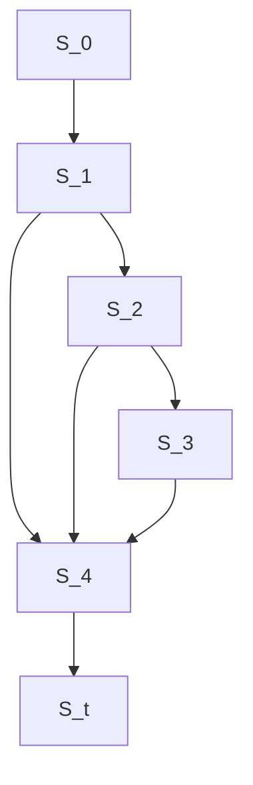
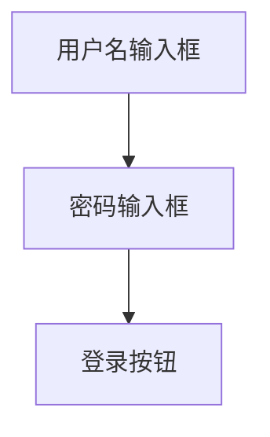
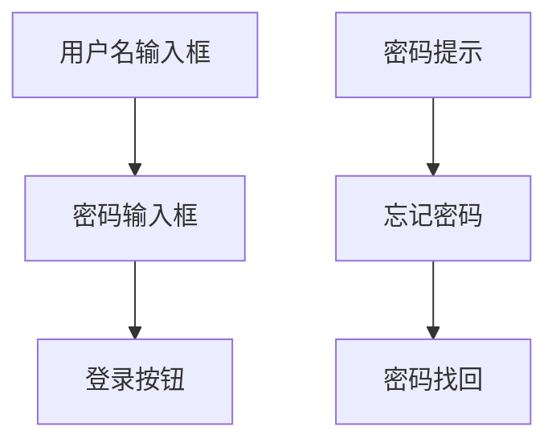
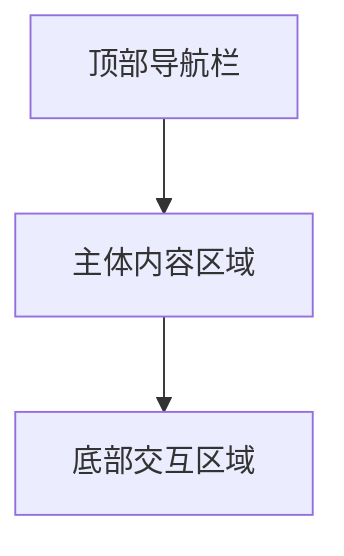
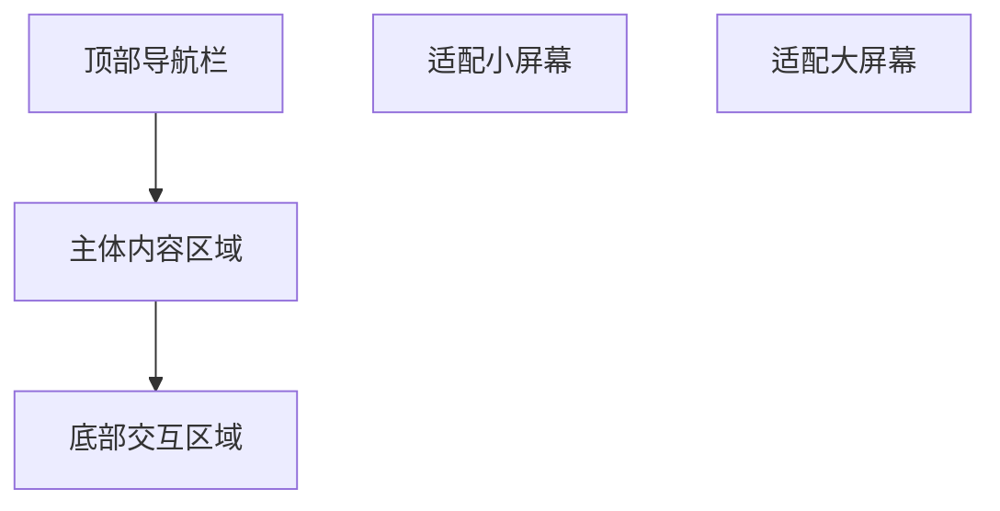
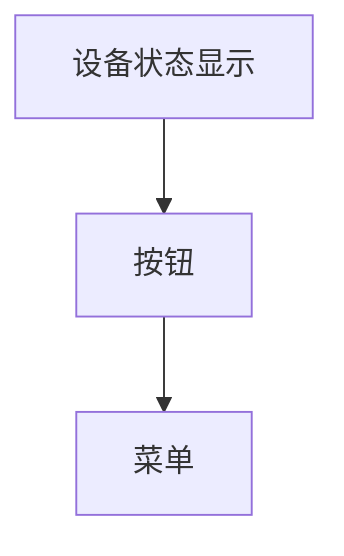
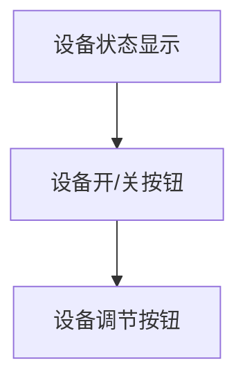
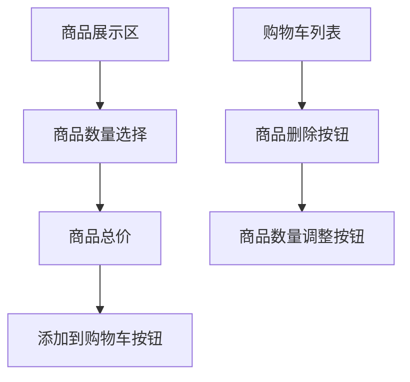
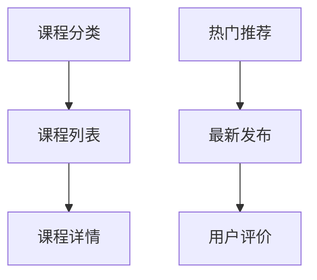
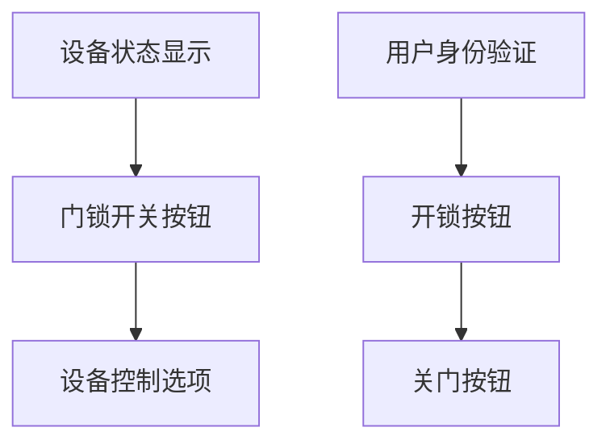

                 

# 用户界面设计：打造友好易用的人机交互

> 关键词：用户界面设计,人机交互,用户体验,易用性,UX/UI设计,交互设计,可用性

## 1. 背景介绍

### 1.1 问题由来
随着计算机技术的不断进步，用户界面设计(UX/UI设计)在软件应用中的地位愈发重要。随着数字化、信息化时代的到来，各类应用软件呈爆发式增长，用户在操作这些软件时，对界面的友好性和易用性有了更高的期待。如何设计出既美观又易用的用户界面，成为软件设计和开发中的一项重要课题。

### 1.2 问题核心关键点
1. **用户体验（User Experience, UX）**：用户在使用软件时的整体体验，包括视觉、听觉、触觉等感官体验，以及对软件功能、操作流程的满意程度。
2. **可用性（Usability）**：用户能否有效地使用软件，是否容易上手，是否能够完成任务。
3. **易用性（Usability）**：软件的操作是否直观，是否需要较少的学习成本，是否符合用户的直觉和习惯。
4. **交互设计（Interaction Design）**：设计用户与软件之间交互的过程，包括界面布局、按钮位置、动画效果等，是实现良好用户体验和可用性的关键。
5. **用户界面（User Interface, UI）**：用户与软件交互的视觉界面，包括图形、颜色、文字等元素的布局和设计。

这些核心概念相互关联，共同构成了用户界面设计的理论基础，旨在提升用户在使用软件时的效率和满意度。

## 2. 核心概念与联系

### 2.1 核心概念概述

为更好地理解用户界面设计的基本原则和设计方法，本节将介绍几个关键概念及其相互关系：

- **用户研究（User Research）**：通过访谈、问卷调查、用户行为分析等方式，深入了解目标用户的需求、偏好、痛点。
- **原型设计（Prototype Design）**：创建用户界面的初步模型，用以验证设计理念和流程，发现潜在问题。
- **交互设计（Interaction Design）**：设计用户与软件交互的流程和方式，保证用户能够自然、流畅地完成任务。
- **视觉设计（Visual Design）**：关注界面的视觉元素，如颜色、字体、图标等，提升界面的视觉吸引力和易用性。
- **可用性测试（Usability Testing）**：通过实际用户的使用反馈，评估界面的可用性，发现并解决设计中的问题。
- **用户界面（User Interface, UI）**：界面设计的最终产品，包括按钮、菜单、标签等元素的布局和设计。

这些概念之间的逻辑关系可以通过以下Mermaid流程图来展示：

```mermaid
graph TB
    A[用户研究] --> B[原型设计]
    B --> C[交互设计]
    B --> D[视觉设计]
    C --> E[可用性测试]
    D --> E
    E --> F[用户界面(UI)]
```

这个流程图展示了大用户界面设计的主要环节及其相互关系：

1. 通过用户研究深入了解用户需求。
2. 根据用户需求设计初步的原型。
3. 进行交互设计和视觉设计，完善原型。
4. 通过可用性测试评估设计效果，发现问题。
5. 根据测试结果调整设计，最终形成完整用户界面。

## 3. 核心算法原理 & 具体操作步骤
### 3.1 算法原理概述

用户界面设计的算法原理，主要涉及用户行为分析、界面布局优化、交互流程设计等多个方面。其核心思想是通过系统化的研究方法和科学的数据分析，设计出既美观又易用的用户界面，提升用户的使用体验和满意度。

用户行为分析是设计过程中重要的环节之一。通过对用户的使用数据进行分析，可以发现用户的操作习惯、常用功能和痛点，从而指导界面设计。常用的行为分析工具包括热图、点击流分析、用户记录等。

界面布局优化则是界面设计中的重要内容。良好的布局设计能够引导用户的视线，减少用户的点击操作，提高操作效率。常用的界面布局方法包括栅格系统、对齐原则、留白处理等。

交互流程设计是用户体验的关键。设计者需要考虑用户如何与界面互动，如何完成任务，如何提供反馈。良好的交互设计能够降低用户的学习成本，提升用户满意度。常用的交互设计方法包括响应式设计、原型测试、动画效果等。

### 3.2 算法步骤详解

用户界面设计的算法步骤一般包括以下几个关键步骤：

**Step 1: 用户研究**

- 通过访谈、问卷调查等方式，收集目标用户的需求和痛点。
- 分析用户行为数据，了解用户在软件中的操作习惯和常用功能。
- 绘制用户角色模型，明确不同用户群体的特点和需求。

**Step 2: 原型设计**

- 创建软件的基本框架，确定界面的主要元素和布局。
- 使用工具如Sketch、Adobe XD等，设计出初步的原型。
- 进行多轮迭代，不断优化设计。

**Step 3: 交互设计**

- 定义用户与界面的交互流程，确保操作直观、自然。
- 使用 wireframe 工具如Figma、Axure等，设计出交互原型。
- 进行用户测试，收集反馈，调整设计。

**Step 4: 视觉设计**

- 选择适合的颜色、字体和图标，提升界面的视觉吸引力。
- 使用设计工具如Photoshop、Illustrator等，进行视觉元素的创作。
- 确保视觉设计符合品牌和市场定位，提升品牌形象。

**Step 5: 可用性测试**

- 招募真实用户，进行可用性测试，评估界面的可用性。
- 记录用户的操作行为和反馈，发现潜在问题。
- 根据测试结果，调整设计，提升用户体验。

**Step 6: 用户界面(UI)实现**

- 将设计方案转化为实际界面，进行编码实现。
- 优化界面的性能和加载速度，提升用户体验。
- 进行全面测试，确保界面的稳定性和可靠性。

以上是用户界面设计的算法步骤。在实际应用中，还需要针对具体项目的特点，对每个环节进行优化设计，如改进用户研究方法，引入更多可用性评估技术，搜索最优的设计方案等，以进一步提升界面设计的质量。

### 3.3 算法优缺点

用户界面设计的算法具有以下优点：

1. 提升了用户体验。通过深入了解用户需求，设计出符合用户直觉和习惯的界面，提升了用户的使用效率和满意度。
2. 优化了交互流程。通过分析用户行为，设计出直观、自然的交互流程，降低了用户的学习成本。
3. 提高了界面的可用性。通过多轮测试和迭代，不断优化界面，确保用户能够顺利完成任务。

同时，该方法也存在一定的局限性：

1. 对设计者要求高。需要具备全面的设计知识和丰富的实践经验，才能设计出优质的界面。
2. 设计成本高。界面设计的每个环节都需要进行多轮测试和迭代，耗时耗力。
3. 缺乏数据支持。部分设计决策缺乏数据支持，可能导致主观性强，效果不佳。
4. 迭代周期长。每个设计环节都需要反复测试和调整，设计周期较长。

尽管存在这些局限性，但就目前而言，用户界面设计的算法方法仍是界面设计的主流范式。未来相关研究的重点在于如何进一步降低设计成本，提高设计效率，同时兼顾用户体验和可用性等因素。

### 3.4 算法应用领域

用户界面设计已经在多个领域得到广泛应用，包括：

- 移动应用：智能手机、平板电脑等移动设备的各类应用软件。
- 桌面软件：PC、Mac等平台上的各类办公、娱乐软件。
- 网页应用：网页端的各种网站和Web应用。
- 数字广告：广告设计和制作，提升用户互动和点击率。
- 游戏设计：游戏界面设计和用户体验优化。
- 智能家居：各类智能设备和系统的界面设计。

除了这些经典应用外，用户界面设计还被创新性地应用到更多场景中，如虚拟现实(VR)、增强现实(AR)、混合现实(MR)等新兴技术领域，为交互设计带来了新的突破。随着技术的发展，用户界面设计将继续拓展应用领域，为数字化时代的产品设计带来新的机遇和挑战。

## 4. 数学模型和公式 & 详细讲解 & 举例说明

### 4.1 数学模型构建

用户界面设计的数学模型主要涉及用户行为分析、界面布局优化、交互流程设计等多个方面。以下将分别进行详细讲解。

**用户行为分析**：
假设用户在界面上的操作次数为 $N$，每次操作的时间为 $T_i$（$i=1,2,\cdots,N$），则用户的总操作时间为：

$$
T_{total} = \sum_{i=1}^N T_i
$$

通过对 $T_i$ 的统计分析，可以发现用户在不同操作上的时间分布，从而指导界面设计。

**界面布局优化**：
界面布局优化通常使用网格系统来实现。假设界面的宽度为 $W$，高度为 $H$，网格系统的行数为 $m$，列数为 $n$，每个单元格的宽度为 $w$，高度为 $h$，则有：

$$
W = m \times w, \quad H = n \times h
$$

通过优化 $m$ 和 $n$ 的值，可以实现界面元素的有效布局。

**交互流程设计**：
交互流程设计可以通过状态图来表示。假设界面的初始状态为 $S_0$，通过用户操作可以到达状态 $S_1, S_2, \cdots, S_k$，最终到达目标状态 $S_t$，则状态转换可以用图论中的有向图表示：



其中，箭头表示操作流程，节点表示状态。通过优化箭头和节点的位置，可以设计出直观、自然的交互流程。

### 4.2 公式推导过程

**用户行为分析的数学推导**：
通过对用户操作时间的统计，可以发现不同操作的平均时间 $t$，则总操作时间 $T_{total}$ 可以表示为：

$$
T_{total} = N \times t
$$

**界面布局优化的数学推导**：
假设每个单元格的面积为 $S_i = w \times h$，则界面的总面积为：

$$
W \times H = \sum_{i=1}^N S_i
$$

通过优化单元格的尺寸和位置，可以最大化界面的面积利用率。

**交互流程设计的数学推导**：
假设每个状态的转移概率为 $p_{i \to j}$，则从初始状态 $S_0$ 到达目标状态 $S_t$ 的概率为：

$$
P_{S_0 \to S_t} = \prod_{i=1}^k p_{i \to i+1}
$$

通过优化状态转移概率，可以设计出更高效的交互流程。

### 4.3 案例分析与讲解

**案例1: 移动应用界面设计**

假设某移动应用的登录界面包括用户名输入框、密码输入框、登录按钮等元素，界面布局如下：



为了优化界面的可用性，设计者可以使用网格系统，将界面分为多个区域：



**案例2: 网页应用界面设计**

假设某网页应用的页面结构包括顶部导航栏、主体内容区域、底部交互区域等，页面布局如下：



为了优化界面的可用性，设计者可以使用自适应布局，根据设备屏幕尺寸调整布局：



**案例3: 智能家居界面设计**

假设某智能家居设备的控制界面包括设备状态显示、按钮、菜单等元素，界面布局如下：



为了优化界面的可用性，设计者可以使用图标设计，提升界面的视觉吸引力：



## 5. 项目实践：代码实例和详细解释说明
### 5.1 开发环境搭建

在进行用户界面设计实践前，我们需要准备好开发环境。以下是使用Python进行SketchUp开发的开发环境配置流程：

1. 安装SketchUp：从官网下载并安装SketchUp，用于创建界面模型。
2. 安装SketchUp Pro：购买SketchUp Pro版，获得更多高级功能。
3. 配置SketchUp插件：安装SketchUp插件，如3D View、Line Style等，提升设计效率。
4. 安装SketchUp扩展程序：安装SketchUp扩展程序，如Interactive Viewport、Measurements等，增强设计功能。

完成上述步骤后，即可在SketchUp中进行界面设计的实践。

### 5.2 源代码详细实现

我们以设计一个简单的移动应用登录界面的代码为例，进行详细实现。

首先，导入必要的库：

```python
from sketchup import SketchUp
```

然后，定义登录界面的设计函数：

```python
def login_page():
    sketchup = SketchUp()
    
    # 创建背景图层
    background_layer = sketchup.create_layer("Background")
    
    # 创建用户名输入框
    username_input = sketchup.create_rectangle((100, 100), (200, 200), layer=background_layer)
    username_input.set_name("Username Input")
    
    # 创建密码输入框
    password_input = sketchup.create_rectangle((300, 100), (400, 200), layer=background_layer)
    password_input.set_name("Password Input")
    
    # 创建登录按钮
    login_button = sketchup.create_button((400, 200), (500, 200), layer=background_layer)
    login_button.set_name("Login Button")
    
    # 保存设计
    sketchup.save("login_page.skp")
```

接着，启动SketchUp并设计登录界面：

```python
login_page()
```

最后，在SketchUp中打开设计文件并查看设计效果：

```python
sketchup.open("login_page.skp")
```

以上就是使用SketchUp进行界面设计的完整代码实现。可以看到，通过简单的Python代码，我们就可以在SketchUp中快速设计出界面模型，并进行修改和优化。

### 5.3 代码解读与分析

让我们再详细解读一下关键代码的实现细节：

**sketchup库**：
- 定义了SketchUp类，用于创建和管理界面元素。

**create_layer函数**：
- 创建新的图层，方便管理界面元素。

**create_rectangle和create_button函数**：
- 创建矩形和按钮，用于模拟界面元素。

**set_name函数**：
- 设置元素名称，方便后期管理和修改。

**save和open函数**：
- 保存和打开SketchUp文件，实现设计的存储和展示。

使用SketchUp进行界面设计，能够直观地看到设计效果，并进行实时修改和优化。但需要注意，SketchUp的主要功能在于3D建模和渲染，对于复杂的界面设计可能还需要配合其他设计工具进行完善。

## 6. 实际应用场景
### 6.1 移动应用设计

移动应用的界面设计是用户界面设计的典型应用场景。通过设计美观、易用的界面，可以提升用户的使用体验，增强用户的黏性。

例如，某电商平台需要设计一个简洁、直观的购物车界面，以提高用户的购物体验。设计者可以通过SketchUp等工具，创建购物车界面的初步模型，并进行迭代优化。最终设计出的界面如下：



这种设计不仅美观，而且直观易懂，用户可以轻松完成添加、修改、删除等操作，提升购物体验。

### 6.2 网页应用设计

网页应用的界面设计同样重要。通过设计友好的界面，可以提高用户的使用效率，增加用户的停留时间。

例如，某在线教育平台需要设计一个清晰的课程目录界面，方便用户浏览和选择课程。设计者可以通过SketchUp等工具，创建课程目录界面的初步模型，并进行迭代优化。最终设计出的界面如下：



这种设计不仅清晰，而且易于导航，用户可以轻松找到感兴趣的课程，提升学习体验。

### 6.3 智能家居设计

智能家居的界面设计需要考虑设备的多样性和交互的复杂性。通过设计美观、易用的界面，可以提升用户的使用体验，增强用户的黏性。

例如，某智能门锁的界面设计需要考虑用户对设备的控制和状态展示。设计者可以通过SketchUp等工具，创建智能门锁界面的初步模型，并进行迭代优化。最终设计出的界面如下：



这种设计不仅美观，而且直观易懂，用户可以轻松完成设备控制和状态展示，提升使用体验。

### 6.4 未来应用展望

未来，随着技术的不断发展，用户界面设计的应用领域将进一步拓展，设计方法也将更加多样化和智能化。

**虚拟现实（VR）和增强现实（AR）**：
VR和AR技术的快速发展，为用户界面设计带来了新的机遇和挑战。设计师可以通过VR和AR技术，设计出更加沉浸式和互动式的界面，提升用户体验。例如，某旅游应用可以利用VR技术，设计出沉浸式的旅游体验界面，让用户仿佛置身于旅游目的地。

**混合现实（MR）**：
MR技术可以将虚拟和现实元素无缝融合，为用户界面设计带来更多可能性。设计师可以通过MR技术，设计出更加自然、直观的界面，提升用户体验。例如，某医疗应用可以利用MR技术，设计出虚拟手术室界面，让用户可以轻松操作手术工具。

**人工智能（AI）**：
AI技术的不断发展，为用户界面设计带来了新的思路和工具。设计师可以通过AI技术，设计出更加智能化和自适应的界面，提升用户体验。例如，某智能客服应用可以利用AI技术，设计出智能对话界面，让用户可以轻松完成问题咨询和问题解答。

## 7. 工具和资源推荐
### 7.1 学习资源推荐

为了帮助开发者系统掌握用户界面设计的理论基础和实践技巧，这里推荐一些优质的学习资源：

1. 《用户界面设计基础》：讲解了用户界面设计的基本概念、设计原则和设计流程，适合入门级学习者。
2. 《交互设计原则》：深入探讨了交互设计的原理和实践方法，适合进阶学习者。
3. 《设计模式与设计原理》：讲解了设计模式的基本概念和应用，适合中级及以上的学习者。
4. 《UX/UI设计案例分析》：通过分析经典的设计案例，讲解了设计思路和设计方法，适合实践应用者。
5. 《SketchUp官方文档》：提供了SketchUp的详细使用说明和操作技巧，适合SketchUp用户。

通过对这些资源的学习实践，相信你一定能够快速掌握用户界面设计的精髓，并用于解决实际的设计问题。
###  7.2 开发工具推荐

高效的开发离不开优秀的工具支持。以下是几款用于用户界面设计开发的常用工具：

1. SketchUp：强大的3D建模和渲染工具，适合创建用户界面模型。
2. Adobe XD：专业的设计工具，适合创建用户界面原型和交互模型。
3. Figma：云端设计工具，支持多人协作，适合团队设计。
4. InVision Studio：在线设计工具，支持高保真原型和用户测试。
5. Sketch：流行的界面设计工具，支持多种界面元素的创建和调整。

合理利用这些工具，可以显著提升用户界面设计的开发效率，加快创新迭代的步伐。

### 7.3 相关论文推荐

用户界面设计的研究源于学界的持续研究。以下是几篇奠基性的相关论文，推荐阅读：

1. 《用户界面设计的人性化考虑》：探讨了用户界面设计中的人性化因素，强调了用户体验的重要性。
2. 《交互设计的基本原则》：阐述了交互设计的核心原则和方法，指导了设计的实践。
3. 《界面设计中的心理学》：介绍了心理学原理在界面设计中的应用，提升了设计的效果。
4. 《虚拟现实中的界面设计》：探讨了VR技术对界面设计的影响，提出了新的设计思路和工具。
5. 《人工智能在界面设计中的应用》：介绍了AI技术在界面设计中的应用，展示了设计的新方向。

这些论文代表了大用户界面设计的研究方向，通过学习这些前沿成果，可以帮助研究者把握学科前进方向，激发更多的创新灵感。

## 8. 总结：未来发展趋势与挑战
### 8.1 研究成果总结

本文对用户界面设计的算法进行了全面系统的介绍。首先阐述了用户界面设计的基本概念和设计方法，明确了用户体验和可用性设计的重要性。其次，从原理到实践，详细讲解了用户界面设计的数学模型和关键步骤，给出了用户界面设计的完整代码实例。同时，本文还广泛探讨了用户界面设计在移动应用、网页应用、智能家居等多个领域的应用前景，展示了用户界面设计的巨大潜力。

通过本文的系统梳理，可以看到，用户界面设计作为软件设计和开发中的重要环节，旨在提升用户的使用体验和满意度，具有广泛的应用前景。未来，伴随技术的不断发展，用户界面设计将继续拓展应用领域，为数字化时代的产品设计带来新的机遇和挑战。

### 8.2 未来发展趋势

展望未来，用户界面设计将呈现以下几个发展趋势：

1. 交互设计将更加自然。随着人工智能和机器学习技术的发展，界面设计将变得更加智能和自适应。例如，智能对话界面可以根据用户的输入，自动调整显示内容和交互方式，提升用户体验。
2. 界面设计将更加个性化。基于用户行为数据分析，界面设计将更加贴近用户需求。例如，个性化推荐界面可以根据用户的兴趣，推荐相关内容，提升用户黏性。
3. 界面设计将更加多样化和国际化。随着全球化的发展，界面设计将更加注重多样化和国际化，满足不同用户的视觉和文化需求。例如，国际化界面设计将支持多语言切换，提升用户体验。
4. 界面设计将更加注重数据驱动。用户行为数据分析将成为设计的重要依据，界面设计将更加数据驱动。例如，数据驱动设计将根据用户的使用数据，不断优化界面，提升用户体验。

以上趋势凸显了用户界面设计的广阔前景。这些方向的探索发展，必将进一步提升用户界面设计的质量，为数字化时代的产品设计带来新的机遇和挑战。

### 8.3 面临的挑战

尽管用户界面设计已经取得了瞩目成就，但在迈向更加智能化、普适化应用的过程中，它仍面临着诸多挑战：

1. 设计成本高。用户界面设计需要经过多轮测试和迭代，耗时耗力。如何降低设计成本，提高设计效率，是重要的研究课题。
2. 数据驱动的设计方法需要优化。数据驱动设计虽然提升了设计的效果，但数据的质量和收集成本较高，需要进一步优化。
3. 界面设计的可解释性需要加强。目前用户界面设计中的决策过程缺乏可解释性，难以对其推理逻辑进行分析和调试。如何赋予界面设计更强的可解释性，将是亟待攻克的难题。
4. 界面设计的安全性需要保障。用户界面设计涉及用户隐私和数据安全，如何保护用户信息，防止信息泄露，是重要的研究课题。
5. 界面设计的可扩展性需要加强。随着应用场景的多样化，界面设计的可扩展性需要进一步加强，以适应不同的应用场景。

正视用户界面设计面临的这些挑战，积极应对并寻求突破，将是大用户界面设计走向成熟的必由之路。相信随着学界和产业界的共同努力，这些挑战终将一一被克服，用户界面设计必将在构建人机协同的智能时代中扮演越来越重要的角色。

### 8.4 研究展望

面对用户界面设计所面临的种种挑战，未来的研究需要在以下几个方面寻求新的突破：

1. 探索更加智能化的设计方法。开发更加智能化和自适应的设计方法，提高设计的效率和效果。例如，基于AI技术的设计方法，可以根据用户行为数据，自动优化界面设计。
2. 引入更多先验知识。将符号化的先验知识，如知识图谱、逻辑规则等，与神经网络模型进行巧妙融合，引导设计过程学习更准确、合理的界面设计。
3. 融合因果分析和博弈论工具。将因果分析方法引入设计过程，识别出设计决策的关键特征，增强设计的因果性和逻辑性。借助博弈论工具刻画用户行为，主动探索并规避设计的脆弱点，提高设计系统的稳定性。
4. 纳入伦理道德约束。在界面设计目标中引入伦理导向的评估指标，过滤和惩罚有害的设计方案，确保设计符合用户价值观和伦理道德。
5. 结合多模态数据。将视觉、触觉、声音等多种模态数据融合到界面设计中，提升设计的丰富性和互动性。例如，结合触觉反馈的界面设计，可以提高用户的操作体验。

这些研究方向的探索，必将引领用户界面设计技术迈向更高的台阶，为构建安全、可靠、可解释、可控的智能系统铺平道路。面向未来，用户界面设计需要与其他人工智能技术进行更深入的融合，如知识表示、因果推理、强化学习等，多路径协同发力，共同推动人工智能技术的进步。只有勇于创新、敢于突破，才能不断拓展界面设计的边界，让智能技术更好地造福人类社会。

## 9. 附录：常见问题与解答

**Q1：用户界面设计的核心是什么？**

A: 用户界面设计的核心是用户体验和可用性。通过设计友好的界面，提升用户的使用效率和满意度，确保用户能够顺利完成任务，减少学习成本。

**Q2：如何设计出美观易用的界面？**

A: 设计美观易用的界面需要综合考虑视觉、交互和可用性等多个方面。具体步骤包括：
1. 通过用户研究了解用户需求和痛点，明确设计目标。
2. 通过原型设计创建初步界面模型，进行多轮迭代优化。
3. 通过交互设计定义用户操作流程，确保操作直观、自然。
4. 通过视觉设计提升界面的视觉吸引力和易用性。
5. 通过可用性测试评估设计效果，发现并解决设计中的问题。

**Q3：界面设计的成本如何控制？**

A: 界面设计的成本可以通过以下几个方面进行控制：
1. 优化设计流程，减少测试和迭代次数。
2. 利用数据分析，提升设计效率。
3. 引入AI技术，自动优化界面设计。
4. 利用云端工具，减少本地开发成本。

**Q4：界面设计的未来发展方向是什么？**

A: 界面设计的未来发展方向包括：
1. 智能化设计：利用AI技术，提升设计的效率和效果。
2. 数据驱动设计：通过用户行为数据分析，优化界面设计。
3. 多样化设计：结合视觉、触觉、声音等多种模态数据，提升设计的丰富性和互动性。
4. 可解释性设计：增强设计的可解释性，提升设计决策的透明度。

**Q5：界面设计的目标是什么？**

A: 界面设计的目标是通过设计友好的界面，提升用户的使用效率和满意度，确保用户能够顺利完成任务，减少学习成本。具体目标包括：
1. 提升用户的使用效率，降低用户的学习成本。
2. 提升用户的满意度，增强用户的黏性。
3. 确保用户能够顺利完成任务，减少操作错误。

综上所述，用户界面设计作为软件设计和开发中的重要环节，旨在提升用户的使用体验和满意度，具有广泛的应用前景。未来，伴随技术的不断发展，用户界面设计将继续拓展应用领域，为数字化时代的产品设计带来新的机遇和挑战。开发者需要不断学习和实践，掌握最新的设计方法和工具，才能设计出更加友好、易用的界面，提升用户的使用体验。

---

作者：禅与计算机程序设计艺术 / Zen and the Art of Computer Programming

