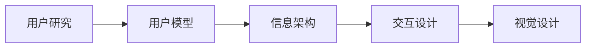
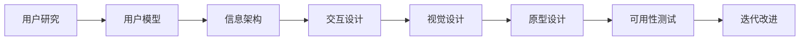

                 

# 用户界面设计：打造友好易用的人机交互体验

## 1. 背景介绍

随着技术的不断进步，用户界面设计(UX Design)已经成为了构建现代应用程序和网站的核心要素。一个友好易用的用户界面可以显著提升用户的使用体验，增加用户粘性，降低开发和运营成本。然而，尽管许多开发者都希望设计出优秀的用户界面，但往往因缺乏系统性的指导而无法达到预期效果。本文旨在全面系统地介绍用户界面设计的核心概念和实践技巧，从理论到实操，全方位剖析如何打造高效易用的用户界面。

## 2. 核心概念与联系

### 2.1 核心概念概述

在设计用户界面时，我们需要考虑以下几个核心概念：

- **用户研究（User Research）**：通过调研了解目标用户的需求、行为和痛点，从而指导界面设计的方向和细节。
- **用户模型（User Model）**：基于用户研究，构建用户的行为模型，如用户画像、任务流等，用于指导界面设计。
- **信息架构（Information Architecture）**：规划网站或应用中的信息组织方式，确保信息呈现的结构合理、逻辑清晰。
- **交互设计（Interaction Design）**：设计用户与系统的交互方式，如按钮、菜单、表单等，使交互流畅自然。
- **视觉设计（Visual Design）**：通过颜色、字体、布局等视觉元素，提升界面的审美和辨识度。

这些概念相互关联，共同构成了用户界面设计的整体框架。下面将通过一个Mermaid流程图来展示这些概念之间的联系：

### 2.2 核心概念原理和架构的 Mermaid 流程图

## 3. 核心算法原理 & 具体操作步骤

### 3.1 算法原理概述

用户界面设计虽然不是算法驱动，但其核心思想在于通过优化用户与系统的交互过程，提升用户体验。具体来说，用户界面设计涉及以下几个步骤：

1. **用户研究**：通过问卷调查、用户访谈、用户测试等方式，收集用户数据。
2. **信息架构设计**：根据用户研究结果，设计信息组织结构，确保信息以合理的方式呈现。
3. **交互设计**：设计用户与系统的交互方式，确保操作简便、直观。
4. **视觉设计**：根据信息架构和交互设计，选择合适的视觉元素，提升界面美观度和辨识度。
5. **原型设计**：通过原型工具（如Sketch、Figma等）构建用户界面的初步原型。
6. **可用性测试**：在原型上测试用户的使用体验，收集反馈进行迭代改进。
7. **迭代改进**：根据测试结果和用户反馈，不断优化设计，直到达到最佳用户体验。

### 3.2 算法步骤详解

#### 步骤1：用户研究

用户研究是界面设计的起点。以下是具体步骤：

1. **调研方法**：问卷调查、用户访谈、用户测试、用户日记等。
2. **调研工具**：SurveyMonkey、Google Forms、Qualtrics等。
3. **调研内容**：用户需求、痛点、行为、心理状态等。
4. **调研结果**：用户画像、任务流、使用场景等。

#### 步骤2：信息架构设计

信息架构设计需要考虑以下几个方面：

1. **目标**：确保信息的呈现方式符合用户认知模型，便于用户查找和使用。
2. **工具**：卡片排序、树形结构、导航地图等。
3. **考虑因素**：内容分类、用户任务、技术限制等。

#### 步骤3：交互设计

交互设计旨在通过合理的设计，使用户操作简便、直观。以下是具体步骤：

1. **界面元素**：按钮、菜单、表单等。
2. **交互方式**：点击、拖放、滑动、悬停等。
3. **设计原则**：一致性、可预测性、反馈性等。
4. **工具**：Adobe XD、Sketch、Figma等。

#### 步骤4：视觉设计

视觉设计需要考虑以下几个方面：

1. **颜色**：选择符合品牌和用户心理的颜色方案。
2. **字体**：选择易读性和美观性兼顾的字体。
3. **布局**：设计合理的页面布局，确保信息层次分明。
4. **工具**：Photoshop、Illustrator、Sketch等。

#### 步骤5：原型设计

原型设计是用户界面设计的关键步骤，以下是具体步骤：

1. **工具**：Sketch、Figma、Adobe XD等。
2. **原型类型**：低保真原型、高保真原型。
3. **考虑因素**：用户界面布局、交互逻辑、视觉风格等。
4. **原型测试**：获取用户反馈，进行迭代优化。

#### 步骤6：可用性测试

可用性测试旨在评估用户界面的易用性，以下是具体步骤：

1. **测试方法**：A/B测试、用户任务测试、专家评估等。
2. **测试工具**：Lookback.io、UserTesting.com、Optimal Workshop等。
3. **测试内容**：用户操作流程、任务完成时间、用户满意度等。
4. **测试结果**：优化设计、发现问题、改进建议等。

#### 步骤7：迭代改进

迭代改进是用户界面设计的循环过程，以下是具体步骤：

1. **设计优化**：根据测试结果和用户反馈，不断优化设计。
2. **测试验证**：再次进行可用性测试，评估优化效果。
3. **发布上线**：发布优化后的用户界面，收集用户反馈。
4. **持续改进**：持续收集用户反馈，进行迭代优化。

### 3.3 算法优缺点

用户界面设计的优点包括：

1. **提升用户体验**：合理的设计可以显著提升用户的使用体验，增加用户粘性。
2. **降低开发和运营成本**：通过优化用户界面，可以减少用户流失，降低开发和运营成本。
3. **提高用户满意度**：优秀的用户界面可以提升用户的整体满意度。

用户界面设计的缺点包括：

1. **设计复杂度高**：设计需要考虑多方面因素，如用户需求、信息架构、交互逻辑等。
2. **测试周期长**：可用性测试和迭代优化需要耗费大量时间和精力。
3. **需要多学科协作**：用户界面设计需要设计师、开发者、产品经理等多学科协作。

### 3.4 算法应用领域

用户界面设计在多个领域都有广泛应用，包括：

- **网站设计**：优化网站的导航、布局、交互等，提升用户浏览体验。
- **移动应用设计**：设计移动应用的UI元素、交互逻辑等，提升用户操作体验。
- **游戏设计**：设计游戏的UI界面、交互方式等，提升用户游戏体验。
- **教育软件设计**：设计教育软件的UI界面、交互方式等，提升用户学习体验。
- **智能家居设计**：设计智能家居设备的UI界面、交互方式等，提升用户使用体验。

## 4. 数学模型和公式 & 详细讲解 & 举例说明

尽管用户界面设计不涉及复杂的数学模型，但在某些方面仍需要借助数学工具进行分析和优化。以下是几个常见的案例：

### 4.1 数学模型构建

#### 案例1：信息架构设计中的卡片排序

卡片排序（Card Sorting）是一种信息架构设计的常用方法，其基本思想是通过让用户对信息卡片进行排序，确定信息组织的优先级。

假设我们有5个信息卡片，分别代表用户手册、帮助文档、社区论坛、FAQ和在线客服，可以构建如下数学模型：

$$
\text{Total Score} = \sum_{i=1}^{5} \text{Score}_i
$$

其中，$\text{Score}_i$ 表示第 $i$ 个卡片的排序得分。

### 4.2 公式推导过程

#### 案例2：交互设计中的点击路径优化

点击路径（Click Path）是用户与界面交互的重要指标，通过优化点击路径可以提升用户操作效率。

假设用户从主页到完成某个任务需要点击 $n$ 个页面，每个页面有 $m$ 个可点击元素，每个元素的点击概率为 $p$，则用户完成操作的期望点击次数为：

$$
E(\text{Clicks}) = \sum_{i=1}^{n} m_i \times p_i
$$

其中，$m_i$ 和 $p_i$ 分别表示第 $i$ 个页面的可点击元素个数和点击概率。

### 4.3 案例分析与讲解

#### 案例3：视觉设计中的颜色搭配

颜色搭配（Color Palette）是视觉设计的重要内容，通过选择合适的颜色方案可以提升界面的辨识度和美观度。

假设我们选择了 $k$ 种颜色，每种颜色的权重为 $w_k$，颜色的组合方式为 $c$，则用户界面的颜色搭配得分可以表示为：

$$
\text{Color Score} = \sum_{k=1}^{k} w_k \times c_k
$$

其中，$w_k$ 和 $c_k$ 分别表示第 $k$ 种颜色的权重和组合方式。

## 5. 项目实践：代码实例和详细解释说明

### 5.1 开发环境搭建

在进行用户界面设计的实践时，我们需要搭建合适的开发环境。以下是具体步骤：

1. **安装设计工具**：Sketch、Adobe XD、Figma等。
2. **安装原型工具**：InVision、Sketch Prototype、Figma Prototype等。
3. **安装测试工具**：UserTesting.com、Optimal Workshop、Hotjar等。
4. **安装代码协作工具**：Git、Bitbucket、GitHub等。

### 5.2 源代码详细实现

由于用户界面设计主要涉及界面和交互设计，不涉及复杂的编程任务，因此无具体的源代码实现。

### 5.3 代码解读与分析

用户界面设计的代码实现主要集中在设计工具和原型工具的使用上。以Sketch为例，其核心操作包括：

1. **图层（Layers）**：设计界面元素的基础。
2. **组（Groups）**：将多个图层组合在一起，便于管理和修改。
3. **样式（Styles）**：统一界面元素的设计风格，提升界面的一致性。
4. **导航（Navigation）**：设计界面的导航方式，如侧边栏、顶部导航栏等。
5. **原型（Prototypes）**：将设计转化为交互原型，进行用户测试。

### 5.4 运行结果展示

用户界面设计的最终成果是用户界面的原型图和设计文档。以下是具体展示：

- **原型图**：使用Sketch、Adobe XD等工具设计出的界面原型图。
- **设计文档**：包含设计思路、设计逻辑、设计方案等详细描述的设计文档。

## 6. 实际应用场景

### 6.1 网站设计

网站设计是用户界面设计的经典应用场景，以下是具体示例：

1. **首页设计**：设计网站的首页布局，包括导航栏、logo、搜索框等。
2. **产品页面设计**：设计产品页面的布局和交互方式，如产品介绍、用户评价、购买按钮等。
3. **搜索页面设计**：设计搜索页面的布局和交互方式，如搜索框、搜索结果展示等。

### 6.2 移动应用设计

移动应用设计是用户界面设计的另一个重要领域，以下是具体示例：

1. **登录页面设计**：设计登录页面的布局和交互方式，如用户名、密码、登录按钮等。
2. **导航设计**：设计应用的导航方式，如标签栏、底部导航栏等。
3. **推送通知设计**：设计推送通知的界面和交互方式，提升用户使用体验。

### 6.3 游戏设计

游戏设计需要考虑用户的游戏体验和操作效率，以下是具体示例：

1. **游戏界面设计**：设计游戏的UI界面，如角色信息、任务列表、背包等。
2. **交互设计**：设计游戏中的交互方式，如点击、拖动、滑动等。
3. **界面反馈设计**：设计游戏中的界面反馈，如提示信息、音效、动画等。

### 6.4 教育软件设计

教育软件设计需要考虑学生的学习体验和操作效率，以下是具体示例：

1. **课程界面设计**：设计课程界面的布局和交互方式，如课程目录、课时列表、学习进度等。
2. **作业界面设计**：设计作业界面的布局和交互方式，如题目展示、答案提交、成绩查看等。
3. **互动界面设计**：设计互动界面的布局和交互方式，如论坛、讨论区、在线答疑等。

### 6.5 智能家居设计

智能家居设计需要考虑用户的使用体验和操作便捷性，以下是具体示例：

1. **设备界面设计**：设计智能家居设备的UI界面，如灯光控制、温度调节、安全监控等。
2. **交互设计**：设计智能家居设备的交互方式，如语音控制、手势识别、触摸屏等。
3. **界面反馈设计**：设计智能家居设备的界面反馈，如指示灯、语音反馈、动画效果等。

## 7. 工具和资源推荐

### 7.1 学习资源推荐

为了帮助开发者系统掌握用户界面设计的理论基础和实践技巧，这里推荐一些优质的学习资源：

1. **《Don't Make Me Think》**：Steve Krug的经典之作，介绍了用户界面设计的基本原则和技巧。
2. **《Designing Interfaces》**：Jared Spool的著作，深入讲解了用户界面设计的理论和实践。
3. **《Interaction Design Foundation》**：提供丰富的在线课程和设计资源，涵盖用户界面设计的各个方面。
4. **《Nielsen Norman Group》**：提供最新的用户界面设计研究和案例分析，帮助设计师提升设计水平。
5. **《UX Design Workshops》**：通过在线工作坊和课程，系统学习用户界面设计的全流程。

### 7.2 开发工具推荐

用户界面设计主要涉及设计工具和原型工具，以下是几款推荐的工具：

1. **Sketch**：苹果公司推出的设计工具，广泛用于UI设计。
2. **Adobe XD**：Adobe公司的设计工具，支持矢量图形和原型设计。
3. **Figma**：Cloud-based设计工具，支持多人协作设计。
4. **InVision**：原型设计和用户体验测试工具，支持高保真原型。
5. **UserTesting.com**：用户体验测试平台，提供用户测试和反馈功能。

### 7.3 相关论文推荐

用户界面设计的研究方向多样，以下是几篇经典的研究论文：

1. **《Evaluating the Effectiveness of Interactive Proxies》**：研究交互式代理（Interactive Proxies）对用户体验的影响。
2. **《Design Patterns for Interaction Design》**：总结了交互设计的常见模式和设计原则。
3. **《Designing Responsive Web Interfaces》**：介绍响应式设计的实现方法和优化策略。
4. **《Human-Computer Interaction Design》**：提供全面的交互设计理论和实践指南。
5. **《A Comprehensive Review of Visual Design Patterns》**：综述了视觉设计中的常见模式和应用场景。

## 8. 总结：未来发展趋势与挑战

### 8.1 未来发展趋势

用户界面设计将在未来继续发展和创新，以下是几个发展趋势：

1. **响应式设计**：适应不同设备尺寸和分辨率的界面设计，提升跨平台体验。
2. **动态界面**：通过JavaScript等技术实现动态效果，提升用户交互体验。
3. **情感化设计**：通过情感化设计（Emotional Design），提升用户情感共鸣和品牌亲和力。
4. **个性化设计**：通过个性化设计（Personalized Design），满足用户个性化需求。
5. **多感官设计**：结合视觉、听觉、触觉等多感官体验，提升用户综合体验。

### 8.2 面临的挑战

用户界面设计虽然前景广阔，但在实践中仍面临诸多挑战：

1. **设计规范一致性**：不同平台和设备的界面设计规范不一致，需要开发者进行适应性设计。
2. **用户需求多样性**：用户需求和偏好多样，需要设计师进行灵活设计。
3. **技术复杂性**：现代UI设计涉及前端技术、用户体验等多个方面，需要设计师具备全面的技能。
4. **数据驱动设计**：需要从用户数据中提取设计灵感，提升设计的科学性和有效性。
5. **设计工具局限性**：现有设计工具在性能和功能上仍有局限，需要不断改进和创新。

### 8.3 研究展望

未来的用户界面设计研究将更加注重数据驱动和跨学科融合，以下是几个研究方向：

1. **数据驱动设计**：通过用户数据分析，指导设计决策，提升设计效果。
2. **跨学科融合**：结合心理学、社会学、人机交互等学科知识，提升设计深度和广度。
3. **个性化设计**：通过机器学习等技术，实现用户行为和偏好的自动化分析，提供个性化设计方案。
4. **多感官设计**：结合视觉、听觉、触觉等多感官体验，提升用户综合体验。
5. **情感化设计**：通过情感化设计（Emotional Design），提升用户情感共鸣和品牌亲和力。

## 9. 附录：常见问题与解答

**Q1：什么是用户界面设计？**

A: 用户界面设计（User Interface Design，简称UI设计）是设计软件或硬件的用户接口，使它们更加直观、易于使用和吸引人。

**Q2：用户界面设计需要哪些技能？**

A: 用户界面设计需要以下技能：
1. 用户体验（User Experience，UX）设计：关注用户使用产品的感受和体验。
2. 视觉设计（Visual Design）：关注界面的视觉美观和可识别性。
3. 交互设计（Interaction Design）：关注用户与系统的交互方式。
4. 前端技术：如HTML、CSS、JavaScript等。
5. 原型工具：如Sketch、Adobe XD等。

**Q3：如何提高用户界面设计的效率？**

A: 提高用户界面设计的效率可以通过以下方法：
1. 设计模板和规范：使用通用的设计模板和规范，快速生成界面原型。
2. 使用设计工具：使用Sketch、Adobe XD等设计工具，提升设计效率。
3. 组件库（Component Library）：创建和复用常用的设计组件，减少重复工作。
4. 自动化设计工具：使用自动化设计工具，如Designbot、SketchBot等，生成设计资源。

**Q4：用户界面设计的核心原则是什么？**

A: 用户界面设计的核心原则包括：
1. 简洁性（Simplicity）：设计简洁明了，避免过度复杂。
2. 一致性（Consistency）：界面元素的设计风格和布局保持一致。
3. 可预测性（Predictability）：用户可以预测界面元素的行为和交互方式。
4. 反馈性（Feedback）：及时反馈用户的操作结果。
5. 可用性（Usability）：设计易用、高效的界面，提升用户的使用体验。

**Q5：如何进行用户界面设计的测试？**

A: 用户界面设计的测试包括可用性测试和A/B测试，具体步骤如下：
1. 可用性测试：在真实用户环境中，测试用户的使用体验，收集反馈进行迭代优化。
2. A/B测试：将界面设计方案进行对比测试，选择用户满意度更高的方案。
3. 测试工具：使用UserTesting.com、Hotjar等工具进行测试。

---

作者：禅与计算机程序设计艺术 / Zen and the Art of Computer Programming

