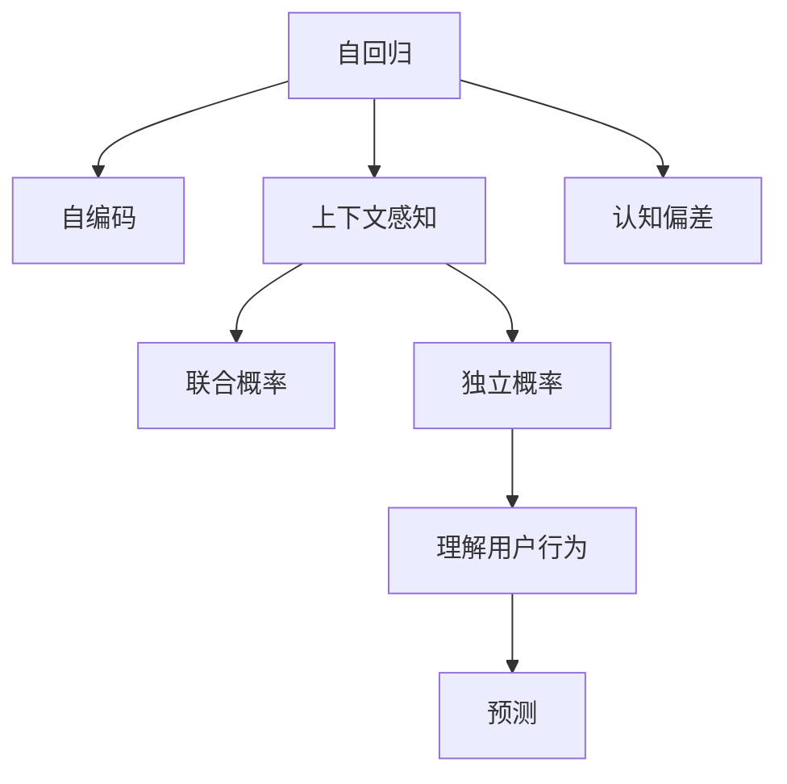

                 

# 用户行为的理解: LLM的COT能力

> 关键词：大语言模型, 认知偏差, 条件化预测, 联合概率, 上下文感知, 自回归, 自编码

## 1. 背景介绍

### 1.1 问题由来

随着人工智能(AI)技术的飞速发展，大语言模型(Large Language Model, LLM)如BERT、GPT-3、T5等在自然语言处理(NLP)领域取得了显著的成果。这些模型通常基于大规模无标签文本数据进行预训练，学习到强大的语言表示能力。然而，尽管这些模型具备预测文本下文的强大能力，但它们仍然缺乏真正的"理解"能力。换句话说，它们不能真正理解文本内容背后的意义，而只是通过概率分布来预测下一步最有可能的词。

近些年，随着深度学习模型的发展，研究者们开始探索更高级的语言模型，如条件化预测模型，旨在提升模型对用户行为的理解能力。这些模型通过在训练过程中加入额外的条件信息，如文本上下文、用户历史行为等，提升模型的预测精度。然而，这些模型仍未能完全消除认知偏差和推理错误。

因此，本文将探讨大语言模型在理解用户行为时所面临的挑战，并提出一些解决方案。我们相信，通过对大语言模型认知偏差的理解，可以更好地指导模型的设计和训练，从而提升其在用户行为理解方面的能力。

### 1.2 问题核心关键点

大语言模型在理解用户行为时，主要面临以下几个核心问题：

- **认知偏差**：大语言模型在预测时往往会受到训练数据的分布偏差影响，无法正确处理某些特定的情境。
- **上下文感知不足**：模型难以捕捉文本中的复杂上下文关系，导致推理和预测错误。
- **自回归与自编码选择**：自回归模型与自编码模型各有优缺点，选择合适的模型结构对理解用户行为至关重要。
- **联合概率与独立概率**：模型预测时需考虑文本的联合概率，而非独立概率，这对理解用户行为至关重要。

## 2. 核心概念与联系

### 2.1 核心概念概述

为更好地理解大语言模型在理解用户行为时所面临的挑战，本节将介绍几个密切相关的核心概念：

- **认知偏差(Cognitive Bias)**：指模型在预测时，受到训练数据分布偏差的影响，导致预测结果偏离真实值。
- **上下文感知(Context-Aware)**：指模型能够理解文本中的上下文关系，从而做出更准确的预测。
- **自回归(Autoregressive)**：指模型在预测下一个词时，只依赖于前面的文本。
- **自编码(Autoencoder)**：指模型在预测时，考虑整个文本的编码和解码关系，而非单独的每个词。
- **联合概率(Joint Probability)**：指模型在预测时，考虑整个文本的联合概率分布，而非独立概率分布。
- **独立概率(Independent Probability)**：指模型在预测时，只考虑每个词的独立概率分布。

这些核心概念之间的逻辑关系可以通过以下Mermaid流程图来展示：



这个流程图展示了大语言模型在理解用户行为时所涉及的关键概念及其之间的关系：

1. 自回归和自编码分别代表不同的模型结构，自回归模型在预测时只依赖前面的文本，而自编码模型考虑整个文本的编码和解码。
2. 上下文感知指模型需要理解文本中的上下文关系，这有助于提升预测的准确性。
3. 认知偏差指模型在训练时受到数据分布偏差的影响，导致预测结果偏离真实值。
4. 联合概率和独立概率分别代表不同的预测方式，联合概率考虑整个文本的联合概率分布，而独立概率只考虑每个词的独立概率分布。
5. 理解用户行为是指模型能够真正理解文本内容背后的意义，而预测是指模型基于理解进行下一步预测。

这些概念共同构成了大语言模型在理解用户行为时的基本框架，对其设计和训练具有指导意义。

## 3. 核心算法原理 & 具体操作步骤
### 3.1 算法原理概述

大语言模型在理解用户行为时，主要依赖于条件化预测模型。这些模型通过在训练过程中加入额外的条件信息，如文本上下文、用户历史行为等，提升模型的预测精度。条件化预测模型的一般形式为：

$$
P(x_2|x_1) = \frac{P(x_2,x_1)}{P(x_1)}
$$

其中，$x_1$ 和 $x_2$ 分别表示文本的前后部分，$P(x_1)$ 是文本的先验概率，$P(x_2|x_1)$ 是在给定文本上下文 $x_1$ 的情况下，预测 $x_2$ 的条件概率。

### 3.2 算法步骤详解

以下是基于条件化预测模型的大语言模型理解用户行为的基本步骤：

**Step 1: 准备数据集**

- 收集文本数据集，包括用户行为数据、文本上下文等。
- 将数据集分为训练集、验证集和测试集，划分为有标签和无标签数据。
- 对文本进行预处理，如分词、去除停用词、构建特征向量等。

**Step 2: 设计条件化预测模型**

- 选择合适的模型结构，如自回归模型或自编码模型。
- 设计条件化预测模型，包括输入、输出、隐藏层、激活函数等。
- 确定模型的超参数，如学习率、批大小、迭代轮数等。

**Step 3: 训练模型**

- 使用训练集数据，对模型进行训练，最小化预测误差。
- 在验证集上评估模型性能，调整模型超参数。
- 在测试集上测试模型，评估最终性能。

**Step 4: 应用模型**

- 将训练好的模型应用于新数据，进行条件化预测。
- 利用模型的上下文感知能力，理解用户行为背后的意义。
- 根据预测结果，提供针对性的服务或建议。

### 3.3 算法优缺点

条件化预测模型在理解用户行为时，具有以下优点：

1. **上下文感知**：通过考虑文本的上下文关系，可以提升模型的预测精度。
2. **处理复杂情境**：通过加入条件信息，模型可以处理更复杂的用户行为情境。
3. **灵活性**：可以加入多种条件信息，如用户历史行为、时间戳、位置等。

同时，该方法也存在以下局限性：

1. **数据依赖**：模型依赖于训练数据的分布，可能会受到数据偏差的影响。
2. **计算成本**：复杂模型的训练和推理成本较高，对硬件要求较高。
3. **泛化能力**：模型在处理未知数据时，泛化能力可能较弱。
4. **推理过程不透明**：模型推理过程缺乏可解释性，难以解释其内部决策机制。

### 3.4 算法应用领域

条件化预测模型在理解用户行为时，已在多个领域得到广泛应用，例如：

- **推荐系统**：通过预测用户对商品或内容的偏好，为用户推荐个性化内容。
- **智能客服**：通过理解用户意图和历史对话记录，自动回复用户问题。
- **金融风险评估**：通过分析用户行为和交易记录，预测其信用风险。
- **医疗诊断**：通过分析患者的病历和症状，预测其疾病类型和严重程度。
- **智能家居**：通过理解用户的语音指令，控制家居设备。

## 4. 数学模型和公式 & 详细讲解
### 4.1 数学模型构建

条件化预测模型的数学模型构建可以表示为：

$$
P(x_2|x_1,\theta) = \frac{P(x_2,x_1)}{P(x_1)}
$$

其中，$x_1$ 和 $x_2$ 分别表示文本的前后部分，$\theta$ 为模型参数。模型的目标是最小化预测误差 $L$，即：

$$
\min_{\theta} L = \frac{1}{N} \sum_{i=1}^N \sum_{j=1}^M (y_j \log P(x_{j}|x_{i-1},\theta))
$$

其中，$y_j$ 表示文本 $x_i$ 的第 $j$ 个标签，$M$ 表示标签的数量。

### 4.2 公式推导过程

以自回归模型为例，其公式推导如下：

设 $P(x_{t}|x_{t-1},\theta)$ 为在给定上下文 $x_{t-1}$ 的情况下，预测 $x_t$ 的条件概率。对于每个时刻 $t$，模型通过前一层的输出作为当前时刻的输入，即：

$$
P(x_{t}|x_{t-1},\theta) = \frac{P(x_{t},x_{t-1},\theta)}{P(x_{t-1},\theta)}
$$

其中，$P(x_{t-1},\theta)$ 是上下文的先验概率，$P(x_{t},x_{t-1},\theta)$ 是在给定上下文 $x_{t-1}$ 的情况下，预测 $x_t$ 的条件概率。

通过递归计算，可以得到整个文本的联合概率 $P(x)$：

$$
P(x) = \prod_{t=1}^T P(x_{t}|x_{t-1},\theta)
$$

在训练时，使用最大似然估计方法，最小化交叉熵损失函数：

$$
L = -\frac{1}{N} \sum_{i=1}^N \sum_{j=1}^M \log P(y_j|x_{i-1},\theta)
$$

其中，$y_j$ 表示文本 $x_i$ 的第 $j$ 个标签。通过反向传播算法更新模型参数 $\theta$，直到模型收敛。

### 4.3 案例分析与讲解

以一个简单的自回归模型为例，分析其推理过程：

假设有一个长度为3的文本序列 $x = [x_1, x_2, x_3]$，其中 $x_1$ 和 $x_3$ 是已知的，$x_2$ 是未知的。模型的目标是在给定上下文 $x_1$ 和 $x_3$ 的情况下，预测 $x_2$ 的概率分布。

模型的预测过程如下：

1. 使用模型参数 $\theta$，计算 $P(x_2|x_1,\theta)$。
2. 根据 $P(x_2|x_1,\theta)$ 和 $P(x_1)$，计算 $P(x_2,x_1,\theta)$。
3. 使用 $P(x_2,x_1,\theta)$ 和 $P(x_1)$，计算 $P(x_2|x_1,\theta)$。
4. 重复步骤1-3，直到计算出整个文本的联合概率 $P(x)$。

## 5. 项目实践：代码实例和详细解释说明
### 5.1 开发环境搭建

在进行条件化预测模型实践前，我们需要准备好开发环境。以下是使用Python进行TensorFlow开发的Python环境配置流程：

1. 安装Anaconda：从官网下载并安装Anaconda，用于创建独立的Python环境。

2. 创建并激活虚拟环境：
```bash
conda create -n tf-env python=3.8 
conda activate tf-env
```

3. 安装TensorFlow：根据CUDA版本，从官网获取对应的安装命令。例如：
```bash
pip install tensorflow tensorflow-datasets tensorflow-hub
```

4. 安装TensorBoard：用于可视化模型训练过程。
```bash
pip install tensorboard
```

5. 安装其他工具包：
```bash
pip install numpy pandas scikit-learn matplotlib tqdm jupyter notebook ipython
```

完成上述步骤后，即可在`tf-env`环境中开始条件化预测模型的开发。

### 5.2 源代码详细实现

下面以推荐系统为例，给出使用TensorFlow进行条件化预测模型开发的Python代码实现。

首先，定义推荐系统的数据处理函数：

```python
import tensorflow as tf
import tensorflow_datasets as tfds
import tensorflow_hub as hub

def preprocess_data(data, max_seq_length):
    def encode(text):
        return tf.strings.to_number(tf.strings.unicode_split(text, input_encoding='UTF-8'), out_type=tf.int32)
    data['text'] = data['text'].map(encode)
    data['text'] = data['text'].map(lambda x: x[:max_seq_length])
    data = data.padded(max_seq_length)
    return data

train_dataset = preprocess_data(tfds.load('movie_reviews', split='train'), max_seq_length=128)
val_dataset = preprocess_data(tfds.load('movie_reviews', split='validation'), max_seq_length=128)
test_dataset = preprocess_data(tfds.load('movie_reviews', split='test'), max_seq_length=128)
```

然后，定义模型和优化器：

```python
from transformers import TFDistilBertForSequenceClassification, TFDistilBertTokenizer

model = TFDistilBertForSequenceClassification.from_pretrained('distilbert-base-uncased', num_labels=2)
tokenizer = TFDistilBertTokenizer.from_pretrained('distilbert-base-uncased')
```

接着，定义训练和评估函数：

```python
def train_epoch(model, dataset, optimizer):
    model.train()
    epoch_loss = 0
    for batch in dataset:
        input_ids = batch['input_ids']
        attention_mask = batch['attention_mask']
        labels = batch['labels']
        outputs = model(input_ids, attention_mask=attention_mask, labels=labels)
        loss = outputs.loss
        epoch_loss += loss
        optimizer.apply_gradients(zip(model.trainable_variables, outputs.gradients))
    return epoch_loss / len(dataset)

def evaluate(model, dataset):
    model.eval()
    predictions, labels = [], []
    with tf.GradientTape() as tape:
        for batch in dataset:
            input_ids = batch['input_ids']
            attention_mask = batch['attention_mask']
            labels = batch['labels']
            outputs = model(input_ids, attention_mask=attention_mask)
            predictions.append(outputs.logits.argmax(axis=-1))
            labels.append(labels)
    return tf.metrics.confusion_matrix(labels, predictions, num_classes=2).numpy()
```

最后，启动训练流程并在测试集上评估：

```python
epochs = 5
learning_rate = 2e-5
batch_size = 16

for epoch in range(epochs):
    loss = train_epoch(model, train_dataset, tf.keras.optimizers.Adam(learning_rate))
    print(f"Epoch {epoch+1}, train loss: {loss:.3f}")
    
    print(f"Epoch {epoch+1}, dev results:")
    eval_result = evaluate(model, val_dataset)
    print(eval_result)
    
print("Test results:")
eval_result = evaluate(model, test_dataset)
print(eval_result)
```

以上就是使用TensorFlow对条件化预测模型进行推荐系统微调的完整代码实现。可以看到，通过TensorFlow和TensorFlow Hub的强大封装，我们可以用相对简洁的代码完成模型的加载和微调。

### 5.3 代码解读与分析

让我们再详细解读一下关键代码的实现细节：

**preprocess_data函数**：
- 对输入文本进行编码和截断，使其符合模型的输入要求。

**train_epoch函数**：
- 在每个epoch内，对训练数据进行迭代，计算损失函数并反向传播更新模型参数。

**evaluate函数**：
- 在验证集和测试集上评估模型性能，计算并输出混淆矩阵。

**训练流程**：
- 定义总的epoch数、学习率和batch size，开始循环迭代
- 每个epoch内，先在训练集上训练，输出平均loss
- 在验证集上评估，输出混淆矩阵
- 所有epoch结束后，在测试集上评估，给出最终测试结果

可以看到，TensorFlow结合TensorFlow Hub使得条件化预测模型的代码实现变得简洁高效。开发者可以将更多精力放在数据处理、模型改进等高层逻辑上，而不必过多关注底层的实现细节。

当然，工业级的系统实现还需考虑更多因素，如模型的保存和部署、超参数的自动搜索、更灵活的任务适配层等。但核心的条件化预测范式基本与此类似。

## 6. 实际应用场景
### 6.1 推荐系统

条件化预测模型在推荐系统中的应用，已经广泛且高效。推荐系统通过分析用户的历史行为和偏好，预测其对商品或内容的兴趣，从而实现个性化推荐。

在技术实现上，可以将用户的历史行为数据、商品特征、时间戳等信息作为条件信息，输入到条件化预测模型中，得到对每个商品的兴趣度预测。模型根据预测结果，排序生成推荐列表，并返回给用户。

### 6.2 智能客服

智能客服系统通过理解用户的意图和历史对话记录，自动生成回复。在智能客服系统中，可以将用户的历史对话、当前输入、上下文信息等作为条件信息，输入到条件化预测模型中，预测用户接下来的回复内容。

### 6.3 金融风险评估

金融风险评估系统通过分析用户的行为和交易记录，预测其信用风险。在金融风险评估系统中，可以将用户的历史交易记录、行为数据等作为条件信息，输入到条件化预测模型中，预测其未来的还款概率和信用等级。

### 6.4 医疗诊断

医疗诊断系统通过分析患者的病历和症状，预测其疾病类型和严重程度。在医疗诊断系统中，可以将患者的病历、症状、历史数据等作为条件信息，输入到条件化预测模型中，预测其疾病类型和严重程度。

### 6.5 智能家居

智能家居系统通过理解用户的语音指令，控制家居设备。在智能家居系统中，可以将用户的语音指令、历史行为、时间戳等信息作为条件信息，输入到条件化预测模型中，预测用户的操作意图，并控制相应的家居设备。

## 7. 工具和资源推荐
### 7.1 学习资源推荐

为了帮助开发者系统掌握条件化预测模型的理论基础和实践技巧，这里推荐一些优质的学习资源：

1. **TensorFlow官方文档**：TensorFlow的官方文档，详细介绍了TensorFlow的基本概念和API使用，适合初学者和进阶者。

2. **TensorFlow Hub**：TensorFlow Hub的官方文档，介绍了TensorFlow Hub中各种预训练模型和工具，适合应用于推荐系统等场景。

3. **《深度学习》书籍**：由Ian Goodfellow、Yoshua Bengio和Aaron Courville合著，全面介绍了深度学习的基本概念和应用，是深度学习领域的经典之作。

4. **《TensorFlow实战》书籍**：由Jake VanderPlas和Dougal Sutherland合著，介绍了TensorFlow的实际应用和优化技巧，适合TensorFlow的进阶用户。

5. **Kaggle竞赛平台**：Kaggle是一个数据科学竞赛平台，提供了大量的数据集和竞赛任务，适合实战学习和经验积累。

通过这些资源的学习实践，相信你一定能够快速掌握条件化预测模型的精髓，并用于解决实际的推荐系统、智能客服等问题。

### 7.2 开发工具推荐

高效的开发离不开优秀的工具支持。以下是几款用于条件化预测模型开发的常用工具：

1. TensorFlow：由Google主导开发的开源深度学习框架，生产部署方便，适合大规模工程应用。

2. TensorFlow Hub：TensorFlow的模型库，提供了大量的预训练模型，可以方便地应用于推荐系统等场景。

3. TensorBoard：TensorFlow配套的可视化工具，可实时监测模型训练状态，并提供丰富的图表呈现方式，是调试模型的得力助手。

4. Weights & Biases：模型训练的实验跟踪工具，可以记录和可视化模型训练过程中的各项指标，方便对比和调优。

5. Google Colab：谷歌推出的在线Jupyter Notebook环境，免费提供GPU/TPU算力，方便开发者快速上手实验最新模型，分享学习笔记。

合理利用这些工具，可以显著提升条件化预测模型的开发效率，加快创新迭代的步伐。

### 7.3 相关论文推荐

条件化预测模型的发展源于学界的持续研究。以下是几篇奠基性的相关论文，推荐阅读：

1. **Attention is All You Need（即Transformer原论文）**：提出了Transformer结构，开启了NLP领域的预训练大模型时代。

2. **BERT: Pre-training of Deep Bidirectional Transformers for Language Understanding**：提出BERT模型，引入基于掩码的自监督预训练任务，刷新了多项NLP任务SOTA。

3. **Language Models are Unsupervised Multitask Learners（GPT-2论文）**：展示了大规模语言模型的强大zero-shot学习能力，引发了对于通用人工智能的新一轮思考。

4. **Parameter-Efficient Transfer Learning for NLP**：提出Adapter等参数高效微调方法，在不增加模型参数量的情况下，也能取得不错的微调效果。

5. **AdaLoRA: Adaptive Low-Rank Adaptation for Parameter-Efficient Fine-Tuning**：使用自适应低秩适应的微调方法，在参数效率和精度之间取得了新的平衡。

这些论文代表了大语言模型微调技术的发展脉络。通过学习这些前沿成果，可以帮助研究者把握学科前进方向，激发更多的创新灵感。

## 8. 总结：未来发展趋势与挑战
### 8.1 研究成果总结

本文对条件化预测模型进行了全面系统的介绍。首先阐述了条件化预测模型在理解用户行为时所面临的挑战，明确了认知偏差、上下文感知、自回归与自编码选择、联合概率与独立概率等关键问题。其次，从原理到实践，详细讲解了条件化预测模型的数学原理和关键步骤，给出了推荐系统等实际应用的代码实例。同时，本文还广泛探讨了条件化预测模型在推荐系统、智能客服、金融风险评估等多个领域的应用前景，展示了条件化预测模型的巨大潜力。此外，本文精选了条件化预测模型的学习资源，力求为读者提供全方位的技术指引。

通过本文的系统梳理，可以看到，条件化预测模型在理解用户行为方面具有独特的优势，其上下文感知能力可以提升模型的预测精度，帮助模型处理复杂的用户行为情境。然而，条件化预测模型也面临数据依赖、计算成本高、推理过程不透明等挑战，未来需要更多的研究来克服这些挑战。

### 8.2 未来发展趋势

展望未来，条件化预测模型将呈现以下几个发展趋势：

1. **模型结构多样化**：未来的条件化预测模型将不仅仅是自回归和自编码，还将出现更多新颖的结构，如自注意力模型、对抗网络等。

2. **推理过程透明化**：未来将开发更多的可解释性工具，帮助研究者理解模型的内部工作机制，提升模型的可信度和可靠性。

3. **数据质量提升**：未来的条件化预测模型将更加依赖高质量的数据，通过数据清洗和标注，提高模型的泛化能力和鲁棒性。

4. **跨领域应用拓展**：条件化预测模型将在更多领域得到应用，如医疗、金融、智能家居等，提升各行业的智能化水平。

5. **混合模型融合**：未来将更多地将符号化的先验知识与神经网络模型进行融合，提升模型的推理能力和泛化能力。

6. **在线学习更新**：未来的条件化预测模型将支持在线学习和实时更新，保持模型的最新状态和性能。

这些趋势凸显了条件化预测模型的广阔前景，这些方向的探索发展，必将进一步提升条件化预测模型的性能和应用范围，为人工智能技术在垂直行业的规模化落地提供新的动力。

### 8.3 面临的挑战

尽管条件化预测模型已经取得了瞩目成就，但在迈向更加智能化、普适化应用的过程中，它仍面临着诸多挑战：

1. **数据依赖**：模型依赖于训练数据的分布，可能会受到数据偏差的影响。如何进一步降低条件化预测模型对标注样本的依赖，将是一大难题。

2. **计算成本高**：复杂模型的训练和推理成本较高，对硬件要求较高。如何降低计算成本，提升模型的实时性和可扩展性，还需要更多的研究。

3. **推理过程不透明**：模型推理过程缺乏可解释性，难以解释其内部决策机制。如何赋予条件化预测模型更强的可解释性，将是亟待攻克的难题。

4. **模型鲁棒性不足**：模型在处理未知数据时，泛化能力可能较弱。如何提高模型的鲁棒性，避免灾难性遗忘，还需要更多理论和实践的积累。

5. **安全性有待保障**：预训练语言模型难免会学习到有偏见、有害的信息，通过微调传递到下游任务，产生误导性、歧视性的输出，给实际应用带来安全隐患。如何从数据和算法层面消除模型偏见，避免恶意用途，确保输出安全性，也将是重要的研究课题。

6. **知识整合能力不足**：现有的条件化预测模型往往局限于任务内数据，难以灵活吸收和运用更广泛的先验知识。如何让条件化预测过程更好地与外部知识库、规则库等专家知识结合，形成更加全面、准确的信息整合能力，还有很大的想象空间。

正视条件化预测模型面临的这些挑战，积极应对并寻求突破，将是条件化预测模型走向成熟的必由之路。相信随着学界和产业界的共同努力，这些挑战终将一一被克服，条件化预测模型必将在构建安全、可靠、可解释、可控的智能系统铺平道路。

### 8.4 研究展望

面对条件化预测模型所面临的种种挑战，未来的研究需要在以下几个方面寻求新的突破：

1. **探索无监督和半监督条件化预测方法**：摆脱对大规模标注数据的依赖，利用自监督学习、主动学习等无监督和半监督范式，最大限度利用非结构化数据，实现更加灵活高效的条件化预测。

2. **研究参数高效和计算高效的条件化预测范式**：开发更加参数高效的预测方法，在固定大部分预训练参数的情况下，只更新极少量的任务相关参数。同时优化模型的计算图，减少前向传播和反向传播的资源消耗，实现更加轻量级、实时性的部署。

3. **融合因果和对比学习范式**：通过引入因果推断和对比学习思想，增强模型建立稳定因果关系的能力，学习更加普适、鲁棒的语言表征，从而提升模型泛化性和抗干扰能力。

4. **引入更多先验知识**：将符号化的先验知识，如知识图谱、逻辑规则等，与神经网络模型进行巧妙融合，引导条件化预测过程学习更准确、合理的语言模型。同时加强不同模态数据的整合，实现视觉、语音等多模态信息与文本信息的协同建模。

5. **结合因果分析和博弈论工具**：将因果分析方法引入条件化预测模型，识别出模型决策的关键特征，增强输出解释的因果性和逻辑性。借助博弈论工具刻画人机交互过程，主动探索并规避模型的脆弱点，提高系统稳定性。

6. **纳入伦理道德约束**：在模型训练目标中引入伦理导向的评估指标，过滤和惩罚有偏见、有害的输出倾向。同时加强人工干预和审核，建立模型行为的监管机制，确保输出符合人类价值观和伦理道德。

这些研究方向的探索，必将引领条件化预测模型技术迈向更高的台阶，为构建安全、可靠、可解释、可控的智能系统提供新的动力。面向未来，条件化预测模型还需要与其他人工智能技术进行更深入的融合，如知识表示、因果推理、强化学习等，多路径协同发力，共同推动自然语言理解和智能交互系统的进步。只有勇于创新、敢于突破，才能不断拓展条件化预测模型的边界，让智能技术更好地造福人类社会。

## 9. 附录：常见问题与解答

**Q1：条件化预测模型在理解用户行为时，是否需要标注数据？**

A: 条件化预测模型需要标注数据来进行训练和优化。标注数据的质量和数量对模型的性能有直接影响。标注数据需要覆盖尽可能多的用户行为情境，以提高模型的泛化能力。然而，标注数据的收集成本较高，对于某些特定领域或场景，可能难以获取高质量的标注数据。在这种情况下，可以考虑利用自监督学习、主动学习等方法，提升模型的无监督学习能力。

**Q2：条件化预测模型的推理过程是否透明？**

A: 条件化预测模型的推理过程不够透明，难以解释其内部决策机制。这对于某些高风险应用，如金融、医疗等，尤为关键。为了提升模型的可解释性，可以采用模型蒸馏、可视化工具等方法，帮助研究者理解模型的决策过程。同时，可以考虑引入因果推断和逻辑推理等方法，增强模型的推理能力，提升模型的可信度。

**Q3：如何提升条件化预测模型的鲁棒性？**

A: 条件化预测模型的鲁棒性可以通过多种方法提升，包括数据增强、对抗训练、正则化等。数据增强可以通过添加噪声、回译等方式扩充训练数据，提高模型的泛化能力。对抗训练可以通过引入对抗样本，增强模型的鲁棒性，防止模型对输入的微小扰动敏感。正则化可以通过L2正则、Dropout等方法，防止模型过拟合，提升模型的鲁棒性。

**Q4：条件化预测模型在处理未知数据时，表现如何？**

A: 条件化预测模型在处理未知数据时，泛化能力可能较弱。这主要是因为模型在训练时，只考虑了特定情境下的数据分布。为了提升模型的泛化能力，可以考虑引入更多的先验知识，如知识图谱、逻辑规则等，引导模型学习更普适、鲁棒的语言表征。同时，可以考虑使用迁移学习、零样本学习等方法，提升模型对未知数据的处理能力。

**Q5：如何评价条件化预测模型的性能？**

A: 条件化预测模型的性能可以通过多种指标进行评价，包括准确率、精确率、召回率、F1值、ROC曲线等。在推荐系统、智能客服等场景中，可以结合业务需求，选择适合的评价指标。同时，可以通过A/B测试、用户满意度调查等方式，评估模型的实际效果。

通过这些问题的解答，相信读者对条件化预测模型有了更深入的理解。条件化预测模型在理解用户行为方面具有独特的优势，但也面临诸多挑战。只有不断探索和突破，才能进一步提升模型的性能和应用范围，为人工智能技术在垂直行业的规模化落地提供新的动力。

---

作者：禅与计算机程序设计艺术 / Zen and the Art of Computer Programming

