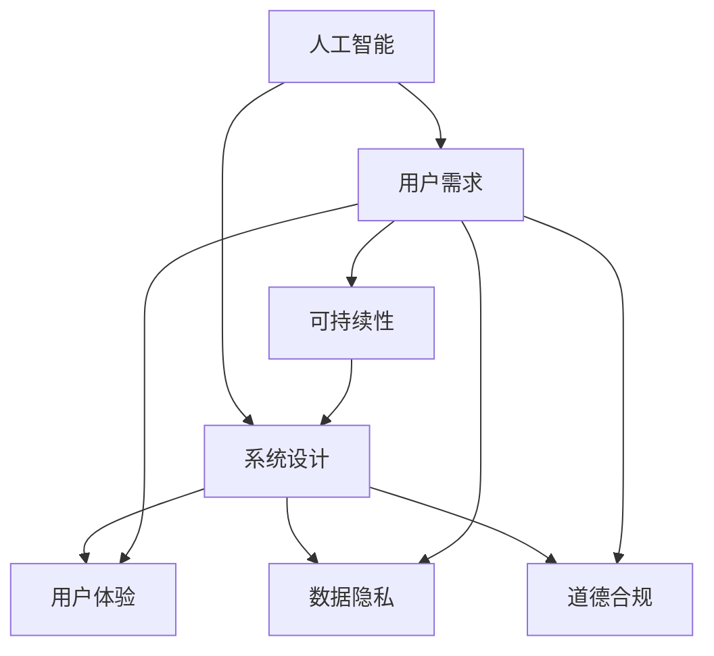

                 

# 用户需求：AI 发展的指南

> 关键词：人工智能, 用户需求, 技术发展, 系统设计, 用户体验, 创新应用

## 1. 背景介绍

### 1.1 问题由来

随着人工智能(AI)技术的快速演进，其在众多领域中的实际应用已初现端倪。从自动驾驶、智能客服到智慧医疗、个性化推荐，AI技术正在改变人们的生活方式，提升各行各业的工作效率。然而，技术的迅猛发展并未带来与之相匹配的用户体验。

用户对于AI技术的需求不再仅仅是功能完备，而是更加关注易用性、安全性、隐私保护、道德合规等方面。AI的开发者和应用者们如何更好地理解用户需求，构建更为自然、人性化、可靠的AI系统，成为当前亟待解决的问题。

### 1.2 问题核心关键点

1. **易用性**：如何通过简化操作流程、提升界面友好度，使用户能够便捷地使用AI系统，减少用户的学习成本。

2. **安全性**：如何在保障数据隐私的同时，确保AI系统的安全稳定，避免潜在的风险和漏洞。

3. **隐私保护**：如何收集、存储和使用用户数据，同时尊重用户的隐私权，保护数据不被滥用。

4. **道德合规**：如何设计和使用AI系统，使其符合社会伦理和法律法规的要求。

5. **用户体验**：如何通过个性化、交互式的设计，提升用户的使用体验，满足用户的个性化需求。

6. **创新应用**：如何结合最新的AI技术，探索新的应用场景，创造前所未有的价值。

7. **可持续性**：如何确保AI系统的长期稳定运行，使其能够在不断变化的业务环境中持续发展。

理解并解决这些核心问题，将有助于AI技术的广泛应用和健康发展。

## 2. 核心概念与联系

### 2.1 核心概念概述

为更好地理解用户需求与AI技术发展之间的关系，本节将介绍几个密切相关的核心概念：

- **人工智能 (AI)**：通过机器学习、深度学习等技术实现的数据驱动决策系统，可以执行复杂的计算任务，并在多领域中表现出超越人类的能力。

- **用户需求**：用户在实际使用AI系统时所期望的功能、性能、体验等，通常可以通过用户调研、用户反馈、用户行为分析等方式获取。

- **系统设计 (System Design)**：将用户需求转化为具体的技术实现方案，包括系统架构、算法设计、功能模块划分等。

- **用户体验 (User Experience, UX)**：用户在使用AI系统时所感受到的直观体验，包括交互便捷性、视觉设计、响应速度等方面。

- **数据隐私 (Data Privacy)**：在AI系统中，如何保护用户的个人信息，避免数据泄露和滥用。

- **道德合规 (Ethical Compliance)**：确保AI系统的设计、开发和使用过程符合伦理和法律规定。

这些核心概念之间的逻辑关系可以通过以下Mermaid流程图来展示：



这个流程图展示了大语言模型的核心概念及其之间的关系：

1. 人工智能通过机器学习等技术，从海量数据中提取知识，形成智能决策能力。
2. 用户需求通过调研等方式获取，指导系统设计。
3. 系统设计将用户需求转化为具体的技术方案，包括界面设计、功能实现等。
4. 用户体验关注系统的易用性和直观感受，直接影响用户满意度。
5. 数据隐私和道德合规是构建AI系统的底线，保障用户信息安全。
6. 可持续性保障系统长期稳定运行，满足未来的业务需求。

这些概念共同构成了AI技术的核心框架，指导AI系统的设计与开发。

## 3. 核心算法原理 & 具体操作步骤
### 3.1 算法原理概述

用户需求导向的AI系统设计，其核心在于通过合理的算法和技术手段，将用户需求转化为可执行的AI模型和功能模块。

基于用户需求的AI系统设计，一般遵循以下步骤：

1. **需求调研与分析**：通过问卷调查、用户访谈、数据分析等方式，收集和分析用户需求。
2. **需求建模**：将用户需求转化为具体的技术要求，如数据格式、功能接口、性能指标等。
3. **系统设计**：设计系统的架构、算法实现、功能模块等。
4. **用户测试**：在实际环境中测试系统，收集用户反馈，优化用户体验。
5. **迭代优化**：根据用户反馈，不断改进系统，提升性能和用户体验。

### 3.2 算法步骤详解

**Step 1: 需求调研与分析**

- **问卷调查**：通过设计调查问卷，收集用户的基本特征、行为习惯、使用场景等数据。
- **用户访谈**：与用户进行面对面或在线访谈，深入了解用户需求和使用体验。
- **数据分析**：通过分析用户行为数据、系统日志等，挖掘用户需求和痛点。

**Step 2: 需求建模**

- **数据格式设计**：确定数据输入输出格式，如文本、图像、语音等，以及数据处理流程。
- **功能接口定义**：明确系统应提供哪些功能模块，如推荐系统、聊天机器人、情感分析等。
- **性能指标设定**：设定系统应达到的性能指标，如响应时间、精度、准确率等。

**Step 3: 系统设计**

- **架构设计**：设计系统的总体架构，如服务架构、微服务架构、API网关等。
- **算法实现**：选择或设计合适的算法，如机器学习算法、深度学习算法等，实现系统功能。
- **功能模块划分**：将系统功能划分为独立的模块，每个模块负责特定的功能。

**Step 4: 用户测试**

- **场景模拟**：在预设的典型使用场景下测试系统，确保系统按预期运行。
- **用户体验评估**：通过用户测试，评估系统的易用性、直观性、交互性等方面。
- **反馈收集与分析**：收集用户反馈，分析其使用中的问题，进行优化。

**Step 5: 迭代优化**

- **功能优化**：根据用户反馈，优化系统功能，提升用户体验。
- **性能优化**：通过算法优化、资源配置等方式提升系统性能，如响应速度、准确率等。
- **界面优化**：优化用户界面设计，提高用户的操作体验。

### 3.3 算法优缺点

基于用户需求的AI系统设计具有以下优点：

1. **用户导向**：通过深入了解用户需求，能够更好地满足用户的使用习惯和期望，提升用户满意度。
2. **需求匹配**：能够根据用户需求设计出最适合的功能和界面，避免功能冗余和体验差的问题。
3. **快速迭代**：能够通过用户反馈快速迭代优化，实现快速的产品迭代和功能升级。

然而，该方法也存在一些局限性：

1. **数据依赖**：对用户调研数据的依赖较大，数据质量直接影响系统设计。
2. **用户差异**：用户需求千差万别，难以覆盖所有用户的需求。
3. **需求变动**：用户需求随时间变化，系统需要不断调整，维护成本较高。

### 3.4 算法应用领域

基于用户需求的AI系统设计，在多个领域中都有广泛应用，例如：

- **智能客服系统**：通过用户调研了解常见问题，设计合适的知识库和问答模型，提升客服效率和用户满意度。
- **个性化推荐系统**：通过用户行为数据，分析用户偏好，推荐最适合的内容和产品，提升用户体验。
- **医疗健康应用**：通过用户健康数据，设计个性化健康方案，提升用户的健康水平和满意度。
- **智能家居系统**：通过用户习惯和生活场景，设计智能家居设备和功能，提升用户的生活便利性。
- **金融科技应用**：通过用户理财需求，设计个性化理财方案，提升用户的理财体验和收益。

以上领域只是冰山一角，基于用户需求的AI系统设计在更多行业和场景中都有广泛应用。

## 4. 数学模型和公式 & 详细讲解
### 4.1 数学模型构建

用户需求导向的AI系统设计，可以从用户需求中提取关键特征，构建数学模型，通过算法优化满足用户需求。

假设用户需求可以通过一组特征向量 $x \in \mathbb{R}^n$ 描述，AI系统的目标是找到一个最优的决策函数 $f(x)$，使其在满足需求的前提下，最大化用户满意度。

形式化地，我们可以定义一个损失函数 $\mathcal{L}(f)$，表示系统输出与用户需求之间的差距。目标是最小化损失函数，即：

$$
\min_{f} \mathcal{L}(f)
$$

其中，$f$ 为决策函数，$\mathcal{L}$ 为损失函数，通过优化算法不断调整决策函数，最小化损失函数。

### 4.2 公式推导过程

以推荐系统为例，假设用户需求可以用一个向量 $x \in \{0,1\}^m$ 描述，其中 $x_i=1$ 表示用户对物品 $i$ 感兴趣，$x_i=0$ 表示不感兴趣。推荐系统的目标是为每个用户推荐 $k$ 个最相关的物品，最大化用户的满意度。

假设推荐系统的预测函数为 $f(x) \in \mathbb{R}^k$，表示为每个用户推荐 $k$ 个物品的评分，推荐算法可以通过最大化用户的满意度评分 $y$ 来优化损失函数，即：

$$
\min_{f} \mathcal{L}(f) = \sum_{i=1}^m \sum_{j=1}^k -y_{i,j} \log f_i + (1-y_{i,j}) \log (1-f_i)
$$

其中 $y_{i,j}$ 为物品 $i$ 是否被用户选择，$\log f_i$ 为物品 $i$ 被用户选择的概率，$(1-f_i)$ 为物品 $i$ 不被用户选择的概率。

### 4.3 案例分析与讲解

**案例分析：智能推荐系统的设计**

假设我们希望设计一个智能推荐系统，帮助用户发现感兴趣的电影。首先，我们需要通过调研和分析，确定用户喜欢的电影类型、评分、时长等关键特征，形成一个特征向量 $x$。然后，我们可以设计一个简单的线性回归模型：

$$
f(x) = \theta_0 + \sum_{i=1}^n \theta_i x_i
$$

其中 $\theta_0$ 为截距，$\theta_i$ 为特征权重，$x_i$ 为特征向量中的第 $i$ 个元素。

我们可以使用随机梯度下降等优化算法，最小化损失函数：

$$
\min_{\theta} \sum_{i=1}^m \sum_{j=1}^k -y_{i,j} \log f_i + (1-y_{i,j}) \log (1-f_i)
$$

通过不断迭代优化，我们最终得到一个最优的决策函数 $f(x)$，用于预测每个用户对不同电影的评分，从而实现智能推荐。

## 5. 项目实践：代码实例和详细解释说明
### 5.1 开发环境搭建

在进行用户需求导向的AI系统设计前，我们需要准备好开发环境。以下是使用Python进行PyTorch开发的环境配置流程：

1. 安装Anaconda：从官网下载并安装Anaconda，用于创建独立的Python环境。

2. 创建并激活虚拟环境：
```bash
conda create -n pytorch-env python=3.8 
conda activate pytorch-env
```

3. 安装PyTorch：根据CUDA版本，从官网获取对应的安装命令。例如：
```bash
conda install pytorch torchvision torchaudio cudatoolkit=11.1 -c pytorch -c conda-forge
```

4. 安装TensorFlow：
```bash
pip install tensorflow
```

5. 安装各类工具包：
```bash
pip install numpy pandas scikit-learn matplotlib tqdm jupyter notebook ipython
```

完成上述步骤后，即可在`pytorch-env`环境中开始系统设计实践。

### 5.2 源代码详细实现

下面我们以智能推荐系统为例，给出使用PyTorch进行模型设计和优化的PyTorch代码实现。

首先，定义推荐系统的训练数据：

```python
import pandas as pd
import numpy as np
from sklearn.model_selection import train_test_split

# 读取数据
df = pd.read_csv('recommendation_data.csv')

# 数据预处理
X = df.drop('label', axis=1)
y = df['label']
X_train, X_test, y_train, y_test = train_test_split(X, y, test_size=0.2, random_state=42)
```

然后，定义模型和损失函数：

```python
from torch import nn
from torch.nn import BCELoss

class RecommendationModel(nn.Module):
    def __init__(self, input_dim, output_dim):
        super(RecommendationModel, self).__init__()
        self.fc = nn.Linear(input_dim, output_dim)
        self.sigmoid = nn.Sigmoid()
    
    def forward(self, x):
        x = self.fc(x)
        return self.sigmoid(x)

# 定义损失函数
criterion = BCELoss()
```

接着，定义训练和评估函数：

```python
from torch.utils.data import DataLoader
from tqdm import tqdm

# 模型训练
model = RecommendationModel(input_dim=10, output_dim=2)
optimizer = torch.optim.SGD(model.parameters(), lr=0.01)

def train_epoch(model, data_loader, optimizer):
    model.train()
    total_loss = 0
    for data, target in data_loader:
        optimizer.zero_grad()
        output = model(data)
        loss = criterion(output, target)
        loss.backward()
        optimizer.step()
        total_loss += loss.item()
    return total_loss / len(data_loader)

def evaluate(model, data_loader):
    model.eval()
    total_loss = 0
    total_correct = 0
    for data, target in data_loader:
        output = model(data)
        loss = criterion(output, target)
        total_loss += loss.item()
        _, predicted = torch.max(output, 1)
        total_correct += (predicted == target).sum().item()
    return total_loss / len(data_loader), total_correct / len(data_loader.dataset)
```

最后，启动训练流程并在测试集上评估：

```python
epochs = 10

for epoch in range(epochs):
    train_loss = train_epoch(model, train_loader)
    val_loss, val_acc = evaluate(model, val_loader)
    print(f'Epoch {epoch+1}, train loss: {train_loss:.4f}, val loss: {val_loss:.4f}, val acc: {val_acc:.4f}')
```

以上就是使用PyTorch进行智能推荐系统设计的完整代码实现。可以看到，通过简单的线性回归模型和优化算法，我们便能够实现基本的推荐系统功能。

### 5.3 代码解读与分析

让我们再详细解读一下关键代码的实现细节：

**推荐系统类**：
- `__init__`方法：初始化线性回归层和Sigmoid激活函数。
- `forward`方法：定义前向传播，通过线性回归和Sigmoid函数计算预测值。

**损失函数**：
- 定义二元交叉熵损失函数，用于衡量预测值和真实值之间的差距。

**训练函数**：
- `train_epoch`方法：在每个epoch内，对训练集进行迭代训练，计算并返回损失值。
- `evaluate`方法：在验证集上评估模型，计算损失和准确率。

**训练流程**：
- 设置总的epoch数，并循环迭代
- 每个epoch内，先训练模型，后评估模型，并输出训练和验证结果

通过上述代码实现，我们可以看到，用户需求导向的AI系统设计可以通过数据驱动的方式，快速实现模型的设计和优化，从而满足用户的实际需求。

当然，工业级的系统设计还需要考虑更多因素，如模型保存和部署、超参数自动搜索、用户界面设计等。但核心的设计思路基本与此类似。

## 6. 实际应用场景
### 6.1 智能客服系统

智能客服系统作为AI技术的重要应用之一，通过用户需求导向的设计，能够提供快速、准确的客户服务。

具体而言，可以通过用户调研，了解客户常遇到的常见问题，设计相应的知识库和问答系统。系统通过分析用户输入，匹配合适的答案，并在必要时引导用户进一步提问。

### 6.2 个性化推荐系统

个性化推荐系统能够根据用户的历史行为和偏好，推荐最合适的商品或内容。

用户调研可以通过分析用户的浏览记录、购买历史、评分等数据，了解用户的兴趣点。然后，通过设计推荐算法和模型，为用户推荐最相关的商品或内容，提升用户体验。

### 6.3 医疗健康应用

医疗健康应用需要精准地为用户提供个性化健康建议。

通过调研用户的健康数据，如年龄、性别、生活方式等，设计个性化的健康建议方案。系统可以实时监测用户的健康数据，提供及时的健康建议，提升用户的健康水平和满意度。

### 6.4 未来应用展望

随着用户需求导向的AI系统设计的不断进步，其在更多领域中得到应用，为各行各业带来变革性影响。

在智慧医疗领域，智能健康管理系统可以提供个性化健康建议，辅助医生诊断，提升医疗服务的智能化水平。

在智能教育领域，个性化学习系统可以根据学生的学习情况，提供个性化的学习计划和推荐，提升学习效果。

在智慧城市治理中，智能城市管理系统可以通过数据分析，优化城市资源配置，提升城市管理效率。

此外，在企业生产、社会治理、文娱传媒等众多领域，基于用户需求的AI系统设计也将不断涌现，为经济社会发展注入新的动力。相信随着技术的日益成熟，用户需求导向的AI系统设计必将在构建人机协同的智能时代中扮演越来越重要的角色。

## 7. 工具和资源推荐
### 7.1 学习资源推荐

为了帮助开发者系统掌握用户需求导向的AI系统设计的理论基础和实践技巧，这里推荐一些优质的学习资源：

1. **《人工智能基础》系列课程**：提供从基础到进阶的全面课程，涵盖机器学习、深度学习、自然语言处理等AI核心技术。

2. **Google AI 开发者指南**：提供丰富的AI开发教程、案例分析，涵盖AI开发、模型部署、性能调优等方面。

3. **Coursera AI 课程**：提供多门优质的AI课程，涵盖AI基础、机器学习、深度学习等，由知名高校和公司提供。

4. **Kaggle 数据科学竞赛平台**：提供丰富的数据集和竞赛，通过实际项目训练AI技能，积累实战经验。

5. **GitHub AI 项目**：提供众多开源AI项目，了解前沿技术，学习代码实现。

通过对这些资源的学习实践，相信你一定能够快速掌握用户需求导向的AI系统设计的精髓，并用于解决实际的AI问题。

### 7.2 开发工具推荐

高效的开发离不开优秀的工具支持。以下是几款用于AI系统设计开发的常用工具：

1. **PyTorch**：基于Python的开源深度学习框架，灵活的计算图，适合快速迭代研究。

2. **TensorFlow**：由Google主导开发的开源深度学习框架，生产部署方便，适合大规模工程应用。

3. **Keras**：高级神经网络API，提供快速搭建神经网络的能力，易于上手。

4. **Jupyter Notebook**：交互式开发环境，支持多种语言，便于代码调试和展示。

5. **Git**：版本控制系统，便于协作开发和管理代码。

6. **Docker**：容器化部署工具，便于跨平台部署和管理。

合理利用这些工具，可以显著提升AI系统设计任务的开发效率，加快创新迭代的步伐。

### 7.3 相关论文推荐

用户需求导向的AI系统设计的理论研究已经深入，以下是几篇奠基性的相关论文，推荐阅读：

1. **《用户需求导向的设计》**：探讨如何通过用户调研和需求分析，设计高效、易用的AI系统。

2. **《智能推荐系统设计》**：研究推荐系统如何通过用户行为数据，实现个性化推荐。

3. **《医疗健康AI系统设计》**：探讨如何通过用户健康数据，设计个性化健康方案。

4. **《智能客服系统设计》**：研究智能客服系统如何通过用户输入，提供快速、准确的客户服务。

5. **《个性化学习系统设计》**：研究个性化学习系统如何通过用户学习数据，提供个性化学习计划。

这些论文代表了大语言模型微调技术的发展脉络。通过学习这些前沿成果，可以帮助研究者把握学科前进方向，激发更多的创新灵感。

## 8. 总结：未来发展趋势与挑战

### 8.1 总结

本文对用户需求导向的AI系统设计方法进行了全面系统的介绍。首先阐述了用户需求与AI技术发展之间的关系，明确了用户需求在AI系统设计中的重要地位。其次，从原理到实践，详细讲解了用户需求导向的AI系统设计的数学模型和关键步骤，给出了系统设计的完整代码实例。同时，本文还广泛探讨了用户需求导向的AI系统设计在多个行业领域的应用前景，展示了该方法在推动AI技术落地应用中的巨大潜力。

通过本文的系统梳理，可以看到，用户需求导向的AI系统设计通过深入了解用户需求，能够更好地满足用户的期望和使用习惯，提升用户体验，同时通过数据驱动的方式，快速实现系统的设计和优化。未来，随着用户需求导向的AI系统设计的不断发展，其将在更多领域中得到应用，为各行各业带来变革性影响。

### 8.2 未来发展趋势

展望未来，用户需求导向的AI系统设计将呈现以下几个发展趋势：

1. **数据驱动设计**：通过大规模数据调研和分析，设计更加精准、智能的AI系统。

2. **个性化定制**：通过用户行为和反馈数据，提供个性化的服务，提升用户体验。

3. **跨领域融合**：将不同领域的数据和知识融合，设计跨领域的AI系统，提升系统的应用广度。

4. **自动化设计**：通过自动化设计工具，提升系统设计的效率和效果。

5. **人机协同**：通过人机协同设计，最大化AI系统的人性化和可解释性。

6. **全生命周期管理**：从需求调研到系统部署的全生命周期管理，确保系统的长期稳定运行。

这些趋势凸显了用户需求导向的AI系统设计的广阔前景，将为AI技术的广泛应用和健康发展提供强大的推动力。

### 8.3 面临的挑战

尽管用户需求导向的AI系统设计已经取得了一定的进展，但在迈向更加智能化、普适化应用的过程中，仍面临诸多挑战：

1. **数据隐私**：用户数据隐私保护成为越来越重要的关注点，如何平衡数据使用与隐私保护是一大难题。

2. **模型鲁棒性**：AI系统在面对未知数据或复杂场景时，泛化性能往往不足，如何提高模型的鲁棒性，需要更多研究。

3. **用户体验**：尽管AI系统的设计已经趋向个性化，但在多语言、多文化环境中，如何提升系统的可理解性和可用性，仍需努力。

4. **模型公平性**：AI系统可能存在偏见，如何在设计和使用中避免歧视性，保证公平性，是一大挑战。

5. **用户教育**：用户对AI系统的认知和使用习惯不同，如何提升用户的AI素养，增加其对AI系统的信任，也是一大挑战。

6. **持续改进**：用户需求随时间变化，AI系统需要不断改进，如何实现系统的持续优化，需要长期的投入。

这些挑战需要在技术、社会、法律等多个层面进行协同解决，才能确保用户需求导向的AI系统设计在实际应用中取得成功。

### 8.4 研究展望

面对用户需求导向的AI系统设计所面临的挑战，未来的研究需要在以下几个方面寻求新的突破：

1. **隐私保护技术**：开发更有效的隐私保护技术，如差分隐私、联邦学习等，保护用户数据隐私。

2. **模型鲁棒性提升**：研究鲁棒性模型设计，提升AI系统对未知数据和复杂场景的适应能力。

3. **多语言支持**：开发多语言支持的AI系统，提升系统的可理解性和可用性。

4. **模型公平性保证**：设计公平性模型，消除AI系统的偏见和歧视，确保系统的公平性。

5. **用户教育与培训**：开发用户教育工具，提升用户的AI素养，增加其对AI系统的信任。

6. **持续改进机制**：建立系统的持续改进机制，确保系统能够不断适应用户需求的变化。

这些研究方向的探索，将推动用户需求导向的AI系统设计迈向更高的台阶，为构建安全、可靠、可解释、可控的智能系统铺平道路。面向未来，用户需求导向的AI系统设计还需要与其他人工智能技术进行更深入的融合，如知识表示、因果推理、强化学习等，多路径协同发力，共同推动自然语言理解和智能交互系统的进步。只有勇于创新、敢于突破，才能不断拓展语言模型的边界，让智能技术更好地造福人类社会。

## 9. 附录：常见问题与解答

**Q1：如何设计用户友好的AI系统界面？**

A: 设计用户友好的AI系统界面，可以从以下几个方面入手：
1. **界面简洁明了**：使用清晰的图标和布局，减少用户操作复杂度。
2. **交互自然流畅**：通过自然语言处理技术，实现语音、文字等输入方式，提升用户交互体验。
3. **反馈及时准确**：及时反馈用户操作结果，确保用户能够快速了解系统响应。
4. **个性化定制**：根据用户偏好，提供个性化的界面和功能，提升用户满意度。

**Q2：如何确保AI系统的安全性？**

A: 确保AI系统的安全性，可以从以下几个方面入手：
1. **数据安全**：保护用户数据的隐私和安全，避免数据泄露和滥用。
2. **模型鲁棒性**：通过对抗训练、鲁棒性评估等技术，提升模型的鲁棒性，避免被恶意攻击。
3. **安全审计**：定期进行安全审计，及时发现和修复系统漏洞。
4. **用户教育**：提高用户对安全威胁的认识，减少用户误操作和攻击风险。

**Q3：如何优化AI系统的性能？**

A: 优化AI系统的性能，可以从以下几个方面入手：
1. **算法优化**：通过优化算法和模型结构，提升系统效率和效果。
2. **硬件加速**：使用GPU、TPU等硬件加速，提升系统计算能力。
3. **资源管理**：合理分配系统资源，避免资源浪费和瓶颈。
4. **数据清洗**：清理无效和噪声数据，提升系统训练效果。

**Q4：如何实现AI系统的个性化推荐？**

A: 实现AI系统的个性化推荐，可以从以下几个方面入手：
1. **用户行为分析**：通过分析用户的历史行为和偏好，构建用户画像。
2. **推荐算法设计**：选择合适的推荐算法，如协同过滤、内容推荐等，实现个性化推荐。
3. **实时更新**：根据用户最新的行为数据，实时更新推荐模型，提升推荐效果。

**Q5：如何设计AI系统的用户界面？**

A: 设计AI系统的用户界面，可以从以下几个方面入手：
1. **直观易懂**：界面设计应直观易懂，减少用户的学习成本。
2. **反馈及时**：及时反馈用户操作结果，确保用户能够快速了解系统响应。
3. **交互自然**：使用自然语言处理技术，实现语音、文字等输入方式，提升用户交互体验。
4. **个性化定制**：根据用户偏好，提供个性化的界面和功能，提升用户满意度。

**Q6：如何实现AI系统的跨语言支持？**

A: 实现AI系统的跨语言支持，可以从以下几个方面入手：
1. **多语言数据**：收集和处理多语言数据，构建多语言数据集。
2. **多语言模型**：使用多语言模型，支持多语言输入和输出。
3. **语言识别**：使用语言识别技术，自动识别用户输入的语言，进行多语言处理。

**Q7：如何设计公平、公正的AI系统？**

A: 设计公平、公正的AI系统，可以从以下几个方面入手：
1. **数据平衡**：确保数据集的平衡性，避免数据偏见。
2. **算法公平性**：设计公平性算法，消除模型的偏见和歧视。
3. **多维度评估**：从多个维度评估模型的公平性，确保模型在不同人群中的表现一致。
4. **用户反馈**：通过用户反馈，及时发现和纠正模型的偏见和歧视。

这些问题的解答，可以帮助开发者在设计和优化AI系统时，更好地理解和解决用户需求，提升系统的用户体验和性能。

---

作者：禅与计算机程序设计艺术 / Zen and the Art of Computer Programming

