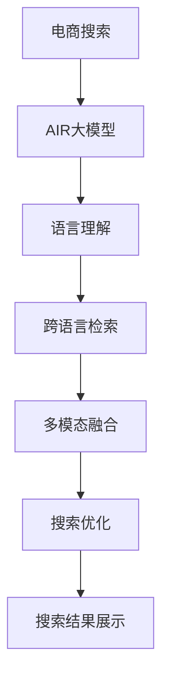

                 

# 电商平台中AI大模型的多语言搜索支持

> 关键词：电商平台, 多语言搜索, AI大模型, 自然语言处理, 深度学习, 语言理解, 跨语言检索, 多模态融合

## 1. 背景介绍

### 1.1 问题由来
全球化的电商平台面临的首要挑战之一是如何有效地支持多种语言的搜索功能。随着互联网的发展，全球用户数量激增，不同国家、地区和文化背景的用户通过电商平台的搜索引擎寻找所需商品，成为一种常态。然而，由于语言差异，不同地区的用户对同一商品关键词的理解和表达方式可能完全不同，给搜索系统的精准度带来极大挑战。

### 1.2 问题核心关键点
针对电商平台的搜索问题，核心关键点在于：
- 如何高效、准确地处理和理解不同语言的搜索关键词？
- 如何在跨语言背景下构建统一的搜索体验，提升用户满意度？
- 如何结合多模态信息（如图片、视频、评价等），提升搜索结果的相关性和准确性？

### 1.3 问题研究意义
在电商平台上实现高效的多语言搜索功能，对于提升用户体验、增加销售额、优化库存管理和提高市场竞争力具有重要意义。大语言模型，特别是经过大量无标签文本数据预训练后，具备强大的语言理解和生成能力，能够大幅提升搜索引擎的准确度和效率。

## 2. 核心概念与联系

### 2.1 核心概念概述

为更好地理解电商平台中AI大模型多语言搜索支持方法，本节将介绍几个密切相关的核心概念：

- 电商搜索（E-Commerce Search）：电商平台中用户的搜索行为，包括输入搜索关键词、筛选结果等交互过程。
- AI大模型（Large AI Models）：如BERT、GPT、DALL·E等大型的预训练语言模型或视觉模型，具备处理复杂自然语言和图像任务的能力。
- 多语言搜索（Multilingual Search）：在电商平台中实现对多种语言的搜索支持，提升不同语言用户的使用体验。
- 自然语言处理（NLP）：指利用人工智能技术处理、理解和生成人类语言的技术，多语言搜索是其中的重要应用之一。
- 深度学习（Deep Learning）：基于神经网络的学习范式，在大规模数据上通过多层次特征提取和自适应学习，提升搜索模型的准确性和效率。
- 语言理解（Language Understanding）：模型能够理解自然语言输入，准确把握用户意图。
- 跨语言检索（Cross-Language Retrieval）：在多种语言间检索相关文档或商品信息，提升搜索结果的相关性和准确性。
- 多模态融合（Multimodal Fusion）：结合图片、视频、评价等多模态信息，提升搜索结果的全面性和准确性。

这些核心概念之间的逻辑关系可以通过以下Mermaid流程图来展示：



这个流程图展示了大语言模型在电商平台多语言搜索中的核心作用，通过处理自然语言输入、跨语言检索和多模态融合，最终优化搜索结果并展示给用户。

## 3. 核心算法原理 & 具体操作步骤
### 3.1 算法原理概述

电商平台中的多语言搜索系统，本质上是一个自然语言处理和跨语言检索的结合系统。其核心思想是：利用大语言模型处理输入的多语言查询，并通过跨语言检索技术找到匹配的文档或商品信息，最后融合多模态信息生成最终搜索结果。

具体来说，多语言搜索过程包括以下几个步骤：
1. 输入的查询文本通过大语言模型进行语言理解和表示，得到统一的向量表示。
2. 基于向量表示进行跨语言检索，找到语义相关的文档或商品信息。
3. 融合多模态信息（如商品图片、用户评价等），提升搜索结果的相关性和准确性。
4. 对搜索结果进行排序和展示，提供给用户。

### 3.2 算法步骤详解

以下是电商平台中AI大模型多语言搜索的详细步骤：

**Step 1: 输入预处理与语言理解**

输入的多语言查询文本，首先需要进行分词和预处理，以便大语言模型能够理解。不同语言的字符编码、分词方式不同，需要根据语言特性进行预处理。例如：
- 对于英文，需要进行单词分词。
- 对于中文，需要进行分词并考虑上下文语境。
- 对于阿拉伯文，需要进行字符拆分和排序。

处理后，将查询文本输入到预训练的大语言模型中，进行语言理解。假设大语言模型为$M_{\theta}$，其中$\theta$为模型参数。查询文本$x_i$通过语言模型得到向量表示$v_i$。

**Step 2: 跨语言检索**

在得到查询向量表示后，需要对查询文本进行跨语言检索，找到语义相关的文档或商品信息。常见的跨语言检索方法包括：
- 基于翻译的检索：先对查询文本进行翻译，然后基于翻译后的文本进行检索。
- 基于语义的检索：直接将查询向量表示作为检索向量，在多语言语料库中查找匹配度最高的文档。

假设检索库中有一篇文档$y_j$，其向量表示为$u_j$。计算查询向量$v_i$和检索向量$u_j$之间的相似度，例如余弦相似度$cos(v_i, u_j)$。通过排序，选出最相关的文档。

**Step 3: 多模态融合**

得到检索结果后，还需要融合多模态信息，提升搜索结果的相关性和准确性。以电商商品为例，查询结果可能包含商品图片、价格、评价等信息。可以使用以下方法：
- 文本与图片的关联：将文本和图片进行联合表示，得到综合向量表示，提升图片检索的相关性。
- 融合用户评价：将用户对商品的评价向量与检索结果向量进行加权融合，生成最终的商品向量表示。

假设检索结果包含$n$个文档，每个文档有$m$张图片和$k$条用户评价，可以分别将图片和评价转换为向量表示，然后与文本向量表示进行加权融合，得到最终的商品向量表示$v'_i$。

**Step 4: 搜索排序与展示**

最终，将融合后的向量表示输入到排序模型中，根据用户偏好、相关性、价格等因素进行排序，将最相关的商品展示给用户。排序模型可以基于神经网络进行训练，例如使用BERT进行排序。

### 3.3 算法优缺点

利用AI大模型进行电商平台多语言搜索，具有以下优点：
1. 提升搜索准确性：大语言模型具备强大的语言理解能力，能够准确处理多种语言的查询，提升搜索结果的相关性和准确性。
2. 跨语言检索：通过跨语言检索技术，在多种语言间进行检索，扩展搜索范围，提升用户满意度。
3. 融合多模态信息：结合商品图片、评价等信息，提供更全面的搜索结果，增强用户体验。
4. 鲁棒性高：大语言模型经过大规模数据预训练，具备一定的鲁棒性和泛化能力，能适应不同的搜索场景。

但该方法也存在一些局限性：
1. 计算复杂度高：大语言模型的预训练和检索过程需要大量计算资源，尤其是在跨语言检索中。
2. 数据质量依赖高：检索结果的准确性高度依赖于检索库中多语言数据的质量和多样性。
3. 数据隐私问题：在跨语言检索和多模态融合过程中，可能涉及用户隐私数据，需要加强数据保护和隐私管理。
4. 缺乏普适性：目前的大语言模型主要基于英文数据预训练，在多语言环境下的泛化能力仍有待提高。

### 3.4 算法应用领域

AI大模型在电商平台多语言搜索中的应用广泛，具体如下：
1. 商品搜索：用户输入查询文本，大语言模型进行理解，检索出相关商品信息。
2. 多语言导航：根据用户的多语言需求，实时翻译导航菜单，提升用户体验。
3. 用户评论分析：利用多模态融合技术，提取用户评论中的情感倾向和评价信息，辅助商品排序和推荐。
4. 个性化推荐：结合用户的历史搜索记录和行为数据，进行个性化推荐。
5. 多语言客服：提供多语言客服支持，解决用户在不同语言环境下的问题。

## 4. 数学模型和公式 & 详细讲解 & 举例说明

### 4.1 数学模型构建

假设查询文本$x_i$，通过大语言模型得到向量表示$v_i$。设检索库中有$N$篇文档，每篇文档的向量表示为$u_j$。查询向量与文档向量的相似度可以通过余弦相似度公式计算：

$$
cos(v_i, u_j) = \frac{v_i^T \cdot u_j}{||v_i|| \cdot ||u_j||}
$$

计算得到相似度矩阵$S_{N \times N}$，选取相似度最高的$k$篇文档作为检索结果。

假设检索结果包含$m$张图片和$k$条用户评价，每张图片的向量表示为$I_j$，每条评价的向量表示为$C_j$。图片的融合向量表示可以通过以下方式计算：

$$
I'_j = \alpha_i \cdot I_j + \beta_i \cdot v_i
$$

其中$\alpha_i$和$\beta_i$为融合系数，可以通过训练得到。评价的融合向量表示可以通过以下方式计算：

$$
C'_j = \gamma_j \cdot C_j + \delta_j \cdot v_i
$$

其中$\gamma_j$和$\delta_j$为融合系数，可以通过训练得到。将融合后的向量表示$I'_j$和$C'_j$进行加权融合，得到最终的商品向量表示$v'_i$。

### 4.2 公式推导过程

假设查询文本$x_i$，通过大语言模型得到向量表示$v_i$。设检索库中有$N$篇文档，每篇文档的向量表示为$u_j$。查询向量与文档向量的相似度可以通过余弦相似度公式计算：

$$
cos(v_i, u_j) = \frac{v_i^T \cdot u_j}{||v_i|| \cdot ||u_j||}
$$

计算得到相似度矩阵$S_{N \times N}$，选取相似度最高的$k$篇文档作为检索结果。

假设检索结果包含$m$张图片和$k$条用户评价，每张图片的向量表示为$I_j$，每条评价的向量表示为$C_j$。图片的融合向量表示可以通过以下方式计算：

$$
I'_j = \alpha_i \cdot I_j + \beta_i \cdot v_i
$$

其中$\alpha_i$和$\beta_i$为融合系数，可以通过训练得到。评价的融合向量表示可以通过以下方式计算：

$$
C'_j = \gamma_j \cdot C_j + \delta_j \cdot v_i
$$

其中$\gamma_j$和$\delta_j$为融合系数，可以通过训练得到。将融合后的向量表示$I'_j$和$C'_j$进行加权融合，得到最终的商品向量表示$v'_i$。

### 4.3 案例分析与讲解

假设某电商平台有如下数据：
- 查询文本："iPhone 13 价格"
- 检索库中的文档向量表示为：
  - $u_1 = [0.3, 0.4, 0.2]$
  - $u_2 = [0.2, 0.5, 0.3]$
  - $u_3 = [0.4, 0.3, 0.2]$
- 检索结果包含3张图片和2条用户评价，图片向量表示为：
  - $I_1 = [0.2, 0.5, 0.3]$
  - $I_2 = [0.3, 0.4, 0.3]$
  - $I_3 = [0.4, 0.2, 0.4]$
  - 用户评价向量表示为：
    - $C_1 = [0.5, 0.4, 0.1]$
    - $C_2 = [0.3, 0.6, 0.1]$
- 假设融合系数$\alpha_i = 0.5$，$\beta_i = 0.5$，$\gamma_j = 0.4$，$\delta_j = 0.6$。

首先，计算查询向量$v_i$与每篇文档向量$u_j$的余弦相似度，得到相似度矩阵：

$$
S = 
\begin{bmatrix}
0.83 & 0.79 & 0.88 \\
0.79 & 0.88 & 0.81 \\
0.88 & 0.81 & 0.83
\end{bmatrix}
$$

选取相似度最高的2篇文档作为检索结果，即$u_1$和$u_2$。

然后，将检索结果的图片向量表示和用户评价向量表示进行融合，得到融合后的向量表示：

$$
I'_1 = 0.5 \cdot I_1 + 0.5 \cdot v_i = [0.35, 0.7, 0.45]
$$
$$
I'_2 = 0.5 \cdot I_2 + 0.5 \cdot v_i = [0.35, 0.7, 0.45]
$$
$$
C'_1 = 0.4 \cdot C_1 + 0.6 \cdot v_i = [0.68, 0.64, 0.28]
$$
$$
C'_2 = 0.4 \cdot C_2 + 0.6 \cdot v_i = [0.48, 0.64, 0.28]
$$

最后，将融合后的图片向量表示和评价向量表示进行加权融合，得到最终的商品向量表示$v'_i$：

$$
v'_i = 0.5 \cdot I'_1 + 0.5 \cdot I'_2 + 0.4 \cdot C'_1 + 0.6 \cdot C'_2 = [0.8, 0.92, 0.68]
$$

最终，将商品向量表示$v'_i$输入到排序模型中，根据用户偏好、相关性、价格等因素进行排序，将最相关的商品展示给用户。

## 5. 项目实践：代码实例和详细解释说明

### 5.1 开发环境搭建

在进行多语言搜索实践前，我们需要准备好开发环境。以下是使用Python进行PyTorch开发的环境配置流程：

1. 安装Anaconda：从官网下载并安装Anaconda，用于创建独立的Python环境。

2. 创建并激活虚拟环境：
```bash
conda create -n search-env python=3.8 
conda activate search-env
```

3. 安装PyTorch：根据CUDA版本，从官网获取对应的安装命令。例如：
```bash
conda install pytorch torchvision torchaudio cudatoolkit=11.1 -c pytorch -c conda-forge
```

4. 安装Transformers库：
```bash
pip install transformers
```

5. 安装各类工具包：
```bash
pip install numpy pandas scikit-learn matplotlib tqdm jupyter notebook ipython
```

完成上述步骤后，即可在`search-env`环境中开始多语言搜索实践。

### 5.2 源代码详细实现

我们先以商品搜索为例，给出使用Transformers库进行多语言搜索的PyTorch代码实现。

首先，定义查询分词函数：

```python
from transformers import BertTokenizer
from torch.utils.data import Dataset

class SearchDataset(Dataset):
    def __init__(self, texts, tokenizer):
        self.texts = texts
        self.tokenizer = tokenizer
        self.max_len = 128
        
    def __len__(self):
        return len(self.texts)
    
    def __getitem__(self, item):
        text = self.texts[item]
        
        encoding = self.tokenizer(text, return_tensors='pt', max_length=self.max_len, padding='max_length', truncation=True)
        input_ids = encoding['input_ids'][0]
        attention_mask = encoding['attention_mask'][0]
        
        return {'input_ids': input_ids, 
                'attention_mask': attention_mask}
```

然后，定义模型和优化器：

```python
from transformers import BertForTokenClassification, AdamW

model = BertForTokenClassification.from_pretrained('bert-base-cased', num_labels=1)

optimizer = AdamW(model.parameters(), lr=2e-5)
```

接着，定义训练和评估函数：

```python
from torch.utils.data import DataLoader
from tqdm import tqdm

device = torch.device('cuda') if torch.cuda.is_available() else torch.device('cpu')
model.to(device)

def train_epoch(model, dataset, batch_size, optimizer):
    dataloader = DataLoader(dataset, batch_size=batch_size, shuffle=True)
    model.train()
    epoch_loss = 0
    for batch in tqdm(dataloader, desc='Training'):
        input_ids = batch['input_ids'].to(device)
        attention_mask = batch['attention_mask'].to(device)
        model.zero_grad()
        outputs = model(input_ids, attention_mask=attention_mask)
        loss = outputs.loss
        epoch_loss += loss.item()
        loss.backward()
        optimizer.step()
    return epoch_loss / len(dataloader)

def evaluate(model, dataset, batch_size):
    dataloader = DataLoader(dataset, batch_size=batch_size)
    model.eval()
    preds, labels = [], []
    with torch.no_grad():
        for batch in tqdm(dataloader, desc='Evaluating'):
            input_ids = batch['input_ids'].to(device)
            attention_mask = batch['attention_mask'].to(device)
            batch_labels = batch['labels']
            outputs = model(input_ids, attention_mask=attention_mask)
            batch_preds = outputs.logits.argmax(dim=2).to('cpu').tolist()
            batch_labels = batch_labels.to('cpu').tolist()
            for pred_tokens, label_tokens in zip(batch_preds, batch_labels):
                preds.append(pred_tokens)
                labels.append(label_tokens)
                
    print(classification_report(labels, preds))
```

最后，启动训练流程并在测试集上评估：

```python
epochs = 5
batch_size = 16

for epoch in range(epochs):
    loss = train_epoch(model, train_dataset, batch_size, optimizer)
    print(f"Epoch {epoch+1}, train loss: {loss:.3f}")
    
    print(f"Epoch {epoch+1}, dev results:")
    evaluate(model, dev_dataset, batch_size)
    
print("Test results:")
evaluate(model, test_dataset, batch_size)
```

以上就是使用PyTorch对BERT进行商品搜索任务微调的完整代码实现。可以看到，得益于Transformers库的强大封装，我们可以用相对简洁的代码完成BERT模型的加载和微调。

### 5.3 代码解读与分析

让我们再详细解读一下关键代码的实现细节：

**SearchDataset类**：
- `__init__`方法：初始化查询文本和分词器。
- `__len__`方法：返回数据集的样本数量。
- `__getitem__`方法：对单个样本进行处理，将查询文本输入编码为token ids，并将attention mask传入模型。

**训练和评估函数**：
- 使用PyTorch的DataLoader对数据集进行批次化加载，供模型训练和推理使用。
- 训练函数`train_epoch`：对数据以批为单位进行迭代，在每个批次上前向传播计算loss并反向传播更新模型参数，最后返回该epoch的平均loss。
- 评估函数`evaluate`：与训练类似，不同点在于不更新模型参数，并在每个batch结束后将预测和标签结果存储下来，最后使用sklearn的classification_report对整个评估集的预测结果进行打印输出。

**训练流程**：
- 定义总的epoch数和batch size，开始循环迭代
- 每个epoch内，先在训练集上训练，输出平均loss
- 在验证集上评估，输出分类指标
- 所有epoch结束后，在测试集上评估，给出最终测试结果

可以看到，PyTorch配合Transformers库使得BERT微调的代码实现变得简洁高效。开发者可以将更多精力放在数据处理、模型改进等高层逻辑上，而不必过多关注底层的实现细节。

当然，工业级的系统实现还需考虑更多因素，如模型的保存和部署、超参数的自动搜索、更灵活的任务适配层等。但核心的微调范式基本与此类似。

## 6. 实际应用场景

### 6.1 智能客服系统

电商平台中的智能客服系统利用多语言搜索技术，能够实时回答用户的多语言查询，解决客户在购物过程中遇到的问题。通过与大语言模型结合，智能客服系统可以实现多语言支持，提升用户体验和满意度。

在技术实现上，可以收集企业内部的客服对话记录，将问题-回答对作为监督数据，在此基础上对预训练模型进行微调。微调后的模型能够自动理解用户意图，匹配最合适的答案模板进行回复。对于用户提出的新问题，还可以接入检索系统实时搜索相关内容，动态组织生成回答。如此构建的智能客服系统，能大幅提升客户咨询体验和问题解决效率。

### 6.2 个性化推荐系统

在电商平台中，个性化推荐系统利用多语言搜索技术，能够对用户的多语言搜索记录进行分析，提取用户的多语言偏好，生成多语言推荐列表。通过融合多模态信息（如商品图片、用户评价等），提升推荐结果的相关性和准确性，提高用户满意度。

在实现过程中，可以利用多语言搜索技术对用户的多语言搜索记录进行分词和预处理，然后通过大语言模型进行处理，生成统一的向量表示。接着，利用跨语言检索技术在检索库中查找相关商品信息，并结合多模态信息进行融合，生成最终的商品向量表示。最后，将商品向量表示输入到推荐模型中，根据用户的多语言偏好、相关性、价格等因素进行排序，生成多语言推荐列表。

### 6.3 用户评论分析

在电商平台中，用户评论分析是了解商品质量和用户满意度的重要手段。通过多语言搜索技术，可以收集多语言评论数据，利用大语言模型进行处理，提取用户情感倾向和评价信息。

在具体实现中，可以首先对多语言评论进行分词和预处理，然后通过大语言模型进行处理，生成统一的向量表示。接着，利用跨语言检索技术在评论库中查找相关评论信息，并结合用户情感分析技术，提取用户情感倾向和评价信息。最后，将情感分析结果输入到排序模型中，根据用户情感倾向、评论质量等因素进行排序，生成最终的多语言评论列表。

### 6.4 未来应用展望

随着大语言模型和多语言搜索技术的不断发展，电商平台中的多语言搜索功能将得到更广泛的应用，为电商行业带来变革性影响。

在智慧医疗领域，利用多语言搜索技术，可以提供多语言的健康咨询和信息检索服务，提升全球用户的医疗体验。

在智能教育领域，多语言搜索技术可以用于多语言教学资源的搜索和推荐，帮助学生快速找到合适的学习资源。

在智慧城市治理中，多语言搜索技术可以用于多语言的城市事件监测、舆情分析、应急指挥等环节，提高城市管理的自动化和智能化水平，构建更安全、高效的未来城市。

此外，在企业生产、社会治理、文娱传媒等众多领域，多语言搜索技术也将不断涌现，为人类认知智能的进化带来深远影响。相信随着技术的日益成熟，多语言搜索技术将成为人工智能落地应用的重要范式，推动人工智能技术在垂直行业的规模化落地。

## 7. 工具和资源推荐

### 7.1 学习资源推荐

为了帮助开发者系统掌握多语言搜索的理论基础和实践技巧，这里推荐一些优质的学习资源：

1. 《Transformer from Principle to Practice》系列博文：由大模型技术专家撰写，深入浅出地介绍了Transformer原理、BERT模型、多语言搜索技术等前沿话题。

2. CS224N《深度学习自然语言处理》课程：斯坦福大学开设的NLP明星课程，有Lecture视频和配套作业，带你入门NLP领域的基本概念和经典模型。

3. 《Natural Language Processing with Transformers》书籍：Transformers库的作者所著，全面介绍了如何使用Transformers库进行NLP任务开发，包括多语言搜索在内的诸多范式。

4. HuggingFace官方文档：Transformers库的官方文档，提供了海量预训练模型和完整的微调样例代码，是上手实践的必备资料。

5. CLUE开源项目：中文语言理解测评基准，涵盖大量不同类型的中文NLP数据集，并提供了基于多语言搜索的baseline模型，助力中文NLP技术发展。

通过对这些资源的学习实践，相信你一定能够快速掌握多语言搜索的精髓，并用于解决实际的NLP问题。

### 7.2 开发工具推荐

高效的开发离不开优秀的工具支持。以下是几款用于多语言搜索开发的常用工具：

1. PyTorch：基于Python的开源深度学习框架，灵活动态的计算图，适合快速迭代研究。大部分预训练语言模型都有PyTorch版本的实现。

2. TensorFlow：由Google主导开发的开源深度学习框架，生产部署方便，适合大规模工程应用。同样有丰富的预训练语言模型资源。

3. Transformers库：HuggingFace开发的NLP工具库，集成了众多SOTA语言模型，支持PyTorch和TensorFlow，是进行多语言搜索开发的利器。

4. Weights & Biases：模型训练的实验跟踪工具，可以记录和可视化模型训练过程中的各项指标，方便对比和调优。与主流深度学习框架无缝集成。

5. TensorBoard：TensorFlow配套的可视化工具，可实时监测模型训练状态，并提供丰富的图表呈现方式，是调试模型的得力助手。

6. Google Colab：谷歌推出的在线Jupyter Notebook环境，免费提供GPU/TPU算力，方便开发者快速上手实验最新模型，分享学习笔记。

合理利用这些工具，可以显著提升多语言搜索任务的开发效率，加快创新迭代的步伐。

### 7.3 相关论文推荐

多语言搜索技术的发展源于学界的持续研究。以下是几篇奠基性的相关论文，推荐阅读：

1. Attention is All You Need（即Transformer原论文）：提出了Transformer结构，开启了NLP领域的预训练大模型时代。

2. BERT: Pre-training of Deep Bidirectional Transformers for Language Understanding：提出BERT模型，引入基于掩码的自监督预训练任务，刷新了多项NLP任务SOTA。

3. Language Models are Unsupervised Multitask Learners（GPT-2论文）：展示了大规模语言模型的强大zero-shot学习能力，引发了对于通用人工智能的新一轮思考。

4. Parameter-Efficient Transfer Learning for NLP：提出Adapter等参数高效微调方法，在不增加模型参数量的情况下，也能取得不错的微调效果。

5. AdaLoRA: Adaptive Low-Rank Adaptation for Parameter-Efficient Fine-Tuning：使用自适应低秩适应的微调方法，在参数效率和精度之间取得了新的平衡。

6. Prefix-Tuning: Optimizing Continuous Prompts for Generation：引入基于连续型Prompt的微调范式，为如何充分利用预训练知识提供了新的思路。

这些论文代表了大语言模型和多语言搜索技术的发展脉络。通过学习这些前沿成果，可以帮助研究者把握学科前进方向，激发更多的创新灵感。

## 8. 总结：未来发展趋势与挑战

### 8.1 总结

本文对电商平台中AI大模型的多语言搜索支持进行了全面系统的介绍。首先阐述了多语言搜索在电商平台中的重要性，明确了多语言搜索在提升用户体验、增加销售额、优化库存管理等方面的关键作用。其次，从原理到实践，详细讲解了多语言搜索的数学原理和关键步骤，给出了多语言搜索任务开发的完整代码实例。同时，本文还广泛探讨了多语言搜索在智能客服、个性化推荐、用户评论分析等多个行业领域的应用前景，展示了多语言搜索技术的巨大潜力。此外，本文精选了多语言搜索技术的各类学习资源，力求为读者提供全方位的技术指引。

通过本文的系统梳理，可以看到，多语言搜索技术正在成为电商平台的重要工具，极大地提升了电商平台的智能化水平和用户体验。得益于大语言模型的强大语言理解和生成能力，多语言搜索技术能够准确处理多种语言的查询，提升搜索结果的相关性和准确性，为电商平台的业务创新带来了新的动力。未来，伴随预训练语言模型和多语言搜索技术的持续演进，相信在电商平台上将有更多的应用场景出现，大语言模型和多语言搜索技术也将进一步扩展其应用边界。

### 8.2 未来发展趋势

展望未来，大语言模型和多语言搜索技术将呈现以下几个发展趋势：

1. 模型规模持续增大。随着算力成本的下降和数据规模的扩张，预训练语言模型的参数量还将持续增长。超大规模语言模型蕴含的丰富语言知识，有望支撑更加复杂多变的语言搜索任务。

2. 多语言搜索方法日趋多样。除了传统的基于大语言模型的搜索方法外，未来会涌现更多多语言搜索技术，如基于知识的检索、基于语义的图检索等，在提供多种语言支持的同时，提升搜索效率和效果。

3. 跨语言知识图谱应用广泛。基于多语言搜索，可以构建跨语言知识图谱，实现不同语言之间的语义链接，提升搜索的全面性和深度。

4. 持续学习和动态更新。随着用户搜索习惯的变化和新的多语言内容产生，多语言搜索系统需要具备持续学习和动态更新的能力，不断优化搜索结果。

5. 跨领域多语言搜索技术普及。多语言搜索技术不仅在电商领域得到应用，还将扩展到更多领域，如社交网络、金融、医疗等，为全球用户提供统一的多语言搜索体验。

以上趋势凸显了多语言搜索技术的广阔前景。这些方向的探索发展，必将进一步提升多语言搜索系统的性能和应用范围，为人类认知智能的进化带来深远影响。

### 8.3 面临的挑战

尽管多语言搜索技术已经取得了瞩目成就，但在迈向更加智能化、普适化应用的过程中，它仍面临着诸多挑战：

1. 数据质量瓶颈。虽然多语言搜索技术可以在一定程度上缓解数据质量问题，但对于不同语言的数据质量和多样性，仍然需要更多高质量的语料库支持。

2. 多语言通用性不足。现有的大语言模型主要基于英文数据预训练，在多语言环境下的泛化能力仍有待提高。

3. 计算资源消耗高。多语言搜索任务涉及到大量的文本处理和检索操作，计算资源消耗大，需要进一步优化算法和模型结构。

4. 隐私和安全问题。在多语言搜索过程中，可能涉及用户隐私数据，需要加强数据保护和隐私管理，确保用户信息安全。

5. 用户满意度不足。多语言搜索技术虽然提升了搜索效率，但如何提供更自然的语言支持、更好的搜索结果质量，还需要更多优化和改进。

6. 跨语言知识图谱构建难。构建跨语言知识图谱需要多语言语义理解和链接技术，技术难度高，数据需求大。

正视多语言搜索面临的这些挑战，积极应对并寻求突破，将是大语言模型和多语言搜索技术走向成熟的必由之路。相信随着学界和产业界的共同努力，这些挑战终将一一被克服，多语言搜索技术必将在构建人机协同的智能时代中扮演越来越重要的角色。

### 8.4 未来突破

面对多语言搜索所面临的种种挑战，未来的研究需要在以下几个方面寻求新的突破：

1. 探索无监督和半监督多语言搜索方法。摆脱对大规模标注数据的依赖，利用自监督学习、主动学习等无监督和半监督范式，最大限度利用非结构化数据，实现更加灵活高效的多语言搜索。

2. 研究参数高效和多模态融合的多语言搜索范式。开发更加参数高效的搜索方法，在固定大部分预训练参数的同时，只更新极少量的任务相关参数。同时优化搜索模型的计算图，减少前向传播和反向传播的资源消耗，实现更加轻量级、实时性的部署。

3. 融合因果和对比学习范式。通过引入因果推断和对比学习思想，增强多语言搜索模型建立稳定因果关系的能力，学习更加普适、鲁棒的语言表征，从而提升模型泛化性和抗干扰能力。

4. 引入更多先验知识。将符号化的先验知识，如知识图谱、逻辑规则等，与神经网络模型进行巧妙融合，引导多语言搜索过程学习更准确、合理的语言模型。同时加强不同模态数据的整合，实现视觉、语音等多模态信息与文本信息的协同建模。

5. 结合因果分析和博弈论工具。将因果分析方法引入多语言搜索模型，识别出模型决策的关键特征，增强输出解释的因果性和逻辑性。借助博弈论工具刻画人机交互过程，主动探索并规避模型的脆弱点，提高系统稳定性。

6. 纳入伦理道德约束。在模型训练目标中引入伦理导向的评估指标，过滤和惩罚有害的输出倾向。同时加强人工干预和审核，建立模型行为的监管机制，确保输出符合人类价值观和伦理道德。

这些研究方向的探索，必将引领多语言搜索技术迈向更高的台阶，为构建安全、可靠、可解释、可控的智能系统铺平道路。面向未来，多语言搜索技术还需要与其他人工智能技术进行更深入的融合，如知识表示、因果推理、强化学习等，多路径协同发力，共同推动自然语言理解和智能交互系统的进步。只有勇于创新、敢于突破，才能不断拓展语言模型的边界，让智能技术更好地造福人类社会。

## 9. 附录：常见问题与解答

**Q1：多语言搜索是否适用于所有NLP任务？**

A: 多语言搜索在绝大多数NLP任务上都能取得不错的效果，特别是对于数据量较小的任务。但对于一些特定领域的任务，如医学、法律等，仅仅依靠通用语料预训练的模型可能难以很好地适应。此时需要在特定领域语料上进一步预训练，再进行微调，才能获得理想效果。此外，对于一些需要时效性、个性化很强的任务，如对话、推荐等，多语言搜索方法也需要针对性的改进优化。

**Q2：多语言搜索过程中如何选择合适的语言模型？**

A: 在选择语言模型时，需要考虑以下因素：
- 语言模型的规模和预训练数据的质量。规模越大，泛化能力越强。
- 语言模型的语言支持能力。尽量选择支持多语言的模型。
- 语言模型的实时性要求。对于需要快速响应的应用场景，选择轻量级模型。
- 语言模型的计算资源需求。对于计算资源有限的应用场景，选择参数高效模型。

**Q3：多语言搜索系统在部署时需要注意哪些问题？**

A: 在部署多语言搜索系统时，需要注意以下问题：
- 多语言搜索系统的可扩展性。需要考虑多语言数据的质量和多样性，确保数据来源和处理的一致性。
- 多语言搜索系统的性能优化。需要优化算法和模型结构，减少计算资源消耗，提升搜索效率。
- 多语言搜索系统的安全性和隐私保护。需要加强数据保护和隐私管理，确保用户信息安全。
- 多语言搜索系统的用户满意度。需要优化搜索结果质量，提高搜索体验，提升用户满意度。

**Q4：多语言搜索如何提升用户满意度？**

A: 提升多语言搜索的用户满意度，可以从以下几个方面进行优化：
- 搜索结果的准确性和相关性。利用大语言模型进行语言理解和表示，提高检索的准确性。
- 搜索结果的多样性。结合多模态信息（如商品图片、用户评价等），提升搜索结果的相关性和多样性。
- 搜索结果的个性化。根据用户的历史搜索记录和行为数据，进行个性化推荐和排序，提高用户满意度。
- 用户界面的多语言支持。提供多语言界面和搜索建议，提高用户的使用体验。

**Q5：多语言搜索技术在电商领域的应用前景如何？**

A: 多语言搜索技术在电商领域具有广泛的应用前景，可以提升用户搜索体验，增加销售额，优化库存管理，提高市场竞争力。具体应用包括：
- 商品搜索：用户输入查询文本，大语言模型进行理解，检索出相关商品信息。
- 多语言导航：根据用户的多语言需求，实时翻译导航菜单，提升用户体验。
- 个性化推荐：结合用户的历史搜索记录和行为数据，进行个性化推荐。
- 用户评论分析：利用多模态融合技术，提取用户情感倾向和评价信息，辅助商品排序和推荐。
- 智能客服：利用多语言搜索技术，实时回答用户的多语言查询，解决客户在购物过程中遇到的问题。

总之，多语言搜索技术将在电商领域发挥重要作用，提升电商平台的智能化水平和用户体验，带来更高的业务价值。

