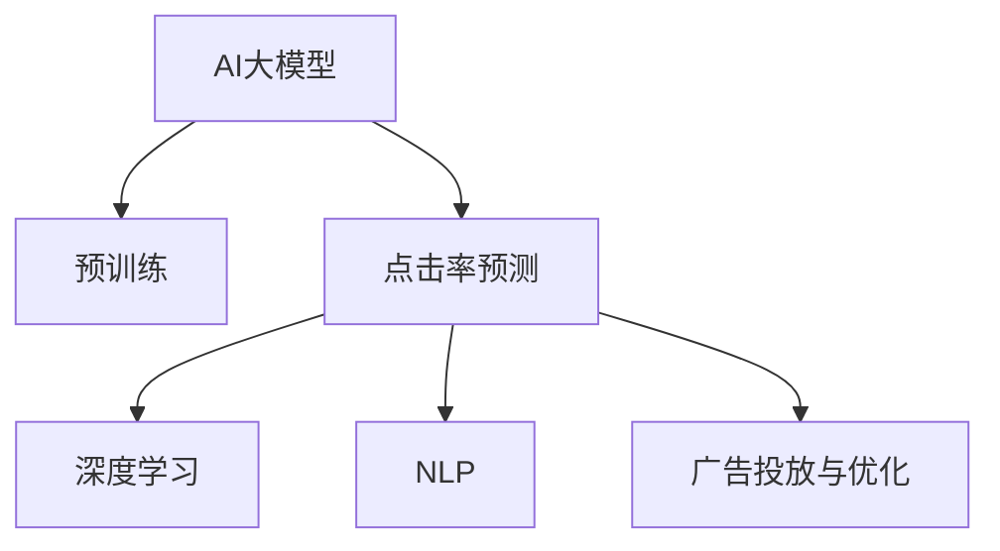

                 

# 电商平台中AI大模型的搜索广告优化

> 关键词：AI大模型、搜索广告、优化算法、深度学习、自然语言处理(NLP)、电商平台、点击率预测

## 1. 背景介绍

### 1.1 问题由来

在当今电商平台上，广告投放和优化是提升用户转化率、增加平台收益的关键。传统的广告投放依赖于规则和经验，难以实现精准定位和个性化推荐。随着深度学习和大模型的兴起，AI大模型开始在广告优化中发挥越来越重要的作用。

在电商平台中，广告通常通过文本广告形式展示，文本广告点击率预测是广告投放和优化中最重要的环节。点击率预测不仅能帮助平台更好地理解用户行为，还能优化广告预算分配，提高广告ROI。传统的点击率预测依赖于特征工程和传统机器学习算法，难以处理复杂、高维的文本广告数据。而基于大模型的预测方法，能够自动学习广告语义和用户行为之间的复杂关系，从而实现更准确、更高效率的点击率预测。

### 1.2 问题核心关键点

基于大模型的点击率预测优化方法，能够有效提升广告投放的精准度和效率，但也存在一定的局限性。本文将聚焦于如何通过深度学习和大模型技术，实现电商平台的搜索广告优化，解决以下核心关键点：

- **广告语义理解**：如何使大模型更好地理解广告文本的语义，提取关键特征。
- **用户行为建模**：如何建立有效的用户行为模型，捕捉用户点击广告的动机。
- **点击率预测算法**：如何选择或设计合适的预测算法，提升预测精度。
- **参数高效优化**：如何在有限资源下，优化模型参数，提升预测效率。
- **实时性要求**：如何在保证预测精度的情况下，满足电商平台的实时性要求。

## 2. 核心概念与联系

### 2.1 核心概念概述

为更好地理解基于大模型的电商平台搜索广告优化方法，本节将介绍几个密切相关的核心概念：

- **AI大模型**：指通过大规模无标签文本数据进行预训练的深度学习模型，如BERT、GPT等，能够自动学习语言和图像的表示，广泛应用于NLP、计算机视觉等领域。
- **点击率预测**：指根据广告和用户的特征，预测用户点击广告的概率。是广告投放和优化的核心环节。
- **深度学习**：指通过多层神经网络模型，学习数据的复杂特征关系。在电商平台广告优化中，通过深度学习可以自动提取广告文本和用户行为的复杂特征。
- **自然语言处理(NLP)**：指通过计算机处理和理解自然语言的技术，如分词、词向量、语义理解等。在广告优化中，NLP技术帮助大模型理解广告文本的语义和情感。
- **广告投放与优化**：指通过定向投放广告，最大化广告ROI的过程。通过深度学习和AI大模型，可以实现更精准的广告定位和个性化推荐。

这些核心概念之间的逻辑关系可以通过以下Mermaid流程图来展示：



这个流程图展示了大模型在电商平台广告优化中的应用流程：

1. 大模型通过大规模无标签文本数据进行预训练，学习通用的语言和图像表示。
2. 在大模型的基础上，通过深度学习提取广告文本和用户行为的复杂特征。
3. 利用自然语言处理技术，帮助大模型理解广告文本的语义和情感。
4. 通过点击率预测，预测用户点击广告的概率。
5. 根据预测结果，进行广告投放和优化，最大化广告ROI。

## 3. 核心算法原理 & 具体操作步骤
### 3.1 算法原理概述

基于大模型的搜索广告优化方法，本质上是一种基于深度学习的点击率预测优化过程。其核心思想是：通过深度学习模型，自动提取广告文本和用户行为的特征，建立广告与用户之间的复杂关系，从而实现更准确的点击率预测。

形式化地，假设广告数据集为 $A=\{(a_i, b_i)\}_{i=1}^N, a_i \in \mathcal{A}, b_i \in \{0,1\}$，其中 $\mathcal{A}$ 为广告文本集合，$b_i$ 为点击标签，$1$ 表示点击，$0$ 表示不点击。目标是通过深度学习模型 $M_{\theta}$，找到最优参数 $\theta$，使得预测点击率 $\hat{b_i}=M_{\theta}(a_i)$ 与实际点击率 $b_i$ 尽量接近。

其中，深度学习模型 $M_{\theta}$ 可以是基于神经网络的分类器，也可以是基于序列模型的推荐系统。通过最小化损失函数 $\mathcal{L}(\theta)$，模型不断更新参数 $\theta$，使得预测结果与真实标签尽量一致。常见的损失函数包括交叉熵损失、均方误差损失等。

### 3.2 算法步骤详解

基于大模型的搜索广告优化方法一般包括以下几个关键步骤：

**Step 1: 准备数据集**
- 收集电商平台的历史广告数据，包含广告文本和用户点击标签。
- 划分训练集、验证集和测试集，通常采用8:1:1的比例。
- 进行数据预处理，如分词、去除停用词、构建词向量等。

**Step 2: 选择模型结构**
- 选择合适的深度学习模型，如BERT、GPT、Transformer等。
- 根据广告文本的特点，选择词向量嵌入方式，如Word2Vec、GloVe、BERT等。

**Step 3: 设计损失函数**
- 选择合适的损失函数，如交叉熵损失、均方误差损失等。
- 设计正则化技术，如L2正则、Dropout、Early Stopping等，防止模型过拟合。

**Step 4: 模型训练与优化**
- 使用随机梯度下降(如Adam、SGD等)等优化算法，最小化损失函数 $\mathcal{L}(\theta)$。
- 设置合适的学习率、批大小、迭代轮数等超参数。
- 在验证集上定期评估模型性能，根据性能指标决定是否触发 Early Stopping。

**Step 5: 测试与部署**
- 在测试集上评估模型性能，对比微调前后的精度提升。
- 使用微调后的模型对新样本进行预测，集成到电商平台广告系统。
- 持续收集新的广告数据，定期重新微调模型，以适应数据分布的变化。

以上是基于深度学习的搜索广告优化的一般流程。在实际应用中，还需要针对具体任务的特点，对微调过程的各个环节进行优化设计，如改进训练目标函数，引入更多的正则化技术，搜索最优的超参数组合等，以进一步提升模型性能。

### 3.3 算法优缺点

基于大模型的搜索广告优化方法具有以下优点：
1. 简单高效。只需准备少量标注数据，即可对预训练模型进行快速适配，获得较大的性能提升。
2. 通用适用。适用于各种电商平台广告优化任务，设计简单的任务适配层即可实现微调。
3. 效果好。深度学习模型能够自动提取广告文本和用户行为的复杂特征，实现更准确的预测。
4. 实时性较好。大模型可以通过优化模型结构和超参数，减少计算量，提高实时性。

同时，该方法也存在一定的局限性：
1. 依赖标注数据。微调的效果很大程度上取决于标注数据的质量和数量，获取高质量标注数据的成本较高。
2. 迁移能力有限。当目标任务与预训练数据的分布差异较大时，微调的性能提升有限。
3. 计算资源要求高。深度学习模型参数量巨大，对计算资源要求较高，可能无法在部分小型平台部署。

尽管存在这些局限性，但就目前而言，基于深度学习的搜索广告优化方法仍是大模型应用的主流范式。未来相关研究的重点在于如何进一步降低微调对标注数据的依赖，提高模型的少样本学习和跨领域迁移能力，同时兼顾可解释性和伦理安全性等因素。

### 3.4 算法应用领域

基于大模型的搜索广告优化方法，在电商平台广告优化中已经得到了广泛的应用，涵盖了广告文本生成、广告定位、广告推荐等诸多环节，为电商平台带来了显著的商业价值：

- **广告文本生成**：根据用户搜索词或浏览记录，自动生成广告文案。通过微调，模型能够理解用户的兴趣和需求，生成更具吸引力的广告内容。
- **广告定位与推荐**：根据用户的历史行为和兴趣，推荐最适合的广告。通过微调，模型能够捕捉用户的多样化需求，提高广告点击率。
- **广告预算优化**：根据广告投放效果，动态调整广告预算分配。通过微调，模型能够预测不同广告的潜在效果，优化广告投放策略。

除了上述这些经典应用外，大模型还应用于广告效果分析、广告创意优化、广告效果评估等诸多场景中，为电商平台广告投放和优化带来了新的解决方案。

## 4. 数学模型和公式 & 详细讲解  
### 4.1 数学模型构建

本节将使用数学语言对基于深度学习的电商平台搜索广告优化过程进行更加严格的刻画。

记广告数据集为 $A=\{(a_i, b_i)\}_{i=1}^N, a_i \in \mathcal{A}, b_i \in \{0,1\}$，其中 $\mathcal{A}$ 为广告文本集合，$b_i$ 为点击标签，$1$ 表示点击，$0$ 表示不点击。

定义深度学习模型 $M_{\theta}$ 在广告文本 $a_i$ 上的预测概率为 $\hat{b_i}=M_{\theta}(a_i)$，其中 $\theta$ 为模型参数。则模型在数据集 $A$ 上的经验风险为：

$$
\mathcal{L}(\theta) = \frac{1}{N}\sum_{i=1}^N \ell(\hat{b_i},b_i)
$$

其中 $\ell(\hat{b_i},b_i)$ 为交叉熵损失，定义为：

$$
\ell(\hat{b_i},b_i) = -b_i\log\hat{b_i} - (1-b_i)\log(1-\hat{b_i})
$$

通过梯度下降等优化算法，最小化经验风险 $\mathcal{L}(\theta)$，不断更新模型参数 $\theta$，使得预测概率 $\hat{b_i}$ 与真实标签 $b_i$ 尽量一致。

### 4.2 公式推导过程

以下我们以二分类任务为例，推导交叉熵损失函数及其梯度的计算公式。

假设模型 $M_{\theta}$ 在输入 $a_i$ 上的预测概率为 $\hat{b_i}$，则二分类交叉熵损失函数定义为：

$$
\ell(\hat{b_i},b_i) = -b_i\log\hat{b_i} - (1-b_i)\log(1-\hat{b_i})
$$

将其代入经验风险公式，得：

$$
\mathcal{L}(\theta) = -\frac{1}{N}\sum_{i=1}^N \ell(\hat{b_i},b_i)
$$

根据链式法则，损失函数对参数 $\theta_k$ 的梯度为：

$$
\frac{\partial \mathcal{L}(\theta)}{\partial \theta_k} = -\frac{1}{N}\sum_{i=1}^N \frac{\partial \ell(\hat{b_i},b_i)}{\partial \theta_k}
$$

其中：

$$
\frac{\partial \ell(\hat{b_i},b_i)}{\partial \hat{b_i}} = -b_i + (1-b_i)\frac{\hat{b_i}}{1-\hat{b_i}}
$$

$$
\frac{\partial \ell(\hat{b_i},b_i)}{\partial \theta_k} = \frac{\partial \hat{b_i}}{\partial \theta_k} \cdot \frac{\partial \ell(\hat{b_i},b_i)}{\partial \hat{b_i}}
$$

将上述梯度代入参数更新公式，完成模型的迭代优化。重复上述过程直至收敛，最终得到适应电商平台广告优化任务的最优模型参数 $\theta^*$。

## 5. 项目实践：代码实例和详细解释说明
### 5.1 开发环境搭建

在进行广告优化实践前，我们需要准备好开发环境。以下是使用Python进行PyTorch开发的环境配置流程：

1. 安装Anaconda：从官网下载并安装Anaconda，用于创建独立的Python环境。

2. 创建并激活虚拟环境：
```bash
conda create -n pytorch-env python=3.8 
conda activate pytorch-env
```

3. 安装PyTorch：根据CUDA版本，从官网获取对应的安装命令。例如：
```bash
conda install pytorch torchvision torchaudio cudatoolkit=11.1 -c pytorch -c conda-forge
```

4. 安装Transformers库：
```bash
pip install transformers
```

5. 安装各类工具包：
```bash
pip install numpy pandas scikit-learn matplotlib tqdm jupyter notebook ipython
```

完成上述步骤后，即可在`pytorch-env`环境中开始广告优化实践。

### 5.2 源代码详细实现

这里我们以电商平台广告点击率预测为例，给出使用Transformers库对BERT模型进行点击率预测的PyTorch代码实现。

首先，定义点击率预测任务的数据处理函数：

```python
from transformers import BertTokenizer
from torch.utils.data import Dataset
import torch

class ClickThroughDataset(Dataset):
    def __init__(self, ads, clicks, tokenizer, max_len=128):
        self.ads = ads
        self.clicks = clicks
        self.tokenizer = tokenizer
        self.max_len = max_len
        
    def __len__(self):
        return len(self.ads)
    
    def __getitem__(self, item):
        ad = self.ads[item]
        click = self.clicks[item]
        
        encoding = self.tokenizer(ad, return_tensors='pt', max_length=self.max_len, padding='max_length', truncation=True)
        input_ids = encoding['input_ids'][0]
        attention_mask = encoding['attention_mask'][0]
        
        # 对点击标签进行编码
        encoded_click = [1 if click else 0] * self.max_len
        labels = torch.tensor(encoded_click, dtype=torch.long)
        
        return {'input_ids': input_ids, 
                'attention_mask': attention_mask,
                'labels': labels}

# 标签与id的映射
label2id = {1: 0, 0: 1}

# 创建dataset
tokenizer = BertTokenizer.from_pretrained('bert-base-cased')

train_dataset = ClickThroughDataset(train_ads, train_clicks, tokenizer)
dev_dataset = ClickThroughDataset(dev_ads, dev_clicks, tokenizer)
test_dataset = ClickThroughDataset(test_ads, test_clicks, tokenizer)
```

然后，定义模型和优化器：

```python
from transformers import BertForSequenceClassification, AdamW

model = BertForSequenceClassification.from_pretrained('bert-base-cased', num_labels=2)

optimizer = AdamW(model.parameters(), lr=2e-5)
```

接着，定义训练和评估函数：

```python
from torch.utils.data import DataLoader
from tqdm import tqdm
from sklearn.metrics import accuracy_score

device = torch.device('cuda') if torch.cuda.is_available() else torch.device('cpu')
model.to(device)

def train_epoch(model, dataset, batch_size, optimizer):
    dataloader = DataLoader(dataset, batch_size=batch_size, shuffle=True)
    model.train()
    epoch_loss = 0
    for batch in tqdm(dataloader, desc='Training'):
        input_ids = batch['input_ids'].to(device)
        attention_mask = batch['attention_mask'].to(device)
        labels = batch['labels'].to(device)
        model.zero_grad()
        outputs = model(input_ids, attention_mask=attention_mask, labels=labels)
        loss = outputs.loss
        epoch_loss += loss.item()
        loss.backward()
        optimizer.step()
    return epoch_loss / len(dataloader)

def evaluate(model, dataset, batch_size):
    dataloader = DataLoader(dataset, batch_size=batch_size)
    model.eval()
    preds, labels = [], []
    with torch.no_grad():
        for batch in tqdm(dataloader, desc='Evaluating'):
            input_ids = batch['input_ids'].to(device)
            attention_mask = batch['attention_mask'].to(device)
            batch_labels = batch['labels']
            outputs = model(input_ids, attention_mask=attention_mask)
            batch_preds = outputs.logits.argmax(dim=2).to('cpu').tolist()
            batch_labels = batch_labels.to('cpu').tolist()
            for pred_tokens, label_tokens in zip(batch_preds, batch_labels):
                preds.append(pred_tokens[:len(label_tokens)])
                labels.append(label_tokens)
                
    return accuracy_score(labels, preds)

def main():
    epochs = 5
    batch_size = 16

    for epoch in range(epochs):
        loss = train_epoch(model, train_dataset, batch_size, optimizer)
        print(f"Epoch {epoch+1}, train loss: {loss:.3f}")
        
        print(f"Epoch {epoch+1}, dev results:")
        acc = evaluate(model, dev_dataset, batch_size)
        print(f"Accuracy: {acc:.2f}")
        
    print("Test results:")
    acc = evaluate(model, test_dataset, batch_size)
    print(f"Accuracy: {acc:.2f}")

if __name__ == '__main__':
    main()
```

以上就是使用PyTorch对BERT进行广告点击率预测的完整代码实现。可以看到，得益于Transformers库的强大封装，我们可以用相对简洁的代码完成BERT模型的加载和微调。

### 5.3 代码解读与分析

让我们再详细解读一下关键代码的实现细节：

**ClickThroughDataset类**：
- `__init__`方法：初始化广告数据、点击标签、分词器等关键组件。
- `__len__`方法：返回数据集的样本数量。
- `__getitem__`方法：对单个样本进行处理，将广告输入编码为token ids，将点击标签编码为数字，并对其进行定长padding，最终返回模型所需的输入。

**label2id和id2label字典**：
- 定义了点击标签与数字id之间的映射关系，用于将预测结果解码回真实的标签。

**训练和评估函数**：
- 使用PyTorch的DataLoader对数据集进行批次化加载，供模型训练和推理使用。
- 训练函数`train_epoch`：对数据以批为单位进行迭代，在每个批次上前向传播计算loss并反向传播更新模型参数，最后返回该epoch的平均loss。
- 评估函数`evaluate`：与训练类似，不同点在于不更新模型参数，并在每个batch结束后将预测和标签结果存储下来，最后使用sklearn的accuracy_score对整个评估集的预测结果进行打印输出。

**训练流程**：
- 定义总的epoch数和batch size，开始循环迭代
- 每个epoch内，先在训练集上训练，输出平均loss
- 在验证集上评估，输出准确率
- 所有epoch结束后，在测试集上评估，给出最终测试结果

可以看到，PyTorch配合Transformers库使得BERT微调的代码实现变得简洁高效。开发者可以将更多精力放在数据处理、模型改进等高层逻辑上，而不必过多关注底层的实现细节。

当然，工业级的系统实现还需考虑更多因素，如模型的保存和部署、超参数的自动搜索、更灵活的任务适配层等。但核心的微调范式基本与此类似。

## 6. 实际应用场景
### 6.1 广告投放优化

在电商平台中，广告投放是提升用户转化率和平台收益的关键。通过基于深度学习的广告优化，可以实现更精准的广告定位和个性化推荐，提高广告点击率和转化率。

具体而言，可以收集电商平台的广告投放数据，如广告文本、点击率、转化率等。将这些数据作为监督数据，对预训练语言模型进行微调，使其能够学习广告文本与用户行为之间的复杂关系。微调后的模型可以根据用户搜索词、浏览记录等特征，自动生成最匹配的广告文本，提高广告的点击率和转化率。

### 6.2 用户行为分析

除了广告投放优化，基于深度学习的广告优化还可以应用于用户行为分析。通过收集用户的历史点击和购买数据，建立用户画像，预测用户未来的购买行为，从而实现个性化推荐和营销策略优化。

具体而言，可以构建用户行为模型，预测用户点击广告的概率和购买行为。利用微调后的模型，对用户的搜索词、浏览记录、购买历史等特征进行分析和建模，捕捉用户的多样化需求和兴趣，提高广告投放和个性化推荐的效果。

### 6.3 实时广告推荐

在电商平台的实时广告推荐中，基于深度学习的广告优化方法可以显著提升推荐系统的实时性。通过在线学习，模型能够实时更新，根据用户的实时行为数据进行广告推荐，从而提高用户的点击率和转化率。

具体而言，可以使用在线学习算法，如AdaGrad、Adam等，对广告推荐模型进行实时更新。在线学习的优势在于可以实时处理用户数据，更新模型参数，从而提供更精准、及时的广告推荐服务。

### 6.4 未来应用展望

随着深度学习和AI大模型的不断发展，基于深度学习的广告优化方法将在更多领域得到应用，为电商平台带来变革性影响。

在智慧医疗领域，基于大模型的广告优化技术可以用于医学科普、健康咨询等场景，提升公众的健康意识和医疗服务的精准度。

在智能教育领域，微调技术可应用于在线教育平台，根据用户的学习行为和历史数据，推荐最匹配的教育资源，提高学习效率和用户体验。

在智慧城市治理中，微调模型可应用于城市事件监测、舆情分析、应急指挥等环节，提供更精准、及时的广告推荐服务，提高城市管理的智能化水平。

此外，在企业生产、社会治理、文娱传媒等众多领域，基于深度学习的广告优化技术也将不断涌现，为数字经济的发展注入新的动力。相信随着技术的日益成熟，深度学习和大模型将在更多领域大放异彩，深刻影响人类的生产生活方式。

## 7. 工具和资源推荐
### 7.1 学习资源推荐

为了帮助开发者系统掌握基于深度学习的电商平台广告优化技术，这里推荐一些优质的学习资源：

1. 《深度学习》系列书籍：由多位国际顶级专家合著，系统介绍了深度学习的理论和实践，是深度学习领域的入门必读。
2. 《自然语言处理》课程：斯坦福大学开设的NLP明星课程，有Lecture视频和配套作业，带你入门NLP领域的基本概念和经典模型。
3. 《Transformer from Scratch》博文：详细介绍了从零开始实现Transformer模型的全过程，适合深入了解Transformer结构和优化算法。
4. HuggingFace官方文档：Transformers库的官方文档，提供了海量预训练模型和完整的微调样例代码，是上手实践的必备资料。
5. CS224N《Deep Learning for NLP》课程：斯坦福大学开设的NLP明星课程，详细介绍了NLP领域的深度学习模型和应用。

通过对这些资源的学习实践，相信你一定能够快速掌握基于深度学习的广告优化技术，并用于解决实际的电商平台问题。
###  7.2 开发工具推荐

高效的开发离不开优秀的工具支持。以下是几款用于大模型广告优化开发的常用工具：

1. PyTorch：基于Python的开源深度学习框架，灵活动态的计算图，适合快速迭代研究。大部分预训练语言模型都有PyTorch版本的实现。
2. TensorFlow：由Google主导开发的开源深度学习框架，生产部署方便，适合大规模工程应用。同样有丰富的预训练语言模型资源。
3. Transformers库：HuggingFace开发的NLP工具库，集成了众多SOTA语言模型，支持PyTorch和TensorFlow，是进行广告优化任务的开发的利器。
4. Weights & Biases：模型训练的实验跟踪工具，可以记录和可视化模型训练过程中的各项指标，方便对比和调优。与主流深度学习框架无缝集成。
5. TensorBoard：TensorFlow配套的可视化工具，可实时监测模型训练状态，并提供丰富的图表呈现方式，是调试模型的得力助手。

合理利用这些工具，可以显著提升深度学习模型的广告优化任务的开发效率，加快创新迭代的步伐。

### 7.3 相关论文推荐

深度学习和AI大模型的广告优化技术发展迅速，以下是几篇奠基性的相关论文，推荐阅读：

1. Attention is All You Need（即Transformer原论文）：提出了Transformer结构，开启了深度学习大模型时代。
2. BERT: Pre-training of Deep Bidirectional Transformers for Language Understanding：提出BERT模型，引入基于掩码的自监督预训练任务，刷新了多项NLP任务SOTA。
3. Deep Learning for Personalized Recommendation Systems：系统介绍了深度学习在推荐系统中的应用，包括点击率预测、用户行为建模等。
4. Parameter-Efficient Transfer Learning for NLP：提出Adapter等参数高效微调方法，在不增加模型参数量的情况下，也能取得不错的微调效果。
5. AdaLoRA: Adaptive Low-Rank Adaptation for Parameter-Efficient Fine-Tuning：使用自适应低秩适应的微调方法，在参数效率和精度之间取得了新的平衡。

这些论文代表了大模型广告优化技术的发展脉络。通过学习这些前沿成果，可以帮助研究者把握学科前进方向，激发更多的创新灵感。

## 8. 总结：未来发展趋势与挑战

### 8.1 总结

本文对基于深度学习的电商平台搜索广告优化方法进行了全面系统的介绍。首先阐述了广告优化技术在电商平台中的重要性和现有问题，明确了深度学习和大模型在广告优化中的核心作用。其次，从原理到实践，详细讲解了深度学习模型在广告优化中的构建和优化过程，给出了广告点击率预测的完整代码实现。同时，本文还广泛探讨了深度学习在广告优化中的多种应用场景，展示了深度学习技术在广告投放和优化中的巨大潜力。最后，本文精选了深度学习广告优化技术的各类学习资源，力求为读者提供全方位的技术指引。

通过本文的系统梳理，可以看到，基于深度学习的广告优化技术正在成为电商平台广告投放和优化的重要范式，极大地提升了广告投放的精准度和效率，带来了显著的商业价值。未来，伴随深度学习和大模型的持续演进，基于深度学习的广告优化技术必将进一步拓展其应用场景，为电商平台的智能化和精准化运营注入新的活力。

### 8.2 未来发展趋势

展望未来，深度学习广告优化技术将呈现以下几个发展趋势：

1. 模型规模持续增大。随着算力成本的下降和数据规模的扩张，深度学习模型参数量还将持续增长。超大规模深度学习模型能够学习到更加复杂和多样化的用户行为特征，提升广告投放的精准度。

2. 深度学习范式多样化。除了传统的神经网络结构，未来将涌现更多深度学习范式，如卷积神经网络、注意力机制、变分自编码器等，用于广告推荐和用户行为建模。

3. 跨模态深度学习。在广告优化中，结合视觉、音频等多模态信息，可以进一步提升广告效果。通过跨模态深度学习技术，可以更全面地理解用户需求和行为，提供更精准的广告推荐。

4. 实时深度学习。深度学习广告优化技术需要满足实时性要求，以便及时响应用户行为变化。未来的广告优化系统将通过在线学习、增量学习等方法，实现模型的实时更新和优化。

5. 深度学习在更多领域的应用。随着深度学习技术的普及，深度学习广告优化技术也将被应用到更多场景中，如医疗、教育、金融等。

以上趋势凸显了深度学习广告优化技术的广阔前景。这些方向的探索发展，必将进一步提升广告投放和优化系统的精准度和效率，为电商平台的智能化和精准化运营提供新的技术支持。

### 8.3 面临的挑战

尽管深度学习广告优化技术已经取得了瞩目成就，但在迈向更加智能化、普适化应用的过程中，它仍面临着诸多挑战：

1. 标注成本瓶颈。虽然深度学习模型可以自动提取广告文本和用户行为的特征，但在实际应用中，仍需要大量标注数据进行微调。获取高质量标注数据的成本较高，如何降低标注成本，是未来的重要研究方向。

2. 模型鲁棒性不足。深度学习模型容易受到噪声和对抗样本的影响，泛化性能往往较差。如何提高模型的鲁棒性，避免过拟合，是未来深度学习优化技术的核心挑战。

3. 计算资源要求高。深度学习模型参数量巨大，对计算资源要求较高，可能无法在部分小型平台部署。如何降低计算资源需求，提升模型部署效率，是未来优化的重要方向。

4. 可解释性亟需加强。深度学习模型通常是"黑盒"系统，难以解释其内部工作机制和决策逻辑。对于高风险应用，算法的可解释性和可审计性尤为重要。如何赋予深度学习模型更强的可解释性，将是亟待攻克的难题。

5. 安全性有待保障。深度学习模型可能学习到有偏见、有害的信息，通过微调传递到广告优化系统，产生误导性、歧视性的输出，给实际应用带来安全隐患。如何从数据和算法层面消除模型偏见，避免恶意用途，确保输出的安全性，也将是重要的研究课题。

6. 知识整合能力不足。现有的深度学习模型往往局限于数据特征，难以灵活吸收和运用更广泛的先验知识。如何让深度学习模型更好地整合符号化的先验知识，实现更全面、准确的信息整合，还有很大的想象空间。

正视深度学习广告优化技术面临的这些挑战，积极应对并寻求突破，将是大模型广告优化技术走向成熟的必由之路。相信随着学界和产业界的共同努力，这些挑战终将一一被克服，深度学习技术将在广告优化中发挥更大的作用，推动电商平台的智能化和精准化运营。

### 8.4 研究展望

面对深度学习广告优化技术所面临的种种挑战，未来的研究需要在以下几个方面寻求新的突破：

1. 探索无监督和半监督深度学习方法。摆脱对大规模标注数据的依赖，利用自监督学习、主动学习等无监督和半监督范式，最大限度利用非结构化数据，实现更加灵活高效的广告优化。

2. 研究参数高效和计算高效的深度学习范式。开发更加参数高效的深度学习模型，在固定大部分深度学习参数的同时，只更新极少量的任务相关参数。同时优化深度学习模型的计算图，减少前向传播和反向传播的资源消耗，实现更加轻量级、实时性的部署。

3. 融合因果和对比学习范式。通过引入因果推断和对比学习思想，增强深度学习模型建立稳定因果关系的能力，学习更加普适、鲁棒的用户行为特征，从而提升广告投放的精准度和效率。

4. 引入更多先验知识。将符号化的先验知识，如知识图谱、逻辑规则等，与深度学习模型进行巧妙融合，引导深度学习模型学习更准确、合理的用户行为特征。同时加强不同模态数据的整合，实现视觉、语音等多模态信息与文本信息的协同建模。

5. 结合因果分析和博弈论工具。将因果分析方法引入深度学习模型，识别出模型决策的关键特征，增强广告投放的因果性和逻辑性。借助博弈论工具刻画人机交互过程，主动探索并规避模型的脆弱点，提高系统稳定性。

6. 纳入伦理道德约束。在深度学习模型训练目标中引入伦理导向的评估指标，过滤和惩罚有偏见、有害的输出倾向。同时加强人工干预和审核，建立深度学习模型的监管机制，确保输出符合人类价值观和伦理道德。

这些研究方向的探索，必将引领深度学习广告优化技术迈向更高的台阶，为电商平台广告投放和优化带来新的解决方案，推动电商平台的智能化和精准化运营。

## 9. 附录：常见问题与解答

**Q1：深度学习广告优化是否适用于所有电商平台广告优化任务？**

A: 深度学习广告优化在大多数电商平台广告优化任务上都能取得不错的效果，特别是对于数据量较大的任务。但对于一些特定领域的任务，如医药、法律等，仅仅依靠通用语料预训练的模型可能难以很好地适应。此时需要在特定领域语料上进一步预训练，再进行微调，才能获得理想效果。此外，对于一些需要时效性、个性化很强的任务，如对话、推荐等，深度学习方法也需要针对性的改进优化。

**Q2：如何选择合适的深度学习模型？**

A: 深度学习模型的选择应基于广告数据的特点和优化目标。常见的模型包括：
1. 多层感知器(MLP)：适用于简单的二分类任务。
2. 卷积神经网络(CNN)：适用于图像广告的优化。
3. 循环神经网络(RNN)：适用于序列数据，如点击日志的优化。
4. 注意力机制模型(Attention-based Model)：适用于复杂广告文本的优化。
5. 序列到序列模型(Seq2Seq)：适用于广告文本生成和推荐任务。

选择合适模型后，需要根据数据特点和任务目标，进一步设计模型的结构和超参数，进行微调优化。

**Q3：深度学习广告优化是否需要大规模标注数据？**

A: 深度学习广告优化一般需要大规模标注数据进行微调，但通过无监督和半监督学习，可以在一定程度上减少对标注数据的依赖。例如，利用自监督学习任务，如掩码语言模型(Masked Language Model, MLM)，可以在小规模数据上进行微调，提升广告优化效果。

**Q4：深度学习广告优化对计算资源的要求有多高？**

A: 深度学习广告优化对计算资源的要求较高，尤其是在大规模广告数据集上的微调。建议采用GPU、TPU等高性能设备，以提升计算效率和模型性能。同时，采用模型压缩、稀疏化存储等方法，减少计算资源的需求。

**Q5：如何缓解深度学习广告优化中的过拟合问题？**

A: 过拟合是深度学习广告优化中的主要问题，尤其是在标注数据较少的情况下。缓解过拟合的方法包括：
1. 数据增强：通过回译、近义替换等方式扩充训练集。
2. 正则化技术：使用L2正则、Dropout、Early Stopping等技术，防止模型过拟合。
3. 对抗训练：引入对抗样本，提高模型鲁棒性。
4. 参数高效微调：只调整少量参数，减少模型过拟合风险。
5. 集成学习：通过组合多个模型的预测结果，降低过拟合风险。

这些策略往往需要根据具体任务和数据特点进行灵活组合。只有在数据、模型、训练、推理等各环节进行全面优化，才能最大限度地发挥深度学习广告优化的威力。

**Q6：深度学习广告优化的未来发展方向是什么？**

A: 深度学习广告优化的未来发展方向包括：
1. 模型融合与跨模态学习：结合视觉、音频等多模态信息，提供更精准的广告推荐。
2. 实时广告优化：通过在线学习、增量学习等方法，实现模型的实时更新和优化。
3. 深度学习与传统方法的结合：结合规则和特征工程，提升广告优化的效果和效率。
4. 模型压缩与高效部署：通过模型压缩、稀疏化存储等方法，降低计算资源需求，提升模型部署效率。
5. 深度学习广告优化的应用扩展：深度学习广告优化技术将应用于更多领域，如医疗、教育、金融等。

这些方向凸显了深度学习广告优化技术的广阔前景。未来的深度学习广告优化技术将融合更多领域知识，实现更加全面、精准的广告推荐，为电商平台的智能化和精准化运营提供新的技术支持。

---

作者：禅与计算机程序设计艺术 / Zen and the Art of Computer Programming

