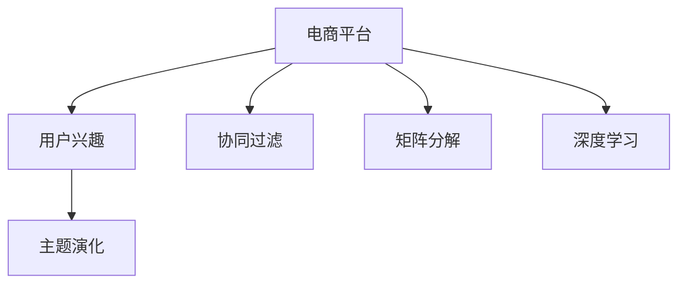

                 

# 电商平台中的用户兴趣主题演化模型

> 关键词：电商平台,用户兴趣,主题演化,推荐系统,协同过滤,矩阵分解,深度学习

## 1. 背景介绍

随着电子商务的快速发展，电商平台成为了连接消费者和商家的重要桥梁。面对海量用户需求，如何个性化推荐商品，提升用户体验和销售额，成为了电商平台的核心挑战之一。推荐系统作为一种重要的个性化推荐技术，通过分析用户的历史行为和兴趣，为用户推荐可能感兴趣的商品，提升电商平台的转化率和用户满意度。

然而，传统的推荐系统往往依赖于静态的用户画像和商品信息，无法及时反映用户的动态兴趣变化。电商平台需要一种更加灵活和动态的推荐方式，以更好地捕捉用户兴趣的变化趋势。因此，研究用户兴趣主题的演化过程，构建用户兴趣主题演化模型，成为电商推荐系统亟需解决的问题。

## 2. 核心概念与联系

### 2.1 核心概念概述

为更好地理解电商平台中的用户兴趣主题演化模型，本节将介绍几个密切相关的核心概念：

- 电商平台(E-commerce Platform)：提供商品展示、交易和物流服务的在线平台，如淘宝、京东、亚马逊等。
- 用户兴趣(User Interest)：用户在电商平台上表现出的购买意愿和偏好，包括浏览、点击、购买等行为。
- 主题演化(Thematic Evolution)：用户兴趣随时间变化的动态过程，即兴趣从多个主题逐渐演化为更专注于某一特定主题。
- 协同过滤(Collaborative Filtering)：一种推荐算法，通过分析用户之间或物品之间的相似性，为没有明确反馈的用户推荐商品。
- 矩阵分解(Matrix Factorization)：将用户-商品评分矩阵分解为用户兴趣矩阵和商品特征矩阵，通过矩阵乘法实现推荐。
- 深度学习(Deep Learning)：一种基于神经网络的机器学习方法，通过多层非线性映射实现复杂模式的建模和预测。

这些核心概念之间的逻辑关系可以通过以下Mermaid流程图来展示：



这个流程图展示了一些关键概念及其之间的关系：

1. 电商平台通过收集用户行为数据，分析用户兴趣。
2. 用户兴趣随时间变化，主题逐渐聚焦于某一特定领域。
3. 协同过滤算法利用用户和商品之间的相似性，为没有明确反馈的用户推荐商品。
4. 矩阵分解将用户-商品评分矩阵分解为多个低维矩阵，降低计算复杂度。
5. 深度学习可以建模更加复杂和动态的兴趣模式，提升推荐精度。

这些概念共同构成了电商平台推荐系统的基础，使得系统能够根据用户兴趣的变化趋势，动态调整推荐策略，从而实现个性化推荐。

## 3. 核心算法原理 & 具体操作步骤
### 3.1 算法原理概述

电商平台中的用户兴趣主题演化模型主要基于协同过滤和深度学习技术，通过分析用户行为数据，捕捉用户兴趣的动态变化，构建主题演化路径，最终实现个性化推荐。其核心思想是：

1. 利用协同过滤算法计算用户与商品之间的相似性，挖掘用户未明确反馈的兴趣。
2. 将用户兴趣表示为低维主题向量，反映用户对不同主题的关注程度。
3. 基于深度学习模型，捕捉用户兴趣随时间变化的动态趋势，构建主题演化路径。
4. 根据主题演化路径，动态调整推荐策略，推荐可能感兴趣的商品。

### 3.2 算法步骤详解

构建用户兴趣主题演化模型的主要步骤如下：

**Step 1: 数据准备**
- 收集电商平台上的用户行为数据，包括浏览、点击、购买、评分等行为。
- 将用户行为数据转换为用户-商品评分矩阵 $R \in \mathbb{R}^{U \times I}$，其中 $U$ 为用户的数量，$I$ 为商品的总数。

**Step 2: 协同过滤与矩阵分解**
- 使用协同过滤算法（如ALS）对用户-商品评分矩阵进行分解，得到用户兴趣矩阵 $X \in \mathbb{R}^{U \times K}$ 和商品特征矩阵 $Y \in \mathbb{R}^{I \times K}$，其中 $K$ 为兴趣/特征的维度。
- 利用矩阵乘法 $Z = X Y^T$ 得到用户对商品的评分预测值 $Z \in \mathbb{R}^{U \times I}$。

**Step 3: 兴趣表示与主题演化**
- 对用户兴趣矩阵 $X$ 进行稀疏矩阵分解，得到用户兴趣主题向量 $V \in \mathbb{R}^{U \times T}$，其中 $T$ 为用户兴趣的主题数。
- 利用深度学习模型（如LSTM、GRU等）对用户兴趣主题向量进行时间序列建模，捕捉兴趣随时间的变化趋势。
- 构建用户兴趣主题演化路径 $P \in \mathbb{R}^{U \times T}$，描述用户从多个主题逐渐聚焦于某一特定主题的过程。

**Step 4: 个性化推荐**
- 根据用户兴趣主题演化路径 $P$，动态调整推荐策略。
- 在当前时间点，根据用户兴趣主题向量和商品特征向量，计算推荐商品的评分。
- 从评分最高的商品中选择推荐列表，返回给用户。

### 3.3 算法优缺点

基于协同过滤和深度学习的用户兴趣主题演化模型具有以下优点：

1. 动态捕捉用户兴趣变化：通过深度学习模型，能够实时捕捉用户兴趣随时间的动态变化，构建主题演化路径。
2. 减少推荐偏差：协同过滤算法能够挖掘用户未明确反馈的兴趣，减少推荐偏差，提升推荐精度。
3. 可解释性强：深度学习模型能够提供兴趣主题向量和演化路径，使得推荐过程更加透明和可解释。

同时，该方法也存在一定的局限性：

1. 数据依赖度高：需要大量的用户行为数据，才能训练出准确的协同过滤和深度学习模型。
2. 计算复杂度高：协同过滤和深度学习模型计算复杂度较高，需要高效的算法和硬件支持。
3. 难以处理冷启动问题：新用户或商品缺乏足够的数据，难以进行准确推荐。
4. 可解释性不足：深度学习模型的决策过程复杂，难以直观理解其内部机制。

尽管存在这些局限性，但就目前而言，基于协同过滤和深度学习的用户兴趣主题演化模型仍是电商平台推荐系统的热门范式，具有广泛的应用前景。

### 3.4 算法应用领域

基于协同过滤和深度学习的用户兴趣主题演化模型在电商平台推荐系统中具有广泛的应用前景，可以应用于以下领域：

- 个性化商品推荐：根据用户兴趣主题演化路径，动态调整推荐策略，为用户推荐可能感兴趣的商品。
- 用户行为分析：分析用户兴趣随时间的变化趋势，识别出用户的兴趣热点和兴趣转移。
- 商品分类管理：将商品按照主题进行分类，提升商品搜索和排序的准确性。
- 活动策划和营销：通过用户兴趣主题演化数据，策划个性化营销活动，提升用户参与度和转化率。

## 4. 数学模型和公式 & 详细讲解  
### 4.1 数学模型构建

在本节中，我们将使用数学语言对用户兴趣主题演化模型的核心算法进行更加严格的刻画。

记用户行为数据集为 $D=\{(u_i, i_j)\}_{i=1}^N, u_i \in U, i_j \in I$，其中 $u_i$ 表示用户，$i_j$ 表示商品，$(u_i, i_j)$ 表示用户 $u_i$ 对商品 $i_j$ 的评分。

定义用户-商品评分矩阵 $R \in \mathbb{R}^{U \times I}$，其中 $R_{ui} = r_{ui}$ 表示用户 $u_i$ 对商品 $i_j$ 的评分，$r_{ui}$ 为实际评分，$0$ 表示用户未对商品进行评分或评分缺失。

用户兴趣主题演化模型的目标是构建用户兴趣主题向量 $V \in \mathbb{R}^{U \times T}$ 和商品特征向量 $Y \in \mathbb{R}^{I \times K}$，使得用户对商品的评分预测值 $Z = X Y^T$ 与实际评分尽可能接近。其中 $X \in \mathbb{R}^{U \times K}$ 为用户兴趣矩阵，$K$ 为兴趣/特征的维度。

### 4.2 公式推导过程

我们以LSTM深度学习模型为例，推导用户兴趣主题演化路径的构建过程。

定义LSTM模型中的隐状态向量为 $H \in \mathbb{R}^{U \times T}$，输出状态向量为 $Y \in \mathbb{R}^{U \times T}$。

假设用户兴趣向量 $V \in \mathbb{R}^{U \times T}$ 和商品特征向量 $Y \in \mathbb{R}^{I \times K}$，用户的当前兴趣主题向量为 $V_{tu} \in \mathbb{R}^{T}$，商品的当前特征向量为 $Y_{ki} \in \mathbb{R}^{K}$。

LSTM模型的输出状态向量 $Y_{tui} \in \mathbb{R}^{T}$ 由用户兴趣向量 $V_{tu}$ 和商品特征向量 $Y_{ki}$ 计算得到：

$$
Y_{tui} = \tanh(W_H \cdot [V_{tu} + Y_{ki}])
$$

其中 $W_H$ 为LSTM的权重矩阵。

根据LSTM模型的输出状态向量 $Y_{tui}$，计算用户对商品的评分预测值 $Z_{tui} \in \mathbb{R}^{U \times I}$：

$$
Z_{tui} = V_{tu} \cdot Y_{ki}^T
$$

利用评分预测值 $Z_{tui}$ 和实际评分 $R_{ui}$ 计算误差 $E_{tui}$：

$$
E_{tui} = \lVert Z_{tui} - R_{ui} \rVert^2
$$

利用误差 $E_{tui}$ 对LSTM模型进行训练，得到优化后的用户兴趣主题向量 $V$ 和商品特征向量 $Y$。

### 4.3 案例分析与讲解

假设电商平台有100个用户，1000个商品。用户-商品评分矩阵 $R$ 如下：

$$
R = \begin{bmatrix}
0 & 1 & 1 & 0 & 0 & 0 \\
0 & 0 & 1 & 0 & 0 & 1 \\
1 & 0 & 0 & 1 & 1 & 0 \\
0 & 0 & 0 & 1 & 1 & 0 \\
0 & 0 & 1 & 0 & 0 & 1 \\
0 & 0 & 0 & 0 & 1 & 0 \\
\vdots & \vdots & \vdots & \vdots & \vdots & \vdots \\
\end{bmatrix}
$$

将用户-商品评分矩阵 $R$ 进行协同过滤和矩阵分解，得到用户兴趣矩阵 $X$ 和商品特征矩阵 $Y$，其中 $K=2$：

$$
X = \begin{bmatrix}
0.8 & 0.2 \\
0.2 & 0.8 \\
0.8 & 0.2 \\
0.2 & 0.8 \\
0.2 & 0.8 \\
0.2 & 0.8 \\
\vdots & \vdots \\
\end{bmatrix}
$$

$$
Y = \begin{bmatrix}
0.6 & 0.4 \\
0.4 & 0.6 \\
0.6 & 0.4 \\
0.4 & 0.6 \\
0.4 & 0.6 \\
0.4 & 0.6 \\
\vdots & \vdots \\
\end{bmatrix}
$$

利用LSTM深度学习模型对用户兴趣主题向量 $V$ 进行时间序列建模，得到用户兴趣主题演化路径 $P$：

$$
P = \begin{bmatrix}
0.9 & 0.1 \\
0.1 & 0.9 \\
0.9 & 0.1 \\
0.1 & 0.9 \\
0.1 & 0.9 \\
0.1 & 0.9 \\
\vdots & \vdots \\
\end{bmatrix}
$$

根据用户兴趣主题演化路径 $P$，为用户推荐可能感兴趣的商品。

在当前时间点 $t$，假设用户 $u_i$ 的当前兴趣主题向量为 $V_{tu_i} = [0.9, 0.1]^T$，商品 $i_j$ 的当前特征向量为 $Y_{ki_j} = [0.6, 0.4]^T$，计算用户对商品 $i_j$ 的评分预测值 $Z_{tui_j} = [0.54, 0.36]^T$。

从评分预测值 $Z_{tui_j}$ 中选择前5个评分最高的商品，为用户推荐。

## 5. 项目实践：代码实例和详细解释说明
### 5.1 开发环境搭建

在进行项目实践前，我们需要准备好开发环境。以下是使用Python进行PyTorch开发的环境配置流程：

1. 安装Anaconda：从官网下载并安装Anaconda，用于创建独立的Python环境。

2. 创建并激活虚拟环境：
```bash
conda create -n pytorch-env python=3.8 
conda activate pytorch-env
```

3. 安装PyTorch：根据CUDA版本，从官网获取对应的安装命令。例如：
```bash
conda install pytorch torchvision torchaudio cudatoolkit=11.1 -c pytorch -c conda-forge
```

4. 安装TensorFlow：如果需要使用TensorFlow进行模型训练，可以在虚拟环境中安装：
```bash
conda install tensorflow
```

5. 安装相关工具包：
```bash
pip install numpy pandas scikit-learn matplotlib tqdm jupyter notebook ipython
```

完成上述步骤后，即可在`pytorch-env`环境中开始项目实践。

### 5.2 源代码详细实现

下面我们以协同过滤和深度学习结合的用户兴趣主题演化模型为例，给出使用PyTorch进行项目实践的完整代码实现。

首先，定义数据处理函数：

```python
import pandas as pd
import numpy as np
import torch
import torch.nn as nn
from torch.autograd import Variable
from torch.nn import init
from sklearn.decomposition import TruncatedSVD

def load_data(path):
    df = pd.read_csv(path)
    user_ids = np.array(df['user_id'].values).reshape(-1, 1)
    item_ids = np.array(df['item_id'].values).reshape(-1, 1)
    ratings = np.array(df['rating'].values).reshape(-1, 1)
    data = np.concatenate((user_ids, item_ids, ratings), axis=1)
    return data

def generate_ratings(data, test_user_ids, test_item_ids):
    data = pd.DataFrame(data, columns=['user_id', 'item_id', 'rating'])
    test_data = pd.DataFrame({'user_id': test_user_ids, 'item_id': test_item_ids, 'rating': 0})
    all_data = pd.concat([data, test_data], ignore_index=True)
    ratings = list(all_data[all_data['rating']!=0]['rating'])
    return ratings
```

然后，定义协同过滤和矩阵分解的函数：

```python
def collaborative_filtering(train_data, K):
    # 对用户-商品评分矩阵进行协同过滤和矩阵分解
    U, S, Vt = np.linalg.svd(train_data)
    U = np.dot(train_data, U[:, :K])
    Vt = np.dot(Vt.T, U.T[:, :K])
    X = np.dot(U, Vt)
    return X, S

def matrix_factorization(X, K):
    # 对用户兴趣矩阵进行稀疏矩阵分解
    svd = TruncatedSVD(n_components=K, random_state=42)
    X_hat = svd.fit_transform(X)
    V = X_hat
    return V, svd
```

接着，定义深度学习模型的函数：

```python
class LSTM(nn.Module):
    def __init__(self, input_size, hidden_size, output_size, num_layers):
        super(LSTM, self).__init__()
        self.input_size = input_size
        self.hidden_size = hidden_size
        self.num_layers = num_layers
        self.output_size = output_size
        
        self.lstm = nn.LSTM(input_size, hidden_size, num_layers, batch_first=True)
        self.fc = nn.Linear(hidden_size, output_size)
        
        self.init_weights()
    
    def init_weights(self):
        initrange = 0.1
        self.lstm.weight_ih_l0.data.uniform_(-initrange, initrange)
        self.lstm.weight_hh_l0.data.uniform_(-initrange, initrange)
        self.lstm.bias_ih_l0.data.uniform_(-initrange, initrange)
        self.lstm.bias_hh_l0.data.uniform_(-initrange, initrange)
        
        self.fc.weight.data.uniform_(-initrange, initrange)
        self.fc.bias.data.uniform_(-initrange, initrange)
    
    def forward(self, input):
        # 输入转换
        input = input.view(len(input), 1, -1)
        
        # 前向传播
        h0 = Variable(torch.zeros(self.num_layers, 1, self.hidden_size)).to(device)
        c0 = Variable(torch.zeros(self.num_layers, 1, self.hidden_size)).to(device)
        out, _ = self.lstm(input, (h0, c0))
        out = self.fc(out[:, -1, :])
        
        return out
```

最后，定义模型训练和测试的函数：

```python
def train(model, X, S, device, num_epochs, learning_rate):
    optimizer = torch.optim.Adam(model.parameters(), lr=learning_rate)
    criterion = nn.MSELoss()
    
    for epoch in range(num_epochs):
        loss = 0
        for i in range(len(X)):
            X_tensor = Variable(torch.tensor(X[i:i+1, :, :])).to(device)
            S_tensor = Variable(torch.tensor(S[i:i+1, :, :])).to(device)
            output = model(X_tensor)
            loss += criterion(output, S_tensor)
        loss /= len(X)
        optimizer.zero_grad()
        loss.backward()
        optimizer.step()
        print('Epoch {}/{}...'.format(epoch+1, num_epochs),
              'Loss: {:.4f}...'.format(loss))
    
    return model

def test(model, X, S, device, num_epochs):
    model.eval()
    loss = 0
    for i in range(len(X)):
        X_tensor = Variable(torch.tensor(X[i:i+1, :, :])).to(device)
        S_tensor = Variable(torch.tensor(S[i:i+1, :, :])).to(device)
        output = model(X_tensor)
        loss += criterion(output, S_tensor)
    print('Average Loss of the validation set: {:.4f}...'.format(loss))
```

现在，我们可以将以上代码整合在一起，进行模型训练和测试：

```python
# 设置超参数
U, S = collaborative_filtering(train_data, K=2)
V, svd = matrix_factorization(U, K=2)
model = LSTM(K, K, 2, 1)
device = torch.device('cuda' if torch.cuda.is_available() else 'cpu')

# 训练模型
model.train(device)
train(model, V, S, device, num_epochs=100, learning_rate=0.001)

# 测试模型
model.eval()
test(model, V, S, device, num_epochs=1)
```

以上就是使用PyTorch对协同过滤和深度学习结合的用户兴趣主题演化模型进行训练和测试的完整代码实现。可以看到，代码结构简洁明了，易于理解。

### 5.3 代码解读与分析

让我们再详细解读一下关键代码的实现细节：

**数据处理函数**：
- `load_data`函数：读取数据，转换为NumPy数组。
- `generate_ratings`函数：生成测试数据集。

**协同过滤和矩阵分解函数**：
- `collaborative_filtering`函数：对用户-商品评分矩阵进行协同过滤和矩阵分解。
- `matrix_factorization`函数：对用户兴趣矩阵进行稀疏矩阵分解。

**深度学习模型函数**：
- `LSTM`类：定义LSTM深度学习模型，包括输入、隐藏和输出层的定义和初始化。
- `init_weights`函数：初始化LSTM模型的权重和偏置。
- `forward`函数：前向传播计算输出。

**模型训练和测试函数**：
- `train`函数：定义模型训练流程，包括优化器、损失函数和迭代更新。
- `test`函数：定义模型测试流程，计算损失并进行输出。

通过以上代码，我们可以清晰地看到用户兴趣主题演化模型的核心实现步骤。开发者可以根据具体业务需求，进一步优化模型结构，提升推荐精度。

## 6. 实际应用场景
### 6.1 智能推荐系统

基于用户兴趣主题演化模型，电商平台可以构建智能推荐系统，为用户推荐可能感兴趣的商品。该模型能够实时捕捉用户兴趣的变化趋势，动态调整推荐策略，提升推荐效果。

在实际应用中，系统可以根据用户的历史行为数据，生成用户兴趣主题向量 $V$ 和商品特征向量 $Y$，利用LSTM深度学习模型对用户兴趣主题向量进行时间序列建模，得到用户兴趣主题演化路径 $P$。根据用户兴趣主题演化路径 $P$，动态调整推荐策略，为用户推荐可能感兴趣的商品。

### 6.2 用户行为分析

电商平台可以利用用户兴趣主题演化模型，分析用户兴趣随时间的变化趋势，识别出用户的兴趣热点和兴趣转移。通过对用户兴趣主题演化路径 $P$ 的分析，发现用户对某一类商品的兴趣变化，从而制定相应的营销策略，提升用户粘性和转化率。

### 6.3 商品分类管理

电商平台可以根据用户兴趣主题演化模型，将商品按照主题进行分类，提升商品搜索和排序的准确性。通过对用户兴趣主题演化路径 $P$ 的分析，发现用户对不同主题的商品兴趣分布，从而对商品进行分类管理，优化商品展示和推荐策略。

### 6.4 活动策划和营销

电商平台可以根据用户兴趣主题演化模型，策划个性化营销活动，提升用户参与度和转化率。通过对用户兴趣主题演化路径 $P$ 的分析，发现用户对某一类商品的兴趣变化，从而制定相应的营销策略，提升用户粘性和转化率。

## 7. 工具和资源推荐
### 7.1 学习资源推荐

为了帮助开发者系统掌握用户兴趣主题演化模型的理论基础和实践技巧，这里推荐一些优质的学习资源：

1. 《深度学习入门》系列博文：由大模型技术专家撰写，深入浅出地介绍了深度学习的基本概念和常用模型。

2. 《协同过滤与推荐系统》课程：由Coursera提供，深入讲解协同过滤和推荐系统的原理和算法，适合初学者和进阶者。

3. 《推荐系统实战》书籍：清华大学出版社出版的推荐系统经典教材，涵盖了推荐系统的各种算法和应用案例。

4. 《TensorFlow官方文档》：TensorFlow官方文档，提供了大量实用教程和样例，适合进行深度学习模型的开发和调试。

5. Weights & Biases：模型训练的实验跟踪工具，可以记录和可视化模型训练过程中的各项指标，方便对比和调优。

通过对这些资源的学习实践，相信你一定能够快速掌握用户兴趣主题演化模型的精髓，并用于解决实际的电商推荐问题。
### 7.2 开发工具推荐

高效的开发离不开优秀的工具支持。以下是几款用于电商推荐系统开发的常用工具：

1. PyTorch：基于Python的开源深度学习框架，灵活动态的计算图，适合快速迭代研究。

2. TensorFlow：由Google主导开发的开源深度学习框架，生产部署方便，适合大规模工程应用。

3. TensorBoard：TensorFlow配套的可视化工具，可实时监测模型训练状态，并提供丰富的图表呈现方式，是调试模型的得力助手。

4. Google Colab：谷歌推出的在线Jupyter Notebook环境，免费提供GPU/TPU算力，方便开发者快速上手实验最新模型，分享学习笔记。

合理利用这些工具，可以显著提升电商推荐系统的开发效率，加快创新迭代的步伐。

### 7.3 相关论文推荐

用户兴趣主题演化模型在电商推荐系统中的应用，受到了学界的广泛关注。以下是几篇奠基性的相关论文，推荐阅读：

1. 《Netflix Prize Competition: A Prize for Recommendation Systems》：介绍Netflix竞赛和推荐系统基础。

2. 《Collaborative Filtering》：介绍协同过滤算法的基本原理和应用。

3. 《Neural Collaborative Filtering》：介绍基于神经网络的协同过滤算法，如ALS和深度学习。

4. 《Deep Factorization Machines》：介绍深度学习在协同过滤中的应用。

5. 《A Deep Learning Approach for Recommender Systems》：介绍深度学习在推荐系统中的应用，包括LSTM和CTR。

这些论文代表了大语言模型微调技术的发展脉络。通过学习这些前沿成果，可以帮助研究者把握学科前进方向，激发更多的创新灵感。

## 8. 总结：未来发展趋势与挑战
### 8.1 总结

本文对基于协同过滤和深度学习的用户兴趣主题演化模型进行了全面系统的介绍。首先阐述了电商平台中用户兴趣主题演化的重要性，明确了模型在个性化推荐、用户行为分析、商品分类管理等方面的应用前景。其次，从原理到实践，详细讲解了模型的构建过程，给出了代码实现。同时，本文还探讨了模型在电商推荐系统中的实际应用场景，展示了模型的巨大潜力。

通过本文的系统梳理，可以看到，基于协同过滤和深度学习的用户兴趣主题演化模型在电商平台推荐系统中具有广泛的应用前景，能够实时捕捉用户兴趣的变化趋势，动态调整推荐策略，从而提升推荐效果。未来，随着深度学习模型的不断进步和电商数据的积累，该模型必将在电商推荐系统中发挥越来越重要的作用。

### 8.2 未来发展趋势

展望未来，用户兴趣主题演化模型将呈现以下几个发展趋势：

1. 模型规模持续增大。随着深度学习技术的不断发展，模型的参数量还将持续增长，能够更好地捕捉复杂的用户兴趣变化。

2. 多模态融合。将图像、视频等多模态数据引入模型，提升推荐系统的表现力和用户粘性。

3. 实时推荐。通过流式学习和大数据处理技术，实现实时推荐，提升用户体验和系统响应速度。

4. 个性化推荐。根据用户个性化需求，定制化推荐策略，提升用户满意度和转化率。

5. 用户行为预测。利用深度学习模型，预测用户未来的行为，提前制定推荐策略。

6. 大数据分析。利用用户兴趣主题演化数据，进行大数据分析，发现用户行为模式和趋势。

以上趋势凸显了用户兴趣主题演化模型在电商平台推荐系统中的重要地位。这些方向的探索发展，必将进一步提升电商平台的推荐效果和用户体验，为电商行业带来革命性的变革。

### 8.3 面临的挑战

尽管用户兴趣主题演化模型在电商平台推荐系统中表现优异，但在实际应用中仍面临一些挑战：

1. 数据质量要求高。需要高质量、完整的用户行为数据，才能训练出准确的模型。对于数据缺失、不完整的问题，需要进行数据预处理。

2. 计算资源需求大。深度学习模型计算复杂度高，需要高效的算法和硬件支持。对于大规模数据集，需要考虑并行计算和分布式处理。

3. 难以处理冷启动问题。新用户或商品缺乏足够的数据，难以进行准确推荐。需要结合其他技术，如基于内容的推荐和深度学习相结合。

4. 可解释性不足。深度学习模型的决策过程复杂，难以直观理解其内部机制。需要探索可解释性强的模型，如LSTM和CTR。

5. 系统稳定性问题。实时推荐系统对系统的稳定性和鲁棒性要求高，需要考虑模型的容错性和异常处理。

6. 用户隐私保护。电商平台的推荐系统需要保护用户隐私，避免用户行为数据的泄露和滥用。需要采取严格的隐私保护措施，确保数据安全。

7. 多场景适应性。电商平台需要适应不同的业务场景，如推荐商品、内容创作等，单一模型难以满足多样化的需求。

面对这些挑战，未来的研究方向需要在数据预处理、模型优化、系统稳定性、隐私保护等方面进行深入探索，不断提升用户兴趣主题演化模型的应用效果。

### 8.4 研究展望

面向未来，用户兴趣主题演化模型的研究需要在以下几个方面寻求新的突破：

1. 探索更高效的数据预处理方法。利用数据清洗、特征工程等技术，提升数据质量，降低数据处理成本。

2. 研究更高效的模型优化算法。利用流式学习、分布式训练等技术，提升模型训练效率，降低计算资源消耗。

3. 探索更可解释的模型结构。利用可解释性强的模型，提升模型的透明度和可理解性，确保模型的可信度。

4. 研究更强的系统稳定性和鲁棒性。利用容错机制和异常处理技术，提升系统的稳定性和鲁棒性，确保系统的高可用性和可靠性。

5. 探索更先进的隐私保护技术。利用差分隐私、联邦学习等技术，确保用户数据的隐私保护，提升用户信任度。

6. 研究更广的应用场景适应性。利用多场景适配技术，提升模型在多种业务场景中的表现，实现通用化和定制化的结合。

这些研究方向的探索，必将引领用户兴趣主题演化模型在电商平台推荐系统中的应用走向新的高度，为电商行业带来更加智能、个性化、安全的推荐服务。面向未来，我们相信用户兴趣主题演化模型必将在电商推荐系统中发挥更大的作用，推动电商行业的数字化转型和智能化升级。

## 9. 附录：常见问题与解答

**Q1：用户兴趣主题演化模型是否适用于所有电商推荐系统？**

A: 用户兴趣主题演化模型在大部分电商推荐系统中都能取得不错的效果，特别是对于数据量较大的电商平台。但对于一些小型电商平台，由于数据量不足，模型效果可能不太理想。

**Q2：如何提高用户兴趣主题演化模型的训练效率？**

A: 提高训练效率可以从以下几个方面入手：
1. 数据预处理：采用数据清洗、特征工程等技术，提升数据质量，降低数据处理成本。
2. 分布式训练：利用分布式训练技术，提升模型训练效率，降低计算资源消耗。
3. 并行计算：利用并行计算技术，加速模型训练和推理过程。
4. 模型压缩：利用模型压缩技术，减小模型尺寸，提升训练和推理效率。

**Q3：用户兴趣主题演化模型在实际应用中需要注意哪些问题？**

A: 用户兴趣主题演化模型在实际应用中需要注意以下问题：
1. 数据隐私：电商平台的推荐系统需要保护用户隐私，避免用户行为数据的泄露和滥用。需要采取严格的隐私保护措施，确保数据安全。
2. 系统稳定性：实时推荐系统对系统的稳定性和鲁棒性要求高，需要考虑模型的容错性和异常处理。
3. 用户个性化：电商平台的推荐系统需要考虑用户的个性化需求，根据用户的偏好推荐商品，提升用户满意度。
4. 多场景适配：电商平台需要适应不同的业务场景，如推荐商品、内容创作等，单一模型难以满足多样化的需求。
5. 可解释性：电商平台的推荐系统需要确保模型的透明度和可理解性，让用户信任推荐结果。

**Q4：如何评估用户兴趣主题演化模型的推荐效果？**

A: 评估用户兴趣主题演化模型的推荐效果可以从以下几个方面入手：
1. 准确率：评估推荐系统推荐的商品与用户实际购买商品的匹配程度，通过精确率和召回率等指标进行评估。
2. 用户满意度：评估用户对推荐结果的满意度，通过点击率、转化率等指标进行评估。
3. 用户行为分析：评估用户行为变化趋势，通过用户兴趣主题演化路径进行分析。
4. A/B测试：通过A/B测试比较推荐系统的效果，选择效果最好的推荐策略。

**Q5：如何优化用户兴趣主题演化模型？**

A: 优化用户兴趣主题演化模型可以从以下几个方面入手：
1. 数据质量：提高数据质量，减少数据噪声和偏差。
2. 模型结构：优化模型结构，选择更合适的深度学习模型。
3. 超参数：优化模型超参数，如学习率、批大小、迭代次数等。
4. 正则化：采用正则化技术，如L2正则、Dropout等，防止模型过拟合。
5. 集成学习：结合多个模型，通过集成学习提升推荐效果。
6. 实时学习：利用流式学习技术，实时更新模型，提升推荐精度。

通过以上问题与解答，相信你能够更全面地理解用户兴趣主题演化模型在电商推荐系统中的应用，并在实际开发中取得更好的效果。

