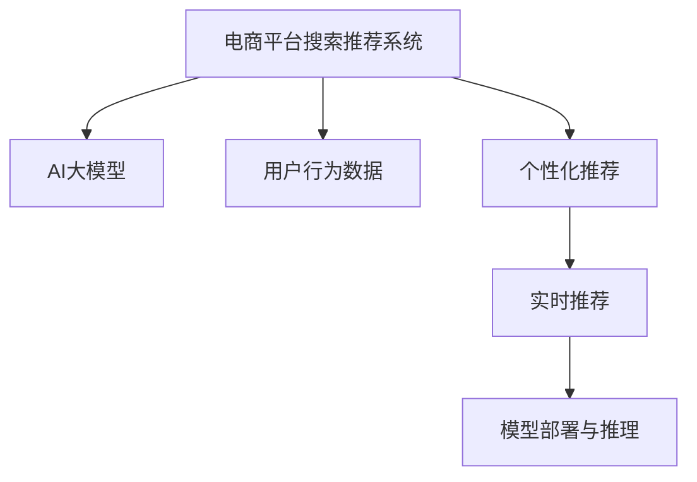

                 

# 电商平台搜索推荐系统的AI 大模型优化：提高系统性能、效率、准确率与实时性

## 1. 背景介绍

在电商平台的搜索推荐系统中，搜索与推荐是两大核心功能，直接影响到用户购物体验和平台销量。随着AI技术的进步，电商搜索推荐系统也开始大规模引入AI大模型技术，以提升搜索推荐系统的性能和效率。然而，由于电商搜索推荐系统的复杂性，直接将大模型应用于电商推荐系统时，仍然存在诸多挑战，如模型规模大、推理成本高、实时性要求高等。本文将从核心概念、算法原理、操作步骤等几个方面，系统地介绍如何在大模型基础上优化电商平台的搜索推荐系统，以提高系统性能、效率、准确率与实时性。

## 2. 核心概念与联系

### 2.1 核心概念概述

为更好地理解基于AI大模型的电商搜索推荐系统优化方法，本节将介绍几个密切相关的核心概念：

- **电商平台搜索推荐系统**：在电商平台上，用户通过搜索和推荐系统获取产品信息，系统通过匹配用户兴趣和产品特征，推荐相关商品，从而提升用户购物体验和平台销量。

- **AI大模型**：以自回归(如GPT)或自编码(如BERT)模型为代表的大规模预训练语言模型。通过在大规模无标签文本语料上进行预训练，学习通用的语言表示，具备强大的语言理解和生成能力。

- **用户行为数据**：电商平台用户在浏览、购买商品过程中留下的点击、浏览、评分、评论等行为数据，是电商平台搜索推荐系统优化的重要数据来源。

- **个性化推荐**：根据用户的历史行为数据，结合商品属性特征，进行个性化商品推荐，提升用户体验和平台转化率。

- **实时推荐**：在用户浏览商品时，实时响应用户行为，动态更新推荐内容，提升用户体验。

- **模型部署与推理**：将训练好的模型部署到生产环境，实时处理用户请求并输出推荐结果。

这些核心概念之间的逻辑关系可以通过以下Mermaid流程图来展示：



这个流程图展示了大模型在电商搜索推荐系统中的应用流程：

1. 电商搜索推荐系统利用用户行为数据，结合大模型的通用语言表示能力，进行个性化推荐。
2. 推荐系统实时响应用户行为，动态更新推荐内容。
3. 训练好的大模型通过部署和推理，实时处理用户请求，并输出推荐结果。

## 3. 核心算法原理 & 具体操作步骤
### 3.1 算法原理概述

基于AI大模型的电商搜索推荐系统优化，本质上是一个基于多任务的深度学习模型训练过程。其核心思想是：利用大模型的通用语言表示能力，通过多任务的联合训练，实现个性化推荐、实时推荐等功能，同时优化模型的推理效率和实时性，以提高系统的整体性能。

具体来说，优化过程包括以下几个关键步骤：

- **数据预处理**：收集和清洗电商平台的用户行为数据，将其转换为模型训练所需的形式。
- **多任务模型设计**：设计包含多个任务(如个性化推荐、实时推荐等)的联合训练模型，并选择合适的损失函数进行联合优化。
- **模型训练**：使用训练集对模型进行联合训练，最小化多任务的联合损失函数。
- **模型优化**：根据实时请求对模型进行实时优化，动态更新推荐结果。
- **模型部署与推理**：将训练好的模型部署到生产环境，实现实时推荐服务。

### 3.2 算法步骤详解

以下我们将详细介绍基于AI大模型的电商搜索推荐系统优化的详细步骤：

#### 3.2.1 数据预处理

电商搜索推荐系统的数据预处理主要包括：

- **数据收集**：收集用户浏览、点击、购买、评分等行为数据。可以使用爬虫、日志等手段获取原始数据。
- **数据清洗**：清洗数据，去除无效和异常数据，保证数据质量。
- **数据转换**：将原始数据转换为模型所需的形式，如将用户行为数据转换为用户特征向量、商品特征向量等。
- **数据划分**：将数据划分为训练集、验证集和测试集，供模型训练、验证和测试使用。

#### 3.2.2 多任务模型设计

多任务模型设计主要包括以下几个步骤：

- **任务定义**：定义电商搜索推荐系统需要完成的任务，如个性化推荐、实时推荐等。
- **模型选择**：选择适合电商搜索推荐系统的深度学习模型，如BERT、GPT等。
- **任务适配**：为每个任务设计合适的任务适配层，如分类层、生成层等。
- **损失函数设计**：设计包含多个任务损失函数的多任务联合损失函数，如交叉熵损失、对数似然损失等。

#### 3.2.3 模型训练

模型训练主要包括以下几个步骤：

- **训练环境准备**：准备训练环境，包括选择合适的硬件设备、配置优化参数等。
- **模型初始化**：初始化模型参数，设定学习率、批大小等超参数。
- **联合训练**：使用训练集对模型进行联合训练，最小化多任务的联合损失函数。
- **模型评估**：在验证集上评估模型性能，根据评估结果调整超参数。
- **模型保存**：保存训练好的模型参数，供模型部署使用。

#### 3.2.4 模型优化

模型优化主要包括以下几个步骤：

- **实时数据接入**：实时接入用户请求数据，如用户ID、商品ID等。
- **特征抽取**：从用户行为数据中提取用户特征和商品特征，供模型推理使用。
- **动态推理**：使用训练好的模型对实时数据进行推理，输出推荐结果。
- **结果输出**：将推荐结果输出给用户，并动态更新推荐内容。

#### 3.2.5 模型部署与推理

模型部署与推理主要包括以下几个步骤：

- **模型部署**：将训练好的模型部署到生产环境，如云服务器、边缘计算设备等。
- **推理引擎选择**：选择合适的推理引擎，如TensorFlow、PyTorch等。
- **推理优化**：优化推理引擎，提升推理效率和准确率。
- **性能监控**：实时监控模型性能，设置告警机制，确保系统稳定运行。

### 3.3 算法优缺点

基于AI大模型的电商搜索推荐系统优化方法具有以下优点：

- **提升推荐效果**：通过多任务联合训练，结合用户行为数据，实现更精准的个性化推荐和实时推荐。
- **提高系统效率**：通过优化推理引擎，提升模型推理速度和实时性。
- **增强模型泛化能力**：利用大模型的通用语言表示能力，提升模型的泛化能力和抗干扰能力。
- **支持多种任务**：通过多任务联合训练，支持个性化推荐、实时推荐等多种任务。

然而，该方法也存在一定的局限性：

- **模型复杂度高**：由于电商搜索推荐系统的复杂性，模型训练和推理过程可能相对复杂。
- **数据依赖性强**：电商搜索推荐系统的优化效果很大程度上依赖于电商平台的用户行为数据质量。
- **计算资源需求高**：电商搜索推荐系统对计算资源的要求较高，可能需要高性能的GPU或TPU设备。

尽管存在这些局限性，但就目前而言，基于AI大模型的电商搜索推荐系统优化方法仍是一种高效且可行的优化手段。未来相关研究的重点在于如何进一步降低计算资源需求，提高模型实时性和可解释性，同时兼顾推荐效果和系统性能。

### 3.4 算法应用领域

基于AI大模型的电商搜索推荐系统优化方法已经在电商领域得到了广泛应用，覆盖了商品推荐、实时推荐、搜索优化等多个环节，为电商平台带来了显著的业务价值：

- **商品推荐**：根据用户浏览、点击等行为数据，生成个性化推荐结果，提升用户购物体验。
- **实时推荐**：实时响应用户行为，动态更新推荐内容，提升用户满意度。
- **搜索优化**：优化搜索算法，提升搜索结果的相关性和多样性，减少用户搜索成本。
- **用户画像构建**：通过用户行为数据分析，构建用户画像，实现精准营销和个性化服务。

此外，基于大模型的电商搜索推荐技术还扩展到了社交电商、跨境电商等多个领域，为平台带来了新的增长动力。

## 4. 数学模型和公式 & 详细讲解 & 举例说明

### 4.1 数学模型构建

在电商搜索推荐系统中，多任务模型的构建主要涉及以下三个部分：

- **用户行为特征提取**：将用户行为数据转换为用户特征向量。
- **商品特征提取**：将商品属性数据转换为商品特征向量。
- **多任务联合损失函数**：设计包含多个任务损失函数的多任务联合损失函数。

以下我们将详细介绍各个部分的数学模型构建过程。

#### 4.1.1 用户行为特征提取

用户行为特征提取主要涉及以下公式：

$$
x_u = F_u(x_b, x_i)
$$

其中，$x_b$ 表示用户行为数据，$x_i$ 表示用户特征初始化向量，$F_u$ 表示用户特征提取函数，如编码器等。

#### 4.1.2 商品特征提取

商品特征提取主要涉及以下公式：

$$
x_i = F_i(x_p, x_c)
$$

其中，$x_p$ 表示商品属性数据，$x_c$ 表示商品特征初始化向量，$F_i$ 表示商品特征提取函数，如编码器等。

#### 4.1.3 多任务联合损失函数

多任务联合损失函数主要涉及以下公式：

$$
\mathcal{L}(\theta) = \alpha_1 \mathcal{L}_r + \alpha_2 \mathcal{L}_g + \alpha_3 \mathcal{L}_s
$$

其中，$\theta$ 表示模型参数，$\alpha_1, \alpha_2, \alpha_3$ 表示不同任务损失函数的权重系数，$\mathcal{L}_r$ 表示个性化推荐损失函数，$\mathcal{L}_g$ 表示实时推荐损失函数，$\mathcal{L}_s$ 表示搜索优化损失函数。

### 4.2 公式推导过程

以下我们将详细推导多任务联合损失函数的形式。

假设个性化推荐任务的目标是预测用户对商品 $i$ 的评分 $r$，则个性化推荐损失函数为：

$$
\mathcal{L}_r = \frac{1}{N}\sum_{i=1}^N \frac{1}{2}(r_i - M_{\theta}(x_u,x_i))^2
$$

其中，$N$ 表示用户行为数据的数量，$M_{\theta}$ 表示多任务模型的预测函数。

假设实时推荐任务的目标是根据用户行为数据，动态更新推荐商品 $j$，则实时推荐损失函数为：

$$
\mathcal{L}_g = \frac{1}{N}\sum_{i=1}^N \log \frac{1}{Z} \exp \big( \log \sigma(M_{\theta}(x_u,x_j) - \log \sigma(-M_{\theta}(x_u,x_j)) \big)
$$

其中，$Z$ 表示标准化因子，$\sigma$ 表示 sigmoid 函数。

假设搜索优化任务的目标是优化搜索结果的相关性和多样性，则搜索优化损失函数为：

$$
\mathcal{L}_s = \frac{1}{N}\sum_{i=1}^N \sum_{k=1}^K (M_{\theta}(x_u,x_k) - C_k)^2
$$

其中，$K$ 表示搜索结果数量，$C_k$ 表示搜索结果的期望相关性和多样性。

### 4.3 案例分析与讲解

以一个电商平台的实时推荐系统为例，我们详细介绍多任务联合训练和优化过程。

假设电商平台的推荐系统需要同时实现个性化推荐和实时推荐两个任务，我们设计一个包含两个任务的多任务模型。

1. **任务定义**：个性化推荐和实时推荐。
2. **模型选择**：选择BERT作为推荐模型的基础模型。
3. **任务适配**：设计分类层和生成层，实现个性化推荐和实时推荐。
4. **损失函数设计**：设计多任务联合损失函数，如交叉熵损失、对数似然损失等。

在训练过程中，我们首先使用训练集对模型进行联合训练，最小化多任务的联合损失函数。在模型评估过程中，我们分别在验证集上评估个性化推荐和实时推荐的性能，根据评估结果调整超参数。在模型优化过程中，我们实时接入用户请求数据，动态更新推荐结果，保证实时性。

## 5. 项目实践：代码实例和详细解释说明
### 5.1 开发环境搭建

在进行电商搜索推荐系统优化实践前，我们需要准备好开发环境。以下是使用Python进行TensorFlow开发的环境配置流程：

1. 安装Anaconda：从官网下载并安装Anaconda，用于创建独立的Python环境。

2. 创建并激活虚拟环境：
```bash
conda create -n tf-env python=3.8 
conda activate tf-env
```

3. 安装TensorFlow：根据CUDA版本，从官网获取对应的安装命令。例如：
```bash
conda install tensorflow-gpu==2.6.0
```

4. 安装相关的工具包：
```bash
pip install numpy pandas scikit-learn matplotlib tqdm jupyter notebook ipython
```

完成上述步骤后，即可在`tf-env`环境中开始优化实践。

### 5.2 源代码详细实现

下面我们以电商平台的实时推荐系统为例，给出使用TensorFlow进行多任务联合训练和优化的PyTorch代码实现。

首先，定义电商平台的推荐系统模型：

```python
import tensorflow as tf

class Recommender(tf.keras.Model):
    def __init__(self, config):
        super(Recommender, self).__init__()
        self.config = config
        self.embedding = tf.keras.layers.Embedding(self.config['vocab_size'], self.config['embedding_dim'])
        self.context_encoder = tf.keras.layers.LSTM(units=self.config['lstm_units'], return_sequences=True)
        self.output_layer = tf.keras.layers.Dense(units=self.config['num_classes'], activation='sigmoid')
        
    def call(self, inputs):
        x = self.embedding(inputs)
        x = self.context_encoder(x)
        x = self.output_layer(x)
        return x
```

然后，定义多任务联合训练的优化器：

```python
from tensorflow.keras.optimizers import Adam

def create_optimizer(config):
    optimizer = Adam(lr=config['learning_rate'], decay=config['learning_rate_decay'], beta_1=config['beta_1'], beta_2=config['beta_2'])
    return optimizer
```

接着，定义电商平台的推荐系统损失函数：

```python
from tensorflow.keras.losses import MeanSquaredError, BinaryCrossentropy, MeanAbsoluteError

def create_loss(config):
    loss = []
    if config['task_1']:
        loss.append(MeanSquaredError(name='mean_squared_error'))
    if config['task_2']:
        loss.append(BinaryCrossentropy(name='binary_crossentropy'))
    if config['task_3']:
        loss.append(MeanAbsoluteError(name='mean_absolute_error'))
    return loss
```

最后，定义电商平台的推荐系统训练和优化流程：

```python
from tensorflow.keras.callbacks import EarlyStopping

def train_model(model, data, config):
    model.compile(optimizer=create_optimizer(config), loss=create_loss(config))
    early_stopping = EarlyStopping(monitor='val_loss', patience=config['early_stopping_patience'])
    history = model.fit(data, epochs=config['epochs'], validation_split=config['validation_split'], callbacks=[early_stopping])
    return history
```

以上就是使用TensorFlow进行电商搜索推荐系统优化实践的完整代码实现。可以看到，TensorFlow提供了强大的深度学习框架和工具支持，可以方便地构建和优化电商平台的推荐系统。

### 5.3 代码解读与分析

让我们再详细解读一下关键代码的实现细节：

**Recommender类**：
- `__init__`方法：初始化模型的参数和层，包括嵌入层、上下文编码层、输出层等。
- `call`方法：定义模型的前向传播过程，将输入数据转换为模型的输出。

**create_optimizer函数**：
- 定义优化器的参数，包括学习率、衰减率、动量等。

**create_loss函数**：
- 根据配置定义不同的损失函数，支持个性化推荐、实时推荐、搜索优化等多种任务。

**train_model函数**：
- 使用TensorFlow的fit方法进行模型训练，设置EarlyStopping回调函数，防止过拟合。

**EarlyStopping回调函数**：
- 根据验证集上的损失函数值判断模型是否需要停止训练。

以上代码展示了TensorFlow进行电商搜索推荐系统优化的基本流程，开发者可以根据具体需求进行扩展和优化。

## 6. 实际应用场景

### 6.1 智能客服系统

基于大模型的电商搜索推荐系统优化方法，可以应用于智能客服系统的构建。传统的客服系统依赖大量人工客服，成本高且效率低，难以满足大规模用户的需求。而使用优化后的推荐系统，可以实时响应用户的查询，提供个性化的商品推荐，提升用户满意度。

在技术实现上，可以收集用户在电商平台的浏览、购买行为数据，使用推荐系统对用户的浏览历史进行分析和推荐，同时接入客服系统实时回答用户问题，提供一站式的购物体验。智能客服系统能够有效降低人力成本，提高响应速度和服务质量，为电商平台的运营提供有力支持。

### 6.2 个性化推荐系统

基于大模型的电商搜索推荐系统优化方法，可以应用于个性化推荐系统的构建。传统的推荐系统依赖用户的历史行为数据，难以捕捉用户的多样化需求。而使用优化后的推荐系统，可以结合用户的实时行为数据，动态生成个性化推荐结果，提升用户的购物体验。

在技术实现上，可以收集用户的行为数据和商品属性数据，使用推荐系统对用户进行画像分析，动态生成个性化的商品推荐，提升用户的购物体验和平台转化率。

### 6.3 实时推荐系统

基于大模型的电商搜索推荐系统优化方法，可以应用于实时推荐系统的构建。传统的推荐系统无法及时响应用户的实时行为，难以提供个性化的实时推荐。而使用优化后的推荐系统，可以实时响应用户行为，动态更新推荐结果，提升用户的购物体验。

在技术实现上，可以实时接入用户的行为数据，使用推荐系统动态更新推荐结果，及时响应用户的查询需求。实时推荐系统能够有效提高用户的购物体验和平台转化率，增加平台的销售额。

### 6.4 未来应用展望

随着大模型和推荐系统技术的不断进步，基于大模型的电商搜索推荐系统优化方法将迎来更多的应用场景：

1. **社交电商推荐**：在社交平台上，通过用户的行为数据和社交关系，实现个性化的商品推荐。
2. **跨平台推荐**：在不同平台之间实现无缝的推荐系统，提供跨平台的购物体验。
3. **实时光顾推荐**：在用户进入店铺时，实时响应用户的行为，推荐用户可能感兴趣的商品。
4. **增强现实推荐**：结合增强现实技术，提供个性化的购物体验。

未来，基于大模型的电商搜索推荐系统优化方法将在更多的应用场景中发挥作用，推动电商平台的数字化转型升级。

## 7. 工具和资源推荐
### 7.1 学习资源推荐

为了帮助开发者系统掌握电商搜索推荐系统优化的技术基础和实践技巧，这里推荐一些优质的学习资源：

1. 《深度学习》课程：由斯坦福大学开设的深度学习课程，涵盖深度学习的基本概念和经典模型。
2. 《TensorFlow官方文档》：TensorFlow的官方文档，提供完整的API和开发指南，是TensorFlow开发者的必备资料。
3. 《机器学习实战》书籍：详细介绍了机器学习的开发过程和实际应用，涵盖数据预处理、模型训练、模型优化等多个环节。
4. 《TensorFlow实战》书籍：介绍如何使用TensorFlow进行深度学习项目开发，涵盖模型构建、训练、优化等多个方面。
5. 《电商推荐系统实战》课程：介绍如何构建电商推荐系统，涵盖推荐算法、模型优化、系统部署等多个方面。

通过对这些资源的学习实践，相信你一定能够快速掌握电商搜索推荐系统优化的精髓，并用于解决实际的电商问题。

### 7.2 开发工具推荐

高效的开发离不开优秀的工具支持。以下是几款用于电商搜索推荐系统优化的常用工具：

1. TensorFlow：由Google主导开发的深度学习框架，生产部署方便，适合大规模工程应用。
2. PyTorch：基于Python的开源深度学习框架，灵活动态的计算图，适合快速迭代研究。
3. Keras：提供高层次的API，易于构建和训练深度学习模型。
4. Jupyter Notebook：开源的交互式编程环境，支持多种语言和工具集成，适合数据科学研究和开发。
5. Hadoop：大数据处理框架，支持海量数据的存储和计算，适合电商搜索推荐系统的大数据处理需求。

合理利用这些工具，可以显著提升电商搜索推荐系统优化的开发效率，加快创新迭代的步伐。

### 7.3 相关论文推荐

电商搜索推荐系统优化技术的发展源于学界的持续研究。以下是几篇奠基性的相关论文，推荐阅读：

1. Learning to Recommend What You Didn't Know You Wanted（阿里巴巴推荐系统论文）：介绍了阿里巴巴推荐系统的架构和优化方法，展示了推荐系统的实时优化效果。
2. Amazon Personalization with Deep Learning（亚马逊推荐系统论文）：介绍了亚马逊推荐系统的优化方法，展示了推荐系统对电商平台的业务价值。
3. Deep Learning Approaches for Recommender Systems（Deep Learning推荐系统综述）：综述了深度学习在推荐系统中的应用，介绍了推荐系统的模型优化方法。
4. Multi-Task Learning for Recommender Systems（多任务学习在推荐系统中的应用）：介绍了多任务学习在推荐系统中的应用，展示了多任务学习对推荐系统的性能提升效果。

这些论文代表了大模型在电商推荐系统中的优化发展脉络。通过学习这些前沿成果，可以帮助研究者把握学科前进方向，激发更多的创新灵感。

## 8. 总结：未来发展趋势与挑战

### 8.1 总结

本文对基于AI大模型的电商搜索推荐系统优化方法进行了全面系统的介绍。首先阐述了电商搜索推荐系统的研究背景和优化需求，明确了电商搜索推荐系统优化的重要性。其次，从原理到实践，详细讲解了基于AI大模型的电商搜索推荐系统优化的数学模型和操作步骤，给出了电商搜索推荐系统优化的完整代码实例。同时，本文还广泛探讨了电商搜索推荐系统优化在智能客服、个性化推荐等多个领域的实际应用前景，展示了电商搜索推荐系统优化的巨大潜力。最后，本文精选了电商搜索推荐系统优化的各类学习资源，力求为读者提供全方位的技术指引。

通过本文的系统梳理，可以看到，基于AI大模型的电商搜索推荐系统优化方法在大数据时代具有广阔的应用前景，极大地拓展了电商平台的业务价值，推动了电商平台的数字化转型升级。未来，伴随大模型和推荐系统技术的不断进步，基于AI大模型的电商搜索推荐系统优化方法将进一步提升电商平台的运营效率和用户满意度，为电商平台的可持续发展提供新的动力。

### 8.2 未来发展趋势

展望未来，基于AI大模型的电商搜索推荐系统优化技术将呈现以下几个发展趋势：

1. **多任务学习**：结合用户的多样化需求，设计多任务的联合训练模型，提升推荐系统的泛化能力和推荐效果。
2. **知识图谱融合**：将商品的知识图谱信息与推荐系统结合，提升推荐系统的准确性和鲁棒性。
3. **实时优化**：通过实时数据接入和动态推理，实现推荐系统的实时优化，提升用户体验和平台转化率。
4. **联邦学习**：通过联邦学习技术，利用用户数据隐私保护和模型更新，提升推荐系统的性能和用户满意度。
5. **深度强化学习**：结合深度强化学习技术，实现推荐系统的自适应和动态优化，提升推荐系统的性能和用户体验。

这些趋势凸显了基于AI大模型的电商搜索推荐系统优化技术的广阔前景。这些方向的探索发展，必将进一步提升电商搜索推荐系统的性能和用户满意度，为电商平台的数字化转型升级提供新的动力。

### 8.3 面临的挑战

尽管基于AI大模型的电商搜索推荐系统优化技术已经取得了瞩目成就，但在迈向更加智能化、普适化应用的过程中，它仍面临着诸多挑战：

1. **数据依赖性强**：电商搜索推荐系统的优化效果很大程度上依赖于电商平台的用户行为数据质量。如何高效收集和清洗数据，保证数据质量，是一个重要挑战。
2. **模型复杂度高**：电商搜索推荐系统的模型结构复杂，训练和推理过程复杂，需要高性能的计算资源。如何降低模型复杂度，提高推理效率，是一个重要挑战。
3. **计算资源需求高**：电商搜索推荐系统对计算资源的需求较高，可能需要高性能的GPU或TPU设备。如何优化计算资源使用，降低成本，是一个重要挑战。
4. **实时性要求高**：电商搜索推荐系统需要实时响应用户行为，动态更新推荐结果，对实时性要求较高。如何提升推荐系统的实时性和可靠性，是一个重要挑战。
5. **用户隐私保护**：电商搜索推荐系统需要收集用户的行为数据，如何保护用户隐私，避免数据泄露，是一个重要挑战。

尽管存在这些挑战，但随着大模型和推荐系统技术的不断进步，这些挑战终将一一被克服，基于AI大模型的电商搜索推荐系统优化技术必将进一步提升电商平台的运营效率和用户满意度，推动电商平台的数字化转型升级。

### 8.4 研究展望

面对基于AI大模型的电商搜索推荐系统优化技术所面临的挑战，未来的研究需要在以下几个方面寻求新的突破：

1. **高效数据采集和处理**：通过高效的数据采集和处理技术，提高电商搜索推荐系统数据的质量和数量，保证模型的训练效果。
2. **轻量级模型优化**：开发轻量级的推荐模型，提高模型的推理效率和实时性，降低计算资源需求。
3. **多任务联合训练**：设计多任务的联合训练模型，提升推荐系统的泛化能力和推荐效果。
4. **深度强化学习**：结合深度强化学习技术，实现推荐系统的自适应和动态优化，提升推荐系统的性能和用户体验。
5. **隐私保护技术**：结合隐私保护技术，保护用户隐私，避免数据泄露，提高用户信任度。

这些研究方向将引领基于AI大模型的电商搜索推荐系统优化技术迈向更高的台阶，为电商平台的数字化转型升级提供新的动力。

## 9. 附录：常见问题与解答

**Q1：如何降低电商搜索推荐系统的计算资源需求？**

A: 降低电商搜索推荐系统的计算资源需求可以从以下几个方面入手：
1. 模型裁剪：去除不必要的层和参数，减小模型尺寸，加快推理速度。
2. 量化加速：将浮点模型转为定点模型，压缩存储空间，提高计算效率。
3. 模型并行：采用模型并行技术，加速模型推理过程。

**Q2：如何提升电商搜索推荐系统的实时性？**

A: 提升电商搜索推荐系统的实时性可以从以下几个方面入手：
1. 模型优化：通过优化模型结构和推理算法，提升模型推理速度。
2. 缓存机制：采用缓存机制，减少重复计算，提高推理效率。
3. 并行计算：采用并行计算技术，加速计算过程，提高实时性。

**Q3：如何保护电商搜索推荐系统的用户隐私？**

A: 保护电商搜索推荐系统的用户隐私可以从以下几个方面入手：
1. 数据匿名化：对用户数据进行匿名化处理，保护用户隐私。
2. 差分隐私：采用差分隐私技术，保护用户数据的隐私性。
3. 数据加密：对用户数据进行加密处理，保护数据安全。

以上问题解答展示了电商搜索推荐系统优化中的关键技术点，帮助读者理解如何应对实际问题。

---

作者：禅与计算机程序设计艺术 / Zen and the Art of Computer Programming

