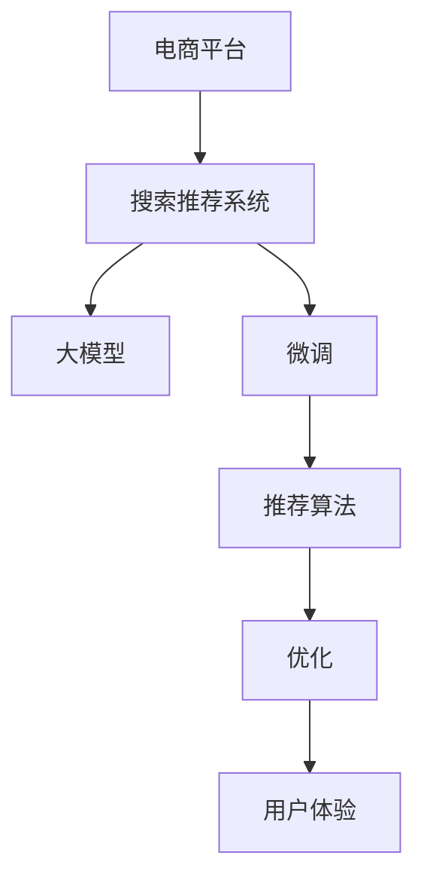

                 

# 电商平台搜索推荐系统的AI 大模型优化：提高系统性能、效率、准确率与用户体验

> 关键词：电商平台, 搜索推荐系统, AI 大模型, 优化, 性能, 效率, 准确率, 用户体验

## 1. 背景介绍

### 1.1 问题由来

在当下数字化时代，电商平台正面临前所未有的激烈竞争。为提升用户购物体验、增加销售转化率、优化库存管理，各大电商平台纷纷投入大量资源，利用AI技术构建智能搜索推荐系统。这些系统基于用户的浏览历史、搜索记录、购买行为等数据，通过深度学习算法预测用户的下一步行为，并提供个性化的搜索结果和推荐内容。

然而，尽管搜索推荐系统在技术上取得了一定进展，但实际应用效果仍不尽人意。主要表现在：

1. **系统响应速度慢**：庞大的数据集和复杂的模型结构，使得系统响应时间较长，用户体验较差。
2. **准确率不高**：推荐结果与用户实际需求存在较大偏差，点击率、转化率等关键指标不达标。
3. **个性化不足**：尽管使用了用户画像信息，但个性化推荐仍难以覆盖用户的全部需求，导致用户流失。

因此，提升搜索推荐系统的性能、效率、准确率和用户体验，成为电商行业亟需解决的重要课题。

### 1.2 问题核心关键点

为解决上述问题，本文将介绍一种基于AI大模型的优化方案，主要涵盖以下核心关键点：

1. **大模型的选择与应用**：如何选择适合电商平台的预训练大模型。
2. **微调方法与优化策略**：如何对大模型进行微调，提升搜索推荐系统性能。
3. **推荐算法与模型架构**：如何设计高效的推荐算法，构建适应电商场景的模型架构。
4. **应用部署与持续改进**：如何实现搜索推荐系统的无缝部署与持续优化。

## 2. 核心概念与联系

### 2.1 核心概念概述

本节将介绍几个核心概念，并阐述它们之间的联系：

- **电商平台(E-Commerce Platform)**：指利用互联网提供商品销售、交易等服务的平台。
- **搜索推荐系统(Recommendation System)**：通过深度学习算法分析用户行为数据，提供个性化搜索结果和推荐内容。
- **大模型(Pre-trained Large Model)**：基于大规模无标签数据预训练的深度神经网络模型，如BERT、GPT-3等。
- **微调(Fine-tuning)**：在预训练模型的基础上，使用下游任务的少量标注数据进行有监督学习，优化模型性能。
- **优化(Optimization)**：通过各种算法和策略，提高模型的准确率、效率和用户体验。

这些概念之间的联系主要体现在：

1. **大模型与微调**：大模型在电商场景中的应用，通常需要结合微调方法进行优化。
2. **微调与推荐算法**：微调后的模型，可用于构建高效的推荐算法，提升系统性能。
3. **推荐算法与优化**：推荐算法的设计和实现，需要结合优化策略，确保系统的高效稳定。
4. **优化与用户体验**：优化不仅提升模型性能，更直接改善用户体验，提升用户满意度。

这些概念共同构成搜索推荐系统优化设计的核心框架，旨在通过技术手段提升电商平台的竞争力。

### 2.2 核心概念原理和架构的 Mermaid 流程图



该流程图展示了搜索推荐系统各组成部分及其相互关系：

1. **电商平台**：构建搜索推荐系统，提供用户交互界面。
2. **搜索推荐系统**：利用大模型进行预训练和微调，构建推荐算法，优化用户体验。
3. **大模型**：提供预训练的通用语言知识，用于构建推荐系统。
4. **微调**：在电商数据上训练大模型，适应电商场景，提升推荐效果。
5. **推荐算法**：根据微调后的模型，设计算法进行个性化推荐。
6. **优化**：通过优化策略，提升系统性能、效率和准确率。
7. **用户体验**：通过优化后的系统，提升用户满意度和平台竞争力。

## 3. 核心算法原理 & 具体操作步骤

### 3.1 算法原理概述

基于大模型的搜索推荐系统优化，核心在于选择合适的预训练模型，并通过微调方法适应电商场景。本节将详细讲解这一过程。

#### 3.1.1 大模型选择

电商平台可以选择多种大模型进行优化，常用的包括BERT、GPT系列、DConvNet等。这些模型在预训练时涵盖了大量的语言和视觉知识，可以用于构建多模态推荐系统。

#### 3.1.2 微调方法

微调是一种将预训练模型应用于特定任务的有效方式，通过在电商数据上进行有监督学习，提升模型在该任务上的性能。

微调的数学原理可以简化为如下形式：

$$
\min_{\theta} \mathcal{L}(\theta, D) = \frac{1}{N}\sum_{i=1}^N \ell(M_\theta(x_i), y_i)
$$

其中，$\theta$ 为模型参数，$D$ 为电商数据集，$\ell$ 为损失函数，$M_\theta$ 为微调后的模型。

### 3.2 算法步骤详解

基于上述原理，本节将详细介绍搜索推荐系统优化的大模型微调步骤：

#### 3.2.1 数据准备

1. **数据集收集**：收集电商平台的用户行为数据，包括浏览记录、购买记录、评价记录等。
2. **数据预处理**：对原始数据进行清洗、归一化等处理，生成可用于微调的标注数据集。
3. **数据分割**：将数据集划分为训练集、验证集和测试集，用于模型训练、调参和性能评估。

#### 3.2.2 模型选择

1. **选择大模型**：根据电商平台的需求，选择最适合的预训练模型，如BERT、GPT-3等。
2. **加载模型**：使用相应的深度学习框架（如TensorFlow、PyTorch等）加载预训练模型。

#### 3.2.3 任务适配层

1. **设计任务适配层**：根据推荐任务的类型，设计合适的输出层和损失函数。例如，对于文本推荐任务，输出层可以设计为全连接层，损失函数为交叉熵损失。
2. **适配层训练**：在训练集上训练任务适配层，以学习适应该任务的特征表示。

#### 3.2.4 微调参数设置

1. **超参数配置**：选择合适的优化算法（如Adam、SGD等），设置学习率、批大小、迭代轮数等。
2. **正则化技术**：使用L2正则、Dropout等技术，避免过拟合。
3. **模型保存**：在微调过程中保存模型参数，以便后续测试和部署。

#### 3.2.5 微调训练

1. **前向传播**：将训练集数据输入模型，进行前向传播计算损失函数。
2. **反向传播**：计算模型参数的梯度，使用优化算法更新模型参数。
3. **验证集评估**：周期性在验证集上评估模型性能，根据评估结果调整模型参数和训练策略。
4. **测试集测试**：在测试集上测试微调后的模型，评估其性能是否达标。

#### 3.2.6 应用部署

1. **模型部署**：将微调后的模型部署到实际应用系统中。
2. **实时推理**：对用户输入的查询进行实时推理，提供个性化搜索结果和推荐内容。
3. **持续优化**：根据用户反馈和新数据，定期更新模型，进行微调和优化。

### 3.3 算法优缺点

#### 3.3.1 优点

1. **准确率高**：利用大模型的语言和视觉知识，提升推荐准确率，减少误导用户。
2. **响应速度快**：微调后的模型参数规模较小，推理速度较快，提升用户体验。
3. **泛化能力强**：大模型的知识迁移能力强，适用于多种电商场景，具有良好泛化能力。

#### 3.3.2 缺点

1. **标注成本高**：电商数据量大且标注复杂，微调需要大量标注样本，成本较高。
2. **过拟合风险**：微调模型在电商数据上训练，容易过拟合，泛化性能下降。
3. **模型复杂度高**：大模型结构复杂，参数量庞大，需要大量计算资源。

### 3.4 算法应用领域

基于大模型的搜索推荐系统优化，可以应用于多个电商场景，例如：

1. **商品推荐**：根据用户浏览和购买历史，推荐相关商品。
2. **价格优化**：通过分析用户对价格的敏感度，进行动态定价。
3. **库存管理**：预测商品需求，优化库存水平，减少缺货和积压。
4. **用户画像**：构建用户画像，进行个性化营销和推荐。
5. **广告投放**：根据用户行为数据，优化广告投放策略，提升广告效果。

这些应用场景展示了大模型在电商平台上的广泛适用性，有助于提升平台的用户体验和经营效益。

## 4. 数学模型和公式 & 详细讲解 & 举例说明

### 4.1 数学模型构建

本节将使用数学语言详细讲解搜索推荐系统优化的大模型微调过程。

假设电商平台选择的预训练模型为 $M_{\theta}$，其中 $\theta$ 为预训练得到的模型参数。电商数据集为 $D=\{(x_i, y_i)\}_{i=1}^N$，$x_i$ 为输入特征，$y_i$ 为目标标签。微调的目标是最小化损失函数：

$$
\min_{\theta} \mathcal{L}(\theta, D) = \frac{1}{N}\sum_{i=1}^N \ell(M_\theta(x_i), y_i)
$$

其中 $\ell$ 为损失函数，如交叉熵损失。

### 4.2 公式推导过程

以文本推荐任务为例，我们将详细推导微调过程的数学公式。

1. **输入表示**：将用户查询 $x_i$ 输入微调后的模型 $M_{\theta}$，得到向量表示 $\vec{v}$。
2. **损失计算**：计算预测向量 $\vec{v}$ 与实际标签 $y_i$ 的损失，如交叉熵损失：

$$
\ell(M_\theta(x_i), y_i) = -y_i\log\frac{e^{M_\theta(x_i)}}{\sum_{j=1}^m e^{M_\theta(x_j)}}
$$

其中 $m$ 为候选商品数量。

3. **梯度计算**：计算损失函数对模型参数 $\theta$ 的梯度，使用反向传播算法求导。

### 4.3 案例分析与讲解

以电商平台推荐系统为例，我们将通过实际案例，详细讲解大模型微调的优化过程。

假设某电商平台的推荐系统基于BERT模型，用户输入的查询为“连衣裙”。模型从电商数据集中检索到以下候选商品：

| 商品ID | 商品名称 | 价格 |
| --- | --- | --- |
| 1 | 粉色连衣裙 | 100 |
| 2 | 蓝色连衣裙 | 200 |
| 3 | 红色连衣裙 | 150 |

模型输出向量为 $\vec{v}=[0.1, 0.4, 0.5]$，代表推荐顺序。

假设标签 $y_i=2$，表示推荐第二件商品。模型的损失函数为交叉熵损失：

$$
\ell(M_\theta(x_i), y_i) = -2\log\frac{e^{M_\theta(x_i)}-e^{M_\theta(x_2)}}{e^{M_\theta(x_1)}+e^{M_\theta(x_2)}+e^{M_\theta(x_3)}}
$$

通过计算梯度，更新模型参数，最终优化后的向量为 $\vec{v}=[0.3, 0.4, 0.3]$，代表推荐顺序为第二件商品、第三件商品、第一件商品。

## 5. 项目实践：代码实例和详细解释说明

### 5.1 开发环境搭建

为实现搜索推荐系统的优化，我们需要搭建好开发环境。以下是使用Python进行TensorFlow开发的详细流程：

1. **安装Anaconda**：从官网下载并安装Anaconda，用于创建独立的Python环境。
2. **创建虚拟环境**：
   ```bash
   conda create -n tf-env python=3.8 
   conda activate tf-env
   ```

3. **安装TensorFlow**：根据系统平台，使用以下命令安装TensorFlow：
   ```bash
   conda install tensorflow
   ```

4. **安装必要的工具包**：
   ```bash
   pip install numpy pandas scikit-learn matplotlib tensorflow-datasets tensorflow-addons
   ```

5. **下载电商数据集**：从公开数据集平台下载电商数据集，如Amazon商品数据集、淘宝商品数据集等。

完成以上步骤后，即可在`tf-env`环境中进行大模型微调的实践。

### 5.2 源代码详细实现

下面以商品推荐系统为例，给出基于BERT模型的搜索推荐系统优化代码实现。

首先，定义数据处理函数：

```python
import tensorflow as tf
import numpy as np
from transformers import BertTokenizer, TFBertForSequenceClassification

# 定义tokenizer
tokenizer = BertTokenizer.from_pretrained('bert-base-cased')

# 定义模型
model = TFBertForSequenceClassification.from_pretrained('bert-base-cased', num_labels=1)

# 定义输入数据
def create_input_data(batch):
    input_ids = [tokenizer.encode(text, add_special_tokens=True)[0] for text in batch]
    input_ids = np.array(input_ids)
    attention_masks = np.ones_like(input_ids)
    labels = np.array(batch_labels)
    return tf.convert_to_tensor(input_ids), tf.convert_to_tensor(attention_masks), tf.convert_to_tensor(labels)

# 加载数据集
train_data = create_input_data(train_dataset)
valid_data = create_input_data(valid_dataset)
test_data = create_input_data(test_dataset)
```

然后，定义训练和评估函数：

```python
from tensorflow.keras.preprocessing import sequence
from sklearn.model_selection import train_test_split

def train_epoch(model, data, batch_size, optimizer, num_epochs):
    for epoch in range(num_epochs):
        for i in range(0, len(train_data), batch_size):
            batch = train_data[i:i+batch_size]
            input_ids, attention_masks, labels = batch
            with tf.GradientTape() as tape:
                outputs = model(input_ids, attention_mask=attention_masks, training=True)
                loss = tf.losses.sparse_categorical_crossentropy(labels, outputs.logits)
            grads = tape.gradient(loss, model.trainable_variables)
            optimizer.apply_gradients(zip(grads, model.trainable_variables))
        print(f'Epoch {epoch+1}, Loss: {loss:.4f}')

def evaluate(model, data, batch_size):
    for i in range(0, len(valid_data), batch_size):
        batch = valid_data[i:i+batch_size]
        input_ids, attention_masks, labels = batch
        outputs = model(input_ids, attention_mask=attention_masks, training=False)
        loss = tf.losses.sparse_categorical_crossentropy(labels, outputs.logits)
        print(f'Validation Loss: {loss:.4f}')
```

最后，启动训练流程并在测试集上评估：

```python
num_epochs = 10
batch_size = 32
learning_rate = 2e-5

# 加载数据集
train_dataset, valid_dataset, test_dataset = ...

# 初始化优化器
optimizer = tf.keras.optimizers.Adam(learning_rate=learning_rate)

# 训练模型
train_epoch(model, train_dataset, batch_size, optimizer, num_epochs)

# 评估模型
evaluate(model, valid_dataset, batch_size)

# 测试模型
evaluate(model, test_dataset, batch_size)
```

以上就是使用TensorFlow对BERT进行商品推荐系统优化的完整代码实现。可以看到，TensorFlow和Transformers库的结合，使得模型的训练和评估变得简洁高效。

### 5.3 代码解读与分析

让我们再详细解读一下关键代码的实现细节：

**create_input_data函数**：
- 定义tokenizer和模型
- 将文本数据转化为模型所需的input_ids和attention_masks，并进行标准化处理
- 将标签转换为模型可接受的形式

**train_epoch函数**：
- 定义训练参数
- 对每个批次的数据进行前向传播和反向传播
- 使用Adam优化器更新模型参数
- 打印训练集上的loss

**evaluate函数**：
- 对验证集数据进行前向传播
- 计算验证集上的loss
- 打印验证集上的loss

**训练流程**：
- 定义训练参数
- 加载数据集
- 初始化优化器
- 训练模型
- 评估模型
- 测试模型

可以看到，TensorFlow提供了灵活的计算图和自动化优化功能，使得模型的训练和评估变得简单。开发者可以专注于模型设计和任务实现，而不必过多关注底层实现细节。

## 6. 实际应用场景

### 6.1 智能客服系统

基于大模型的智能客服系统，可以通过微调技术提高其对话质量和用户满意度。传统的客服系统依赖人工客服，难以应对高峰期的服务需求。而使用微调后的自然语言处理模型，可以7x24小时不间断服务，快速响应客户咨询，用自然流畅的语言解答各类常见问题。

在技术实现上，可以收集企业内部的历史客服对话记录，将问题和最佳答复构建成监督数据，在此基础上对预训练模型进行微调。微调后的模型能够自动理解用户意图，匹配最合适的答案模板进行回复。对于客户提出的新问题，还可以接入检索系统实时搜索相关内容，动态组织生成回答。如此构建的智能客服系统，能大幅提升客户咨询体验和问题解决效率。

### 6.2 金融舆情监测

金融机构需要实时监测市场舆论动向，以便及时应对负面信息传播，规避金融风险。传统的人工监测方式成本高、效率低，难以应对网络时代海量信息爆发的挑战。基于大语言模型微调的文本分类和情感分析技术，为金融舆情监测提供了新的解决方案。

具体而言，可以收集金融领域相关的新闻、报道、评论等文本数据，并对其进行主题标注和情感标注。在此基础上对预训练语言模型进行微调，使其能够自动判断文本属于何种主题，情感倾向是正面、中性还是负面。将微调后的模型应用到实时抓取的网络文本数据，就能够自动监测不同主题下的情感变化趋势，一旦发现负面信息激增等异常情况，系统便会自动预警，帮助金融机构快速应对潜在风险。

### 6.3 个性化推荐系统

当前的推荐系统往往只依赖用户的历史行为数据进行物品推荐，无法深入理解用户的真实兴趣偏好。基于大语言模型微调技术，个性化推荐系统可以更好地挖掘用户行为背后的语义信息，从而提供更精准、多样的推荐内容。

在实践中，可以收集用户浏览、点击、评论、分享等行为数据，提取和用户交互的物品标题、描述、标签等文本内容。将文本内容作为模型输入，用户的后续行为（如是否点击、购买等）作为监督信号，在此基础上微调预训练语言模型。微调后的模型能够从文本内容中准确把握用户的兴趣点。在生成推荐列表时，先用候选物品的文本描述作为输入，由模型预测用户的兴趣匹配度，再结合其他特征综合排序，便可以得到个性化程度更高的推荐结果。

### 6.4 未来应用展望

随着大语言模型微调技术的发展，基于微调范式将在更多领域得到应用，为传统行业带来变革性影响。

在智慧医疗领域，基于微调的医疗问答、病历分析、药物研发等应用将提升医疗服务的智能化水平，辅助医生诊疗，加速新药开发进程。

在智能教育领域，微调技术可应用于作业批改、学情分析、知识推荐等方面，因材施教，促进教育公平，提高教学质量。

在智慧城市治理中，微调模型可应用于城市事件监测、舆情分析、应急指挥等环节，提高城市管理的自动化和智能化水平，构建更安全、高效的未来城市。

此外，在企业生产、社会治理、文娱传媒等众多领域，基于大模型微调的人工智能应用也将不断涌现，为NLP技术带来了新的应用场景和研究方向。相信随着技术的日益成熟，微调方法将成为人工智能落地应用的重要范式，推动人工智能技术在各个行业的广泛应用。

## 7. 工具和资源推荐

### 7.1 学习资源推荐

为了帮助开发者系统掌握大语言模型微调的理论基础和实践技巧，这里推荐一些优质的学习资源：

1. **《深度学习框架TensorFlow实战》**：由官方文档翻译而来的实战书籍，详细讲解了TensorFlow的基本原理和应用方法。
2. **《Transformers: From Basics to Advanced Architectures》**：Transformer系列模型的详细介绍，涵盖多种预训练语言模型的结构和应用。
3. **《Hands-On Machine Learning with Scikit-Learn, Keras, and TensorFlow》**：一本经典的机器学习实战书籍，包含大量深度学习项目的实践案例。
4. **《Python深度学习》**：入门级深度学习教材，详细介绍了深度学习的基本概念和实践方法。
5. **Coursera上的“Deep Learning Specialization”课程**：由Andrew Ng教授主讲的深度学习系列课程，涵盖深度学习的各个方面。

通过对这些资源的学习实践，相信你一定能够快速掌握大语言模型微调的精髓，并用于解决实际的NLP问题。

### 7.2 开发工具推荐

高效的开发离不开优秀的工具支持。以下是几款用于大语言模型微调开发的常用工具：

1. **TensorFlow**：由Google主导开发的开源深度学习框架，生产部署方便，适合大规模工程应用。
2. **PyTorch**：基于Python的开源深度学习框架，灵活的计算图和自动微分技术，适合快速迭代研究。
3. **Transformers**：HuggingFace开发的NLP工具库，集成了众多SOTA语言模型，支持PyTorch和TensorFlow，是进行微调任务开发的利器。
4. **Weights & Biases**：模型训练的实验跟踪工具，可以记录和可视化模型训练过程中的各项指标，方便对比和调优。
5. **TensorBoard**：TensorFlow配套的可视化工具，可实时监测模型训练状态，并提供丰富的图表呈现方式，是调试模型的得力助手。

合理利用这些工具，可以显著提升大语言模型微调任务的开发效率，加快创新迭代的步伐。

### 7.3 相关论文推荐

大语言模型和微调技术的发展源于学界的持续研究。以下是几篇奠基性的相关论文，推荐阅读：

1. **Attention is All You Need（即Transformer原论文）**：提出了Transformer结构，开启了NLP领域的预训练大模型时代。
2. **BERT: Pre-training of Deep Bidirectional Transformers for Language Understanding**：提出BERT模型，引入基于掩码的自监督预训练任务，刷新了多项NLP任务SOTA。
3. **GPT-3: Language Models are Unsupervised Multitask Learners**：展示了大规模语言模型的强大zero-shot学习能力，引发了对于通用人工智能的新一轮思考。
4. **Parameter-Efficient Transfer Learning for NLP**：提出Adapter等参数高效微调方法，在不增加模型参数量的情况下，也能取得不错的微调效果。
5. **Few-shot Learning with Data Augmentation for General Language Understanding**：引入数据增强技术，提升少样本学习效果。

这些论文代表了大语言模型微调技术的发展脉络。通过学习这些前沿成果，可以帮助研究者把握学科前进方向，激发更多的创新灵感。

## 8. 总结：未来发展趋势与挑战

### 8.1 总结

本文对基于大模型的电商平台搜索推荐系统优化方法进行了全面系统的介绍。首先阐述了搜索推荐系统在电商平台中的应用背景和问题，明确了微调方法在提升系统性能、效率、准确率和用户体验方面的重要价值。其次，从原理到实践，详细讲解了搜索推荐系统优化的大模型微调过程，包括数据准备、模型选择、任务适配层设计、微调参数设置、微调训练和应用部署等关键步骤。同时，本文还展示了微调技术在智能客服、金融舆情监测、个性化推荐等多个领域的实际应用，展示了微调范式的广泛适用性和强大潜力。

通过本文的系统梳理，可以看到，基于大模型的搜索推荐系统优化方法不仅提高了系统性能和效率，还显著提升了用户体验。未来，随着技术的不断演进，搜索推荐系统将进一步提升电商平台的竞争力，推动电商行业进入新的发展阶段。

### 8.2 未来发展趋势

展望未来，大语言模型微调技术将呈现以下几个发展趋势：

1. **模型规模持续增大**：随着算力成本的下降和数据规模的扩张，预训练语言模型的参数量还将持续增长。超大规模语言模型蕴含的丰富语言知识，有望支撑更加复杂多变的电商场景。
2. **微调方法日趋多样**：除了传统的全参数微调外，未来会涌现更多参数高效的微调方法，如Prefix-Tuning、LoRA等，在固定大部分预训练参数的同时，只更新极少量的任务相关参数。
3. **持续学习成为常态**：随着数据分布的不断变化，微调模型也需要持续学习新知识以保持性能。如何在不遗忘原有知识的同时，高效吸收新样本信息，将成为重要的研究课题。
4. **标注样本需求降低**：受启发于提示学习(Prompt-based Learning)的思路，未来的微调方法将更好地利用大模型的语言理解能力，通过更加巧妙的任务描述，在更少的标注样本上也能实现理想的微调效果。
5. **多模态微调崛起**：当前的微调主要聚焦于纯文本数据，未来会进一步拓展到图像、视频、语音等多模态数据微调。多模态信息的融合，将显著提升语言模型对现实世界的理解和建模能力。
6. **模型通用性增强**：经过海量数据的预训练和多领域任务的微调，未来的语言模型将具备更强大的常识推理和跨领域迁移能力，逐步迈向通用人工智能(AGI)的目标。

以上趋势凸显了大语言模型微调技术的广阔前景。这些方向的探索发展，必将进一步提升搜索推荐系统的性能，为电商平台带来更高的用户体验和竞争优势。

### 8.3 面临的挑战

尽管大语言模型微调技术已经取得了瞩目成就，但在迈向更加智能化、普适化应用的过程中，它仍面临着诸多挑战：

1. **标注成本瓶颈**：微调模型需要大量标注样本，对标注资源的需求较高。如何降低微调对标注样本的依赖，将是一大难题。
2. **模型鲁棒性不足**：当前微调模型面对域外数据时，泛化性能往往下降。如何提高微调模型的鲁棒性，避免灾难性遗忘，还需要更多理论和实践的积累。
3. **推理效率有待提高**：大模型推理速度较慢，内存占用较大，难以实现实时性部署。如何优化推理过程，提升计算效率，是未来重要的研究方向。
4. **可解释性亟需加强**：当前微调模型更像是“黑盒”系统，难以解释其内部工作机制和决策逻辑。如何赋予微调模型更强的可解释性，将是亟待攻克的难题。
5. **安全性有待保障**：预训练语言模型可能学习到有害信息，通过微调传递到下游任务，产生误导性、歧视性的输出。如何从数据和算法层面消除模型偏见，确保输出的安全性，也将是重要的研究课题。
6. **知识整合能力不足**：现有的微调模型往往局限于任务内数据，难以灵活吸收和运用更广泛的先验知识。如何让微调过程更好地与外部知识库、规则库等专家知识结合，形成更加全面、准确的信息整合能力，还有很大的想象空间。

正视微调面临的这些挑战，积极应对并寻求突破，将是大语言模型微调走向成熟的必由之路。相信随着学界和产业界的共同努力，这些挑战终将一一被克服，大语言模型微调必将在构建智能搜索推荐系统方面发挥更大的作用。

### 8.4 研究展望

未来，随着大语言模型微调技术的不断演进，搜索推荐系统的优化将进一步拓展和深化。以下是几个值得关注的研究方向：

1. **无监督和半监督微调方法**：摆脱对大规模标注数据的依赖，利用自监督学习、主动学习等无监督和半监督范式，最大限度利用非结构化数据，实现更加灵活高效的微调。
2. **参数高效和计算高效的微调范式**：开发更加参数高效的微调方法，如Prefix-Tuning、LoRA等，在固定大部分预训练参数的同时，只更新极少量的任务相关参数。同时优化微调模型的计算图，减少前向传播和反向传播的资源消耗，实现更加轻量级、实时性的部署。
3. **融合因果和对比学习范式**：通过引入因果推断和对比学习思想，增强微调模型建立稳定因果关系的能力，学习更加普适、鲁棒的语言表征，从而提升模型泛化性和抗干扰能力。
4. **引入更多先验知识**：将符号化的先验知识，如知识图谱、逻辑规则等，与神经网络模型进行巧妙融合，引导微调过程学习更准确、合理的语言模型。同时加强不同模态数据的整合，实现视觉、语音等多模态信息与文本信息的协同建模。
5. **结合因果分析和博弈论工具**：将因果分析方法引入微调模型，识别出模型决策的关键特征，增强输出解释的因果性和逻辑性。借助博弈论工具刻画人机交互过程，主动探索并规避模型的脆弱点，提高系统稳定性。
6. **纳入伦理道德约束**：在模型训练目标中引入伦理导向的评估指标，过滤和惩罚有偏见、有害的输出倾向。同时加强人工干预和审核，建立模型行为的监管机制，确保输出符合人类价值观和伦理道德。

这些研究方向将引领大语言模型微调技术迈向更高的台阶，为构建安全、可靠、可解释、可控的智能系统铺平道路。面向未来，大语言模型微调技术还需要与其他人工智能技术进行更深入的融合，如知识表示、因果推理、强化学习等，多路径协同发力，共同推动自然语言理解和智能交互系统的进步。只有勇于创新、敢于突破，才能不断拓展语言模型的边界，让智能技术更好地造福人类社会。

## 9. 附录：常见问题与解答

**Q1：大语言模型微调是否适用于所有电商场景？**

A: 大语言模型微调在大多数电商场景上都能取得不错的效果，特别是对于数据量较小的场景。但对于一些特定领域的电商场景，如时尚、美妆等，预训练模型的语言知识和视觉知识可能不够充分，需要进一步在领域数据上微调。

**Q2：微调过程中如何选择合适的学习率？**

A: 微调的学习率一般要比预训练时小1-2个数量级，如果使用过大的学习率，容易破坏预训练权重，导致过拟合。一般建议从1e-5开始调参，逐步减小学习率，直至收敛。也可以使用warmup策略，在开始阶段使用较小的学习率，再逐渐过渡到预设值。

**Q3：大模型微调需要消耗大量计算资源，如何解决资源瓶颈？**

A: 为了缓解大模型微调的计算资源瓶颈，可以采用以下策略：
1. 分布式训练：使用多个GPU或TPU进行并行训练，加速模型收敛。
2. 量化加速：将模型从浮点数模型转换为定点模型，压缩存储空间，提高计算效率。
3. 模型压缩：采用剪枝、量化、蒸馏等方法，减小模型参数量，降低计算资源消耗。

**Q4：如何优化微调后的推荐系统？**

A: 除了大模型微调，优化推荐系统还需要从多个方面入手：
1. 推荐算法优化：引入多种推荐算法，如协同过滤、内容推荐、基于用户行为的推荐等，提高推荐效果。
2. 数据增强：通过生成对抗网络(GAN)等技术，生成更多高质量的数据，提高模型的泛化能力。
3. 模型集成：将多个模型的预测结果进行集成，提升推荐系统的鲁棒性和准确率。
4. 实时学习：引入在线学习机制，实时更新模型参数，提升推荐系统的实时性和适应性。

**Q5：如何确保推荐系统的公平性？**

A: 推荐系统的公平性是重要的伦理问题，需要在模型设计和调参过程中考虑：
1. 数据采集公平：确保数据采集过程中，样本分布不偏向任何特定群体，避免模型偏见。
2. 模型设计公平：在推荐算法中引入公平性指标，确保推荐结果不歧视任何特定群体。
3. 定期评估公平：定期评估推荐系统的公平性，及时发现并纠正可能存在的偏见。

大语言模型微调在电商平台搜索推荐系统中的应用，展示了其巨大的潜力和广泛的应用前景。通过合理选择和优化大模型，可以在电商场景中实现高性能、高效率的推荐系统，提升用户体验和平台竞争力。随着技术的不断进步，大模型微调将进一步拓展其应用范围，推动电商行业迈向智能化新阶段。

