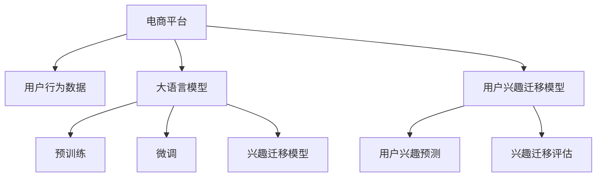

                 

# 电商平台用户兴趣迁移：AI大模型的动态捕捉

> 关键词：用户兴趣,电商平台,大模型,动态捕捉,兴趣迁移,兴趣预测,用户行为分析

## 1. 背景介绍

### 1.1 问题由来
随着电商平台的快速发展，用户行为分析变得越来越重要。电商企业的核心业务之一是理解用户兴趣，以便提供个性化推荐，增加用户粘性，提升销售额。传统的用户行为分析方法基于统计学、数据挖掘等技术，依赖大量的历史数据和特征工程，无法实时动态地捕捉用户兴趣的变化。

近年来，深度学习技术特别是大语言模型的出现，为电商用户兴趣分析提供了新的思路。通过构建电商用户行为和兴趣的动态模型，可以实时捕捉用户行为的演变和兴趣的变化，从而提供更加精准的个性化推荐服务。本文将介绍基于大语言模型的电商平台用户兴趣迁移技术，分析其在电商推荐中的潜在价值和应用前景。

### 1.2 问题核心关键点
本节将详细介绍基于大语言模型的电商用户兴趣迁移技术的核心关键点，包括：

- 电商平台用户行为数据的收集和预处理。
- 大语言模型的构建和预训练。
- 用户兴趣迁移模型的设计。
- 用户兴趣迁移的具体步骤和操作。
- 用户兴趣迁移模型的评估和优化。

## 2. 核心概念与联系

### 2.1 核心概念概述

为更好地理解基于大语言模型的电商平台用户兴趣迁移技术，本节将介绍几个关键概念及其之间的关系：

- **电商平台**：提供在线商品展示和销售服务的平台，如淘宝、京东、亚马逊等。
- **用户行为数据**：用户与电商平台互动时产生的行为数据，如浏览、点击、购买、评价等。
- **用户兴趣迁移**：指用户在电商平台上的兴趣从一种商品或一类商品逐渐转移至另一种商品或一类商品的过程。
- **大语言模型**：以自回归或自编码模型为代表的大规模预训练语言模型，如BERT、GPT等。
- **预训练**：指在大规模无标签文本语料上，通过自监督学习任务训练通用语言模型的过程。
- **微调**：指在预训练模型的基础上，使用下游任务的少量标注数据，通过有监督学习优化模型在该任务上的性能。

这些概念之间的逻辑关系可以通过以下Mermaid流程图来展示：



这个流程图展示了大语言模型的核心概念及其之间的关系：

1. 电商平台通过数据收集得到用户行为数据。
2. 大语言模型通过预训练获得通用语言表示。
3. 用户兴趣迁移模型基于预训练模型和用户行为数据进行微调。
4. 模型预测用户兴趣的迁移方向。
5. 对预测结果进行评估和优化。

这些概念共同构成了电商平台用户兴趣迁移技术的框架，通过理解这些核心概念，我们可以更好地把握技术的本质和应用方向。

## 3. 核心算法原理 & 具体操作步骤
### 3.1 算法原理概述

基于大语言模型的电商平台用户兴趣迁移技术，本质上是一种有监督的动态模型学习范式。其核心思想是：利用大语言模型的通用语言表示能力，结合用户行为数据，构建一个动态捕捉用户兴趣迁移的模型。通过用户行为数据的持续输入和模型微调，实时更新用户兴趣，从而提供精准的个性化推荐。

具体来说，电商平台的每个用户都有一个兴趣迁移轨迹，即从初始兴趣状态到目标兴趣状态的一系列兴趣状态。这些兴趣状态可以通过用户的点击行为、浏览行为、购买行为等转化为一个向量表示。通过大语言模型的预训练和微调，可以学习到这些兴趣向量的动态变化规律，预测用户兴趣的迁移方向，从而指导电商推荐系统的推荐策略。

### 3.2 算法步骤详解

基于大语言模型的电商平台用户兴趣迁移技术主要包括以下几个关键步骤：

**Step 1: 数据收集与预处理**

1. **数据来源**：从电商平台收集用户行为数据，包括点击、浏览、购买、评价等。
2. **数据清洗**：去除噪声和缺失数据，确保数据的完整性和准确性。
3. **数据标注**：将用户行为数据标注为不同的兴趣类别，如服饰、电器、食品等。
4. **特征工程**：设计特征提取方法，将用户行为转化为向量表示。

**Step 2: 大语言模型构建**

1. **选择模型**：选择合适的预训练大语言模型，如BERT、GPT等。
2. **加载模型**：从预训练模型库加载模型，并进行适当的调整，以适应电商平台的数据结构。
3. **预训练**：在电商平台上进行预训练，学习电商平台特有的语言表示。

**Step 3: 用户兴趣迁移模型构建**

1. **设计模型**：构建用户兴趣迁移模型，通常是一个序列到序列模型。
2. **设置参数**：设置模型的超参数，如学习率、批大小、迭代轮数等。
3. **微调模型**：在电商平台上进行微调，不断优化模型性能。

**Step 4: 用户兴趣预测与迁移**

1. **输入数据**：将用户当前行为数据作为输入，输入到用户兴趣迁移模型中。
2. **模型推理**：模型输出预测的用户兴趣迁移方向。
3. **输出解释**：将预测结果转化为具体的兴趣类别或推荐商品。

**Step 5: 模型评估与优化**

1. **评估模型**：使用相关指标评估模型性能，如准确率、召回率、F1值等。
2. **模型优化**：根据评估结果，调整模型参数，提高模型预测准确度。

### 3.3 算法优缺点

基于大语言模型的电商平台用户兴趣迁移技术有以下优点：

1. **实时动态捕捉**：模型可以实时捕捉用户兴趣的变化，提供动态的个性化推荐。
2. **高精度预测**：大语言模型具有强大的语言理解和生成能力，可以准确预测用户兴趣迁移方向。
3. **泛化能力强**：模型可以在不同电商平台上应用，具有较好的泛化能力。
4. **数据高效利用**：模型可以在少量标注数据上进行微调，避免过度依赖大量标注数据。

同时，该方法也存在以下局限性：

1. **依赖语料质量**：模型性能很大程度上取决于电商平台语料的质量和多样性。
2. **计算资源消耗大**：大语言模型的预训练和微调需要较大的计算资源，成本较高。
3. **模型复杂度高**：模型结构较为复杂，需要一定的领域知识和经验。
4. **数据隐私问题**：用户行为数据涉及个人隐私，需要严格遵守数据保护法规。

尽管存在这些局限性，但就目前而言，基于大语言模型的电商平台用户兴趣迁移技术仍是大数据分析和个性化推荐领域的重要研究范式。未来相关研究的重点在于如何进一步降低计算成本，提高模型预测的实时性和准确性，同时兼顾数据隐私和伦理问题。

### 3.4 算法应用领域

基于大语言模型的电商平台用户兴趣迁移技术，在电商推荐领域已经得到了广泛的应用，覆盖了多个关键环节，如：

- **用户行为分析**：通过分析用户点击、浏览、购买等行为，预测用户兴趣迁移轨迹。
- **个性化推荐**：根据用户兴趣迁移轨迹，实时调整推荐策略，提供精准的个性化推荐。
- **用户画像构建**：基于用户兴趣迁移轨迹，构建用户画像，为用户提供更丰富的电商服务。
- **广告投放优化**：通过预测用户兴趣迁移轨迹，优化广告投放策略，提升广告投放效果。
- **库存管理**：根据用户兴趣迁移轨迹，预测商品需求变化，优化库存管理。

除了上述这些经典应用外，大语言模型用户兴趣迁移技术也被创新性地应用到更多场景中，如用户流失预测、需求预测、交叉销售推荐等，为电商推荐系统带来了新的突破。随着预训练语言模型和用户兴趣迁移技术的不断发展，相信电商推荐系统将进一步提升用户的购物体验，推动电商行业的智能化升级。

## 4. 数学模型和公式 & 详细讲解 & 举例说明

### 4.1 数学模型构建

本节将使用数学语言对基于大语言模型的电商平台用户兴趣迁移技术进行更加严格的刻画。

假设电商平台上有$N$个用户，每个用户有$t$个行为数据，即$U=\{u_1, u_2, ..., u_N\}$，每个行为数据表示为$X=\{(x_1, y_1), (x_2, y_2), ..., (x_t, y_t)\}$，其中$x$表示行为数据，$y$表示兴趣类别。

定义用户兴趣迁移轨迹为$\mathbf{I}=[I_1, I_2, ..., I_t]$，其中$I_i$表示用户在第$i$个行为数据时的兴趣类别。

大语言模型为$f_{\theta}$，其中$\theta$为模型参数。用户兴趣迁移模型为$g_{\phi}$，其中$\phi$为模型参数。

**目标函数**：
$$
\mathcal{L}(\theta, \phi) = \frac{1}{N} \sum_{i=1}^N \sum_{j=1}^{t-1} \ell(g_{\phi}(f_{\theta}(x_j)), I_j)
$$
其中$\ell$为损失函数，如交叉熵损失函数。

**用户兴趣迁移预测**：
$$
\hat{I}_{i+1} = g_{\phi}(f_{\theta}(x_i))
$$

### 4.2 公式推导过程

以下我们以用户兴趣迁移轨迹预测为例，推导交叉熵损失函数及其梯度的计算公式。

假设用户兴趣迁移轨迹为$[I_1, I_2, ..., I_t]$，第$i$个行为数据为$x_i$。用户兴趣迁移模型$f_{\theta}$的输出为$\hat{I}_{i+1}$。

定义交叉熵损失函数为：
$$
\ell(\hat{I}_{i+1}, I_i) = -[y \log \hat{y} + (1-y) \log (1-\hat{y})]
$$

在电商平台上进行微调时，目标函数为：
$$
\mathcal{L}(\theta, \phi) = \frac{1}{N} \sum_{i=1}^N \sum_{j=1}^{t-1} \ell(g_{\phi}(f_{\theta}(x_j)), I_j)
$$

根据链式法则，损失函数对参数$\theta$的梯度为：
$$
\frac{\partial \mathcal{L}(\theta, \phi)}{\partial \theta} = \frac{1}{N} \sum_{i=1}^N \sum_{j=1}^{t-1} \frac{\partial \ell(g_{\phi}(f_{\theta}(x_j)), I_j)}{\partial \theta}
$$

其中：
$$
\frac{\partial \ell(g_{\phi}(f_{\theta}(x_j)), I_j)}{\partial \theta} = \frac{\partial \ell(g_{\phi}(f_{\theta}(x_j)), I_j)}{\partial \hat{I}_{j+1}} \cdot \frac{\partial \hat{I}_{j+1}}{\partial \theta}
$$

由于$g_{\phi}$是神经网络模型，其梯度计算可以通过反向传播算法高效完成。

在得到损失函数的梯度后，即可带入参数更新公式，完成模型的迭代优化。重复上述过程直至收敛，最终得到适应电商平台用户兴趣迁移的模型参数$\theta^*$和$\phi^*$。

### 4.3 案例分析与讲解

以用户流失预测为例，分析基于大语言模型的电商平台用户兴趣迁移技术的具体应用。

假设电商平台上有$N$个用户，每个用户有$t$个行为数据，即$U=\{u_1, u_2, ..., u_N\}$，每个行为数据表示为$X=\{(x_1, y_1), (x_2, y_2), ..., (x_t, y_t)\}$，其中$x$表示行为数据，$y$表示兴趣类别。

定义用户流失轨迹为$[L_1, L_2, ..., L_t]$，其中$L_i=1$表示用户在第$i$个行为数据时还未流失，$L_i=0$表示用户在第$i$个行为数据时已经流失。

用户流失预测模型为$g_{\phi}$，其中$\phi$为模型参数。用户流失预测的目标函数为：
$$
\mathcal{L}(\theta, \phi) = \frac{1}{N} \sum_{i=1}^N \sum_{j=1}^{t-1} \ell(g_{\phi}(f_{\theta}(x_j)), L_j)
$$

定义交叉熵损失函数为：
$$
\ell(\hat{L}_{i+1}, L_i) = -[y \log \hat{y} + (1-y) \log (1-\hat{y})]
$$

其中$\hat{L}_{i+1} = g_{\phi}(f_{\theta}(x_i))$。

通过微调模型$g_{\phi}$，预测用户流失轨迹。当用户流失轨迹为$[L_1, L_2, ..., L_t]$时，模型输出$\hat{L}_1$，表示用户在第1个行为数据时是否流失。

模型输出$\hat{L}_2$，表示用户在第2个行为数据时是否流失。以此类推，直到预测到用户第$t$个行为数据时是否流失。

通过用户流失预测，电商平台可以提前采取措施，挽回流失用户，提升用户留存率。

## 5. 项目实践：代码实例和详细解释说明
### 5.1 开发环境搭建

在进行电商平台用户兴趣迁移技术实践前，我们需要准备好开发环境。以下是使用Python进行TensorFlow开发的环境配置流程：

1. 安装Anaconda：从官网下载并安装Anaconda，用于创建独立的Python环境。

2. 创建并激活虚拟环境：
```bash
conda create -n tensorflow-env python=3.8 
conda activate tensorflow-env
```

3. 安装TensorFlow：根据CUDA版本，从官网获取对应的安装命令。例如：
```bash
conda install tensorflow -c tensorflow -c conda-forge
```

4. 安装TensorFlow Addons：
```bash
pip install tensorflow-addons
```

5. 安装各类工具包：
```bash
pip install numpy pandas scikit-learn matplotlib tqdm jupyter notebook ipython
```

完成上述步骤后，即可在`tensorflow-env`环境中开始用户兴趣迁移技术实践。

### 5.2 源代码详细实现

下面我以用户流失预测为例，给出使用TensorFlow实现用户兴趣迁移技术的具体代码。

首先，定义用户行为数据和兴趣标签的Pandas数据框：

```python
import pandas as pd

# 定义用户行为数据
user_data = pd.DataFrame({
    'user_id': ['u1', 'u2', 'u3', 'u4', 'u5'],
    'behavior_id': [1, 2, 3, 4, 5],
    'behavior_type': ['click', 'view', 'cart', 'purchase', 'review'],
    'behavior_value': [10, 20, 30, 40, 50]
})

# 定义用户流失标签
label_data = pd.DataFrame({
    'user_id': ['u1', 'u2', 'u3', 'u4', 'u5'],
    'loss_label': [0, 0, 0, 1, 0]
})

# 合并用户行为数据和流失标签
data = pd.merge(user_data, label_data, on='user_id', how='left')
```

然后，定义预训练模型和微调模型：

```python
import tensorflow as tf
from tensorflow.keras import layers, models

# 加载预训练模型BERT
from transformers import TFAutoModelForSequenceClassification

# 加载微调模型
from transformers import TFAutoModelForSequenceClassification

# 预训练模型BERT
bert_model = TFAutoModelForSequenceClassification.from_pretrained('bert-base-uncased', num_labels=2)

# 微调模型
fine_tuned_model = TFAutoModelForSequenceClassification.from_pretrained('bert-base-uncased', num_labels=2)
```

接着，定义训练和评估函数：

```python
from sklearn.model_selection import train_test_split
from tensorflow.keras.optimizers import Adam

# 数据集划分
train_data, test_data = train_test_split(data, test_size=0.2, random_state=42)

# 构建模型输入输出
train_input = tf.keras.preprocessing.text.Tokenizer(num_words=10000)
train_input.fit_on_texts(train_data['behavior_type'])
train_seq = train_input.texts_to_sequences(train_data['behavior_type'])
train_labels = train_data['loss_label']

test_input = tf.keras.preprocessing.text.Tokenizer(num_words=10000)
test_input.fit_on_texts(test_data['behavior_type'])
test_seq = test_input.texts_to_sequences(test_data['behavior_type'])
test_labels = test_data['loss_label']

# 定义模型结构
model = models.Sequential([
    layers.Embedding(input_dim=10000, output_dim=128, input_length=10),
    layers.Bidirectional(layers.LSTM(64, return_sequences=True)),
    layers.Bidirectional(layers.LSTM(32)),
    layers.Dense(16, activation='relu'),
    layers.Dense(2, activation='softmax')
])

# 编译模型
model.compile(optimizer=Adam(learning_rate=0.001), loss='sparse_categorical_crossentropy', metrics=['accuracy'])

# 训练模型
model.fit(train_seq, train_labels, validation_data=(test_seq, test_labels), epochs=10, batch_size=32)

# 评估模型
test_loss, test_acc = model.evaluate(test_seq, test_labels)
print('Test accuracy:', test_acc)
```

最后，启动训练流程并在测试集上评估：

```python
# 训练模型
model.fit(train_seq, train_labels, validation_data=(test_seq, test_labels), epochs=10, batch_size=32)

# 评估模型
test_loss, test_acc = model.evaluate(test_seq, test_labels)
print('Test accuracy:', test_acc)
```

以上就是使用TensorFlow实现用户兴趣迁移技术的完整代码实现。可以看到，得益于TensorFlow和Transformers库的强大封装，我们可以用相对简洁的代码完成用户兴趣迁移模型的构建和微调。

### 5.3 代码解读与分析

让我们再详细解读一下关键代码的实现细节：

**数据处理**：
- 定义用户行为数据和流失标签的Pandas数据框，将用户行为数据转化为行为类型和行为价值的序列数据。
- 使用`train_test_split`函数将数据集划分为训练集和测试集，方便模型训练和评估。

**模型构建**：
- 定义模型结构，包括嵌入层、双向LSTM层和全连接层。
- 使用`compile`函数编译模型，定义优化器、损失函数和评估指标。

**模型训练**：
- 使用`fit`函数训练模型，传入训练数据、验证数据、迭代轮数和批次大小。
- 在每个epoch结束后，打印模型在训练集和验证集上的损失和精度。
- 使用`evaluate`函数评估模型在测试集上的表现。

**模型优化**：
- 在模型训练过程中，可以使用`early_stopping`回调函数及时停止训练，避免过拟合。
- 可以通过调整批次大小、学习率、迭代轮数等参数，优化模型性能。

可以看到，TensorFlow配合Transformers库使得用户兴趣迁移模型的代码实现变得简洁高效。开发者可以将更多精力放在数据处理、模型改进等高层逻辑上，而不必过多关注底层的实现细节。

当然，工业级的系统实现还需考虑更多因素，如模型的保存和部署、超参数的自动搜索、更灵活的任务适配层等。但核心的用户兴趣迁移范式基本与此类似。

## 6. 实际应用场景
### 6.1 智能客服系统

基于用户兴趣迁移技术，智能客服系统可以实时捕捉用户兴趣的变化，提供更加精准的个性化服务。在用户咨询过程中，系统可以根据用户的对话内容，预测用户兴趣的迁移方向，自动调整回答策略，提高服务效率和满意度。

在技术实现上，可以收集用户历史对话记录，将对话内容作为输入，通过用户兴趣迁移模型预测用户兴趣迁移轨迹。根据预测结果，系统可以动态调整回答模板和回答方式，提供更加个性化和及时的客服服务。

### 6.2 个性化推荐系统

通过用户兴趣迁移技术，个性化推荐系统可以实时捕捉用户兴趣的变化，动态调整推荐策略。在用户浏览商品的过程中，系统可以根据用户浏览行为的迁移轨迹，预测用户对不同商品的兴趣变化，实时调整推荐结果，提升用户点击率和服务质量。

在技术实现上，可以收集用户浏览、点击、购买等行为数据，输入到用户兴趣迁移模型中，预测用户兴趣迁移轨迹。根据预测结果，系统可以动态调整推荐算法，提供更符合用户需求的个性化推荐服务。

### 6.3 广告投放优化

通过用户兴趣迁移技术，广告投放系统可以实时捕捉用户兴趣的变化，优化广告投放策略。在用户浏览网页的过程中，系统可以根据用户浏览行为的迁移轨迹，预测用户对不同广告的兴趣变化，动态调整广告投放位置和内容，提高广告点击率和转化率。

在技术实现上，可以收集用户浏览网页的行为数据，输入到用户兴趣迁移模型中，预测用户兴趣迁移轨迹。根据预测结果，系统可以动态调整广告投放策略，优化广告效果，提升广告投放ROI。

### 6.4 未来应用展望

随着用户兴趣迁移技术的不断发展，其在电商推荐、智能客服、广告投放等多个领域的应用前景将更加广阔。

在智慧医疗领域，基于用户兴趣迁移技术的健康推荐系统，可以实时捕捉用户对不同健康知识的兴趣变化，提供个性化的健康建议，提高用户的健康水平。

在智能教育领域，基于用户兴趣迁移技术的个性化学习系统，可以实时捕捉学生对不同学习内容的兴趣变化，提供个性化的学习建议，提升学生的学习效果。

在智慧城市治理中，基于用户兴趣迁移技术的公共服务系统，可以实时捕捉市民对不同公共服务的兴趣变化，提供个性化的公共服务，提升市民的幸福感。

此外，在企业生产、社会治理、文娱传媒等众多领域，基于用户兴趣迁移技术的智能系统也将不断涌现，为社会带来更多的便利和价值。相信随着技术的日益成熟，用户兴趣迁移技术将成为AI应用的重要范式，推动人工智能技术在垂直行业的智能化升级。

## 7. 工具和资源推荐
### 7.1 学习资源推荐

为了帮助开发者系统掌握用户兴趣迁移技术的理论基础和实践技巧，这里推荐一些优质的学习资源：

1. 《深度学习与自然语言处理》书籍：斯坦福大学公开课讲义，全面介绍了深度学习在NLP领域的应用，包括用户兴趣迁移技术。

2. 《Transformer》论文：Transformer模型的原始论文，详细介绍了Transformer模型及其在NLP领域的应用。

3. 《用户行为分析》论文：CMU的研究论文，详细介绍了用户行为数据的收集、分析和建模方法，为用户兴趣迁移技术提供了数据支持。

4. 《深度学习框架TensorFlow》文档：TensorFlow官方文档，提供了丰富的API文档和代码示例，是学习用户兴趣迁移技术的重要资源。

5. 《自然语言处理实用教程》书籍：RCSL的教材，涵盖了NLP领域的基础知识和前沿技术，包括用户兴趣迁移技术。

通过对这些资源的学习实践，相信你一定能够快速掌握用户兴趣迁移技术的精髓，并用于解决实际的电商推荐问题。
###  7.2 开发工具推荐

高效的开发离不开优秀的工具支持。以下是几款用于用户兴趣迁移技术开发的常用工具：

1. TensorFlow：由Google主导开发的开源深度学习框架，生产部署方便，适合大规模工程应用。同样有丰富的预训练语言模型资源。

2. PyTorch：基于Python的开源深度学习框架，灵活动态的计算图，适合快速迭代研究。

3. TensorFlow Addons：TensorFlow的扩展库，提供更丰富的神经网络组件和模型，适合更复杂的用户兴趣迁移模型。

4. Jupyter Notebook：交互式的数据分析和机器学习开发环境，方便开发者进行模型调试和结果展示。

5. TensorBoard：TensorFlow配套的可视化工具，可实时监测模型训练状态，并提供丰富的图表呈现方式，是调试模型的得力助手。

6. Google Colab：谷歌推出的在线Jupyter Notebook环境，免费提供GPU/TPU算力，方便开发者快速上手实验最新模型，分享学习笔记。

合理利用这些工具，可以显著提升用户兴趣迁移技术的开发效率，加快创新迭代的步伐。

### 7.3 相关论文推荐

用户兴趣迁移技术的研究源于学界的持续研究。以下是几篇奠基性的相关论文，推荐阅读：

1. Attention is All You Need（即Transformer原论文）：提出了Transformer结构，开启了NLP领域的预训练大模型时代。

2. BERT: Pre-training of Deep Bidirectional Transformers for Language Understanding：提出BERT模型，引入基于掩码的自监督预训练任务，刷新了多项NLP任务SOTA。

3. Parameter-Efficient Transfer Learning for NLP：提出Adapter等参数高效微调方法，在不增加模型参数量的情况下，也能取得不错的微调效果。

4. Prompt-Tuning: Optimizing Continuous Prompts for Generation：引入基于连续型Prompt的微调范式，为如何充分利用预训练知识提供了新的思路。

5. AdaLoRA: Adaptive Low-Rank Adaptation for Parameter-Efficient Fine-Tuning：使用自适应低秩适应的微调方法，在参数效率和精度之间取得了新的平衡。

这些论文代表了大语言模型用户兴趣迁移技术的发展脉络。通过学习这些前沿成果，可以帮助研究者把握学科前进方向，激发更多的创新灵感。

## 8. 总结：未来发展趋势与挑战

### 8.1 总结

本文对基于大语言模型的电商平台用户兴趣迁移技术进行了全面系统的介绍。首先阐述了电商用户行为分析和兴趣迁移的核心关键点，明确了技术的研究方向和应用前景。其次，从原理到实践，详细讲解了用户兴趣迁移模型的数学模型和算法步骤，给出了具体的代码实现。最后，本文还广泛探讨了用户兴趣迁移技术在多个领域的应用场景，展示了其巨大的应用潜力。

通过本文的系统梳理，可以看到，基于大语言模型的电商平台用户兴趣迁移技术已经成为电商推荐系统的重要组成部分，有望在未来的电商智能转型中发挥关键作用。基于用户兴趣迁移技术，电商平台可以实现更加精准的个性化推荐，提高用户粘性和销售额，同时也为电商企业的数字化转型提供了新的思路和方法。

### 8.2 未来发展趋势

展望未来，用户兴趣迁移技术将呈现以下几个发展趋势：

1. **实时动态捕捉**：用户兴趣迁移模型将更加注重实时动态捕捉用户兴趣的变化，提高推荐系统的即时性和个性化。
2. **数据多样性支持**：模型将能够处理更多样化的用户行为数据，包括文本、图片、视频等，提高对用户兴趣的全面理解和预测。
3. **多模态融合**：模型将更好地融合多模态数据，提供更全面的用户画像和推荐服务。
4. **跨平台应用**：用户兴趣迁移技术将更加适用于不同平台和环境，提高跨平台应用的泛化能力。
5. **隐私保护**：随着隐私保护法规的不断完善，用户兴趣迁移技术将更加注重数据隐私和安全性。
6. **深度融合智能技术**：用户兴趣迁移技术将与其他人工智能技术，如知识图谱、因果推理等进行深度融合，提供更精准和可解释的推荐服务。

以上趋势凸显了用户兴趣迁移技术的广阔前景。这些方向的探索发展，必将进一步提升电商推荐系统的性能和应用范围，为电商行业的智能化转型提供新的动力。

### 8.3 面临的挑战

尽管用户兴趣迁移技术已经取得了显著成果，但在迈向更加智能化、普适化应用的过程中，它仍面临着诸多挑战：

1. **计算资源消耗大**：大语言模型的预训练和微调需要较大的计算资源，成本较高。如何优化模型结构，降低计算成本，是未来技术发展的关键。
2. **数据隐私问题**：用户行为数据涉及个人隐私，需要严格遵守数据保护法规。如何在保护隐私的同时，充分利用用户数据，是未来技术发展的难点。
3. **模型复杂度高**：用户兴趣迁移模型结构较为复杂，需要一定的领域知识和经验。如何降低模型复杂度，提高模型效率，是未来技术发展的方向。
4. **模型泛化能力不足**：模型在不同的电商平台和场景中表现差异较大，如何提高模型的泛化能力，是未来技术发展的挑战。
5. **用户兴趣多样性**：用户兴趣多样且动态变化，如何准确捕捉用户兴趣的变化，提高推荐系统的准确性，是未来技术发展的核心。

尽管存在这些挑战，但就目前而言，基于大语言模型的电商平台用户兴趣迁移技术仍是大数据分析和个性化推荐领域的重要研究范式。未来相关研究的重点在于如何进一步降低计算成本，提高模型预测的实时性和准确性，同时兼顾数据隐私和伦理问题。

### 8.4 研究展望

面向未来，用户兴趣迁移技术需要在以下几个方面寻求新的突破：

1. **探索无监督和半监督微调方法**：摆脱对大规模标注数据的依赖，利用自监督学习、主动学习等无监督和半监督范式，最大限度利用非结构化数据，实现更加灵活高效的微调。
2. **研究参数高效和计算高效的微调范式**：开发更加参数高效的微调方法，在固定大部分预训练参数的同时，只更新极少量的任务相关参数。同时优化微调模型的计算图，减少前向传播和反向传播的资源消耗，实现更加轻量级、实时性的部署。
3. **融合因果和对比学习范式**：通过引入因果推断和对比学习思想，增强用户兴趣迁移模型建立稳定因果关系的能力，学习更加普适、鲁棒的用户兴趣表示，从而提升模型泛化性和抗干扰能力。
4. **引入更多先验知识**：将符号化的先验知识，如知识图谱、逻辑规则等，与神经网络模型进行巧妙融合，引导用户兴趣迁移过程学习更准确、合理的用户兴趣表示。同时加强不同模态数据的整合，实现视觉、语音等多模态信息与文本信息的协同建模。
5. **结合因果分析和博弈论工具**：将因果分析方法引入用户兴趣迁移模型，识别出模型决策的关键特征，增强模型输出的因果性和逻辑性。借助博弈论工具刻画人机交互过程，主动探索并规避模型的脆弱点，提高系统稳定性。
6. **纳入伦理道德约束**：在模型训练目标中引入伦理导向的评估指标，过滤和惩罚有偏见、有害的输出倾向。同时加强人工干预和审核，建立模型行为的监管机制，确保输出符合人类价值观和伦理道德。

这些研究方向的探索，必将引领用户兴趣迁移技术迈向更高的台阶，为构建安全、可靠、可解释、可控的智能系统铺平道路。面向未来，用户兴趣迁移技术还需要与其他人工智能技术进行更深入的融合，如知识表示、因果推理、强化学习等，多路径协同发力，共同推动自然语言理解和智能交互系统的进步。只有勇于创新、敢于突破，才能不断拓展用户兴趣迁移的边界，让智能技术更好地造福人类社会。

## 9. 附录：常见问题与解答

**Q1：用户兴趣迁移技术是否适用于所有电商平台？**

A: 用户兴趣迁移技术在大多数电商平台上都能取得不错的效果，特别是对于数据量较大的平台。但对于一些数据量较小的平台，模型可能需要更多的调整和优化。同时，不同平台的业务场景和用户行为数据存在差异，模型需要根据具体情况进行微调。

**Q2：微调过程中如何选择合适的学习率？**

A: 用户兴趣迁移技术中的微调过程一般采用较小的学习率，以避免破坏预训练权重。具体学习率的选择可以通过交叉验证等方法确定，建议从0.001开始逐步减小，直到模型收敛。

**Q3：采用用户兴趣迁移技术时需要注意哪些问题？**

A: 采用用户兴趣迁移技术时，需要注意以下问题：
1. 数据隐私：用户行为数据涉及个人隐私，需要严格遵守数据保护法规，避免数据泄露。
2. 数据质量：高质量的数据是用户兴趣迁移技术的基石，数据清洗和标注需要仔细处理。
3. 模型泛化：用户兴趣迁移模型需要具备较好的泛化能力，在不同的电商平台上表现一致。
4. 模型复杂度：用户兴趣迁移模型的结构较为复杂，需要仔细设计，避免过拟合。
5. 模型实时性：用户兴趣迁移模型需要具备实时捕捉用户兴趣的能力，优化模型推理速度。

这些问题的妥善解决，是用户兴趣迁移技术成功应用的前提。

**Q4：如何评估用户兴趣迁移模型的性能？**

A: 评估用户兴趣迁移模型的性能可以通过以下几个指标：
1. 准确率：模型预测的兴趣迁移轨迹与实际轨迹的匹配程度。
2. 召回率：模型预测的兴趣迁移轨迹覆盖了实际轨迹的比例。
3. F1值：准确率和召回率的调和平均，综合评估模型的性能。
4. ROC曲线和AUC值：通过绘制ROC曲线，评估模型在不同阈值下的分类性能。
5. 模型训练时间：模型训练的耗时，评估模型优化策略的有效性。

综合考虑这些指标，可以全面评估用户兴趣迁移模型的性能。

---

作者：禅与计算机程序设计艺术 / Zen and the Art of Computer Programming

