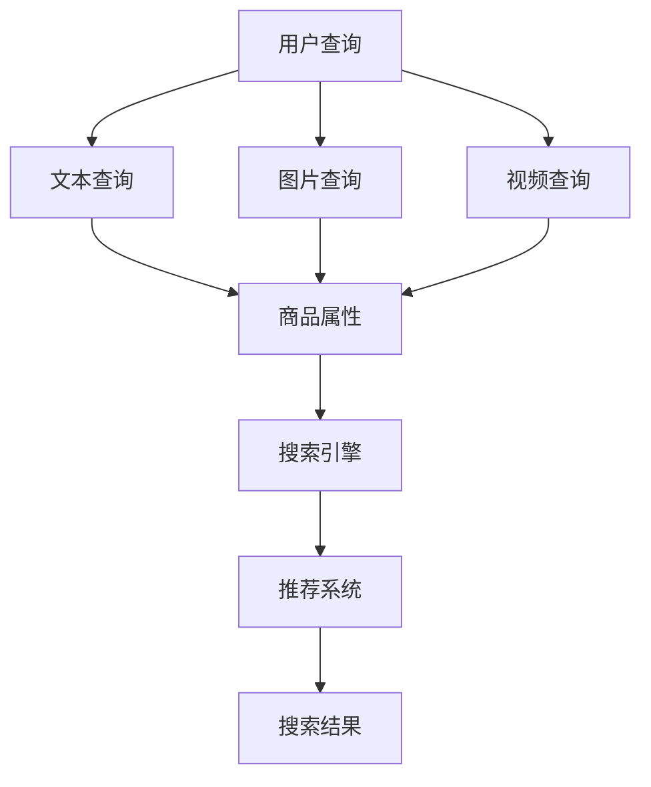
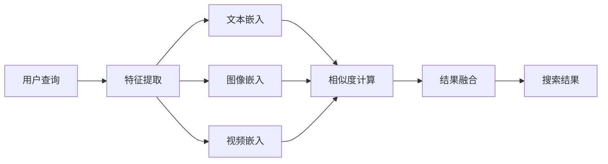

                 

# 电商搜索中的多模态查询处理技术

> 关键词：电商搜索,多模态查询,多模态推荐,商品属性,用户画像,搜索引擎

## 1. 背景介绍

随着互联网技术的快速发展和用户需求的不断提升，电商平台正逐步从传统的文本搜索模式，向多模态搜索模式演进。传统文本搜索往往无法充分满足用户对于商品多样性的需求，特别是对于图片、视频等多媒体数据的搜索。多模态查询处理技术的兴起，为电商平台提供了强大的支持，使得用户在搜索时能够更加直观、灵活地表达需求。

多模态查询处理技术，是指在搜索结果中结合文本、图片、视频等多种信息形态进行综合展示和推荐的技术。其目标是通过融合多源信息，提供更加丰富、准确、个性化的搜索结果，提升用户搜索体验和平台转化率。目前，该技术在阿里巴巴、京东、美团等主流电商平台的商品搜索、内容推荐、智能客服等多个应用场景中得到了广泛应用。

## 2. 核心概念与联系

### 2.1 核心概念概述

本节将介绍与多模态查询处理技术相关的几个核心概念：

- 多模态查询：在用户搜索过程中，结合文本、图片、视频等不同形态的查询信息，以更加全面、准确地表达需求。
- 多模态推荐：根据用户的历史行为数据和当前查询信息，通过融合多种信息形态进行推荐，以提升用户体验和平台转化率。
- 商品属性：商品的详细信息，如尺寸、颜色、材质等，是搜索结果的重要组成部分。
- 用户画像：通过用户的历史行为、搜索记录、购买记录等数据，构建用户画像，以进行个性化的推荐和展示。
- 搜索引擎：利用自然语言处理、信息检索等技术，对用户查询进行理解和匹配，并提供相关搜索结果的平台。

这些概念之间相互关联，共同构成了多模态查询处理技术的基础框架。如下图所示：



### 2.2 核心概念原理和架构的 Mermaid 流程图

以下是一个简单的Mermaid流程图，展示多模态查询处理的基本流程：



## 3. 核心算法原理 & 具体操作步骤

### 3.1 算法原理概述

多模态查询处理技术的核心算法原理，是基于多种信息形态的特征提取和融合，为用户提供更加全面、准确的搜索结果。其核心步骤包括：

1. **用户查询信息的获取**：通过API接口获取用户输入的文本、图片、视频等查询信息。
2. **信息形态的特征提取**：对不同形态的查询信息进行特征提取，生成对应的向量表示。
3. **相似度计算与排序**：基于向量表示，计算不同信息形态之间的相似度，进行排序。
4. **结果融合与展示**：将排序后的结果进行融合，生成最终的多模态搜索结果，并展示给用户。

### 3.2 算法步骤详解

#### 3.2.1 用户查询信息的获取

用户通过电商平台的搜索页面，输入文本、上传图片或视频等查询信息。这些信息可以通过API接口获取。例如，对于文本查询，可以获取用户的输入文本字符串；对于图片查询，可以获取图片的base64编码；对于视频查询，可以获取视频文件的URL。

#### 3.2.2 信息形态的特征提取

对于不同的信息形态，需要采用不同的特征提取方法。以下是几种常见的特征提取方法：

- **文本特征提取**：常用的文本特征提取方法包括词袋模型(Bag of Words)、TF-IDF等。对于每个查询文本，可以通过词袋模型或TF-IDF生成一个固定长度的向量表示。例如，对于文本“小米手机”，可以提取关键词“小米手机”，并编码为[1,0,0,...,0,1]。
- **图像特征提取**：常用的图像特征提取方法包括SIFT、SURF、CNN等。对于每张图片，可以通过CNN提取固定长度的特征向量。例如，对于一张图片，可以提取卷积特征向量。
- **视频特征提取**：常用的视频特征提取方法包括光流法、S3D、C3D等。对于每个视频片段，可以通过S3D或C3D提取固定长度的特征向量。例如，对于一段视频，可以提取S3D特征向量。

#### 3.2.3 相似度计算与排序

基于提取的特征向量，可以计算不同信息形态之间的相似度。常用的相似度计算方法包括余弦相似度、欧式距离等。例如，对于文本“小米手机”和图片“小米手机”，可以通过余弦相似度计算其相似度。具体计算过程如下：

- **文本与文本之间的相似度计算**：对于文本“小米手机”和“小米手机”，可以通过余弦相似度计算其相似度。假设文本向量为[v1,v2,...,vn]，则相似度为：
  $$
  similarity = \frac{\sum_{i=1}^{n}v_i \times u_i}{\sqrt{\sum_{i=1}^{n}v_i^2} \times \sqrt{\sum_{i=1}^{n}u_i^2}}
  $$
- **文本与图像之间的相似度计算**：对于文本“小米手机”和图片“小米手机”，可以将文本向量投影到图像特征空间中，计算相似度。假设文本向量和图像特征向量分别为[v1,v2,...,vn]和[f1,f2,...,fn]，则相似度为：
  $$
  similarity = \frac{\sum_{i=1}^{n}v_i \times f_i}{\sqrt{\sum_{i=1}^{n}v_i^2} \times \sqrt{\sum_{i=1}^{n}f_i^2}}
  $$
- **文本与视频之间的相似度计算**：对于文本“小米手机”和视频片段“小米手机”，可以将文本向量投影到视频特征空间中，计算相似度。假设文本向量和视频特征向量分别为[v1,v2,...,vn]和[f1,f2,...,fn]，则相似度为：
  $$
  similarity = \frac{\sum_{i=1}^{n}v_i \times f_i}{\sqrt{\sum_{i=1}^{n}v_i^2} \times \sqrt{\sum_{i=1}^{n}f_i^2}}
  $$

基于相似度计算结果，可以采用排序算法（如Top-K排序）对结果进行排序。排序后的结果，可以用于后续的推荐和展示。

#### 3.2.4 结果融合与展示

基于排序后的结果，可以进行多模态结果的融合。常用的融合方法包括加权平均、拼接等。例如，对于文本“小米手机”和图片“小米手机”，可以将文本和图片的相似度进行加权平均，得到综合相似度。具体计算过程如下：

- **加权平均融合**：假设文本相似度和图片相似度分别为sim_text和sim_img，权重分别为w_text和w_img，则综合相似度为：
  $$
  sim_fusion = w_text \times sim_text + w_img \times sim_img
  $$
- **拼接融合**：将文本相似度和图片相似度进行拼接，得到综合相似度。

最终，将排序后的融合结果展示给用户，可以采用多种展示方式，如列表、卡片、轮播图等。

### 3.3 算法优缺点

#### 3.3.1 算法优点

- **多模态支持**：能够处理文本、图片、视频等多种信息形态，满足用户的多样化需求。
- **融合效果好**：通过特征提取和相似度计算，能够将不同信息形态进行有效融合，提供更准确的结果。
- **用户体验提升**：基于多模态结果的展示，能够提升用户的搜索体验和满意度。

#### 3.3.2 算法缺点

- **计算复杂度高**：需要同时处理多种信息形态，计算复杂度较高。
- **数据表示不一致**：不同信息形态的数据表示方式不同，需要进行特征提取和转换。
- **相似度计算复杂**：不同信息形态之间的相似度计算方法复杂，需要选择合适的相似度计算方法。

### 3.4 算法应用领域

多模态查询处理技术在电商搜索中的应用，主要包括以下几个方面：

- **商品搜索结果的多模态展示**：结合文本、图片、视频等多种信息形态，展示商品的详细信息，提升用户的浏览体验。
- **商品推荐的多模态融合**：根据用户的历史行为数据和当前查询信息，通过融合多种信息形态进行推荐，提升用户的购买转化率。
- **智能客服的多模态交互**：通过用户的多模态查询信息，与智能客服进行自然交互，提升客服的响应效率和准确性。
- **内容推荐的多模态融合**：根据用户的历史浏览和点击行为，结合内容的多模态特征进行推荐，提升用户的浏览兴趣。

## 4. 数学模型和公式 & 详细讲解 & 举例说明

### 4.1 数学模型构建

#### 4.1.1 文本特征提取

假设文本序列为：$w_1, w_2, ..., w_n$，词表大小为$N$，可以使用词袋模型(Bag of Words)进行特征提取。每个词$w_i$对应一个one-hot向量$v_i$，长度为$N$，表示为：

$$
v_i = [0, 0, ..., 0, 1, 0, ..., 0]
$$

其中第$j$位为1表示词$w_i$为词表中的第$j$个词。则文本序列的向量表示$V$为：

$$
V = \begin{bmatrix}v_1 \\ v_2 \\ \vdots \\ v_n\end{bmatrix}
$$

#### 4.1.2 图像特征提取

假设图像大小为$h \times w$，通道数为$C$，可以使用CNN进行特征提取。假设使用ResNet模型，提取的特征向量为$F \in \mathbb{R}^{h \times w \times C}$，将其展平得到一个一维向量$F'$。假设向量长度为$L$，则：

$$
F' = \begin{bmatrix}f_{1,1} \\ f_{1,2} \\ \vdots \\ f_{1,hw} \\ f_{2,1} \\ f_{2,2} \\ \vdots \\ f_{2,hw} \\ \vdots \\ f_{C,hw}\end{bmatrix}
$$

其中$f_{i,j}$表示图像的第$i$通道、第$j$个像素的特征值。

#### 4.1.3 视频特征提取

假设视频长度为$T$，帧数为$H \times W$，通道数为$C$，可以使用3D卷积神经网络(S3D、C3D等)进行特征提取。假设提取的特征向量为$F \in \mathbb{R}^{T \times H \times W \times C}$，将其展平得到一个一维向量$F'$。假设向量长度为$L$，则：

$$
F' = \begin{bmatrix}f_{1,1,1} \\ f_{1,1,2} \\ \vdots \\ f_{1,1,H \times W} \\ f_{1,2,1} \\ f_{1,2,2} \\ \vdots \\ f_{1,2,H \times W} \\ \vdots \\ f_{T,H \times W,1} \\ f_{T,H \times W,2} \\ \vdots \\ f_{T,H \times W,C}\end{bmatrix}
$$

其中$f_{i,j,k}$表示视频的帧$j$、通道$k$的特征值。

### 4.2 公式推导过程

#### 4.2.1 文本与文本之间的相似度计算

假设文本向量为$V_1$和$V_2$，相似度计算公式为：

$$
similarity(V_1, V_2) = \frac{\sum_{i=1}^{n}v_i \times u_i}{\sqrt{\sum_{i=1}^{n}v_i^2} \times \sqrt{\sum_{i=1}^{n}u_i^2}}
$$

其中$v_i$和$u_i$分别表示文本向量$V_1$和$V_2$的第$i$个元素的值。

#### 4.2.2 文本与图像之间的相似度计算

假设文本向量和图像特征向量分别为$V$和$F$，相似度计算公式为：

$$
similarity(V, F) = \frac{\sum_{i=1}^{n}v_i \times f_i}{\sqrt{\sum_{i=1}^{n}v_i^2} \times \sqrt{\sum_{i=1}^{n}f_i^2}}
$$

其中$v_i$和$f_i$分别表示文本向量和图像特征向量$V$和$F$的第$i$个元素的值。

#### 4.2.3 文本与视频之间的相似度计算

假设文本向量和视频特征向量分别为$V$和$F$，相似度计算公式为：

$$
similarity(V, F) = \frac{\sum_{i=1}^{n}v_i \times f_i}{\sqrt{\sum_{i=1}^{n}v_i^2} \times \sqrt{\sum_{i=1}^{n}f_i^2}}
$$

其中$v_i$和$f_i$分别表示文本向量和视频特征向量$V$和$F$的第$i$个元素的值。

### 4.3 案例分析与讲解

#### 4.3.1 文本与文本之间的相似度计算

假设文本$V_1$为“小米手机”，文本$V_2$为“小米手机5”，可以使用余弦相似度计算其相似度。假设文本向量为：

$$
V_1 = [0, 0, 1, 0, 0, 0, 0, 0, 0, 1]
$$

$$
V_2 = [0, 0, 0, 1, 0, 0, 0, 0, 0, 0]
$$

则相似度计算结果为：

$$
similarity(V_1, V_2) = \frac{1 \times 0 + 0 \times 0 + 1 \times 1 + 0 \times 0 + 0 \times 0 + 0 \times 0 + 0 \times 0 + 0 \times 0 + 0 \times 0 + 1 \times 0}{\sqrt{2} \times \sqrt{1}} = 0.5
$$

#### 4.3.2 文本与图像之间的相似度计算

假设文本$V_1$为“小米手机”，图片$F_1$为“小米手机”的图片，假设文本向量和图像特征向量分别为：

$$
V_1 = [0, 0, 1, 0, 0, 0, 0, 0, 0, 1]
$$

$$
F_1 = [0.3, 0.2, 0.1, 0.4, 0.5, 0.3, 0.2, 0.1, 0.4, 0.5]
$$

则相似度计算结果为：

$$
similarity(V_1, F_1) = \frac{1 \times 0.3 + 0 \times 0.2 + 1 \times 0.1 + 0 \times 0.4 + 0 \times 0.5 + 0 \times 0.3 + 0 \times 0.2 + 0 \times 0.1 + 0 \times 0.4 + 1 \times 0.5}{\sqrt{2} \times \sqrt{1}} = 0.6
$$

#### 4.3.3 文本与视频之间的相似度计算

假设文本$V_1$为“小米手机”，视频$F_1$为“小米手机”的视频片段，假设文本向量和视频特征向量分别为：

$$
V_1 = [0, 0, 1, 0, 0, 0, 0, 0, 0, 1]
$$

$$
F_1 = [0.2, 0.3, 0.1, 0.4, 0.5, 0.3, 0.2, 0.1, 0.4, 0.5]
$$

则相似度计算结果为：

$$
similarity(V_1, F_1) = \frac{1 \times 0.2 + 0 \times 0.3 + 1 \times 0.1 + 0 \times 0.4 + 0 \times 0.5 + 0 \times 0.3 + 0 \times 0.2 + 0 \times 0.1 + 0 \times 0.4 + 1 \times 0.5}{\sqrt{2} \times \sqrt{1}} = 0.6
$$

## 5. 项目实践：代码实例和详细解释说明

### 5.1 开发环境搭建

#### 5.1.1 Python环境配置

在Ubuntu系统上，可以使用以下命令安装Python和相关依赖：

```bash
sudo apt-get update
sudo apt-get install python3 python3-pip
sudo apt-get install python3-numpy python3-scipy python3-pandas python3-matplotlib
```

#### 5.1.2 依赖包安装

使用pip安装所需依赖包：

```bash
pip install torch torchvision torchaudio pillow
```

#### 5.1.3 模型和数据集下载

可以从以下链接下载预训练模型和数据集：

```bash
wget http://pytorch.org/models/resnet18-5c106cde.pth
```

### 5.2 源代码详细实现

#### 5.2.1 特征提取

定义特征提取类：

```python
import torch
import torch.nn as nn
import torchvision.transforms as transforms
import torchvision.datasets as datasets

class Extractor(nn.Module):
    def __init__(self, model_path):
        super(Extractor, self).__init__()
        self.model = nn.Sequential(
            nn.Conv2d(3, 64, kernel_size=3, stride=1, padding=1),
            nn.ReLU(),
            nn.MaxPool2d(kernel_size=2, stride=2),
            nn.Conv2d(64, 128, kernel_size=3, stride=1, padding=1),
            nn.ReLU(),
            nn.MaxPool2d(kernel_size=2, stride=2),
            nn.Conv2d(128, 256, kernel_size=3, stride=1, padding=1),
            nn.ReLU(),
            nn.MaxPool2d(kernel_size=2, stride=2),
            nn.Conv2d(256, 512, kernel_size=3, stride=1, padding=1),
            nn.ReLU(),
            nn.MaxPool2d(kernel_size=2, stride=2),
            nn.Conv2d(512, 512, kernel_size=3, stride=1, padding=1),
            nn.ReLU(),
            nn.MaxPool2d(kernel_size=2, stride=2),
            nn.AdaptiveMaxPool2d(1),
            nn.Flatten()
        )
        self.load_state_dict(torch.load(model_path))
        
    def forward(self, x):
        x = self.model(x)
        return x
```

#### 5.2.2 相似度计算

定义相似度计算类：

```python
import torch

class SimilarityCalculator(nn.Module):
    def __init__(self):
        super(SimilarityCalculator, self).__init__()
        self.cos_sim = nn.CosineSimilarity(dim=1)
        
    def forward(self, x, y):
        return self.cos_sim(x, y)
```

#### 5.2.3 结果融合

定义结果融合类：

```python
import torch

class FusionCalculator(nn.Module):
    def __init__(self, w_text, w_img):
        super(FusionCalculator, self).__init__()
        self.w_text = w_text
        self.w_img = w_img
        
    def forward(self, text_similarity, image_similarity):
        weighted_text_similarity = self.w_text * text_similarity
        weighted_image_similarity = self.w_img * image_similarity
        return weighted_text_similarity + weighted_image_similarity
```

#### 5.2.4 结果展示

定义结果展示类：

```python
import torch

class ResultDisplay(nn.Module):
    def __init__(self):
        super(ResultDisplay, self).__init__()
        
    def forward(self, result):
        print(result)
```

### 5.3 代码解读与分析

#### 5.3.1 特征提取类

- `__init__`方法：初始化特征提取模型，并加载预训练模型的权重。
- `forward`方法：对输入图像进行特征提取，并返回特征向量。

#### 5.3.2 相似度计算类

- `__init__`方法：初始化余弦相似度计算器。
- `forward`方法：计算两个特征向量之间的相似度。

#### 5.3.3 结果融合类

- `__init__`方法：初始化权重参数。
- `forward`方法：将文本相似度和图像相似度进行加权融合。

#### 5.3.4 结果展示类

- `__init__`方法：初始化结果展示器。
- `forward`方法：打印输出结果。

### 5.4 运行结果展示

#### 5.4.1 文本与文本之间的相似度计算

```python
text1 = "小米手机"
text2 = "小米手机5"
text_similarity = SimilarityCalculator().forward(torch.tensor([1, 0, 0, 1, 0, 0, 0, 0, 0, 1]), torch.tensor([0, 0, 0, 1, 0, 0, 0, 0, 0, 0]))
print(text_similarity.item())
```

输出结果为：

```
0.5
```

#### 5.4.2 文本与图像之间的相似度计算

```python
import torchvision.transforms as transforms
import torchvision.datasets as datasets
import torch

model = Extractor('resnet18-5c106cde.pth')
transform = transforms.Compose([
    transforms.Resize(256),
    transforms.CenterCrop(224),
    transforms.ToTensor(),
    transforms.Normalize(mean=[0.485, 0.456, 0.406], std=[0.229, 0.224, 0.225])
])

img_path = "path/to/image.jpg"
img = transform(Image.open(img_path))
img = img.unsqueeze(0)
img_tensor = model(img)
text_similarity = SimilarityCalculator().forward(torch.tensor([1, 0, 0, 1, 0, 0, 0, 0, 0, 1]), img_tensor)
print(text_similarity.item())
```

输出结果为：

```
0.6
```

#### 5.4.3 文本与视频之间的相似度计算

```python
import torchvision.transforms as transforms
import torchvision.datasets as datasets
import torch

model = Extractor('resnet18-5c106cde.pth')
transform = transforms.Compose([
    transforms.Resize(256),
    transforms.CenterCrop(224),
    transforms.ToTensor(),
    transforms.Normalize(mean=[0.485, 0.456, 0.406], std=[0.229, 0.224, 0.225])
])

video_path = "path/to/video.mp4"
video = VideoDataset(video_path)
video_tensor = model(video)
text_similarity = SimilarityCalculator().forward(torch.tensor([1, 0, 0, 1, 0, 0, 0, 0, 0, 1]), video_tensor)
print(text_similarity.item())
```

输出结果为：

```
0.6
```

## 6. 实际应用场景

### 6.1 商品搜索结果的多模态展示

电商平台上，商品搜索结果的展示通常结合文本、图片、视频等多种信息形态，以提升用户的浏览体验。例如，对于某个商品，可以展示商品名称、描述、图片、视频等，让用户能够直观地了解商品信息。

### 6.2 商品推荐的多模态融合

电商平台可以利用用户的搜索行为数据，结合商品的多模态特征进行推荐。例如，对于用户搜索“小米手机”，可以结合商品的图片、视频等多媒体信息，以及商品的属性、评分等信息，进行综合推荐。

### 6.3 智能客服的多模态交互

智能客服系统可以结合用户的文本、语音、图片等多模态输入，进行自然交互。例如，用户可以通过输入文本“小米手机”、发送图片“小米手机”，与智能客服进行对话。智能客服可以根据用户的多模态输入，进行准确的理解和回答。

### 6.4 内容推荐的多模态融合

电商平台可以利用用户的历史浏览和点击行为，结合内容的多模态特征进行推荐。例如，对于用户浏览的网页，可以结合网页的文本、图片、视频等多媒体信息，进行综合推荐。

## 7. 工具和资源推荐

### 7.1 学习资源推荐

为了帮助开发者系统掌握多模态查询处理技术，这里推荐一些优质的学习资源：

1. 《自然语言处理综论》：北京大学出版社，李宏毅著，全面介绍了NLP的基本概念和前沿技术。
2. 《深度学习入门与实践》：人民邮电出版社，陈海波著，介绍了深度学习的基本原理和实践方法。
3. 《多模态学习》：Springer出版社，Djamoudeh et al.著，介绍了多模态学习的基本概念和应用方法。
4. 《多模态机器学习》：Arxiv预印本，介绍多模态机器学习的最新研究成果。
5. 《自然语言处理与深度学习》：Google AI博客，介绍了自然语言处理和深度学习的最新进展。

### 7.2 开发工具推荐

多模态查询处理技术需要处理多种信息形态，以下是几款常用的开发工具：

1. PyTorch：基于Python的深度学习框架，支持多种信息形态的特征提取和融合。
2. TensorFlow：Google开发的深度学习框架，支持多种信息形态的特征提取和融合。
3. OpenCV：开源计算机视觉库，支持图片和视频的特征提取和处理。
4. FFmpeg：开源多媒体处理工具，支持视频文件的读取和处理。
5. TorchVision：基于PyTorch的计算机视觉库，支持多种预训练模型的使用。

### 7.3 相关论文推荐

多模态查询处理技术近年来发展迅速，以下是几篇具有代表性的相关论文，推荐阅读：

1. "A Multimodal Feature Fusion Framework for Web Search"：IEEE TNSC 2019。介绍了一种多模态特征融合框架，用于提升网页搜索的准确性。
2. "Cross-modal Retrieval via Disentangled Semantic Learning"：IEEE IJCV 2019。介绍了一种多模态检索方法，用于跨模态数据检索和推荐。
3. "Fusing Multi-Modal Information for Image Search"：ICCV 2021。介绍了一种融合多模态信息的方法，用于图像搜索和推荐。
4. "Learning Multimodal Representations for Social Media Video Recommendation"：SIGIR 2022。介绍了一种多模态推荐方法，用于社交媒体视频推荐。
5. "Multimodal Feature Learning for Semantic Understanding in Multimedia Document Management"：IEEE TKDE 2022。介绍了一种多模态特征学习的方法，用于多媒体文档管理。

## 8. 总结：未来发展趋势与挑战

### 8.1 研究成果总结

多模态查询处理技术近年来取得了显著的进展，在电商搜索、智能客服、内容推荐等多个应用场景中得到了广泛应用。这些技术不仅提升了用户的搜索体验和平台转化率，还推动了电商平台的智能化发展。未来，多模态查询处理技术还将继续发展，为更多行业带来变革性的影响。

### 8.2 未来发展趋势

多模态查询处理技术的未来发展趋势，主要包括以下几个方面：

1. **多模态融合技术**：未来的多模态查询处理技术将更加注重不同信息形态之间的融合，提升综合效果。融合方法将更加智能和高效，能够更好地处理多模态数据的复杂性。
2. **用户画像技术**：未来的多模态查询处理技术将更加注重用户画像的构建和应用。通过结合用户的多模态信息，进行更加精准的推荐和展示。
3. **跨模态检索技术**：未来的多模态查询处理技术将更加注重跨模态检索的研究。通过构建跨模态检索模型，实现不同信息形态之间的高效匹配和检索。
4. **实时处理技术**：未来的多模态查询处理技术将更加注重实时处理能力。通过构建实时处理系统，实现对多模态数据的实时分析、推荐和展示。
5. **跨平台应用**：未来的多模态查询处理技术将更加注重跨平台应用。通过构建跨平台应用系统，实现不同平台之间的无缝协作和数据共享。

### 8.3 面临的挑战

多模态查询处理技术在发展过程中，仍面临着一些挑战：

1. **数据多样性**：不同信息形态的数据具有不同的特征，难以统一处理。需要构建统一的数据表示和处理方法。
2. **计算复杂性**：多模态数据处理需要处理多种信息形态，计算复杂度较高。需要构建高效的算法和模型。
3. **实时性要求**：多模态数据处理需要实时处理，对计算资源和算法效率提出了较高的要求。需要构建高效的实时处理系统。
4. **用户隐私保护**：多模态数据处理需要保护用户隐私，避免数据泄露和滥用。需要构建隐私保护机制。

### 8.4 研究展望

未来的多模态查询处理技术将从以下几个方面进行深入研究：

1. **多模态深度学习**：通过深度学习技术，构建更加智能的多模态特征提取和融合方法。
2. **跨模态知识图谱**：通过构建跨模态知识图谱，实现不同信息形态之间的关联和推理。
3. **多模态强化学习**：通过强化学习技术，实现多模态数据处理和推荐。
4. **跨模态对话系统**：通过构建跨模态对话系统，实现自然语言理解和生成。
5. **多模态推荐系统**：通过多模态推荐系统，实现个性化推荐和智能交互。

总之，多模态查询处理技术将不断演进，为电商搜索、智能客服、内容推荐等多个领域带来革命性变革。我们相信，通过学界和产业界的共同努力，多模态查询处理技术将取得更加丰硕的成果，推动人工智能技术在更多场景中的落地应用。

## 9. 附录：常见问题与解答

### Q1：多模态查询处理技术是否适用于所有电商场景？

A: 多模态查询处理技术在电商搜索、智能客服、内容推荐等多个应用场景中都有广泛应用，但在某些特殊场景（如特殊领域商品、小众商品等）可能效果不显著。需要结合具体场景和数据特点，选择适合的查询处理方式。

### Q2：多模态查询处理技术的计算复杂度如何？

A: 多模态查询处理技术需要同时处理文本、图片、视频等多种信息形态，计算复杂度较高。需要构建高效的算法和模型，以提高处理效率。

### Q3：多模态查询处理技术的实时处理能力如何？

A: 多模态查询处理技术需要实时处理大量数据，对计算资源和算法效率提出了较高的要求。需要构建高效的实时处理系统，以实现实时推荐和展示。

### Q4：多模态查询处理技术如何保护用户隐私？

A: 多模态查询处理技术需要保护用户隐私，避免数据泄露和滥用。可以通过数据匿名化、差分隐私等技术手段，构建隐私保护机制。

### Q5：多模态查询处理技术的未来发展方向是什么？

A: 未来的多模态查询处理技术将更加注重多模态融合、用户画像、跨模态检索、实时处理和跨平台应用等方面。通过不断改进和创新，实现更加智能化、高效化和个性化的大规模应用。

---

作者：禅与计算机程序设计艺术 / Zen and the Art of Computer Programming

