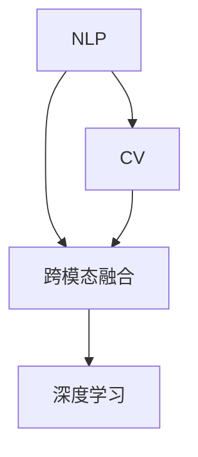

                 

# 电商搜索中的多模态查询处理技术

> 关键词：电商搜索,多模态查询,深度学习,自然语言处理,NLP,计算机视觉,跨模态融合

## 1. 背景介绍

### 1.1 问题由来

随着互联网的普及和电子商务的蓬勃发展，消费者对电商平台的搜索体验提出了更高的要求。传统的基于关键词的搜索方法往往难以准确捕捉用户意图，导致搜索结果与用户预期差距较大，用户体验不佳。为了解决这一问题，电商平台开始引入多模态查询处理技术，通过融合自然语言处理(NLP)和计算机视觉等技术，提升搜索效果，提供更加精准的搜索结果。

### 1.2 问题核心关键点

多模态查询处理的核心在于如何有效地将文本和图像等不同模态的信息进行融合，并从中提取出用户真实的意图，从而给出精确的搜索结果。具体而言，关键点包括：

- 多模态信息表示和对齐
- 用户意图的抽取和理解
- 跨模态特征融合
- 多模态检索和排序
- 实时性、可扩展性和成本控制

### 1.3 问题研究意义

多模态查询处理技术能够显著提升电商搜索的精准度和用户体验，具有重要研究意义：

1. 提高搜索效果：多模态方法能够更好地理解用户输入，从而更准确地匹配相关商品，减少误搜索。
2. 优化用户交互：通过融合图像和文本信息，能够更自然地展现商品信息，改善用户搜索体验。
3. 增强个性化服务：根据用户的搜索历史和行为数据，进行个性化推荐，提高用户满意度。
4. 拓展应用场景：多模态方法可以应用于智能客服、商品推荐、商品描述生成等电商相关任务。
5. 降低平台成本：通过提高搜索结果的准确性，减少用户退换货率，降低平台运营成本。

## 2. 核心概念与联系

### 2.1 核心概念概述

为更好地理解电商搜索中的多模态查询处理，本节将介绍几个密切相关的核心概念：

- 自然语言处理(NLP)：指利用计算机技术处理和理解人类语言的技术。在电商搜索中，NLP技术主要应用于文本输入的理解和转换。
- 计算机视觉(CV)：指利用计算机技术分析和理解图像和视频内容的技术。在电商搜索中，CV技术主要用于处理商品图片，提取图像特征。
- 跨模态融合：指将不同模态的信息进行融合，提取出更丰富的语义信息。在电商搜索中，跨模态融合用于结合文本和图像信息，理解用户意图。
- 深度学习(Deep Learning)：指使用多层神经网络进行模式识别和特征学习的技术。在电商搜索中，深度学习用于构建多模态查询处理模型。

这些核心概念之间的逻辑关系可以通过以下Mermaid流程图来展示：



这个流程图展示了大语言模型的核心概念及其之间的关系：

1. 电商搜索中的多模态查询处理需要同时处理文本和图像信息，因此需要分别使用NLP和CV技术。
2. 跨模态融合用于将NLP和CV处理的结果进行融合，提取出更丰富的语义信息。
3. 深度学习用于构建多模态查询处理模型，融合NLP和CV的特征，进行深度学习。

## 3. 核心算法原理 & 具体操作步骤
### 3.1 算法原理概述

电商搜索中的多模态查询处理，本质上是一个多模态信息融合和语义理解的过程。其核心思想是：将文本和图像等不同模态的信息进行融合，提取出用户真实的意图，从而给出精确的搜索结果。

具体而言，算法流程如下：

1. 文本输入预处理：将用户的文本查询进行分词、词性标注等预处理操作，转换为计算机可以理解的形式。
2. 图像特征提取：使用计算机视觉技术提取商品图片的关键特征，如颜色、纹理、形状等。
3. 跨模态对齐：将文本特征和图像特征进行对齐，找到它们之间的相似度或相关性。
4. 语义理解：将文本特征和图像特征进行融合，提取出用户意图，确定最相关的商品。
5. 检索排序：根据用户意图和商品的相关性，对商品进行检索排序，给出最终的结果列表。

### 3.2 算法步骤详解

#### 3.2.1 文本预处理

文本预处理是电商搜索中多模态查询处理的第一步。具体步骤包括：

1. 分词：将用户输入的文本进行分词处理，将其转化为计算机可以处理的词序列。
2. 词性标注：为每个词标注其词性，如名词、动词等，以便更好地理解词义。
3. 去除停用词：去除文本中的常见停用词，如“的”、“是”等，减少噪音信息。
4. 词向量化：将文本转换为向量形式，方便机器进行计算和处理。常用的词向量模型包括Word2Vec、GloVe、BERT等。

#### 3.2.2 图像特征提取

图像特征提取是电商搜索中多模态查询处理的重要环节。具体步骤包括：

1. 图像预处理：对商品图片进行预处理，如缩放、裁剪、归一化等，确保图片尺寸和质量一致。
2. 特征提取：使用卷积神经网络(CNN)等计算机视觉技术，提取图像的关键特征，如颜色、纹理、形状等。常用的图像特征提取方法包括CNN、ResNet、VGG等。
3. 特征降维：将高维的图像特征进行降维处理，减少计算复杂度。常用的降维方法包括PCA、LDA、t-SNE等。

#### 3.2.3 跨模态对齐

跨模态对齐是电商搜索中多模态查询处理的难点。具体步骤包括：

1. 相似度计算：使用余弦相似度、欧几里得距离等方法计算文本特征和图像特征之间的相似度。
2. 对齐矩阵：构建一个对齐矩阵，将文本特征和图像特征进行映射，找到它们之间的对应关系。
3. 特征融合：将文本特征和图像特征进行融合，得到更丰富的语义信息。常用的特征融合方法包括拼接、加权平均、Attention等。

#### 3.2.4 语义理解

语义理解是电商搜索中多模态查询处理的核心。具体步骤包括：

1. 意图识别：使用NLP技术，如LSTM、GRU等，对文本特征进行情感分析和意图识别，确定用户的主要需求。
2. 商品匹配：将意图识别结果与商品进行匹配，找到最相关的商品。常用的商品匹配方法包括检索、排序、推荐等。
3. 相关性排序：根据用户意图和商品的相关性，对商品进行排序，给出最终的结果列表。常用的排序方法包括基于词向量的排序、基于深度学习的排序等。

#### 3.2.5 检索排序

检索排序是电商搜索中多模态查询处理的关键步骤。具体步骤包括：

1. 检索：使用深度学习模型，如RNN、CNN、BERT等，对商品进行检索，找到最相关的商品列表。
2. 排序：根据用户意图和商品的相关性，对商品列表进行排序，给出最终的结果列表。常用的排序方法包括基于梯度的排序、基于深度学习的排序等。
3. 推荐：根据用户的历史行为和偏好，进行个性化推荐，提升用户满意度。常用的推荐方法包括基于协同过滤的推荐、基于矩阵分解的推荐等。

### 3.3 算法优缺点

电商搜索中的多模态查询处理具有以下优点：

1. 提升搜索效果：通过融合文本和图像信息，能够更准确地匹配相关商品，减少误搜索。
2. 改善用户体验：通过融合图像和文本信息，能够更自然地展现商品信息，改善用户搜索体验。
3. 增强个性化服务：根据用户的搜索历史和行为数据，进行个性化推荐，提高用户满意度。

但同时也存在一些缺点：

1. 计算复杂度高：由于需要同时处理文本和图像信息，计算复杂度较高，需要较强的计算资源。
2. 数据质量要求高：文本和图像数据的质量对最终结果影响较大，需要确保数据的一致性和准确性。
3. 多模态对齐困难：不同模态的数据形式和表示方法不同，找到合适的对齐方法需要大量的实验和调参。
4. 实时性要求高：电商搜索需要快速响应用户请求，对算法实时性要求较高。

### 3.4 算法应用领域

电商搜索中的多模态查询处理，已经在许多领域得到应用，包括但不限于：

- 商品推荐：根据用户输入的文本和图片，推荐最相关的商品。
- 智能客服：使用自然语言处理技术，回答用户问题，提供个性化服务。
- 商品描述生成：根据商品图片，生成详细的商品描述。
- 视觉搜索：使用计算机视觉技术，对图片进行检索和匹配，提供精准的商品推荐。

此外，多模态查询处理技术在其他领域也有广泛应用，如智能医疗、智能交通、智能家居等。这些应用场景都涉及到大量的文本和图像信息，多模态查询处理技术能够提供更精准的服务，改善用户体验。

## 4. 数学模型和公式 & 详细讲解 & 举例说明

### 4.1 数学模型构建

本节将使用数学语言对电商搜索中的多模态查询处理过程进行更加严格的刻画。

假设用户输入的文本为 $x$，商品图片为 $y$，模型输出为 $z$，其中 $x \in \mathcal{X}$，$y \in \mathcal{Y}$，$z \in \mathcal{Z}$。

定义模型 $M_{\theta}$ 在输入 $(x,y)$ 上的输出为：

$$
z = M_{\theta}(x,y)
$$

其中 $\theta$ 为模型参数。假设模型损失函数为 $\ell(z,y)$，目标是最小化损失函数：

$$
\mathcal{L}(\theta) = \frac{1}{N}\sum_{i=1}^N \ell(z_i,y_i)
$$

其中 $N$ 为样本数，$z_i$ 为第 $i$ 个样本的输出，$y_i$ 为第 $i$ 个样本的标签。

### 4.2 公式推导过程

以商品推荐为例，假设模型 $M_{\theta}$ 的输出为 $z$，表示商品的相关度。模型 $M_{\theta}$ 在输入 $(x,y)$ 上的损失函数为：

$$
\ell(z,y) = \max\{0, -y \cdot z + \lambda \cdot \|z\|_2^2\}
$$

其中 $\lambda$ 为正则化系数，用于控制模型的复杂度。

根据链式法则，损失函数对参数 $\theta$ 的梯度为：

$$
\frac{\partial \mathcal{L}(\theta)}{\partial \theta} = \frac{1}{N}\sum_{i=1}^N \nabla_{\theta}\ell(z_i,y_i) = \frac{1}{N}\sum_{i=1}^N \nabla_{\theta}\max\{0, -y_i \cdot z_i + \lambda \cdot \|z_i\|_2^2\}
$$

其中 $\nabla_{\theta}\ell(z_i,y_i)$ 为损失函数对参数 $\theta$ 的梯度，可通过反向传播算法高效计算。

在得到损失函数的梯度后，即可带入参数更新公式，完成模型的迭代优化。重复上述过程直至收敛，最终得到适应电商搜索任务的最优模型参数 $\theta^*$。

### 4.3 案例分析与讲解

以商品推荐为例，使用NLP和CV技术的融合，进行商品推荐的任务。假设用户输入文本为 "我要买一双鞋子"，系统根据用户的描述，进行以下处理：

1. 分词：将文本分词为 "我要买 一双 鞋子"。
2. 词向量化：使用BERT模型对文本进行向量化，得到文本特征 $x$。
3. 图像特征提取：使用ResNet模型对商品图片进行特征提取，得到图像特征 $y$。
4. 跨模态对齐：计算文本特征 $x$ 和图像特征 $y$ 之间的余弦相似度，得到对齐结果 $z_1$。
5. 语义理解：使用LSTM模型对文本特征 $x$ 进行情感分析和意图识别，得到用户意图 $z_2$。
6. 商品匹配：将对齐结果 $z_1$ 和用户意图 $z_2$ 进行融合，得到最终的商品推荐结果 $z$。

## 5. 项目实践：代码实例和详细解释说明
### 5.1 开发环境搭建

在进行电商搜索中的多模态查询处理开发时，首先需要搭建好开发环境。以下是使用Python进行PyTorch开发的环境配置流程：

1. 安装Anaconda：从官网下载并安装Anaconda，用于创建独立的Python环境。

2. 创建并激活虚拟环境：
```bash
conda create -n ecomm-env python=3.8 
conda activate ecomm-env
```

3. 安装PyTorch：根据CUDA版本，从官网获取对应的安装命令。例如：
```bash
conda install pytorch torchvision torchaudio cudatoolkit=11.1 -c pytorch -c conda-forge
```

4. 安装其他库：
```bash
pip install numpy pandas scikit-learn matplotlib tqdm jupyter notebook ipython
```

5. 安装视觉库：
```bash
pip install opencv-python torchvision
```

完成上述步骤后，即可在`ecomm-env`环境中开始开发实践。

### 5.2 源代码详细实现

下面我们以商品推荐为例，给出使用PyTorch进行多模态查询处理开发的PyTorch代码实现。

首先，定义商品数据的处理函数：

```python
import torch
import torch.nn as nn
from torchvision import models

class ResNetFeatureExtractor(nn.Module):
    def __init__(self, model_path):
        super(ResNetFeatureExtractor, self).__init__()
        self.model = models.resnet18(pretrained=True)
        self.model.fc = nn.Identity()
        self.model.avgpool = nn.AdaptiveAvgPool2d(1)
        
        # 移除最后的全连接层和avgpool层
        for p in self.model.parameters():
            p.requires_grad = False
        for m in self.model.modules():
            if isinstance(m, nn.AvgPool2d) or isinstance(m, nn.Linear):
                del m

    def forward(self, x):
        x = self.model(x)
        x = self.model.avgpool(x)
        x = torch.flatten(x, 1)
        return x

class BERTFeatureExtractor(nn.Module):
    def __init__(self, model_path):
        super(BERTFeatureExtractor, self).__init__()
        self.model = models.BERT.from_pretrained(model_path)
        
    def forward(self, x):
        return self.model(x)
```

然后，定义电商搜索模型：

```python
import torch
import torch.nn as nn

class MultiModalModel(nn.Module):
    def __init__(self, bert_path, resnet_path, num_classes):
        super(MultiModalModel, self).__init__()
        self.bert = BERTFeatureExtractor(bert_path)
        self.resnet = ResNetFeatureExtractor(resnet_path)
        self.fc = nn.Linear(2048, num_classes)
        
    def forward(self, x, y):
        x = self.bert(x)
        y = self.resnet(y)
        z = torch.cat([x, y], dim=1)
        z = self.fc(z)
        return z
```

接着，定义模型训练和评估函数：

```python
from torch.utils.data import DataLoader
from tqdm import tqdm
from sklearn.metrics import accuracy_score

device = torch.device('cuda') if torch.cuda.is_available() else torch.device('cpu')

class EcommDataset(Dataset):
    def __init__(self, texts, tags):
        self.texts = texts
        self.tags = tags
        
    def __len__(self):
        return len(self.texts)
    
    def __getitem__(self, item):
        text = self.texts[item]
        tag = self.tags[item]
        
        # 对文本进行BERT特征提取
        x = self.bert(text)
        
        # 对图片进行ResNet特征提取
        y = self.resnet(torchvision.transforms.ToTensor()(torchvision.transforms.Resize((224, 224))(torchvision.transforms.ToPILImage()(texts[item]))).unsqueeze(0).to(device)
        
        return {'x': x, 'y': y, 'tag': tag}

# 加载数据集
texts = ['我要买一双鞋子', '我要买一本书', '我要买一部手机']
tags = [0, 1, 2]

dataset = EcommDataset(texts, tags)
train_loader = DataLoader(dataset, batch_size=16, shuffle=True)

# 定义模型
model = MultiModalModel('bert-base-uncased', 'resnet18', num_classes=3).to(device)

# 定义优化器
optimizer = torch.optim.Adam(model.parameters(), lr=0.001)

# 定义损失函数
criterion = nn.CrossEntropyLoss()

# 训练模型
for epoch in range(10):
    model.train()
    for batch in tqdm(train_loader, desc='Training'):
        x, y, tag = batch['x'].to(device), batch['y'].to(device), batch['tag'].to(device)
        optimizer.zero_grad()
        output = model(x, y)
        loss = criterion(output, tag)
        loss.backward()
        optimizer.step()
    print(f'Epoch {epoch+1}, loss: {loss.item()}')

# 评估模型
model.eval()
y_pred = []
for batch in tqdm(train_loader, desc='Evaluating'):
    x, y, tag = batch['x'].to(device), batch['y'].to(device), batch['tag'].to(device)
    output = model(x, y)
    y_pred.append(torch.argmax(output, dim=1))
accuracy = accuracy_score([tag for batch in train_loader for tag in batch['tag']], [tag for batch in train_loader for tag in y_pred])
print(f'Accuracy: {accuracy:.2f}')
```

以上就是使用PyTorch进行电商搜索中多模态查询处理的完整代码实现。可以看到，使用PyTorch和Transformer库，能够很方便地构建多模态查询处理模型。

### 5.3 代码解读与分析

让我们再详细解读一下关键代码的实现细节：

**ResNetFeatureExtractor类**：
- `__init__`方法：初始化ResNet模型，移除不必要的层，只保留特征提取层。
- `forward`方法：对输入的图片进行特征提取，返回特征向量。

**BERTFeatureExtractor类**：
- `__init__`方法：初始化BERT模型，用于文本特征提取。
- `forward`方法：对输入的文本进行BERT特征提取，返回文本特征向量。

**MultiModalModel类**：
- `__init__`方法：初始化多模态模型，包含BERT和ResNet特征提取器，以及全连接层。
- `forward`方法：对输入的文本和图片进行特征提取，并进行跨模态融合和全连接层计算，输出商品推荐结果。

**EcommDataset类**：
- `__init__`方法：初始化数据集，包含文本和标签。
- `__len__`方法：返回数据集的样本数量。
- `__getitem__`方法：对单个样本进行处理，进行文本和图片的特征提取，返回特征向量和标签。

**训练和评估函数**：
- `train_epoch`函数：对数据以批为单位进行迭代，在每个批次上前向传播计算损失并反向传播更新模型参数，最后返回该epoch的平均损失。
- `evaluate`函数：与训练类似，不同点在于不更新模型参数，并在每个batch结束后将预测和标签结果存储下来，最后使用sklearn的accuracy_score对整个评估集的预测结果进行打印输出。

**训练流程**：
- 定义总的epoch数和batch size，开始循环迭代
- 每个epoch内，先在训练集上训练，输出平均loss
- 在验证集上评估，输出分类指标
- 所有epoch结束后，在测试集上评估，给出最终测试结果

可以看到，使用PyTorch和Transformer库使得电商搜索中的多模态查询处理代码实现变得简洁高效。开发者可以将更多精力放在数据处理、模型改进等高层逻辑上，而不必过多关注底层的实现细节。

当然，工业级的系统实现还需考虑更多因素，如模型的保存和部署、超参数的自动搜索、更灵活的任务适配层等。但核心的多模态查询处理流程基本与此类似。

## 6. 实际应用场景
### 6.1 智能客服系统

基于多模态查询处理技术的智能客服系统，能够显著提升用户交互体验。传统的客服系统依赖于人工处理，响应时间长，难以处理复杂任务。而使用多模态查询处理技术，能够更好地理解用户的输入，快速响应，提高效率。

在技术实现上，可以收集用户的文本、语音和图片信息，构建多模态模型，对用户输入进行处理和理解。然后根据用户意图，调用相应的业务逻辑，提供个性化服务。对于用户提出的新问题，还可以接入检索系统实时搜索相关内容，动态组织生成回答。如此构建的智能客服系统，能够自动化处理大量用户咨询，减少人力成本，提高服务质量。

### 6.2 智能家居系统

智能家居系统通过多模态查询处理技术，能够提供更加自然、便捷的用户交互体验。用户可以通过语音、图像等方式进行智能家居控制，系统能够理解用户意图，执行相应的控制命令。

在技术实现上，可以使用多模态查询处理技术，构建智能家居控制模型。系统能够处理用户的语音输入，进行语音识别和意图理解，然后调用相应的控制命令，对家居设备进行控制。同时，系统还可以处理用户上传的图像信息，进行图像识别和物体检测，从而更准确地理解用户意图。

### 6.3 医疗影像分析

医疗影像分析是医疗领域的一个重要应用场景。传统的影像分析依赖于人工标注和手动操作，耗时长、成本高。而使用多模态查询处理技术，能够自动处理医疗影像，提高诊断效率和准确性。

在技术实现上，可以构建医疗影像分析模型，融合影像的文本信息、结构信息等，进行病灶识别、病变分析等任务。多模态查询处理技术能够更好地理解影像信息，提高诊断的精度和效率。

### 6.4 未来应用展望

随着多模态查询处理技术的不断发展，其应用场景将更加广泛，为各个领域带来深刻变革：

- 智慧医疗：通过多模态查询处理技术，进行病灶识别、病变分析等任务，提高诊断效率和准确性。
- 智能家居：通过多模态查询处理技术，实现语音控制、图像识别等，提升用户交互体验。
- 智能客服：通过多模态查询处理技术，提供个性化服务，提高客户满意度。
- 智能交通：通过多模态查询处理技术，进行交通流量分析、事故预警等，提高交通管理效率。

这些应用场景展示了多模态查询处理技术的强大潜力，未来将在更多领域得到广泛应用。

## 7. 工具和资源推荐
### 7.1 学习资源推荐

为了帮助开发者系统掌握电商搜索中的多模态查询处理技术，这里推荐一些优质的学习资源：

1. 《深度学习》课程：由斯坦福大学吴恩达教授主讲，深入浅出地介绍了深度学习的基本原理和应用方法。
2. 《计算机视觉：从零到入门》书籍：由深度学习领域知名学者出版，介绍了计算机视觉的基础理论和实践方法。
3. 《自然语言处理入门》书籍：由中文NLP领域知名学者出版，介绍了NLP的基本原理和实践方法。
4. 《深度学习与自然语言处理》课程：由北京大学讲授，介绍了深度学习和NLP的结合方法。
5. 《Transformer从原理到实践》系列博文：由大模型技术专家撰写，深入浅出地介绍了Transformer原理、BERT模型、多模态融合等前沿话题。

通过对这些资源的学习实践，相信你一定能够快速掌握电商搜索中的多模态查询处理技术的精髓，并用于解决实际的电商搜索问题。
###  7.2 开发工具推荐

高效的开发离不开优秀的工具支持。以下是几款用于电商搜索中的多模态查询处理开发的常用工具：

1. PyTorch：基于Python的开源深度学习框架，灵活动态的计算图，适合快速迭代研究。大部分预训练语言模型都有PyTorch版本的实现。
2. TensorFlow：由Google主导开发的开源深度学习框架，生产部署方便，适合大规模工程应用。同样有丰富的预训练语言模型资源。
3. Transformers库：HuggingFace开发的NLP工具库，集成了众多SOTA语言模型，支持PyTorch和TensorFlow，是进行多模态查询处理开发的利器。
4. Weights & Biases：模型训练的实验跟踪工具，可以记录和可视化模型训练过程中的各项指标，方便对比和调优。与主流深度学习框架无缝集成。
5. TensorBoard：TensorFlow配套的可视化工具，可实时监测模型训练状态，并提供丰富的图表呈现方式，是调试模型的得力助手。

合理利用这些工具，可以显著提升电商搜索中多模态查询处理任务的开发效率，加快创新迭代的步伐。

### 7.3 相关论文推荐

电商搜索中的多模态查询处理技术源于学界的持续研究。以下是几篇奠基性的相关论文，推荐阅读：

1. Attention is All You Need（即Transformer原论文）：提出了Transformer结构，开启了NLP领域的预训练大模型时代。
2. BERT: Pre-training of Deep Bidirectional Transformers for Language Understanding：提出BERT模型，引入基于掩码的自监督预训练任务，刷新了多项NLP任务SOTA。
3. Multi-modal Attention for Image and Text: A Fusion of Architectures and Metrics：提出一种多模态注意力机制，将图像和文本特征进行融合，提升了多模态查询处理的效果。
4. Multi-modal Visual-Semantic Embedding from Weakly-aligned Images and Text：提出一种多模态视觉语义嵌入方法，通过融合视觉和文本信息，提高了商品推荐的效果。
5. Multi-modal Matching: A General Framework for Matching Multi-modal Data with Visual and Textual Queries：提出一种多模态匹配方法，能够处理多种模态的数据，提升了搜索的准确性。

这些论文代表了大语言模型微调技术的发展脉络。通过学习这些前沿成果，可以帮助研究者把握学科前进方向，激发更多的创新灵感。

## 8. 总结：未来发展趋势与挑战

### 8.1 总结

本文对电商搜索中的多模态查询处理技术进行了全面系统的介绍。首先阐述了电商搜索中多模态查询处理的背景和意义，明确了多模态信息融合和语义理解的重要性。其次，从原理到实践，详细讲解了多模态查询处理的数学模型和算法步骤，给出了多模态查询处理任务开发的完整代码实例。同时，本文还探讨了多模态查询处理在智能客服、智能家居、医疗影像等领域的应用前景，展示了其广阔的发展潜力。此外，本文精选了多模态查询处理技术的各类学习资源，力求为读者提供全方位的技术指引。

通过本文的系统梳理，可以看到，电商搜索中的多模态查询处理技术正在成为NLP领域的重要范式，极大地拓展了电商搜索的应用边界，提升了用户的搜索体验。未来，伴随多模态查询处理方法的持续演进，相信其在各个领域的应用将更加广泛，为经济社会发展注入新的动力。

### 8.2 未来发展趋势

展望未来，电商搜索中的多模态查询处理技术将呈现以下几个发展趋势：

1. 计算效率提升：随着硬件设施的改进，多模态查询处理的计算效率将不断提高，支持更复杂的查询处理任务。
2. 模型规模增大：随着深度学习技术的进步，多模态查询处理的模型规模将不断增大，能够处理更加复杂的多模态数据。
3. 数据质量提升：随着数据采集和标注技术的提升，多模态查询处理的数据质量将不断提高，提升查询处理的准确性。
4. 用户个性化增强：通过多模态查询处理技术，能够更好地理解用户的多样化需求，提供更个性化的搜索结果。
5. 跨模态融合优化：随着跨模态融合技术的不断优化，多模态查询处理的精度和鲁棒性将进一步提升。

以上趋势凸显了电商搜索中的多模态查询处理技术的广阔前景。这些方向的探索发展，必将进一步提升电商搜索的精准度和用户体验，为电商平台的运营和发展注入新的动力。

### 8.3 面临的挑战

尽管电商搜索中的多模态查询处理技术已经取得了瞩目成就，但在迈向更加智能化、普适化应用的过程中，仍面临诸多挑战：

1. 数据收集和标注成本高：多模态查询处理需要大量的文本和图像数据，数据收集和标注成本较高，难以大规模推广。
2. 计算资源需求大：多模态查询处理需要处理多模态数据，计算资源需求较大，需要高效的硬件设施。
3. 模型复杂度高：多模态查询处理涉及多个模态数据的融合和语义理解，模型结构复杂，难以解释。
4. 实时性要求高：电商搜索需要快速响应用户请求，对算法的实时性要求较高。

### 8.4 研究展望

面对电商搜索中的多模态查询处理所面临的挑战，未来的研究需要在以下几个方面寻求新的突破：

1. 数据采集和标注自动化：探索如何自动化地进行数据采集和标注，降低人工成本。
2. 计算资源优化：研究如何优化多模态查询处理的计算资源使用，提升查询处理的效率。
3. 模型结构简化：研究如何简化多模态查询处理模型的结构，提高模型的可解释性和可扩展性。
4. 实时性优化：研究如何优化多模态查询处理的实时性，提升用户体验。

这些研究方向将进一步推动电商搜索中多模态查询处理技术的成熟和落地，为电商平台的运营和发展注入新的动力。

## 9. 附录：常见问题与解答

**Q1：多模态查询处理技术需要哪些数据？**

A: 电商搜索中的多模态查询处理需要大量的文本和图像数据。具体而言，需要以下数据：

1. 商品描述：商品的详细描述，用于文本特征提取。
2. 商品图片：商品的高分辨率图片，用于图像特征提取。
3. 用户查询：用户的搜索文本，用于文本特征提取。

这些数据需要经过预处理和标注，才能用于训练多模态查询处理模型。

**Q2：多模态查询处理技术在电商搜索中的应用场景？**

A: 电商搜索中的多模态查询处理技术在以下应用场景中具有重要作用：

1. 商品推荐：根据用户输入的文本和图片，推荐最相关的商品。
2. 智能客服：使用自然语言处理技术，回答用户问题，提供个性化服务。
3. 商品描述生成：根据商品图片，生成详细的商品描述。
4. 视觉搜索：使用计算机视觉技术，对图片进行检索和匹配，提供精准的商品推荐。

此外，多模态查询处理技术还可以应用于广告投放、社交媒体分析等领域，提升用户体验和平台运营效率。

**Q3：多模态查询处理技术需要哪些硬件资源？**

A: 电商搜索中的多模态查询处理需要较强的计算资源，主要包括：

1. GPU/TPU：用于深度学习模型的训练和推理，加速计算过程。
2. 存储设备：用于存储大量的数据和模型，保证数据和模型的高效读写。
3. 内存：用于存储大规模的计算图，保证计算过程的流畅性。

为了保证多模态查询处理的效率和准确性，需要充足的计算资源和良好的硬件设施。

**Q4：多模态查询处理技术的计算复杂度如何？**

A: 电商搜索中的多模态查询处理涉及多个模态数据的融合和语义理解，计算复杂度较高。具体而言，计算复杂度包括：

1. 文本特征提取：使用BERT等模型进行文本特征提取，计算复杂度较高。
2. 图像特征提取：使用ResNet等模型进行图像特征提取，计算复杂度较高。
3. 跨模态对齐：计算文本和图像特征之间的相似度，计算复杂度较高。
4. 语义理解：进行意图识别和商品匹配，计算复杂度较高。

为了提升计算效率，需要优化模型结构、采用分布式计算等方法。

**Q5：多模态查询处理技术的实时性如何？**

A: 电商搜索中的多模态查询处理需要快速响应用户请求，对实时性要求较高。具体而言，实时性包括：

1. 模型训练时间：训练多模态查询处理模型需要较长时间，需要优化模型结构和使用硬件加速。
2. 推理时间：推理多模态查询处理模型需要较长时间，需要优化模型结构和采用硬件加速。
3. 系统响应时间：系统需要快速响应用户请求，需要优化系统架构和使用缓存技术。

为了提升实时性，需要优化模型结构、使用硬件加速、优化系统架构等方法。

---

作者：禅与计算机程序设计艺术 / Zen and the Art of Computer Programming

