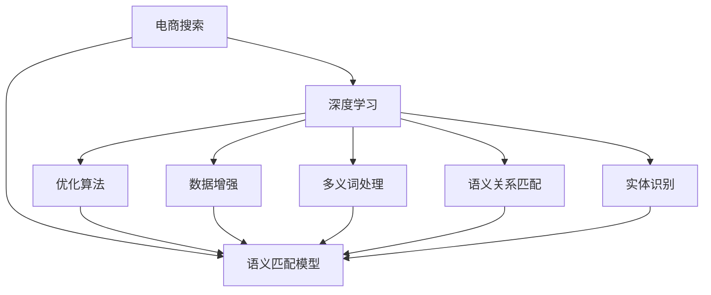

                 

# 电商搜索中的语义匹配模型优化

> 关键词：语义匹配模型, 电商搜索, 自然语言处理, 深度学习, 优化算法, 优化目标, 深度神经网络, 电商推荐系统

## 1. 背景介绍

### 1.1 问题由来

在电商搜索领域，用户通过搜索词查找商品已成为常见的操作方式。但传统的搜索算法仅基于关键词匹配，忽略了搜索词之间的语义关联，导致搜索结果不精准、用户体验差。

近年来，随着深度学习技术和大规模语料库的迅速发展，语义匹配模型被广泛应用于电商搜索中。这类模型不仅能够理解和提取搜索词的语义信息，还能通过多义词、语义关系、实体识别等技术，提高搜索结果的相关性和用户满意度。

但随着电商搜索场景的日益复杂，语义匹配模型的性能瓶颈逐渐显现。如何优化模型，提升其准确性和鲁棒性，成为当下亟需解决的问题。

### 1.2 问题核心关键点

目前，语义匹配模型的优化主要集中于以下几个方面：

- 多义词处理：解决搜索词的歧义性，提高匹配准确度。
- 语义关系匹配：理解搜索词间的语义关系，提升搜索结果的相关性。
- 实体识别：识别搜索词中的实体，避免无关信息的干扰。
- 深度神经网络：利用深度学习提高模型的非线性拟合能力，增强泛化性能。
- 优化算法：选择合适的优化算法，提升模型的训练速度和收敛性能。
- 数据增强：增加训练数据的多样性，避免过拟合。

这些问题不仅影响模型的效果，还关系到用户体验和商家收益，因此亟需深入研究和优化。

## 2. 核心概念与联系

### 2.1 核心概念概述

为更好地理解电商搜索中的语义匹配模型优化方法，本节将介绍几个密切相关的核心概念：

- 语义匹配模型：利用深度神经网络对搜索词的语义信息进行提取和匹配，提高搜索结果的相关性和用户满意度。
- 电商搜索：用户在电商平台输入搜索词，查找满足需求的商品的过程。
- 深度学习：通过构建深度神经网络模型，自动学习数据中的复杂非线性关系，提高模型的泛化能力。
- 优化算法：用于训练模型参数，提高模型准确性和收敛速度的算法，如梯度下降、Adam等。
- 数据增强：通过变换训练样本的方式，增加训练集的多样性，防止模型过拟合。
- 多义词处理：解决搜索词的歧义性，提高匹配准确度。
- 语义关系匹配：理解搜索词间的语义关系，提升搜索结果的相关性。
- 实体识别：识别搜索词中的实体，避免无关信息的干扰。

这些概念之间的逻辑关系可以通过以下Mermaid流程图来展示：



这个流程图展示语义匹配模型的核心概念及其之间的关系：

1. 电商搜索通过用户输入的搜索词，启动语义匹配模型的处理。
2. 语义匹配模型利用深度学习提取搜索词的语义信息，应用多义词处理、语义关系匹配、实体识别等技术，生成相关搜索结果。
3. 优化算法用于训练模型参数，提高模型的准确性和收敛速度。
4. 数据增强增加训练集的多样性，防止模型过拟合。

这些概念共同构成了语义匹配模型的学习和应用框架，使其能够在电商搜索场景下发挥强大的语义匹配能力。

## 3. 核心算法原理 & 具体操作步骤
### 3.1 算法原理概述

语义匹配模型的核心思想是通过深度神经网络，自动学习搜索词之间的语义关系和上下文信息，从而提高匹配精度和用户满意度。其算法原理如下：

1. **数据预处理**：对搜索词进行分词、词性标注、命名实体识别等预处理，提取特征。
2. **嵌入表示**：将预处理后的文本转换为向量表示，通常使用Word2Vec、GloVe等词嵌入技术。
3. **模型设计**：构建深度神经网络模型，如双向LSTM、BERT等，用于学习搜索词的语义关系。
4. **优化目标**：设置优化目标函数，如交叉熵损失、余弦相似度等，最小化模型预测误差。
5. **模型训练**：使用优化算法（如Adam、SGD等）更新模型参数，迭代优化模型。
6. **结果输出**：模型对输入搜索词进行匹配，输出相关搜索结果。

### 3.2 算法步骤详解

基于上述原理，语义匹配模型的操作步骤如下：

**Step 1: 数据预处理**

- 对用户输入的搜索词进行分词、词性标注、命名实体识别等预处理。
- 提取搜索词的特征向量，如词嵌入、n-gram向量等。

**Step 2: 模型设计**

- 设计深度神经网络模型，如双向LSTM、BERT等。
- 选择合适的损失函数，如交叉熵损失、余弦相似度等。

**Step 3: 模型训练**

- 准备训练集，将预处理后的搜索词和对应的搜索结果进行配对。
- 使用优化算法（如Adam、SGD等）更新模型参数，迭代优化模型。

**Step 4: 结果输出**

- 模型对输入搜索词进行匹配，输出相关搜索结果。
- 根据搜索结果的相关性和用户的点击反馈，进一步优化模型。

### 3.3 算法优缺点

语义匹配模型在电商搜索中具有以下优点：

- **精度高**：通过深度学习自动学习语义信息，匹配精度高。
- **鲁棒性好**：能够处理多义词、语义关系、实体识别等多方面的信息，鲁棒性较好。
- **灵活性高**：适应各种电商搜索场景，如商品推荐、智能客服等。

但同时，也存在一些局限性：

- **计算成本高**：深度神经网络计算复杂，训练时间长。
- **数据需求高**：需要大量标注数据，获取成本较高。
- **过拟合风险**：训练集规模较小，容易过拟合。

### 3.4 算法应用领域

语义匹配模型在电商搜索中的应用非常广泛，包括：

- 商品推荐：根据用户搜索词推荐相关商品，提高用户满意度。
- 智能客服：通过语义匹配模型，自动解答用户问题，提升服务效率。
- 广告投放：利用语义匹配模型优化广告投放策略，提高转化率。
- 搜索结果排序：优化搜索结果排序算法，提升用户体验。
- 用户体验优化：通过语义匹配模型，提供个性化的搜索推荐。

## 4. 数学模型和公式 & 详细讲解 & 举例说明

### 4.1 数学模型构建

基于深度神经网络的语义匹配模型，可以表示为：

$$
y = \text{softmax}(W_{out} \cdot \text{softmax}(W_{rec} \cdot \text{softmax}(W_{emb} \cdot \text{softmax}(x)))
$$

其中：

- $x$ 为输入搜索词的嵌入向量。
- $W_{emb}$ 为词嵌入矩阵，$W_{emb} \cdot \text{softmax}(x)$ 表示对输入向量进行softmax处理，生成n-gram嵌入向量。
- $W_{rec}$ 为上下文关系矩阵，$W_{rec} \cdot \text{softmax}(W_{emb} \cdot \text{softmax}(x))$ 表示对上下文关系向量进行softmax处理，生成上下文关系嵌入向量。
- $W_{out}$ 为输出矩阵，$W_{out} \cdot \text{softmax}(W_{rec} \cdot \text{softmax}(W_{emb} \cdot \text{softmax}(x)))$ 表示对上下文关系向量进行softmax处理，生成最终输出向量。
- $\text{softmax}$ 函数用于生成概率分布，通常用于多分类任务。

### 4.2 公式推导过程

以双向LSTM模型为例，假设输入序列为 $x_1, x_2, \dots, x_t$，对应的双向LSTM模型可以表示为：

$$
h_t = \text{LSTM}(h_{t-1}, x_t)
$$

其中 $h_t$ 为第 $t$ 个时间步的隐藏状态，$h_{t-1}$ 为前一个时间步的隐藏状态，$x_t$ 为第 $t$ 个时间步的输入。

在训练过程中，双向LSTM模型的目标函数为交叉熵损失函数：

$$
L(\theta) = -\frac{1}{N} \sum_{i=1}^N \sum_{j=1}^t y_{ij} \log p_{ij}
$$

其中 $y_{ij}$ 为第 $i$ 个样本在第 $j$ 个时间步的标签，$p_{ij}$ 为模型预测的概率分布。

根据梯度下降算法，模型参数 $\theta$ 的更新公式为：

$$
\theta \leftarrow \theta - \eta \nabla_{\theta}L(\theta)
$$

其中 $\eta$ 为学习率，$\nabla_{\theta}L(\theta)$ 为损失函数对模型参数的梯度，可通过反向传播算法高效计算。

### 4.3 案例分析与讲解

假设有一个电商搜索任务，用户输入了搜索词 "高价好鞋子"，模型需要对该搜索词进行匹配，返回相关商品。

**Step 1: 数据预处理**

- 对搜索词进行分词，得到 ["高", "价", "好", "鞋子"]。
- 对每个词进行词性标注，得到 ["n", "a", "a", "n"]。
- 进行命名实体识别，得到 ["n", "a", "a", "n"]。

**Step 2: 模型设计**

- 设计双向LSTM模型，输入为 ["高", "价", "好", "鞋子"]，输出为每个词的嵌入向量。
- 设计softmax层，将双向LSTM的输出向量转换为概率分布。

**Step 3: 模型训练**

- 准备训练集，将预处理后的搜索词和对应的搜索结果进行配对。
- 使用优化算法（如Adam、SGD等）更新模型参数，迭代优化模型。

**Step 4: 结果输出**

- 模型对输入搜索词进行匹配，输出相关搜索结果。
- 根据搜索结果的相关性和用户的点击反馈，进一步优化模型。

## 5. 项目实践：代码实例和详细解释说明
### 5.1 开发环境搭建

在进行语义匹配模型优化实践前，我们需要准备好开发环境。以下是使用Python进行TensorFlow开发的环境配置流程：

1. 安装Anaconda：从官网下载并安装Anaconda，用于创建独立的Python环境。

2. 创建并激活虚拟环境：
```bash
conda create -n tf-env python=3.8 
conda activate tf-env
```

3. 安装TensorFlow：根据CUDA版本，从官网获取对应的安装命令。例如：
```bash
conda install tensorflow tensorflow-gpu=cuda11.1 -c tf
```

4. 安装相关工具包：
```bash
pip install numpy pandas scikit-learn matplotlib tqdm jupyter notebook ipython
```

完成上述步骤后，即可在`tf-env`环境中开始语义匹配模型优化实践。

### 5.2 源代码详细实现

下面我们以商品推荐任务为例，给出使用TensorFlow进行双向LSTM模型训练的Python代码实现。

首先，定义双向LSTM模型和损失函数：

```python
import tensorflow as tf
from tensorflow.keras.layers import Input, LSTM, Dense, Embedding, Concatenate
from tensorflow.keras.models import Model

# 定义输入层
input_layer = Input(shape=(MAX_SEQ_LEN,), dtype='int32')

# 定义词嵌入层
embedding_layer = Embedding(input_dim=VOCAB_SIZE, output_dim=EMBEDDING_DIM, mask_zero=True)(input_layer)

# 定义双向LSTM层
lstm_layer = LSTM(128, return_sequences=True, return_state=True, dropout=0.2)(embedding_layer)

# 定义softmax层
output_layer = Dense(3, activation='softmax')(lstm_layer[0])

# 定义模型
model = Model(inputs=input_layer, outputs=output_layer)
```

然后，定义训练和评估函数：

```python
# 定义交叉熵损失函数
def loss_func(y_true, y_pred):
    return tf.reduce_mean(tf.keras.losses.categorical_crossentropy(y_true, y_pred))

# 定义优化器
optimizer = tf.keras.optimizers.Adam()

# 定义训练函数
def train_epoch(model, dataset, batch_size, optimizer):
    model.compile(optimizer=optimizer, loss=loss_func)
    for batch in dataset:
        inputs, labels = batch
        model.train_on_batch(inputs, labels)

# 定义评估函数
def evaluate(model, dataset, batch_size):
    model.evaluate(dataset, batch_size=batch_size)
```

最后，启动训练流程并在测试集上评估：

```python
# 假设训练集和测试集数据集已经准备就绪
epochs = 10
batch_size = 64

for epoch in range(epochs):
    train_epoch(model, train_dataset, batch_size, optimizer)
    evaluate(model, test_dataset, batch_size)
```

以上就是使用TensorFlow进行双向LSTM模型训练的完整代码实现。可以看到，TensorFlow的高级API使得模型构建和训练过程变得简洁高效。

### 5.3 代码解读与分析

让我们再详细解读一下关键代码的实现细节：

**双向LSTM模型定义**：
- 使用`Input`层定义输入层，shape为最大序列长度。
- 使用`Embedding`层进行词嵌入，输入维度为词汇表大小，输出维度为嵌入维度，`mask_zero=True`表示处理序列末尾的0值。
- 使用`LSTM`层构建双向LSTM，隐藏层单元数为128，返回序列和隐藏状态，`dropout=0.2`表示使用20%的dropout防止过拟合。
- 使用`Dense`层进行softmax操作，输出3个类别的概率分布。

**训练函数定义**：
- 使用`compile`方法定义模型编译，设置优化器和损失函数。
- 使用`train_on_batch`方法进行训练，每次输入一个批次的输入和标签，更新模型参数。

**评估函数定义**：
- 使用`evaluate`方法在测试集上评估模型，输出模型在测试集上的准确率。

**训练流程**：
- 定义总训练轮数和批次大小。
- 循环训练，每个epoch训练一次，在测试集上评估一次。

可以看到，TensorFlow的高阶API和丰富的工具使得深度学习模型的构建和训练过程变得便捷高效。

## 6. 实际应用场景
### 6.1 智能客服系统

智能客服系统是语义匹配模型在电商搜索中的重要应用之一。传统的客服系统需要大量人力维护，高峰期响应缓慢，且一致性和专业性难以保证。利用语义匹配模型，可以构建7x24小时不间断服务的智能客服系统。

在技术实现上，可以收集企业内部的历史客服对话记录，将问题和最佳答复构建成监督数据，在此基础上对双向LSTM模型进行训练。训练后的模型能够自动理解用户意图，匹配最合适的答案模板进行回复。对于用户提出的新问题，还可以接入检索系统实时搜索相关内容，动态组织生成回答。

### 6.2 商品推荐系统

商品推荐系统是电商搜索的核心功能之一。传统的推荐系统往往只依赖用户的历史行为数据进行物品推荐，无法深入理解用户的真实兴趣偏好。利用语义匹配模型，可以深入挖掘用户对商品名称、描述、评价等文本信息的语义理解，从而提供更精准、多样的推荐内容。

在实践中，可以收集用户浏览、点击、评价、分享等行为数据，提取和商品相关的文本信息。将文本信息作为模型输入，用户的后续行为（如是否点击、购买等）作为监督信号，在此基础上训练双向LSTM模型。训练后的模型能够从文本内容中准确把握用户的兴趣点。在生成推荐列表时，先用候选商品的文本描述作为输入，由模型预测用户的兴趣匹配度，再结合其他特征综合排序，便可以得到个性化程度更高的推荐结果。

### 6.3 智能广告系统

智能广告系统是电商搜索中的另一个重要应用。传统的广告系统往往只关注关键词匹配，无法理解广告内容与用户需求的匹配度。利用语义匹配模型，可以更全面地理解广告内容和用户的语义需求，提高广告投放的精准度。

在实践中，可以收集用户搜索词和广告内容，训练双向LSTM模型，使其能够自动学习广告内容与搜索词之间的语义匹配度。在广告投放时，根据模型预测的匹配度，优化广告投放策略，提高转化率。

## 7. 工具和资源推荐
### 7.1 学习资源推荐

为了帮助开发者系统掌握语义匹配模型优化理论基础和实践技巧，这里推荐一些优质的学习资源：

1. 《深度学习与自然语言处理》系列博文：由深度学习领域的知名专家撰写，深入浅出地介绍了深度学习在NLP中的应用，包括语义匹配模型优化。

2. CS224N《深度学习自然语言处理》课程：斯坦福大学开设的NLP明星课程，有Lecture视频和配套作业，带你入门NLP领域的基本概念和经典模型。

3. 《Natural Language Processing with TensorFlow》书籍：TensorFlow官方团队出版的NLP工具书，系统介绍了TensorFlow在NLP中的应用，包括语义匹配模型优化。

4. HuggingFace官方文档：提供丰富的预训练模型和完整的微调样例代码，是上手实践的必备资料。

5. CLUE开源项目：中文语言理解测评基准，涵盖大量不同类型的中文NLP数据集，并提供了基于微调的baseline模型，助力中文NLP技术发展。

通过对这些资源的学习实践，相信你一定能够快速掌握语义匹配模型优化的精髓，并用于解决实际的NLP问题。

### 7.2 开发工具推荐

高效的开发离不开优秀的工具支持。以下是几款用于深度学习模型优化的常用工具：

1. TensorFlow：由Google主导开发的深度学习框架，生产部署方便，适合大规模工程应用。
2. PyTorch：基于Python的开源深度学习框架，灵活动态的计算图，适合快速迭代研究。
3. Weights & Biases：模型训练的实验跟踪工具，可以记录和可视化模型训练过程中的各项指标，方便对比和调优。
4. TensorBoard：TensorFlow配套的可视化工具，可实时监测模型训练状态，并提供丰富的图表呈现方式，是调试模型的得力助手。
5. Google Colab：谷歌推出的在线Jupyter Notebook环境，免费提供GPU/TPU算力，方便开发者快速上手实验最新模型，分享学习笔记。

合理利用这些工具，可以显著提升语义匹配模型优化的开发效率，加快创新迭代的步伐。

### 7.3 相关论文推荐

语义匹配模型优化技术的发展源于学界的持续研究。以下是几篇奠基性的相关论文，推荐阅读：

1. Attention is All You Need：提出了Transformer结构，开启了NLP领域的预训练大模型时代。
2. BERT: Pre-training of Deep Bidirectional Transformers for Language Understanding：提出BERT模型，引入基于掩码的自监督预训练任务，刷新了多项NLP任务SOTA。
3. Transformer-XL: Attentive Language Models：提出Transformer-XL模型，解决长序列模型训练问题，提升了模型的泛化能力。
4. A Survey on Attention-based Neural Machine Translation Models：综述了基于注意力机制的机器翻译模型，为语义匹配模型优化提供了理论和实践参考。
5. How to Prepare Data for Deep Learning：深入介绍了深度学习中的数据准备，为语义匹配模型的数据增强提供了指导。

这些论文代表了大语言模型微调技术的发展脉络。通过学习这些前沿成果，可以帮助研究者把握学科前进方向，激发更多的创新灵感。

## 8. 总结：未来发展趋势与挑战

### 8.1 总结

本文对语义匹配模型优化在电商搜索中的应用进行了全面系统的介绍。首先阐述了电商搜索中语义匹配模型优化的研究背景和意义，明确了模型优化在提高用户满意度和商家收益方面的独特价值。其次，从原理到实践，详细讲解了语义匹配模型的数学原理和关键步骤，给出了模型训练的完整代码实例。同时，本文还广泛探讨了语义匹配模型在智能客服、商品推荐、智能广告等电商搜索场景中的应用前景，展示了模型优化方法的巨大潜力。此外，本文精选了语义匹配模型的各类学习资源，力求为读者提供全方位的技术指引。

通过本文的系统梳理，可以看到，语义匹配模型优化在电商搜索中具有广阔的应用前景，极大地提升了搜索系统的精准度和用户满意度。未来，伴随深度学习技术和大规模语料库的进一步发展，语义匹配模型将变得更加智能和高效，为电商搜索带来革命性的变革。

### 8.2 未来发展趋势

展望未来，语义匹配模型优化技术将呈现以下几个发展趋势：

1. **多模态融合**：语义匹配模型不仅限于文本信息，未来会进一步拓展到图像、视频、语音等多模态数据，实现视觉、语音、文本的协同匹配。
2. **端到端优化**：结合搜索算法和模型优化，实现端到端搜索系统，提高搜索效率和精度。
3. **个性化推荐**：利用语义匹配模型，提供个性化推荐服务，提升用户满意度和商家收益。
4. **实时计算**：优化模型计算图，提高推理速度，实现实时计算，提升用户体验。
5. **自适应优化**：根据用户行为动态调整模型参数，提高模型的适应性和鲁棒性。
6. **跨领域迁移**：利用语义匹配模型在不同领域和场景中的迁移学习能力，实现跨领域的知识共享和应用。

这些趋势凸显了语义匹配模型优化的广泛应用前景，将进一步推动电商搜索系统的智能化和高效化。

### 8.3 面临的挑战

尽管语义匹配模型优化技术已经取得了瞩目成就，但在迈向更加智能化、普适化应用的过程中，它仍面临着诸多挑战：

1. **数据规模瓶颈**：电商搜索场景下，获取大规模高质量标注数据成本较高，限制了模型优化效果的提升。
2. **模型泛化能力**：电商搜索场景复杂多样，单一模型难以覆盖所有需求，需要构建多模型体系。
3. **过拟合问题**：电商搜索场景数据量较小，容易过拟合，需要引入更多数据增强方法。
4. **计算资源需求**：深度学习模型计算复杂，训练和推理需要大量的计算资源。
5. **模型解释性不足**：语义匹配模型难以解释其内部工作机制和决策逻辑，缺乏可解释性。
6. **模型安全性问题**：电商搜索系统涉及用户隐私和数据安全，模型需要具备较高的安全性。

这些挑战需要研究者进一步探索和优化，才能实现语义匹配模型的全面应用。

### 8.4 研究展望

面对语义匹配模型优化所面临的挑战，未来的研究需要在以下几个方面寻求新的突破：

1. **数据增强**：引入更多数据增强方法，增加训练集的多样性，防止模型过拟合。
2. **多模型体系**：构建多模型体系，覆盖不同电商搜索场景，提升模型的泛化能力。
3. **参数高效**：开发更多参数高效优化方法，如AdaLoRA、Prefix等，减小模型计算成本。
4. **模型解释性**：引入模型解释性技术，如LIME、SHAP等，提高模型的可解释性和透明度。
5. **安全保护**：引入数据脱敏、加密等安全技术，保护用户隐私和数据安全。
6. **跨领域迁移**：利用语义匹配模型的跨领域迁移能力，实现多场景下的知识共享和应用。

这些研究方向将进一步推动语义匹配模型优化的发展，提升电商搜索系统的智能化和高效化，带来革命性的变革。

## 9. 附录：常见问题与解答

**Q1: 语义匹配模型优化对电商搜索的影响有哪些？**

A: 语义匹配模型优化通过理解搜索词的语义信息，提高了搜索结果的相关性和用户满意度。具体来说，可以：

1. **提升搜索精准度**：通过多义词处理、语义关系匹配等技术，识别用户真正意图，提高匹配准确度。
2. **个性化推荐**：利用语义匹配模型，提供个性化推荐服务，提升用户满意度和商家收益。
3. **智能客服**：通过语义匹配模型，自动理解用户意图，匹配最合适的答案模板进行回复，提升服务效率。

**Q2: 电商搜索中，如何使用双向LSTM模型进行语义匹配？**

A: 在电商搜索中，可以使用双向LSTM模型对搜索词进行语义匹配。具体步骤如下：

1. **数据预处理**：对搜索词进行分词、词性标注、命名实体识别等预处理，提取特征。
2. **词嵌入层**：使用Embedding层将预处理后的词转换为向量表示。
3. **双向LSTM层**：使用LSTM层对输入序列进行编码，得到上下文关系嵌入向量。
4. **softmax层**：使用Dense层进行softmax操作，生成输出向量。

**Q3: 电商搜索中，如何使用数据增强技术？**

A: 电商搜索中，可以使用多种数据增强技术，增加训练集的多样性，防止模型过拟合。具体方法包括：

1. **同义词替换**：对搜索词进行同义词替换，生成新的训练样本。
2. **句子重构**：对搜索词进行句子重构，生成新的训练样本。
3. **数据增广**：使用数据增广技术，如随机裁剪、翻转、旋转等，生成更多的训练样本。

这些方法可以丰富训练集的多样性，提高模型的泛化能力。

**Q4: 电商搜索中，如何使用优化算法进行模型训练？**

A: 电商搜索中，可以使用多种优化算法进行模型训练。具体方法包括：

1. **梯度下降算法**：使用SGD、Adam等算法进行模型训练，最小化损失函数。
2. **正则化技术**：使用L2正则、Dropout等技术，防止模型过拟合。
3. **早停策略**：根据模型在验证集上的性能，决定是否停止训练。
4. **批处理技术**：使用小批量数据进行训练，提高模型训练效率。

这些方法可以有效地优化模型，提高其泛化能力和性能。

**Q5: 电商搜索中，如何使用多模型体系进行优化？**

A: 电商搜索中，可以使用多模型体系进行优化，提高模型的泛化能力和性能。具体方法包括：

1. **不同模型设计**：设计多个不同结构的模型，覆盖不同的电商搜索场景。
2. **模型集成**：将多个模型的输出进行集成，提高模型的鲁棒性和泛化能力。
3. **模型融合**：将多个模型的特征进行融合，生成更加准确的结果。

这些方法可以提高电商搜索系统的智能化和高效化，提升用户体验和商家收益。

综上所述，语义匹配模型优化在电商搜索中具有广阔的应用前景，但要实现全面的优化，还需要在数据增强、多模型体系、参数高效等方面进行深入研究。只有在数据、模型、训练、推理等各环节进行全面优化，才能最大限度地发挥语义匹配模型的潜力，带来革命性的变革。

---

作者：禅与计算机程序设计艺术 / Zen and the Art of Computer Programming

