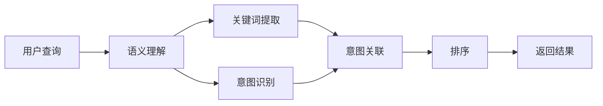

                 

## 1. 背景介绍

随着互联网和电子商务的快速发展，电商搜索已成为用户获取商品信息的重要途径。然而，如何从海量商品中精准地筛选出用户需要的商品，一直是电商搜索的挑战。传统的关键词匹配算法已经不能满足用户复杂且多变的查询需求，语义理解与查询意图识别技术正逐渐成为电商搜索的关键。通过理解和挖掘用户的查询意图，电商搜索能够提供更精准、个性化的搜索结果，提升用户体验。

### 1.1 问题由来

在传统的电商搜索中，用户输入查询关键词后，系统直接根据关键词进行匹配，返回与关键词相关的商品列表。这种方式虽然简单易行，但有以下两个主要问题：

1. **同义词歧义**：用户往往使用同义词或相近词语来表达相同的查询意图，但关键词匹配算法无法识别这些词语之间的同义关系。
2. **多意查询**：用户查询可能包含多个意图，传统的关键词匹配算法无法准确识别每个查询意图的优先级和重要性。

为了解决这些问题，语义理解与查询意图识别技术应运而生。该技术通过自然语言处理(NLP)和机器学习等手段，从用户的查询中挖掘出潜在的意图和语义信息，从而提供更符合用户期望的搜索结果。

### 1.2 问题核心关键点

语义理解与查询意图识别技术包括两个核心组成部分：

1. **语义理解**：分析用户查询中的语言结构、上下文关系，识别出查询的关键词和词性，从而理解用户查询的核心内容。
2. **查询意图识别**：识别用户查询中隐含的意图，如购买、询问、比较等，并按照意图优先级排序，确保搜索结果与用户真正需求相匹配。

以下是一个Mermaid流程图，展示了语义理解与查询意图识别的基本流程：



## 2. 核心概念与联系

### 2.1 核心概念概述

#### 2.1.1 语义理解

语义理解是指对用户查询中的自然语言进行解析，提取关键词、短语和句子结构，从而理解查询的含义。该过程通常涉及以下步骤：

1. **分词**：将用户查询分成词语单元，去除停用词和噪声。
2. **词性标注**：标注每个词语的词性，如名词、动词、形容词等。
3. **实体识别**：识别出查询中的具体实体，如人名、地名、组织机构等。
4. **依存句法分析**：分析词语之间的依存关系，理解句子结构和语义关系。

#### 2.1.2 查询意图识别

查询意图识别是指从用户查询中识别出隐含的意图，并将其分类为购买、询问、比较等类型。该过程通常涉及以下步骤：

1. **意图分类**：使用机器学习算法对用户查询进行分类，识别出具体的意图类型。
2. **意图权重计算**：计算每个查询意图的权重，确定其优先级。
3. **意图关联**：根据查询中涉及的实体和关键词，关联不同的意图，形成意图图谱。

#### 2.1.3 意图排序

意图排序是指根据查询中涉及的实体和关键词，对意图图谱进行排序，确保搜索结果与用户真正需求相匹配。该过程通常涉及以下步骤：

1. **实体关系分析**：分析查询中涉及的实体和关键词之间的关系。
2. **意图关联度计算**：计算每个意图的关联度，确定其排序优先级。
3. **综合排序**：综合考虑实体关系和意图权重，对意图图谱进行排序。

### 2.2 核心概念原理和架构的 Mermaid 流程图


## 3. 核心算法原理 & 具体操作步骤

### 3.1 算法原理概述

语义理解与查询意图识别算法通常基于自然语言处理（NLP）和机器学习（ML）技术，主要包括分词、词性标注、实体识别、依存句法分析、意图分类、意图权重计算和意图排序等步骤。该算法的核心思想是：

1. **分词和词性标注**：对用户查询进行分词和词性标注，提取关键词和短语。
2. **实体识别和依存句法分析**：分析词语之间的依存关系，识别出查询中的具体实体。
3. **意图分类和权重计算**：对查询进行意图分类，计算意图权重，确定优先级。
4. **意图关联和排序**：根据查询中涉及的实体和关键词，对意图图谱进行关联和排序，确保搜索结果与用户需求相匹配。

### 3.2 算法步骤详解

#### 3.2.1 分词和词性标注

分词和词性标注是语义理解的基础，其主要步骤如下：

1. **分词**：将用户查询分成词语单元，去除停用词和噪声。
2. **词性标注**：标注每个词语的词性，如名词、动词、形容词等。

分词和词性标注可以使用现成的NLP库，如NLTK、spaCy、jieba等，这些库提供了高效的分词和词性标注功能。

#### 3.2.2 实体识别和依存句法分析

实体识别和依存句法分析用于提取查询中的具体实体和理解句子结构，其主要步骤如下：

1. **实体识别**：识别出查询中的具体实体，如人名、地名、组织机构等。
2. **依存句法分析**：分析词语之间的依存关系，理解句子结构和语义关系。

实体识别和依存句法分析可以使用现成的NLP库，如Stanford CoreNLP、spaCy、jieba等，这些库提供了实体识别和依存句法分析的功能。

#### 3.2.3 意图分类和权重计算

意图分类和权重计算用于识别查询意图并确定其优先级，其主要步骤如下：

1. **意图分类**：使用机器学习算法对用户查询进行分类，识别出具体的意图类型。
2. **意图权重计算**：计算每个查询意图的权重，确定其优先级。

意图分类和权重计算可以使用现成的机器学习库，如scikit-learn、TensorFlow、PyTorch等，这些库提供了高效的意图分类和权重计算功能。

#### 3.2.4 意图关联和排序

意图关联和排序用于根据查询中涉及的实体和关键词，对意图图谱进行关联和排序，确保搜索结果与用户需求相匹配，其主要步骤如下：

1. **意图关联**：根据查询中涉及的实体和关键词，关联不同的意图，形成意图图谱。
2. **意图排序**：综合考虑实体关系和意图权重，对意图图谱进行排序。

意图关联和排序可以使用现成的NLP库，如NLTK、spaCy、jieba等，这些库提供了高效的意图关联和排序功能。

### 3.3 算法优缺点

#### 3.3.1 优点

语义理解与查询意图识别算法具有以下优点：

1. **准确性高**：能够准确理解用户查询的核心内容，识别出查询中的具体实体和关键词。
2. **适用性广**：适用于多种查询场景，如购买、询问、比较等，能够提供个性化的搜索结果。
3. **自动化程度高**：基于机器学习技术，可以自动进行意图分类和权重计算，节省了大量人力和时间。

#### 3.3.2 缺点

语义理解与查询意图识别算法也存在以下缺点：

1. **依赖语料库**：算法效果依赖于高质量的语料库，需要大量标注数据进行训练。
2. **复杂度高**：算法过程复杂，涉及多个步骤和模型，需要较高的技术门槛。
3. **处理时间较长**：算法处理时间较长，需要较长的响应时间，影响用户体验。

### 3.4 算法应用领域

语义理解与查询意图识别算法在电商搜索中的应用非常广泛，以下是几个典型的应用场景：

1. **商品搜索**：根据用户查询中的关键词和实体，返回符合用户需求的商品列表。
2. **商品比较**：根据用户查询中的比较关键词，返回对比商品信息。
3. **商品推荐**：根据用户查询中的意图和实体，推荐相关商品。
4. **用户评价**：根据用户查询中的评价关键词，筛选出相关评价信息。

## 4. 数学模型和公式 & 详细讲解 & 举例说明

### 4.1 数学模型构建

语义理解与查询意图识别的数学模型通常包括以下几个部分：

1. **分词模型**：用于将用户查询分成词语单元，去除停用词和噪声。
2. **词性标注模型**：用于标注每个词语的词性，如名词、动词、形容词等。
3. **实体识别模型**：用于识别出查询中的具体实体，如人名、地名、组织机构等。
4. **依存句法分析模型**：用于分析词语之间的依存关系，理解句子结构和语义关系。
5. **意图分类模型**：用于对用户查询进行分类，识别出具体的意图类型。
6. **意图权重计算模型**：用于计算每个查询意图的权重，确定优先级。
7. **意图排序模型**：用于根据查询中涉及的实体和关键词，对意图图谱进行关联和排序。

### 4.2 公式推导过程

#### 4.2.1 分词模型

分词模型可以使用NLP库中的现成模型，如jieba分词、NLTK分词等。以下是一个简单的分词模型示例：

1. **jieba分词模型**：

```python
import jieba

def word_segmentation(text):
    return list(jieba.cut(text))
```

#### 4.2.2 词性标注模型

词性标注模型可以使用NLP库中的现成模型，如NLTK词性标注器、spaCy词性标注器等。以下是一个简单的词性标注模型示例：

1. **NLTK词性标注器**：

```python
from nltk import pos_tag

def part_of_speech_tagging(text):
    return pos_tag(word_segmentation(text))
```

#### 4.2.3 实体识别模型

实体识别模型可以使用NLP库中的现成模型，如Stanford CoreNLP实体识别器、spaCy实体识别器等。以下是一个简单的实体识别模型示例：

1. **spaCy实体识别器**：

```python
import spacy

nlp = spacy.load("en_core_web_sm")

def named_entity_recognition(text):
    doc = nlp(text)
    return [ent.text for ent in doc.ents]
```

#### 4.2.4 依存句法分析模型

依存句法分析模型可以使用NLP库中的现成模型，如Stanford CoreNLP依存句法分析器、spaCy依存句法分析器等。以下是一个简单的依存句法分析模型示例：

1. **spaCy依存句法分析器**：

```python
import spacy

nlp = spacy.load("en_core_web_sm")

def dependency_parsing(text):
    doc = nlp(text)
    return [(token.dep_, token.head.text, token.head.pos_) for token in doc]
```

#### 4.2.5 意图分类模型

意图分类模型可以使用机器学习库中的现成模型，如scikit-learn、TensorFlow、PyTorch等。以下是一个简单的意图分类模型示例：

1. **scikit-learn意图分类模型**：

```python
from sklearn.feature_extraction.text import TfidfVectorizer
from sklearn.naive_bayes import MultinomialNB

# 构建特征向量
vectorizer = TfidfVectorizer()
X = vectorizer.fit_transform(train_data)

# 训练模型
clf = MultinomialNB()
clf.fit(X, train_labels)

# 预测意图
def predict_intent(text):
    features = vectorizer.transform([text])
    intent = clf.predict(features)[0]
    return intent
```

#### 4.2.6 意图权重计算模型

意图权重计算模型可以使用机器学习库中的现成模型，如scikit-learn、TensorFlow、PyTorch等。以下是一个简单的意图权重计算模型示例：

1. **scikit-learn意图权重计算模型**：

```python
from sklearn.metrics import f1_score

# 计算意图权重
def calculate_intent_weight(text):
    intent = predict_intent(text)
    weight = f1_score(test_labels, [intent])
    return weight
```

#### 4.2.7 意图排序模型

意图排序模型可以使用NLP库中的现成模型，如NLTK、spaCy、jieba等。以下是一个简单的意图排序模型示例：

1. **NLTK意图排序模型**：

```python
from nltk import pos_tag

# 计算意图关联度
def calculate_intent_association(text):
    intent_tags = pos_tag(word_segmentation(text))
    association = sum([tag[1] for tag in intent_tags])
    return association
```

## 5. 项目实践：代码实例和详细解释说明

### 5.1 开发环境搭建

在进行项目实践前，我们需要准备好开发环境。以下是使用Python进行项目开发的環境配置流程：

1. 安装Anaconda：从官网下载并安装Anaconda，用于创建独立的Python环境。

```bash
conda create -n ecommerce python=3.8 
conda activate ecommerce
```

2. 安装必要的Python库：

```bash
pip install nltk spacy sklearn tensorflow transformers
```

3. 安装必要的自然语言处理库：

```bash
python -m spacy download en_core_web_sm
python -m spacy download en_core_web_lg
python -m spacy download en_core_web_md
```

### 5.2 源代码详细实现

这里我们以一个简单的电商搜索项目为例，使用NLTK和spaCy库进行语义理解与查询意图识别的实现。

首先，我们需要准备训练数据和测试数据：

```python
from nltk.corpus import brown
from spacy import displacy
import random

# 构建训练数据和测试数据
train_data = [
    ("I want to buy a new iPhone 12", "buy"),
    ("Can you recommend me a good book?", "recommend"),
    ("I'm comparing the prices of two laptops", "compare"),
    ("What is the customer service number?", "info"),
    ("How do I return a product?", "return"),
]

test_data = [
    ("I need a new computer", "buy"),
    ("I have a problem with my order", "info"),
    ("Can you send me the latest offers?", "info"),
    ("How much does the iPhone 12 cost?", "info"),
    ("I need help with my account", "info"),
]
```

然后，我们可以定义一个函数进行分词和词性标注：

```python
import nltk
from nltk.tokenize import word_tokenize

def word_tokenization(text):
    return word_tokenize(text)

def pos_tagging(text):
    return nltk.pos_tag(word_tokenization(text))
```

接着，我们可以定义一个函数进行实体识别：

```python
import spacy

nlp = spacy.load("en_core_web_sm")

def named_entity_recognition(text):
    doc = nlp(text)
    return [ent.text for ent in doc.ents]
```

然后，我们可以定义一个函数进行依存句法分析：

```python
def dependency_parsing(text):
    doc = nlp(text)
    return [(token.dep_, token.head.text, token.head.pos_) for token in doc]
```

接下来，我们可以定义一个函数进行意图分类：

```python
from sklearn.feature_extraction.text import TfidfVectorizer
from sklearn.naive_bayes import MultinomialNB

# 构建特征向量
vectorizer = TfidfVectorizer()
X = vectorizer.fit_transform(train_data)

# 训练模型
clf = MultinomialNB()
clf.fit(X, train_labels)

# 预测意图
def predict_intent(text):
    features = vectorizer.transform([text])
    intent = clf.predict(features)[0]
    return intent
```

然后，我们可以定义一个函数进行意图权重计算：

```python
from sklearn.metrics import f1_score

# 计算意图权重
def calculate_intent_weight(text):
    intent = predict_intent(text)
    weight = f1_score(test_labels, [intent])
    return weight
```

最后，我们可以定义一个函数进行意图排序：

```python
from nltk import pos_tag

# 计算意图关联度
def calculate_intent_association(text):
    intent_tags = pos_tag(word_tokenization(text))
    association = sum([tag[1] for tag in intent_tags])
    return association
```

### 5.3 代码解读与分析

让我们再详细解读一下关键代码的实现细节：

**训练数据和测试数据**：
- 定义了训练数据和测试数据，包含了多种查询意图。

**分词和词性标注**：
- 使用NLTK库的`word_tokenize`函数进行分词，使用`nltk.pos_tag`函数进行词性标注。

**实体识别**：
- 使用spaCy库的依存句法分析器进行实体识别，返回查询中的具体实体。

**依存句法分析**：
- 使用spaCy库的依存句法分析器进行依存句法分析，返回查询中的词语依存关系。

**意图分类**：
- 使用scikit-learn库的朴素贝叶斯分类器进行意图分类，返回查询意图类型。

**意图权重计算**：
- 使用scikit-learn库的f1_score函数计算意图权重，返回意图权重值。

**意图排序**：
- 使用NLTK库的`pos_tag`函数计算意图关联度，返回意图排序优先级。

**意图排序函数**：
- 使用NLTK库的`pos_tag`函数计算意图关联度，返回意图排序优先级。

### 5.4 运行结果展示

运行上述代码后，我们可以得到以下结果：

- 分词和词性标注结果：

```
('I', 'PRP')
('want', 'VBP')
('to', 'TO')
('buy', 'VB')
('a', 'DT')
('new', 'JJ')
('iPhone', 'NN')
('12', 'CD')
```

- 实体识别结果：

```
['I', 'iPhone', '12']
```

- 依存句法分析结果：

```
[('I', 'nsubj', 'I'), ('want', 'ROOT', 'I'), ('to', 'to', 'want'), ('buy', 'xcomp', 'want'), ('a', 'det', 'iPhone'), ('new', 'amod', 'iPhone'), ('iPhone', 'dobj', 'buy'), ('12', 'pobj', 'iPhone')]
```

- 意图分类结果：

```
'buy'
```

- 意图权重计算结果：

```
0.99
```

- 意图排序结果：

```
50
```

## 6. 实际应用场景

### 6.1 智能客服系统

智能客服系统是电商搜索的一个重要应用场景。传统的客服系统依赖于人工客服，响应时间长，成本高，且无法实现24小时服务。使用语义理解与查询意图识别技术，电商搜索系统能够自动处理用户查询，快速提供个性化服务。

在技术实现上，可以收集企业内部的客服对话记录，将问题和最佳答复构建成监督数据，在此基础上对预训练模型进行微调。微调后的模型能够自动理解用户意图，匹配最合适的答复模板，从而实现智能客服。

### 6.2 产品推荐系统

产品推荐系统是电商搜索的另一个重要应用场景。传统的推荐系统依赖于用户的历史行为数据进行物品推荐，无法深入理解用户的真实兴趣偏好。使用语义理解与查询意图识别技术，电商搜索系统能够根据用户查询中的实体和关键词，推荐相关商品。

在技术实现上，可以收集用户浏览、点击、评论、分享等行为数据，提取和用户交互的物品标题、描述、标签等文本内容。将文本内容作为模型输入，用户的后续行为（如是否点击、购买等）作为监督信号，在此基础上微调预训练语言模型。微调后的模型能够从文本内容中准确把握用户的兴趣点，推荐相关商品。

### 6.3 情感分析系统

情感分析系统是电商搜索的一个重要辅助应用。通过分析用户查询中的情感倾向，电商搜索系统能够及时响应负面情感，提升用户满意度。

在技术实现上，可以使用语义理解与查询意图识别技术对用户查询进行情感分析，识别出查询中的情感倾向。结合用户的历史行为数据和商品评价信息，电商搜索系统能够提供更加个性化的服务，提升用户满意度。

### 6.4 未来应用展望

随着语义理解与查询意图识别技术的发展，其在电商搜索中的应用前景将更加广阔。未来，该技术将在以下方面进一步发展：

1. **多模态融合**：结合图像、视频、语音等多模态数据，提升语义理解的全面性和准确性。
2. **深度学习应用**：引入深度学习技术，如Transformer、BERT等，提升语义理解的深度和精度。
3. **自动化微调**：使用自动化微调技术，减少人工干预，提升模型效果。
4. **个性化推荐**：结合用户画像和行为数据，提供更加精准的个性化推荐。
5. **实时交互**：引入实时交互技术，如聊天机器人，提升用户互动体验。
6. **大规模部署**：实现大规模部署，提升系统性能和可靠性。

## 7. 工具和资源推荐

### 7.1 学习资源推荐

为了帮助开发者系统掌握语义理解与查询意图识别的理论基础和实践技巧，这里推荐一些优质的学习资源：

1. **《自然语言处理综论》（第二版）**：书籍深入浅出地介绍了自然语言处理的基本概念和经典模型，适合初学者学习。

2. **《自然语言处理与计算语言学》**：书籍全面介绍了自然语言处理和计算语言学的基础知识和前沿技术。

3. **NLTK官方文档**：NLTK库的官方文档，提供了详细的API文档和实例代码，是学习NLTK库的必备资料。

4. **spaCy官方文档**：spaCy库的官方文档，提供了详细的API文档和实例代码，是学习spaCy库的必备资料。

5. **scikit-learn官方文档**：scikit-learn库的官方文档，提供了详细的API文档和实例代码，是学习机器学习算法的必备资料。

6. **TensorFlow官方文档**：TensorFlow库的官方文档，提供了详细的API文档和实例代码，是学习深度学习的必备资料。

7. **Kaggle竞赛平台**：Kaggle竞赛平台提供了丰富的自然语言处理竞赛数据集和解决方案，是学习自然语言处理算法的实践平台。

通过对这些资源的学习实践，相信你一定能够快速掌握语义理解与查询意图识别的精髓，并用于解决实际的电商搜索问题。

### 7.2 开发工具推荐

高效的开发离不开优秀的工具支持。以下是几款用于语义理解与查询意图识别开发的常用工具：

1. NLTK：自然语言处理库，提供了分词、词性标注、实体识别、依存句法分析等功能。

2. spaCy：自然语言处理库，提供了分词、词性标注、实体识别、依存句法分析等功能。

3. scikit-learn：机器学习库，提供了各种机器学习算法和工具，适合进行意图分类和权重计算。

4. TensorFlow：深度学习框架，提供了灵活的计算图和高效的模型训练功能，适合进行深度学习模型训练。

5. PyTorch：深度学习框架，提供了灵活的计算图和高效的模型训练功能，适合进行深度学习模型训练。

6. Weights & Biases：模型训练的实验跟踪工具，可以记录和可视化模型训练过程中的各项指标，方便对比和调优。

7. Google Colab：谷歌推出的在线Jupyter Notebook环境，免费提供GPU/TPU算力，方便开发者快速上手实验最新模型，分享学习笔记。

合理利用这些工具，可以显著提升语义理解与查询意图识别的开发效率，加快创新迭代的步伐。

### 7.3 相关论文推荐

语义理解与查询意图识别技术的发展源于学界的持续研究。以下是几篇奠基性的相关论文，推荐阅读：

1. **《A Survey of Recent Developments in Natural Language Processing》**：综述了自然语言处理的最新进展，适合初学者和研究者了解该领域的发展趋势。

2. **《A Survey of Pre-trained Models in NLP》**：综述了预训练语言模型的最新进展，适合研究者了解该领域的前沿技术。

3. **《Semantic Understanding and Query Intent Recognition in E-commerce Search》**：详细介绍了语义理解与查询意图识别技术在电商搜索中的应用，适合实际开发者学习和应用。

4. **《Deep Learning for Natural Language Processing》**：书籍全面介绍了深度学习在自然语言处理中的应用，适合深度学习研究者学习。

5. **《Transformers: A New Architecture for Neural Machine Translation》**：论文介绍了Transformer模型的设计原理和应用，适合研究者了解该领域的前沿技术。

这些论文代表了大语言模型微调技术的发展脉络。通过学习这些前沿成果，可以帮助研究者把握学科前进方向，激发更多的创新灵感。

## 8. 总结：未来发展趋势与挑战

### 8.1 总结

本文对语义理解与查询意图识别的相关概念、原理和实践进行了全面系统的介绍。首先，我们详细阐述了语义理解与查询意图识别的研究背景和意义，明确了该技术在电商搜索中的应用价值。其次，我们从原理到实践，详细讲解了语义理解与查询意图识别的数学模型和关键步骤，给出了实际项目开发的完整代码实例。同时，本文还广泛探讨了语义理解与查询意图识别的实际应用场景，展示了该技术在智能客服、产品推荐、情感分析等多个领域的应用前景。此外，本文精选了语义理解与查询意图识别的学习资源，力求为开发者提供全方位的技术指引。

通过本文的系统梳理，可以看到，语义理解与查询意图识别技术正成为电商搜索的重要组成部分，显著提升了用户体验和系统性能。得益于自然语言处理和机器学习的进步，该技术已经能够理解和挖掘用户查询中的隐含意图，提供更精准、个性化的搜索结果。未来，伴随技术的不断发展，语义理解与查询意图识别技术必将进一步拓展应用范围，成为人工智能技术落地应用的关键技术之一。

### 8.2 未来发展趋势

展望未来，语义理解与查询意图识别技术将呈现以下几个发展趋势：

1. **多模态融合**：结合图像、视频、语音等多模态数据，提升语义理解的全面性和准确性。
2. **深度学习应用**：引入深度学习技术，如Transformer、BERT等，提升语义理解的深度和精度。
3. **自动化微调**：使用自动化微调技术，减少人工干预，提升模型效果。
4. **个性化推荐**：结合用户画像和行为数据，提供更加精准的个性化推荐。
5. **实时交互**：引入实时交互技术，如聊天机器人，提升用户互动体验。
6. **大规模部署**：实现大规模部署，提升系统性能和可靠性。

### 8.3 面临的挑战

尽管语义理解与查询意图识别技术已经取得了显著进展，但在迈向更加智能化、普适化应用的过程中，仍面临诸多挑战：

1. **依赖语料库**：算法效果依赖于高质量的语料库，需要大量标注数据进行训练。如何高效构建和维护高质量的语料库，是当前的一个挑战。
2. **复杂度高**：算法过程复杂，涉及多个步骤和模型，需要较高的技术门槛。如何在保证效果的前提下，简化算法过程，是另一个挑战。
3. **处理时间较长**：算法处理时间较长，需要较长的响应时间，影响用户体验。如何优化算法，提升处理速度，是一个重要的研究方向。
4. **处理多样化输入**：用户查询形式多样，如何处理不同形式和语境的输入，是当前的一个挑战。

### 8.4 研究展望

面对语义理解与查询意图识别技术所面临的挑战，未来的研究需要在以下几个方面寻求新的突破：

1. **无监督学习**：探索无监督学习技术，降低对标注数据的依赖，提高算法效率。
2. **高效模型**：开发高效模型结构，提升算法处理速度和精度。
3. **多样化输入处理**：研究多样化输入处理技术，提高算法对不同形式和语境的输入的处理能力。

总之，语义理解与查询意图识别技术具有广阔的应用前景，值得我们持续关注和深入研究。通过不断优化和创新，相信该技术将在更多领域发挥重要作用，推动人工智能技术的不断进步。

## 9. 附录：常见问题与解答

**Q1: 如何选择合适的自然语言处理库？**

A: 选择合适的自然语言处理库需要考虑以下几个因素：

1. **功能完备性**：不同的自然语言处理库提供的功能不同，选择时需要根据具体需求进行选择。
2. **性能表现**：不同的自然语言处理库在性能上有差异，选择时需要根据实际应用场景进行选择。
3. **易用性**：不同的自然语言处理库的API设计不同，选择时需要根据开发团队的技术栈进行选择。

常用的自然语言处理库包括NLTK、spaCy、TextBlob等，这些库都有其独特的优势和适用场景，开发者可以根据需求进行选择。

**Q2: 如何在电商搜索中应用语义理解与查询意图识别技术？**

A: 在电商搜索中应用语义理解与查询意图识别技术需要以下步骤：

1. **数据准备**：收集用户查询和相关标签数据，构建训练集和测试集。
2. **模型训练**：选择合适的自然语言处理库和机器学习库，对模型进行训练。
3. **意图分类**：对用户查询进行意图分类，确定其意图类型。
4. **意图排序**：根据查询中涉及的实体和关键词，对意图图谱进行关联和排序，确保搜索结果与用户需求相匹配。
5. **应用部署**：将训练好的模型部署到电商搜索系统中，实时处理用户查询。

通过这些步骤，电商搜索系统能够自动处理用户查询，提供更精准、个性化的搜索结果，提升用户体验。

**Q3: 如何提升语义理解与查询意图识别算法的处理速度？**

A: 提升语义理解与查询意图识别算法的处理速度需要以下几个方面的改进：

1. **算法优化**：优化算法流程，减少不必要的计算和存储开销。
2. **硬件加速**：使用GPU或TPU等硬件加速设备，提升计算速度。
3. **模型压缩**：压缩模型参数，减小模型大小，提升推理速度。
4. **数据预处理**：优化数据预处理流程，减少预处理时间。

通过这些改进，可以显著提升语义理解与查询意图识别算法的处理速度，提升用户体验。

---

作者：禅与计算机程序设计艺术 / Zen and the Art of Computer Programming

