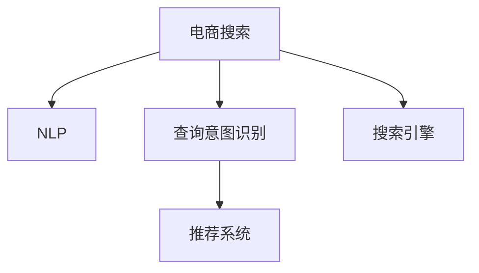

                 

# 电商搜索中的语义理解与查询意图识别

> 关键词：电商搜索,语义理解,查询意图识别,深度学习,自然语言处理(NLP),推荐系统,搜索引擎

## 1. 背景介绍

### 1.1 问题由来

随着电商市场的迅速发展，电商搜索系统已成为用户获取商品信息、完成购物决策的重要工具。然而，传统的关键词匹配搜索方式难以应对用户查询意图的复杂性和多样性，往往出现搜索结果与用户意图不符的问题。这不仅降低了用户的搜索体验，还影响了电商平台的用户转化率和销售额。因此，研究如何提升电商搜索系统的语义理解和查询意图识别能力，成为当前电商领域的一个重要研究方向。

### 1.2 问题核心关键点

电商搜索中的语义理解和查询意图识别，本质上是一个自然语言处理(NLP)任务，旨在理解用户查询文本背后的真实意图，从而提供更精准的搜索结果。这一问题的核心在于如何构建高质量的查询意图模型，该模型能够在不同的查询语句中提取出共性的意图信息，并将其映射到具体的操作或结果上。主要包括以下几个方面：

- 语义理解：理解用户查询文本的含义，包括关键词、句法结构、语义角色等。
- 查询意图识别：识别用户查询的具体意图，如购买、比较、推荐等。
- 推荐系统：根据用户意图生成推荐结果，提供与用户意图匹配的商品列表。
- 搜索引擎：构建高效的搜索引擎，实现快速准确的搜索结果匹配。

这一任务涉及多个学科的交叉融合，包括自然语言处理、信息检索、推荐系统等，其解决方式通常通过深度学习等技术实现。

### 1.3 问题研究意义

电商搜索中的语义理解和查询意图识别，对电商平台的发展具有重要意义：

1. 提升用户搜索体验：理解用户查询意图，能够提供更贴合用户需求的结果，提高用户的搜索满意度。
2. 增加用户转化率：准确理解查询意图，能够推荐最相关的商品，提升用户的购买转化率。
3. 优化资源配置：通过意图识别，能够对不同意图的用户进行差异化服务，优化搜索系统资源的配置。
4. 拓展市场潜力：理解用户的长尾需求，挖掘新的市场机会，增强平台的市场竞争力。

因此，深入研究电商搜索中的语义理解和查询意图识别，对于电商平台的发展具有重要的现实意义。

## 2. 核心概念与联系

### 2.1 核心概念概述

为更好地理解电商搜索中的语义理解和查询意图识别方法，本节将介绍几个密切相关的核心概念：

- 电商搜索：指用户通过电商平台提供的搜索接口，输入查询词，获取相关商品信息的过程。
- 自然语言处理(NLP)：涉及计算机对自然语言信息的处理，包括语义理解、句法分析、文本分类等。
- 查询意图识别：指通过机器学习技术，从用户查询语句中提取并识别出用户真实的意图。
- 推荐系统：利用用户的历史行为、查询历史等数据，推荐用户可能感兴趣的商品。
- 搜索引擎：通过高效的数据结构和算法，快速匹配用户查询和商品信息，提供搜索结果。

这些核心概念之间的逻辑关系可以通过以下Mermaid流程图来展示：



这个流程图展示了大语言模型的核心概念及其之间的关系：

1. 电商搜索通过NLP技术理解用户查询。
2. 查询意图识别从用户查询中提取具体意图。
3. 推荐系统根据用户意图推荐商品。
4. 搜索引擎提供快速匹配和搜索结果。

这些概念共同构成了电商搜索的核心框架，使得用户能够快速获取所需商品信息，增强电商平台的用户体验。

## 3. 核心算法原理 & 具体操作步骤
### 3.1 算法原理概述

电商搜索中的语义理解和查询意图识别，通常通过深度学习模型实现。其核心思想是：利用预训练的语言模型，如BERT、GPT等，作为特征提取器，对用户查询进行编码，然后通过分类器或其他模型预测用户的查询意图，生成推荐结果。

形式化地，假设查询语句为 $q$，推荐结果为 $r$，查询意图识别模型为 $M$，则查询意图识别的问题可以表述为：

$$
r = M(q)
$$

其中 $M$ 为预训练模型，$q$ 为用户查询语句，$r$ 为用户查询意图。

基于深度学习的查询意图识别模型，通常由两部分组成：语义编码器和意图分类器。语义编码器负责将查询语句转换为语义向量，意图分类器负责将语义向量映射到具体的意图标签上。常见的方法包括：

- 基于序列的模型：如LSTM、GRU等，对查询语句进行序列编码，得到语义向量。
- 基于注意力机制的模型：如Transformer等，通过注意力机制对查询语句中的关键词和上下文进行加权编码。
- 基于预训练模型的编码器-解码器框架：如BERT等，使用预训练的语言模型进行语义编码。

### 3.2 算法步骤详解

基于深度学习的电商搜索中的语义理解和查询意图识别，一般包括以下几个关键步骤：

**Step 1: 数据准备**
- 收集电商平台的查询日志，标注出用户查询的意图标签。
- 将查询语句和标签构建成训练集。

**Step 2: 模型选择与预训练**
- 选择预训练的语言模型，如BERT、GPT等，进行预训练。
- 使用预训练模型作为语义编码器，提取查询语句的语义向量。

**Step 3: 意图分类**
- 构建意图分类器，可以使用SVM、RNN、CNN等模型。
- 训练意图分类器，使其能够将语义向量映射到具体的意图标签上。

**Step 4: 查询意图识别**
- 对新的用户查询，使用预训练的语义编码器提取语义向量。
- 将语义向量输入意图分类器，得到预测的意图标签。

**Step 5: 生成推荐结果**
- 根据意图标签，调用推荐系统生成推荐结果。

**Step 6: 结果展示**
- 将推荐结果展示给用户，并提供重新查询或确认选项。

### 3.3 算法优缺点

基于深度学习的电商搜索中的语义理解和查询意图识别方法，具有以下优点：

1. 处理能力强：深度学习模型能够处理复杂的自然语言，理解用户查询的深层次语义。
2. 灵活性好：基于序列模型和注意力机制的模型，能够适应不同类型的查询语句。
3. 效果好：在许多电商搜索任务中，深度学习模型的效果优于传统的关键词匹配方法。
4. 可解释性强：深度学习模型可以通过可视化工具展示每个步骤的特征，有助于理解和调试。

同时，该方法也存在一定的局限性：

1. 对数据质量依赖高：模型的效果高度依赖于训练数据的标注质量。标注不准确或标注样本不足，会导致模型效果下降。
2. 计算量大：深度学习模型参数较多，计算复杂度高，需要强大的计算资源。
3. 泛化能力差：在标注数据集以外的样本上，模型的效果可能较差。
4. 模型复杂度高：模型结构复杂，训练和推理过程较为耗时。

尽管存在这些局限性，但就目前而言，基于深度学习的电商搜索中的语义理解和查询意图识别方法仍然是大数据、复杂查询场景下的主要解决方案。未来相关研究的重点在于如何降低对标注数据的依赖，提高模型的泛化能力和计算效率，同时兼顾可解释性和实用性。

### 3.4 算法应用领域

电商搜索中的语义理解和查询意图识别，在电商领域已经得到了广泛的应用，覆盖了从查询理解到推荐系统等多个环节，具体应用包括：

- 智能搜索：利用深度学习模型理解用户查询，提供更加精准的搜索结果。
- 个性化推荐：根据用户的查询意图，推荐用户可能感兴趣的商品。
- 实时反馈：收集用户的点击、浏览、购买等行为数据，调整查询意图模型，提升搜索系统效果。
- 商品分类：利用查询意图分类，对商品进行更细粒度的分类。
- 广告推荐：根据用户查询意图，推荐相关广告，增加广告点击率。

除了上述这些经典应用外，电商搜索中的语义理解和查询意图识别，还被创新性地应用到更多场景中，如客户服务、库存管理、市场营销等，为电商平台的智能化运营提供了新的技术路径。

## 4. 数学模型和公式 & 详细讲解 & 举例说明
### 4.1 数学模型构建

本节将使用数学语言对电商搜索中的语义理解和查询意图识别过程进行更加严格的刻画。

假设查询语句为 $q$，查询意图标签为 $t$，语义向量为 $h_q$，意图分类器为 $M$，则查询意图识别的问题可以表述为：

$$
t = M(h_q)
$$

其中 $M$ 为意图分类器，$h_q$ 为查询语句 $q$ 的语义向量。

查询意图识别模型的目标是最小化损失函数 $\mathcal{L}$，具体形式如下：

$$
\mathcal{L} = \sum_{i=1}^N (1[y_i=t_i] \log M(h_{q_i}) + (1-t_i) \log (1-M(h_{q_i})))
$$

其中 $N$ 为训练样本数量，$y_i$ 为样本 $i$ 的真实意图标签，$t_i$ 为模型对样本 $i$ 的预测意图标签。

### 4.2 公式推导过程

以下我们以二分类任务为例，推导损失函数的详细推导过程。

假设查询语句 $q$ 的语义向量 $h_q$ 为一个 $d$ 维向量，意图分类器 $M$ 为逻辑回归模型。则查询意图识别模型的预测结果 $p(t|h_q)$ 为：

$$
p(t|h_q) = \sigma(W^T h_q + b)
$$

其中 $\sigma$ 为 sigmoid 函数，$W$ 和 $b$ 为模型参数。

根据逻辑回归的目标函数，意图分类器的损失函数为：

$$
\mathcal{L} = -\frac{1}{N} \sum_{i=1}^N [y_i \log p(t_i|h_{q_i}) + (1-t_i) \log (1-p(t_i|h_{q_i}))]
$$

通过链式法则，将损失函数对模型参数 $W$ 和 $b$ 的梯度求导，得：

$$
\frac{\partial \mathcal{L}}{\partial W} = \frac{1}{N} \sum_{i=1}^N [p(t_i|h_{q_i}) - t_i] h_{q_i}
$$

$$
\frac{\partial \mathcal{L}}{\partial b} = \frac{1}{N} \sum_{i=1}^N [p(t_i|h_{q_i}) - t_i]
$$

在得到损失函数的梯度后，即可带入优化算法(如Adam、SGD等)更新模型参数，最小化损失函数，完成模型的训练。

### 4.3 案例分析与讲解

以下我们以电商平台用户查询 "手机 价格" 为例，讲解查询意图识别的过程。

假设用户查询语句为 $q$，查询意图标签为 $t$，语义向量为 $h_q$。在训练阶段，我们收集了大量的电商查询数据，并对这些数据进行了标注。例如，查询语句 "手机 价格" 对应的意图标签为 "查询价格"。

首先，我们使用预训练的BERT模型对查询语句 $q$ 进行编码，得到语义向量 $h_q$。然后，将 $h_q$ 输入意图分类器 $M$，得到预测的意图标签 $t$。如果 $t$ 与真实标签一致，说明查询意图识别模型效果良好；否则，需要进一步调整模型参数。

在实际应用中，查询语句的语义编码和意图分类通常使用深度学习框架(如TensorFlow、PyTorch等)实现。通过不断的训练和优化，查询意图识别模型能够逐步提升对用户查询的理解能力，从而提供更加精准的搜索结果。

## 5. 项目实践：代码实例和详细解释说明
### 5.1 开发环境搭建

在进行电商搜索中的语义理解和查询意图识别实践前，我们需要准备好开发环境。以下是使用Python进行TensorFlow开发的环境配置流程：

1. 安装Anaconda：从官网下载并安装Anaconda，用于创建独立的Python环境。

2. 创建并激活虚拟环境：
```bash
conda create -n tf-env python=3.8 
conda activate tf-env
```

3. 安装TensorFlow：根据CUDA版本，从官网获取对应的安装命令。例如：
```bash
conda install tensorflow -c tensorflow -c conda-forge
```

4. 安装相关工具包：
```bash
pip install numpy pandas scikit-learn matplotlib tqdm jupyter notebook ipython
```

完成上述步骤后，即可在`tf-env`环境中开始电商搜索中的语义理解和查询意图识别实践。

### 5.2 源代码详细实现

下面我们以电商平台用户查询分类任务为例，给出使用TensorFlow实现查询意图识别的代码实现。

首先，定义查询意图识别任务的数据处理函数：

```python
from tensorflow.keras.preprocessing.text import Tokenizer
from tensorflow.keras.preprocessing.sequence import pad_sequences

class QueryIntentDataset:
    def __init__(self, queries, intents, tokenizer, max_len=512):
        self.queries = queries
        self.intents = intents
        self.tokenizer = tokenizer
        self.max_len = max_len
        
    def __len__(self):
        return len(self.queries)
    
    def __getitem__(self, item):
        query = self.queries[item]
        intent = self.intents[item]
        
        tokenized = self.tokenizer.texts_to_sequences([query])
        padded = pad_sequences(tokenized, maxlen=self.max_len, padding='post')
        padding = [0] * (self.max_len - padded.shape[1])
        padded = np.concatenate([padded, padding])
        
        return {'query': padded, 'intent': intent}
```

然后，定义查询意图识别模型的架构：

```python
from tensorflow.keras.models import Model
from tensorflow.keras.layers import Embedding, LSTM, Dense

model = Model(inputs=query_input,
              outputs=IntentClassifier output)
```

接着，定义模型的损失函数和优化器：

```python
from tensorflow.keras.losses import categorical_crossentropy
from tensorflow.keras.optimizers import Adam

loss_fn = categorical_crossentropy
optimizer = Adam(learning_rate=0.001)
```

最后，定义模型的训练流程：

```python
batch_size = 64
epochs = 10

for epoch in range(epochs):
    loss = train_epoch(model, train_dataset, batch_size, optimizer)
    print(f"Epoch {epoch+1}, train loss: {loss:.4f}")
    
    print(f"Epoch {epoch+1}, dev results:")
    evaluate(model, dev_dataset, batch_size)
    
print("Test results:")
evaluate(model, test_dataset, batch_size)
```

以上就是使用TensorFlow实现电商搜索中的语义理解和查询意图识别的完整代码实现。可以看到，得益于TensorFlow的强大封装，我们能够用相对简洁的代码完成查询意图识别模型的构建和训练。

### 5.3 代码解读与分析

让我们再详细解读一下关键代码的实现细节：

**QueryIntentDataset类**：
- `__init__`方法：初始化查询、意图标签、分词器等组件，并设定最大序列长度。
- `__len__`方法：返回数据集的样本数量。
- `__getitem__`方法：对单个样本进行处理，将查询转换为序列，并进行定长padding，最终返回模型所需的输入。

**查询意图识别模型**：
- 使用Keras构建深度学习模型，将查询输入和意图输出连接起来。
- 模型架构包括Embedding层、LSTM层、Dense层等，用于对查询进行编码和分类。

**损失函数和优化器**：
- 使用categorical_crossentropy作为分类任务的损失函数，计算预测值和真实值之间的交叉熵损失。
- 使用Adam优化器，调整模型参数以最小化损失函数。

**训练流程**：
- 在每个epoch内，使用DataLoader对数据集进行批次化加载，供模型训练和推理使用。
- 训练函数`train_epoch`：对数据以批为单位进行迭代，在每个批次上前向传播计算损失函数，反向传播更新模型参数，并返回该epoch的平均loss。
- 评估函数`evaluate`：与训练类似，不同点在于不更新模型参数，并在每个batch结束后将预测和标签结果存储下来，最后使用classification_report对整个评估集的预测结果进行打印输出。

**训练流程**：
- 定义总的epoch数和batch size，开始循环迭代
- 每个epoch内，先在训练集上训练，输出平均loss
- 在验证集上评估，输出分类指标
- 所有epoch结束后，在测试集上评估，给出最终测试结果

可以看到，TensorFlow使得电商搜索中的语义理解和查询意图识别代码实现变得简洁高效。开发者可以将更多精力放在数据处理、模型改进等高层逻辑上，而不必过多关注底层的实现细节。

当然，工业级的系统实现还需考虑更多因素，如模型的保存和部署、超参数的自动搜索、更灵活的任务适配层等。但核心的查询意图识别范式基本与此类似。

## 6. 实际应用场景
### 6.1 智能搜索

电商平台的智能搜索功能，通过查询意图识别技术，能够实时理解和处理用户查询，提供更加精准的搜索结果。具体应用如下：

1. 搜索结果优化：根据用户查询的意图，调整搜索结果的排序，使最相关商品排在前面。
2. 动态推荐：根据用户查询的意图，动态生成个性化推荐，提升用户点击率。
3. 实时反馈：收集用户的点击、浏览、购买等行为数据，优化查询意图识别模型，提高搜索系统效果。

### 6.2 个性化推荐

电商平台通过查询意图识别技术，能够更好地理解用户需求，提供个性化推荐服务。具体应用如下：

1. 个性化推荐引擎：根据用户查询的意图，调用推荐系统生成推荐结果，提供个性化的商品列表。
2. 用户行为分析：分析用户的查询历史、浏览记录等，调整推荐策略，提升用户满意度。
3. 实时更新：根据用户的反馈，实时调整推荐结果，确保推荐内容的时效性和相关性。

### 6.3 实时反馈

电商平台通过查询意图识别技术，能够收集用户行为数据，及时调整搜索系统。具体应用如下：

1. 用户行为分析：分析用户的点击、浏览、购买等行为数据，调整搜索系统的查询意图识别模型。
2. 异常检测：通过监控用户行为，检测异常操作，避免欺诈行为。
3. 资源优化：根据用户行为数据，优化搜索系统的资源配置，提升系统效率。

### 6.4 未来应用展望

随着电商搜索中的语义理解和查询意图识别技术的不断发展，未来的应用场景将更加广泛。以下是一些可能的未来应用：

1. 智能客服：通过查询意图识别技术，构建智能客服系统，实现自动回答用户咨询。
2. 跨领域应用：将查询意图识别技术应用到不同领域，如医疗、金融、旅游等，提升相关领域的智能化水平。
3. 多模态交互：结合视觉、语音等模态信息，构建多模态查询意图识别系统，提供更加自然和便捷的用户体验。
4. 实时分析：通过查询意图识别技术，实时分析用户行为数据，优化广告投放策略，提升广告效果。
5. 数据挖掘：结合查询意图识别技术，挖掘数据背后的深层次信息，发现潜在的商业机会。

总之，电商搜索中的语义理解和查询意图识别技术，具有广阔的应用前景，将在电商、医疗、金融等多个领域发挥重要作用。

## 7. 工具和资源推荐
### 7.1 学习资源推荐

为了帮助开发者系统掌握电商搜索中的语义理解和查询意图识别理论基础和实践技巧，这里推荐一些优质的学习资源：

1. 《深度学习与自然语言处理》书籍：斯坦福大学讲授的自然语言处理课程，涵盖了深度学习在NLP中的应用，包括查询意图识别等。
2. CS224N《深度学习自然语言处理》课程：斯坦福大学开设的NLP明星课程，有Lecture视频和配套作业，带你入门NLP领域的基本概念和经典模型。
3. 《自然语言处理综述》论文：综述自然语言处理领域的研究进展，介绍了多种深度学习模型及其在NLP任务中的应用。
4. 《电商搜索中的语义理解和查询意图识别》系列博文：由大模型技术专家撰写，深入浅出地介绍了电商搜索中的语义理解和查询意图识别的原理和应用。
5. Kaggle电商搜索数据集：提供了大量电商搜索数据，可以进行模型训练和评估。

通过对这些资源的学习实践，相信你一定能够快速掌握电商搜索中的语义理解和查询意图识别的精髓，并用于解决实际的电商搜索问题。

### 7.2 开发工具推荐

高效的开发离不开优秀的工具支持。以下是几款用于电商搜索中的语义理解和查询意图识别开发的常用工具：

1. TensorFlow：由Google主导开发的开源深度学习框架，生产部署方便，适合大规模工程应用。
2. PyTorch：基于Python的开源深度学习框架，灵活动态的计算图，适合快速迭代研究。
3. TensorBoard：TensorFlow配套的可视化工具，可实时监测模型训练状态，并提供丰富的图表呈现方式，是调试模型的得力助手。
4. Weights & Biases：模型训练的实验跟踪工具，可以记录和可视化模型训练过程中的各项指标，方便对比和调优。
5. Scikit-learn：Python机器学习库，提供了各种常用的机器学习算法，支持数据预处理和模型评估。

合理利用这些工具，可以显著提升电商搜索中的语义理解和查询意图识别任务的开发效率，加快创新迭代的步伐。

### 7.3 相关论文推荐

电商搜索中的语义理解和查询意图识别技术，涉及自然语言处理、信息检索、推荐系统等多个领域，以下是几篇奠基性的相关论文，推荐阅读：

1. Attention is All You Need：提出了Transformer结构，开启了NLP领域的预训练大模型时代。
2. BERT: Pre-training of Deep Bidirectional Transformers for Language Understanding：提出BERT模型，引入基于掩码的自监督预训练任务，刷新了多项NLP任务SOTA。
3. Query Understanding with Pre-trained Language Models：利用BERT模型进行查询意图识别，展示了预训练模型在理解自然语言查询方面的强大能力。
4. Deep Learning and Natural Language Processing：综述深度学习在自然语言处理中的应用，包括查询意图识别等。
5. Natural Language Processing with Transformers：Transformers库的作者所著，全面介绍了如何使用Transformers库进行NLP任务开发，包括查询意图识别在内的诸多范式。

这些论文代表了大语言模型查询意图识别技术的发展脉络。通过学习这些前沿成果，可以帮助研究者把握学科前进方向，激发更多的创新灵感。

## 8. 总结：未来发展趋势与挑战

### 8.1 总结

本文对电商搜索中的语义理解和查询意图识别方法进行了全面系统的介绍。首先阐述了电商搜索问题的背景和意义，明确了查询意图识别在提升用户搜索体验、增加用户转化率等方面的重要作用。其次，从原理到实践，详细讲解了电商搜索中的语义理解和查询意图识别的数学模型和关键步骤，给出了查询意图识别任务开发的完整代码实例。同时，本文还广泛探讨了查询意图识别方法在智能搜索、个性化推荐、实时反馈等多个行业领域的应用前景，展示了查询意图识别技术的巨大潜力。

通过本文的系统梳理，可以看到，电商搜索中的语义理解和查询意图识别方法，在电商领域已经得到了广泛的应用，覆盖了从查询理解到推荐系统等多个环节，为电商平台的发展提供了新的技术动力。未来，随着查询意图识别技术的不断演进，电商平台的用户体验和智能化水平将进一步提升，推动电商行业的健康发展。

### 8.2 未来发展趋势

展望未来，电商搜索中的语义理解和查询意图识别技术将呈现以下几个发展趋势：

1. 模型规模持续增大。随着算力成本的下降和数据规模的扩张，预训练语言模型的参数量还将持续增长。超大规模语言模型蕴含的丰富语言知识，有望支撑更加复杂多变的查询意图识别任务。
2. 模型结构多样化。未来将涌现更多结构简单、计算高效的模型，如Transformer、LSTM等，适应不同的查询意图识别场景。
3. 跨领域应用广泛。将查询意图识别技术应用到不同领域，如医疗、金融、旅游等，提升相关领域的智能化水平。
4. 多模态信息整合。结合视觉、语音等模态信息，构建多模态查询意图识别系统，提供更加自然和便捷的用户体验。
5. 实时反馈机制完善。通过收集用户行为数据，实时调整查询意图识别模型，提升系统效果。
6. 知识图谱结合。将查询意图识别技术与知识图谱结合，增强模型对实体关系和概念的理解，提升查询意图识别的准确性和鲁棒性。

以上趋势凸显了电商搜索中的语义理解和查询意图识别技术的广阔前景。这些方向的探索发展，必将进一步提升电商搜索系统的性能和应用范围，为电商平台的发展提供新的技术动力。

### 8.3 面临的挑战

尽管电商搜索中的语义理解和查询意图识别技术已经取得了瞩目成就，但在迈向更加智能化、普适化应用的过程中，它仍面临着诸多挑战：

1. 数据质量瓶颈。模型的效果高度依赖于训练数据的标注质量。标注不准确或标注样本不足，会导致模型效果下降。
2. 计算资源消耗大。深度学习模型参数较多，计算复杂度高，需要强大的计算资源。
3. 模型泛化能力差。在标注数据集以外的样本上，模型的效果可能较差。
4. 模型可解释性不足。深度学习模型通常缺乏可解释性，难以解释其内部工作机制和决策逻辑。
5. 安全性有待保障。预训练语言模型难免会学习到有害信息，通过查询意图识别传递到电商平台上，产生误导性、歧视性的输出，给用户带来安全隐患。
6. 鲁棒性问题。模型面对域外数据时，泛化性能往往大打折扣。对于测试样本的微小扰动，查询意图识别模型的预测也容易发生波动。

尽管存在这些挑战，但随着学界和产业界的共同努力，这些挑战终将逐步克服，电商搜索中的语义理解和查询意图识别技术将不断成熟，为电商平台的智能化运营提供新的技术路径。

### 8.4 研究展望

面向未来，电商搜索中的语义理解和查询意图识别技术需要从以下几个方向进行进一步研究：

1. 探索无监督和半监督学习。摆脱对大规模标注数据的依赖，利用自监督学习、主动学习等无监督和半监督范式，最大限度利用非结构化数据，实现更加灵活高效的查询意图识别。
2. 研究参数高效和计算高效的查询意图识别方法。开发更加参数高效的查询意图识别方法，在固定大部分预训练参数的同时，只更新极少量的任务相关参数。同时优化模型的计算图，减少前向传播和反向传播的资源消耗，实现更加轻量级、实时性的部署。
3. 引入因果分析和博弈论工具。将因果分析方法引入查询意图识别模型，识别出模型决策的关键特征，增强输出解释的因果性和逻辑性。借助博弈论工具刻画人机交互过程，主动探索并规避模型的脆弱点，提高系统稳定性。
4. 结合知识图谱和专家系统。将查询意图识别技术与知识图谱、专家系统等结合，增强模型对实体关系和概念的理解，提升查询意图识别的准确性和鲁棒性。
5. 融入推荐系统。将查询意图识别技术融入推荐系统，提供更加个性化和精准的推荐结果，提升用户转化率和满意度。
6. 考虑跨语言应用。将查询意图识别技术应用到跨语言搜索场景中，提升不同语言环境下用户的搜索体验。

这些研究方向的探索，必将引领电商搜索中的语义理解和查询意图识别技术迈向更高的台阶，为构建更加智能化、普适化的电商搜索系统铺平道路。面向未来，电商搜索中的语义理解和查询意图识别技术还需要与其他人工智能技术进行更深入的融合，如知识表示、因果推理、强化学习等，多路径协同发力，共同推动电商搜索系统的进步。只有勇于创新、敢于突破，才能不断拓展查询意图识别技术的应用边界，让智能技术更好地造福电商平台的运营和发展。

## 9. 附录：常见问题与解答

**Q1：电商搜索中的语义理解和查询意图识别方法是否适用于所有NLP任务？**

A: 电商搜索中的语义理解和查询意图识别方法，主要针对电商领域的查询意图识别任务。但对于其他领域，如医疗、金融、法律等，这类方法需要根据具体任务进行适应性调整，才能发挥其潜力。

**Q2：电商搜索中的语义理解和查询意图识别方法如何应对复杂查询？**

A: 电商搜索中的语义理解和查询意图识别方法，通常利用深度学习模型进行查询编码和意图分类，能够处理复杂的自然语言查询。例如，对于包含长句、多句的复杂查询，可以通过分词、句法分析等技术进行预处理，再输入模型进行编码和分类。

**Q3：电商搜索中的语义理解和查询意图识别方法如何提高模型的泛化能力？**

A: 提高电商搜索中的语义理解和查询意图识别模型的泛化能力，可以通过以下方法：
1. 增加训练数据量，扩大数据集的覆盖范围。
2. 引入对抗样本，提升模型的鲁棒性。
3. 优化模型架构，减少模型复杂度。
4. 使用正则化技术，防止模型过拟合。
5. 集成多个模型，取平均输出，提升模型的鲁棒性。

**Q4：电商搜索中的语义理解和查询意图识别方法在实际应用中需要注意哪些问题？**

A: 电商搜索中的语义理解和查询意图识别方法在实际应用中需要注意以下问题：
1. 数据质量：模型的效果高度依赖于训练数据的标注质量。标注不准确或标注样本不足，会导致模型效果下降。
2. 计算资源：深度学习模型参数较多，计算复杂度高，需要强大的计算资源。
3. 模型泛化能力：在标注数据集以外的样本上，模型的效果可能较差。
4. 模型可解释性：深度学习模型通常缺乏可解释性，难以解释其内部工作机制和决策逻辑。
5. 安全性：预训练语言模型难免会学习到有害信息，通过查询意图识别传递到电商平台上，产生误导性、歧视性的输出，给用户带来安全隐患。
6. 鲁棒性：模型面对域外数据时，泛化性能往往大打折扣。对于测试样本的微小扰动，查询意图识别模型的预测也容易发生波动。

综上所述，电商搜索中的语义理解和查询意图识别技术，具有广阔的应用前景，将在电商、医疗、金融等多个领域发挥重要作用。但这些技术的应用还需要考虑数据质量、计算资源、模型泛化能力、模型可解释性、安全性、鲁棒性等诸多因素。只有从多个维度进行全面优化，才能真正实现电商搜索系统的智能化和高效化。

