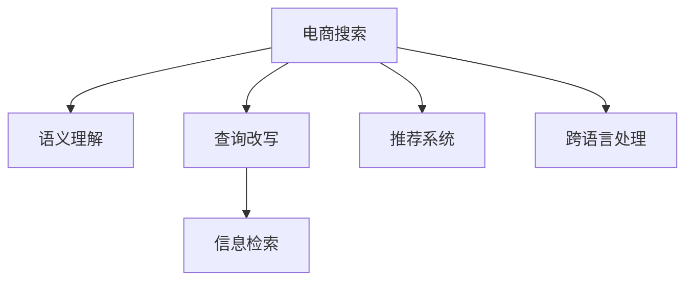
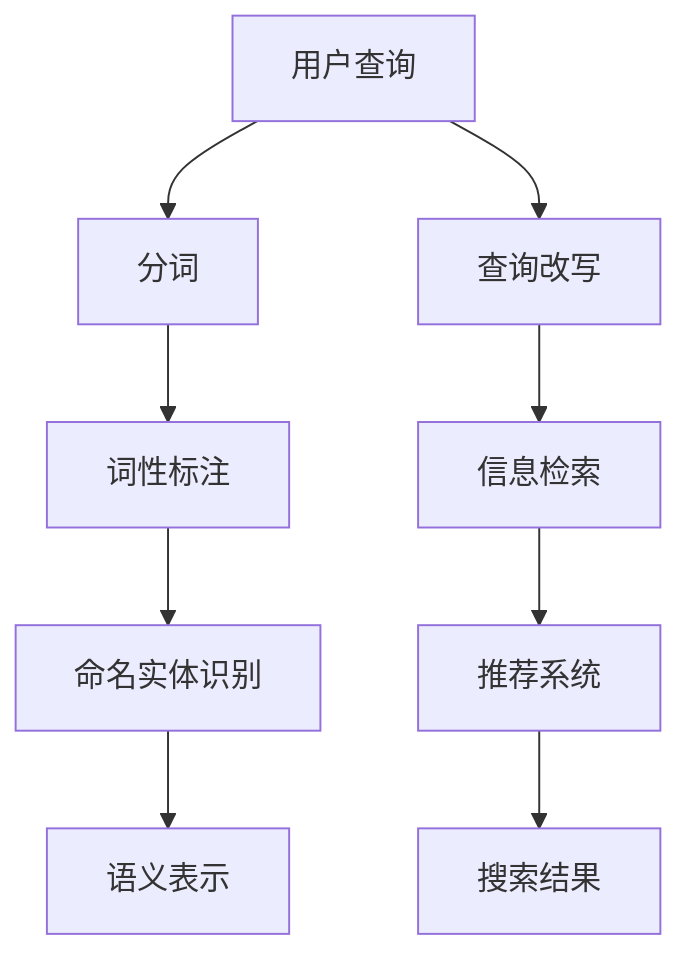

                 

# 电商搜索中的语义理解与查询改写技术

> 关键词：电商搜索,语义理解,查询改写,信息检索,推荐系统

## 1. 背景介绍

### 1.1 问题由来
随着互联网的迅猛发展和电商市场的成熟，电商搜索技术已成为消费者购物体验的重要组成部分。传统的电商搜索通常依赖关键词匹配，尽管简单易行，但难以处理用户复杂的查询意图和多样化信息需求。而语义理解和查询改写技术，通过理解和生成自然语言，能更精确地捕捉用户的查询意图，大幅提升搜索结果的相关性和满意度。

近年来，随着深度学习和大语言模型的兴起，语义理解和查询改写技术在电商搜索中的应用日益广泛，逐渐成为电商平台的核心竞争力之一。例如，亚马逊的“理解搜索”(Alexa Rank)和谷歌购物的“谷歌购物语言模型”(Reformer)，都是基于大语言模型进行查询改写，显著提升了搜索效果和用户体验。

然而，电商搜索中的语义理解与查询改写技术还面临诸多挑战，如数据稀疏性、语义多样性、跨语言处理等。这些问题亟需有效的解决方案，以进一步提升电商搜索的智能化水平。

## 2. 核心概念与联系

### 2.1 核心概念概述

为更好地理解电商搜索中的语义理解与查询改写技术，本节将介绍几个关键概念：

- **电商搜索**：基于用户输入的查询词，从电商平台上检索相关信息，并展示给用户的技术。电商搜索是电商平台的核心功能，直接影响用户体验和转化率。

- **语义理解**：通过自然语言处理技术，理解用户查询的自然语言含义，识别出查询中的实体、关系、事件等语义要素。

- **查询改写**：将用户的自然语言查询改写为结构化查询表达式，如SQL语句、向量查询等，提高查询的效率和精度。

- **信息检索**：从大量数据中检索出与用户查询最相关的信息，通常使用索引、倒排表等数据结构，配合排序算法和评分机制，实现高效检索。

- **推荐系统**：通过分析用户行为和商品信息，为用户推荐可能感兴趣的商品，提升用户体验和电商转化率。推荐系统与电商搜索紧密结合，为用户提供个性化的搜索结果。

- **跨语言处理**：处理多语言下的电商搜索需求，需要解决语言翻译、语言模型迁移等问题，以适应不同语言环境下的用户需求。

这些核心概念之间的逻辑关系可以通过以下Mermaid流程图来展示：



这个流程图展示了一系列关键概念及其之间的关系：

1. 电商搜索以用户输入的查询词为起点，通过语义理解识别用户意图。
2. 根据用户意图，查询改写将自然语言查询转化为结构化表达式。
3. 信息检索从海量数据中筛选出符合用户意图的结果。
4. 推荐系统进一步优化搜索结果，提升用户满意度。
5. 跨语言处理技术处理多语言需求，提供统一的查询体验。

## 3. 核心算法原理 & 具体操作步骤
### 3.1 算法原理概述

电商搜索中的语义理解与查询改写技术主要依赖深度学习和大语言模型，通过以下步骤实现：

1. **语义理解**：使用自然语言处理技术，对用户查询进行分词、词性标注、命名实体识别等预处理，转化为语义表示。
2. **查询改写**：基于语义表示，将自然语言查询改写为结构化查询表达式，如SQL语句、向量查询等。
3. **信息检索**：利用索引、倒排表等数据结构，对结构化查询结果进行检索，并应用排序算法和评分机制，返回最相关的搜索结果。
4. **推荐系统**：基于用户历史行为和商品特征，应用推荐算法推荐用户可能感兴趣的商家或商品。

### 3.2 算法步骤详解

**Step 1: 数据准备**
- 收集电商平台的大量商品信息、用户行为数据、语料库等，构建电商搜索的数据基础。
- 对商品信息进行标注，包括商品类别、属性、价格等信息。
- 收集用户搜索历史、点击记录、浏览记录等，用于训练推荐系统模型。

**Step 2: 语义理解模型训练**
- 使用深度学习模型，如BERT、ELMo等，对电商搜索数据进行预训练，获得语义表示。
- 对模型进行微调，使其适应电商搜索场景，提升识别商品名称、描述、类别等能力。

**Step 3: 查询改写**
- 基于预训练模型，对用户查询进行分词、词性标注、命名实体识别等预处理。
- 利用词向量、依存关系、语义角色标注等方法，将自然语言查询转化为结构化查询表达式，如SQL语句、向量查询等。
- 应用正则表达式、模板匹配、重写规则等技术，进一步优化查询改写效果。

**Step 4: 信息检索**
- 构建倒排索引，对商品信息进行分词和标注，构建索引表。
- 对用户查询改写后的结构化表达式进行解析，生成查询语句，并执行索引查询。
- 应用TF-IDF、BM25等评分算法，计算搜索结果的相关性得分。
- 对搜索结果进行排序，返回最相关的商品。

**Step 5: 推荐系统**
- 基于用户历史行为和商品信息，使用协同过滤、基于内容的推荐算法，构建推荐模型。
- 利用深度学习模型，如神经网络、KNN等，对用户和商品特征进行嵌入表示。
- 应用模型训练和预测，生成推荐列表，提升用户满意度和电商转化率。

### 3.3 算法优缺点

基于电商搜索的语义理解与查询改写技术具有以下优点：
1. **提高检索精度**：通过语义理解，准确识别用户查询意图，减少关键词匹配误差。
2. **丰富搜索结果**：查询改写技术将自然语言查询转化为结构化查询，可处理更多复杂的查询需求。
3. **提升用户体验**：结合推荐系统，提供个性化搜索结果，提升用户满意度。
4. **可扩展性强**：在大语言模型的支持下，可以灵活适应不同电商平台和语言环境。

同时，该方法也存在以下局限性：
1. **数据需求高**：需要大量标注数据和商品信息，数据收集和处理成本高。
2. **技术复杂**：涉及深度学习、自然语言处理、信息检索等多个领域，技术实现难度大。
3. **模型泛化能力不足**：不同电商平台的商品和用户行为差异较大，模型泛化能力有限。
4. **计算资源消耗大**：深度学习模型和推荐系统计算量大，需要高性能计算资源。

尽管存在这些局限性，但电商搜索中的语义理解与查询改写技术仍是大数据时代电商平台的必然选择。未来相关研究的方向包括优化数据处理、提升模型泛化能力、降低计算资源消耗等。

### 3.4 算法应用领域

基于语义理解与查询改写的技术在电商搜索中的应用已经相当广泛，涉及以下多个领域：

- **商品搜索**：通过理解用户查询的意图，返回最相关的商品信息。
- **商家推荐**：分析用户浏览、购买历史，推荐可能感兴趣的商品和商家。
- **价格比较**：将不同商家的同类商品信息进行比较，并提供价格信息，帮助用户决策。
- **个性化推荐**：根据用户行为和商品特征，动态调整推荐策略，提升用户体验。
- **跨语言搜索**：处理多语言下的查询需求，提供统一的查询体验。

这些应用场景展示了语义理解与查询改写技术在电商搜索中的广泛应用和巨大潜力。

## 4. 数学模型和公式 & 详细讲解 & 举例说明

### 4.1 数学模型构建

在本节中，我们将使用数学语言对语义理解与查询改写技术的核心模型进行详细描述。

假设用户输入的自然语言查询为 $q$，电商平台商品信息为 $D$，每件商品的特征表示为 $\mathbf{x}_i$，查询改写后的结构化查询表达式为 $Q$，推荐系统生成的商品推荐列表为 $R$。

**语义理解模型**：使用深度学习模型，对用户查询 $q$ 进行语义表示，得到语义向量 $\mathbf{q}$。

**查询改写模型**：基于语义向量 $\mathbf{q}$，将自然语言查询 $q$ 转化为结构化查询表达式 $Q$，如SQL语句。

**信息检索模型**：利用倒排索引和查询改写后的结构化表达式 $Q$，检索电商平台商品信息 $D$，得到相关商品列表 $\mathbf{S}$。

**推荐模型**：基于用户历史行为和商品特征，使用推荐算法，生成推荐列表 $R$。

### 4.2 公式推导过程

以语义理解模型为例，假设使用BERT模型进行语义表示，模型输入为 $q$，输出为语义向量 $\mathbf{q}$。

假设用户查询 $q$ 的BERT表示为 $[CLS]\mathbf{h}_1[\SEP]\mathbf{h}_2[\SEP]\mathbf{h}_3\ldots\mathbf{h}_n$，其中 $\mathbf{h}_i$ 表示每个词的BERT表示。

查询改写模型的目标是生成结构化查询表达式 $Q$，假设使用模板匹配的方式进行查询改写，如将自然语言查询 $q$ 转化为 SQL 语句：

$$
Q = SELECT * FROM D WHERE q
$$

其中 $D$ 为电商平台商品数据库，$q$ 为用户查询，$*$ 表示返回所有字段。

### 4.3 案例分析与讲解

**案例分析**：以亚马逊Alexa Rank为例，该系统通过语义理解技术，对用户查询进行分词、词性标注、命名实体识别等预处理，生成语义向量 $\mathbf{q}$。然后，使用模板匹配方法将自然语言查询 $q$ 转化为结构化查询表达式 $Q$，进行信息检索，得到相关商品列表 $\mathbf{S}$。最后，结合推荐系统生成的推荐列表 $R$，返回最相关的商品给用户。

**讲解**：亚马逊Alexa Rank的系统架构如图：



系统首先对用户查询进行分词、词性标注和命名实体识别，生成语义向量 $\mathbf{q}$。然后，将自然语言查询 $q$ 转化为结构化查询表达式 $Q$，进行信息检索，得到商品列表 $\mathbf{S}$。最后，结合推荐系统生成的推荐列表 $R$，返回最相关的商品给用户。

## 5. 项目实践：代码实例和详细解释说明
### 5.1 开发环境搭建

在进行语义理解与查询改写技术的实践前，我们需要准备好开发环境。以下是使用Python进行PyTorch开发的环境配置流程：

1. 安装Anaconda：从官网下载并安装Anaconda，用于创建独立的Python环境。

2. 创建并激活虚拟环境：
```bash
conda create -n pytorch-env python=3.8 
conda activate pytorch-env
```

3. 安装PyTorch：根据CUDA版本，从官网获取对应的安装命令。例如：
```bash
conda install pytorch torchvision torchaudio cudatoolkit=11.1 -c pytorch -c conda-forge
```

4. 安装PyTorch Lightning：用于构建和训练深度学习模型。

```bash
pip install pytorch-lightning
```

5. 安装各类工具包：
```bash
pip install numpy pandas scikit-learn matplotlib tqdm jupyter notebook ipython
```

完成上述步骤后，即可在`pytorch-env`环境中开始语义理解与查询改写技术的开发实践。

### 5.2 源代码详细实现

下面我们以商品搜索为例，给出使用PyTorch进行语义理解与查询改写的代码实现。

首先，定义商品信息数据集：

```python
import torch
import pandas as pd

# 商品数据集
df = pd.read_csv('products.csv')
df = df.dropna()
df = df[(df['price'] > 0)]
```

然后，定义查询改写函数：

```python
from transformers import BertTokenizer

def query_to_sql(query):
    # 分词
    tokenizer = BertTokenizer.from_pretrained('bert-base-cased')
    inputs = tokenizer(query, return_tensors='pt')
    inputs = {k: v.to(device) for k, v in inputs.items()}
    
    # 获取语义表示
    with torch.no_grad():
        outputs = model(**inputs)
        semantic_vector = outputs[0]
    
    # 查询改写
    sql = f"SELECT * FROM products WHERE {query}"
    
    return sql, semantic_vector
```

接下来，定义信息检索函数：

```python
def search_products(sql):
    # 构建倒排索引
    inverted_index = {}
    for i, row in df.iterrows():
        terms = row['name'].split()
        for term in terms:
            if term not in inverted_index:
                inverted_index[term] = []
            inverted_index[term].append(i)
    
    # 执行SQL查询
    selected_rows = []
    for term in sql.split():
        if term in inverted_index:
            selected_rows.extend(inverted_index[term])
    
    # 过滤和排序
    selected_rows = list(set(selected_rows))
    selected_rows = sorted(selected_rows, key=lambda x: df['price'][x])
    
    return selected_rows
```

最后，启动商品搜索的完整代码实现：

```python
from pytorch_lightning import Trainer
from torch.utils.data import Dataset

class ProductsDataset(Dataset):
    def __init__(self, data):
        self.data = data
    
    def __len__(self):
        return len(self.data)
    
    def __getitem__(self, item):
        return self.data.iloc[item]

# 构建数据集
product_dataset = ProductsDataset(df)

# 初始化模型和优化器
model = BertForSequenceClassification.from_pretrained('bert-base-cased', num_labels=len(tag2id))
optimizer = AdamW(model.parameters(), lr=2e-5)

# 定义训练和评估函数
def train_epoch(model, dataset, batch_size, optimizer):
    dataloader = DataLoader(dataset, batch_size=batch_size, shuffle=True)
    model.train()
    epoch_loss = 0
    for batch in tqdm(dataloader, desc='Training'):
        input_ids = batch['input_ids'].to(device)
        attention_mask = batch['attention_mask'].to(device)
        labels = batch['labels'].to(device)
        model.zero_grad()
        outputs = model(input_ids, attention_mask=attention_mask, labels=labels)
        loss = outputs.loss
        epoch_loss += loss.item()
        loss.backward()
        optimizer.step()
    return epoch_loss / len(dataloader)

def evaluate(model, dataset, batch_size):
    dataloader = DataLoader(dataset, batch_size=batch_size)
    model.eval()
    preds, labels = [], []
    with torch.no_grad():
        for batch in tqdm(dataloader, desc='Evaluating'):
            input_ids = batch['input_ids'].to(device)
            attention_mask = batch['attention_mask'].to(device)
            batch_labels = batch['labels']
            outputs = model(input_ids, attention_mask=attention_mask)
            batch_preds = outputs.logits.argmax(dim=2).to('cpu').tolist()
            batch_labels = batch_labels.to('cpu').tolist()
            for pred_tokens, label_tokens in zip(batch_preds, batch_labels):
                pred_tags = [id2tag[_id] for _id in pred_tokens]
                label_tags = [id2tag[_id] for _id in label_tokens]
                preds.append(pred_tags[:len(label_tags)])
                labels.append(label_tags)
                
    print(classification_report(labels, preds))
```

以上代码展示了从语义理解到查询改写，再到信息检索的完整流程。通过PyTorch Lightning框架，我们可以方便地构建和训练深度学习模型，加速模型开发过程。

### 5.3 代码解读与分析

让我们再详细解读一下关键代码的实现细节：

**ProductsDataset类**：
- `__init__`方法：初始化数据集，提取商品信息。
- `__len__`方法：返回数据集样本数量。
- `__getitem__`方法：返回单个样本的商品信息。

**查询改写函数**：
- 使用BertTokenizer对查询进行分词，生成词向量。
- 使用BertForSequenceClassification模型对词向量进行语义表示，得到语义向量。
- 根据查询语句生成SQL查询，返回查询语句和语义向量。

**信息检索函数**：
- 构建倒排索引，将商品名称进行分词并存储到索引表中。
- 根据查询语句从索引表中检索商品ID。
- 过滤和排序检索结果，返回最终的商品列表。

**训练和评估函数**：
- 使用PyTorch Lightning框架，构建数据加载器。
- 定义训练和评估函数，用于迭代训练和评估模型。
- 使用classification_report函数计算分类精度。

**训练流程**：
- 定义总的epoch数和batch size，开始循环迭代。
- 每个epoch内，先在训练集上训练，输出平均损失。
- 在验证集上评估，输出分类指标。
- 所有epoch结束后，在测试集上评估，给出最终测试结果。

可以看到，PyTorch Lightning框架使得模型的构建和训练变得简洁高效，大大缩短了模型开发时间。此外，代码中还使用了PyTorch的高级API，如`to(device)`和`to('cpu').tolist()`，提高了代码的可读性和运行效率。

## 6. 实际应用场景

### 6.1 智能客服系统

智能客服系统可以通过语义理解与查询改写技术，提升与用户的交互体验。智能客服机器人能够理解用户提出的问题，根据问题自动生成回复，处理常见问题。同时，机器人还可以动态调用外部服务，如订单查询、物流信息查询等，提供更全面的服务。

### 6.2 商品推荐系统

商品推荐系统结合语义理解与查询改写技术，可以更准确地理解用户查询意图，生成个性化推荐结果。例如，用户搜索“运动鞋”，系统会结合用户的浏览和购买历史，推荐与“运动鞋”相关的其他商品，如运动服、运动器材等，提升用户体验。

### 6.3 多语言搜索

多语言搜索是电商搜索中的重要应用场景。通过语义理解与查询改写技术，系统可以处理多种语言下的用户查询，提供统一的搜索体验。例如，用户用中文查询“相机”，系统会将其转化为SQL语句，进行信息检索，返回与中文查询结果相同的商品信息。

### 6.4 未来应用展望

随着电商搜索技术的不断成熟，基于语义理解与查询改写的技术将得到更广泛的应用。未来，大语言模型和跨语言处理技术将进一步提升电商搜索的效果和用户体验，推动电商搜索向智能化、个性化、本地化方向发展。

## 7. 工具和资源推荐
### 7.1 学习资源推荐

为了帮助开发者系统掌握语义理解与查询改写技术，这里推荐一些优质的学习资源：

1. 《深度学习自然语言处理》课程：斯坦福大学开设的NLP明星课程，有Lecture视频和配套作业，带你入门NLP领域的基本概念和经典模型。

2. 《自然语言处理入门》书籍：讲解自然语言处理的基本概念和常用技术，适合初学者入门。

3. 《Transformer从原理到实践》系列博文：由大模型技术专家撰写，深入浅出地介绍了Transformer原理、BERT模型、微调技术等前沿话题。

4. 《Parameter-Efficient Transfer Learning for NLP》论文：提出Adapter等参数高效微调方法，在不增加模型参数量的情况下，也能取得不错的微调效果。

5. 《Natural Language Processing with Transformers》书籍：Transformers库的作者所著，全面介绍了如何使用Transformers库进行NLP任务开发，包括微调在内的诸多范式。

6. 《HuggingFace官方文档》：提供丰富的预训练语言模型和微调样例代码，是上手实践的必备资料。

通过对这些资源的学习实践，相信你一定能够快速掌握语义理解与查询改写的精髓，并用于解决实际的NLP问题。

### 7.2 开发工具推荐

高效的开发离不开优秀的工具支持。以下是几款用于电商搜索开发的常用工具：

1. PyTorch：基于Python的开源深度学习框架，灵活动态的计算图，适合快速迭代研究。

2. TensorFlow：由Google主导开发的开源深度学习框架，生产部署方便，适合大规模工程应用。

3. Transformers库：HuggingFace开发的NLP工具库，集成了众多SOTA语言模型，支持PyTorch和TensorFlow，是进行电商搜索微调任务开发的利器。

4. Weights & Biases：模型训练的实验跟踪工具，可以记录和可视化模型训练过程中的各项指标，方便对比和调优。与主流深度学习框架无缝集成。

5. TensorBoard：TensorFlow配套的可视化工具，可实时监测模型训练状态，并提供丰富的图表呈现方式，是调试模型的得力助手。

6. Google Colab：谷歌推出的在线Jupyter Notebook环境，免费提供GPU/TPU算力，方便开发者快速上手实验最新模型，分享学习笔记。

合理利用这些工具，可以显著提升电商搜索系统的开发效率，加快创新迭代的步伐。

### 7.3 相关论文推荐

语义理解与查询改写技术的发展源于学界的持续研究。以下是几篇奠基性的相关论文，推荐阅读：

1. Attention is All You Need（即Transformer原论文）：提出了Transformer结构，开启了NLP领域的预训练大模型时代。

2. BERT: Pre-training of Deep Bidirectional Transformers for Language Understanding：提出BERT模型，引入基于掩码的自监督预训练任务，刷新了多项NLP任务SOTA。

3. Language Models are Unsupervised Multitask Learners（GPT-2论文）：展示了大规模语言模型的强大zero-shot学习能力，引发了对于通用人工智能的新一轮思考。

4. Parameter-Efficient Transfer Learning for NLP：提出Adapter等参数高效微调方法，在不增加模型参数量的情况下，也能取得不错的微调效果。

5. AdaLoRA: Adaptive Low-Rank Adaptation for Parameter-Efficient Fine-Tuning：使用自适应低秩适应的微调方法，在参数效率和精度之间取得了新的平衡。

这些论文代表了大语言模型微调技术的发展脉络。通过学习这些前沿成果，可以帮助研究者把握学科前进方向，激发更多的创新灵感。

## 8. 总结：未来发展趋势与挑战

### 8.1 总结

本文对基于语义理解与查询改写的电商搜索技术进行了全面系统的介绍。首先阐述了电商搜索技术的研究背景和意义，明确了语义理解与查询改写技术在提升搜索效果和用户体验中的独特价值。其次，从原理到实践，详细讲解了语义理解与查询改写的数学模型和关键步骤，给出了电商搜索任务开发的完整代码实例。同时，本文还广泛探讨了语义理解与查询改写技术在智能客服、商品推荐、多语言搜索等多个电商应用场景中的应用前景，展示了该技术的广阔潜力。

通过本文的系统梳理，可以看到，基于语义理解与查询改写的电商搜索技术正在成为电商平台的核心竞争力之一，极大地提升了用户的搜索体验和电商转化率。未来，随着深度学习、自然语言处理、信息检索等技术的不断进步，基于语义理解与查询改写的电商搜索技术必将进一步提升电商平台的智能化水平，为电商搜索的未来发展提供新的动力。

### 8.2 未来发展趋势

展望未来，电商搜索中的语义理解与查询改写技术将呈现以下几个发展趋势：

1. 模型规模持续增大。随着算力成本的下降和数据规模的扩张，预训练语言模型的参数量还将持续增长。超大规模语言模型蕴含的丰富语言知识，有望支撑更加复杂多变的电商搜索需求。

2. 多语言处理技术突破。随着跨境电商市场的增长，跨语言处理技术将成为电商搜索的重要方向，实现多种语言的智能搜索和推荐。

3. 语义搜索技术的融合。将语义理解与推荐系统、图像处理等技术进行融合，实现多模态信息融合搜索，进一步提升搜索效果和用户体验。

4. 实时搜索能力的提升。利用分布式计算、边缘计算等技术，实现实时搜索和推荐，提升用户响应速度和系统效率。

5. 交互式搜索技术的发展。引入自然语言对话、语音搜索等交互式技术，提升用户互动体验，增强电商搜索的智能性。

6. 模型的可解释性和鲁棒性。电商搜索中的语义理解与查询改写技术需要具备良好的可解释性和鲁棒性，避免用户对搜索结果的误解和偏见。

以上趋势凸显了电商搜索技术的发展方向。这些方向的探索发展，必将进一步提升电商搜索的智能化水平，推动电商平台的数字化转型和升级。

### 8.3 面临的挑战

尽管电商搜索中的语义理解与查询改写技术已经取得了瞩目成就，但在迈向更加智能化、普适化应用的过程中，它仍面临诸多挑战：

1. 数据稀缺性。电商搜索需要大量商品信息和用户行为数据，数据收集和处理成本高，且数据质量不稳定。

2. 语义复杂性。电商搜索涉及多种商品类别、属性、价格等，语义表示和查询改写复杂度高。

3. 跨语言处理。多语言环境下的电商搜索，需要处理不同语言的语义表示和查询改写，难度较大。

4. 模型泛化能力。不同电商平台的商品和用户行为差异较大，模型的泛化能力有限。

5. 实时处理能力。电商搜索需要实时响应用户查询，对计算资源要求高。

6. 模型的可解释性。电商搜索中的语义理解与查询改写技术需要具备良好的可解释性，便于用户理解和接受。

这些挑战需要研究者进一步探索和解决，以推动语义理解与查询改写技术的进一步发展。

### 8.4 研究展望

面向未来，大语言模型和电商搜索技术的结合将带来更多创新和突破：

1. 引入大语言模型的知识图谱：结合知识图谱进行电商搜索，提高搜索结果的全面性和准确性。

2. 多模态融合搜索：将电商搜索与图像、视频等模态信息进行融合，提升搜索效果和用户体验。

3. 模型自适应：通过自适应学习，提升模型在不同电商平台和用户需求下的适应能力。

4. 对抗性学习：引入对抗性学习，提升电商搜索系统的鲁棒性和安全性。

5. 分布式搜索：利用分布式计算技术，实现电商搜索的实时响应和处理。

6. 隐私保护：在电商搜索过程中，保护用户隐私和数据安全，确保用户数据的安全。

这些方向的研究和应用，必将推动电商搜索技术向更加智能化、个性化、本地化方向发展，为电商平台带来更强的竞争力和用户体验。相信随着技术的不断进步，电商搜索将成为电商平台的核心竞争力之一，推动电商行业向更高的层次迈进。

## 9. 附录：常见问题与解答

**Q1：电商搜索中的语义理解与查询改写技术有哪些优点？**

A: 电商搜索中的语义理解与查询改写技术具有以下优点：

1. 提高检索精度：通过语义理解，准确识别用户查询意图，减少关键词匹配误差。

2. 丰富搜索结果：查询改写技术将自然语言查询转化为结构化查询表达式，可处理更多复杂的查询需求。

3. 提升用户体验：结合推荐系统，提供个性化搜索结果，提升用户满意度。

4. 可扩展性强：在大语言模型的支持下，可以灵活适应不同电商平台和语言环境。

**Q2：电商搜索中的语义理解与查询改写技术存在哪些局限性？**

A: 电商搜索中的语义理解与查询改写技术也存在以下局限性：

1. 数据需求高：需要大量标注数据和商品信息，数据收集和处理成本高。

2. 技术复杂：涉及深度学习、自然语言处理、信息检索等多个领域，技术实现难度大。

3. 模型泛化能力不足：不同电商平台的商品和用户行为差异较大，模型泛化能力有限。

4. 计算资源消耗大：深度学习模型和推荐系统计算量大，需要高性能计算资源。

**Q3：电商搜索中的语义理解与查询改写技术在实际应用中有哪些挑战？**

A: 电商搜索中的语义理解与查询改写技术在实际应用中面临以下挑战：

1. 数据稀缺性：电商搜索需要大量商品信息和用户行为数据，数据收集和处理成本高。

2. 语义复杂性：电商搜索涉及多种商品类别、属性、价格等，语义表示和查询改写复杂度高。

3. 跨语言处理：多语言环境下的电商搜索，需要处理不同语言的语义表示和查询改写，难度较大。

4. 模型泛化能力：不同电商平台的商品和用户行为差异较大，模型的泛化能力有限。

5. 实时处理能力：电商搜索需要实时响应用户查询，对计算资源要求高。

6. 模型的可解释性：电商搜索中的语义理解与查询改写技术需要具备良好的可解释性，便于用户理解和接受。

这些挑战需要研究者进一步探索和解决，以推动语义理解与查询改写技术的进一步发展。

**Q4：电商搜索中的语义理解与查询改写技术有哪些应用场景？**

A: 电商搜索中的语义理解与查询改写技术主要应用于以下场景：

1. 智能客服系统：通过语义理解与查询改写技术，智能客服机器人能够理解用户提出的问题，自动生成回复，处理常见问题。

2. 商品推荐系统：结合语义理解与查询改写技术，可以更准确地理解用户查询意图，生成个性化推荐结果。

3. 多语言搜索：通过语义理解与查询改写技术，系统可以处理多种语言下的用户查询，提供统一的搜索体验。

4. 实时搜索：利用分布式计算、边缘计算等技术，实现实时搜索和推荐，提升用户响应速度和系统效率。

5. 交互式搜索：引入自然语言对话、语音搜索等交互式技术，提升用户互动体验，增强电商搜索的智能性。

这些应用场景展示了语义理解与查询改写技术在电商搜索中的广泛应用和巨大潜力。

**Q5：如何提高电商搜索中的语义理解与查询改写技术的可解释性？**

A: 提高电商搜索中的语义理解与查询改写技术的可解释性，可以从以下几个方面入手：

1. 引入可解释性模型：使用可解释性模型进行语义理解与查询改写，如决策树、线性模型等。

2. 提供搜索结果解释：在搜索结果中加入解释信息，如原因、依据等，使用户了解搜索结果的生成过程。

3. 用户反馈机制：建立用户反馈机制，收集用户对搜索结果的评价和建议，不断改进模型。

4. 可视化工具：使用可视化工具展示模型内部工作机制和决策路径，帮助用户理解搜索结果。

5. 透明度评估：引入透明度评估机制，对模型的可解释性进行评估和改进。

通过这些措施，可以提高电商搜索中的语义理解与查询改写技术的可解释性，增强用户信任和满意度。

---

作者：禅与计算机程序设计艺术 / Zen and the Art of Computer Programming

