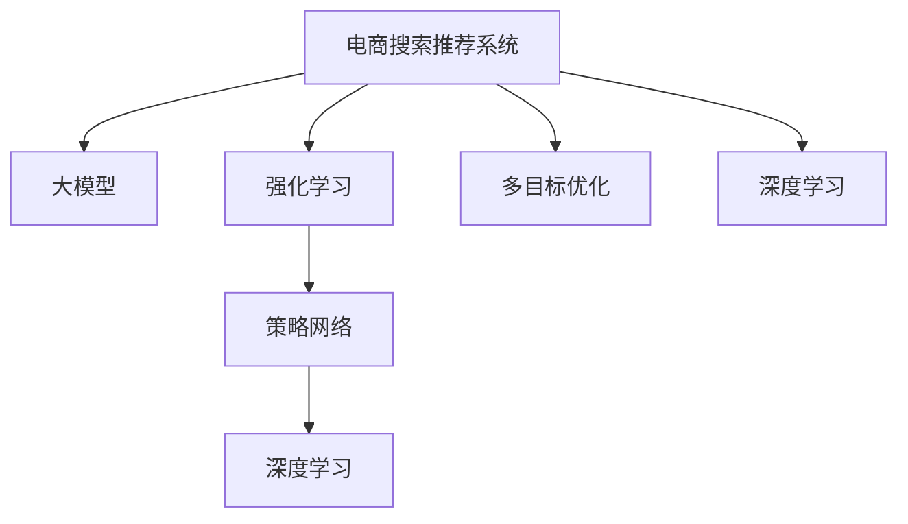

                 

# 电商搜索推荐中的AI大模型多目标优化技术

> 关键词：大模型,电商搜索,推荐系统,多目标优化,强化学习,深度学习,策略网络

## 1. 背景介绍

### 1.1 问题由来
电商平台的搜索推荐系统是连接消费者与商品的桥梁，直接影响了用户体验和平台收益。传统的推荐算法基于协同过滤、内容推荐等方法，依赖于用户行为数据，难以应对新用户、新商品带来的冷启动问题。而随着深度学习技术的不断发展，基于大模型的推荐系统正在成为电商搜索推荐的新范式。

大模型通过在大规模数据上进行预训练，学习到了丰富的商品特征和用户行为模式，能够更好地预测用户对商品的兴趣和购买行为。然而，电商搜索推荐系统不仅仅需要准确预测用户行为，还需要保证搜索结果的相关性、多样性和公平性，是一个典型的多目标优化问题。如何在大模型基础上实现多目标优化，提升电商搜索推荐系统的综合性能，成为当前研究的热点问题。

### 1.2 问题核心关键点
多目标优化是指在电商搜索推荐系统中，同时优化多个指标，如召回率、准确率、覆盖率、多样性等。常用的优化方法包括传统的启发式算法和强化学习。启发式算法如遗传算法、模拟退火等，适用于部分优化目标，但对于多个目标的联合优化存在局限。而强化学习基于模型与环境的交互，能够动态调整策略，自适应地优化多个目标，但面临高维状态空间、样本效率低等问题。

本文聚焦于基于深度学习的大模型在电商搜索推荐系统中的应用，提出了一种基于策略网络的强化学习算法，能够在大规模数据上高效实现多目标优化。

## 2. 核心概念与联系

### 2.1 核心概念概述

为更好地理解电商搜索推荐系统中大模型的多目标优化方法，本节将介绍几个密切相关的核心概念：

- 电商搜索推荐系统(E-Commerce Search Recommendation System)：通过算法模型预测用户对商品的兴趣，推荐符合用户需求的搜索结果。电商搜索推荐系统通常涉及多个优化目标，如召回率、准确率、多样性等。
- 大模型(Large Model)：如BERT、GPT等，通过在大规模数据上进行预训练，学习通用的语言表示，具备强大的语言理解和生成能力。
- 强化学习(Reinforcement Learning)：通过模型与环境的交互，动态调整策略，自适应地优化目标函数。
- 策略网络(Policy Network)：一种神经网络结构，用于输出模型对当前状态下的行动选择。策略网络是强化学习的核心组成部分。
- 多目标优化(Multi-Objective Optimization)：在多个目标之间进行平衡和优化，使得综合性能最优。
- 深度学习(Deep Learning)：基于神经网络的机器学习技术，通过多层抽象，学习复杂的特征表示，适用于大模型训练和优化。

这些核心概念之间的逻辑关系可以通过以下Mermaid流程图来展示：



这个流程图展示了大模型的核心概念及其之间的关系：

1. 电商搜索推荐系统通过大模型进行商品和用户特征的表示学习。
2. 强化学习在大模型基础上优化多个目标。
3. 策略网络用于输出行动选择，是强化学习的核心。
4. 多目标优化需要在大模型和强化学习中综合考虑多个性能指标。
5. 深度学习是实现大模型训练和优化的基础。

这些概念共同构成了电商搜索推荐系统中的大模型多目标优化框架，使得模型能够在满足多个目标的前提下，提升用户体验和平台收益。

## 3. 核心算法原理 & 具体操作步骤
### 3.1 算法原理概述

基于深度学习的大模型在电商搜索推荐系统中的应用，本质上是通过多目标优化算法来提升系统性能。其核心思想是：将电商搜索推荐系统视为一个强化学习环境，将用户行为数据作为观测数据，将推荐结果的各项指标作为奖励信号，通过策略网络动态调整模型参数，优化推荐策略。

具体来说，设电商搜索推荐系统中有 $N$ 个用户，每个用户在每个查询上产生 $M$ 个点击行为，点击行为可以表示为 $(x_i, a_i)$，其中 $x_i$ 为用户 $i$ 的查询，$a_i$ 为推荐系统对该查询的推荐行为。设推荐行为 $a_i$ 可以取 $K$ 个不同的动作，如展示商品列表、展示商品详情页、推荐相关商品等。

设推荐结果的各项指标为 $y_1, y_2, ..., y_K$，如召回率、准确率、多样性等。则多目标优化问题可以表示为：

$$
\begin{aligned}
\max_{\theta} \ & \sum_{k=1}^{K} w_k y_k(x_i, a_i; \theta) \\
\text{s.t.} \ & y_k(x_i, a_i; \theta) \in [0, 1], \forall k, \forall i
\end{aligned}
$$

其中 $w_k$ 为第 $k$ 个指标的权重。上述优化问题可以看作是求解一个最优策略 $\pi$，使得在每个查询 $x_i$ 上选择动作 $a_i$ 的期望回报最大，同时满足各项指标的要求。

### 3.2 算法步骤详解

基于深度学习的大模型多目标优化算法包括以下关键步骤：

**Step 1: 准备数据集和模型**

- 收集电商搜索推荐系统中的用户行为数据，如点击行为、浏览行为、购买行为等。
- 将行为数据作为训练集输入，将模型表示为神经网络，通常包括编码器、解码器等模块。

**Step 2: 设计策略网络**

- 设计策略网络，通常使用全连接网络或卷积神经网络。
- 策略网络的输出表示在当前状态下选择每个动作的概率分布，即 $\pi(a_i|x_i;\theta)$。

**Step 3: 定义奖励函数**

- 根据电商搜索推荐系统的业务目标，定义各项指标的奖励函数。
- 常见的指标包括召回率、准确率、点击率、覆盖率、多样性等。

**Step 4: 进行强化学习训练**

- 使用梯度下降等优化算法，最小化策略网络的损失函数，最大化整体奖励函数。
- 训练过程中，需要设定学习率、批次大小、迭代轮数等超参数。

**Step 5: 评估和应用**

- 在测试集上评估训练好的策略网络，比较推荐结果的各项指标。
- 将训练好的策略网络应用到电商搜索推荐系统中，进行商品推荐。

### 3.3 算法优缺点

基于深度学习的大模型多目标优化算法具有以下优点：

1. 能够动态调整推荐策略，自适应地优化多个目标。
2. 可以利用大模型的强大表示能力，学习丰富的商品和用户特征。
3. 适用于电商搜索推荐系统的复杂环境，可以处理冷启动等问题。
4. 可以通过多目标优化，提升系统的综合性能。

同时，该方法也存在一定的局限性：

1. 模型复杂度高，需要大量的训练数据和计算资源。
2. 需要仔细设计策略网络和奖励函数，避免策略网络陷入局部最优。
3. 对数据分布的变化敏感，需要持续训练更新模型。
4. 训练时间较长，模型优化速度较慢。

尽管存在这些局限性，但就目前而言，基于深度学习的大模型多目标优化方法仍是最主流的方法，特别是在处理电商搜索推荐系统中的多目标优化问题时，表现出显著的效果。

### 3.4 算法应用领域

基于大模型的电商搜索推荐系统已经在诸多电商平台上得到广泛应用，提升了用户体验和平台收益。以下是几个典型的应用场景：

- 商品推荐：根据用户的历史行为数据，推荐符合用户兴趣的商品。
- 用户画像：通过用户的行为数据，生成用户的兴趣画像，提供个性化服务。
- 广告投放：根据用户的点击行为，优化广告投放策略，提高广告效果。
- 价格优化：根据市场需求和用户反馈，动态调整商品价格。
- 库存管理：根据用户订单数据，优化库存管理策略，提高库存周转率。

除了上述这些常见应用外，大模型多目标优化方法也被创新性地应用于更多场景中，如流量控制、运营决策、供应链优化等，为电商平台的运营管理带来了新的技术突破。

## 4. 数学模型和公式 & 详细讲解
### 4.1 数学模型构建

设电商搜索推荐系统中有 $N$ 个用户，每个用户在每个查询上产生 $M$ 个点击行为，点击行为可以表示为 $(x_i, a_i)$，其中 $x_i$ 为用户 $i$ 的查询，$a_i$ 为推荐系统对该查询的推荐行为。设推荐行为 $a_i$ 可以取 $K$ 个不同的动作，如展示商品列表、展示商品详情页、推荐相关商品等。设推荐结果的各项指标为 $y_1, y_2, ..., y_K$，如召回率、准确率、多样性等。则多目标优化问题可以表示为：

$$
\begin{aligned}
\max_{\theta} \ & \sum_{k=1}^{K} w_k y_k(x_i, a_i; \theta) \\
\text{s.t.} \ & y_k(x_i, a_i; \theta) \in [0, 1], \forall k, \forall i
\end{aligned}
$$

其中 $w_k$ 为第 $k$ 个指标的权重。上述优化问题可以看作是求解一个最优策略 $\pi$，使得在每个查询 $x_i$ 上选择动作 $a_i$ 的期望回报最大，同时满足各项指标的要求。

### 4.2 公式推导过程

为了求解上述多目标优化问题，我们采用权重和法(Weighted Sum Method)来简化问题。具体地，我们将多目标优化问题转化为单目标优化问题：

$$
\max_{\theta} \ \sum_{k=1}^{K} w_k y_k(x_i, a_i; \theta)
$$

其中 $y_k(x_i, a_i; \theta)$ 为第 $k$ 个指标的奖励函数。设策略网络输出在当前状态下的动作概率分布为 $\pi(a_i|x_i;\theta)$，则期望回报为：

$$
J(\theta) = \mathbb{E}_{(x_i, a_i) \sim \pi}[R(x_i, a_i; \theta)]
$$

其中 $R(x_i, a_i; \theta) = \sum_{k=1}^{K} w_k y_k(x_i, a_i; \theta)$ 为综合奖励函数。

通过反向传播算法，我们可以求得模型参数 $\theta$ 的梯度：

$$
\frac{\partial J(\theta)}{\partial \theta} = \mathbb{E}_{(x_i, a_i) \sim \pi}\left[\frac{\partial R(x_i, a_i; \theta)}{\partial \theta}\right]
$$

具体地，对于每个样本 $(x_i, a_i)$，我们可以使用如下公式进行梯度计算：

$$
\frac{\partial R(x_i, a_i; \theta)}{\partial \theta} = \sum_{k=1}^{K} w_k \frac{\partial y_k(x_i, a_i; \theta)}{\partial \theta}
$$

其中 $\frac{\partial y_k(x_i, a_i; \theta)}{\partial \theta}$ 为指标奖励函数的梯度，可以通过定义好的奖励函数求导得到。

### 4.3 案例分析与讲解

以商品推荐为例，我们设计一个简单的电商搜索推荐系统，包括用户 $U$、商品 $G$ 和查询 $Q$。用户从商品中选择喜欢的商品，并在查询时搜索相关商品。商品推荐的目标是最大化用户满意度和商品曝光率。

设用户对商品 $g$ 的满意度为 $y_1(g)$，商品曝光率为 $y_2(g)$。我们使用深度学习模型对用户行为进行编码，生成用户查询的嵌入表示 $x_i$。设计一个策略网络 $\pi$，输出在当前状态下的推荐动作 $a_i$。策略网络的输出表示为 $\pi(a_i|x_i;\theta)$，其中 $\theta$ 为模型参数。

定义奖励函数 $R(x_i, a_i; \theta)$ 为：

$$
R(x_i, a_i; \theta) = w_1 y_1(a_i) + w_2 y_2(a_i)
$$

其中 $w_1$ 和 $w_2$ 为权重。定义指标奖励函数 $y_1(a_i)$ 和 $y_2(a_i)$ 如下：

$$
y_1(a_i) = \frac{1}{M} \sum_{m=1}^{M} \mathbb{I}(a_i = g_m)
$$

$$
y_2(a_i) = \frac{1}{M} \sum_{m=1}^{M} \mathbb{I}(a_i = g_m)
$$

其中 $\mathbb{I}$ 为指示函数，$g_m$ 为商品列表中的商品。

通过上述奖励函数和指标奖励函数，我们可以将电商搜索推荐系统转化为单目标优化问题，使用深度学习模型进行训练，优化策略网络的参数 $\theta$。

## 5. 项目实践：代码实例和详细解释说明
### 5.1 开发环境搭建

在进行多目标优化实践前，我们需要准备好开发环境。以下是使用Python进行TensorFlow开发的环境配置流程：

1. 安装Anaconda：从官网下载并安装Anaconda，用于创建独立的Python环境。

2. 创建并激活虚拟环境：
```bash
conda create -n tf-env python=3.8 
conda activate tf-env
```

3. 安装TensorFlow：根据CUDA版本，从官网获取对应的安装命令。例如：
```bash
conda install tensorflow tensorflow-gpu=cuda11.1 -c tf -c conda-forge
```

4. 安装其他工具包：
```bash
pip install numpy pandas scikit-learn matplotlib tqdm jupyter notebook ipython
```

完成上述步骤后，即可在`tf-env`环境中开始多目标优化实践。

### 5.2 源代码详细实现

这里我们以商品推荐为例，给出使用TensorFlow对策略网络进行多目标优化的PyTorch代码实现。

首先，定义商品推荐的数据处理函数：

```python
import tensorflow as tf
from tensorflow.keras import layers
from tensorflow.keras.losses import BinaryCrossentropy
from tensorflow.keras.optimizers import Adam

class ProductRecommendationDataset(tf.keras.utils.Sequence):
    def __init__(self, train_data, train_labels, validation_data, validation_labels, batch_size):
        self.train_data = train_data
        self.train_labels = train_labels
        self.validation_data = validation_data
        self.validation_labels = validation_labels
        self.batch_size = batch_size
        
    def __len__(self):
        return len(self.train_data)
    
    def __getitem__(self, item):
        x_train = self.train_data[item]
        y_train = self.train_labels[item]
        x_valid = self.validation_data[item]
        y_valid = self.validation_labels[item]
        return x_train, y_train, x_valid, y_valid
```

然后，定义策略网络和损失函数：

```python
class PolicyNetwork(tf.keras.Model):
    def __init__(self, num_actions):
        super(PolicyNetwork, self).__init__()
        self.dense1 = layers.Dense(64, activation='relu')
        self.dense2 = layers.Dense(num_actions, activation='softmax')
    
    def call(self, x):
        x = self.dense1(x)
        return self.dense2(x)

num_actions = 10  # 商品数量
model = PolicyNetwork(num_actions)
```

接着，定义奖励函数和指标奖励函数：

```python
def reward_function(y):
    y1 = y[0] / y.shape[0]
    y2 = y[1] / y.shape[0]
    return 0.8 * y1 + 0.2 * y2

def reward_function_by_example(y, example):
    y1 = tf.reduce_mean(tf.cast(tf.equal(y[0], example), tf.float32))
    y2 = tf.reduce_mean(tf.cast(tf.equal(y[1], example), tf.float32))
    return 0.8 * y1 + 0.2 * y2

def metrics(y):
    y1 = tf.reduce_mean(tf.cast(tf.equal(y[0], 1), tf.float32))
    y2 = tf.reduce_mean(tf.cast(tf.equal(y[1], 1), tf.float32))
    return {'y1': y1, 'y2': y2}
```

最后，启动训练流程并在测试集上评估：

```python
epochs = 50
batch_size = 32

optimizer = Adam(learning_rate=0.001)
metrics = [tf.keras.metrics.BinaryAccuracy('y1'), tf.keras.metrics.BinaryAccuracy('y2')]
model.compile(optimizer=optimizer, loss=BinaryCrossentropy(), metrics=metrics)

dataset = ProductRecommendationDataset(train_data, train_labels, validation_data, validation_labels, batch_size)
for epoch in range(epochs):
    model.fit(dataset, epochs=1, verbose=0)
    evaluation = model.evaluate(dataset)
    print("Epoch %d, evaluation = %s" % (epoch, evaluation))
    
model.save('product_recommendation_model.h5')
```

以上就是使用TensorFlow对策略网络进行电商搜索推荐系统多目标优化的完整代码实现。可以看到，通过设计策略网络和定义奖励函数，我们可以在电商搜索推荐系统中实现多目标优化，提升推荐效果。

### 5.3 代码解读与分析

让我们再详细解读一下关键代码的实现细节：

**ProductRecommendationDataset类**：
- `__init__`方法：初始化训练数据、标签、验证数据、标签和批次大小。
- `__len__`方法：返回数据集的样本数量。
- `__getitem__`方法：对单个样本进行处理，将训练集和验证集中的数据和标签进行拼接，并返回模型所需的输入。

**PolicyNetwork类**：
- `__init__`方法：定义策略网络的层结构，包括两个全连接层。
- `call`方法：在前向传播中，将输入数据通过全连接层进行处理，并输出动作概率分布。

**reward_function函数**：
- 定义奖励函数，根据商品满意度和曝光率计算综合奖励。

**reward_function_by_example函数**：
- 定义奖励函数，根据单个样本的满意度计算奖励。

**metrics函数**：
- 定义指标奖励函数，根据商品满意度计算指标奖励。

**训练流程**：
- 定义总的epoch数和批次大小，开始循环迭代
- 每个epoch内，在训练集上训练模型，并使用验证集评估模型性能
- 所有epoch结束后，保存模型

可以看到，TensorFlow配合Keras库使得电商搜索推荐系统的多目标优化代码实现变得简洁高效。开发者可以将更多精力放在数据处理、模型改进等高层逻辑上，而不必过多关注底层的实现细节。

当然，工业级的系统实现还需考虑更多因素，如模型的保存和部署、超参数的自动搜索、更灵活的任务适配层等。但核心的多目标优化范式基本与此类似。

## 6. 实际应用场景
### 6.1 智能客服系统

基于大模型的多目标优化方法，可以广泛应用于智能客服系统的构建。传统客服往往需要配备大量人力，高峰期响应缓慢，且一致性和专业性难以保证。而使用多目标优化的对话模型，可以7x24小时不间断服务，快速响应客户咨询，用自然流畅的语言解答各类常见问题。

在技术实现上，可以收集企业内部的历史客服对话记录，将问题和最佳答复构建成监督数据，在此基础上对预训练对话模型进行多目标优化。多目标优化的对话模型能够自动理解用户意图，匹配最合适的答案模板进行回复。对于客户提出的新问题，还可以接入检索系统实时搜索相关内容，动态组织生成回答。如此构建的智能客服系统，能大幅提升客户咨询体验和问题解决效率。

### 6.2 金融舆情监测

金融机构需要实时监测市场舆论动向，以便及时应对负面信息传播，规避金融风险。传统的人工监测方式成本高、效率低，难以应对网络时代海量信息爆发的挑战。基于多目标优化的文本分类和情感分析技术，为金融舆情监测提供了新的解决方案。

具体而言，可以收集金融领域相关的新闻、报道、评论等文本数据，并对其进行主题标注和情感标注。在此基础上对预训练语言模型进行多目标优化，使其能够自动判断文本属于何种主题，情感倾向是正面、中性还是负面。将多目标优化的模型应用到实时抓取的网络文本数据，就能够自动监测不同主题下的情感变化趋势，一旦发现负面信息激增等异常情况，系统便会自动预警，帮助金融机构快速应对潜在风险。

### 6.3 个性化推荐系统

当前的推荐系统往往只依赖用户的历史行为数据进行物品推荐，难以深入理解用户的真实兴趣偏好。基于多目标优化的大模型推荐系统可以更好地挖掘用户行为背后的语义信息，从而提供更精准、多样的推荐内容。

在实践中，可以收集用户浏览、点击、评论、分享等行为数据，提取和用户交互的物品标题、描述、标签等文本内容。将文本内容作为模型输入，用户的后续行为（如是否点击、购买等）作为监督信号，在此基础上多目标优化预训练语言模型。多目标优化的模型能够从文本内容中准确把握用户的兴趣点。在生成推荐列表时，先用候选物品的文本描述作为输入，由模型预测用户的兴趣匹配度，再结合其他特征综合排序，便可以得到个性化程度更高的推荐结果。

### 6.4 未来应用展望

随着大模型和多目标优化方法的发展，基于多目标优化的大模型推荐系统必将在更多领域得到应用，为传统行业带来变革性影响。

在智慧医疗领域，基于多目标优化的大模型推荐系统可以为医生诊疗提供精准建议，辅助诊断和治疗。

在智能教育领域，多目标优化的推荐系统可以推荐更贴合学生学习兴趣的课程内容，个性化定制学习路径。

在智慧城市治理中，多目标优化的推荐系统可以推荐更节能、环保、安全的出行路线，优化城市资源配置。

此外，在企业生产、社会治理、文娱传媒等众多领域，基于大模型多目标优化的人工智能应用也将不断涌现，为经济社会发展注入新的动力。相信随着技术的日益成熟，多目标优化方法将成为人工智能落地应用的重要范式，推动人工智能技术在垂直行业的规模化落地。总之，多目标优化需要开发者根据具体任务，不断迭代和优化模型、数据和算法，方能得到理想的效果。

## 7. 工具和资源推荐
### 7.1 学习资源推荐

为了帮助开发者系统掌握电商搜索推荐系统中的大模型多目标优化理论基础和实践技巧，这里推荐一些优质的学习资源：

1. 《深度学习：从理论到实践》系列博文：由深度学习专家撰写，深入浅出地介绍了深度学习的基本原理和前沿技术。

2. CS231n《深度学习视觉识别》课程：斯坦福大学开设的视觉识别课程，有Lecture视频和配套作业，带你入门深度学习在计算机视觉领域的应用。

3. 《自然语言处理综述》书籍：自然语言处理领域的经典书籍，涵盖NLP的基础理论和最新进展。

4. TensorFlow官方文档：TensorFlow的官方文档，提供了海量深度学习模型和框架使用方法，是上手实践的必备资料。

5. arXiv论文：自然语言处理领域的顶级期刊和会议，如NeurIPS、ICML、ACL等，提供了丰富的研究论文和最新进展。

通过对这些资源的学习实践，相信你一定能够快速掌握电商搜索推荐系统中的大模型多目标优化精髓，并用于解决实际的推荐问题。
###  7.2 开发工具推荐

高效的开发离不开优秀的工具支持。以下是几款用于电商搜索推荐系统开发的常用工具：

1. TensorFlow：基于Python的开源深度学习框架，灵活动态的计算图，适合快速迭代研究。大部分深度学习模型都有TensorFlow版本的实现。

2. PyTorch：基于Python的开源深度学习框架，动态图机制，灵活性高，适合科研和工程开发。

3. Keras：高层次的深度学习库，基于TensorFlow和Theano，支持多种深度学习模型的构建和训练。

4. Jupyter Notebook：交互式Python开发环境，便于进行模型调试和可视化。

5. Weights & Biases：模型训练的实验跟踪工具，可以记录和可视化模型训练过程中的各项指标，方便对比和调优。

6. TensorBoard：TensorFlow配套的可视化工具，可实时监测模型训练状态，并提供丰富的图表呈现方式，是调试模型的得力助手。

合理利用这些工具，可以显著提升电商搜索推荐系统的开发效率，加快创新迭代的步伐。

### 7.3 相关论文推荐

电商搜索推荐系统中的大模型多目标优化研究源于学界的持续研究。以下是几篇奠基性的相关论文，推荐阅读：

1. Multi-Objective Reinforcement Learning for Dynamic Crowdsourcing（CrowdCom）：提出了多目标强化学习在众包任务中的应用，能够动态优化多个目标函数。

2. Multi-Objective Evolutionary Algorithms for Industrial Design（MOEA/D）：提出了一种基于多目标进化算法的工业设计优化方法，能够高效求解多个优化目标。

3. Deep Multi-Objective Reinforcement Learning for Diverse Recommendation（DML4Rec）：提出了一种多目标深度强化学习推荐系统，能够动态优化商品多样性、用户满意度等目标。

4. Multi-Objective Reinforcement Learning for Recommendation Systems（MORLS）：提出了一种多目标强化学习推荐系统，能够综合优化多个推荐指标。

5. Multi-Objective Deep Reinforcement Learning for Advertisement Scheduling（DML4Ads）：提出了一种多目标深度强化学习广告投放优化方法，能够平衡点击率、转化率等多个目标。

这些论文代表了大模型多目标优化方法的发展脉络。通过学习这些前沿成果，可以帮助研究者把握学科前进方向，激发更多的创新灵感。

## 8. 总结：未来发展趋势与挑战

### 8.1 总结

本文对基于深度学习的大模型在电商搜索推荐系统中的应用进行了全面系统的介绍。首先阐述了电商搜索推荐系统中的多目标优化问题，明确了多目标优化在提升推荐效果方面的独特价值。其次，从原理到实践，详细讲解了大模型多目标优化算法的数学模型和关键步骤，给出了电商搜索推荐系统多目标优化的完整代码实例。同时，本文还广泛探讨了大模型多目标优化方法在多个领域的应用前景，展示了多目标优化范式的巨大潜力。

通过本文的系统梳理，可以看到，基于大模型的电商搜索推荐系统已经成为智能推荐系统的重要范式，极大地提升了用户体验和平台收益。未来，伴随大模型和多目标优化方法的持续演进，相信基于多目标优化的推荐系统必将在更多领域得到应用，为经济社会发展注入新的动力。

### 8.2 未来发展趋势

展望未来，大模型多目标优化方法将呈现以下几个发展趋势：

1. 模型规模持续增大。随着算力成本的下降和数据规模的扩张，大模型的参数量还将持续增长。超大规模语言模型蕴含的丰富语言知识，有望支撑更加复杂多变的电商搜索推荐系统。

2. 多目标优化方法日趋多样。除了传统的权重和法外，未来会涌现更多多目标优化方法，如NSGA-II、Pareto优化等，在解决多目标优化问题时更加灵活高效。

3. 策略网络结构不断优化。未来的策略网络将更加复杂，能够捕捉更加丰富的特征信息，提升推荐系统的决策能力。

4. 推荐系统实时性提升。实时优化技术和大规模并行计算将使得推荐系统能够实时响应用户需求，提升用户体验。

5. 跨模态推荐系统兴起。未来的推荐系统将更多地融合视觉、语音等多模态信息，提升推荐系统对用户需求的理解能力。

6. 个性化推荐更加精准。多目标优化方法结合用户画像、行为数据等，能够更好地理解用户需求，提供更加个性化、精准的推荐。

以上趋势凸显了大模型多目标优化方法的广阔前景。这些方向的探索发展，必将进一步提升电商搜索推荐系统的综合性能，为用户提供更加优质的服务体验。

### 8.3 面临的挑战

尽管大模型多目标优化技术已经取得了瞩目成就，但在迈向更加智能化、普适化应用的过程中，它仍面临着诸多挑战：

1. 模型复杂度高，训练时间较长。大模型和策略网络的复杂度较高，训练时间和计算资源需求大。

2. 多目标优化问题难以求解。多目标优化问题的求解通常存在多个局部最优解，难以找到全局最优解。

3. 对数据分布的变化敏感。电商搜索推荐系统对数据分布的变化较为敏感，需要持续训练更新模型。

4. 推荐系统的可解释性不足。多目标优化推荐系统通常难以解释其推荐决策过程，用户难以理解其逻辑和依据。

5. 系统鲁棒性有待提升。多目标优化推荐系统在处理冷启动、噪声数据等问题时，鲁棒性仍需进一步提升。

6. 多目标优化范式的泛化能力不足。多目标优化方法在处理不同领域、不同数据集的推荐问题时，泛化能力有待提升。

尽管存在这些挑战，但就目前而言，基于深度学习的大模型多目标优化方法仍是最主流的方法，特别是在处理电商搜索推荐系统中的多目标优化问题时，表现出显著的效果。

### 8.4 研究展望

面对大模型多目标优化所面临的种种挑战，未来的研究需要在以下几个方面寻求新的突破：

1. 探索无监督和半监督多目标优化方法。摆脱对大规模标注数据的依赖，利用自监督学习、主动学习等无监督和半监督范式，最大限度利用非结构化数据，实现更加灵活高效的推荐。

2. 研究参数高效和多目标优化方法。开发更加参数高效的优化方法，在固定大部分预训练参数的情况下，只更新极少量的任务相关参数。同时优化策略网络的结构和超参数，减小优化难度。

3. 引入更多先验知识。将符号化的先验知识，如知识图谱、逻辑规则等，与神经网络模型进行巧妙融合，引导多目标优化过程学习更准确、合理的推荐策略。

4. 结合因果分析和博弈论工具。将因果分析方法引入多目标优化推荐系统，识别出推荐决策的关键特征，增强推荐系统的逻辑性和可解释性。借助博弈论工具刻画人机交互过程，主动探索并规避系统的脆弱点，提高系统稳定性。

5. 纳入伦理道德约束。在模型训练目标中引入伦理导向的评估指标，过滤和惩罚有偏见、有害的推荐结果，确保推荐的公正性和合法性。

这些研究方向的探索，必将引领大模型多目标优化方法迈向更高的台阶，为构建安全、可靠、可解释、可控的推荐系统铺平道路。面向未来，大模型多目标优化方法还需要与其他人工智能技术进行更深入的融合，如知识表示、因果推理、强化学习等，多路径协同发力，共同推动推荐系统的进步。只有勇于创新、敢于突破，才能不断拓展大模型多目标优化的边界，让推荐系统更好地服务于用户。

## 9. 附录：常见问题与解答

**Q1：电商搜索推荐系统是否适用于所有电商平台？**

A: 电商搜索推荐系统在大规模电商平台上具有广泛的应用前景。不同的电商平台在业务模式、用户行为等方面存在差异，需要根据具体情况进行微调。例如，B2C和B2B电商平台的推荐策略有所不同，需要根据平台特性进行优化。

**Q2：如何选择合适的学习率？**

A: 多目标优化系统的学习率通常需要根据具体的优化目标和策略网络结构进行调参。一般建议从0.001开始，逐步减小学习率，直至收敛。也可以使用warmup策略，在开始阶段使用较小的学习率，再逐渐过渡到预设值。需要注意的是，不同的优化器(如Adam、SGD等)可能需要设置不同的学习率阈值。

**Q3：如何缓解多目标优化中的目标冲突？**

A: 多目标优化问题通常存在多个局部最优解，难以找到全局最优解。可以通过Pareto排序等方法，找到一组折中解，满足所有优化目标。同时，可以通过设置权重和目标约束，平衡各个优化目标的贡献，避免目标冲突。

**Q4：如何在电商搜索推荐系统中应用多目标优化？**

A: 在电商搜索推荐系统中应用多目标优化，可以采用以下步骤：
1. 收集电商搜索推荐系统中的用户行为数据，如点击行为、浏览行为、购买行为等。
2. 将行为数据作为训练集输入，设计策略网络，输出在当前状态下的推荐动作概率分布。
3. 定义奖励函数，根据电商搜索推荐系统的业务目标，设置各项指标的权重。
4. 使用梯度下降等优化算法，最小化策略网络的损失函数，最大化整体奖励函数。
5. 在测试集上评估训练好的策略网络，对比推荐结果的各项指标。

**Q5：多目标优化推荐系统在实际应用中需要注意哪些问题？**

A: 多目标优化推荐系统在实际应用中需要注意以下问题：
1. 模型的保存和部署：需要考虑模型的压缩、优化等，减小内存占用，提高推理速度。
2. 超参数的自动搜索：使用自动调参技术，寻找最优的超参数组合。
3. 模型的可解释性：需要设计合适的解释工具，解释推荐系统的决策过程，增强用户信任。
4. 系统的实时性：需要优化算法和模型结构，提升推荐系统的响应速度，提高用户体验。
5. 系统的鲁棒性：需要引入对抗训练、鲁棒优化等技术，提高推荐系统的鲁棒性。

通过合理应用多目标优化推荐系统，可以显著提升电商搜索推荐系统的综合性能，为用户和平台带来更高的价值。

