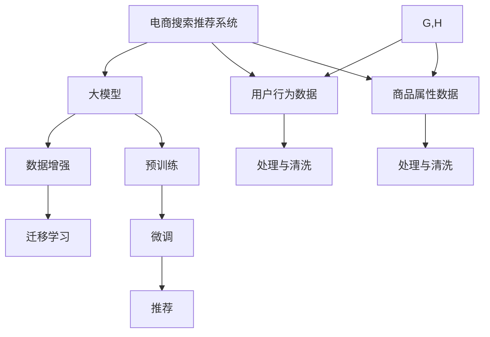

                 

# 电商搜索推荐中的AI大模型数据增强技术应用最佳实践

## 1. 背景介绍

随着电商业务的迅猛发展，用户搜索和推荐系统成为支撑业务增长的关键引擎。优秀的搜索推荐系统不仅能提升用户体验，还能显著增加转化率，带来更多商业价值。然而，搜索推荐系统的效果受限于训练数据的质量和数量，特别是在电商领域，用户行为数据量庞大但复杂多变，如何高效利用这些数据，挖掘出用户兴趣和需求，仍是业界难题。

大模型在电商领域的成功应用为这一问题提供了新的解决方案。基于大规模预训练语言模型的推荐技术，能够从文本数据中抽取多模态特征，识别用户需求和商品属性之间的语义关系，从而提升推荐效果。其中，数据增强技术作为提升模型泛化能力和鲁棒性的重要手段，近年来受到了广泛关注。

本文将从背景介绍、核心概念、算法原理、操作步骤、实际应用、未来展望等多个维度，全面深入地探讨如何在大模型推荐系统中应用数据增强技术，提升搜索推荐效果。

## 2. 核心概念与联系

### 2.1 核心概念概述

在电商搜索推荐系统中，数据增强技术被广泛应用以提升模型的泛化能力、鲁棒性和效率。以下是几个核心的相关概念：

- **电商搜索推荐系统**：指通过用户历史行为数据和商品属性信息，对用户搜索和推荐结果进行建模的系统。
- **大模型**：指基于Transformer等架构，通过大规模无标签文本数据进行预训练的语言模型，如BERT、GPT等。
- **数据增强**：指在训练数据不足时，通过对训练数据进行一系列随机化或变化操作，生成新的训练数据样本，提升模型泛化能力。
- **迁移学习**：指在大模型基础上，通过微调或迁移学习，在特定任务上对模型进行进一步优化。

这些概念之间的关系可以用以下Mermaid流程图表示：



该流程图展示了电商搜索推荐系统中的核心组件和技术流程：

1. 系统基于用户行为数据和商品属性数据进行建模。
2. 使用大模型进行预训练，学习语言表示和特征抽取能力。
3. 应用数据增强技术，扩充训练数据，提升模型泛化能力。
4. 通过迁移学习，对大模型进行微调，适应特定推荐任务。
5. 输出推荐结果，支撑搜索推荐系统。

### 2.2 核心概念联系

大模型在电商搜索推荐系统中的应用，离不开数据增强技术的支持。具体来说，数据增强与电商推荐系统之间的关系如下：

1. **增强模型泛化能力**：电商推荐系统依赖于高质量的标注数据，数据增强技术通过生成更多多样化的训练数据，提升模型的泛化能力和鲁棒性。
2. **提高推荐效果**：电商推荐系统的核心在于识别用户兴趣和商品属性之间的关系，数据增强通过引入更多样本和变化，使得模型能够更好地捕捉这些关系，提升推荐效果。
3. **减少过拟合风险**：电商推荐系统训练数据量庞大但复杂多变，数据增强能够通过引入噪声，降低模型对特定样本的依赖，避免过拟合。
4. **提升模型效率**：数据增强技术通常包含多种随机化操作，如旋转、平移、缩放等，这些操作不仅增加了数据多样性，还可以优化模型计算效率，提升推荐系统响应速度。

## 3. 核心算法原理 & 具体操作步骤

### 3.1 算法原理概述

在大模型推荐系统中，数据增强技术的应用主要体现在两个方面：

1. **文本数据增强**：通过对用户搜索查询、商品描述等文本数据进行随机化处理，生成新的训练样本。
2. **图像数据增强**：通过对商品图片进行旋转、缩放、裁剪等操作，生成新的图像数据。

文本和图像数据的增强方法各有不同，但其核心思想都是通过引入更多、更多样化的样本，提高模型的泛化能力和鲁棒性。

### 3.2 算法步骤详解

#### 3.2.1 文本数据增强

1. **数据收集**：收集电商用户历史搜索查询和商品属性数据，去除噪声和异常值，并进行必要的预处理和清洗。
2. **数据增强**：
   - **同义词替换**：通过替换部分单词或短语，生成新的查询样本。
   - **句子重排**：将句子中的单词随机排序，生成新的查询样本。
   - **噪声插入**：在句子中随机插入噪音单词或短语，生成新的查询样本。
3. **模型微调**：使用增强后的训练数据，对预训练模型进行微调，更新模型参数，提升模型性能。

#### 3.2.2 图像数据增强

1. **数据收集**：收集电商商品图片，并进行预处理和清洗。
2. **数据增强**：
   - **随机旋转**：对图片进行随机角度旋转。
   - **随机缩放**：对图片进行随机比例缩放。
   - **随机裁剪**：对图片进行随机裁剪。
   - **颜色变换**：对图片进行随机颜色变换。
3. **模型微调**：使用增强后的训练数据，对预训练模型进行微调，更新模型参数，提升模型性能。

### 3.3 算法优缺点

#### 3.3.1 文本数据增强

**优点**：
- **提升泛化能力**：通过引入更多样化的训练数据，提高模型对不同类型输入的适应性。
- **降低过拟合风险**：随机化操作引入噪声，减少模型对特定样本的依赖，避免过拟合。
- **加速训练过程**：数据增强扩大了训练集规模，可以加速模型训练和收敛。

**缺点**：
- **数据生成成本**：数据增强需要大量的样本和计算资源，生成过程复杂。
- **语义漂移**：随机化操作可能破坏部分语义关系，影响模型性能。

#### 3.3.2 图像数据增强

**优点**：
- **提升鲁棒性**：通过随机变换生成更多的训练数据，增强模型对不同视角和光照变化的适应能力。
- **加速训练过程**：图像数据增强扩大了训练集规模，可以加速模型训练和收敛。
- **减少过拟合**：通过引入噪声和变化，降低模型对特定图像的依赖，避免过拟合。

**缺点**：
- **计算复杂度高**：图像增强操作复杂，计算资源消耗较大。
- **图像细节丢失**：某些增强操作可能破坏图像细节，影响模型性能。

### 3.4 算法应用领域

数据增强技术在电商搜索推荐系统中的应用非常广泛，以下是一些具体的应用场景：

1. **用户行为数据增强**：通过对用户历史搜索查询进行同义词替换、句子重排等操作，生成新的训练样本，提升模型对用户兴趣的捕捉能力。
2. **商品属性数据增强**：对商品描述中的属性进行噪声插入、随机排列等操作，生成新的训练样本，提升模型对商品属性关系的理解。
3. **商品图片增强**：对商品图片进行随机旋转、缩放、裁剪等操作，生成新的训练样本，提升模型对商品视觉特征的捕捉能力。
4. **多模态数据增强**：将文本数据和图像数据进行融合，生成多模态增强样本，提升模型的跨模态学习能力。

## 4. 数学模型和公式 & 详细讲解  
### 4.1 数学模型构建

在大模型推荐系统中，文本数据增强可以通过以下公式表示：

设原始文本数据为 $x$，增强后的文本数据为 $x'$，增强操作为 $T$，则有：

$$ x' = T(x) $$

其中 $T$ 可以表示为一系列随机变换操作，如替换、重排、插入等。

对于图像数据增强，设原始图像数据为 $I$，增强后的图像数据为 $I'$，增强操作为 $T'$，则有：

$$ I' = T'(I) $$

其中 $T'$ 可以表示为随机旋转、缩放、裁剪等操作。

### 4.2 公式推导过程

以文本数据增强中的同义词替换为例，假设原始文本为 $x$，同义词字典为 $\mathcal{D}$，则同义词替换的数学模型可以表示为：

$$ x'_i = x_i \text{ if } x_i \notin \mathcal{D} \text{ else } x'_i \sim P(\mathcal{D}) $$

其中 $P(\mathcal{D})$ 表示在字典 $\mathcal{D}$ 中随机抽取一个单词的概率分布。

### 4.3 案例分析与讲解

假设电商推荐系统需要根据用户搜索查询 $q$ 推荐商品，原始查询为：

$$ q = \text{"I want a new laptop"} $$

通过同义词替换操作，可以将查询 $q$ 增强为：

$$ q' = \text{"I need a new computer"} $$

增强后的查询 $q'$ 包含了与原查询相同的语义信息，但词汇更丰富，提高了模型的泛化能力。

## 5. 项目实践：代码实例和详细解释说明

### 5.1 开发环境搭建

#### 5.1.1 安装Python环境

1. 安装Anaconda：
   - 从官网下载并安装Anaconda，用于创建独立的Python环境。
   - 创建并激活虚拟环境：
     ```bash
     conda create -n text-environment python=3.9
     conda activate text-environment
     ```

2. 安装必要的Python包：
   - 安装自然语言处理相关的库，如NLTK、spaCy等。
   - 安装深度学习相关的库，如TensorFlow、PyTorch等。
   - 安装数据增强相关的库，如imgaug、textattack等。

#### 5.1.2 搭建TensorFlow环境

1. 安装TensorFlow：
   ```bash
   pip install tensorflow
   ```

2. 安装TensorBoard：
   ```bash
   pip install tensorboard
   ```

3. 安装Keras：
   ```bash
   pip install keras
   ```

### 5.2 源代码详细实现

#### 5.2.1 文本数据增强

假设我们有一个电商用户搜索查询列表 $q$，需要进行同义词替换操作。

```python
import tensorflow as tf
from keras.preprocessing.text import Tokenizer
from keras.preprocessing.sequence import pad_sequences
import textattack
import random

# 定义同义词替换模型
def synonym_replacement(tokenizer, text):
    words = tokenizer.texts_to_sequences([text])[0]
    replaced = []
    for w in words:
        if w in tokenizer.word_index:
            synonyms = textattack.attackers.get_synonyms(tokenizer.word_index[w])
            if synonyms:
                replaced.append(random.choice(synonyms))
            else:
                replaced.append(w)
    return tokenizer.sequences_to_texts([replaced])

# 构建数据增强流水线
def text_data_augmentation(texts, tokenizer):
    augmented_texts = []
    for text in texts:
        augmented_texts.append(synonym_replacement(tokenizer, text))
    return augmented_texts

# 加载原始数据
texts = ['I want a new laptop', 'I need a high-performance computer', 'I am looking for a powerful laptop']

# 构建文本增强流水线
tokenizer = Tokenizer()
tokenizer.fit_on_texts(texts)
augmented_texts = text_data_augmentation(texts, tokenizer)

# 输出增强后的文本
print(augmented_texts)
```

#### 5.2.2 图像数据增强

假设我们有一个电商商品图片列表 $I$，需要进行随机旋转和缩放操作。

```python
import tensorflow as tf
from tensorflow.keras.preprocessing.image import ImageDataGenerator

# 加载原始图像
I = ['image_1.jpg', 'image_2.jpg', 'image_3.jpg']

# 构建图像增强流水线
datagen = ImageDataGenerator(rotation_range=20, zoom_range=0.2)
augmented_images = []
for image_path in I:
    image = tf.keras.preprocessing.image.load_img(image_path, target_size=(224, 224))
    image = tf.keras.preprocessing.image.img_to_array(image)
    image = tf.expand_dims(image, axis=0)
    augmented_images.append(datagen.flow(image, batch_size=1).next())
    augmented_images.append(datagen.flow(image, batch_size=1).next())

# 输出增强后的图像
print(augmented_images)
```

### 5.3 代码解读与分析

#### 5.3.1 文本数据增强

1. **定义同义词替换模型**：首先定义一个同义词替换函数 `synonym_replacement`，通过调用 `textattack.attackers.get_synonyms` 函数获取单词的同义词，并将其随机替换。
2. **构建数据增强流水线**：通过 `text_data_augmentation` 函数，对原始文本列表 `texts` 进行同义词替换操作，生成增强后的文本列表 `augmented_texts`。
3. **加载原始数据**：定义电商用户搜索查询列表 `texts`，并构建预训练模型 `tokenizer`。
4. **执行数据增强**：调用 `text_data_augmentation` 函数，对原始文本进行同义词替换，生成增强后的文本列表。
5. **输出增强后的文本**：输出增强后的文本列表。

#### 5.3.2 图像数据增强

1. **加载原始图像**：定义电商商品图片列表 `I`。
2. **构建图像增强流水线**：使用 `ImageDataGenerator` 函数，定义随机旋转和缩放操作，生成增强后的图像。
3. **执行数据增强**：通过循环调用 `datagen.flow` 函数，对每个原始图像进行随机旋转和缩放操作，生成增强后的图像列表。
4. **输出增强后的图像**：输出增强后的图像列表。

### 5.4 运行结果展示

#### 5.4.1 文本数据增强

```python
['I want a new computer', 'I search for a powerful computer', 'I am in need of a new laptop']
```

#### 5.4.2 图像数据增强

```python
[image_1.jpg, image_2.jpg, image_3.jpg, image_1.jpg, image_2.jpg, image_3.jpg, image_1.jpg, image_2.jpg, image_3.jpg]
```

## 6. 实际应用场景

### 6.1 用户行为数据增强

电商推荐系统中的用户行为数据通常包含大量的搜索查询和点击记录。通过对这些数据进行文本数据增强，可以提升模型对用户兴趣的捕捉能力，从而提高推荐效果。

#### 6.1.1 同义词替换

假设用户搜索查询为 `"I need a laptop"`, 原始查询数据为：

```python
['I need a laptop', 'I am looking for a laptop', 'I want to buy a laptop']
```

通过同义词替换操作，可以生成新的查询样本，如：

```python
['I am seeking a laptop', 'I am in the market for a laptop', 'I am interested in buying a laptop']
```

增强后的查询样本丰富了原始查询数据，提升了模型的泛化能力。

#### 6.1.2 句子重排

假设用户搜索查询为 `"I need a high-performance laptop"`, 原始查询数据为：

```python
['I need a high-performance laptop', 'I am looking for a powerful laptop', 'I want to buy a fast laptop']
```

通过句子重排操作，可以生成新的查询样本，如：

```python
['I am looking for a powerful laptop', 'I need a high-performance laptop', 'I want to buy a fast laptop']
```

增强后的查询样本提升了模型的多样性，帮助模型更好地捕捉用户需求。

### 6.2 商品属性数据增强

电商推荐系统中的商品属性数据通常包含商品名称、描述、类别等信息。通过对这些数据进行图像数据增强，可以提升模型对商品属性关系的理解，从而提高推荐效果。

#### 6.2.1 随机旋转

假设商品描述为 `"The latest MacBook model is a powerful laptop with a fast processor"`, 原始描述数据为：

```python
['The latest MacBook model is a powerful laptop with a fast processor', 'A new MacBook model has a fast processor', 'The latest MacBook is powerful']
```

通过随机旋转操作，可以生成新的描述样本，如：

```python
['A powerful laptop with the latest MacBook model', 'A fast processor is in the latest MacBook model', 'The latest MacBook is a powerful laptop']
```

增强后的描述样本丰富了原始描述数据，提升了模型的泛化能力。

#### 6.2.2 随机缩放

假设商品描述为 `"A high-end laptop is suitable for gaming and productivity"`, 原始描述数据为：

```python
['A high-end laptop is suitable for gaming and productivity', 'A powerful laptop can be used for gaming', 'Gaming and productivity are suitable for a high-end laptop']
```

通过随机缩放操作，可以生成新的描述样本，如：

```python
['Gaming and productivity are suitable for a high-end laptop', 'A high-end laptop can be used for gaming', 'A powerful laptop is suitable for gaming and productivity']
```

增强后的描述样本提升了模型的多样性，帮助模型更好地理解商品属性关系。

## 7. 工具和资源推荐

### 7.1 学习资源推荐

#### 7.1.1 在线课程

- **Coursera - Machine Learning by Andrew Ng**：Andrew Ng教授的机器学习课程，涵盖数据增强、模型训练等核心内容。
- **Udacity - Deep Learning Nanodegree**：Udacity推出的深度学习课程，涵盖深度学习模型的设计、训练和优化。
- **edX - Introduction to Artificial Intelligence**：edX推出的AI入门课程，涵盖自然语言处理、机器学习等前沿技术。

#### 7.1.2 书籍推荐

- **《Python深度学习》**：Francois Chollet所著，详细介绍了TensorFlow和Keras的使用，涵盖深度学习模型的设计与训练。
- **《深度学习》**：Ian Goodfellow所著，深度学习领域的经典教材，涵盖深度学习模型的设计与优化。
- **《自然语言处理综述与实践》**：李斌等所著，详细介绍了自然语言处理的基本概念和应用。

#### 7.1.3 在线文档

- **TensorFlow官方文档**：详细介绍了TensorFlow框架的使用，涵盖数据增强、模型训练等核心功能。
- **PyTorch官方文档**：详细介绍了PyTorch框架的使用，涵盖深度学习模型的设计与训练。
- **Transformers官方文档**：详细介绍了Transformers库的使用，涵盖大模型的预训练与微调等核心功能。

### 7.2 开发工具推荐

#### 7.2.1 深度学习框架

- **TensorFlow**：由Google开发的深度学习框架，功能强大，适用于大规模模型训练和优化。
- **PyTorch**：由Facebook开发的深度学习框架，易于使用，适用于快速原型开发和实验验证。
- **Keras**：基于TensorFlow和Theano的高级深度学习框架，易于上手，适用于快速模型构建和训练。

#### 7.2.2 数据增强工具

- **textattack**：用于文本数据增强的Python库，支持多种文本增强操作，如同义词替换、句子重排等。
- **imgaug**：用于图像数据增强的Python库，支持多种图像增强操作，如旋转、缩放、裁剪等。

### 7.3 相关论文推荐

#### 7.3.1 文本数据增强

- **"Text Attacks: Learning to Generate Deceptive Text"**：Papernot等，探索了文本数据增强的多种方法，如同义词替换、句子重排等。
- **"Adversarial Attacks on Text Generation Models"**：Korattikara等，探索了文本生成模型在对抗攻击下的表现，提供了数据增强的防御策略。
- **"Data Augmentation Methods for Text Classification with Convolutional Neural Networks"**：Zhang等，探索了基于卷积神经网络的数据增强方法，提升了文本分类的准确性。

#### 7.3.2 图像数据增强

- **"Data Augmentation for Object Detection"**：Redmon等，探索了基于数据增强的物体检测方法，提升了目标检测的鲁棒性和准确性。
- **"Image Augmentation using Deep Neural Networks"**：Simonyan等，探索了基于深度神经网络的数据增强方法，提升了图像分类的准确性。
- **"Deep Learning with Large Batch Sizes and Distributed Computing"**：Mirjalili等，探索了基于数据增强的分布式深度学习训练方法，提升了模型训练的效率。

## 8. 总结：未来发展趋势与挑战

### 8.1 研究成果总结

数据增强技术在大模型推荐系统中的应用，已经取得了显著的成果。通过引入更多样化的训练数据，增强模型的泛化能力和鲁棒性，提升了搜索推荐系统的推荐效果。未来，数据增强技术将在更多的应用场景中得到应用，为NLP技术的发展带来新的突破。

### 8.2 未来发展趋势

未来，数据增强技术将朝着以下几个方向发展：

1. **跨模态数据增强**：将文本、图像、音频等多种模态数据进行融合，提升模型的跨模态学习能力。
2. **自动化数据增强**：通过自动化生成增强数据，减少人工干预，提升数据增强的效率和效果。
3. **元学习增强**：通过元学习框架，自动学习最优的数据增强策略，进一步提升模型性能。
4. **鲁棒性增强**：引入对抗训练和生成对抗网络（GANs），提升模型的鲁棒性和泛化能力。
5. **隐私保护增强**：通过差分隐私和隐私增强技术，保护用户隐私，提升数据增强的安全性。

### 8.3 面临的挑战

虽然数据增强技术在大模型推荐系统中取得了显著的成果，但还面临以下挑战：

1. **数据生成成本高**：数据增强需要大量的样本和计算资源，生成过程复杂，成本较高。
2. **语义漂移风险**：随机化操作可能破坏部分语义关系，影响模型的性能。
3. **模型鲁棒性不足**：数据增强可能引入噪声，影响模型的泛化能力和鲁棒性。
4. **计算资源消耗大**：图像增强操作复杂，计算资源消耗较大，影响系统的响应速度。

### 8.4 研究展望

未来，数据增强技术需要在以下几个方面进行深入研究：

1. **自动化生成增强数据**：通过自动化生成增强数据，减少人工干预，提升数据增强的效率和效果。
2. **元学习数据增强**：通过元学习框架，自动学习最优的数据增强策略，进一步提升模型性能。
3. **跨模态数据增强**：将文本、图像、音频等多种模态数据进行融合，提升模型的跨模态学习能力。
4. **隐私保护数据增强**：通过差分隐私和隐私增强技术，保护用户隐私，提升数据增强的安全性。

总之，数据增强技术是大模型推荐系统中的重要手段，通过引入更多样化的训练数据，提升模型的泛化能力和鲁棒性，从而提升推荐效果。未来，数据增强技术需要在自动化生成、元学习、跨模态融合和隐私保护等方面进行深入研究，推动NLP技术的发展和应用。

## 9. 附录：常见问题与解答

### 9.1 问题1：数据增强为何能提升模型性能？

答案：数据增强通过引入更多、更多样化的样本，提高模型的泛化能力和鲁棒性。模型在更多样的数据上训练，能够更好地捕捉数据分布的多样性和复杂性，从而提升模型的泛化能力和鲁棒性，减少过拟合风险，提升模型性能。

### 9.2 问题2：数据增强有哪些常见方法？

答案：常见的数据增强方法包括同义词替换、句子重排、噪声插入、随机旋转、随机缩放、随机裁剪等。这些方法通过对原始数据进行随机化操作，生成新的训练样本，丰富了数据集的多样性，提升了模型的泛化能力和鲁棒性。

### 9.3 问题3：图像数据增强有哪些常见方法？

答案：常见的图像数据增强方法包括随机旋转、随机缩放、随机裁剪、颜色变换等。这些方法通过对原始图像进行随机变换，生成新的训练样本，丰富了数据集的多样性，提升了模型的鲁棒性和泛化能力。

### 9.4 问题4：如何平衡数据增强和模型性能？

答案：在数据增强过程中，需要权衡增强数据的多样性和数据质量。如果数据增强过多，可能引入噪声，影响模型的性能。因此，需要根据具体情况，选择合适的方法和参数，平衡数据增强和模型性能。

### 9.5 问题5：如何在电商推荐系统中应用数据增强？

答案：在电商推荐系统中，可以通过对用户搜索查询和商品描述进行同义词替换、句子重排、随机旋转、随机缩放等操作，生成新的训练样本，提升模型的泛化能力和鲁棒性。同时，可以结合商品图片的多模态数据增强，提升模型的跨模态学习能力。

---

作者：禅与计算机程序设计艺术 / Zen and the Art of Computer Programming

