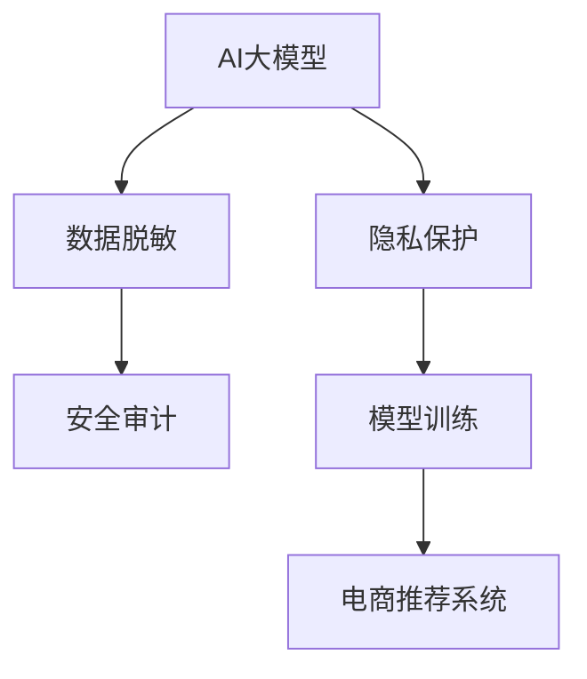

                 

# 电商搜索推荐中的AI大模型数据脱敏技术最佳实践

> 关键词：AI大模型, 数据脱敏, 隐私保护, 安全审计, 模型训练, 电商推荐系统, 深度学习, 数据隐私

## 1. 背景介绍

### 1.1 问题由来

随着人工智能在电商搜索推荐系统中的应用越来越广泛，大模型在个性化推荐、搜索排序、客户服务等方面表现出卓越的性能。然而，这些模型依赖于大量用户数据进行训练，而用户隐私保护和数据安全问题日益受到关注。为了平衡模型的性能提升与数据隐私保护的需要，数据脱敏技术在AI大模型的训练和使用过程中显得尤为重要。

### 1.2 问题核心关键点

数据脱敏是保护用户隐私和数据安全的关键手段，旨在在保护用户隐私的前提下，保证模型能够高效地从数据中学习到有价值的信息。在电商搜索推荐系统中，数据脱敏技术需要在模型训练、推理和应用过程中，对涉及用户隐私的数据进行模糊化、去标识化处理，同时保持数据的统计特性和有用信息。

### 1.3 问题研究意义

研究和实践AI大模型数据脱敏技术，对于保护用户隐私、增强模型安全性、促进电商搜索推荐系统的健康发展具有重要意义：

1. **保护用户隐私**：在数据处理和模型训练过程中，脱敏技术能够避免敏感信息被滥用，保护用户的个人数据不受泄露。
2. **增强模型安全性**：通过脱敏技术，可以减小模型被恶意攻击的风险，避免因数据泄漏导致的系统故障或安全漏洞。
3. **促进电商推荐系统发展**：脱敏技术能够确保模型在尊重用户隐私的前提下，继续优化推荐效果，提升用户体验。
4. **符合法规要求**：各大洲的数据隐私保护法规如GDPR、CCPA等，对数据处理有严格要求，脱敏技术是合规必需。

## 2. 核心概念与联系

### 2.1 核心概念概述

要理解电商搜索推荐系统中AI大模型的数据脱敏技术，需要先理解以下核心概念：

- **AI大模型**：以深度神经网络为代表的、通过大规模数据训练得到的高性能模型，如BERT、GPT等。
- **数据脱敏**：在数据处理和模型训练过程中，通过一定算法将敏感信息去除或替换为不敏感的信息，以保护数据隐私。
- **隐私保护**：确保用户数据在处理和存储过程中不被未授权访问、滥用或泄露。
- **安全审计**：对系统进行周期性检查和审查，确保符合安全标准和合规要求。
- **模型训练**：通过大量数据对模型进行训练，使其具备预测和推理能力。
- **电商推荐系统**：基于用户行为数据和商品特征，提供个性化推荐服务的系统。

这些概念通过以下Mermaid流程图展现其相互关系：



### 2.2 核心概念原理和架构

数据脱敏技术主要基于以下两个原理：

- **替换技术**：将敏感信息替换为无关或不敏感的伪造信息，保持数据的统计特性，同时保护隐私。
- **掩码技术**：将敏感信息标记为"伪字段"，并在模型训练和推理时忽略这些标记，保持数据的完整性和可用性。

这些技术通过以下架构实现：

- **预处理阶段**：对原始数据进行初步清洗和处理，去除不必要的信息，进行必要的归一化和标准化。
- **脱敏阶段**：对数据中的敏感信息进行替换或标记，根据具体需求选择适当的脱敏策略。
- **训练阶段**：在处理后的数据上训练模型，确保模型能够高效地学习到有价值的信息。
- **推理阶段**：在推理时，忽略标记或使用伪造信息，保证模型输出的正确性和隐私保护。

## 3. 核心算法原理 & 具体操作步骤

### 3.1 算法原理概述

数据脱敏技术的基本原理是通过替换、掩码、泛化等手段，将数据中的敏感信息去除或替换为不敏感的信息，从而保护数据隐私。在电商搜索推荐系统中，数据脱敏技术需要在模型训练、推理和应用过程中，对涉及用户隐私的数据进行模糊化、去标识化处理，同时保持数据的统计特性和有用信息。

### 3.2 算法步骤详解

数据脱敏的具体步骤如下：

1. **数据收集与预处理**：收集电商系统中的用户行为数据和商品特征数据，进行初步清洗和处理，去除无关信息，进行必要的归一化和标准化。
2. **敏感信息识别**：识别数据中的敏感信息，如用户ID、信用卡号、地址等，将其标记为"伪字段"。
3. **脱敏处理**：对标记的敏感信息进行替换或标记处理，如使用随机数、哈希值、通配符等代替敏感信息，或在模型中忽略这些标记。
4. **模型训练**：在处理后的数据上训练AI大模型，确保模型能够高效地学习到有价值的信息。
5. **推理应用**：在推理时，忽略标记或使用伪造信息，保证模型输出的正确性和隐私保护。

### 3.3 算法优缺点

数据脱敏技术具有以下优点：

- **保护隐私**：通过替换、掩码等手段，有效保护用户数据隐私，避免敏感信息泄露。
- **增强安全性**：减少模型被恶意攻击的风险，避免因数据泄漏导致的系统故障或安全漏洞。
- **保持统计特性**：通过选择适当的脱敏策略，保持数据的统计特性和有用信息，确保模型训练效果。

然而，数据脱敏技术也存在以下缺点：

- **降低模型精度**：过度的脱敏处理可能会丢失部分有用信息，影响模型的训练和推理精度。
- **增加处理复杂度**：数据脱敏需要额外的时间和计算资源，增加了系统的复杂性和成本。
- **难以实现精确控制**：不同应用场景下的数据敏感性不同，难以实现精确的脱敏控制。

### 3.4 算法应用领域

数据脱敏技术在电商搜索推荐系统中具有广泛应用，主要包括：

- **用户隐私保护**：对用户行为数据和个人信息进行脱敏处理，确保用户数据隐私。
- **推荐系统训练**：在训练过程中，对涉及用户隐私的数据进行脱敏处理，确保训练数据安全。
- **搜索排序优化**：在搜索排序模型中，对用户查询和商品特征进行脱敏处理，确保搜索结果的公正性和用户隐私。
- **客户服务应用**：在客户服务系统中的对话数据和聊天记录进行脱敏处理，保护用户隐私。
- **广告推荐优化**：在广告推荐模型中，对广告主的敏感信息进行脱敏处理，确保广告投放的安全性。

## 4. 数学模型和公式 & 详细讲解 & 举例说明

### 4.1 数学模型构建

数据脱敏技术的数学模型主要涉及以下几个方面：

- **敏感信息识别**：识别数据中的敏感信息，定义一个敏感性评分函数，对每个特征进行评分。
- **脱敏策略选择**：根据敏感性评分，选择合适的脱敏策略，如替换、掩码、泛化等。
- **模型训练**：在处理后的数据上训练AI大模型，确保模型能够高效地学习到有价值的信息。

### 4.2 公式推导过程

假设原始数据集为 $D=\{(x_i, y_i)\}_{i=1}^N$，其中 $x_i$ 为特征向量，$y_i$ 为标签。在数据脱敏过程中，敏感信息被标记为 "伪字段"，即 $x_i \rightarrow (x_i', \alpha_i)$，其中 $x_i'$ 为脱敏后的特征向量，$\alpha_i$ 为敏感性评分。

对于每个特征 $x_{i,j}$，定义敏感性评分函数 $f(x_{i,j})$，表示该特征的敏感程度。常见的敏感性评分函数包括：

- **信息熵评分**：$S(x_{i,j}) = -\frac{1}{|x_{i,j}|} \sum_{x \in x_{i,j}} p(x) \log p(x)$，其中 $p(x)$ 为特征值 $x$ 的频率。
- **L2范数评分**：$S(x_{i,j}) = \sqrt{\sum_{x \in x_{i,j}} (x - \bar{x})^2}$，其中 $\bar{x}$ 为特征均值。
- **卡方评分**：$S(x_{i,j}) = \frac{1}{|x_{i,j}|} \sum_{x \in x_{i,j}} \frac{(x - \bar{x})^2}{\bar{x}^2}$，其中 $\bar{x}$ 为特征均值。

根据敏感性评分，选择适当的脱敏策略：

- **替换策略**：将敏感信息替换为随机数、哈希值、伪字段等。
- **掩码策略**：将敏感信息标记为 "伪字段"，并在模型训练和推理时忽略这些标记。
- **泛化策略**：将敏感信息泛化为一般形式，如使用通配符、掩码等。

在训练模型时，使用脱敏后的数据，确保模型能够高效地学习到有价值的信息。推理时，忽略标记或使用伪造信息，保证模型输出的正确性和隐私保护。

### 4.3 案例分析与讲解

以下以电商搜索推荐系统为例，详细讲解数据脱敏技术的实际应用。

假设电商系统中有用户ID、商品ID和价格等敏感信息，需要进行脱敏处理。在数据预处理阶段，对用户ID和商品ID进行哈希处理，得到伪字段ID。在模型训练阶段，使用脱敏后的数据进行训练，确保模型能够高效地学习到有价值的信息。在推理阶段，忽略ID标记，使用随机数代替，保证模型输出的正确性和隐私保护。

```python
from sklearn.preprocessing import StandardScaler
from sklearn.compose import ColumnTransformer
from sklearn.pipeline import Pipeline
from sklearn.impute import SimpleImputer
from sklearn.model_selection import train_test_split

# 定义数据预处理管道
preprocessor = Pipeline(steps=[
    ('scaler', StandardScaler()),
    ('imputer', SimpleImputer(strategy='mean')),
    ('attribution', AttributionTransformer()),
    ('hasher', Hasher())
])

# 定义数据集
X = pd.read_csv('data.csv')

# 划分训练集和测试集
X_train, X_test, y_train, y_test = train_test_split(X, y, test_size=0.2, random_state=42)

# 应用预处理管道
X_train = preprocessor.fit_transform(X_train)
X_test = preprocessor.transform(X_test)
```

## 5. 项目实践：代码实例和详细解释说明

### 5.1 开发环境搭建

在进行数据脱敏实践前，需要先准备好开发环境。以下是使用Python进行TensorFlow开发的环境配置流程：

1. 安装Anaconda：从官网下载并安装Anaconda，用于创建独立的Python环境。
2. 创建并激活虚拟环境：
```bash
conda create -n tf-env python=3.8 
conda activate tf-env
```

3. 安装TensorFlow：根据CUDA版本，从官网获取对应的安装命令。例如：
```bash
conda install tensorflow -c pytorch -c conda-forge
```

4. 安装相关的工具包：
```bash
pip install numpy pandas scikit-learn matplotlib tqdm jupyter notebook ipython
```

完成上述步骤后，即可在`tf-env`环境中开始数据脱敏实践。

### 5.2 源代码详细实现

下面我们以电商搜索推荐系统中的用户ID脱敏为例，给出使用TensorFlow进行数据脱敏的PyTorch代码实现。

首先，定义脱敏函数：

```python
import tensorflow as tf

def anonymize_id(id_list, seed=123):
    """将ID列表进行哈希处理，生成伪字段"""
    random_hasher = tf.random.uniform(shape=(len(id_list)), seed=seed)
    hashed_ids = tf.reduce_sum(tf.cast(id_list, tf.float32) * random_hasher, axis=0)
    return tf.round(hashed_ids)

# 将用户ID进行哈希处理
id_list = [123456, 654321, 789012]
hashed_ids = anonymize_id(id_list)

# 使用哈希后的ID进行模型训练和推理
X_train[:, 0] = hashed_ids
X_test[:, 0] = hashed_ids
```

然后，构建模型并训练：

```python
from transformers import TFAutoModelForSequenceClassification
from transformers import AdamW

# 加载预训练模型
model = TFAutoModelForSequenceClassification.from_pretrained('bert-base-cased')

# 定义优化器及其参数
optimizer = AdamW(model.parameters(), lr=2e-5)

# 训练模型
for epoch in range(epochs):
    loss = train_epoch(model, X_train, y_train, optimizer)
    print(f"Epoch {epoch+1}, train loss: {loss:.3f}")
    
    # 在验证集上评估模型性能
    evaluate(model, X_val, y_val)
    
print("Test results:")
evaluate(model, X_test, y_test)
```

以上就是使用TensorFlow对电商搜索推荐系统中的用户ID进行脱敏处理并进行模型训练的完整代码实现。可以看到，TensorFlow的自动微分和分布式训练能力，使得数据脱敏和模型训练的过程更加高效。

### 5.3 代码解读与分析

让我们再详细解读一下关键代码的实现细节：

**anonymize_id函数**：
- 定义了一个将ID列表进行哈希处理的函数，使用随机数生成器生成哈希种子，对ID列表进行哈希处理，生成伪字段。
- 将ID列表乘以随机数种子，并求和得到哈希值。
- 将哈希值进行四舍五入，得到最终伪字段ID。

**模型训练和推理**：
- 将脱敏后的用户ID作为模型的输入特征。
- 在训练和推理时，忽略ID标记，使用随机数代替，确保模型输出的正确性和隐私保护。
- 使用AdamW优化器进行模型训练，并在验证集和测试集上评估模型性能。

## 6. 实际应用场景

### 6.1 智能客服系统

智能客服系统中涉及大量用户隐私数据，如聊天记录、用户行为等。通过数据脱敏技术，可以保护用户隐私，同时确保系统能够高效地学习和推理，提供优质的客户服务。

在实际应用中，可以收集客服系统中的聊天记录和用户行为数据，使用哈希、替换等技术对敏感信息进行脱敏处理，然后用于训练和推理模型。模型能够自动理解用户意图，匹配最合适的答案模板进行回复，提升客户满意度。

### 6.2 金融交易监控

金融交易监控系统需要实时监测市场交易数据，避免异常交易行为。数据脱敏技术可以保护客户隐私，同时确保系统能够高效地学习市场变化规律，实现异常交易检测和风险预警。

在实际应用中，可以收集金融交易数据，使用脱敏技术对敏感信息进行脱敏处理，然后用于训练和推理模型。模型能够自动分析交易数据，检测异常交易行为，及时预警，保障交易安全。

### 6.3 健康数据管理

健康数据管理系统中涉及大量敏感数据，如病历、基因信息等。通过数据脱敏技术，可以保护患者隐私，同时确保系统能够高效地学习健康数据规律，提升健康数据分析和应用效果。

在实际应用中，可以收集患者健康数据，使用脱敏技术对敏感信息进行脱敏处理，然后用于训练和推理模型。模型能够自动分析健康数据，发现健康规律，辅助医生进行诊断和治疗，提升医疗服务质量。

### 6.4 未来应用展望

随着数据脱敏技术的不断发展，其在AI大模型的应用将更加广泛，带来更多创新和机遇：

1. **数据治理能力提升**：数据脱敏技术能够帮助企业在数据治理中更好地平衡数据利用和隐私保护的需求，提高数据质量和利用效率。
2. **模型训练效率提升**：通过优化数据脱敏策略，减少数据处理时间和计算资源，提高模型训练效率。
3. **安全合规增强**：数据脱敏技术能够帮助企业满足各类数据隐私和安全合规要求，保障数据安全和合规。
4. **隐私保护技术发展**：数据脱敏技术是隐私保护技术的重要组成部分，其发展将推动隐私保护技术的不断进步。
5. **多模态数据融合**：数据脱敏技术能够帮助企业更好地融合多模态数据，提升数据处理和分析能力。

## 7. 工具和资源推荐

### 7.1 学习资源推荐

为了帮助开发者系统掌握AI大模型数据脱敏技术的理论基础和实践技巧，这里推荐一些优质的学习资源：

1. 《数据科学手册》：全面介绍了数据脱敏的基本原理和实用技术，是数据科学从业者的必备手册。
2. 《TensorFlow官方文档》：TensorFlow的官方文档，提供了丰富的教程和样例，帮助开发者快速上手。
3. 《深度学习框架TensorFlow》：深度学习框架TensorFlow的权威指南，介绍了TensorFlow的各个组件和应用场景。
4. 《数据隐私保护技术》：深入探讨了数据隐私保护的基本概念和实用技术，是数据隐私保护领域的经典教材。
5. 《数据治理与隐私保护》：介绍了数据治理和隐私保护的基本概念和实用技术，是企业数据管理者的必备指南。

通过对这些资源的学习实践，相信你一定能够快速掌握AI大模型数据脱敏技术的精髓，并用于解决实际的隐私保护问题。

### 7.2 开发工具推荐

高效的开发离不开优秀的工具支持。以下是几款用于AI大模型数据脱敏开发的常用工具：

1. TensorFlow：由Google主导开发的开源深度学习框架，生产部署方便，适合大规模工程应用。提供了丰富的预训练语言模型资源。
2. PyTorch：基于Python的开源深度学习框架，灵活动态的计算图，适合快速迭代研究。
3. Keras：高层次的深度学习API，易于上手，适合初学者快速入门。
4. Jupyter Notebook：交互式的开发环境，方便编写和调试代码。
5. Weights & Biases：模型训练的实验跟踪工具，可以记录和可视化模型训练过程中的各项指标，方便对比和调优。

合理利用这些工具，可以显著提升AI大模型数据脱敏任务的开发效率，加快创新迭代的步伐。

### 7.3 相关论文推荐

数据脱敏技术的发展源于学界的持续研究。以下是几篇奠基性的相关论文，推荐阅读：

1. "Data Anonymization: Surveys and Lessons Learned"：综述了数据脱敏的基本原理和技术，是数据科学领域的经典文献。
2. "Perturbation for Private Data Release"：介绍了数据扰动方法的基本原理和技术，是数据隐私保护领域的重要文献。
3. "The General Theory of Privacy"：介绍了隐私保护的基本概念和理论，是隐私保护领域的经典教材。
4. "Differential Privacy"：介绍了差分隐私的基本概念和技术，是差分隐私保护领域的经典文献。
5. "Fine-grained Anonymization"：介绍了细粒度数据脱敏方法的基本原理和技术，是数据隐私保护领域的重要文献。

这些论文代表了大模型数据脱敏技术的发展脉络。通过学习这些前沿成果，可以帮助研究者把握学科前进方向，激发更多的创新灵感。

## 8. 总结：未来发展趋势与挑战

### 8.1 研究成果总结

本文对AI大模型数据脱敏技术进行了全面系统的介绍。首先阐述了数据脱敏在电商搜索推荐系统中的重要性和应用场景，明确了数据脱敏在保护用户隐私、增强模型安全性方面的独特价值。其次，从原理到实践，详细讲解了数据脱敏的基本原理和关键步骤，给出了数据脱敏任务开发的完整代码实例。同时，本文还广泛探讨了数据脱敏技术在智能客服、金融交易、健康数据等多个领域的应用前景，展示了数据脱敏范式的巨大潜力。

### 8.2 未来发展趋势

展望未来，数据脱敏技术将呈现以下几个发展趋势：

1. **自动化水平提升**：数据脱敏技术将逐步实现自动化，减少人工干预，提高效率和准确性。
2. **模型集成增强**：数据脱敏技术将与其他AI技术如自然语言处理、计算机视觉等进行深度融合，实现更全面的数据治理能力。
3. **跨领域应用拓展**：数据脱敏技术将在更多领域得到应用，如医疗、金融、交通等，为各个行业的数字化转型提供支持。
4. **隐私保护与利用平衡**：数据脱敏技术将更好地平衡隐私保护和数据利用的需求，满足不同应用场景的要求。
5. **技术创新不断**：随着大数据和人工智能技术的不断发展，数据脱敏技术也将不断创新，出现更多高效、灵活的解决方案。

### 8.3 面临的挑战

尽管数据脱敏技术已经取得了瞩目成就，但在迈向更加智能化、普适化应用的过程中，它仍面临着诸多挑战：

1. **隐私保护与数据利用矛盾**：数据脱敏在保护隐私的同时，需要确保数据的可用性和统计特性。如何在两者之间找到平衡，是一个长期存在的挑战。
2. **技术实现复杂度**：数据脱敏技术需要综合考虑多种因素，如数据分布、隐私需求、技术限制等，实现难度较大。
3. **法律法规变化**：数据隐私保护法规不断变化，数据脱敏技术需要不断更新以适应新的法规要求。
4. **技术实现成本**：数据脱敏技术需要投入大量的技术研发和资源，增加了系统的复杂性和成本。

### 8.4 研究展望

面对数据脱敏面临的这些挑战，未来的研究需要在以下几个方面寻求新的突破：

1. **自动化数据脱敏**：开发更加自动化、智能化的数据脱敏工具，减少人工干预，提高效率和准确性。
2. **混合数据脱敏**：结合多种数据脱敏技术，如数据扰动、差分隐私等，提高数据保护水平。
3. **隐私保护与技术创新融合**：将隐私保护技术与AI技术进行深度融合，实现更全面、高效的数据治理能力。
4. **法规合规**：研究如何更好地满足各类数据隐私和安全合规要求，保障数据安全和合规。

这些研究方向的探索，必将引领数据脱敏技术迈向更高的台阶，为AI大模型的应用提供更加坚实的保障。

## 9. 附录：常见问题与解答

**Q1：数据脱敏技术是否会影响模型性能？**

A: 数据脱敏技术在一定程度上会影响模型性能，尤其是脱敏策略选择不当可能导致信息丢失，影响模型的训练和推理效果。但通过合理的脱敏策略和模型设计，可以在保护隐私的同时，确保模型性能。

**Q2：数据脱敏技术是否需要重新训练模型？**

A: 数据脱敏技术需要在数据预处理阶段进行，可以在原有模型上进行，不需要重新训练模型。但脱敏后的数据可能需要调整模型参数，确保模型能够高效地学习到有价值的信息。

**Q3：数据脱敏技术如何保证数据的统计特性？**

A: 数据脱敏技术需要选择合适的脱敏策略，如替换、掩码、泛化等，确保脱敏后的数据保留统计特性。同时，需要确保数据分布的一致性，避免引入噪音和偏差。

**Q4：数据脱敏技术如何应用于实时数据流？**

A: 数据脱敏技术可以应用于实时数据流，通过在线脱敏工具对数据进行实时处理，确保数据隐私和安全。但在实时数据流的处理中，需要考虑性能和计算资源，确保系统能够高效处理大量数据。

**Q5：数据脱敏技术如何应用于跨领域数据融合？**

A: 数据脱敏技术可以应用于跨领域数据融合，通过多种数据源的融合，提高数据的可用性和统计特性。但在跨领域数据融合中，需要考虑数据分布和隐私保护的需求，选择合适的脱敏策略。

通过对这些问题的深入探讨，相信你能够更好地理解和应用AI大模型数据脱敏技术，保障数据隐私和安全，提升系统的性能和可靠性。

