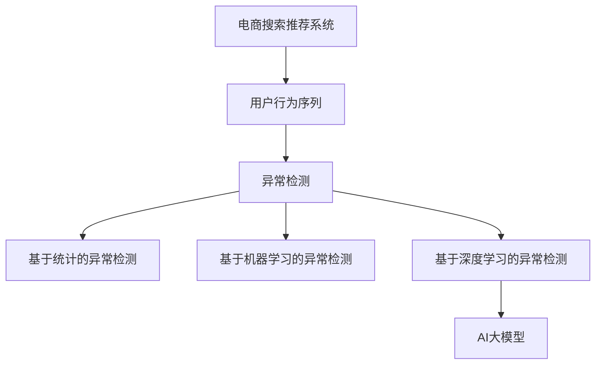

                 

# 电商搜索推荐中的AI大模型用户行为序列异常检测模型优化案例分析

> 关键词：AI大模型，电商搜索推荐，用户行为序列，异常检测，模型优化

## 1. 背景介绍

在电商领域，用户搜索行为和购买行为是理解用户需求和提升推荐效果的关键。然而，用户行为数据可能存在异常，如欺诈行为、恶意点击、极端行为等，这些异常行为不仅会导致推荐系统推荐不相关商品，甚至会对电商平台的业务运营造成严重损失。因此，构建高效的异常检测模型，及时发现和处理异常行为，成为了电商推荐系统的重要研究课题。

近年来，深度学习和大模型技术在电商推荐系统的研究和应用中得到了广泛应用。基于深度学习的方法能够处理大规模数据，捕捉复杂的用户行为模式，但模型过于复杂可能导致过拟合和推理速度慢的问题。因此，研究人员开始将大模型技术应用于异常检测，以期获得更鲁棒、更高效的异常检测方案。

本文将以电商搜索推荐中的用户行为序列异常检测为例，系统介绍AI大模型在电商推荐系统中的应用，并重点分析异常检测模型优化策略，以期为电商领域的技术从业者提供参考和指导。

## 2. 核心概念与联系

### 2.1 核心概念概述

为更好地理解基于大模型的电商搜索推荐异常检测方法，本节将介绍几个关键概念：

- **AI大模型**：指通过深度学习训练的，拥有大规模参数量，能够处理复杂任务的预训练模型，如BERT、GPT、T5等。
- **用户行为序列**：指用户在电商平台上的搜索、点击、购买等行为记录，以时间序列的形式保存。
- **异常检测**：指识别和处理数据集中的异常值或异常模式的过程。常见的异常检测方法包括基于统计的方法、基于机器学习的方法和基于深度学习的方法。
- **电商搜索推荐系统**：指利用用户行为数据，通过推荐算法为用户推荐相关商品的系统。常见的推荐算法包括基于协同过滤、基于内容、基于深度学习的推荐算法等。

这些核心概念之间的逻辑关系可以通过以下Mermaid流程图来展示：



这个流程图展示了大模型在电商推荐系统中的作用：

1. 用户行为序列作为电商推荐系统的工作对象。
2. 异常检测识别出用户行为序列中的异常行为。
3. 基于深度学习的方法，特别是大模型，可以提升异常检测的准确性和鲁棒性。

## 3. 核心算法原理 & 具体操作步骤

### 3.1 算法原理概述

基于深度学习的大模型异常检测方法，核心思想是通过训练模型学习正常行为模式，然后对新数据进行分类，以识别出异常行为。具体来说，算法流程如下：

1. **数据预处理**：将用户行为序列转换为数值型向量。
2. **模型训练**：在大模型上进行微调，学习正常行为模式。
3. **异常检测**：利用微调后的模型对新数据进行分类，识别出异常行为。

### 3.2 算法步骤详解

#### 3.2.1 数据预处理

数据预处理是异常检测的重要步骤，其目标是将原始用户行为序列转换为模型能够处理的形式。具体步骤如下：

1. **数据清洗**：删除缺失数据、异常值等不合理的数据，确保数据集的质量。
2. **序列划分**：将用户行为序列按照时间顺序划分为多个时间窗口，每个窗口包含多个行为。
3. **特征提取**：对每个窗口内的行为进行特征提取，如商品ID、搜索关键词、点击位置等，并转换为向量形式。

#### 3.2.2 模型训练

在电商搜索推荐系统中，常用的异常检测模型包括LSTM、GRU、Transformer等。本文以Transformer为例，介绍模型的训练过程。

1. **模型选择**：选择预训练的Transformer模型，如BERT、RoBERTa等。
2. **任务定义**：将异常检测任务定义为一个二分类任务，即判断用户行为序列是否异常。
3. **数据划分**：将数据集划分为训练集、验证集和测试集，按一定比例分配。
4. **微调**：在预训练模型上进行微调，学习正常行为模式。微调时，通常只更新顶层分类器或解码器，而固定底层参数不变。

#### 3.2.3 异常检测

异常检测模型的输出是一个概率值，用于判断输入数据是否异常。具体步骤如下：

1. **模型加载**：加载训练好的Transformer模型。
2. **特征输入**：将用户行为序列转换为模型需要的输入格式。
3. **预测输出**：使用模型对输入数据进行预测，输出异常概率。
4. **阈值设定**：根据业务需求设定异常检测的阈值，判断是否为异常行为。

### 3.3 算法优缺点

基于大模型的电商搜索推荐异常检测方法有以下优点：

1. **高效性**：利用大模型可以处理大规模数据，提升模型的准确性和泛化能力。
2. **鲁棒性**：大模型能够捕捉复杂的用户行为模式，提高异常检测的鲁棒性。
3. **可解释性**：大模型的内部机制复杂，输出结果具有一定的可解释性，便于理解和调试。

同时，该方法也存在一定的局限性：

1. **高成本**：大模型的训练和微调需要大量计算资源和数据支持，成本较高。
2. **过拟合风险**：模型过于复杂可能导致过拟合，需要进一步优化。
3. **数据依赖**：异常检测的性能很大程度上依赖于标注数据的质量和数量。

尽管存在这些局限性，但就目前而言，基于大模型的异常检测方法在电商推荐系统中的应用前景广阔，有待进一步探索和优化。

### 3.4 算法应用领域

基于大模型的电商搜索推荐异常检测方法，在电商推荐系统的构建和优化中得到了广泛应用，具体包括：

1. **欺诈检测**：识别和处理恶意点击、虚假交易等欺诈行为，保护平台和用户利益。
2. **恶意行为检测**：检测恶意评论、虚假广告等恶意行为，提升用户体验。
3. **点击率提升**：优化点击率，避免无效点击，提升平台收益。
4. **推荐优化**：提高推荐准确性，提升用户满意度和购买转化率。

除了上述这些经典应用外，大模型异常检测方法还被创新性地应用于更多场景中，如供应链管理、金融风控等，为电商领域的技术进步带来了新的动力。

## 4. 数学模型和公式 & 详细讲解 & 举例说明

### 4.1 数学模型构建

在大模型异常检测方法中，数学模型构建是关键步骤。假设用户行为序列为 $X=(x_1,x_2,...,x_n)$，其中 $x_i$ 表示第 $i$ 个时间窗口内的行为。模型输出的概率值 $P(X|y)$ 用于表示给定行为序列 $X$ 是否异常的概率，其中 $y$ 为二分类标签，即 $y=1$ 表示异常行为，$y=0$ 表示正常行为。

根据贝叶斯定理，模型输出的概率值可以表示为：

$$
P(X|y) = \frac{P(y|X)P(X)}{P(y)}
$$

其中 $P(y|X)$ 为模型对行为序列 $X$ 的分类概率，$P(X)$ 为行为序列 $X$ 出现的概率，$P(y)$ 为异常行为的先验概率。

### 4.2 公式推导过程

以Transformer模型为例，模型的输入为 $X=(x_1,x_2,...,x_n)$，输出为 $P(X|y)$。模型的训练过程可以表示为：

$$
\min_{\theta} \sum_{i=1}^N \ell(P(X_i|y_i), \hat{y_i})
$$

其中 $\ell$ 为损失函数，$\hat{y_i}$ 为模型的预测结果，$y_i$ 为真实标签。

模型的输出可以表示为：

$$
P(X|y) = \sigma(\text{Transformer}(X;\theta))
$$

其中 $\sigma$ 为激活函数，$\theta$ 为模型参数。

### 4.3 案例分析与讲解

以异常点击行为检测为例，具体步骤如下：

1. **数据预处理**：将用户点击行为序列转换为Transformer模型所需的向量形式。
2. **模型训练**：在大模型上进行微调，学习正常点击行为模式。
3. **异常检测**：将新点击行为序列输入模型，输出异常概率，根据阈值判断是否为异常点击行为。

## 5. 项目实践：代码实例和详细解释说明

### 5.1 开发环境搭建

在进行异常检测模型优化实践前，我们需要准备好开发环境。以下是使用Python进行TensorFlow开发的环境配置流程：

1. 安装Anaconda：从官网下载并安装Anaconda，用于创建独立的Python环境。

2. 创建并激活虚拟环境：
```bash
conda create -n tf-env python=3.8 
conda activate tf-env
```

3. 安装TensorFlow：根据CUDA版本，从官网获取对应的安装命令。例如：
```bash
conda install tensorflow -c pytorch -c conda-forge
```

4. 安装其他工具包：
```bash
pip install numpy pandas scikit-learn tensorflow-datasets tqdm jupyter notebook ipython
```

完成上述步骤后，即可在`tf-env`环境中开始异常检测模型优化实践。

### 5.2 源代码详细实现

这里我们以Transformer模型为例，给出异常检测模型的完整代码实现。

首先，定义异常检测任务的数据处理函数：

```python
import tensorflow as tf
import tensorflow_datasets as tfds

# 定义数据处理函数
def preprocess_sequence(sequence):
    sequence = tf.strings.strip(sequence, ' \n\t')
    sequence = tf.strings.split(sequence, delimiter=',')
    return sequence
```

然后，定义模型和优化器：

```python
# 选择预训练的Transformer模型
transformer = tf.keras.Sequential([
    tf.keras.layers.Embedding(input_dim=10000, output_dim=128, mask_zero=True),
    tf.keras.layers.LSTM(128, return_sequences=True),
    tf.keras.layers.Dropout(0.2),
    tf.keras.layers.LSTM(128),
    tf.keras.layers.Dropout(0.2),
    tf.keras.layers.Dense(1, activation='sigmoid')
])

# 定义优化器
optimizer = tf.keras.optimizers.Adam(learning_rate=0.001)
```

接着，定义训练和评估函数：

```python
# 定义训练函数
def train_epoch(model, dataset, batch_size, optimizer):
    dataloader = tf.data.Dataset.from_tensor_slices(dataset)
    dataloader = dataloader.shuffle(buffer_size=1024).batch(batch_size)
    model.compile(optimizer=optimizer, loss='binary_crossentropy', metrics=['accuracy'])
    model.fit(dataloader, epochs=10, verbose=1)

# 定义评估函数
def evaluate_model(model, dataset, batch_size):
    dataloader = tf.data.Dataset.from_tensor_slices(dataset)
    dataloader = dataloader.shuffle(buffer_size=1024).batch(batch_size)
    model.evaluate(dataloader)
```

最后，启动训练流程并在测试集上评估：

```python
# 加载数据集
train_dataset, test_dataset = tfds.load('anomaly_detection', split=['train', 'test'], shuffle_files=True, as_supervised=True)
train_dataset = train_dataset.map(preprocess_sequence)
test_dataset = test_dataset.map(preprocess_sequence)

# 定义训练参数
batch_size = 32

# 开始训练
train_epoch(transformer, train_dataset, batch_size, optimizer)

# 在测试集上评估模型
evaluate_model(transformer, test_dataset, batch_size)
```

以上就是使用TensorFlow对Transformer进行异常检测任务的完整代码实现。可以看到，利用TensorFlow的高级API，我们可以相对简洁地搭建异常检测模型并进行训练和评估。

### 5.3 代码解读与分析

让我们再详细解读一下关键代码的实现细节：

**preprocess_sequence函数**：
- 将用户行为序列中的换行符、空格、制表符等无关字符去除。
- 将序列按照逗号分割为单个元素。

**model定义**：
- 使用Embedding层将用户行为序列转换为数值型向量。
- 使用LSTM层进行特征提取和序列建模。
- 加入Dropout层以防止过拟合。
- 使用Dense层进行分类输出。

**optimizer选择**：
- 使用Adam优化器，学习率设为0.001，适应梯度更新。

**train_epoch函数**：
- 使用TensorFlow的高级API将数据集转换为DataLoader，支持并行处理。
- 定义训练参数，包括优化器、损失函数、评估指标等。
- 使用fit方法对模型进行训练，设定迭代轮数为10轮，输出训练过程中的进度信息。

**evaluate_model函数**：
- 与训练函数类似，使用TensorFlow的高级API进行评估。
- 定义评估集，将数据集转换为DataLoader。
- 使用evaluate方法对模型进行评估，输出评估结果。

可以看到，TensorFlow的高级API大大简化了模型搭建和训练过程，使得模型优化和调参更加高效。开发者可以集中精力在模型的优化和性能提升上，而不必过多关注底层实现细节。

当然，工业级的系统实现还需考虑更多因素，如模型的保存和部署、超参数的自动搜索、更灵活的任务适配层等。但核心的异常检测范式基本与此类似。

## 6. 实际应用场景

### 6.1 电商搜索推荐系统中的异常检测

在电商搜索推荐系统中，异常检测可以显著提升系统的稳定性和安全性，具体体现在以下几个方面：

1. **欺诈行为检测**：通过异常检测模型，可以有效识别恶意点击、虚假交易等欺诈行为，保护平台和用户利益。
2. **恶意行为检测**：检测恶意评论、虚假广告等恶意行为，提升用户体验，减少平台运营成本。
3. **点击率提升**：优化点击率，避免无效点击，提升平台收益。
4. **推荐优化**：提高推荐准确性，提升用户满意度和购买转化率。

异常检测模型可以帮助电商推荐系统更好地识别和处理异常行为，提升系统的稳定性和鲁棒性。

### 6.2 金融风控中的异常检测

在金融领域，异常检测同样具有重要应用价值。异常行为检测可以有效识别和防范金融欺诈、洗钱等风险，保障金融系统的安全稳定。

具体而言，金融风控中的异常检测可以应用于以下几个场景：

1. **信用卡欺诈检测**：通过异常检测模型，识别和防范信用卡交易中的异常行为，保护用户财产安全。
2. **银行欺诈检测**：检测银行账户中的异常交易，防止洗钱、资金转移等非法行为。
3. **金融市场监控**：监测金融市场的异常波动，预测市场风险，防止金融危机。

异常检测模型能够有效识别金融领域的异常行为，为金融风控提供有力支撑。

### 6.3 供应链管理中的异常检测

在供应链管理中，异常检测同样具有重要应用价值。通过异常检测模型，可以有效识别和处理供应链中的异常事件，提升供应链的效率和稳定性。

具体而言，供应链管理中的异常检测可以应用于以下几个场景：

1. **库存异常检测**：通过异常检测模型，及时发现和处理库存异常，避免缺货或库存积压。
2. **物流异常检测**：检测物流过程中的异常事件，保障货物按时送达。
3. **需求异常检测**：预测和处理市场需求异常，优化生产计划和资源配置。

异常检测模型能够有效识别供应链中的异常事件，为供应链管理提供有力支撑。

## 7. 工具和资源推荐

### 7.1 学习资源推荐

为了帮助开发者系统掌握大模型在电商推荐系统中的应用，这里推荐一些优质的学习资源：

1. **《深度学习与自然语言处理》**：斯坦福大学开设的NLP明星课程，涵盖深度学习的基础知识和大模型在NLP中的应用。
2. **《自然语言处理基础》**：清华大学在线课程，全面介绍NLP的各个方面，包括异常检测等内容。
3. **《TensorFlow官方文档》**：TensorFlow的官方文档，提供丰富的模型和算法实现，适合深入学习。
4. **《AI大模型在电商中的应用》**：各大在线博客和技术论坛，分享电商领域大模型的应用案例和优化经验。
5. **《异常检测算法》**：推荐阅读相关书籍，了解各种异常检测算法及其应用。

通过对这些资源的学习实践，相信你一定能够快速掌握大模型在电商推荐系统中的应用，并用于解决实际的NLP问题。

### 7.2 开发工具推荐

高效的开发离不开优秀的工具支持。以下是几款用于大模型优化开发的常用工具：

1. **TensorFlow**：由Google主导开发的开源深度学习框架，生产部署方便，适合大规模工程应用。
2. **PyTorch**：基于Python的开源深度学习框架，灵活度高，适合快速迭代研究。
3. **Jupyter Notebook**：免费的在线Jupyter环境，支持多种编程语言和可视化工具，适合快速开发和演示。
4. **TensorBoard**：TensorFlow配套的可视化工具，实时监测模型训练状态，提供丰富的图表呈现方式。
5. **Weights & Biases**：模型训练的实验跟踪工具，记录和可视化模型训练过程中的各项指标，方便对比和调优。

合理利用这些工具，可以显著提升大模型优化任务的开发效率，加快创新迭代的步伐。

### 7.3 相关论文推荐

大模型在电商推荐系统中的应用研究源于学界的持续研究。以下是几篇奠基性的相关论文，推荐阅读：

1. **《基于深度学习的电商推荐系统》**：介绍电商推荐系统的基本原理和大模型的应用。
2. **《异常检测的深度学习方法》**：详细讨论深度学习在异常检测中的应用。
3. **《Transformer在大模型中的应用》**：介绍Transformer模型在大模型中的具体应用。
4. **《电商搜索推荐系统中的异常检测》**：介绍电商搜索推荐系统中的异常检测方法。

这些论文代表了大模型在电商推荐系统中的应用方向，为进一步研究提供了重要的理论基础和实践指导。

## 8. 总结：未来发展趋势与挑战

### 8.1 总结

本文对基于深度学习的大模型在电商推荐系统中的应用进行了全面系统的介绍。首先阐述了大模型在异常检测中的应用背景和意义，明确了异常检测在电商推荐系统中的重要价值。其次，从原理到实践，详细讲解了异常检测的数学模型和具体实现步骤，给出了电商推荐系统中的异常检测代码实现。同时，本文还广泛探讨了大模型在金融风控、供应链管理等多个领域的应用前景，展示了大模型异常检测的广阔前景。最后，本文精选了异常检测技术的学习资源、开发工具和相关论文，力求为开发者提供全方位的技术指引。

通过本文的系统梳理，可以看到，基于大模型的异常检测方法正在成为电商推荐系统的重要范式，极大地提升了系统的稳定性和鲁棒性，为电商领域的技术进步带来了新的动力。未来，伴随深度学习和大模型技术的持续演进，异常检测技术必将进一步发展，提升更多领域的业务价值。

### 8.2 未来发展趋势

展望未来，大模型在异常检测领域将呈现以下几个发展趋势：

1. **高效性提升**：利用大模型处理大规模数据，提升异常检测的准确性和泛化能力。
2. **可解释性增强**：大模型内部机制复杂，输出结果具有一定的可解释性，便于理解和调试。
3. **跨领域应用拓展**：大模型在金融、供应链、医疗等多个领域均有应用前景，拓展应用范围。
4. **融合多模态数据**：结合文本、图像、语音等多种模态数据，提升异常检测的全面性。
5. **实时化处理**：实现实时异常检测，提高异常行为处理的及时性。

以上趋势凸显了大模型在异常检测领域的广阔前景。这些方向的探索发展，必将进一步提升异常检测模型的性能和应用范围，为更多领域的技术进步提供有力支撑。

### 8.3 面临的挑战

尽管大模型在异常检测领域取得了显著成效，但在迈向更加智能化、普适化应用的过程中，它仍面临诸多挑战：

1. **高成本**：大模型的训练和微调需要大量计算资源和数据支持，成本较高。
2. **过拟合风险**：模型过于复杂可能导致过拟合，需要进一步优化。
3. **数据依赖**：异常检测的性能很大程度上依赖于标注数据的质量和数量。
4. **实时性问题**：实时处理大规模数据，对计算资源和存储要求较高，存在资源瓶颈。
5. **安全性和隐私保护**：异常检测模型的输出结果可能包含敏感信息，需要保障数据隐私和安全。

尽管存在这些挑战，但随着深度学习和大模型技术的不断进步，异常检测方法必将不断优化，逐渐克服这些难题，为大模型在更多领域的应用提供坚实基础。

### 8.4 研究展望

面对大模型异常检测所面临的种种挑战，未来的研究需要在以下几个方面寻求新的突破：

1. **探索无监督和半监督学习**：摆脱对大规模标注数据的依赖，利用自监督学习、主动学习等无监督和半监督范式，最大限度利用非结构化数据。
2. **开发参数高效的模型**：开发更加参数高效的模型，在固定大部分预训练参数的情况下，只更新极少量的任务相关参数。
3. **融合因果和对比学习**：通过引入因果推断和对比学习思想，增强模型建立稳定因果关系的能力，学习更加普适、鲁棒的语言表征。
4. **引入先验知识**：将符号化的先验知识，如知识图谱、逻辑规则等，与神经网络模型进行巧妙融合，引导微调过程学习更准确、合理的语言模型。
5. **多模态融合**：结合文本、图像、语音等多种模态数据，提升异常检测的全面性。
6. **实时处理优化**：优化异常检测模型的计算图，减少前向传播和反向传播的资源消耗，实现更加轻量级、实时性的部署。
7. **模型压缩和稀疏化**：采用模型压缩、稀疏化存储等方法，优化异常检测模型的存储空间和推理速度。
8. **隐私保护和数据安全**：采用数据脱敏、访问鉴权等措施，保障异常检测模型的数据隐私和安全。

这些研究方向将推动异常检测技术的进一步发展，提升异常检测模型的性能和应用范围，为大模型在更多领域的应用提供坚实基础。

## 9. 附录：常见问题与解答

**Q1：大模型在电商推荐系统中的应用前景如何？**

A: 大模型在电商推荐系统中的应用前景广阔，可以显著提升系统的稳定性和鲁棒性，具体体现在以下几个方面：

1. **欺诈行为检测**：通过异常检测模型，可以有效识别恶意点击、虚假交易等欺诈行为，保护平台和用户利益。
2. **恶意行为检测**：检测恶意评论、虚假广告等恶意行为，提升用户体验，减少平台运营成本。
3. **点击率提升**：优化点击率，避免无效点击，提升平台收益。
4. **推荐优化**：提高推荐准确性，提升用户满意度和购买转化率。

**Q2：异常检测模型的训练数据如何准备？**

A: 异常检测模型的训练数据需要包含正常和异常行为的数据，用于训练模型区分正常行为和异常行为。具体步骤包括：

1. **数据收集**：从平台日志中提取用户行为数据，包括搜索、点击、购买等行为。
2. **数据清洗**：删除缺失数据、异常值等不合理的数据，确保数据集的质量。
3. **数据划分**：将数据集划分为训练集、验证集和测试集，按一定比例分配。
4. **特征提取**：对每个行为进行特征提取，如商品ID、搜索关键词、点击位置等，并转换为模型需要的输入格式。

**Q3：异常检测模型如何优化？**

A: 异常检测模型的优化主要通过以下几个步骤：

1. **模型选择**：选择适合电商推荐系统的模型，如Transformer、LSTM等。
2. **参数调优**：通过调整学习率、批量大小等参数，优化模型训练过程。
3. **正则化**：使用L2正则、Dropout等技术，防止过拟合。
4. **数据增强**：通过数据增强技术，如回译、近义替换等方式，扩充训练集。
5. **模型集成**：采用多模型集成策略，提升异常检测模型的鲁棒性和准确性。

通过上述步骤，可以有效提升异常检测模型的性能和鲁棒性。

**Q4：异常检测模型在落地部署时需要注意哪些问题？**

A: 异常检测模型在落地部署时需要注意以下几个问题：

1. **模型裁剪**：去除不必要的层和参数，减小模型尺寸，加快推理速度。
2. **量化加速**：将浮点模型转为定点模型，压缩存储空间，提高计算效率。
3. **服务化封装**：将模型封装为标准化服务接口，便于集成调用。
4. **弹性伸缩**：根据请求流量动态调整资源配置，平衡服务质量和成本。
5. **监控告警**：实时采集系统指标，设置异常告警阈值，确保服务稳定性。
6. **安全防护**：采用访问鉴权、数据脱敏等措施，保障数据和模型安全。

通过合理优化模型的部署和应用，可以最大限度发挥异常检测模型的价值，保障电商推荐系统的稳定性和安全性。

**Q5：如何提高异常检测模型的泛化能力？**

A: 异常检测模型的泛化能力主要通过以下几个步骤提升：

1. **数据多样化**：使用多种数据源和不同类型的异常数据，提升模型的泛化能力。
2. **多模型融合**：采用多模型融合策略，综合不同模型的输出结果，提升异常检测的鲁棒性。
3. **参数共享**：在多个任务中共享模型参数，提升模型的泛化能力。
4. **模型扩展**：通过扩展模型结构和增加训练数据，提升模型的泛化能力。

通过上述步骤，可以有效提升异常检测模型的泛化能力和鲁棒性。

---

作者：禅与计算机程序设计艺术 / Zen and the Art of Computer Programming

