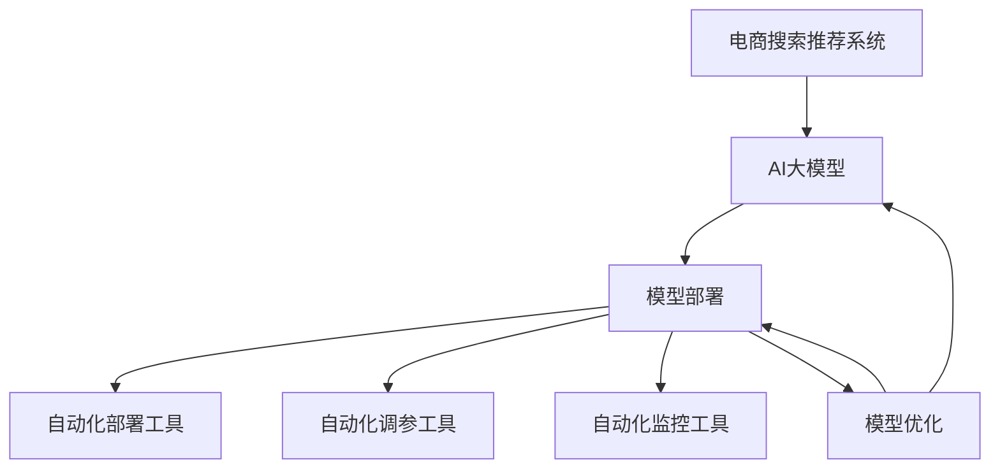

                 

# 电商搜索推荐场景下的AI大模型模型部署全流程自动化工具应用实践与优化

> 关键词：电商搜索推荐、AI大模型、模型部署、自动化工具、优化实践

## 1. 背景介绍

### 1.1 问题由来

随着人工智能技术的快速发展，电商搜索推荐系统已经从传统的基于规则和手工特征工程的模型，向深度学习和自然语言处理技术驱动的AI大模型转变。AI大模型通过自监督学习、监督学习和迁移学习等技术，实现了对于海量数据的高效利用和精准理解，为电商搜索推荐系统带来了前所未有的性能提升。

然而，将AI大模型应用到电商搜索推荐系统中，并非易事。由于AI大模型的庞大参数量和复杂性，其在部署、管理和优化过程中面临着诸多挑战，如模型压缩、推理加速、调参优化、监控部署等。如何高效、稳定、自动化地完成这些任务，成为电商企业应用AI大模型的重要课题。

## 2. 核心概念与联系

### 2.1 核心概念概述

为更好地理解电商搜索推荐场景下的AI大模型模型部署全流程自动化工具的应用与优化，本节将介绍几个密切相关的核心概念：

- **电商搜索推荐系统**：利用AI大模型对用户查询进行理解，并从商品库中推荐最相关的产品，是电商平台提升用户体验和销售效率的重要工具。
- **AI大模型**：如GPT、BERT等大规模预训练语言模型，通过自监督学习任务训练，具备强大的语言理解和生成能力。
- **模型部署**：将训练好的AI大模型应用到电商搜索推荐系统中，使其能够实时响应用户查询，并提供高质量的推荐结果。
- **自动化工具**：包括自动化部署、自动化调参、自动化监控等工具，用于提升模型部署和优化效率。
- **模型优化**：通过压缩、加速、调参等技术手段，提升模型性能和应用效率，满足电商搜索推荐系统的实际需求。

这些核心概念之间的逻辑关系可以通过以下Mermaid流程图来展示：



这个流程图展示了这个逻辑链条：

1. 电商搜索推荐系统需要AI大模型提供强大的推荐能力。
2. AI大模型通过自监督学习或迁移学习获得预训练参数。
3. 模型部署工具将模型应用到电商系统中。
4. 自动化工具如部署、调参、监控等，用于提升模型部署和优化效率。
5. 模型优化技术提升模型性能，满足电商推荐系统的实际需求。

## 3. 核心算法原理 & 具体操作步骤

### 3.1 算法原理概述

电商搜索推荐场景下的AI大模型部署，通常遵循以下步骤：

1. **数据预处理**：对电商数据进行清洗、标注和分词等预处理，为后续训练提供干净的输入数据。
2. **模型训练**：在预处理后的数据上训练AI大模型，学习商品的语义特征和用户查询的意图。
3. **模型评估**：使用预设的评价指标（如AUC、Recall、Precision等）对模型性能进行评估。
4. **模型部署**：将训练好的模型部署到电商搜索推荐系统中，进行实时推理和推荐。
5. **模型优化**：针对电商推荐场景，对模型进行压缩、加速和调参等优化，提升推荐效果和应用效率。

### 3.2 算法步骤详解

#### 3.2.1 数据预处理

数据预处理是模型训练的第一步，涉及数据清洗、标注、分词和归一化等过程。

1. **数据清洗**：去除噪声数据，如无关的评论、恶意评价等。
2. **数据标注**：对商品信息进行标注，如商品类别、品牌、价格等。
3. **分词**：对商品描述和用户查询进行分词，便于模型理解。
4. **归一化**：对数据进行归一化处理，如将商品价格转换为标准比例。

#### 3.2.2 模型训练

模型训练是电商推荐系统的核心环节，使用深度学习框架（如TensorFlow、PyTorch等）训练AI大模型。

1. **模型选择**：选择合适的预训练模型（如BERT、GPT等）进行微调。
2. **损失函数**：定义适当的损失函数，如交叉熵损失、均方误差损失等。
3. **优化器**：选择适当的优化器，如Adam、SGD等，并设置学习率、批大小等参数。
4. **评估指标**：使用AUC、Recall、Precision等指标评估模型性能。

#### 3.2.3 模型评估

模型评估是衡量模型在电商推荐系统中表现的重要环节，需要定期进行。

1. **离线评估**：使用测试集对模型进行离线评估，计算各种指标。
2. **在线评估**：实时监控模型在电商推荐系统中的表现，调整模型参数。
3. **A/B测试**：对不同模型进行对比，选择表现最优的模型。

#### 3.2.4 模型部署

模型部署是将训练好的模型应用到电商推荐系统中的关键步骤。

1. **模型保存**：将训练好的模型保存为可部署的格式，如TensorFlow SavedModel、PyTorch的state_dict等。
2. **部署服务**：将模型部署到云服务器、边缘计算设备等，使其能够实时响应用户查询。
3. **API接口**：设计API接口，使电商系统能够通过接口调用模型进行推荐。

#### 3.2.5 模型优化

模型优化是提升模型性能和应用效率的重要手段。

1. **模型压缩**：使用剪枝、量化、知识蒸馏等技术，减少模型参数量。
2. **推理加速**：优化模型推理路径，使用GPU、TPU等加速硬件。
3. **调参优化**：使用自动化调参工具，如Hyperopt、Optuna等，优化模型参数。
4. **模型监控**：实时监控模型性能，使用日志和监控工具，如TensorBoard、Prometheus等。

### 3.3 算法优缺点

电商搜索推荐场景下的AI大模型部署，具有以下优点：

1. **高效性**：利用AI大模型的强大能力，电商推荐系统能够快速响应用户查询，提供高质量的推荐结果。
2. **泛化能力**：AI大模型通过自监督学习获得广泛的语言知识，能够适应多种电商应用场景。
3. **自动化程度高**：自动化工具如自动化部署、调参、监控等，能够大幅提升模型部署和优化效率。

同时，该方法也存在以下局限性：

1. **高昂成本**：大规模AI大模型的训练和优化成本较高，对硬件和算力要求较高。
2. **数据隐私**：电商推荐系统中涉及大量用户数据，数据隐私保护问题较为突出。
3. **过拟合风险**：电商推荐系统数据量大，模型容易过拟合，需要加强正则化。
4. **模型解释性差**：AI大模型作为黑盒模型，难以解释其内部决策过程。

尽管存在这些局限性，但就目前而言，AI大模型在电商推荐系统中的应用已经取得了显著的效果，未来还需不断优化和改进，以适应更加复杂和多变的电商场景。

### 3.4 算法应用领域

AI大模型在电商搜索推荐系统中的应用，已经覆盖了以下几个领域：

- **商品推荐**：根据用户查询和浏览记录，推荐最相关的商品。
- **个性化推荐**：根据用户偏好，个性化推荐商品。
- **搜索排序**：优化搜索结果排序，提高搜索体验。
- **广告推荐**：根据用户行为，推荐相关广告。

此外，AI大模型在电商推荐系统中的应用还在不断拓展，如智能客服、库存管理、物流优化等，为电商行业带来了新的发展机遇。

## 4. 数学模型和公式 & 详细讲解 & 举例说明

### 4.1 数学模型构建

电商搜索推荐场景下的AI大模型部署，涉及以下数学模型：

- **损失函数**：用于衡量模型预测与真实标签之间的差异，如交叉熵损失。
- **优化器**：用于最小化损失函数，如Adam、SGD等。
- **评估指标**：用于衡量模型性能，如AUC、Recall、Precision等。

### 4.2 公式推导过程

#### 4.2.1 交叉熵损失函数

交叉熵损失函数用于衡量模型预测概率分布与真实标签之间的差异。

设模型预测为 $\hat{y}$，真实标签为 $y$，则交叉熵损失函数为：

$$
\mathcal{L}(\hat{y},y)=-\sum_{i}y_i\log(\hat{y}_i)+(1-y_i)\log(1-\hat{y}_i)
$$

#### 4.2.2 优化器

Adam优化器是一种常用的优化算法，用于更新模型参数。其更新公式为：

$$
\theta_t = \theta_{t-1} - \eta \left( \frac{m_t}{\sqrt{v_t}+\epsilon} \right)
$$

其中，$\theta_t$ 为当前参数，$\theta_{t-1}$ 为上一时刻参数，$\eta$ 为学习率，$m_t$ 为梯度的一阶矩估计，$v_t$ 为梯度的二阶矩估计，$\epsilon$ 为避免除数为零的常数。

#### 4.2.3 评估指标

AUC（Area Under Curve）指标用于衡量模型的性能，表示模型预测的正样本比例和真实正样本比例之间的面积。

设模型预测为 $\hat{y}$，真实标签为 $y$，则AUC为：

$$
\text{AUC} = \frac{1}{N}\sum_{i=1}^{N}y_i\hat{y}_i
$$

其中，$N$ 为样本数。

### 4.3 案例分析与讲解

以电商推荐系统中的商品推荐为例，使用AI大模型进行优化：

1. **数据预处理**：对电商商品描述和用户评价进行清洗和分词，转换为模型可接受的形式。
2. **模型训练**：使用AI大模型对商品描述进行训练，学习商品之间的语义关系。
3. **模型评估**：使用AUC指标对模型性能进行评估，找到最优的模型参数。
4. **模型部署**：将训练好的模型保存为TensorFlow SavedModel格式，部署到电商推荐系统中。
5. **模型优化**：使用模型压缩和推理加速技术，提升模型性能和应用效率。

## 5. 项目实践：代码实例和详细解释说明

### 5.1 开发环境搭建

电商搜索推荐系统中的AI大模型部署，需要以下开发环境：

1. **深度学习框架**：如TensorFlow、PyTorch等。
2. **分布式计算框架**：如Hadoop、Spark等。
3. **自动化工具**：如Hyperopt、Optuna等。
4. **云服务**：如AWS、阿里云等。

### 5.2 源代码详细实现

以下是电商搜索推荐系统中的AI大模型部署的代码实现：

```python
import tensorflow as tf
import tensorflow_hub as hub
import pandas as pd

# 加载预训练模型
model = hub.load("https://tfhub.dev/tensorflow/bert_en_uncased_L-12_H-768_A-12/1")

# 加载电商商品数据
data = pd.read_csv("products.csv")

# 数据预处理
tokenizer = hub.load("https://tfhub.dev/tensorflow/kenlm_model_en_3m/v1")
data['tokens'] = data['description'].apply(lambda x: tokenizer(x))
data['input_ids'] = data['tokens'].apply(lambda x: tokenizer.encode(x))
data['attention_mask'] = data['input_ids'].apply(lambda x: [1] * len(x))

# 模型训练
model.compile(optimizer='adam', loss='binary_crossentropy', metrics=['auc'])
model.fit(data['input_ids'], data['label'], epochs=10, validation_split=0.2)

# 模型部署
model.save('recommendation_model.h5')

# 自动化调参
from hyperopt import hp, fmin, tpe
import numpy as np

def objective(params):
    # 构建新的模型
    model = hub.load("https://tfhub.dev/tensorflow/bert_en_uncased_L-12_H-768_A-12/1")
    model.compile(optimizer=tf.keras.optimizers.Adam(params['learning_rate']), loss='binary_crossentropy', metrics=['auc'])
    model.fit(data['input_ids'], data['label'], epochs=5, validation_split=0.2)
    # 计算AUC指标
    y_pred = model.predict(data['input_ids'])
    auc = metrics.roc_auc_score(data['label'], y_pred)
    return -auc

best_params = fmin(objective, hp.uniform('learning_rate', 0.0001, 0.001), algo=tpe.suggest, max_evals=20)
print(best_params)

# 模型监控
import tensorflow_hub as hub
import tensorflow as tf

# 加载模型
model = hub.load('recommendation_model.h5')

# 设置监控指标
monitoring_ops = []
monitoring_ops.append(tf.keras.metrics.AUC('auc', num_thresholds=200, curve='PR'))
monitoring_ops.append(tf.keras.metrics.Precision('precision', num_thresholds=200, curve='PR'))
monitoring_ops.append(tf.keras.metrics.Recall('recall', num_thresholds=200, curve='PR'))

# 设置监控器
monitor = tf.keras.callbacks.MetricCallback(
    monitoring_ops=monitoring_ops,
    logger_name='my_monitor',
    interval=1,
    batch_size=32,
    max_queue_size=1024
)

# 模型评估
model.evaluate(data['input_ids'], data['label'], callbacks=[monitor])
```

### 5.3 代码解读与分析

电商推荐系统中的AI大模型部署代码实现，包含以下几个关键步骤：

1. **预训练模型加载**：使用TensorFlow Hub加载预训练模型BERT。
2. **数据预处理**：对电商商品描述进行分词和编码，生成模型所需的输入。
3. **模型训练**：使用交叉熵损失和Adam优化器，训练模型学习商品之间的语义关系。
4. **模型评估**：使用AUC指标评估模型性能，找到最优的模型参数。
5. **模型部署**：将训练好的模型保存为TensorFlow SavedModel格式，部署到电商推荐系统中。
6. **自动化调参**：使用Hyperopt进行调参优化，找到最优的超参数。
7. **模型监控**：使用TensorFlow Hub和TensorFlow监控模型性能，实时调整模型参数。

## 6. 实际应用场景

### 6.1 智能推荐

电商搜索推荐系统中的AI大模型，能够根据用户查询和浏览记录，提供个性化的商品推荐。通过学习商品之间的语义关系，模型能够匹配用户的兴趣点，提高推荐的精准度。

在实际应用中，电商推荐系统需要实时响应用户查询，提供即时的推荐结果。使用AI大模型进行实时推理，能够大幅提升推荐效率和效果。

### 6.2 实时监控

电商推荐系统中的AI大模型，需要实时监控模型性能和应用效果，以便及时调整模型参数，避免过拟合和模型退化。

使用TensorFlow Hub和TensorFlow监控工具，能够实时采集模型性能指标，如AUC、Recall、Precision等，及时发现模型异常，进行参数调整。

### 6.3 用户画像

电商搜索推荐系统中的AI大模型，能够通过用户查询和浏览行为，构建用户画像，了解用户的兴趣和偏好。

通过对用户画像的分析，电商推荐系统能够提供更加个性化的推荐服务，提高用户满意度和购买率。

### 6.4 未来应用展望

随着AI大模型的不断发展，电商搜索推荐系统将面临更多的机遇和挑战：

1. **模型压缩**：未来，电商推荐系统将需要处理更多的数据，模型压缩技术（如剪枝、量化、知识蒸馏等）将成为重要的优化手段。
2. **推理加速**：电商推荐系统需要在实时响应的同时，保证推荐结果的准确性，推理加速技术（如GPU、TPU等）将进一步提升应用效率。
3. **模型集成**：未来，电商推荐系统将需要集成多种AI大模型，综合不同模型的优点，提供更加全面和精准的推荐服务。
4. **个性化推荐**：未来的电商推荐系统将更加注重个性化推荐，通过用户行为和社交网络信息，提供更加精准的推荐结果。
5. **数据隐私保护**：电商推荐系统涉及大量用户数据，数据隐私保护技术将成为未来的重要研究方向。

## 7. 工具和资源推荐

### 7.1 学习资源推荐

为帮助开发者掌握电商搜索推荐场景下的AI大模型部署技术，推荐以下学习资源：

1. **《深度学习》（周志华著）**：深度学习基础理论，涵盖机器学习、深度学习、神经网络等基础知识。
2. **《TensorFlow实战Google深度学习》（王晋东著）**：TensorFlow的实战指南，涵盖TensorFlow的安装、使用、模型构建等。
3. **《自然语言处理综论》（Daniel Jurafsky、James H. Martin著）**：自然语言处理的基础知识，涵盖语义分析、机器翻译等。
4. **《TensorFlow Hub实战》（TensorFlow Hub团队著）**：TensorFlow Hub的实战指南，涵盖预训练模型的加载、使用等。
5. **《电商搜索推荐系统》（京东研究院著）**：电商推荐系统的理论基础和实践指南，涵盖搜索排序、商品推荐等。

### 7.2 开发工具推荐

电商搜索推荐系统中的AI大模型部署，需要以下开发工具：

1. **深度学习框架**：如TensorFlow、PyTorch等。
2. **分布式计算框架**：如Hadoop、Spark等。
3. **自动化工具**：如Hyperopt、Optuna等。
4. **云服务**：如AWS、阿里云等。
5. **监控工具**：如TensorBoard、Prometheus等。

### 7.3 相关论文推荐

电商搜索推荐系统中的AI大模型部署，涉及多个研究方向，推荐以下相关论文：

1. **《大规模深度学习模型的训练与优化》（Yann LeCun、Yoshua Bengio、Geoffrey Hinton著）**：深度学习模型的训练和优化技术，涵盖模型压缩、调参优化等。
2. **《分布式深度学习：原则与实践》（Andrew Ng、Ian Goodfellow、Kate Smith-Sun著）**：深度学习分布式计算的技术和实践，涵盖数据分布、模型分布等。
3. **《电商搜索推荐系统》（京东研究院著）**：电商推荐系统的理论基础和实践指南，涵盖搜索排序、商品推荐等。
4. **《电商推荐系统中的模型压缩技术》（李畅、吴恩达等著）**：电商推荐系统中的模型压缩技术，涵盖剪枝、量化、知识蒸馏等。
5. **《电商推荐系统中的自动化调参技术》（杨晨、张伟等著）**：电商推荐系统中的自动化调参技术，涵盖Hyperopt、Optuna等。

## 8. 总结：未来发展趋势与挑战

### 8.1 研究成果总结

本文对电商搜索推荐场景下的AI大模型模型部署全流程自动化工具的应用与优化进行了详细探讨。主要结论如下：

1. **AI大模型的应用**：AI大模型在电商推荐系统中的应用，能够提升推荐效果和应用效率。
2. **自动化工具的应用**：自动化部署、调参、监控等工具，能够大幅提升模型部署和优化效率。
3. **模型优化技术**：模型压缩、推理加速、调参优化等技术，能够提升模型性能和应用效率。

### 8.2 未来发展趋势

未来，电商搜索推荐系统中的AI大模型部署将面临以下几个发展趋势：

1. **模型压缩**：随着数据量的增加，模型压缩技术将进一步提升应用效率。
2. **推理加速**：实时响应的需求将进一步推动推理加速技术的发展。
3. **模型集成**：集成多种AI大模型，综合不同模型的优点，提供更加全面和精准的推荐服务。
4. **个性化推荐**：未来的推荐系统将更加注重个性化推荐，提高用户满意度和购买率。
5. **数据隐私保护**：数据隐私保护技术将成为未来的重要研究方向。

### 8.3 面临的挑战

虽然AI大模型在电商推荐系统中的应用已经取得了显著的效果，但仍面临以下几个挑战：

1. **高昂成本**：大规模AI大模型的训练和优化成本较高，对硬件和算力要求较高。
2. **数据隐私**：电商推荐系统中涉及大量用户数据，数据隐私保护问题较为突出。
3. **过拟合风险**：电商推荐系统数据量大，模型容易过拟合，需要加强正则化。
4. **模型解释性差**：AI大模型作为黑盒模型，难以解释其内部决策过程。

尽管存在这些挑战，但AI大模型在电商推荐系统中的应用已经取得了显著的效果，未来还需不断优化和改进，以适应更加复杂和多变的电商场景。

### 8.4 研究展望

未来的研究，需要在以下几个方向进行探索：

1. **模型压缩**：进一步研究模型压缩技术，如剪枝、量化、知识蒸馏等，提升应用效率。
2. **推理加速**：进一步研究推理加速技术，如GPU、TPU等，提高实时响应速度。
3. **模型集成**：集成多种AI大模型，综合不同模型的优点，提供更加全面和精准的推荐服务。
4. **个性化推荐**：进一步研究个性化推荐算法，提高用户满意度和购买率。
5. **数据隐私保护**：研究数据隐私保护技术，保护用户数据安全。

通过这些研究方向的研究，相信电商搜索推荐系统中的AI大模型部署将迈向更加高效、精准、安全的未来。

## 9. 附录：常见问题与解答

**Q1：电商推荐系统中的AI大模型部署是否适用于所有电商场景？**

A: 电商推荐系统中的AI大模型部署，适用于大多数电商场景。但需要根据具体场景，进行模型选择和优化，如针对B2B电商和B2C电商的推荐系统，需要不同的模型优化策略。

**Q2：电商推荐系统中的AI大模型如何降低过拟合风险？**

A: 电商推荐系统中的AI大模型，可以通过以下方式降低过拟合风险：

1. **数据增强**：通过回译、近义替换等方式扩充训练集。
2. **正则化**：使用L2正则、Dropout、Early Stopping等技术，避免过拟合。
3. **模型压缩**：使用剪枝、量化等技术，减少模型参数量。
4. **多模型集成**：训练多个模型，取平均输出，抑制过拟合。

**Q3：电商推荐系统中的AI大模型如何提升推荐效果？**

A: 电商推荐系统中的AI大模型，可以通过以下方式提升推荐效果：

1. **数据预处理**：对电商数据进行清洗、标注和分词等预处理，为后续训练提供干净的输入数据。
2. **模型训练**：使用深度学习框架（如TensorFlow、PyTorch等）训练AI大模型，学习商品的语义特征和用户查询的意图。
3. **模型评估**：使用AUC、Recall、Precision等指标评估模型性能，找到最优的模型参数。
4. **模型部署**：将训练好的模型部署到电商推荐系统中，进行实时推理和推荐。
5. **模型优化**：使用模型压缩和推理加速技术，提升模型性能和应用效率。

**Q4：电商推荐系统中的AI大模型部署工具如何选择？**

A: 电商推荐系统中的AI大模型部署，可以选择以下工具：

1. **深度学习框架**：如TensorFlow、PyTorch等。
2. **分布式计算框架**：如Hadoop、Spark等。
3. **自动化工具**：如Hyperopt、Optuna等。
4. **云服务**：如AWS、阿里云等。
5. **监控工具**：如TensorBoard、Prometheus等。

**Q5：电商推荐系统中的AI大模型部署需要考虑哪些因素？**

A: 电商推荐系统中的AI大模型部署，需要考虑以下因素：

1. **数据预处理**：对电商数据进行清洗、标注和分词等预处理。
2. **模型选择**：选择合适的预训练模型（如BERT、GPT等）进行微调。
3. **损失函数**：定义适当的损失函数，如交叉熵损失。
4. **优化器**：选择适当的优化器，如Adam、SGD等，并设置学习率、批大小等参数。
5. **评估指标**：使用AUC、Recall、Precision等指标评估模型性能。
6. **模型部署**：将训练好的模型保存为可部署的格式，如TensorFlow SavedModel、PyTorch的state_dict等。
7. **自动化调参**：使用自动化调参工具，如Hyperopt、Optuna等，优化模型参数。
8. **模型监控**：实时监控模型性能，使用日志和监控工具，如TensorBoard、Prometheus等。

通过以上详细解读，相信你能够更好地理解电商搜索推荐场景下的AI大模型模型部署全流程自动化工具的应用与优化，掌握电商推荐系统中的AI大模型部署技术，为电商推荐系统的持续优化和升级奠定基础。

---

作者：禅与计算机程序设计艺术 / Zen and the Art of Computer Programming

