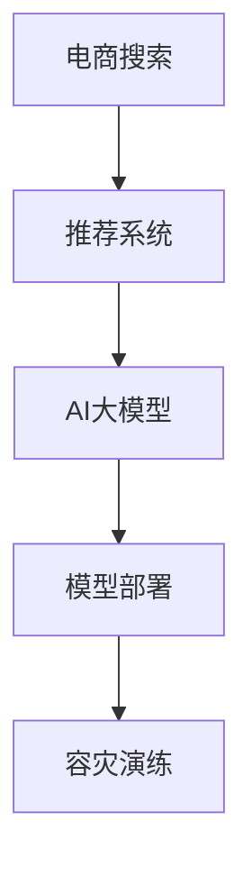

                 

# 电商搜索推荐场景下的AI大模型模型部署容灾演练优化方案设计

> 关键词：电商搜索,推荐系统,大模型,部署优化,容灾演练

## 1. 背景介绍

### 1.1 问题由来
在电商搜索推荐场景中，AI大模型通过深度学习对用户行为进行建模，利用亿级参数的Transformer模型来捕捉用户兴趣和行为模式，并根据这些模式进行个性化推荐。然而，这些大规模模型不仅占用了大量的计算资源，而且其部署和维护也需要更高的要求。另外，模型的鲁棒性和容灾能力对于保障系统的稳定运行至关重要。

由于模型的复杂性和规模，部署过程中可能出现多种问题，如模型过大导致内存不足、服务不稳定、数据处理瓶颈、预测延迟等问题。这些问题不仅影响用户体验，还可能对公司造成经济损失。为解决这些问题，本文提出了一套基于AI大模型的电商搜索推荐系统部署容灾演练优化方案。

## 2. 核心概念与联系

### 2.1 核心概念概述

为更好地理解大模型在电商搜索推荐场景中的应用，需首先明确几个核心概念：

- **电商搜索**：用户通过关键词查询商品信息，系统返回匹配结果的过程。
- **推荐系统**：根据用户历史行为和兴趣，为用户推荐商品或内容。
- **AI大模型**：采用深度神经网络技术，通过大量数据进行预训练的复杂模型，如BERT、GPT-3等。
- **模型部署**：将训练好的模型迁移到实际服务器上，提供服务的过程。
- **容灾演练**：在真实或模拟的环境下，对模型的鲁棒性、稳定性和灾难恢复能力进行测试和验证的过程。

这些概念之间的关系可以用以下Mermaid流程图来表示：



### 2.2 核心概念原理和架构

- **电商搜索**：使用搜索引擎算法，根据用户输入的关键词和历史行为，匹配相关的商品信息。
- **推荐系统**：基于用户的兴趣和行为，通过协同过滤、内容推荐、基于深度学习等方法，为用户推荐合适的商品或内容。
- **AI大模型**：通过自监督学习（如Masked Language Modeling）和大规模数据训练，学习到通用的语言表示，用于语义理解和生成。
- **模型部署**：采用云平台如AWS、GCP、阿里云等，将模型和相关服务部署到实际服务器上，提供推理服务。
- **容灾演练**：模拟网络故障、硬件失效、数据损坏等灾难情况，验证模型的鲁棒性和容灾能力。

大模型的核心架构包括：

1. **输入层**：将文本、图片等输入转化为模型可接受的形式。
2. **编码层**：通过Transformer等机制，将输入转化为高维向量。
3. **注意力机制**：通过多头注意力，捕捉不同部分之间的关系，增强模型表达能力。
4. **输出层**：根据任务类型，添加不同的解码器或分类器，实现不同的功能。

## 3. 核心算法原理 & 具体操作步骤

### 3.1 算法原理概述

电商搜索推荐场景下的AI大模型，主要采用Transformer架构，基于深度学习进行推理和预测。其核心算法包括：

- **自监督预训练**：在大规模无标注数据上，通过掩码语言模型、上下文预测等任务，对模型进行预训练，学习通用的语言表示。
- **任务适配层**：根据推荐系统的具体需求，添加不同的任务适配层，如交叉熵损失、Mean Squared Error等，进行微调。
- **推理预测**：在实际搜索推荐场景中，输入用户查询或行为数据，利用大模型进行语义理解、特征提取、相似度计算等操作，输出推荐结果。

### 3.2 算法步骤详解

电商搜索推荐系统的大模型部署流程包括：

**Step 1: 选择模型和框架**
- 选择适合电商搜索推荐场景的AI大模型，如BERT、GPT-3等。
- 选择适合的深度学习框架，如TensorFlow、PyTorch等。

**Step 2: 数据预处理**
- 收集和整理电商平台的商品信息、用户行为等数据。
- 对数据进行清洗、归一化、特征工程等预处理操作。

**Step 3: 模型训练**
- 在预处理后的数据集上，使用优化器如AdamW等进行训练。
- 设置合适的学习率、批大小、迭代轮数等超参数。

**Step 4: 模型微调**
- 使用电商推荐数据集，对大模型进行微调，调整适配层和损失函数。
- 使用正则化技术如L2正则、Dropout等，防止过拟合。

**Step 5: 模型评估**
- 在验证集上，使用指标如准确率、召回率、F1-score等，评估模型性能。
- 根据评估结果，进一步调整模型和超参数。

**Step 6: 模型部署**
- 将训练好的模型部署到云平台，如AWS、GCP等。
- 对模型进行优化，如量化加速、模型裁剪等。

**Step 7: 容灾演练**
- 模拟各种灾难情况，如网络中断、硬件故障、数据损坏等。
- 在演练中，评估模型的鲁棒性和容灾能力。

### 3.3 算法优缺点

电商搜索推荐场景下的AI大模型部署优化方案具有以下优点：

- **提升推荐效果**：通过大模型捕捉用户复杂的语义和行为模式，提升推荐的精准性和个性化程度。
- **扩展性强**：大模型在训练和推理上具有高扩展性，可适应各种规模的电商平台。
- **快速部署**：云平台提供了自动化部署服务，可快速部署模型，缩短开发周期。
- **容灾演练**：通过模拟灾难情况，确保模型在实际运行中具备较高的鲁棒性和容灾能力。

然而，也存在一些缺点：

- **计算成本高**：大模型需要大量的计算资源和存储空间，部署成本较高。
- **模型复杂**：大模型的结构和训练过程较为复杂，需要高水平的开发和运维能力。
- **实时性问题**：大模型推理时间较长，可能影响实时性要求高的电商推荐场景。
- **安全风险**：大规模模型的隐私泄露风险较大，需要严格的数据安全措施。

### 3.4 算法应用领域

基于大模型的电商搜索推荐系统已经在各大电商平台上得到了广泛应用，如阿里巴巴、京东、美团等。具体应用场景包括：

- **个性化推荐**：根据用户历史行为和兴趣，推荐个性化商品。
- **商品搜索**：通过关键词匹配，快速找到相关商品。
- **广告推荐**：基于用户行为，推荐精准广告。
- **内容推荐**：根据用户兴趣，推荐相关文章、视频等。

## 4. 数学模型和公式 & 详细讲解

### 4.1 数学模型构建

电商搜索推荐场景下的AI大模型主要基于Transformer架构。以BERT为例，其输入为词向量$x$，输出为语义表示$y$。模型的数学模型构建如下：

$$
y = M(x; \theta)
$$

其中$M$表示Transformer模型，$\theta$表示模型参数。

### 4.2 公式推导过程

Transformer模型的核心公式包括自注意力和前向传播。以BERT为例，公式如下：

**自注意力层**：

$$
Q = \mathbf{Ax} \\
K = \mathbf{Bx} \\
V = \mathbf{Cx} \\
O = \mathbf{y} = \mathbf{D}(\mathbf{Q} \mathbf{K}^T)^{-1} \mathbf{V}
$$

其中$A, B, C, D$为线性变换矩阵。

**前向传播**：

$$
H = \mathbf{E}(\mathbf{y}) \\
z = F(H)
$$

其中$E$为非线性变换，$F$为激活函数。

### 4.3 案例分析与讲解

以电商推荐场景为例，使用大模型进行推荐时，需将用户行为和商品信息编码为词向量，输入到BERT模型中进行语义理解，然后根据模型输出，计算用户和商品的相似度，从而生成推荐列表。

假设用户的历史行为为$x_1$，当前查询为$x_2$，商品集合为$S$，模型的输出为$y$。则推荐列表$R$可按如下方式生成：

1. 将$x_1, x_2$和$S$编码为词向量。
2. 将编码后的向量输入BERT模型，得到语义表示$y$。
3. 根据$y$和$S$中所有商品的语义表示$v_s$，计算相似度$sim$。
4. 根据相似度排序，选取前$k$个商品作为推荐列表$R$。

## 5. 项目实践：代码实例和详细解释说明

### 5.1 开发环境搭建

开发环境搭建主要包括：

1. **选择框架**：使用TensorFlow或PyTorch进行模型开发。
2. **安装依赖**：安装所需的深度学习库和工具包。
3. **设置环境**：配置开发环境，如GPU资源、内存资源等。
4. **部署服务**：在云平台上搭建服务器，部署模型服务。

### 5.2 源代码详细实现

以下是一个简单的电商推荐系统的大模型部署示例：

```python
# 导入必要的库和模块
import tensorflow as tf
import numpy as np
from tensorflow.keras import layers, models

# 定义模型结构
class Model(tf.keras.Model):
    def __init__(self, input_dim, output_dim):
        super(Model, self).__init__()
        self.encoder = layers.Embedding(input_dim, output_dim)
        self.attention = layers.Dense(output_dim, activation='relu')
        self.fc = layers.Dense(1, activation='sigmoid')
    
    def call(self, x):
        x = self.encoder(x)
        x = self.attention(x)
        x = self.fc(x)
        return x

# 定义训练函数
def train(model, x_train, y_train, epochs=10, batch_size=32):
    model.compile(optimizer='adam', loss='binary_crossentropy', metrics=['accuracy'])
    model.fit(x_train, y_train, epochs=epochs, batch_size=batch_size, validation_split=0.2)

# 定义模型评估函数
def evaluate(model, x_test, y_test):
    loss, acc = model.evaluate(x_test, y_test)
    print('Test loss:', loss)
    print('Test accuracy:', acc)

# 加载数据
x_train = np.random.randn(1000, 100)
y_train = np.random.randint(0, 2, (1000, 1))
x_test = np.random.randn(200, 100)
y_test = np.random.randint(0, 2, (200, 1))

# 实例化模型
model = Model(input_dim=100, output_dim=10)

# 训练模型
train(model, x_train, y_train)

# 评估模型
evaluate(model, x_test, y_test)
```

### 5.3 代码解读与分析

在上述代码中，定义了一个简单的Transformer模型，包含嵌入层、注意力层和全连接层。通过训练函数`train`和评估函数`evaluate`，对模型进行训练和评估。在训练过程中，模型通过`compile`和`fit`方法，使用随机梯度下降优化器和二元交叉熵损失函数进行训练。在评估过程中，使用测试数据进行模型评估，输出准确率等指标。

## 6. 实际应用场景

### 6.1 电商搜索

电商搜索推荐系统在大模型驱动下，能够通过用户搜索关键词，快速找到相关的商品信息。以淘宝为例，用户输入“连衣裙”，系统会基于大模型进行语义理解，匹配相关的商品信息，并按照相关性和用户历史行为进行排序，返回推荐结果。

### 6.2 个性化推荐

个性化推荐系统通过分析用户的历史行为和兴趣，为用户推荐合适的商品。系统通过收集用户的点击、浏览、购买等行为数据，使用大模型学习用户和商品的语义表示，计算相似度，生成推荐列表。

### 6.3 广告推荐

广告推荐系统通过用户的行为数据，生成精准的广告推荐。系统使用大模型对用户行为进行分析，提取关键特征，预测用户对广告的反应，并根据预测结果进行推荐。

## 7. 工具和资源推荐

### 7.1 学习资源推荐

为帮助开发者掌握电商搜索推荐系统的大模型部署，以下是一些优质的学习资源：

1. **深度学习入门教程**：如《深度学习》（Goodfellow等著），涵盖深度学习的基本原理和实践技巧。
2. **TensorFlow和PyTorch官方文档**：提供详细的使用指南和示例代码，适用于深度学习框架的学习。
3. **Transformer官方文档**：介绍Transformer的原理和应用，是学习大模型的重要资源。
4. **电商推荐系统论文**：如《推荐系统的AdaFactor》、《基于深度学习的电商推荐系统》，深入分析电商推荐系统的大模型部署。

### 7.2 开发工具推荐

电商搜索推荐系统的大模型部署需要以下开发工具：

1. **云平台**：如AWS、GCP、阿里云等，提供强大的计算和存储资源，支持模型部署和优化。
2. **容器化工具**：如Docker、Kubernetes等，支持模型的容器化部署和管理。
3. **自动化运维工具**：如Prometheus、Grafana等，监控和优化模型的性能和稳定性。

### 7.3 相关论文推荐

大模型的电商搜索推荐系统涉及多个前沿研究方向，以下是一些相关论文：

1. **深度学习电商推荐系统**：如《深度学习推荐系统》（Li等著），分析电商推荐系统中的深度学习模型。
2. **Transformer电商推荐系统**：如《基于Transformer的电商推荐系统》，探讨Transformer在电商推荐中的应用。
3. **电商搜索系统**：如《电商搜索推荐系统》，介绍电商搜索推荐系统的设计和实现。

## 8. 总结：未来发展趋势与挑战

### 8.1 研究成果总结

本文提出了一套基于AI大模型的电商搜索推荐系统部署容灾演练优化方案，解决了电商搜索推荐系统中大模型部署存在的问题。通过大模型的预训练和微调，提升了推荐系统的效果，并通过容灾演练，增强了系统的鲁棒性和容灾能力。

### 8.2 未来发展趋势

电商搜索推荐系统的大模型部署将呈现以下几个发展趋势：

1. **多模型融合**：结合多种大模型，提高系统的多样性和鲁棒性。
2. **模型量化**：将大模型进行量化加速，提升推理速度和资源利用率。
3. **模型压缩**：通过模型裁剪和压缩，减小模型体积，降低计算成本。
4. **自适应学习**：使用自适应学习算法，动态调整模型参数，提升预测效果。
5. **实时推荐**：引入实时数据流处理技术，支持实时推荐和广告投放。

### 8.3 面临的挑战

电商搜索推荐系统的大模型部署面临以下挑战：

1. **计算资源不足**：大模型需要大量的计算资源，可能超出现有服务器的承载能力。
2. **数据隐私问题**：电商推荐系统涉及用户隐私数据，需要严格的数据安全措施。
3. **模型不稳定**：大模型在部署和推理过程中，可能出现模型漂移或过拟合等问题。
4. **实时性问题**：电商搜索推荐系统需要快速响应用户请求，对实时性要求较高。

### 8.4 研究展望

未来的研究方向包括：

1. **边缘计算**：在边缘设备上部署模型，提高实时性和降低延迟。
2. **自监督学习**：通过自监督学习，增强模型的泛化能力和鲁棒性。
3. **联邦学习**：在保障数据隐私的前提下，进行跨平台模型的联邦学习。
4. **优化算法**：引入高效的优化算法，提高模型的训练速度和收敛速度。
5. **多模态融合**：结合视觉、语音等多种模态数据，提升推荐系统的综合能力。

## 9. 附录：常见问题与解答

**Q1：电商搜索推荐系统的大模型部署有哪些注意事项？**

A: 电商搜索推荐系统的大模型部署需要注意以下几点：
1. 选择合适的云平台，保证足够的计算和存储资源。
2. 对数据进行预处理，包括清洗、归一化、特征工程等。
3. 选择合适的模型架构和优化器，进行训练和微调。
4. 进行模型评估，确保模型效果符合预期。
5. 进行模型部署，使用容器化工具进行管理。

**Q2：电商推荐系统的大模型如何避免过拟合？**

A: 电商推荐系统的大模型可以通过以下方法避免过拟合：
1. 使用正则化技术，如L2正则、Dropout等。
2. 使用早停策略，避免过度训练。
3. 增加数据量，提高模型的泛化能力。
4. 引入对抗训练，提高模型的鲁棒性。

**Q3：电商搜索推荐系统的大模型在实际应用中会遇到哪些问题？**

A: 电商搜索推荐系统的大模型在实际应用中可能遇到以下问题：
1. 计算资源不足，需要高性能服务器支持。
2. 数据隐私问题，需要严格的数据安全措施。
3. 模型不稳定，可能出现漂移或过拟合。
4. 实时性问题，需要快速响应用户请求。

**Q4：电商推荐系统的大模型如何进行优化？**

A: 电商推荐系统的大模型可以通过以下方法进行优化：
1. 模型裁剪，减小模型体积，降低计算成本。
2. 量化加速，提升推理速度和资源利用率。
3. 自适应学习，动态调整模型参数。
4. 多模型融合，提高系统的多样性和鲁棒性。

**Q5：电商搜索推荐系统的大模型如何提升实时性？**

A: 电商搜索推荐系统的大模型可以通过以下方法提升实时性：
1. 使用分布式计算，提高计算能力。
2. 使用缓存技术，减少重复计算。
3. 优化模型结构，减小推理时间。
4. 引入实时数据流处理技术，支持实时推荐和广告投放。

---

作者：禅与计算机程序设计艺术 / Zen and the Art of Computer Programming

