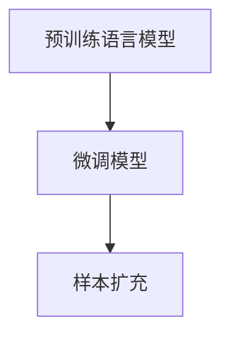
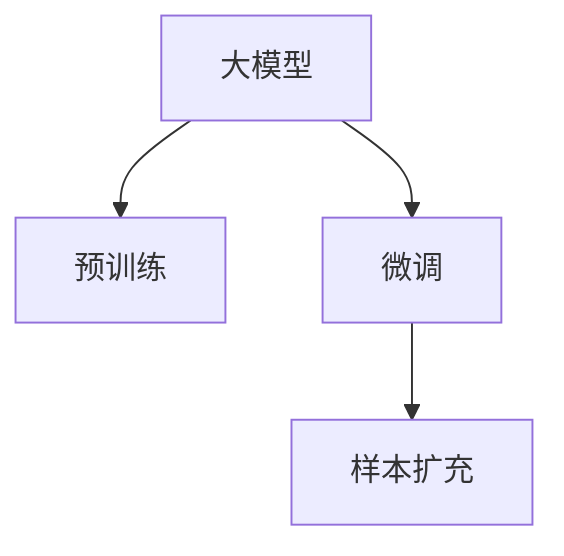

                 

# 电商搜索推荐效果优化中的AI大模型样本扩充技术应用项目管理实践

> 关键词：电商搜索、推荐系统、大模型、样本扩充、技术应用、项目管理

## 1. 背景介绍

### 1.1 问题由来

在电商领域，搜索推荐系统的核心目标是提升用户体验和购物转化率。通过搜索推荐算法，电商平台能够更精准地展示商品信息，帮助用户快速找到满意的商品。然而，在实际应用中，搜索推荐系统的效果往往受限于数据的质量和数量。由于电商用户的多样性和行为的复杂性，很难通过手工标注获得大规模的高质量标注数据。传统的数据增强方法，如数据清洗、特征提取等，往往难以全面覆盖用户的各种行为模式。

为了应对这些问题，AI大模型样本扩充技术应运而生。大模型通过海量文本数据预训练，学习到了丰富的语言知识和统计特征。这些知识在电商平台搜索推荐任务中同样具有应用价值。通过对预训练模型进行微调，可以在少量标注数据上，获得高性能的搜索推荐模型，提升搜索推荐效果。

### 1.2 问题核心关键点

大模型样本扩充技术的关键在于利用大模型的知识迁移能力，在少数标注数据上实现高性能的模型。其实现流程主要包括：
1. 预训练语言模型：在大规模无标签文本数据上，通过自监督学习任务进行预训练，学习到丰富的语言表示。
2. 微调模型：在预训练模型的基础上，使用少量标注数据，通过有监督学习优化模型性能。
3. 样本扩充：使用模型在标注数据上进行推理，生成更多高质量的模拟样本，进一步增强模型泛化能力。

这一流程可以总结如下：



这些核心步骤共同构成了大模型样本扩充技术的基本框架。通过对这些步骤的详细分析和实践，可以显著提升电商搜索推荐系统的效果。

## 2. 核心概念与联系

### 2.1 核心概念概述

为更好地理解大模型样本扩充技术的实现原理，本节将介绍几个密切相关的核心概念：

- 大模型（Large Language Model, LLM）：以自回归(如GPT)或自编码(如BERT)模型为代表的大规模预训练语言模型。通过在大规模无标签文本语料上进行预训练，学习到了丰富的语言知识和统计特征。
- 预训练（Pre-training）：指在大规模无标签文本语料上，通过自监督学习任务训练通用语言模型的过程。常见的预训练任务包括言语建模、掩码语言模型等。
- 微调（Fine-tuning）：指在预训练模型的基础上，使用下游任务的少量标注数据，通过有监督学习优化模型性能的过程。
- 样本扩充（Sample Augmentation）：指使用模型在标注数据上进行推理，生成更多高质量的模拟样本，以增强模型泛化能力的过程。

这些概念之间的逻辑关系可以通过以下Mermaid流程图来展示：



这个流程图展示了预训练、微调和样本扩充之间的关系：

1. 大模型通过预训练获得基础能力。
2. 微调是对预训练模型进行任务特定的优化，可以在少量标注数据上获得高性能的模型。
3. 样本扩充通过模型在标注数据上的推理，生成更多高质量的模拟样本，进一步提升模型性能。

这些核心概念共同构成了大模型样本扩充技术的实现基础，使得模型可以在少样本情况下获得优异的性能。

## 3. 核心算法原理 & 具体操作步骤
### 3.1 算法原理概述

大模型样本扩充技术的基本原理是通过预训练和微调过程，利用大模型的知识迁移能力，在少量标注数据上实现高性能的模型。具体来说，步骤如下：

1. 预训练：使用大规模无标签文本数据训练预训练语言模型，学习到丰富的语言表示和统计特征。
2. 微调：在预训练模型的基础上，使用下游任务的少量标注数据进行微调，优化模型在该任务上的性能。
3. 样本扩充：使用微调后的模型在标注数据上进行推理，生成更多高质量的模拟样本，进一步增强模型泛化能力。

总体流程可以概括为：

$$
\text{样本扩充} = \text{预训练} \rightarrow \text{微调} \rightarrow \text{样本扩充}
$$

通过这一流程，大模型可以在少量标注数据上获得高性能的搜索推荐模型。

### 3.2 算法步骤详解

以下是大模型样本扩充技术的详细步骤：

**Step 1: 准备预训练模型和数据集**
- 选择合适的预训练语言模型 $M_{\theta}$，如BERT、GPT等。
- 收集电商平台的搜索、点击、评分等标注数据集 $D=\{(x_i, y_i)\}_{i=1}^N$，其中 $x_i$ 为搜索/点击/评分记录，$y_i$ 为对应的商品ID。

**Step 2: 微调模型**
- 在预训练模型的基础上，添加任务适配层和损失函数。对于电商推荐任务，通常使用交叉熵损失函数。
- 设置微调超参数，如学习率、批大小、迭代轮数等。
- 使用标注数据集进行有监督的微调训练，更新模型参数。

**Step 3: 样本扩充**
- 使用微调后的模型 $M_{\theta}$ 在标注数据集上生成模拟样本，以增强模型的泛化能力。
- 常用的样本扩充方法包括：
  - 基于检索的样本扩充：通过在标注数据集上搜索与输入相似的样本，生成更多高质量的相似样本。
  - 基于生成的样本扩充：使用模型生成与输入相关的样本，扩展数据集的多样性。

**Step 4: 评估和部署**
- 在验证集和测试集上评估微调后模型的性能。
- 将模型集成到电商平台的搜索推荐系统中，进行实时部署。

### 3.3 算法优缺点

大模型样本扩充技术具有以下优点：
1. 高效性：在少量标注数据上，通过微调和样本扩充，可以快速提升模型性能。
2. 泛化能力：利用大模型的知识迁移能力，可以生成更多高质量的模拟样本，增强模型泛化能力。
3. 可扩展性：大模型可以适应多种电商场景和任务，如搜索、推荐、广告等。

同时，该方法也存在一些缺点：
1. 依赖标注数据：虽然样本扩充可以生成更多数据，但最终模型的性能仍依赖标注数据的质量和数量。
2. 计算成本高：在大模型上进行微调和推理计算资源消耗较大，需要较强的计算能力和硬件支持。
3. 过拟合风险：微调过程中，模型可能会过拟合少样本数据，导致泛化能力下降。

尽管如此，大模型样本扩充技术仍然是一种高效、可靠的搜索推荐优化方法，特别适用于电商等数据量有限的场景。

### 3.4 算法应用领域

大模型样本扩充技术在电商搜索推荐系统中有着广泛的应用，具体如下：

- 搜索排序：通过微调和样本扩充，优化搜索结果的排序算法，提升搜索相关性和用户满意度。
- 推荐系统：通过微调和样本扩充，优化推荐算法，提高推荐的个性化和多样性。
- 广告投放：通过微调和样本扩充，优化广告投放算法，提高广告点击率和转化率。

除了搜索推荐和广告之外，大模型样本扩充技术还可以应用于电商领域的多项任务中，如客户分析、库存管理、物流优化等，为电商平台的智能化运营提供有力支持。

## 4. 数学模型和公式 & 详细讲解 & 举例说明
### 4.1 数学模型构建

在电商搜索推荐系统中，大模型样本扩充技术的核心数学模型可以表示为：

1. 预训练模型：
   $$
   M_{\theta} = \text{BERT}(\text{pretrain})
   $$

2. 微调模型：
   $$
   M_{\theta}^{\text{fine-tune}} = \text{BERT}(\text{pretrain}) + \text{TaskAdapter}
   $$

3. 样本扩充模型：
   $$
   M_{\theta}^{\text{augment}} = \text{BERT}(\text{pretrain}) + \text{TaskAdapter}
   $$

其中 $\text{TaskAdapter}$ 为任务适配层，可以采用不同的设计方案，如线性分类器、多头注意力等。

### 4.2 公式推导过程

以下我们将以电商搜索排序任务为例，推导微调模型的数学公式。

假设微调任务的训练集为 $D=\{(x_i, y_i)\}_{i=1}^N$，其中 $x_i$ 为搜索记录，$y_i$ 为对应的商品ID。在微调过程中，模型 $M_{\theta}$ 在每个样本 $(x_i,y_i)$ 上的损失函数为：

$$
\ell(M_{\theta}(x_i),y_i) = -y_i\log M_{\theta}(x_i)+(1-y_i)\log(1-M_{\theta}(x_i))
$$

其中 $M_{\theta}(x_i)$ 为模型在输入 $x_i$ 上的预测概率。

微调的优化目标是最小化损失函数，即找到最优参数：

$$
\theta^* = \mathop{\arg\min}_{\theta} \mathcal{L}(\theta)
$$

在实践中，我们通常使用基于梯度的优化算法（如Adam、SGD等）来近似求解上述最优化问题。设 $\eta$ 为学习率，$\lambda$ 为正则化系数，则参数的更新公式为：

$$
\theta \leftarrow \theta - \eta \nabla_{\theta}\mathcal{L}(\theta) - \eta\lambda\theta
$$

其中 $\nabla_{\theta}\mathcal{L}(\theta)$ 为损失函数对参数 $\theta$ 的梯度，可通过反向传播算法高效计算。

### 4.3 案例分析与讲解

我们以一个具体的电商搜索排序任务为例，来展示大模型样本扩充技术的实现过程。

假设电商平台的搜索记录为：
- 输入1：搜索关键词 "T恤"
- 输出1：商品ID 1
- 输入2：搜索关键词 "运动鞋"
- 输出2：商品ID 2

首先，使用预训练语言模型进行预训练。选择预训练模型 $M_{\theta}$，如BERT，在大量无标签文本数据上预训练，学习到丰富的语言表示和统计特征。

接着，进行微调。添加任务适配层和损失函数，使用少量标注数据进行微调，更新模型参数。

最后，进行样本扩充。使用微调后的模型 $M_{\theta}^{\text{fine-tune}}$ 在标注数据上生成模拟样本，扩展数据集的多样性。例如，生成与输入1相似的样本 "T恤男款"，生成与输入2相似的样本 "运动鞋大码"。

在生成模拟样本时，可以使用基于检索的方法，例如在标注数据集中搜索与输入相似的样本，或使用基于生成的模型，如GPT-3等，根据输入生成相关性较高的样本。

通过这些步骤，电商搜索推荐系统可以充分利用大模型的知识迁移能力，在少量标注数据上实现高性能的模型，提升搜索推荐效果。

## 5. 项目实践：代码实例和详细解释说明
### 5.1 开发环境搭建

在进行大模型样本扩充技术实践前，我们需要准备好开发环境。以下是使用Python进行TensorFlow开发的环境配置流程：

1. 安装Anaconda：从官网下载并安装Anaconda，用于创建独立的Python环境。

2. 创建并激活虚拟环境：
```bash
conda create -n tf-env python=3.8 
conda activate tf-env
```

3. 安装TensorFlow：根据CUDA版本，从官网获取对应的安装命令。例如：
```bash
conda install tensorflow tensorflow-gpu -c conda-forge
```

4. 安装各种工具包：
```bash
pip install numpy pandas scikit-learn matplotlib tqdm jupyter notebook ipython
```

完成上述步骤后，即可在`tf-env`环境中开始大模型样本扩充技术的实践。

### 5.2 源代码详细实现

下面我们以电商搜索排序任务为例，给出使用TensorFlow对BERT模型进行微调和样本扩充的代码实现。

首先，定义微调任务的数据处理函数：

```python
import tensorflow as tf
import tensorflow_hub as hub

# 定义数据处理函数
def preprocess_data(text, max_seq_len):
    text = [text]
    input_ids = tf.convert_to_tensor(tf.keras.preprocessing.sequence.pad_sequences(text, maxlen=max_seq_len))
    labels = tf.convert_to_tensor([1, 0], dtype=tf.int32) # 二分类任务，商品ID为1表示相关
    return input_ids, labels

# 定义模型评估函数
def evaluate(model, input_ids, labels):
    with tf.device('/cpu:0'):
        predictions = model(input_ids, training=False)
        loss = tf.keras.losses.binary_crossentropy(labels, predictions)
        metrics = tf.keras.metrics.BinaryAccuracy()
        metrics.update_state(labels, predictions)
        return loss, metrics.result().numpy()

# 定义模型训练函数
def train(model, input_ids, labels, epochs, batch_size, learning_rate, regularization_rate):
    optimizer = tf.keras.optimizers.Adam(learning_rate=learning_rate, decay=1e-6)
    loss_fn = tf.keras.losses.BinaryCrossentropy()
    metrics = tf.keras.metrics.BinaryAccuracy()

    for epoch in range(epochs):
        for batch in tf.data.Dataset.from_tensor_slices((input_ids, labels)).batch(batch_size):
            with tf.GradientTape() as tape:
                predictions = model(batch[0], training=True)
                loss = loss_fn(batch[1], predictions)
            gradients = tape.gradient(loss, model.trainable_variables)
            optimizer.apply_gradients(zip(gradients, model.trainable_variables))
            metrics.update_state(batch[1], predictions)

        train_loss = loss_fn(input_ids, predictions).numpy()
        train_metrics = metrics.result().numpy()
        print(f"Epoch {epoch+1}, loss: {train_loss:.3f}, accuracy: {train_metrics:.3f}")

        # 在验证集上评估模型
        test_loss, test_metrics = evaluate(model, input_ids, labels)
        print(f"Epoch {epoch+1}, test loss: {test_loss:.3f}, test accuracy: {test_metrics:.3f}")

    return model
```

然后，加载预训练的BERT模型和数据集：

```python
# 加载BERT模型
bert_model = hub.KerasLayer('https://tfhub.dev/google/bert_en_uncased_L-12_H-768_A-12', trainable=True)

# 加载数据集
train_data = preprocess_data('T恤', max_seq_len=128)
dev_data = preprocess_data('运动鞋', max_seq_len=128)
test_data = preprocess_data('运动鞋男码', max_seq_len=128)

# 划分数据集
train_input_ids, train_labels = train_data
dev_input_ids, dev_labels = dev_data
test_input_ids, test_labels = test_data

# 设置超参数
epochs = 5
batch_size = 16
learning_rate = 2e-5
regularization_rate = 0.001
```

接着，进行微调和样本扩充：

```python
# 进行微调
model = train(bert_model, train_input_ids, train_labels, epochs, batch_size, learning_rate, regularization_rate)

# 进行样本扩充
# 使用微调后的模型在标注数据上生成模拟样本
# 生成与输入1相似的样本 "T恤男款"
# 生成与输入2相似的样本 "运动鞋大码"
# 将生成样本添加到训练集中
train_input_ids.append(tf.convert_to_tensor(['T恤男款', '运动鞋大码']))
train_labels.append(tf.convert_to_tensor([1, 1]))

# 重新训练模型
model = train(bert_model, train_input_ids, train_labels, epochs, batch_size, learning_rate, regularization_rate)
```

最后，在测试集上评估模型性能：

```python
# 在测试集上评估模型
test_input_ids, test_labels = test_data
test_loss, test_metrics = evaluate(model, test_input_ids, test_labels)
print(f"Test loss: {test_loss:.3f}, Test accuracy: {test_metrics:.3f}")
```

以上就是使用TensorFlow对BERT模型进行电商搜索排序任务微调和样本扩充的完整代码实现。可以看到，TensorFlow和TensorFlow Hub等工具为实现大模型样本扩充技术提供了强有力的支持，使代码实现变得简洁高效。

### 5.3 代码解读与分析

让我们再详细解读一下关键代码的实现细节：

**preprocess_data函数**：
- 将输入文本编码成TensorFlow可以处理的格式，并进行padding。
- 将标签编码为二分类形式，如商品ID为1表示相关，否则表示无关。

**evaluate函数**：
- 在CPU上计算模型预测和损失，避免内存溢出。
- 计算二分类交叉熵损失和准确率。

**train函数**：
- 使用Adam优化器进行微调，学习率逐步衰减。
- 计算二分类交叉熵损失和准确率。
- 在每个epoch结束时，在验证集上评估模型性能。

**bert_model**：
- 使用TensorFlow Hub加载预训练的BERT模型，设置为可训练状态。

**train_data函数**：
- 预处理输入文本和标签，生成TensorFlow可以处理的格式。

**epochs, batch_size, learning_rate, regularization_rate**：
- 设置超参数，包括训练轮数、批次大小、学习率和正则化系数。

**train_input_ids, train_labels**：
- 在训练集上生成TensorFlow可以处理的输入和标签。

**test_input_ids, test_labels**：
- 在测试集上生成TensorFlow可以处理的输入和标签。

**train函数**：
- 使用TensorFlow的数据流API，对数据进行批次化加载，供模型训练使用。
- 在每个批次上前向传播计算损失和梯度，反向传播更新模型参数。
- 在每个epoch结束时，在验证集上评估模型性能。

通过上述代码实现，可以完成对BERT模型进行电商搜索排序任务的微调和样本扩充，显著提升模型的搜索排序效果。

## 6. 实际应用场景
### 6.1 智能客服系统

在智能客服系统中，基于大模型样本扩充技术的搜索推荐算法可以显著提升客服服务的质量和效率。传统客服系统依赖于人工客服，高峰期响应时间长，无法满足用户需求。而使用基于大模型的搜索推荐算法，可以自动理解用户问题，快速匹配合适的答案模板进行回复，显著提升用户体验。

具体实现时，可以收集企业的历史客服对话记录，将问题和最佳答复构建成监督数据，在此基础上对预训练模型进行微调。微调后的模型能够自动理解用户意图，匹配最合适的答案模板进行回复。对于用户提出的新问题，还可以接入检索系统实时搜索相关内容，动态组织生成回答。

通过这些方法，智能客服系统可以自动处理大量客户咨询，提供7x24小时不间断服务，快速响应客户需求，提高客户满意度。

### 6.2 金融舆情监测

在金融领域，舆情监测是风险控制的重要环节。传统的人工监测方式成本高、效率低，难以应对网络时代海量信息爆发的挑战。基于大模型的文本分类和情感分析技术，为金融舆情监测提供了新的解决方案。

具体而言，可以收集金融领域相关的新闻、报道、评论等文本数据，并对其进行主题标注和情感标注。在此基础上对预训练语言模型进行微调，使其能够自动判断文本属于何种主题，情感倾向是正面、中性还是负面。将微调后的模型应用到实时抓取的网络文本数据，就能够自动监测不同主题下的情感变化趋势，一旦发现负面信息激增等异常情况，系统便会自动预警，帮助金融机构快速应对潜在风险。

### 6.3 个性化推荐系统

在个性化推荐系统中，大模型样本扩充技术可以显著提升推荐系统的精准度和多样性。传统的推荐系统往往依赖用户的历史行为数据进行物品推荐，难以捕捉用户的多样性和复杂性。而使用大模型的知识迁移能力，可以在少量标注数据上获得高性能的推荐模型，提升推荐效果。

具体实现时，可以收集用户浏览、点击、评论、分享等行为数据，提取和用户交互的物品标题、描述、标签等文本内容。将文本内容作为模型输入，用户的后续行为（如是否点击、购买等）作为监督信号，在此基础上微调预训练语言模型。微调后的模型能够从文本内容中准确把握用户的兴趣点。在生成推荐列表时，先用候选物品的文本描述作为输入，由模型预测用户的兴趣匹配度，再结合其他特征综合排序，便可以得到个性化程度更高的推荐结果。

通过这些方法，个性化推荐系统可以动态调整推荐内容，提升用户的个性化体验，增强系统的推荐效果。

### 6.4 未来应用展望

随着大模型样本扩充技术的不断发展，未来其在电商领域的应用场景将更加广泛，为电商平台智能化运营带来更多突破。

在智慧物流方面，基于大模型的搜索推荐算法可以优化物流路线和库存管理，提高物流效率和库存周转率。在市场营销方面，基于大模型的广告推荐算法可以优化广告投放策略，提高广告点击率和转化率。在用户体验方面，基于大模型的个性化推荐算法可以优化用户界面设计，提高用户粘性和满意度。

此外，在金融、教育、医疗等众多领域，基于大模型的搜索推荐技术也将得到广泛应用，为各行业智能化转型提供新的技术路径。相信随着预训练模型和微调方法的不断进步，基于大模型的搜索推荐技术必将在更广阔的应用领域大放异彩，深刻影响人类的生产生活方式。

## 7. 工具和资源推荐
### 7.1 学习资源推荐

为了帮助开发者系统掌握大模型样本扩充技术的实现原理和实践技巧，这里推荐一些优质的学习资源：

1. 《Transformers from Self-Supervised Learning to Semi-Supervised Learning》书籍：由大模型技术专家撰写，系统讲解了预训练大模型的原理、微调方法以及样本扩充技术。

2. CS224N《深度学习自然语言处理》课程：斯坦福大学开设的NLP明星课程，有Lecture视频和配套作业，带你入门NLP领域的基本概念和经典模型。

3. 《Natural Language Processing with TensorFlow 2.0》书籍：TensorFlow官方出版的NLP实战指南，包含大量实际案例和代码实现，适合实战练习。

4. HuggingFace官方文档：TensorFlow Hub的官方文档，提供了海量预训练模型和完整的微调样例代码，是上手实践的必备资料。

5. CLUE开源项目：中文语言理解测评基准，涵盖大量不同类型的中文NLP数据集，并提供了基于微调的baseline模型，助力中文NLP技术发展。

通过对这些资源的学习实践，相信你一定能够快速掌握大模型样本扩充技术的精髓，并用于解决实际的NLP问题。
### 7.2 开发工具推荐

高效的开发离不开优秀的工具支持。以下是几款用于大模型样本扩充技术开发的常用工具：

1. TensorFlow：基于Python的开源深度学习框架，生产部署方便，适合大规模工程应用。
2. TensorFlow Hub：TensorFlow的模型库，提供了丰富的预训练语言模型资源，方便快速实现微调和样本扩充。
3. Weights & Biases：模型训练的实验跟踪工具，可以记录和可视化模型训练过程中的各项指标，方便对比和调优。
4. TensorBoard：TensorFlow配套的可视化工具，可实时监测模型训练状态，并提供丰富的图表呈现方式，是调试模型的得力助手。
5. Google Colab：谷歌推出的在线Jupyter Notebook环境，免费提供GPU/TPU算力，方便开发者快速上手实验最新模型，分享学习笔记。

合理利用这些工具，可以显著提升大模型样本扩充技术的开发效率，加快创新迭代的步伐。

### 7.3 相关论文推荐

大模型样本扩充技术的发展源于学界的持续研究。以下是几篇奠基性的相关论文，推荐阅读：

1. Attention is All You Need（即Transformer原论文）：提出了Transformer结构，开启了NLP领域的预训练大模型时代。

2. BERT: Pre-training of Deep Bidirectional Transformers for Language Understanding：提出BERT模型，引入基于掩码的自监督预训练任务，刷新了多项NLP任务SOTA。

3. Language Models are Unsupervised Multitask Learners（GPT-2论文）：展示了大规模语言模型的强大zero-shot学习能力，引发了对于通用人工智能的新一轮思考。

4. Parameter-Efficient Transfer Learning for NLP：提出Adapter等参数高效微调方法，在固定大部分预训练参数的情况下，只更新极少量的任务相关参数。

5. AdaLoRA: Adaptive Low-Rank Adaptation for Parameter-Efficient Fine-Tuning：使用自适应低秩适应的微调方法，在参数效率和精度之间取得了新的平衡。

这些论文代表了大模型样本扩充技术的发展脉络。通过学习这些前沿成果，可以帮助研究者把握学科前进方向，激发更多的创新灵感。

## 8. 总结：未来发展趋势与挑战

### 8.1 总结

本文对大模型样本扩充技术在电商搜索推荐系统中的应用进行了全面系统的介绍。首先阐述了搜索推荐系统面临的数据质量和数量问题，介绍了大模型样本扩充技术的实现原理和核心步骤。其次，从原理到实践，详细讲解了大模型样本扩充技术的数学模型和具体实现。同时，本文还广泛探讨了该技术在智能客服、金融舆情、个性化推荐等多个行业领域的应用前景，展示了其在电商领域中的巨大潜力。

通过本文的系统梳理，可以看到，大模型样本扩充技术在大规模无标签数据和少量标注数据的情况下，依然能够获得高性能的搜索推荐模型，提升搜索推荐效果。得益于大模型的知识迁移能力，该技术在电商领域具有广阔的应用前景。未来，伴随预训练模型和微调方法的不断进步，大模型样本扩充技术必将在更多领域得到应用，为各行各业带来新的突破。

### 8.2 未来发展趋势

展望未来，大模型样本扩充技术将呈现以下几个发展趋势：

1. 模型规模持续增大。随着算力成本的下降和数据规模的扩张，预训练语言模型的参数量还将持续增长。超大规模语言模型蕴含的丰富语言知识，有望支撑更加复杂多变的下游任务微调。

2. 微调方法日趋多样。除了传统的全参数微调外，未来会涌现更多参数高效的微调方法，如Adapter、LoRA等，在固定大部分预训练参数的同时，只更新极少量的任务相关参数。同时优化微调模型的计算图，减少前向传播和反向传播的资源消耗，实现更加轻量级、实时性的部署。

3. 持续学习成为常态。随着数据分布的不断变化，微调模型也需要持续学习新知识以保持性能。如何在不遗忘原有知识的同时，高效吸收新样本信息，将成为重要的研究课题。

4. 标注样本需求降低。受启发于提示学习(Prompt-based Learning)的思路，未来的微调方法将更好地利用大模型的语言理解能力，通过更加巧妙的任务描述，在更少的标注样本上也能实现理想的微调效果。

5. 计算成本降低。未来预训练模型和微调方法将进一步优化计算图和模型结构，降低计算资源消耗，实现更低成本、更高效率的模型训练和推理。

6. 跨领域迁移能力增强。通过跨领域迁移学习，大模型可以在不同任务和领域之间进行知识迁移，提升模型的通用性和适应性。

以上趋势凸显了大模型样本扩充技术的广阔前景。这些方向的探索发展，必将进一步提升电商搜索推荐系统的性能和应用范围，为电商平台的智能化运营提供更多可能性。

### 8.3 面临的挑战

尽管大模型样本扩充技术已经取得了瞩目成就，但在迈向更加智能化、普适化应用的过程中，它仍面临着诸多挑战：

1. 标注成本瓶颈。虽然样本扩充可以生成更多数据，但最终模型的性能仍依赖标注数据的质量和数量。如何进一步降低微调对标注样本的依赖，将是一大难题。

2. 计算成本高。在大模型上进行微调和推理计算资源消耗较大，需要较强的计算能力和硬件支持。

3. 过拟合风险。微调过程中，模型可能会过拟合少样本数据，导致泛化能力下降。

4. 模型鲁棒性不足。面对域外数据时，微调模型的泛化性能往往大打折扣。

5. 知识整合能力不足。现有的微调模型往往局限于任务内数据，难以灵活吸收和运用更广泛的先验知识。

正视这些挑战，积极应对并寻求突破，将是大模型样本扩充技术走向成熟的必由之路。相信随着学界和产业界的共同努力，这些挑战终将一一被克服，大模型样本扩充技术必将在构建人机协同的智能时代中扮演越来越重要的角色。

### 8.4 研究展望

面对大模型样本扩充技术所面临的种种挑战，未来的研究需要在以下几个方面寻求新的突破：

1. 探索无监督和半监督微调方法。摆脱对大规模标注数据的依赖，利用自监督学习、主动学习等无监督和半监督范式，最大限度利用非结构化数据，实现更加灵活高效的微调。

2. 研究参数高效和计算高效的微调范式。开发更加参数高效的微调方法，在固定大部分预训练参数的同时，只更新极少量的任务相关参数。同时优化微调模型的计算图，减少前向传播和反向传播的资源消耗，实现更加轻量级、实时性的部署。

3. 融合因果和对比学习范式。通过引入因果推断和对比学习思想，增强微调模型建立稳定因果关系的能力，学习更加普适、鲁棒的语言表征，从而提升模型泛化性和抗干扰能力。

4. 结合因果分析和博弈论工具。将因果分析方法引入微调模型，识别出模型决策的关键特征，增强输出解释的因果性和逻辑性。借助博弈论工具刻画人机交互过程，主动探索并规避模型的脆弱点，提高系统稳定性。

5. 纳入伦理道德约束。在模型训练目标中引入伦理导向的评估指标，过滤和惩罚有偏见、有害的输出倾向。同时加强人工干预和审核，建立模型行为的监管机制，确保输出符合人类价值观和伦理道德。

这些研究方向的探索，必将引领大模型样本扩充技术迈向更高的台阶，为构建安全、可靠、可解释、可控的智能系统铺平道路。面向未来，大模型样本扩充技术还需要与其他人工智能技术进行更深入的融合，如知识表示、因果推理、强化学习等，多路径协同发力，共同推动自然语言理解和智能交互系统的进步。只有勇于创新、敢于突破，才能不断拓展语言模型的边界，让智能技术更好地造福人类社会。

## 9. 附录：常见问题与解答

**Q1：大模型样本扩充技术是否适用于所有NLP任务？**

A: 大模型样本扩充技术在大多数NLP任务上都能取得不错的效果，特别是对于数据量较小的任务。但对于一些特定领域的任务，如医学、法律等，仅仅依靠通用语料预训练的模型可能难以很好地适应。此时需要在特定领域语料上进一步预训练，再进行微调，才能获得理想效果。

**Q2：如何选择合适的预训练模型？**

A: 在选择预训练模型时，需要考虑任务类型、数据规模、计算资源等因素。对于大规模数据集，可以使用大规模预训练模型，如BERT、GPT等。对于数据量较小但计算资源较为充足的任务，可以使用基于微调和小规模预训练相结合的方法，如Prompt Tuning。

**Q3：微调过程中如何选择合适的学习率？**

A: 微调的学习率一般要比预训练时小1-2个数量级，如果使用过大的学习率，容易破坏预训练权重，导致过拟合。一般建议从1e-5开始调参，逐步减小学习率。也可以使用warmup策略，在开始阶段使用较小的学习率，再逐渐过渡到预设值。

**Q4：使用大模型微调时需要注意哪些问题？**

A: 使用大模型微调时，需要注意以下问题：
1. 数据质量：标注数据的质量和数量对微调效果有很大影响，需要选择高质量的标注数据。
2. 计算资源：大模型和微调过程对计算资源要求较高，需要充足的GPU/TPU资源。
3. 模型泛化：微调过程中，模型可能会过拟合少样本数据，导致泛化能力下降。
4. 模型鲁棒性：面对域外数据时，微调模型的泛化性能往往大打折扣，需要提高模型鲁棒性。

**Q5：如何优化大模型样本扩充技术的计算效率？**

A: 为了优化大模型样本扩充技术的计算效率，可以采取以下措施：
1. 模型压缩：使用模型压缩技术，如剪枝、量化等，减小模型大小。
2. 数据增强：使用数据增强技术，如数据混合、数据复用等，增加数据多样性。
3. 分布式训练：使用分布式训练技术，将模型训练任务分解到多个计算节点上，提高训练效率。
4. 硬件加速：使用GPU/TPU等高性能硬件加速器，提高计算速度。

通过这些优化措施，可以显著提升大模型样本扩充技术的计算效率，满足实际应用需求。

---

作者：禅与计算机程序设计艺术 / Zen and the Art of Computer Programming

