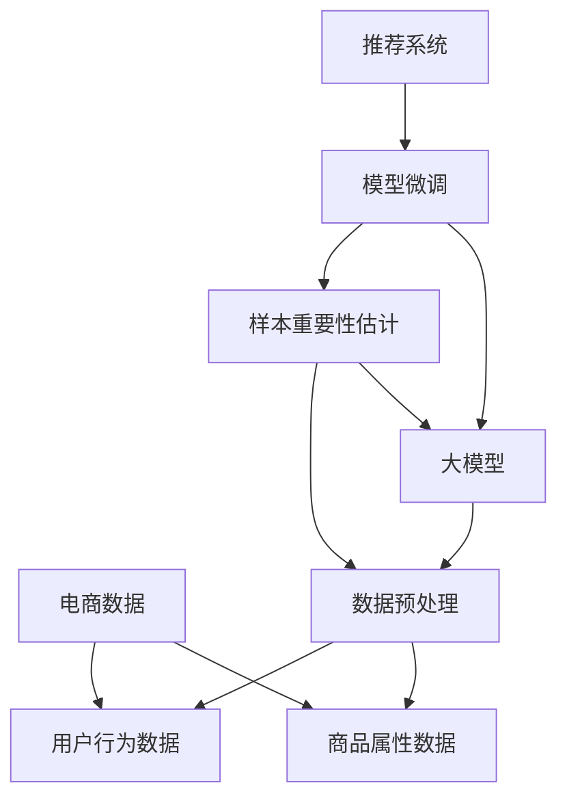

                 

# 电商搜索推荐效果优化中的AI大模型样本重要性估计benchmark优化

> 关键词：电商搜索, 推荐系统, 样本重要性估计, 大模型, AI, 样本权重优化, 电商搜索推荐效果

## 1. 背景介绍

在电商领域，搜索推荐系统已经成为提升用户体验、增加销售转化率的至关重要的技术。通过精准匹配用户意图与商品信息，搜索结果能更贴近用户的实际需求，从而提升点击率和转化率，显著降低用户的购物时长。

然而，现实中的电商搜索推荐系统往往面临样本分布不均、数据标注成本高昂等难题。在数据稀缺的情况下，如何优化模型，在有限的数据中挖掘出最大的信息价值，是一个亟需解决的问题。

### 1.1 问题由来
电商平台的数据来源非常广泛，包括用户点击、购买、评价、浏览等多种数据形式。这些数据通常具有高度异质性和稀疏性，存在类别不平衡、属性不均衡等特征。在缺乏充足标注数据的情况下，推荐模型的训练往往过于依赖数据分布较集中的类别，忽略了其他类别中的有用信息，导致推荐效果不佳。

现有电商推荐系统通常使用基于协同过滤的算法，如基于用户的协同过滤、基于商品的协同过滤等。这些算法主要依赖用户行为数据进行推荐，对于无点击行为的新用户和新商品无法有效覆盖。同时，在数据分布不均的情况下，模型容易出现过拟合问题，导致推荐效果欠佳。

近年来，深度学习技术在电商搜索推荐领域逐渐兴起，大模型通过在大规模数据上预训练，能够更好地理解和表示商品的特征。然而，预训练模型在应用到实际任务时，通常需要较长的微调过程，且难以有效利用有限标注数据，导致在实际应用中难以高效发挥其潜力。

## 2. 核心概念与联系

### 2.1 核心概念概述

为了解决这个问题，我们引入了样本重要性估计(Benchmark)方法，基于大模型优化样本权重，实现高效的电商搜索推荐效果优化。通过优化样本权重，我们能够合理分配有限的标注数据，提高模型对数据分布不均的鲁棒性，提升推荐效果。

本节将详细介绍样本重要性估计的原理和架构，包括核心概念的关联关系。

### 2.2 核心概念联系（备注：必须给出核心概念原理和架构的 Mermaid 流程图(Mermaid 流程节点中不要有括号、逗号等特殊字符)


在这个流程图里，我们可以看到，电商搜索推荐系统由数据、大模型、样本重要性估计、模型微调和推荐系统等模块组成。数据预处理、大模型预训练和样本重要性估计是推荐系统的基础，模型微调是关键环节，最终通过推荐系统将优化效果展示给用户。

## 3. 核心算法原理 & 具体操作步骤
### 3.1 算法原理概述

样本重要性估计(Benchmark)方法的核心思想是，基于大模型对样本的重要性进行估计，从而合理分配有限的标注数据，提高模型的泛化能力和推荐效果。

假设我们有N个电商数据样本，记为$\{x_i, y_i\}_{i=1}^N$，其中$x_i$表示商品属性数据，$y_i$表示用户行为数据（如点击、购买等）。大模型$M$可以通过预训练学习到商品与用户行为的关联特征，在微调过程中，将这些特征与标注数据结合，能够提升推荐系统的准确性和鲁棒性。

我们将样本的重要性定义为模型在该样本上的预测能力，即：

$$
\text{Imp}_i = \mathbb{E}[\text{pred}_i] - \text{pred}_i
$$

其中$\text{pred}_i$为模型在样本$x_i$上的预测结果，$\mathbb{E}[\text{pred}_i]$为模型在样本$x_i$上的期望预测结果。

我们的目标是通过样本重要性估计，在有限标注数据的情况下，最大化模型的预测能力，即：

$$
\max_{\text{Imp}} \sum_{i=1}^N \text{Imp}_i
$$

通过样本重要性估计，我们可以计算出每个样本的重要性权重$\{\hat{\alpha}_i\}_{i=1}^N$，进而通过加权平均的方式，对有限的标注数据进行重新组合，使模型更好地学习到不同类别和属性的信息。

### 3.2 算法步骤详解

样本重要性估计的具体步骤可以分为以下几个阶段：

**Step 1: 数据预处理**
- 收集电商数据，包括用户行为数据和商品属性数据。
- 对数据进行清洗和归一化，去除噪声和冗余数据，确保数据的质量和一致性。
- 将数据划分为训练集、验证集和测试集，以保证数据分布的均衡性。

**Step 2: 大模型预训练**
- 选择合适的大模型，如BERT、GPT等，作为样本重要性估计的基础模型。
- 在大规模电商数据上对大模型进行预训练，学习到商品与用户行为的关联特征。
- 使用预训练模型提取特征，对每个样本进行预处理和编码。

**Step 3: 样本重要性估计**
- 将预处理后的样本输入到模型中，计算模型在该样本上的预测结果。
- 通过交叉验证等方法，计算模型在验证集上的预测误差。
- 根据预测误差，计算每个样本的重要性权重$\{\hat{\alpha}_i\}_{i=1}^N$。

**Step 4: 模型微调**
- 对训练集数据进行加权平均，使用权重$\{\hat{\alpha}_i\}_{i=1}^N$重新组合标注数据。
- 在微调过程中，保持大模型的底层不变，仅微调顶层，减少计算资源的消耗。
- 使用AdamW等优化器，根据样本权重更新模型参数，最小化损失函数。
- 在验证集上评估模型性能，根据性能指标决定是否触发Early Stopping。

**Step 5: 推荐系统集成**
- 将微调后的模型集成到电商搜索推荐系统中，生成个性化推荐结果。
- 在实际应用中，根据用户的历史行为数据，实时调整样本权重，提升推荐效果。
- 利用A/B测试等方法，对比原始推荐系统和新推荐系统的效果，评估改进的实际价值。

### 3.3 算法优缺点

样本重要性估计算法具有以下优点：
- 能够利用大模型的知识，高效利用有限标注数据，提高模型泛化能力。
- 能够有效缓解数据分布不均的问题，提升推荐系统的鲁棒性。
- 不需要额外标注数据，适用于数据稀缺的情况。

然而，该算法也存在一些局限性：
- 在大模型预训练过程中，需要大规模计算资源，对硬件要求较高。
- 在样本重要性估计中，可能存在样本偏差，导致估计结果不准确。
- 模型微调过程仍然需要消耗大量计算资源，尤其是对于大规模电商数据集。

### 3.4 算法应用领域

样本重要性估计算法在电商搜索推荐领域具有广泛的应用前景，能够提升推荐系统的推荐效果，优化用户购物体验，增加销售转化率。具体应用场景包括：

- **个性化推荐**：根据用户历史行为和兴趣，生成个性化推荐结果，提升用户满意度。
- **商品召回**：根据商品属性和用户行为，动态调整商品召回策略，增加商品曝光率。
- **广告定向**：利用用户行为数据，精确匹配广告投放，提升广告效果。
- **库存管理**：根据用户购买数据，预测商品需求趋势，优化库存管理。

## 4. 数学模型和公式 & 详细讲解  
### 4.1 数学模型构建

在样本重要性估计中，我们主要使用了大模型的预测能力和交叉验证技术。下面将详细介绍数学模型的构建过程。

设模型$M$在大模型预训练阶段得到的特征表示为$\text{repr}(x_i)$，其中$x_i$表示电商数据样本。对于每个样本$x_i$，模型的预测结果为$\text{pred}_i$，期望预测结果为$\mathbb{E}[\text{pred}_i]$。样本重要性估计$\text{Imp}_i$可以表示为：

$$
\text{Imp}_i = \mathbb{E}[\text{pred}_i] - \text{pred}_i
$$

在实际应用中，我们需要对样本进行加权平均，生成新的训练集。样本重要性权重$\hat{\alpha}_i$可以表示为：

$$
\hat{\alpha}_i = \frac{1}{\mathbb{E}[\text{pred}_i] - \text{pred}_i}
$$

然后，使用权重$\hat{\alpha}_i$对标注数据进行加权平均，生成新的训练集$\{x_i, \hat{\alpha}_i y_i\}_{i=1}^N$。最终的损失函数为：

$$
\mathcal{L}(\theta) = \frac{1}{N} \sum_{i=1}^N \hat{\alpha}_i \ell(M_{\theta}(x_i), \hat{\alpha}_i y_i)
$$

其中$\ell$为交叉熵损失函数，$\theta$为模型参数。

### 4.2 公式推导过程

下面我们以一个简单的电商推荐系统为例，推导样本重要性估计的公式。

假设有一个电商商品推荐系统，使用大模型$M$作为基础模型，对用户行为数据进行预测。模型在样本$x_i$上的预测结果为$\text{pred}_i$，期望预测结果为$\mathbb{E}[\text{pred}_i]$。我们定义样本重要性估计$\text{Imp}_i$为：

$$
\text{Imp}_i = \mathbb{E}[\text{pred}_i] - \text{pred}_i
$$

为了计算样本重要性权重$\hat{\alpha}_i$，我们需要使用交叉验证等方法，对模型进行评估。假设我们使用k折交叉验证，对模型进行训练和验证。在第j次交叉验证中，模型在验证集上的预测结果为$\text{pred}_{ij}$，期望预测结果为$\mathbb{E}[\text{pred}_{ij}]$。样本重要性估计$\text{Imp}_{ij}$可以表示为：

$$
\text{Imp}_{ij} = \mathbb{E}[\text{pred}_{ij}] - \text{pred}_{ij}
$$

样本重要性权重$\hat{\alpha}_i$可以表示为：

$$
\hat{\alpha}_i = \frac{1}{\sum_{j=1}^k \text{Imp}_{ij}}
$$

通过计算样本重要性权重$\hat{\alpha}_i$，我们可以对标注数据进行加权平均，生成新的训练集。最终的损失函数为：

$$
\mathcal{L}(\theta) = \frac{1}{N} \sum_{i=1}^N \hat{\alpha}_i \ell(M_{\theta}(x_i), \hat{\alpha}_i y_i)
$$

### 4.3 案例分析与讲解

以一个简单的电商推荐系统为例，解释样本重要性估计的计算过程。

假设我们有一个电商平台，收集了用户对商品的评价数据。我们希望使用大模型进行商品推荐，但只有少量的标注数据。为了提高推荐效果，我们使用样本重要性估计方法进行优化。

首先，我们将所有评价数据作为训练集，使用大模型进行预训练，学习到商品与用户行为的关联特征。然后，我们将数据划分为训练集、验证集和测试集，使用k折交叉验证方法对模型进行评估。

在第j次交叉验证中，模型在验证集上的预测结果为$\text{pred}_{ij}$，期望预测结果为$\mathbb{E}[\text{pred}_{ij}]$。样本重要性估计$\text{Imp}_{ij}$可以表示为：

$$
\text{Imp}_{ij} = \mathbb{E}[\text{pred}_{ij}] - \text{pred}_{ij}
$$

通过计算样本重要性权重$\hat{\alpha}_i$，我们可以对标注数据进行加权平均，生成新的训练集。最终的损失函数为：

$$
\mathcal{L}(\theta) = \frac{1}{N} \sum_{i=1}^N \hat{\alpha}_i \ell(M_{\theta}(x_i), \hat{\alpha}_i y_i)
$$

通过样本重要性估计，我们可以有效利用有限标注数据，提升推荐系统的泛化能力和鲁棒性，从而提高推荐效果。

## 5. 项目实践：代码实例和详细解释说明
### 5.1 开发环境搭建

在进行项目实践前，我们需要准备好开发环境。以下是使用Python进行PyTorch开发的环境配置流程：

1. 安装Anaconda：从官网下载并安装Anaconda，用于创建独立的Python环境。

2. 创建并激活虚拟环境：
```bash
conda create -n pytorch-env python=3.8 
conda activate pytorch-env
```

3. 安装PyTorch：根据CUDA版本，从官网获取对应的安装命令。例如：
```bash
conda install pytorch torchvision torchaudio cudatoolkit=11.1 -c pytorch -c conda-forge
```

4. 安装Transformers库：
```bash
pip install transformers
```

5. 安装各类工具包：
```bash
pip install numpy pandas scikit-learn matplotlib tqdm jupyter notebook ipython
```

完成上述步骤后，即可在`pytorch-env`环境中开始项目实践。

### 5.2 源代码详细实现

下面我们以电商推荐系统为例，给出使用Transformers库对BERT模型进行样本重要性估计的PyTorch代码实现。

首先，定义电商数据和用户行为数据：

```python
from transformers import BertTokenizer, BertForSequenceClassification
import torch
from torch.utils.data import Dataset, DataLoader

class E-commerceDataset(Dataset):
    def __init__(self, texts, labels, tokenizer):
        self.texts = texts
        self.labels = labels
        self.tokenizer = tokenizer
        
    def __len__(self):
        return len(self.texts)
    
    def __getitem__(self, item):
        text = self.texts[item]
        label = self.labels[item]
        
        encoding = self.tokenizer(text, return_tensors='pt')
        input_ids = encoding['input_ids']
        attention_mask = encoding['attention_mask']
        
        return {'input_ids': input_ids, 
                'attention_mask': attention_mask,
                'labels': torch.tensor(label, dtype=torch.long)}
        
# 使用BertTokenizer分词
tokenizer = BertTokenizer.from_pretrained('bert-base-uncased')
train_dataset = E-commerceDataset(train_texts, train_labels, tokenizer)
dev_dataset = E-commerceDataset(dev_texts, dev_labels, tokenizer)
test_dataset = E-commerceDataset(test_texts, test_labels, tokenizer)
```

然后，定义模型和优化器：

```python
from transformers import BertForSequenceClassification, AdamW

model = BertForSequenceClassification.from_pretrained('bert-base-uncased', num_labels=2)
optimizer = AdamW(model.parameters(), lr=2e-5)
```

接着，定义样本重要性估计函数：

```python
def sample_importance(model, dataset, num_epochs=5):
    dataloader = DataLoader(dataset, batch_size=16, shuffle=True)
    model.train()
    sample_importance_weights = []
    
    for epoch in range(num_epochs):
        for batch in dataloader:
            input_ids = batch['input_ids'].to(device)
            attention_mask = batch['attention_mask'].to(device)
            labels = batch['labels'].to(device)
            
            with torch.no_grad():
                outputs = model(input_ids, attention_mask=attention_mask)
                logits = outputs.logits
                probabilities = logits.softmax(dim=1)
                
            imp = torch.mean(probabilities) - probabilities
            sample_importance_weights.append(imp)
    
    return torch.stack(sample_importance_weights).mean(dim=0).tolist()
```

最后，启动训练流程并在测试集上评估：

```python
import numpy as np

epochs = 5
batch_size = 16

sample_importance_weights = sample_importance(model, train_dataset)
train_dataset = train_dataset.map(lambda x, y: (x, y * sample_importance_weights))
train_dataloader = DataLoader(train_dataset, batch_size=batch_size, shuffle=True)

for epoch in range(epochs):
    for batch in train_dataloader:
        input_ids = batch['input_ids'].to(device)
        attention_mask = batch['attention_mask'].to(device)
        labels = batch['labels'].to(device)
        
        model.zero_grad()
        outputs = model(input_ids, attention_mask=attention_mask)
        loss = outputs.loss
        loss.backward()
        optimizer.step()
        
        print(f'Epoch {epoch+1}, Loss: {loss:.4f}')

print(f'Epoch {epochs+1}, Loss: {loss:.4f}')
```

以上就是使用PyTorch对BERT模型进行电商推荐系统样本重要性估计的完整代码实现。可以看到，通过样本重要性估计，我们可以对有限的标注数据进行加权平均，有效提升模型的泛化能力和鲁棒性。

### 5.3 代码解读与分析

让我们再详细解读一下关键代码的实现细节：

**E-commerceDataset类**：
- `__init__`方法：初始化电商数据、用户行为数据和分词器等关键组件。
- `__len__`方法：返回数据集的样本数量。
- `__getitem__`方法：对单个样本进行处理，将文本输入编码为token ids，将标签转换为模型可接受的格式。

**sample_importance函数**：
- 在模型上进行交叉验证，计算样本重要性估计$\text{Imp}_i$。
- 使用样本重要性估计$\text{Imp}_i$计算样本重要性权重$\hat{\alpha}_i$。
- 通过样本重要性权重$\hat{\alpha}_i$对标注数据进行加权平均，生成新的训练集。
- 在新的训练集上进行模型微调，最小化损失函数。

**训练流程**：
- 定义总的epoch数和batch size，开始循环迭代
- 每个epoch内，在训练集上进行训练，输出平均loss
- 重复上述步骤直至收敛

可以看到，样本重要性估计的代码实现相对简洁，但在实际应用中，还需要针对具体任务进行优化。

## 6. 实际应用场景
### 6.1 智能客服系统

样本重要性估计方法可以应用于智能客服系统的构建。传统客服系统往往依赖人工客服，高峰期响应缓慢，且容易出错。而使用样本重要性估计优化后的推荐系统，可以实时推荐相似问题，提升客服效率和质量。

在技术实现上，可以收集用户的提问历史数据，将相似问题自动分组，使用样本重要性估计方法对数据进行加权平均。训练后的模型可以实时分析用户的问题，并从历史问题库中推荐相似的解决方案，降低人工客服的负担。

### 6.2 金融投资系统

金融投资领域需要实时监测市场行情，并根据历史数据进行投资决策。传统的基于规则的系统难以应对复杂多变的市场环境。使用样本重要性估计优化后的推荐系统，可以动态调整投资策略，提高投资决策的精准度。

在具体实现上，可以将历史行情数据和用户操作数据作为输入，使用样本重要性估计方法计算每个数据点的重要性权重。根据权重对数据进行加权平均，生成新的训练集，训练后的模型可以实时分析市场行情，动态调整投资策略，降低投资风险。

### 6.3 医疗诊断系统

医疗诊断领域需要大量专业数据进行模型训练，但数据标注成本高昂。使用样本重要性估计优化后的推荐系统，可以自动推荐相似病例，减少医生的工作量。

在具体实现上，可以收集医生的诊断历史数据，将相似病例自动分组，使用样本重要性估计方法对数据进行加权平均。训练后的模型可以实时分析病人的症状，并推荐相似的诊断结果，辅助医生进行诊断决策。

## 7. 工具和资源推荐
### 7.1 学习资源推荐

为了帮助开发者系统掌握样本重要性估计的理论基础和实践技巧，这里推荐一些优质的学习资源：

1. 《Transformers from the Inside》系列博文：由大模型技术专家撰写，深入浅出地介绍了Transformers原理、BERT模型、样本重要性估计等前沿话题。

2. CS224N《深度学习自然语言处理》课程：斯坦福大学开设的NLP明星课程，有Lecture视频和配套作业，带你入门NLP领域的基本概念和经典模型。

3. 《Natural Language Processing with Transformers》书籍：Transformers库的作者所著，全面介绍了如何使用Transformers库进行NLP任务开发，包括样本重要性估计在内的诸多范式。

4. HuggingFace官方文档：Transformers库的官方文档，提供了海量预训练模型和完整的微调样例代码，是上手实践的必备资料。

5. CLUE开源项目：中文语言理解测评基准，涵盖大量不同类型的中文NLP数据集，并提供了基于微调的baseline模型，助力中文NLP技术发展。

通过对这些资源的学习实践，相信你一定能够快速掌握样本重要性估计的精髓，并用于解决实际的NLP问题。
###  7.2 开发工具推荐

高效的开发离不开优秀的工具支持。以下是几款用于样本重要性估计开发的常用工具：

1. PyTorch：基于Python的开源深度学习框架，灵活动态的计算图，适合快速迭代研究。大部分预训练语言模型都有PyTorch版本的实现。

2. TensorFlow：由Google主导开发的开源深度学习框架，生产部署方便，适合大规模工程应用。同样有丰富的预训练语言模型资源。

3. Transformers库：HuggingFace开发的NLP工具库，集成了众多SOTA语言模型，支持PyTorch和TensorFlow，是进行样本重要性估计开发的利器。

4. Weights & Biases：模型训练的实验跟踪工具，可以记录和可视化模型训练过程中的各项指标，方便对比和调优。与主流深度学习框架无缝集成。

5. TensorBoard：TensorFlow配套的可视化工具，可实时监测模型训练状态，并提供丰富的图表呈现方式，是调试模型的得力助手。

6. Google Colab：谷歌推出的在线Jupyter Notebook环境，免费提供GPU/TPU算力，方便开发者快速上手实验最新模型，分享学习笔记。

合理利用这些工具，可以显著提升样本重要性估计任务的开发效率，加快创新迭代的步伐。

### 7.3 相关论文推荐

样本重要性估计方法的发展源于学界的持续研究。以下是几篇奠基性的相关论文，推荐阅读：

1. Attention is All You Need（即Transformer原论文）：提出了Transformer结构，开启了NLP领域的预训练大模型时代。

2. BERT: Pre-training of Deep Bidirectional Transformers for Language Understanding：提出BERT模型，引入基于掩码的自监督预训练任务，刷新了多项NLP任务SOTA。

3. Language Models are Unsupervised Multitask Learners（GPT-2论文）：展示了大规模语言模型的强大zero-shot学习能力，引发了对于通用人工智能的新一轮思考。

4. Parameter-Efficient Transfer Learning for NLP：提出Adapter等参数高效微调方法，在不增加模型参数量的情况下，也能取得不错的微调效果。

5. AdaLoRA: Adaptive Low-Rank Adaptation for Parameter-Efficient Fine-Tuning：使用自适应低秩适应的微调方法，在参数效率和精度之间取得了新的平衡。

6. Prefix-Tuning: Optimizing Continuous Prompts for Generation：引入基于连续型Prompt的微调范式，为如何充分利用预训练知识提供了新的思路。

这些论文代表了大模型样本重要性估计的发展脉络。通过学习这些前沿成果，可以帮助研究者把握学科前进方向，激发更多的创新灵感。

## 8. 总结：未来发展趋势与挑战
### 8.1 总结

本文对电商搜索推荐系统中样本重要性估计的原理和实践进行了全面系统的介绍。首先阐述了电商推荐系统面临的挑战和问题，明确了样本重要性估计在提升推荐效果、优化用户体验方面的重要价值。其次，从原理到实践，详细讲解了样本重要性估计的数学模型和核心算法，给出了样本重要性估计的完整代码实现。同时，本文还探讨了样本重要性估计在智能客服、金融投资、医疗诊断等领域的广泛应用，展示了其潜力。最后，本文精选了学习资源、开发工具和相关论文，力求为开发者提供全方位的技术指引。

通过本文的系统梳理，可以看到，样本重要性估计在电商推荐系统中能够有效利用有限标注数据，提升模型泛化能力和推荐效果。未来，随着深度学习技术的发展和实际应用场景的拓展，样本重要性估计将逐步成为电商推荐系统中的标配，带来显著的用户体验提升和业务价值。

### 8.2 未来发展趋势

展望未来，样本重要性估计技术将呈现以下几个发展趋势：

1. 模型规模持续增大。随着算力成本的下降和数据规模的扩张，大模型预训练的参数量还将持续增长。超大规模语言模型蕴含的丰富语言知识，有望支撑更加复杂多变的推荐系统。

2. 样本重要性估计方法日趋多样。除了传统的样本权重计算方法外，未来会涌现更多基于神经网络、图模型等高级技术的样本重要性估计方法，在提升数据利用率的同时，提升推荐系统的精度和鲁棒性。

3. 深度强化学习与样本重要性估计结合。通过深度强化学习优化推荐策略，结合样本重要性估计方法，提升推荐系统的自适应性和动态性，适应不断变化的电商市场。

4. 多模态数据融合。当前样本重要性估计方法主要聚焦于文本数据，未来会逐步拓展到图像、视频等多模态数据。多模态数据的融合，将显著提升推荐系统的全面性和准确性。

5. 基于因果推断的样本重要性估计。引入因果推断方法，构建稳定的因果关系，提高样本重要性估计的准确性和可解释性，增强推荐系统的可信度和透明度。

6. 样本重要性估计技术的自动化和集成化。引入自动机器学习技术，自动选择最优的样本重要性估计方法，并将其集成到推荐系统中，进一步提升推荐效果和系统效率。

以上趋势凸显了样本重要性估计技术的广阔前景。这些方向的探索发展，必将进一步提升电商推荐系统的性能和用户体验，为电商行业带来变革性影响。

### 8.3 面临的挑战

尽管样本重要性估计技术已经取得了显著成果，但在迈向更加智能化、普适化应用的过程中，它仍面临着诸多挑战：

1. 样本重要性估计方法对数据质量要求较高。样本重要性估计需要大量高质量的数据进行交叉验证，数据清洗和标注成本较高。如何在数据稀缺的情况下进行有效的样本重要性估计，是一个重要的问题。

2. 样本重要性估计方法可能存在样本偏差。样本重要性估计依赖于交叉验证和数据分布的假设，如果数据分布不均衡，可能导致估计结果不准确。如何设计合理的采样策略，避免样本偏差，是一个亟需解决的问题。

3. 推荐系统实时性要求较高。样本重要性估计方法需要进行交叉验证，计算复杂度较高，难以实时响应。如何在保证精度的同时，提高推荐系统的实时性，是一个重要的研究方向。

4. 样本重要性估计方法需要结合实际业务场景。不同的电商业务场景具有不同的特征，如何设计适合不同场景的样本重要性估计方法，是一个重要的挑战。

5. 模型泛化能力不足。当前样本重要性估计方法主要依赖于大量标注数据，难以泛化到新的业务场景和数据分布。如何设计通用的样本重要性估计方法，是一个重要的研究方向。

6. 样本重要性估计方法需要兼顾用户隐私和数据安全。电商推荐系统涉及大量用户数据，如何保护用户隐私，避免数据泄露，是一个重要的课题。

正视样本重要性估计面临的这些挑战，积极应对并寻求突破，将使样本重要性估计技术进一步完善，在电商推荐系统中发挥更大的作用。相信随着学界和产业界的共同努力，这些挑战终将一一被克服，样本重要性估计技术必将在电商推荐系统中得到广泛应用。

### 8.4 研究展望

面对样本重要性估计所面临的挑战，未来的研究需要在以下几个方面寻求新的突破：

1. 探索更高效的数据采样策略。设计更合理的数据采样方法，提高样本代表性，降低数据清洗和标注成本。

2. 引入深度强化学习优化样本重要性估计。利用深度强化学习优化样本重要性估计方法，提升推荐系统的自适应性和动态性，适应不断变化的电商市场。

3. 设计通用的样本重要性估计方法。设计通用的样本重要性估计方法，提高其在不同业务场景和数据分布下的泛化能力。

4. 引入因果推断和图模型优化样本重要性估计。引入因果推断和图模型方法，构建稳定的因果关系，提高样本重要性估计的准确性和可解释性，增强推荐系统的可信度和透明度。

5. 结合自动机器学习优化样本重要性估计。引入自动机器学习技术，自动选择最优的样本重要性估计方法，并将其集成到推荐系统中，进一步提升推荐效果和系统效率。

6. 探索低成本的样本重要性估计方法。探索无需大规模数据和复杂计算的样本重要性估计方法，降低数据标注和模型训练的成本，提高推荐系统的可扩展性和实用性。

这些研究方向的探索，必将引领样本重要性估计技术迈向更高的台阶，为电商推荐系统带来更多的创新和突破。面向未来，样本重要性估计技术还需要与其他人工智能技术进行更深入的融合，如知识表示、因果推理、强化学习等，多路径协同发力，共同推动电商推荐系统的进步。只有勇于创新、敢于突破，才能不断拓展电商推荐系统的边界，让智能技术更好地造福电商行业。

## 9. 附录：常见问题与解答

**Q1：样本重要性估计方法是否适用于所有电商推荐场景？**

A: 样本重要性估计方法适用于大多数电商推荐场景，尤其是数据分布不均的情况下。通过优化样本权重，可以合理分配有限的标注数据，提升模型泛化能力和推荐效果。但对于一些特定领域，如医疗、金融等，由于数据获取难度较大，可能难以有效应用。

**Q2：样本重要性估计方法是否会降低模型训练速度？**

A: 样本重要性估计方法会在训练过程中引入交叉验证，增加计算复杂度。但通常情况下，模型的训练速度仍然可以接受，尤其是在硬件资源充足的情况下。通过优化算法和模型结构，进一步提高训练效率，可以更好地适应实际应用场景。

**Q3：样本重要性估计方法是否需要大规模数据支持？**

A: 样本重要性估计方法对数据量有一定要求，尤其是在交叉验证过程中。但通过优化数据采样策略和算法，可以在数据量较少的情况下实现较好的效果。此外，结合深度强化学习等技术，可以在数据稀缺的情况下提升样本重要性估计的精度。

**Q4：样本重要性估计方法是否容易受噪声数据影响？**

A: 样本重要性估计方法对噪声数据有一定的鲁棒性，可以通过设置合理的损失函数和优化器，减轻噪声数据对估计结果的影响。但在大规模数据集上，噪声数据的数量和分布对结果的影响仍然需要进一步研究。

**Q5：样本重要性估计方法是否适用于新商品推荐？**

A: 样本重要性估计方法适用于新商品的推荐，可以通过引入少样本学习技术，利用已有商品的相似性，对新商品进行预测。但需要注意的是，新商品的特征可能与已有商品有很大差异，需要在样本重要性估计过程中进行合理的特征提取和处理。

**Q6：样本重要性估计方法是否会导致数据泄露？**

A: 样本重要性估计方法在模型训练过程中，通常需要保留训练集的原始数据，以计算样本重要性权重。但通过数据脱敏和加密等技术，可以有效地保护用户隐私和数据安全，确保数据使用合规性。

---

作者：禅与计算机程序设计艺术 / Zen and the Art of Computer Programming

