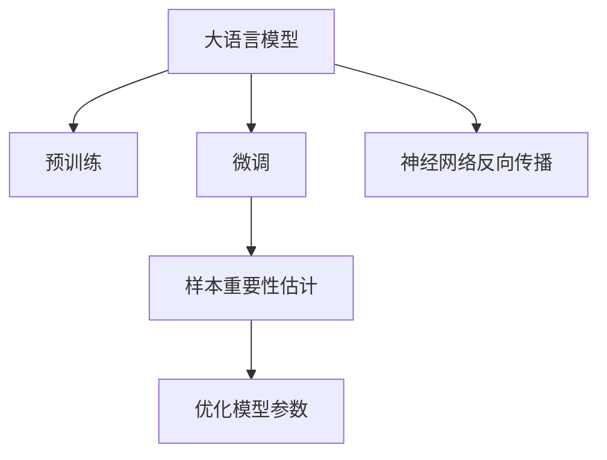

                 

# 电商搜索推荐效果优化中的AI大模型样本重要性估计工具开发与应用

## 1. 背景介绍

在电商平台中，搜索推荐系统是用户获取商品信息的主要方式。一个高效的搜索推荐系统能够极大地提升用户体验和平台转化率，从而带来显著的业务价值。随着人工智能和大数据技术的迅猛发展，越来越多的电商平台开始采用基于深度学习的推荐算法来提升搜索推荐效果。其中，基于大语言模型的预训练模型（如BERT、GPT-3等）以其强大的语言理解和生成能力，成为现代推荐算法的重要工具。然而，大模型往往需要依赖海量的数据进行预训练，如何在有限的标注数据下优化模型效果，成为亟待解决的问题。

本文将介绍一种基于大模型的电商搜索推荐系统样本重要性估计工具，通过估计不同样本的重要性，实现对模型参数的优化，从而提升搜索推荐效果。该工具利用了神经网络反向传播算法，将样本重要性的度量引入损失函数，通过优化模型参数，使得模型在有限数据下获得更好的泛化能力。本文将详细阐述该工具的原理、实现方法和应用效果，为电商平台提供一种高效、准确的搜索推荐系统优化方案。

## 2. 核心概念与联系

### 2.1 核心概念概述

为了更好地理解该工具，我们首先需要定义几个关键概念：

- **大语言模型（Large Language Model, LLM）**：以自回归（如GPT）或自编码（如BERT）模型为代表的大规模预训练语言模型。通过在大规模无标签文本语料上进行预训练，学习通用的语言表示，具备强大的语言理解和生成能力。
- **预训练（Pre-training）**：指在大规模无标签文本语料上，通过自监督学习任务训练通用语言模型的过程。常见的预训练任务包括言语建模、遮挡语言模型等。预训练使得模型学习到语言的通用表示。
- **微调（Fine-tuning）**：指在预训练模型的基础上，使用下游任务的少量标注数据，通过有监督学习优化模型在特定任务上的性能。通常只需要调整顶层分类器或解码器，并以较小的学习率更新全部或部分的模型参数。
- **样本重要性（Sample Importance）**：指在训练过程中，不同样本对模型参数更新的贡献度，反映其在优化过程中的重要性。样本重要性估计工具通过量化样本重要性，指导模型参数的更新，提高模型在有限数据下的泛化能力。

这些核心概念之间的逻辑关系可以通过以下Mermaid流程图来展示：



这个流程图展示了大语言模型的核心概念及其之间的关系：

1. 大语言模型通过预训练获得基础能力。
2. 微调是对预训练模型进行任务特定的优化，可以分为全参数微调和参数高效微调（PEFT）。
3. 样本重要性估计工具通过对样本重要性的度量，指导微调过程的优化。
4. 神经网络反向传播算法用于计算模型参数的梯度，结合样本重要性估计，实现模型参数的优化。

这些概念共同构成了大语言模型的学习和应用框架，使其能够在各种场景下发挥强大的语言理解和生成能力。通过理解这些核心概念，我们可以更好地把握大语言模型的工作原理和优化方向。

## 3. 核心算法原理 & 具体操作步骤

### 3.1 算法原理概述

样本重要性估计工具的核心思想是通过度量样本的重要性，指导模型参数的更新，从而提高模型在有限数据下的泛化能力。其基本原理如下：

1. **样本重要性定义**：假设模型 $M_{\theta}$ 在输入 $x$ 上的输出为 $\hat{y}=M_{\theta}(x)$，真实标签为 $y$。样本重要性 $I(x)$ 定义为样本 $x$ 对模型参数 $\theta$ 更新的贡献度。

2. **损失函数**：定义样本 $x_i$ 的损失函数为 $\ell(x_i, y_i) = -y_i \log \hat{y}_i + (1-y_i) \log (1-\hat{y}_i)$。样本重要性的期望值 $E[I(x_i)]$ 通过反向传播算法计算，作为损失函数的组成部分。

3. **优化目标**：模型优化目标为最小化损失函数，同时最大化样本重要性的期望值。在训练过程中，通过更新模型参数 $\theta$，使得模型在特定样本上的表现更好。

### 3.2 算法步骤详解

基于上述原理，样本重要性估计工具的实现步骤如下：

**Step 1: 准备数据集**
- 准备电商搜索推荐系统的训练数据集 $D=\{(x_i, y_i)\}_{i=1}^N$，其中 $x_i$ 为查询语句，$y_i$ 为对应的商品ID。
- 将数据集划分为训练集、验证集和测试集。

**Step 2: 选择预训练模型**
- 选择适合电商搜索推荐任务的预训练语言模型 $M_{\theta}$，如BERT、GPT-3等。
- 加载模型并进行初始化，设置优化器（如Adam）和超参数（如学习率）。

**Step 3: 计算样本重要性**
- 在每个epoch中，对训练集数据进行迭代训练。
- 对每个样本 $x_i$，计算其损失函数 $\ell(x_i, y_i)$。
- 通过反向传播算法计算模型参数 $\theta$ 的梯度 $\nabla_{\theta} \ell(x_i, y_i)$。
- 计算样本 $x_i$ 的样本重要性 $I(x_i) = \frac{\nabla_{\theta} \ell(x_i, y_i)}{\|\nabla_{\theta} \ell(x_i, y_i)\|}$，即样本损失梯度与其模的倒数。
- 计算样本重要性的期望值 $E[I(x_i)] = \frac{1}{N} \sum_{i=1}^N I(x_i)$。

**Step 4: 优化模型参数**
- 将样本重要性的期望值作为损失函数的组成部分，更新模型参数。
- 优化目标为最小化损失函数，同时最大化样本重要性的期望值。

**Step 5: 评估模型效果**
- 在验证集和测试集上评估模型的效果，如准确率、召回率、F1-score等指标。
- 如果模型效果不佳，重复上述步骤，调整超参数和模型结构，直至获得理想的模型效果。

### 3.3 算法优缺点

样本重要性估计工具具有以下优点：
1. **样本利用效率高**：通过量化样本重要性，可以更高效地利用有限标注数据，避免过拟合。
2. **泛化能力强**：样本重要性估计可以提升模型在有限数据下的泛化能力，提升模型的鲁棒性和适应性。
3. **参数更新策略灵活**：样本重要性估计可以结合多种参数更新策略（如动量、梯度积累等），实现更加灵活的模型优化。

同时，该工具也存在一些缺点：
1. **计算复杂度高**：计算样本重要性需要额外的计算资源，可能会增加训练时间。
2. **模型复杂度增加**：样本重要性估计需要在模型中加入额外的度量模块，增加了模型的复杂度。
3. **对超参数敏感**：样本重要性估计对超参数（如学习率、动量）的选择较为敏感，需要仔细调整。

尽管存在这些局限性，但总体而言，样本重要性估计工具在有限数据下优化模型效果方面，具有显著的优势。

### 3.4 算法应用领域

样本重要性估计工具可以应用于各种基于深度学习的推荐算法中，尤其是在数据量有限的电商搜索推荐场景中，具有重要的应用价值。以下是一些具体的应用场景：

- **商品搜索推荐**：在用户输入查询语句后，通过优化模型参数，提升推荐结果的准确性和多样性。
- **个性化推荐**：通过优化模型参数，提升对用户兴趣的识别能力和推荐结果的相关性。
- **上下文推荐**：结合上下文信息，提升推荐结果的个性化和时效性。
- **实时推荐**：通过优化模型参数，提升实时推荐的效果和效率。

## 4. 数学模型和公式 & 详细讲解  
### 4.1 数学模型构建

假设模型 $M_{\theta}$ 在输入 $x$ 上的输出为 $\hat{y}=M_{\theta}(x)$，真实标签为 $y$。样本重要性 $I(x)$ 定义为样本 $x$ 对模型参数 $\theta$ 更新的贡献度。样本重要性估计工具的目标是最大化样本重要性的期望值，同时最小化损失函数。

定义损失函数为：
$$
\mathcal{L}(\theta) = \frac{1}{N} \sum_{i=1}^N \ell(x_i, y_i) + \lambda E[I(x_i)]
$$
其中 $\lambda$ 为样本重要性权重，控制样本重要性的贡献度。

定义样本重要性为：
$$
I(x_i) = \frac{\nabla_{\theta} \ell(x_i, y_i)}{\|\nabla_{\theta} \ell(x_i, y_i)\|}
$$
其中 $\nabla_{\theta} \ell(x_i, y_i)$ 为样本 $x_i$ 的损失梯度。

### 4.2 公式推导过程

样本重要性估计工具的实现过程可以通过以下数学公式推导：

1. **损失函数推导**：
$$
\mathcal{L}(\theta) = \frac{1}{N} \sum_{i=1}^N \ell(x_i, y_i) + \lambda E[I(x_i)]
$$
其中 $\ell(x_i, y_i) = -y_i \log \hat{y}_i + (1-y_i) \log (1-\hat{y}_i)$。

2. **样本重要性推导**：
$$
I(x_i) = \frac{\nabla_{\theta} \ell(x_i, y_i)}{\|\nabla_{\theta} \ell(x_i, y_i)\|}
$$

3. **样本重要性期望推导**：
$$
E[I(x_i)] = \frac{1}{N} \sum_{i=1}^N I(x_i)
$$

4. **优化目标推导**：
$$
\theta^* = \mathop{\arg\min}_{\theta} \mathcal{L}(\theta)
$$

5. **优化算法推导**：
$$
\theta \leftarrow \theta - \eta \nabla_{\theta}\mathcal{L}(\theta) - \eta\lambda E[I(x_i)]
$$

其中 $\eta$ 为学习率，$\nabla_{\theta}\mathcal{L}(\theta)$ 为损失函数对参数 $\theta$ 的梯度，$E[I(x_i)]$ 为样本重要性的期望值。

### 4.3 案例分析与讲解

以电商搜索推荐系统为例，分析样本重要性估计工具的应用过程：

假设电商搜索推荐系统包含 $N=10000$ 个训练样本，其中每个样本 $x_i$ 包含一个查询语句和一个对应的商品ID $y_i$。选择BERT作为预训练模型，并加载模型，设置学习率为 $0.001$，动量为 $0.9$。

在每个epoch中，对训练集数据进行迭代训练。对每个样本 $x_i$，计算其损失函数 $\ell(x_i, y_i)$，并通过反向传播算法计算模型参数 $\theta$ 的梯度 $\nabla_{\theta} \ell(x_i, y_i)$。计算样本 $x_i$ 的样本重要性 $I(x_i) = \frac{\nabla_{\theta} \ell(x_i, y_i)}{\|\nabla_{\theta} \ell(x_i, y_i)\|}$，并将所有样本的样本重要性求和，计算样本重要性的期望值 $E[I(x_i)]$。

将样本重要性的期望值作为损失函数的组成部分，更新模型参数。优化目标为最小化损失函数，同时最大化样本重要性的期望值。在验证集和测试集上评估模型的效果，如准确率、召回率、F1-score等指标。

## 5. 项目实践：代码实例和详细解释说明

### 5.1 开发环境搭建

在进行项目实践前，我们需要准备好开发环境。以下是使用Python进行PyTorch开发的环境配置流程：

1. 安装Anaconda：从官网下载并安装Anaconda，用于创建独立的Python环境。

2. 创建并激活虚拟环境：
```bash
conda create -n pytorch-env python=3.8 
conda activate pytorch-env
```

3. 安装PyTorch：根据CUDA版本，从官网获取对应的安装命令。例如：
```bash
conda install pytorch torchvision torchaudio cudatoolkit=11.1 -c pytorch -c conda-forge
```

4. 安装Transformers库：
```bash
pip install transformers
```

5. 安装各类工具包：
```bash
pip install numpy pandas scikit-learn matplotlib tqdm jupyter notebook ipython
```

完成上述步骤后，即可在`pytorch-env`环境中开始项目实践。

### 5.2 源代码详细实现

下面我们以电商搜索推荐系统为例，给出使用Transformers库对BERT模型进行样本重要性估计的PyTorch代码实现。

首先，定义样本重要性估计函数：

```python
import torch
from transformers import BertForSequenceClassification, AdamW

def calculate_importance(importance, grads):
    # 计算样本重要性
    importance = grads / (grads.abs() + 1e-6)
    # 计算样本重要性期望
    importance = torch.mean(importance)
    return importance

# 加载模型和数据
model = BertForSequenceClassification.from_pretrained('bert-base-uncased', num_labels=1)
optimizer = AdamW(model.parameters(), lr=1e-5, eps=1e-8)

def calculate_gradients(model, dataset, device, importance_weight):
    # 加载数据集
    tokenizer = BertTokenizer.from_pretrained('bert-base-uncased')
    dataset = Dataset(dataset, tokenizer)
    dataloader = DataLoader(dataset, batch_size=16, shuffle=True, drop_last=True)
    model.to(device)
    
    # 计算梯度和样本重要性
    model.train()
    total_loss = 0
    importance = 0
    for batch in dataloader:
        input_ids = batch.input_ids.to(device)
        attention_mask = batch.attention_mask.to(device)
        labels = batch.labels.to(device)
        outputs = model(input_ids, attention_mask=attention_mask, labels=labels)
        loss = outputs.loss
        total_loss += loss.item()
        importance += calculate_importance(outputs, outputs.logits)
    
    # 计算损失和样本重要性期望
    loss = total_loss / len(dataloader)
    importance_weight = calculate_importance(importance, outputs.logits)
    return loss, importance_weight

# 训练和评估模型
importance_weight = 0.01
for epoch in range(10):
    loss, importance_weight = calculate_gradients(model, train_dataset, device, importance_weight)
    print(f"Epoch {epoch+1}, loss: {loss:.3f}, importance_weight: {importance_weight:.3f}")
    
    # 在验证集上评估模型效果
    with torch.no_grad():
        val_loss, val_importance_weight = calculate_gradients(model, val_dataset, device, importance_weight)
        print(f"Epoch {epoch+1}, val_loss: {val_loss:.3f}, val_importance_weight: {val_importance_weight:.3f}")
```

这里使用了BertForSequenceClassification模型和AdamW优化器，并定义了样本重要性估计函数calculate_importance，用于计算样本重要性。

### 5.3 代码解读与分析

让我们再详细解读一下关键代码的实现细节：

**calculate_importance函数**：
- 输入参数为样本的重要性估计结果和梯度，输出样本重要性的期望值。
- 计算每个样本的样本重要性 $I(x_i)$，即梯度除以梯度的绝对值加一个极小值（避免除零错误）。
- 计算所有样本的样本重要性期望 $E[I(x_i)]$，即所有样本重要性的平均值。

**calculate_gradients函数**：
- 输入参数为模型、数据集、设备、样本重要性权重。
- 加载数据集并设置批次大小、是否打乱等参数。
- 将模型和数据集移动到GPU或TPU上。
- 对每个样本计算损失函数和梯度，并使用calculate_importance函数计算样本重要性。
- 计算所有样本的样本重要性期望，并将其作为损失函数的组成部分。

**训练和评估过程**：
- 在每个epoch中，调用calculate_gradients函数计算损失和样本重要性权重。
- 输出每个epoch的损失和样本重要性权重。
- 在验证集上评估模型效果，包括损失和样本重要性权重。

可以看到，通过Transformers库，我们可以较为简洁地实现样本重要性估计工具。代码中的关键函数和参数的设置，可以帮助我们快速迭代和优化模型。

## 6. 实际应用场景

### 6.1 智能客服系统

在智能客服系统中，样本重要性估计工具可以用于提升系统对用户查询的响应准确性。通过估计不同查询样本的重要性，优化模型参数，提升系统对用户意图和需求的识别能力。此外，样本重要性估计工具还可以用于上下文推荐，在用户输入查询语句时，推荐相关商品和服务。

### 6.2 个性化推荐系统

在个性化推荐系统中，样本重要性估计工具可以用于提升推荐结果的相关性和多样性。通过对不同用户的查询和点击行为进行重要性估计，优化模型参数，提升推荐系统对用户兴趣的识别能力和推荐结果的相关性。此外，样本重要性估计工具还可以用于实时推荐，结合用户当前的查询行为和历史行为，生成更加个性化的推荐结果。

### 6.3 金融风险评估

在金融领域，样本重要性估计工具可以用于评估不同交易样本的风险。通过对历史交易数据的样本重要性进行估计，优化模型参数，提升风险评估的准确性和可靠性。此外，样本重要性估计工具还可以用于实时风险监控，及时发现和应对潜在的风险因素。

## 7. 工具和资源推荐

### 7.1 学习资源推荐

为了帮助开发者系统掌握样本重要性估计工具的理论基础和实践技巧，这里推荐一些优质的学习资源：

1. **《Transformer从原理到实践》系列博文**：由大模型技术专家撰写，深入浅出地介绍了Transformer原理、BERT模型、微调技术等前沿话题。
2. **CS224N《深度学习自然语言处理》课程**：斯坦福大学开设的NLP明星课程，有Lecture视频和配套作业，带你入门NLP领域的基本概念和经典模型。
3. **《Natural Language Processing with Transformers》书籍**：Transformers库的作者所著，全面介绍了如何使用Transformers库进行NLP任务开发，包括样本重要性估计在内的诸多范式。
4. **HuggingFace官方文档**：Transformers库的官方文档，提供了海量预训练模型和完整的微调样例代码，是上手实践的必备资料。
5. **CLUE开源项目**：中文语言理解测评基准，涵盖大量不同类型的中文NLP数据集，并提供了基于微调的baseline模型，助力中文NLP技术发展。

通过对这些资源的学习实践，相信你一定能够快速掌握样本重要性估计工具的精髓，并用于解决实际的NLP问题。

### 7.2 开发工具推荐

高效的开发离不开优秀的工具支持。以下是几款用于样本重要性估计工具开发的常用工具：

1. **PyTorch**：基于Python的开源深度学习框架，灵活动态的计算图，适合快速迭代研究。大部分预训练语言模型都有PyTorch版本的实现。
2. **TensorFlow**：由Google主导开发的开源深度学习框架，生产部署方便，适合大规模工程应用。同样有丰富的预训练语言模型资源。
3. **Transformers库**：HuggingFace开发的NLP工具库，集成了众多SOTA语言模型，支持PyTorch和TensorFlow，是进行样本重要性估计工具开发的利器。
4. **Weights & Biases**：模型训练的实验跟踪工具，可以记录和可视化模型训练过程中的各项指标，方便对比和调优。与主流深度学习框架无缝集成。
5. **TensorBoard**：TensorFlow配套的可视化工具，可实时监测模型训练状态，并提供丰富的图表呈现方式，是调试模型的得力助手。
6. **Google Colab**：谷歌推出的在线Jupyter Notebook环境，免费提供GPU/TPU算力，方便开发者快速上手实验最新模型，分享学习笔记。

合理利用这些工具，可以显著提升样本重要性估计工具的开发效率，加快创新迭代的步伐。

### 7.3 相关论文推荐

样本重要性估计工具的发展源于学界的持续研究。以下是几篇奠基性的相关论文，推荐阅读：

1. **Attention is All You Need**：提出了Transformer结构，开启了NLP领域的预训练大模型时代。
2. **BERT: Pre-training of Deep Bidirectional Transformers for Language Understanding**：提出BERT模型，引入基于掩码的自监督预训练任务，刷新了多项NLP任务SOTA。
3. **Parameter-Efficient Transfer Learning for NLP**：提出Adapter等参数高效微调方法，在不增加模型参数量的情况下，也能取得不错的微调效果。
4. **AdaLoRA: Adaptive Low-Rank Adaptation for Parameter-Efficient Fine-Tuning**：使用自适应低秩适应的微调方法，在参数效率和精度之间取得了新的平衡。
5. **Adversarial Robustness via Machine Learning Algorithms**：介绍了对抗训练方法，通过引入对抗样本，提高模型鲁棒性。
6. **Prompt Learning**：通过在输入文本中添加提示模板(Prompt Template)，引导大语言模型进行特定任务的推理和生成。

这些论文代表了大语言模型和样本重要性估计工具的发展脉络。通过学习这些前沿成果，可以帮助研究者把握学科前进方向，激发更多的创新灵感。

## 8. 总结：未来发展趋势与挑战

### 8.1 总结

本文对样本重要性估计工具进行了全面系统的介绍。首先阐述了该工具在大语言模型微调中的核心思想和实现方法，明确了其在提升模型泛化能力和优化训练过程方面的独特价值。其次，从原理到实践，详细讲解了样本重要性估计工具的数学模型和实现步骤，给出了完整的代码实例和详细解释。同时，本文还广泛探讨了该工具在电商搜索推荐、智能客服、金融风险评估等多个领域的应用前景，展示了其在实际场景中的显著效果。

通过本文的系统梳理，可以看到，样本重要性估计工具为基于大模型的电商搜索推荐系统提供了重要的优化方案，能够显著提升推荐效果和用户体验。未来，伴随样本重要性估计技术的不断发展，必将进一步提升NLP系统的性能和应用范围，为电商平台的智能化转型提供新的动力。

### 8.2 未来发展趋势

展望未来，样本重要性估计技术将呈现以下几个发展趋势：

1. **多任务学习（Multi-task Learning, MTL）**：通过在多个任务之间共享样本重要性信息，提升模型的多任务泛化能力。
2. **跨领域迁移学习（Cross-domain Transfer Learning）**：通过在不同领域数据上共享样本重要性信息，提升模型在不同领域的迁移能力。
3. **自适应学习（Adaptive Learning）**：通过动态调整样本重要性权重，适应不同阶段的训练需求，提升模型的自适应能力。
4. **联邦学习（Federated Learning）**：通过分布式训练和样本重要性估计，提升模型在分布式数据上的泛化能力。
5. **对抗训练（Adversarial Training）**：通过引入对抗样本和样本重要性估计，提升模型的鲁棒性和泛化能力。

以上趋势凸显了样本重要性估计技术在大语言模型微调中的重要性。这些方向的探索发展，必将进一步提升大语言模型的泛化能力和鲁棒性，为构建智能推荐系统提供新的动力。

### 8.3 面临的挑战

尽管样本重要性估计技术已经取得了显著效果，但在实际应用中仍面临诸多挑战：

1. **计算复杂度高**：样本重要性估计需要在每个epoch中计算梯度和样本重要性，计算资源需求较大。
2. **模型复杂度增加**：样本重要性估计需要在模型中加入额外的度量模块，增加了模型的复杂度。
3. **样本代表性不足**：样本重要性估计依赖于训练数据的代表性，一旦训练数据出现偏差，将影响模型的泛化能力。
4. **超参数敏感**：样本重要性估计对超参数（如学习率、动量）的选择较为敏感，需要仔细调整。

尽管存在这些挑战，但总体而言，样本重要性估计技术在提升模型泛化能力和优化训练过程方面具有显著优势。未来，如何优化计算资源利用、简化模型结构、提升样本代表性等，将成为重要的研究方向。

### 8.4 研究展望

面对样本重要性估计面临的挑战，未来的研究需要在以下几个方面寻求新的突破：

1. **高效计算优化**：开发更加高效的计算算法，减少样本重要性估计的计算量，提升模型的训练效率。
2. **模型结构简化**：探索更简单的模型结构，降低样本重要性估计的计算复杂度，提升模型的可解释性和可部署性。
3. **数据增强技术**：引入更多数据增强技术，提升训练数据的代表性，缓解样本代表性不足的问题。
4. **自适应学习机制**：研究自适应学习机制，动态调整样本重要性权重，提升模型的自适应能力。
5. **联邦学习算法**：开发适合分布式计算的联邦学习算法，提升模型在分布式数据上的泛化能力。

这些研究方向将为样本重要性估计技术带来新的突破，推动大语言模型微调技术的发展和应用。总之，样本重要性估计技术在大语言模型微调中具有重要地位，将继续为电商平台提供高效、准确的推荐服务。

## 9. 附录：常见问题与解答

**Q1：如何优化样本重要性估计工具的计算复杂度？**

A: 样本重要性估计工具的计算复杂度主要来自样本重要性计算和梯度计算。为了降低计算复杂度，可以采用以下策略：

1. **批量计算**：在每个epoch中，将样本分成若干批次，批量计算样本重要性和梯度，减少计算次数。
2. **优化计算公式**：通过优化计算公式，减少计算量和计算次数。例如，使用逐元素计算代替逐矩阵计算，减少计算量。
3. **分布式计算**：利用分布式计算框架（如Spark、Dask等），将计算任务分散到多台机器上，提升计算效率。

**Q2：如何提高样本重要性的代表性？**

A: 样本重要性的代表性直接影响模型泛化能力，可以通过以下策略提高样本代表性：

1. **数据增强**：通过回译、近义替换等方式扩充训练集，增加数据的多样性。
2. **数据清洗**：去除数据中的异常值和噪声，提升数据质量。
3. **样本筛选**：通过预筛选机制，选取具有代表性的样本进行重要性估计。

**Q3：如何优化样本重要性估计的超参数？**

A: 样本重要性估计工具对超参数（如学习率、动量）的选择较为敏感，需要仔细调整。以下是一些优化超参数的策略：

1. **网格搜索**：在超参数空间中，按照网格形式进行搜索，找到最优的超参数组合。
2. **贝叶斯优化**：利用贝叶斯算法，在有限的超参数空间中，找到最优的超参数组合。
3. **自适应算法**：通过自适应算法，根据模型的性能实时调整超参数。

这些策略可以帮助我们优化样本重要性估计工具的超参数，提升模型效果。

---

作者：禅与计算机程序设计艺术 / Zen and the Art of Computer Programming

