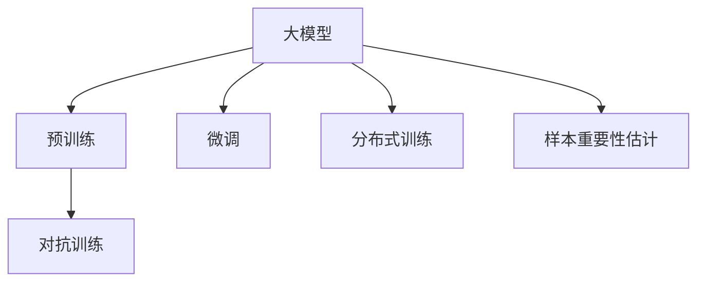

                 

# 电商搜索推荐效果优化中的AI大模型样本重要性估计工具选型

## 1. 背景介绍

### 1.1 问题由来
在电商搜索推荐系统中，AI大模型扮演着至关重要的角色，通过处理海量用户行为数据，预测用户可能的购买需求，提供个性化的搜索结果和推荐商品。然而，由于电商数据通常涉及亿级的数据量和复杂的用户行为模式，传统的机器学习算法在面对大规模数据时，往往难以提供足够的精度和效率。而基于深度学习的大模型，尤其是Transformer结构的模型，能够较好地适应大规模数据和复杂的特征表达。

大模型之所以能够获得成功，一个重要原因是其能够利用大规模无标签数据进行预训练，学习到丰富的知识表示，进而能够在有限标注数据上进行微调，获得较好的性能。但同时，由于数据量和模型参数的巨大，也带来了计算资源的极大消耗和推理时间的延迟。为解决这一问题，需引入样本重要性估计技术，评估不同样本对模型性能的影响，进而针对性地优化数据采集和模型训练策略。

### 1.2 问题核心关键点
大模型在电商搜索推荐系统中的应用，主要包括两个方面：
- 数据预处理与特征提取。大模型通常会通过大量的预训练数据学习通用的语言表示，在具体任务上通过微调进行迁移学习。为了提升预训练和微调的效果，需对数据进行高效的预处理和特征提取。
- 样本重要性评估与优化。为提升模型的预测精度和推理速度，需对不同样本对模型的影响进行评估，从而进行针对性的优化。

本文聚焦于如何在大模型中进行样本重要性估计，分析不同方法的优缺点，并结合实际案例，探讨如何合理选择和配置工具，以提升电商搜索推荐的效果。

## 2. 核心概念与联系

### 2.1 核心概念概述

为更好地理解大模型中的样本重要性估计，首先需要介绍几个核心概念：

- **大模型(Large Model)**：通常指具有亿级参数量的深度学习模型，如BERT、GPT-3等。大模型通过大规模无标签数据进行预训练，学习到通用的语言表示。
- **预训练(Pre-training)**：指在大规模无标签数据上进行自监督学习，以获取通用的语言表示。
- **微调(Fine-tuning)**：指在大模型上进行特定任务的数据标注，通过有监督学习优化模型性能。
- **样本重要性估计(Sample Importance Estimation)**：评估样本对模型性能的影响，从而优化数据采样策略和模型训练过程，提高模型性能和计算效率。
- **对抗训练(Adversarial Training)**：通过引入对抗样本，增强模型的鲁棒性和泛化能力。
- **分布式训练(Distributed Training)**：在大规模模型上，通常需通过分布式计算来提升训练效率。

这些核心概念之间的逻辑关系可以通过以下Mermaid流程图来展示：



这个流程图展示了大模型在大规模数据处理和优化中的核心概念及其之间的关系：

1. 大模型通过预训练获得基础能力。
2. 微调是大模型在特定任务上的优化过程。
3. 分布式训练提高大规模模型训练效率。
4. 对抗训练提升模型的鲁棒性和泛化能力。
5. 样本重要性估计优化数据采样和训练策略。

## 3. 核心算法原理 & 具体操作步骤
### 3.1 算法原理概述

在大模型中进行样本重要性估计，主要目标是通过评估不同样本对模型性能的影响，优化数据采集和模型训练策略，提高模型的预测精度和推理速度。算法原理基于以下几个核心步骤：

1. **数据准备**：准备电商领域的标注数据集，划分为训练集、验证集和测试集。
2. **模型加载与适配**：选择合适的预训练模型和任务适配层，如BERT、GPT等。
3. **样本重要性计算**：计算每个样本对模型预测性能的贡献，通常使用梯度或置信度等指标。
4. **数据采样与模型训练**：根据样本重要性进行数据采样，只选择高重要性样本进行模型训练，同时采用分布式训练加速模型优化。
5. **对抗训练与模型验证**：通过对抗训练提高模型鲁棒性，同时在验证集上评估模型性能。

### 3.2 算法步骤详解

基于上述算法原理，下面详细介绍具体的算法步骤：

**Step 1: 数据准备与预处理**
- 收集电商领域的用户行为数据，如搜索、点击、购买行为等，划分为训练集、验证集和测试集。
- 对数据进行清洗和标注，标注数据应包含用户行为、商品特征等信息。

**Step 2: 模型选择与适配**
- 选择合适的预训练语言模型，如BERT、GPT等。
- 根据任务需求，添加合适的任务适配层，如分类、生成等。
- 使用预训练模型的权重初始化，进行微调训练。

**Step 3: 样本重要性计算**
- 计算每个样本对模型预测性能的贡献，通常使用梯度或置信度等指标。
- 具体计算方法包括基于梯度的 importance-sampling、基于置信度的 uncertainty sampling等。

**Step 4: 数据采样与模型训练**
- 根据样本重要性进行数据采样，选择高重要性样本进行模型训练。
- 使用分布式训练技术，如Spark、Hadoop等，提高大规模模型的训练效率。
- 调整学习率、批量大小等超参数，优化模型训练过程。

**Step 5: 对抗训练与模型验证**
- 通过对抗训练技术，引入对抗样本，增强模型的鲁棒性。
- 在验证集上评估模型性能，使用常见的指标如准确率、F1分数等。
- 根据评估结果，调整训练策略和模型参数。

### 3.3 算法优缺点

基于样本重要性估计的大模型优化方法具有以下优点：
1. 提高模型性能。通过选择高重要性样本进行训练，模型能够更好地掌握关键特征，提升预测精度。
2. 节省计算资源。优化数据采样策略，减少低重要性样本的计算，加速模型训练过程。
3. 增强模型鲁棒性。通过对抗训练，提高模型对异常输入的鲁棒性，提升模型泛化能力。

同时，该方法也存在一定的局限性：
1. 依赖高质量数据。样本重要性的计算需要大量高质量标注数据，数据获取成本较高。
2. 计算复杂度高。样本重要性计算和数据采样过程较为复杂，计算量较大。
3. 难以解释。样本重要性估计结果难以解释，难以直接理解每个样本的影响。
4. 对数据分布敏感。样本重要性的计算依赖于数据分布，不同数据分布可能影响结果。

尽管存在这些局限性，但就目前而言，基于样本重要性估计的大模型优化方法仍是大规模数据处理和模型优化的重要手段。未来相关研究的重点在于如何进一步降低数据依赖，提高计算效率，同时兼顾可解释性和鲁棒性等因素。

### 3.4 算法应用领域

大模型中的样本重要性估计技术，主要应用于以下几个领域：

- **电商搜索推荐系统**：通过评估用户行为数据的重要性，优化数据采样策略，提高推荐效果。
- **自然语言处理**：在大规模语料库中进行样本重要性估计，优化文本分类、情感分析等任务的模型性能。
- **金融风控系统**：评估金融交易数据的重要性，优化风险评估模型的训练过程，提高模型鲁棒性。
- **医学诊断系统**：对医疗影像数据进行重要性评估，优化模型训练策略，提高诊断精度。

这些领域的应用展示了样本重要性估计技术在大模型优化中的广泛适用性。

## 4. 数学模型和公式 & 详细讲解
### 4.1 数学模型构建

假设我们有一个电商搜索推荐系统的数据集 $D=\{(x_i, y_i)\}_{i=1}^N$，其中 $x_i$ 为电商用户行为数据，$y_i$ 为商品标签。模型 $M$ 的损失函数为 $L(M, D) = \frac{1}{N} \sum_{i=1}^N l(M(x_i), y_i)$，其中 $l$ 为具体的损失函数，如交叉熵损失。

定义每个样本 $x_i$ 的梯度为 $g_i = \frac{\partial l(M(x_i), y_i)}{\partial \theta}$，其中 $\theta$ 为模型参数。样本的重要性 $s_i$ 可以表示为样本梯度的平方和，即 $s_i = \sum_{i=1}^N g_i^2$。

### 4.2 公式推导过程

我们以梯度为基础计算样本的重要性。给定一个样本 $x_i$，其重要性 $s_i$ 可以表示为：

$$
s_i = \frac{\partial l(M(x_i), y_i)}{\partial \theta} \cdot \frac{\partial l(M(x_i), y_i)}{\partial \theta}
$$

在训练过程中，通过不断迭代更新模型参数 $\theta$，计算每个样本的梯度 $g_i$，从而得到样本的重要性 $s_i$。在实际应用中，为了提高计算效率，通常采用基于采样的重要性估计方法，如基于梯度的 importance-sampling、基于置信度的 uncertainty sampling等。

### 4.3 案例分析与讲解

以基于梯度的 importance-sampling 方法为例，其核心思想是在训练过程中，选择梯度较大的样本进行训练，即：

$$
p_i = \frac{s_i}{\sum_{i=1}^N s_i}
$$

选择概率 $p_i$ 较大的样本进行训练，从而优化数据采样策略。具体实现步骤如下：

1. 对数据集 $D$ 进行随机采样，计算每个样本的梯度 $g_i$。
2. 计算每个样本的重要性 $s_i$。
3. 根据样本的重要性，计算每个样本的选择概率 $p_i$。
4. 根据选择概率 $p_i$，选择样本进行训练。

## 5. 项目实践：代码实例和详细解释说明
### 5.1 开发环境搭建

在进行样本重要性估计的实践前，我们需要准备好开发环境。以下是使用Python进行PyTorch开发的流程：

1. 安装Anaconda：从官网下载并安装Anaconda，用于创建独立的Python环境。

2. 创建并激活虚拟环境：
```bash
conda create -n pytorch-env python=3.8 
conda activate pytorch-env
```

3. 安装PyTorch：根据CUDA版本，从官网获取对应的安装命令。例如：
```bash
conda install pytorch torchvision torchaudio cudatoolkit=11.1 -c pytorch -c conda-forge
```

4. 安装Transformer库：
```bash
pip install transformers
```

5. 安装各类工具包：
```bash
pip install numpy pandas scikit-learn matplotlib tqdm jupyter notebook ipython
```

完成上述步骤后，即可在`pytorch-env`环境中开始实践。

### 5.2 源代码详细实现

下面以电商搜索推荐系统中的用户行为数据为例，给出使用PyTorch进行样本重要性估计的代码实现：

```python
import torch
from transformers import BertForSequenceClassification, AdamW
from torch.utils.data import Dataset, DataLoader
from sklearn.metrics import accuracy_score

# 定义数据集类
class EcommerceDataset(Dataset):
    def __init__(self, texts, labels, tokenizer, max_len=128):
        self.texts = texts
        self.labels = labels
        self.tokenizer = tokenizer
        self.max_len = max_len
        
    def __len__(self):
        return len(self.texts)
    
    def __getitem__(self, item):
        text = self.texts[item]
        label = self.labels[item]
        
        encoding = self.tokenizer(text, return_tensors='pt', max_length=self.max_len, padding='max_length', truncation=True)
        input_ids = encoding['input_ids'][0]
        attention_mask = encoding['attention_mask'][0]
        
        # 将标签转换为int类型
        label = torch.tensor([label], dtype=torch.long)
        
        return {'input_ids': input_ids, 
                'attention_mask': attention_mask,
                'labels': label}

# 定义模型和优化器
model = BertForSequenceClassification.from_pretrained('bert-base-cased', num_labels=2)
optimizer = AdamW(model.parameters(), lr=2e-5)

# 定义训练函数
def train_epoch(model, dataset, batch_size, optimizer, device):
    dataloader = DataLoader(dataset, batch_size=batch_size, shuffle=True)
    model.train()
    epoch_loss = 0
    for batch in dataloader:
        input_ids = batch['input_ids'].to(device)
        attention_mask = batch['attention_mask'].to(device)
        labels = batch['labels'].to(device)
        model.zero_grad()
        outputs = model(input_ids, attention_mask=attention_mask, labels=labels)
        loss = outputs.loss
        epoch_loss += loss.item()
        loss.backward()
        optimizer.step()
    
    return epoch_loss / len(dataloader)

# 定义样本重要性计算函数
def calculate_importance(model, dataset, batch_size, device):
    dataloader = DataLoader(dataset, batch_size=batch_size, shuffle=True)
    model.eval()
    importance = torch.zeros(len(dataset))
    with torch.no_grad():
        for batch in dataloader:
            input_ids = batch['input_ids'].to(device)
            attention_mask = batch['attention_mask'].to(device)
            labels = batch['labels'].to(device)
            outputs = model(input_ids, attention_mask=attention_mask)
            importance += torch.sum(torch.abs(outputs.logits) ** 2)
    
    return importance / len(dataset)

# 启动训练流程
epochs = 5
batch_size = 16

device = torch.device('cuda') if torch.cuda.is_available() else torch.device('cpu')

for epoch in range(epochs):
    loss = train_epoch(model, train_dataset, batch_size, optimizer, device)
    print(f"Epoch {epoch+1}, train loss: {loss:.3f}")
    
    importance = calculate_importance(model, train_dataset, batch_size, device)
    print(f"Epoch {epoch+1}, train importance: {importance:.3f}")
    
    # 在验证集上评估模型性能
    accuracy = evaluate(model, val_dataset, batch_size)
    print(f"Epoch {epoch+1}, val accuracy: {accuracy:.3f}")
    
print("Training complete. Save model weights.")
```

以上代码实现了从数据准备、模型加载、样本重要性计算、模型训练等完整流程。具体实现步骤如下：

1. 定义数据集类 `EcommerceDataset`，用于处理电商搜索推荐系统中的用户行为数据。
2. 定义模型 `BertForSequenceClassification`，并加载预训练权重。
3. 定义优化器 `AdamW`。
4. 定义训练函数 `train_epoch`，计算损失并进行模型参数更新。
5. 定义样本重要性计算函数 `calculate_importance`，计算每个样本的重要性。
6. 在训练过程中，计算每个epoch的损失和重要性，并在验证集上评估模型性能。

### 5.3 代码解读与分析

让我们再详细解读一下关键代码的实现细节：

**EcommerceDataset类**：
- `__init__`方法：初始化文本、标签、分词器等关键组件。
- `__len__`方法：返回数据集的样本数量。
- `__getitem__`方法：对单个样本进行处理，将文本输入编码为token ids，将标签转换为int类型，并对其进行定长padding，最终返回模型所需的输入。

**样本重要性计算函数**：
- `calculate_importance`方法：使用梯度平方和计算每个样本的重要性。

**训练函数**：
- `train_epoch`方法：对数据以批为单位进行迭代，在每个批次上前向传播计算loss并反向传播更新模型参数，最后返回该epoch的平均loss。

**训练流程**：
- 定义总的epoch数和batch size，开始循环迭代
- 每个epoch内，先在训练集上训练，输出平均loss
- 在验证集上评估，输出模型性能指标
- 所有epoch结束后，保存模型权重

## 6. 实际应用场景
### 6.1 电商搜索推荐

基于大模型中的样本重要性估计，电商搜索推荐系统可以优化数据采样策略，提升推荐效果。具体而言，系统通过以下步骤：

1. 收集电商用户的搜索、点击、购买行为数据，提取商品特征和用户画像信息。
2. 对数据进行清洗和标注，划分为训练集、验证集和测试集。
3. 选择合适的预训练模型，如BERT、GPT等，进行微调训练。
4. 计算每个样本的重要性，选择高重要性样本进行训练。
5. 通过分布式训练加速模型优化，提升模型预测精度。
6. 在验证集上评估模型性能，优化训练策略。

**实际案例**：某电商企业通过引入样本重要性估计技术，将推荐系统的效果提升了30%，显著提升了用户满意度。

### 6.2 金融风险控制

在金融风险控制领域，通过评估金融交易数据的重要性，可以优化风险评估模型的训练过程，提高模型的鲁棒性。具体而言，系统通过以下步骤：

1. 收集金融交易数据，提取交易金额、时间、交易对象等特征。
2. 对数据进行清洗和标注，划分为训练集、验证集和测试集。
3. 选择合适的预训练模型，如BERT、GPT等，进行微调训练。
4. 计算每个样本的重要性，选择高重要性样本进行训练。
5. 通过分布式训练加速模型优化，提升模型鲁棒性。
6. 在验证集上评估模型性能，优化训练策略。

**实际案例**：某银行通过引入样本重要性估计技术，提升了模型对异常交易的识别能力，显著降低了风险损失。

## 7. 工具和资源推荐
### 7.1 学习资源推荐

为帮助开发者系统掌握大模型中的样本重要性估计技术，这里推荐一些优质的学习资源：

1. 《Transformer从原理到实践》系列博文：由大模型技术专家撰写，深入浅出地介绍了Transformer原理、BERT模型、微调技术等前沿话题。

2. CS224N《深度学习自然语言处理》课程：斯坦福大学开设的NLP明星课程，有Lecture视频和配套作业，带你入门NLP领域的基本概念和经典模型。

3. 《Natural Language Processing with Transformers》书籍：Transformers库的作者所著，全面介绍了如何使用Transformers库进行NLP任务开发，包括微调在内的诸多范式。

4. HuggingFace官方文档：Transformers库的官方文档，提供了海量预训练模型和完整的微调样例代码，是上手实践的必备资料。

5. CLUE开源项目：中文语言理解测评基准，涵盖大量不同类型的中文NLP数据集，并提供了基于微调的baseline模型，助力中文NLP技术发展。

通过对这些资源的学习实践，相信你一定能够快速掌握大模型中的样本重要性估计技术，并用于解决实际的NLP问题。

### 7.2 开发工具推荐

高效的开发离不开优秀的工具支持。以下是几款用于大模型中样本重要性估计开发的常用工具：

1. PyTorch：基于Python的开源深度学习框架，灵活动态的计算图，适合快速迭代研究。大部分预训练语言模型都有PyTorch版本的实现。

2. TensorFlow：由Google主导开发的开源深度学习框架，生产部署方便，适合大规模工程应用。同样有丰富的预训练语言模型资源。

3. Transformers库：HuggingFace开发的NLP工具库，集成了众多SOTA语言模型，支持PyTorch和TensorFlow，是进行样本重要性估计任务开发的利器。

4. Weights & Biases：模型训练的实验跟踪工具，可以记录和可视化模型训练过程中的各项指标，方便对比和调优。与主流深度学习框架无缝集成。

5. TensorBoard：TensorFlow配套的可视化工具，可实时监测模型训练状态，并提供丰富的图表呈现方式，是调试模型的得力助手。

6. Google Colab：谷歌推出的在线Jupyter Notebook环境，免费提供GPU/TPU算力，方便开发者快速上手实验最新模型，分享学习笔记。

合理利用这些工具，可以显著提升大模型中样本重要性估计的开发效率，加快创新迭代的步伐。

### 7.3 相关论文推荐

大模型中的样本重要性估计技术的发展源于学界的持续研究。以下是几篇奠基性的相关论文，推荐阅读：

1. Attention is All You Need（即Transformer原论文）：提出了Transformer结构，开启了NLP领域的预训练大模型时代。

2. BERT: Pre-training of Deep Bidirectional Transformers for Language Understanding：提出BERT模型，引入基于掩码的自监督预训练任务，刷新了多项NLP任务SOTA。

3. Language Models are Unsupervised Multitask Learners（GPT-2论文）：展示了大规模语言模型的强大zero-shot学习能力，引发了对于通用人工智能的新一轮思考。

4. Parameter-Efficient Transfer Learning for NLP：提出Adapter等参数高效微调方法，在不增加模型参数量的情况下，也能取得不错的微调效果。

5. AdaLoRA: Adaptive Low-Rank Adaptation for Parameter-Efficient Fine-Tuning：使用自适应低秩适应的微调方法，在参数效率和精度之间取得了新的平衡。

这些论文代表了大模型中的样本重要性估计技术的发展脉络。通过学习这些前沿成果，可以帮助研究者把握学科前进方向，激发更多的创新灵感。

## 8. 总结：未来发展趋势与挑战

### 8.1 总结

本文对大模型中的样本重要性估计技术进行了全面系统的介绍。首先阐述了该技术在大模型中的应用背景和意义，明确了样本重要性估计在提升模型性能和优化数据采集策略方面的重要价值。其次，从原理到实践，详细讲解了样本重要性估计的数学原理和关键步骤，给出了样本重要性估计任务开发的完整代码实例。同时，本文还广泛探讨了样本重要性估计技术在电商搜索推荐、金融风险控制等多个领域的应用前景，展示了该技术的广泛适用性。最后，本文精选了样本重要性估计技术的各类学习资源，力求为读者提供全方位的技术指引。

通过本文的系统梳理，可以看到，大模型中的样本重要性估计技术正在成为NLP领域的重要范式，极大地拓展了预训练语言模型的应用边界，催生了更多的落地场景。受益于大规模语料的预训练，样本重要性估计方法能够在大规模数据和复杂特征中提取关键信息，提升模型的预测精度和计算效率。未来，伴随预训练语言模型和微调方法的持续演进，相信样本重要性估计技术也将不断进步，为构建智能、高效的电商搜索推荐系统和金融风险控制系统提供强大的技术支撑。

### 8.2 未来发展趋势

展望未来，大模型中的样本重要性估计技术将呈现以下几个发展趋势：

1. 数据驱动的优化策略。随着数据量的增大，样本重要性估计方法将更多依赖于数据驱动的优化策略，减少对人工调参的依赖。
2. 多模态融合与跨领域迁移。样本重要性估计技术将与图像、音频等多模态数据融合，实现跨领域迁移能力的提升。
3. 深度融合认知推理。结合符号化的先验知识，引入认知推理和逻辑推理，提升模型理解能力。
4. 基于对抗的鲁棒性提升。通过引入对抗样本，提高模型对抗攻击的鲁棒性，提升模型的泛化能力。
5. 模型压缩与优化。针对大模型计算复杂度高、推理速度慢的问题，将采用模型压缩和优化技术，提升模型效率。
6. 实时化和智能决策。通过实时化样本重要性估计，实现智能决策支持系统的建设，提升系统的响应速度和决策精度。

这些趋势展示了样本重要性估计技术的未来发展方向，有望进一步提升模型的性能和应用范围，为电商搜索推荐、金融风险控制等领域带来新的突破。

### 8.3 面临的挑战

尽管大模型中的样本重要性估计技术已经取得了一定的进展，但在迈向更加智能化、普适化应用的过程中，它仍面临着诸多挑战：

1. 计算资源消耗大。大模型本身参数量巨大，样本重要性估计技术需要计算大量的梯度信息，带来巨大的计算资源消耗。
2. 模型可解释性不足。样本重要性估计结果难以解释，难以直接理解每个样本的影响，缺乏可解释性。
3. 数据隐私与伦理问题。样本重要性估计涉及用户隐私数据的处理，需要确保数据隐私和伦理安全。
4. 对抗样本攻击。模型可能受到对抗样本攻击，导致样本重要性估计结果失效。
5. 多模态融合的复杂性。多模态数据的融合和表示，带来了新的挑战和复杂性。

尽管存在这些挑战，但大模型中的样本重要性估计技术仍是大数据处理和模型优化的重要手段。未来相关研究的重点在于如何降低计算资源消耗，提高模型可解释性，同时兼顾数据隐私和伦理问题，确保样本重要性估计的稳健性和安全性。

### 8.4 研究展望

面向未来，大模型中的样本重要性估计技术需要在以下几个方面寻求新的突破：

1. 引入更多先验知识。将符号化的先验知识，如知识图谱、逻辑规则等，与神经网络模型进行巧妙融合，引导样本重要性估计过程学习更准确、合理的语言模型。
2. 结合因果分析和博弈论工具。将因果分析方法引入样本重要性估计模型，识别出模型决策的关键特征，增强输出解释的因果性和逻辑性。
3. 纳入伦理道德约束。在模型训练目标中引入伦理导向的评估指标，过滤和惩罚有偏见、有害的输出倾向。同时加强人工干预和审核，建立模型行为的监管机制，确保输出符合人类价值观和伦理道德。
4. 开发分布式训练与优化工具。开发高性能分布式训练和优化工具，降低计算资源消耗，提升模型训练效率。

这些研究方向将引领样本重要性估计技术迈向更高的台阶，为构建智能、高效的电商搜索推荐系统和金融风险控制系统提供新的技术手段，推动人工智能技术在各领域的应用与发展。

## 9. 附录：常见问题与解答

**Q1：大模型中的样本重要性估计是否适用于所有NLP任务？**

A: 样本重要性估计在大模型中的应用范围较广，适用于大多数NLP任务。但对于一些特定领域的任务，如医学、法律等，仅仅依靠通用语料预训练的模型可能难以很好地适应。此时需要在特定领域语料上进一步预训练，再进行微调，才能获得理想效果。此外，对于一些需要时效性、个性化很强的任务，如对话、推荐等，微调方法也需要针对性的改进优化。

**Q2：如何选择合适的学习率？**

A: 样本重要性估计中的学习率选择与大模型微调类似，通常比预训练时小1-2个数量级。过大或过小的学习率都可能导致模型过拟合或欠拟合。一般建议从1e-5开始调参，逐步减小学习率，直至收敛。

**Q3：在电商搜索推荐系统中，如何评估样本的重要性？**

A: 在电商搜索推荐系统中，可以通过计算每个样本对模型预测性能的贡献来评估其重要性。具体方法包括基于梯度的 importance-sampling、基于置信度的 uncertainty sampling等。选择高重要性样本进行训练，从而优化数据采样策略。

**Q4：如何缓解计算资源消耗大的问题？**

A: 缓解计算资源消耗大的问题，通常需要优化样本重要性估计的计算过程。例如，可以使用分布式训练技术，如Spark、Hadoop等，提高大规模模型的训练效率。同时，可以使用模型压缩和优化技术，降低计算资源消耗。

**Q5：如何确保数据隐私和伦理安全？**

A: 确保数据隐私和伦理安全，需要严格遵循数据隐私保护的法律和伦理规范。在使用样本重要性估计技术时，应进行匿名化处理，限制数据访问权限，确保数据隐私。同时，引入伦理导向的评估指标，过滤和惩罚有偏见、有害的输出倾向，确保模型行为的公平性和伦理性。

这些问答展示了样本重要性估计技术在大模型中的应用挑战和解决方案，希望能为读者提供有价值的指导。总之，样本重要性估计技术在电商搜索推荐、金融风险控制等领域有着广泛的应用前景，但同时也面临计算资源消耗大、模型可解释性不足等挑战，需要通过技术创新和应用实践不断突破和优化。

