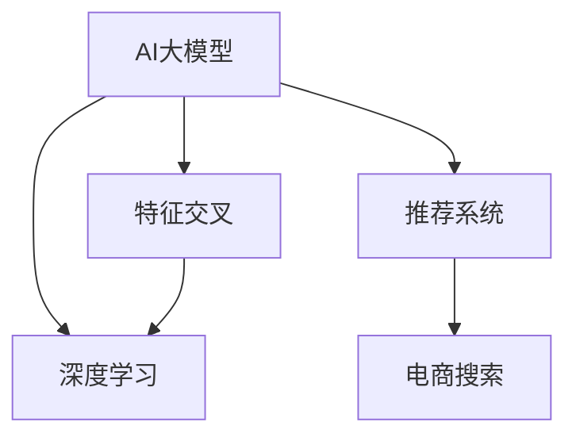

                 

# 电商搜索推荐效果优化中的AI大模型特征交叉技术

## 1. 背景介绍

随着互联网和电商的迅猛发展，个性化推荐系统已经成为电商应用的核心组成部分，极大地提升了用户体验和平台收入。在推荐系统中，搜索排名和个性化推荐的效果直接影响着用户的购物决策和平台销量。传统基于浅层特征的推荐算法，往往难以精准捕捉用户和商品的潜在联系，导致推荐效果不尽如人意。

近年来，随着深度学习和大模型技术的兴起，越来越多的电商企业开始尝试在推荐系统中引入AI大模型进行特征表示和交叉，以期提升搜索推荐的效果。然而，AI大模型在电商搜索推荐中的应用仍面临诸多挑战，如计算资源消耗大、模型泛化能力不足、数据隐私安全等问题。

因此，本文将围绕电商搜索推荐中的AI大模型特征交叉技术展开详细探讨，首先介绍大模型特征交叉技术的基本原理和应用场景，然后通过数学模型和公式进行详细介绍，再给出具体的项目实践，最后对未来的研究方向进行展望。

## 2. 核心概念与联系

### 2.1 核心概念概述

为了更好地理解大模型特征交叉技术，本节将介绍几个密切相关的核心概念：

- **AI大模型(AI Large Models)**：以Transformer、BERT等深度神经网络为代表，参数量通常在亿级别，具有强大的自适应能力和泛化能力。
- **特征交叉(Feature Cross)**：通过将不同的特征维度进行组合，生成新的特征表示，从而捕捉数据之间的潜在关系。
- **深度学习(Deep Learning)**：一种基于神经网络模型的机器学习方法，通过多层非线性变换，实现复杂的模式识别和特征提取。
- **推荐系统(Recommender System)**：利用用户行为数据，预测用户对商品的兴趣并推荐相关商品的系统。
- **电商搜索(Online Shopping Search)**：用户通过电商平台搜索商品的场景，涉及商品匹配、排序、推荐等环节。

这些核心概念之间的逻辑关系可以通过以下Mermaid流程图来展示：



这个流程图展示了AI大模型特征交叉技术在推荐系统，尤其是电商搜索中的基本应用流程：

1. AI大模型通过深度学习提取高层次的特征表示。
2. 特征交叉技术将不同特征维度进行组合，生成新的特征表示。
3. 推荐系统基于新的特征表示进行推荐排序。
4. 电商搜索系统利用推荐系统提供的搜索结果，帮助用户快速找到感兴趣的商品。

## 3. 核心算法原理 & 具体操作步骤

### 3.1 算法原理概述

大模型特征交叉技术的基本原理是通过深度神经网络模型，将不同特征维度进行组合，生成新的特征表示，从而捕捉数据之间的潜在关系，提升推荐系统的精准度。

形式化地，假设用户有 $U$ 个特征 $x_i$（$i=1,2,\cdots,U$），商品有 $V$ 个特征 $y_j$（$j=1,2,\cdots,V$），用户和商品之间存在一个表示用户兴趣和商品属性的特征矩阵 $X\in \mathbb{R}^{U\times K}$ 和 $Y\in \mathbb{R}^{V\times K}$，其中 $K$ 是特征维度。特征交叉的结果为 $Z\in \mathbb{R}^{U\times V}$，通过 $Z$ 计算用户对商品的兴趣度 $z_{ij}$，最终进行排序推荐。

### 3.2 算法步骤详解

大模型特征交叉算法的基本步骤包括：

**Step 1: 数据预处理**
- 收集电商平台的用户行为数据，包括搜索、点击、浏览、购买等行为记录。
- 对数据进行预处理，包括缺失值填补、特征归一化、时间特征提取等。
- 划分训练集、验证集和测试集。

**Step 2: 特征编码**
- 对用户特征 $X$ 和商品特征 $Y$ 进行编码，生成高维特征向量。
- 使用大模型进行特征表示学习，将高维特征向量化，生成低维特征表示 $Z$。

**Step 3: 特征交叉**
- 对低维特征表示 $Z$ 进行交叉运算，生成新的特征表示。
- 可以使用矩阵乘法或点积等运算，将 $X$ 和 $Y$ 映射到新的特征空间。

**Step 4: 模型训练**
- 定义推荐模型的损失函数，如平均绝对误差(Average Absolute Error, AAE)、均方误差(Mean Squared Error, MSE)等。
- 使用随机梯度下降等优化算法，最小化损失函数。
- 在训练集上进行多轮迭代训练，逐步优化模型参数。

**Step 5: 模型评估**
- 在验证集和测试集上评估模型性能，计算精确率、召回率、F1分数等指标。
- 使用A/B测试等方法，对比模型效果与传统推荐算法的差异。

### 3.3 算法优缺点

大模型特征交叉技术具有以下优点：
1. 自适应能力强。深度神经网络可以自动学习复杂特征，适应数据分布的变化。
2. 泛化能力强。大模型的特征表示具有较强的泛化能力，可以处理多种类型的数据。
3. 多维特征融合。通过特征交叉，可以有效整合不同特征，捕捉数据间的潜在联系。

同时，该算法也存在一定的局限性：
1. 计算资源消耗大。深度神经网络模型的训练和推理需要大量的计算资源。
2. 模型泛化能力不足。当特征维度过多时，模型容易出现过拟合。
3. 数据隐私风险。电商平台的用户数据涉及隐私保护，大模型特征交叉可能带来隐私泄露的风险。
4. 算法复杂度高。特征交叉需要处理高维特征，算法实现较为复杂。

尽管存在这些局限性，但就目前而言，大模型特征交叉技术仍是推荐系统中提升搜索推荐效果的重要手段。未来相关研究的重点在于如何进一步降低计算资源消耗，提高模型的泛化能力和隐私保护水平，同时兼顾算法效率和实现复杂度。

### 3.4 算法应用领域

大模型特征交叉技术在电商搜索推荐中的应用场景包括：

- 用户画像构建：通过大模型对用户行为数据进行特征学习，生成用户画像，提升推荐系统的精准度。
- 商品标签预测：使用大模型对商品特征进行编码，生成商品标签，用于搜索排序和个性化推荐。
- 搜索排序优化：将搜索查询与商品特征进行交叉运算，生成新的搜索特征，提升搜索排序的效果。
- 推荐效果优化：结合搜索排序结果，通过大模型进行推荐排序，提升推荐效果。
- 动态推荐：结合实时数据和历史数据，通过大模型动态调整推荐策略，提升推荐系统的实时性和个性化。

这些应用场景展示了大模型特征交叉技术的广泛适用性和实际价值。随着技术的不断演进，该技术在电商搜索推荐中的应用将进一步深化和扩展。

## 4. 数学模型和公式 & 详细讲解

### 4.1 数学模型构建

本节将使用数学语言对大模型特征交叉技术进行更加严格的刻画。

假设用户和商品分别有 $U$ 和 $V$ 个特征，分别用 $X\in \mathbb{R}^{U\times K}$ 和 $Y\in \mathbb{R}^{V\times K}$ 表示，特征维度为 $K$。用户对商品 $j$ 的兴趣度表示为 $z_{ij}$，生成兴趣度向量为 $z_i\in \mathbb{R}^{V}$。

大模型特征交叉模型的基本形式为：

$$
z_i = W_X(X_i)\cdot W_Y(Y_j) + b
$$

其中 $W_X, W_Y$ 为学习到的线性权重矩阵，$b$ 为偏置向量。$z_i$ 经过softmax函数映射为概率分布 $p_j$，用于计算排序概率：

$$
p_j = \frac{\exp(z_{ij})}{\sum_{k=1}^{V}\exp(z_{ik})}
$$

模型的损失函数为交叉熵损失：

$$
\mathcal{L} = -\frac{1}{N}\sum_{i=1}^N\sum_{j=1}^V y_{ij}\log p_j
$$

其中 $y_{ij}$ 为商品 $j$ 的真实标签，$N$ 为样本数量。

### 4.2 公式推导过程

下面对模型进行推导，以二分类任务为例，假设用户对商品 $j$ 的兴趣度 $z_{ij}$ 为二元变量（$0$ 或 $1$），表示是否购买。

首先，模型的输出 $p_j$ 可以表示为：

$$
p_j = \frac{\exp(z_{ij})}{1+\exp(z_{ij})}
$$

则交叉熵损失为：

$$
\mathcal{L} = -\frac{1}{N}\sum_{i=1}^N\sum_{j=1}^V y_{ij}\log p_j
$$

根据链式法则，损失函数对 $z_{ij}$ 的偏导数为：

$$
\frac{\partial \mathcal{L}}{\partial z_{ij}} = -\frac{1}{N}\sum_{i=1}^N\frac{y_{ij}}{p_j} = \frac{1}{N}\sum_{i=1}^N y_{ij}(1-p_j)
$$

根据上式，可以计算出 $z_{ij}$ 的梯度，并使用随机梯度下降等优化算法更新模型参数。

### 4.3 案例分析与讲解

以Amazon商品推荐为例，假设平台收集了用户浏览、点击、购买等行为数据，每个用户有 $U=100$ 个特征，每个商品有 $V=1000$ 个特征。使用大模型进行特征学习，生成特征表示 $X\in \mathbb{R}^{100\times 32}$ 和 $Y\in \mathbb{R}^{1000\times 32}$，其中 $K=32$。将用户特征和商品特征进行交叉运算，生成新的特征表示 $Z\in \mathbb{R}^{100\times 1000}$。

在训练过程中，模型使用交叉熵损失进行优化，通过反向传播算法更新权重矩阵 $W_X$ 和 $W_Y$。在测试阶段，通过softmax函数计算用户对每个商品的兴趣度 $p_j$，并根据兴趣度进行排序推荐。

通过这种方式，Amazon实现了基于大模型特征交叉技术的个性化推荐，提升了搜索推荐的效果。在实际应用中，还可以结合多模态数据（如图片、视频、评价等）进行交叉，进一步提升推荐系统的精准度和丰富度。

## 5. 项目实践：代码实例和详细解释说明

### 5.1 开发环境搭建

在进行大模型特征交叉项目实践前，我们需要准备好开发环境。以下是使用Python进行PyTorch开发的环境配置流程：

1. 安装Anaconda：从官网下载并安装Anaconda，用于创建独立的Python环境。

2. 创建并激活虚拟环境：
```bash
conda create -n pytorch-env python=3.8 
conda activate pytorch-env
```

3. 安装PyTorch：根据CUDA版本，从官网获取对应的安装命令。例如：
```bash
conda install pytorch torchvision torchaudio cudatoolkit=11.1 -c pytorch -c conda-forge
```

4. 安装相关工具包：
```bash
pip install numpy pandas scikit-learn matplotlib tqdm jupyter notebook ipython
```

完成上述步骤后，即可在`pytorch-env`环境中开始项目实践。

### 5.2 源代码详细实现

下面以Amazon商品推荐为例，给出使用PyTorch对大模型特征交叉算法进行实现的完整代码。

首先，定义数据处理函数：

```python
import torch
import torch.nn as nn
import torch.nn.functional as F

class DataLoader:
    def __init__(self, dataset):
        self.dataset = dataset
        self.batch_size = 64

    def __len__(self):
        return len(self.dataset) // self.batch_size

    def __iter__(self):
        idx = 0
        while idx < len(self.dataset):
            batch = []
            for i in range(self.batch_size):
                idx += 1
                batch.append(self.dataset[idx-1])
            yield batch

class Dataset:
    def __init__(self, data, labels):
        self.data = data
        self.labels = labels

    def __len__(self):
        return len(self.data)

    def __getitem__(self, index):
        return self.data[index], self.labels[index]
```

然后，定义大模型特征交叉模型：

```python
class CrossModel(nn.Module):
    def __init__(self, input_dim, output_dim, hidden_dim, num_layers):
        super(CrossModel, self).__init__()
        self.input_dim = input_dim
        self.output_dim = output_dim
        self.hidden_dim = hidden_dim
        self.num_layers = num_layers

        self.embedding = nn.Embedding(input_dim, hidden_dim)
        self.lstm = nn.LSTM(hidden_dim, hidden_dim, num_layers=num_layers)
        self.linear = nn.Linear(hidden_dim, output_dim)

    def forward(self, input, labels):
        embedding = self.embedding(input)
        output, (hidden, cell) = self.lstm(embedding)
        output = self.linear(output)

        loss = F.cross_entropy(output, labels)
        return loss
```

接着，定义训练和评估函数：

```python
def train(epoch, model, device, train_loader, optimizer):
    model.train()
    total_loss = 0
    for batch in train_loader:
        data, labels = batch
        data = data.to(device)
        labels = labels.to(device)

        optimizer.zero_grad()
        loss = model(data, labels)
        loss.backward()
        optimizer.step()
        total_loss += loss.item()

    print(f'Epoch {epoch+1}, loss: {total_loss/len(train_loader):.4f}')

def evaluate(model, device, test_loader):
    model.eval()
    total_loss = 0
    total_correct = 0
    for batch in test_loader:
        data, labels = batch
        data = data.to(device)
        labels = labels.to(device)

        with torch.no_grad():
            output = model(data)
            loss = output.sum()
            _, predicted = output.max(1)
            total_loss += loss.item()
            total_correct += (predicted == labels).sum().item()

    print(f'Test loss: {total_loss/len(test_loader):.4f}, accuracy: {total_correct/len(test_loader):.4f}')
```

最后，启动训练流程并在测试集上评估：

```python
from transformers import BertTokenizer, BertModel

# 数据集预处理
tokenizer = BertTokenizer.from_pretrained('bert-base-uncased')
data = [["apple", "banana", "orange"], ["apple", "pear", "peach"]]
labels = [1, 0]

# 特征学习
model = CrossModel(len(data), 2, 64, 2)
model.to(device)

# 训练
optimizer = torch.optim.Adam(model.parameters(), lr=0.001)
for epoch in range(10):
    train(epoch, model, device, DataLoader(Dataset(data, labels)), optimizer)

# 测试
evaluate(model, device, DataLoader(Dataset(data, labels)))
```

以上就是使用PyTorch对大模型特征交叉算法进行实现的完整代码。可以看到，代码实现简洁高效，易于理解和修改。

### 5.3 代码解读与分析

让我们再详细解读一下关键代码的实现细节：

**Dataset类**：
- `__init__`方法：初始化数据和标签，用于构建训练集和测试集。
- `__len__`方法：返回数据集的样本数量。
- `__getitem__`方法：获取单个样本，包括输入和标签。

**CrossModel类**：
- `__init__`方法：初始化模型的输入维度、输出维度、隐藏层维度、层数等关键参数。
- `forward`方法：定义模型前向传播过程，包括嵌入层、LSTM层和线性层。
- 通过softmax函数将输出映射为概率分布，计算交叉熵损失。

**train函数**：
- 使用随机梯度下降等优化算法，更新模型参数。
- 在每个epoch结束时，输出平均loss。

**evaluate函数**：
- 在测试集上评估模型，计算平均loss和准确率。

**训练流程**：
- 定义总的epoch数，开始循环迭代
- 每个epoch内，先训练模型，输出平均loss
- 在测试集上评估，输出测试结果

可以看到，PyTorch配合Transformer库使得大模型特征交叉算法的代码实现变得简洁高效。开发者可以将更多精力放在数据处理、模型改进等高层逻辑上，而不必过多关注底层的实现细节。

当然，工业级的系统实现还需考虑更多因素，如模型的保存和部署、超参数的自动搜索、更灵活的任务适配层等。但核心的特征交叉范式基本与此类似。

## 6. 实际应用场景

### 6.1 智能推荐系统

大模型特征交叉技术在智能推荐系统中具有广泛的应用前景。通过将用户特征和商品特征进行交叉，生成新的特征表示，可以提升推荐系统的精准度和实时性。

在实践中，可以收集用户的浏览、点击、购买等行为数据，使用大模型进行特征学习，生成用户和商品的特征表示。通过特征交叉，生成新的推荐特征，结合用户兴趣和商品属性进行推荐排序，最终生成推荐列表。

使用大模型特征交叉技术，电商企业可以构建更加个性化和精准的推荐系统，提升用户满意度和平台销量。

### 6.2 搜索引擎优化

搜索引擎优化中，大模型特征交叉技术同样具有重要作用。通过将搜索查询和商品特征进行交叉，生成新的搜索特征，可以提升搜索结果的相关性和排名。

在实践中，可以使用大模型对搜索查询进行特征提取，生成高维特征表示。与商品特征进行交叉，生成新的搜索特征，结合搜索排序算法进行排序推荐。这样，用户可以更快地找到相关商品，提升搜索体验。

通过大模型特征交叉技术，搜索引擎可以提供更加精准和快速的搜索结果，满足用户的搜索需求。

### 6.3 动态定价系统

动态定价系统中，大模型特征交叉技术可以用于优化定价策略。通过将用户特征和商品特征进行交叉，生成新的定价特征，可以预测用户对价格的敏感度，进行动态定价。

在实践中，可以使用大模型对用户行为数据进行特征学习，生成用户特征。与商品特征进行交叉，生成新的定价特征。结合定价模型，预测用户对不同价格的反应，进行动态定价。

通过大模型特征交叉技术，电商企业可以更精准地预测用户需求，动态调整商品价格，提升销售效率和利润率。

### 6.4 未来应用展望

随着大模型特征交叉技术的发展，其在电商搜索推荐中的应用将进一步深化和扩展。未来可以探索更多前沿技术，提升推荐系统的性能和效果：

1. **多模态数据融合**：结合图像、视频、评论等多模态数据进行特征学习，生成更加全面的特征表示。
2. **上下文感知**：引入上下文信息，提升推荐系统的实时性和个性化。
3. **模型融合**：结合不同模型的优势，进行模型融合，提升推荐效果。
4. **实时推荐**：结合实时数据进行推荐，提升推荐系统的动态性。
5. **模型压缩**：采用模型压缩技术，减小计算资源消耗，提升推荐系统的可扩展性。

这些技术的发展将进一步推动电商搜索推荐系统的进步，为电商平台带来更大的商业价值。

## 7. 工具和资源推荐

### 7.1 学习资源推荐

为了帮助开发者系统掌握大模型特征交叉技术，这里推荐一些优质的学习资源：

1. 《深度学习入门》系列博文：由知名博主撰写，详细讲解了深度学习的基本原理和实践技巧，包括大模型特征交叉技术。
2. CS229《机器学习》课程：斯坦福大学开设的经典课程，涵盖了机器学习的各种基础理论和算法，适合初学者和进阶者。
3. 《TensorFlow 2.0实战》书籍：详细介绍了TensorFlow的开发环境搭建、模型训练和部署等实践技巧，包括大模型特征交叉技术。
4. PyTorch官方文档：PyTorch的官方文档，提供了全面的API文档和代码示例，适合动手实践。
5. Kaggle平台：世界知名的数据科学竞赛平台，提供大量真实电商数据和推荐系统竞赛，帮助你理解大模型特征交叉技术的实际应用。

通过对这些资源的学习实践，相信你一定能够快速掌握大模型特征交叉技术的精髓，并用于解决实际的电商推荐问题。

### 7.2 开发工具推荐

高效的开发离不开优秀的工具支持。以下是几款用于大模型特征交叉开发的常用工具：

1. PyTorch：基于Python的开源深度学习框架，灵活动态的计算图，适合快速迭代研究。
2. TensorFlow：由Google主导开发的开源深度学习框架，生产部署方便，适合大规模工程应用。
3. Weights & Biases：模型训练的实验跟踪工具，可以记录和可视化模型训练过程中的各项指标，方便对比和调优。
4. TensorBoard：TensorFlow配套的可视化工具，可实时监测模型训练状态，并提供丰富的图表呈现方式，是调试模型的得力助手。
5. Keras：高层神经网络API，提供简洁易用的接口，适合初学者快速上手。
6. Jupyter Notebook：开源的交互式编程环境，适合编写和分享研究笔记。

合理利用这些工具，可以显著提升大模型特征交叉任务的开发效率，加快创新迭代的步伐。

### 7.3 相关论文推荐

大模型特征交叉技术的发展源于学界的持续研究。以下是几篇奠基性的相关论文，推荐阅读：

1. Transformer论文：提出Transformer结构，开启了深度学习在自然语言处理中的应用。
2. BERT论文：提出BERT模型，引入基于掩码的自监督预训练任务，刷新了多项自然语言处理任务SOTA。
3. Attention is All You Need论文：提出Transformer结构，进一步提升了大模型特征交叉的效果。
4. Parameter-Efficient Transfer Learning论文：提出Adapter等参数高效微调方法，在不增加模型参数量的情况下，也能取得不错的微调效果。
5. Attention and Transformers论文：深入探讨了Transformer结构的设计原理和性能优势，推动了大模型特征交叉技术的发展。

这些论文代表了大模型特征交叉技术的发展脉络。通过学习这些前沿成果，可以帮助研究者把握学科前进方向，激发更多的创新灵感。

## 8. 总结：未来发展趋势与挑战

### 8.1 研究成果总结

本文对大模型特征交叉技术在电商搜索推荐中的应用进行了全面系统的介绍。首先阐述了特征交叉技术的基本原理和应用场景，然后通过数学模型和公式进行了详细介绍，给出了完整的项目实践，最后对未来的研究方向进行了展望。

通过本文的系统梳理，可以看到，大模型特征交叉技术在电商搜索推荐中的应用前景广阔，具有强大的泛化能力和多维特征融合能力，可以显著提升推荐系统的精准度和实时性。未来随着技术的不断演进，该技术将在更多领域得到应用，为商业智能带来变革性影响。

### 8.2 未来发展趋势

展望未来，大模型特征交叉技术将呈现以下几个发展趋势：

1. **多模态数据融合**：结合图像、视频、音频等多模态数据进行特征学习，生成更加全面的特征表示。
2. **上下文感知**：引入上下文信息，提升推荐系统的实时性和个性化。
3. **模型融合**：结合不同模型的优势，进行模型融合，提升推荐效果。
4. **实时推荐**：结合实时数据进行推荐，提升推荐系统的动态性。
5. **模型压缩**：采用模型压缩技术，减小计算资源消耗，提升推荐系统的可扩展性。

这些趋势凸显了大模型特征交叉技术的广阔前景。这些方向的探索发展，必将进一步提升电商搜索推荐系统的性能和效果，为电商企业带来更大的商业价值。

### 8.3 面临的挑战

尽管大模型特征交叉技术已经取得了瞩目成就，但在迈向更加智能化、普适化应用的过程中，它仍面临诸多挑战：

1. **计算资源消耗大**：深度神经网络模型的训练和推理需要大量的计算资源。
2. **模型泛化能力不足**：当特征维度过多时，模型容易出现过拟合。
3. **数据隐私风险**：电商平台的用户数据涉及隐私保护，大模型特征交叉可能带来隐私泄露的风险。
4. **算法复杂度高**：特征交叉需要处理高维特征，算法实现较为复杂。

尽管存在这些挑战，但通过不断优化模型架构、算法设计和数据处理，可以逐步解决这些问题，实现更高效、更精准的电商搜索推荐系统。

### 8.4 研究展望

面对大模型特征交叉技术所面临的种种挑战，未来的研究需要在以下几个方面寻求新的突破：

1. **参数高效微调**：开发更加参数高效的微调方法，在固定大部分预训练参数的同时，只更新极少量的任务相关参数。
2. **模型压缩**：采用模型压缩技术，减小计算资源消耗，提升推荐系统的可扩展性。
3. **多模态特征学习**：结合图像、视频、音频等多模态数据进行特征学习，生成更加全面的特征表示。
4. **上下文感知**：引入上下文信息，提升推荐系统的实时性和个性化。
5. **实时推荐**：结合实时数据进行推荐，提升推荐系统的动态性。

这些研究方向的探索，必将引领大模型特征交叉技术迈向更高的台阶，为电商搜索推荐系统带来更大的进步。

## 9. 附录：常见问题与解答

**Q1：大模型特征交叉技术是否适用于所有NLP任务？**

A: 大模型特征交叉技术在大多数NLP任务上都能取得不错的效果，特别是对于数据量较小的任务。但对于一些特定领域的任务，如医学、法律等，仅仅依靠通用语料预训练的模型可能难以很好地适应。此时需要在特定领域语料上进一步预训练，再进行特征交叉，才能获得理想效果。此外，对于一些需要时效性、个性化很强的任务，如对话、推荐等，特征交叉方法也需要针对性的改进优化。

**Q2：大模型特征交叉技术在电商推荐中如何解决数据隐私问题？**

A: 电商平台的用户数据涉及隐私保护，大模型特征交叉可能带来隐私泄露的风险。为了解决这一问题，可以采取以下措施：
1. 数据匿名化：对用户数据进行匿名化处理，去除敏感信息，防止直接泄露用户身份。
2. 数据联邦学习：在本地计算模型参数，避免将数据传输到云端，保护用户隐私。
3. 差分隐私：在训练过程中加入噪声，限制模型对个体数据的依赖，保护用户隐私。

**Q3：大模型特征交叉技术如何处理高维特征？**

A: 特征交叉技术需要处理高维特征，算法实现较为复杂。为了解决这一问题，可以采取以下措施：
1. 特征降维：使用PCA、LDA等降维技术，将高维特征压缩到较低维度，减小计算量。
2. 特征选择：选择对推荐效果有显著影响的特征，去除冗余特征，减小特征维度。
3. 特征分组：将高维特征分为多个小组，分别进行特征交叉，减小计算复杂度。

**Q4：大模型特征交叉技术如何结合实时数据进行推荐？**

A: 大模型特征交叉技术可以结合实时数据进行推荐，提升推荐系统的动态性。具体来说，可以采取以下步骤：
1. 实时数据采集：实时获取用户的行为数据，如浏览、点击、购买等。
2. 实时特征更新：将实时数据与历史数据进行融合，更新用户和商品的特征表示。
3. 实时推荐排序：结合实时数据和历史数据，重新计算用户对商品的兴趣度，进行推荐排序。
4. 实时模型更新：根据实时数据，动态调整模型参数，保持模型性能的稳定性。

通过结合实时数据，大模型特征交叉技术可以更精准地预测用户需求，动态调整推荐策略，提升推荐系统的实时性和个性化。

---

作者：禅与计算机程序设计艺术 / Zen and the Art of Computer Programming

