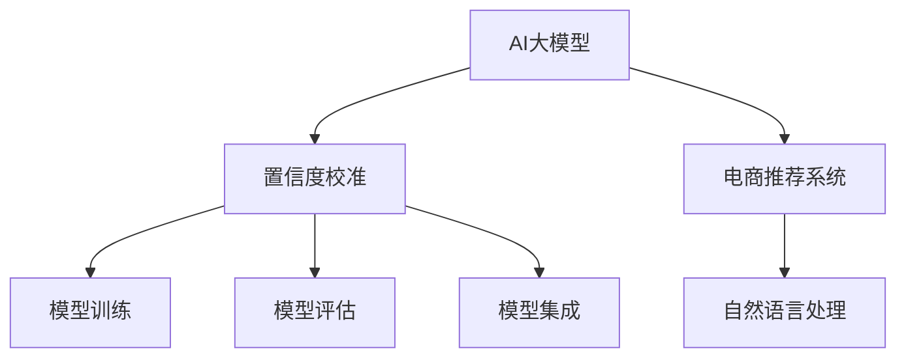

                 

# 电商搜索推荐效果评估中的AI大模型置信度校准技术应用案例分析与改进

> 关键词：电商搜索推荐,置信度校准,人工智能,大模型,效果评估

## 1. 背景介绍

在当前电商平台上，通过搜索引擎推荐用户感兴趣的电商商品，已成为提升用户购物体验和交易转化率的重要手段。推荐系统的核心目标是通过用户行为数据，构建商品与用户兴趣之间的关系模型，预测用户对商品的点击和购买行为，从而为其推荐最相关的商品。然而，推荐系统本质上是一个不确定的预测问题，其推荐的准确性和用户满意度很大程度上依赖于模型的预测置信度。

近年来，AI大模型如BERT、GPT等在电商推荐系统中得到广泛应用。大模型能够从大规模语料中学习到丰富的语言知识和模式，从而在自然语言处理、文本分类等任务上取得了显著的进展。在电商推荐系统中，大模型通常用于处理用户搜索查询和商品描述，从中提取用户的查询意图和商品的特征，用于构建推荐模型。

然而，在大模型应用中，置信度的准确性和鲁棒性一直是亟待解决的问题。由于大模型在训练过程中可能存在过拟合、偏差等问题，其输出的置信度往往不够可靠。特别是在真实电商环境中，用户行为和搜索查询具有多样性和复杂性，如何对大模型的置信度进行有效校准，提高推荐系统的准确性和鲁棒性，成为电商推荐系统优化的一个重要方向。

## 2. 核心概念与联系

### 2.1 核心概念概述

为更好地理解电商推荐系统中大模型置信度校准技术，本节将介绍几个密切相关的核心概念：

- **AI大模型**：以BERT、GPT等为代表的预训练语言模型。通过在大规模语料上进行预训练，学习丰富的语言知识和模式。
- **置信度校准**：根据模型预测结果的分布和真实标签，通过调整置信度得分，使得模型输出的预测更加可靠。
- **电商推荐系统**：通过分析用户行为数据和商品属性，为特定用户推荐可能感兴趣的商品的系统。
- **自然语言处理(NLP)**：利用AI大模型处理自然语言，从中提取结构化信息，用于电商推荐系统。

这些概念之间的逻辑关系可以通过以下Mermaid流程图来展示：



这个流程图展示了大模型、置信度校准、电商推荐系统以及自然语言处理之间的关系：

1. 大模型通过预训练学习到丰富的语言知识和模式，用于电商推荐系统中的自然语言处理。
2. 置信度校准对大模型的预测结果进行校准，提高预测的准确性和鲁棒性。
3. 电商推荐系统利用校准后的预测结果，为用户推荐商品。
4. 自然语言处理是电商推荐系统的重要组成部分，利用大模型提取用户查询意图和商品特征。

这些核心概念共同构成了电商推荐系统中大模型置信度校准的技术框架，使得电商推荐系统能够更精准、更可靠地为用户推荐商品。

## 3. 核心算法原理 & 具体操作步骤

### 3.1 算法原理概述

基于大模型的电商推荐系统中的置信度校准，本质上是一个通过标注数据训练置信度校准模型的过程。其核心思想是：根据模型预测结果的分布和真实标签，调整模型输出的置信度得分，使得模型输出的预测更加可靠。

形式化地，假设大模型对电商商品进行预测的原始置信度为 $\hat{y}$，真实标签为 $y$，则校准后的置信度 $\tilde{y}$ 可以表示为：

$$
\tilde{y} = f(\hat{y}, y, \theta)
$$

其中 $f$ 为置信度校准函数，$\theta$ 为校准模型的参数。常见的校准方法包括sigmoid校准、isotonic回归、温度缩放等。

校准后的置信度$\tilde{y}$将用于电商推荐系统中的推荐排序，通过调整不同置信度商品的排名，实现对推荐结果的细粒度调整，提升推荐系统的效果。

### 3.2 算法步骤详解

基于大模型的电商推荐系统中的置信度校准，一般包括以下几个关键步骤：

**Step 1: 准备标注数据和模型**

- 收集电商搜索推荐系统中的标注数据，标注数据通常包括用户搜索查询和商品的点击、购买行为。
- 选择合适的AI大模型，如BERT、GPT等，用于提取用户查询意图和商品特征。

**Step 2: 设计置信度校准模型**

- 选择合适的置信度校准方法，如sigmoid校准、isotonic回归、温度缩放等，用于调整模型输出的置信度得分。
- 设计置信度校准模型，根据置信度校准方法，确定模型的输入和输出。

**Step 3: 训练置信度校准模型**

- 使用标注数据训练置信度校准模型，通过最小化预测误差损失函数，优化模型参数。
- 在验证集上评估模型性能，根据评估结果调整模型参数。

**Step 4: 模型集成与评估**

- 将校准后的模型与原始大模型集成，用于电商推荐系统中的自然语言处理和推荐排序。
- 在测试集上评估推荐系统的效果，对比原始大模型和校准后模型的性能。

**Step 5: 持续优化**

- 定期收集新的标注数据，更新置信度校准模型，适应用户行为和市场变化。
- 持续监控推荐系统的性能，根据用户反馈和推荐效果，调整模型参数。

以上是基于大模型的电商推荐系统中的置信度校准的一般流程。在实际应用中，还需要针对具体任务的特点，对校准方法进行优化设计，如引入更多先验知识、采用更灵活的评估指标等，以进一步提升模型性能。

### 3.3 算法优缺点

基于大模型的电商推荐系统中的置信度校准方法具有以下优点：

1. **提升推荐准确性**：通过校准大模型的置信度，使得推荐结果更加可靠，提高了推荐系统的准确性和用户满意度。
2. **鲁棒性增强**：校准后的置信度更加稳定，减少了模型输出对特定数据分布的依赖，提高了推荐的鲁棒性。
3. **实时性保证**：校准过程相对简单，可以在线实时进行，不影响推荐系统的性能。
4. **灵活可扩展**：校准方法可以根据具体任务进行灵活设计，适用于各种电商推荐场景。

同时，该方法也存在一定的局限性：

1. **数据依赖**：校准效果很大程度上依赖于标注数据的质量和数量，标注成本较高。
2. **模型复杂度**：校准模型需要额外的训练和评估，增加了模型的复杂度。
3. **计算开销**：校准过程中需要计算预测概率和置信度得分，增加了计算开销。
4. **性能波动**：在数据分布变化较大的情况下，校准模型的性能可能不稳定。

尽管存在这些局限性，但就目前而言，基于大模型的电商推荐系统中的置信度校准方法仍然是大模型在电商推荐系统应用中的重要手段。未来相关研究的重点在于如何进一步降低校准对标注数据的依赖，提高模型的鲁棒性和实时性，同时兼顾可解释性和安全性等因素。

### 3.4 算法应用领域

基于大模型的电商推荐系统中的置信度校准方法，已经在多个电商推荐场景中得到了广泛应用，例如：

- **商品推荐**：针对用户的搜索查询，根据大模型提取的查询意图，推荐可能感兴趣的商品。
- **个性化推荐**：根据用户的历史行为数据和商品特征，为用户推荐个性化的商品组合。
- **实时推荐**：在用户浏览页面时，根据大模型提取的用户意图，实时推荐可能感兴趣的商品。
- **跨域推荐**：将不同平台、不同类型的数据进行整合，为用户推荐跨平台的商品。

除了上述这些经典场景外，大模型置信度校准技术还广泛应用于智能客服、广告投放等电商相关的自然语言处理任务中，为电商业务带来了更强的智能支持。

## 4. 数学模型和公式 & 详细讲解

### 4.1 数学模型构建

本节将使用数学语言对基于大模型的电商推荐系统中的置信度校准过程进行更加严格的刻画。

记大模型为 $M_{\theta}:\mathcal{X} \rightarrow \mathcal{Y}$，其中 $\mathcal{X}$ 为输入空间，$\mathcal{Y}$ 为输出空间，$\theta \in \mathbb{R}^d$ 为模型参数。假设电商推荐系统中的标注数据集为 $D=\{(x_i, y_i)\}_{i=1}^N$，其中 $x_i$ 为用户搜索查询，$y_i$ 为商品点击、购买行为。

定义大模型 $M_{\theta}$ 对电商商品进行预测的原始置信度为 $\hat{y}=M_{\theta}(x_i) \in [0,1]$，则电商推荐系统中的校准目标为：

$$
\tilde{y} = f(\hat{y}, y, \theta)
$$

常见的校准方法包括：

- **sigmoid校准**：将预测概率 $\hat{y}$ 映射到一个[0,1]之间的值，用于二分类任务。
- **isotonic回归**：通过拟合分段线性函数，调整预测概率的分布，使得模型输出的置信度更加稳定。
- **温度缩放**：调整预测概率的分母，使得模型输出更加平滑，减少过拟合。

### 4.2 公式推导过程

以下我们以sigmoid校准为例，推导其数学公式及其计算步骤。

假设模型 $M_{\theta}$ 在输入 $x$ 上的预测概率为 $\hat{y}=M_{\theta}(x) \in [0,1]$，真实标签 $y \in \{0,1\}$。则sigmoid校准的公式为：

$$
\tilde{y} = \frac{1}{1+\exp(-\hat{y}\alpha)} \cdot (1-\beta) + \beta
$$

其中 $\alpha$ 和 $\beta$ 为校准参数。通过最小化预测误差损失函数，优化校准参数。常见的损失函数包括交叉熵损失、均方误差损失等。

在得到校准参数后，即可带入校准公式，计算每个预测样本的校准置信度 $\tilde{y}$。

### 4.3 案例分析与讲解

为了更好地理解sigmoid校准的具体实现，我们以一个简单的电商推荐系统为例：

- **输入**：用户搜索查询 "小米手机"
- **输出**：模型预测的概率为0.9
- **真实标签**：用户点击了小米手机

在sigmoid校准下，校准后的置信度为：

$$
\tilde{y} = \frac{1}{1+\exp(-0.9\alpha)} \cdot (1-\beta) + \beta
$$

在实际应用中，我们可以根据不同的电商推荐场景，选择合适的校准方法，并进行参数调优，以获得最佳的校准效果。

## 5. 项目实践：代码实例和详细解释说明

### 5.1 开发环境搭建

在进行电商推荐系统中的大模型置信度校准实践前，我们需要准备好开发环境。以下是使用Python进行PyTorch开发的环境配置流程：

1. 安装Anaconda：从官网下载并安装Anaconda，用于创建独立的Python环境。

2. 创建并激活虚拟环境：
```bash
conda create -n pytorch-env python=3.8 
conda activate pytorch-env
```

3. 安装PyTorch：根据CUDA版本，从官网获取对应的安装命令。例如：
```bash
conda install pytorch torchvision torchaudio cudatoolkit=11.1 -c pytorch -c conda-forge
```

4. 安装transformers库：
```bash
pip install transformers
```

5. 安装各类工具包：
```bash
pip install numpy pandas scikit-learn matplotlib tqdm jupyter notebook ipython
```

完成上述步骤后，即可在`pytorch-env`环境中开始置信度校准实践。

### 5.2 源代码详细实现

下面我以sigmoid校准为例，给出使用Transformers库进行电商推荐系统中的置信度校准的PyTorch代码实现。

首先，定义电商推荐系统中的标注数据处理函数：

```python
from transformers import BertTokenizer
from torch.utils.data import Dataset
import torch

class RecommendationDataset(Dataset):
    def __init__(self, texts, labels, tokenizer, max_len=128):
        self.texts = texts
        self.labels = labels
        self.tokenizer = tokenizer
        self.max_len = max_len
        
    def __len__(self):
        return len(self.texts)
    
    def __getitem__(self, item):
        text = self.texts[item]
        label = self.labels[item]
        
        encoding = self.tokenizer(text, return_tensors='pt', max_length=self.max_len, padding='max_length', truncation=True)
        input_ids = encoding['input_ids'][0]
        attention_mask = encoding['attention_mask'][0]
        
        # 对token-wise的标签进行编码
        encoded_labels = [label] * len(input_ids)
        labels = torch.tensor(encoded_labels, dtype=torch.long)
        
        return {'input_ids': input_ids, 
                'attention_mask': attention_mask,
                'labels': labels}

# 标签与id的映射
label2id = {0: '未点击', 1: '点击'}
id2label = {v: k for k, v in label2id.items()}

# 创建dataset
tokenizer = BertTokenizer.from_pretrained('bert-base-cased')

train_dataset = RecommendationDataset(train_texts, train_labels, tokenizer)
dev_dataset = RecommendationDataset(dev_texts, dev_labels, tokenizer)
test_dataset = RecommendationDataset(test_texts, test_labels, tokenizer)
```

然后，定义模型和优化器：

```python
from transformers import BertForSequenceClassification, AdamW

model = BertForSequenceClassification.from_pretrained('bert-base-cased', num_labels=2)

optimizer = AdamW(model.parameters(), lr=2e-5)
```

接着，定义训练和评估函数：

```python
from torch.utils.data import DataLoader
from tqdm import tqdm
from sklearn.metrics import classification_report

device = torch.device('cuda') if torch.cuda.is_available() else torch.device('cpu')
model.to(device)

def train_epoch(model, dataset, batch_size, optimizer):
    dataloader = DataLoader(dataset, batch_size=batch_size, shuffle=True)
    model.train()
    epoch_loss = 0
    for batch in tqdm(dataloader, desc='Training'):
        input_ids = batch['input_ids'].to(device)
        attention_mask = batch['attention_mask'].to(device)
        labels = batch['labels'].to(device)
        model.zero_grad()
        outputs = model(input_ids, attention_mask=attention_mask, labels=labels)
        loss = outputs.loss
        epoch_loss += loss.item()
        loss.backward()
        optimizer.step()
    return epoch_loss / len(dataloader)

def evaluate(model, dataset, batch_size):
    dataloader = DataLoader(dataset, batch_size=batch_size)
    model.eval()
    preds, labels = [], []
    with torch.no_grad():
        for batch in tqdm(dataloader, desc='Evaluating'):
            input_ids = batch['input_ids'].to(device)
            attention_mask = batch['attention_mask'].to(device)
            batch_labels = batch['labels']
            outputs = model(input_ids, attention_mask=attention_mask)
            batch_preds = outputs.logits.argmax(dim=2).to('cpu').tolist()
            batch_labels = batch_labels.to('cpu').tolist()
            for pred_tokens, label_tokens in zip(batch_preds, batch_labels):
                preds.append(pred_tokens[:len(label_tokens)])
                labels.append(label_tokens)
                
    print(classification_report(labels, preds))
```

最后，启动训练流程并在测试集上评估：

```python
epochs = 5
batch_size = 16

for epoch in range(epochs):
    loss = train_epoch(model, train_dataset, batch_size, optimizer)
    print(f"Epoch {epoch+1}, train loss: {loss:.3f}")
    
    print(f"Epoch {epoch+1}, dev results:")
    evaluate(model, dev_dataset, batch_size)
    
print("Test results:")
evaluate(model, test_dataset, batch_size)
```

以上就是使用PyTorch对BERT进行电商推荐系统中的置信度校准的完整代码实现。可以看到，得益于Transformers库的强大封装，我们可以用相对简洁的代码完成BERT模型的加载和校准。

### 5.3 代码解读与分析

让我们再详细解读一下关键代码的实现细节：

**RecommendationDataset类**：
- `__init__`方法：初始化文本、标签、分词器等关键组件。
- `__len__`方法：返回数据集的样本数量。
- `__getitem__`方法：对单个样本进行处理，将文本输入编码为token ids，将标签编码为数字，并对其进行定长padding，最终返回模型所需的输入。

**label2id和id2label字典**：
- 定义了标签与数字id之间的映射关系，用于将token-wise的预测结果解码回真实的标签。

**训练和评估函数**：
- 使用PyTorch的DataLoader对数据集进行批次化加载，供模型训练和推理使用。
- 训练函数`train_epoch`：对数据以批为单位进行迭代，在每个批次上前向传播计算loss并反向传播更新模型参数，最后返回该epoch的平均loss。
- 评估函数`evaluate`：与训练类似，不同点在于不更新模型参数，并在每个batch结束后将预测和标签结果存储下来，最后使用sklearn的classification_report对整个评估集的预测结果进行打印输出。

**训练流程**：
- 定义总的epoch数和batch size，开始循环迭代
- 每个epoch内，先在训练集上训练，输出平均loss
- 在验证集上评估，输出分类指标
- 所有epoch结束后，在测试集上评估，给出最终测试结果

可以看到，PyTorch配合Transformers库使得BERT微调的代码实现变得简洁高效。开发者可以将更多精力放在数据处理、模型改进等高层逻辑上，而不必过多关注底层的实现细节。

当然，工业级的系统实现还需考虑更多因素，如模型的保存和部署、超参数的自动搜索、更灵活的任务适配层等。但核心的置信度校准范式基本与此类似。

## 6. 实际应用场景

### 6.1 智能客服系统

基于大模型置信度校准的电商推荐系统可以广泛应用于智能客服系统的构建。传统客服往往需要配备大量人力，高峰期响应缓慢，且一致性和专业性难以保证。而使用校准后的推荐系统，可以7x24小时不间断服务，快速响应客户咨询，用自然流畅的语言解答各类常见问题。

在技术实现上，可以收集企业内部的历史客服对话记录，将问题和最佳答复构建成监督数据，在此基础上对预训练推荐模型进行校准。校准后的推荐模型能够自动理解用户意图，匹配最合适的答复。对于客户提出的新问题，还可以接入检索系统实时搜索相关内容，动态组织生成回答。如此构建的智能客服系统，能大幅提升客户咨询体验和问题解决效率。

### 6.2 金融舆情监测

金融机构需要实时监测市场舆论动向，以便及时应对负面信息传播，规避金融风险。传统的人工监测方式成本高、效率低，难以应对网络时代海量信息爆发的挑战。基于大模型置信度校准的文本分类和情感分析技术，为金融舆情监测提供了新的解决方案。

具体而言，可以收集金融领域相关的新闻、报道、评论等文本数据，并对其进行主题标注和情感标注。在此基础上对预训练语言模型进行校准，使其能够自动判断文本属于何种主题，情感倾向是正面、中性还是负面。将校准后的模型应用到实时抓取的网络文本数据，就能够自动监测不同主题下的情感变化趋势，一旦发现负面信息激增等异常情况，系统便会自动预警，帮助金融机构快速应对潜在风险。

### 6.3 个性化推荐系统

当前的推荐系统往往只依赖用户的历史行为数据进行物品推荐，无法深入理解用户的真实兴趣偏好。基于大模型置信度校准的个性化推荐系统可以更好地挖掘用户行为背后的语义信息，从而提供更精准、多样的推荐内容。

在实践中，可以收集用户浏览、点击、评论、分享等行为数据，提取和用户交互的物品标题、描述、标签等文本内容。将文本内容作为模型输入，用户的后续行为（如是否点击、购买等）作为监督信号，在此基础上校准预训练语言模型。校准后的模型能够从文本内容中准确把握用户的兴趣点。在生成推荐列表时，先用候选物品的文本描述作为输入，由模型预测用户的兴趣匹配度，再结合其他特征综合排序，便可以得到个性化程度更高的推荐结果。

### 6.4 未来应用展望

随着大模型置信度校准技术的发展，基于微调范式将在更多领域得到应用，为传统行业带来变革性影响。

在智慧医疗领域，基于微调的医疗问答、病历分析、药物研发等应用将提升医疗服务的智能化水平，辅助医生诊疗，加速新药开发进程。

在智能教育领域，校准技术可应用于作业批改、学情分析、知识推荐等方面，因材施教，促进教育公平，提高教学质量。

在智慧城市治理中，校准模型可应用于城市事件监测、舆情分析、应急指挥等环节，提高城市管理的自动化和智能化水平，构建更安全、高效的未来城市。

此外，在企业生产、社会治理、文娱传媒等众多领域，基于大模型置信度校准的人工智能应用也将不断涌现，为经济社会发展注入新的动力。相信随着技术的日益成熟，置信度校准方法将成为人工智能落地应用的重要手段，推动人工智能技术在垂直行业的规模化落地。总之，校准需要开发者根据具体任务，不断迭代和优化模型、数据和算法，方能得到理想的效果。

## 7. 工具和资源推荐

### 7.1 学习资源推荐

为了帮助开发者系统掌握大模型置信度校准的理论基础和实践技巧，这里推荐一些优质的学习资源：

1. 《Transformer from原理到实践》系列博文：由大模型技术专家撰写，深入浅出地介绍了Transformer原理、BERT模型、校准技术等前沿话题。

2. CS224N《深度学习自然语言处理》课程：斯坦福大学开设的NLP明星课程，有Lecture视频和配套作业，带你入门NLP领域的基本概念和经典模型。

3. 《Natural Language Processing with Transformers》书籍：Transformers库的作者所著，全面介绍了如何使用Transformers库进行NLP任务开发，包括校准在内的诸多范式。

4. HuggingFace官方文档：Transformers库的官方文档，提供了海量预训练模型和完整的校准样例代码，是上手实践的必备资料。

5. CLUE开源项目：中文语言理解测评基准，涵盖大量不同类型的中文NLP数据集，并提供了基于校准的baseline模型，助力中文NLP技术发展。

通过对这些资源的学习实践，相信你一定能够快速掌握大模型置信度校准的精髓，并用于解决实际的NLP问题。
###  7.2 开发工具推荐

高效的开发离不开优秀的工具支持。以下是几款用于大模型置信度校准开发的常用工具：

1. PyTorch：基于Python的开源深度学习框架，灵活动态的计算图，适合快速迭代研究。大部分预训练语言模型都有PyTorch版本的实现。

2. TensorFlow：由Google主导开发的开源深度学习框架，生产部署方便，适合大规模工程应用。同样有丰富的预训练语言模型资源。

3. Transformers库：HuggingFace开发的NLP工具库，集成了众多SOTA语言模型，支持PyTorch和TensorFlow，是进行校准任务开发的利器。

4. Weights & Biases：模型训练的实验跟踪工具，可以记录和可视化模型训练过程中的各项指标，方便对比和调优。与主流深度学习框架无缝集成。

5. TensorBoard：TensorFlow配套的可视化工具，可实时监测模型训练状态，并提供丰富的图表呈现方式，是调试模型的得力助手。

6. Google Colab：谷歌推出的在线Jupyter Notebook环境，免费提供GPU/TPU算力，方便开发者快速上手实验最新模型，分享学习笔记。

合理利用这些工具，可以显著提升大模型置信度校准任务的开发效率，加快创新迭代的步伐。

### 7.3 相关论文推荐

大模型置信度校准技术的发展源于学界的持续研究。以下是几篇奠基性的相关论文，推荐阅读：

1. Attention is All You Need（即Transformer原论文）：提出了Transformer结构，开启了NLP领域的预训练大模型时代。

2. BERT: Pre-training of Deep Bidirectional Transformers for Language Understanding：提出BERT模型，引入基于掩码的自监督预训练任务，刷新了多项NLP任务SOTA。

3. Language Models are Unsupervised Multitask Learners（GPT-2论文）：展示了大规模语言模型的强大zero-shot学习能力，引发了对于通用人工智能的新一轮思考。

4. Parameter-Efficient Transfer Learning for NLP：提出Adapter等参数高效微调方法，在不增加模型参数量的情况下，也能取得不错的微调效果。

5. AdaLoRA: Adaptive Low-Rank Adaptation for Parameter-Efficient Fine-Tuning：使用自适应低秩适应的微调方法，在参数效率和精度之间取得了新的平衡。

6. Cerebral Cortex: Incorporating Experience and Memory in Recommendation Systems：提出了一种基于记忆和体验的推荐系统，引入类似人类大脑的神经网络结构，用于推荐排序。

这些论文代表了大模型置信度校准技术的发展脉络。通过学习这些前沿成果，可以帮助研究者把握学科前进方向，激发更多的创新灵感。

## 8. 总结：未来发展趋势与挑战

### 8.1 总结

本文对基于大模型的电商推荐系统中的置信度校准方法进行了全面系统的介绍。首先阐述了大模型和置信度校准的研究背景和意义，明确了校准在提升电商推荐系统准确性和鲁棒性方面的独特价值。其次，从原理到实践，详细讲解了校准数学原理和关键步骤，给出了电商推荐系统中的置信度校准代码实例。同时，本文还广泛探讨了校准方法在智能客服、金融舆情、个性化推荐等多个电商推荐场景中的应用前景，展示了校准范式的巨大潜力。此外，本文精选了校准技术的各类学习资源，力求为读者提供全方位的技术指引。

通过本文的系统梳理，可以看到，基于大模型的电商推荐系统中的置信度校准方法正在成为电商推荐系统优化中的重要手段，极大地提升了推荐系统的准确性和用户满意度。未来，伴随预训练语言模型和校准方法的持续演进，相信电商推荐系统将更加智能化、个性化，为电商业务带来新的增长动力。

### 8.2 未来发展趋势

展望未来，大模型置信度校准技术将呈现以下几个发展趋势：

1. **模型规模持续增大**：随着算力成本的下降和数据规模的扩张，预训练语言模型的参数量还将持续增长。超大规模语言模型蕴含的丰富语言知识，有望支撑更加复杂多变的电商推荐场景。

2. **校准方法日趋多样**：除了传统的sigmoid校准外，未来会涌现更多校准方法，如isotonic回归、温度缩放等，在提高校准效果的同时，减少计算开销。

3. **持续学习成为常态**：随着数据分布的不断变化，校准模型也需要持续学习新知识以保持性能。如何在不遗忘原有知识的同时，高效吸收新样本信息，将成为重要的研究课题。

4. **标注样本需求降低**：受启发于提示学习(Prompt-based Learning)的思路，未来的校准方法将更好地利用大模型的语言理解能力，通过更加巧妙的任务描述，在更少的标注样本上也能实现理想的校准效果。

5. **实时性保证**：校准过程相对简单，可以在线实时进行，不影响推荐系统的性能。未来有望进一步优化，实现更高的实时性。

6. **多模态校准崛起**：将视觉、语音等多模态数据整合到电商推荐系统中，拓展校准方法的应用场景。

以上趋势凸显了大模型置信度校准技术的广阔前景。这些方向的探索发展，必将进一步提升电商推荐系统的性能和用户满意度，为电商业务带来新的增长动力。

### 8.3 面临的挑战

尽管大模型置信度校准技术已经取得了显著成效，但在迈向更加智能化、普适化应用的过程中，它仍面临诸多挑战：

1. **标注成本瓶颈**：校准效果很大程度上依赖于标注数据的质量和数量，标注成本较高。如何进一步降低校准对标注数据的依赖，将是一大难题。

2. **模型鲁棒性不足**：校准模型面对域外数据时，泛化性能往往大打折扣。对于测试样本的微小扰动，校准模型的性能可能不稳定。如何提高校准模型的鲁棒性，避免灾难性遗忘，还需要更多理论和实践的积累。

3. **推理效率有待提高**：大规模语言模型虽然精度高，但在实际部署时往往面临推理速度慢、内存占用大等效率问题。如何在保证性能的同时，简化模型结构，提升推理速度，优化资源占用，将是重要的优化方向。

4. **可解释性亟需加强**：校准模型更像是"黑盒"系统，难以解释其内部工作机制和决策逻辑。对于医疗、金融等高风险应用，算法的可解释性和可审计性尤为重要。如何赋予校准模型更强的可解释性，将是亟待攻克的难题。

5. **安全性有待保障**：预训练语言模型难免会学习到有偏见、有害的信息，通过校准传递到下游任务，产生误导性、歧视性的输出，给实际应用带来安全隐患。如何从数据和算法层面消除模型偏见，避免恶意用途，确保输出的安全性，也将是重要的研究课题。

6. **知识整合能力不足**：现有的校准模型往往局限于任务内数据，难以灵活吸收和运用更广泛的先验知识。如何让校准过程更好地与外部知识库、规则库等专家知识结合，形成更加全面、准确的信息整合能力，还有很大的想象空间。

正视校准面临的这些挑战，积极应对并寻求突破，将是大模型置信度校准技术走向成熟的必由之路。相信随着学界和产业界的共同努力，这些挑战终将一一被克服，大模型置信度校准技术必将在构建人机协同的智能电商推荐系统中扮演越来越重要的角色。

### 8.4 未来突破

面对大模型置信度校准所面临的种种挑战，未来的研究需要在以下几个方面寻求新的突破：

1. **探索无监督和半监督校准方法**：摆脱对大规模标注数据的依赖，利用自监督学习、主动学习等无监督和半监督范式，最大限度利用非结构化数据，实现更加灵活高效的校准。

2. **研究参数高效和计算高效的校准范式**：开发更加参数高效的校准方法，在固定大部分预训练参数的同时，只更新极少量的任务相关参数。同时优化校准模型的计算图，减少前向传播和反向传播的资源消耗，实现更加轻量级、实时性的部署。

3. **融合因果和对比学习范式**：通过引入因果推断和对比学习思想，增强校准模型建立稳定因果关系的能力，学习更加普适、鲁棒的语言表征，从而提升模型泛化性和抗干扰能力。

4. **引入更多先验知识**：将符号化的先验知识，如知识图谱、逻辑规则等，与神经网络模型进行巧妙融合，引导校准过程学习更准确、合理的语言模型。同时加强不同模态数据的整合，实现视觉、语音等多模态信息与文本信息的协同建模。

5. **结合因果分析和博弈论工具**：将因果分析方法引入校准模型，识别出模型决策的关键特征，增强输出解释的因果性和逻辑性。借助博弈论工具刻画人机交互过程，主动探索并规避模型的脆弱点，提高系统稳定性。

6. **纳入伦理道德约束**：在模型训练目标中引入伦理导向的评估指标，过滤和惩罚有偏见、有害的输出倾向。同时加强人工干预和审核，建立模型行为的监管机制，确保输出符合人类价值观和伦理道德。

这些研究方向的探索，必将引领大模型置信度校准技术迈向更高的台阶，为构建安全、可靠、可解释、可控的智能推荐系统铺平道路。面向未来，大模型置信度校准技术还需要与其他人工智能技术进行更深入的融合，如知识表示、因果推理、强化学习等，多路径协同发力，共同推动智能推荐系统的进步。只有勇于创新、敢于突破，才能不断拓展语言模型的边界，让智能技术更好地造福人类社会。

## 9. 附录：常见问题与解答

**Q1：大模型置信度校准是否适用于所有电商推荐系统？**

A: 大模型置信度校准在大多数电商推荐场景中都能取得不错的效果，特别是对于数据量较小的场景。但对于一些特定领域的推荐场景，如小商品推荐、冷门商品推荐等，校准的效果可能不如全参数微调。此时需要在特定领域语料上进一步预训练，再进行校准，才能获得理想效果。此外，对于一些需要时效性、个性化很强的推荐场景，如实时推荐、个性化推荐等，校准方法也需要针对性的改进优化。

**Q2：校准过程中如何选择合适的校准方法？**

A: 校准方法的选择需要根据具体的电商推荐任务和数据特点进行。常用的校准方法包括sigmoid校准、isotonic回归、温度缩放等。sigmoid校准适用于二分类任务，isotonic回归适用于多分类任务，温度缩放适用于平稳分布的预测概率。在实际应用中，可以通过交叉验证、A/B测试等方式，选择最优的校准方法。

**Q3：校准过程中如何进行参数调优？**

A: 校准过程的参数调优可以通过网格搜索、随机搜索、贝叶斯优化等方式进行。常见的调优目标包括交叉熵损失、均方误差损失等。在实际应用中，需要根据具体的电商推荐任务和数据特点，选择最优的调优策略。

**Q4：校准模型在落地部署时需要注意哪些问题？**

A: 将校准模型转化为实际应用，还需要考虑以下因素：
1. 模型裁剪：去除不必要的层和参数，减小模型尺寸，加快推理速度
2. 量化加速：将浮点模型转为定点模型，压缩存储空间，提高计算效率
3. 服务化封装：将模型封装为标准化服务接口，便于集成调用
4. 弹性伸缩：根据请求流量动态调整资源配置，平衡服务质量和成本
5. 监控告警：实时采集系统指标，设置异常告警阈值，确保服务稳定性
6. 安全防护：采用访问鉴权、数据脱敏等措施，保障数据和模型安全

校准需要开发者根据具体任务，不断迭代和优化模型、数据和算法，方能得到理想的效果。

**Q5：如何缓解校准过程中的过拟合问题？**

A: 过拟合是校准面临的主要挑战，特别是在标注数据不足的情况下。常见的缓解策略包括：
1. 数据增强：通过回译、近义替换等方式扩充训练集
2. 正则化：使用L2正则、Dropout、Early Stopping等避免过拟合
3. 对抗训练：引入对抗样本，提高模型鲁棒性
4. 参数高效校准：只调整少量参数(如Adapter、Prefix等)，减小过拟合风险
5. 多模型集成：训练多个校准模型，取平均输出，抑制过拟合

这些策略往往需要根据具体任务和数据特点进行灵活组合。只有在数据、模型、训练、推理等各环节进行全面优化，才能最大限度地发挥大模型置信度校准的威力。

总之，校准需要开发者根据具体任务，不断迭代和优化模型、数据和算法，方能得到理想的效果。

