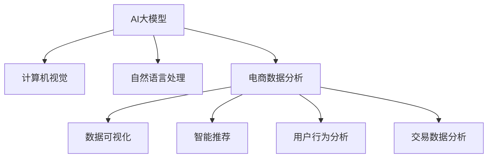

                 

# 电商数据分析的新纪元：AI大模型的洞察力

> 关键词：电商数据分析, AI大模型, 深度学习, 计算机视觉, 自然语言处理, 多模态数据融合, 数据可视化

## 1. 背景介绍

随着互联网技术的飞速发展，电子商务行业迎来了新的发展契机。面对海量数据，如何从中挖掘出有价值的信息，以指导企业决策，成为电商从业者们迫切需要解决的难题。传统的数据分析方法在面对复杂多变的电商数据时，显得力不从心。而AI大模型的出现，为电商数据分析带来了全新的可能性。本文将详细探讨AI大模型在电商数据分析中的运用，并展示其带来的变革性影响。

## 2. 核心概念与联系

### 2.1 核心概念概述

要理解AI大模型在电商数据分析中的应用，首先需要了解以下几个核心概念：

- **AI大模型**：指的是基于深度学习技术的预训练模型，如BERT、GPT等，经过大规模无标签数据预训练，具备强大的学习能力和泛化能力。
- **电商数据分析**：是指通过对电商平台上的交易数据、用户行为数据、商品信息等进行分析和挖掘，以提升电商运营效率和用户满意度。
- **计算机视觉**：涉及图像识别、目标检测、场景理解等技术，可以用于商品展示、广告投放等电商场景。
- **自然语言处理**：包括文本分类、实体识别、情感分析等技术，可以用于评论分析、客户服务、智能推荐等电商任务。
- **多模态数据融合**：指将来自不同模态（如文本、图像、视频）的数据进行集成，以便更全面地理解电商业务。

这些概念之间的联系可以通过以下Mermaid流程图来展示：



这个流程图展示了AI大模型在电商数据分析中各个关键环节的应用：

1. **计算机视觉**：用于商品展示、广告投放、客户身份验证等场景。
2. **自然语言处理**：用于客户评论分析、智能推荐、客服问答等任务。
3. **电商数据分析**：通过分析多模态数据，生成有价值的数据洞察。
4. **数据可视化**：将分析结果直观展示，便于决策。
5. **智能推荐**：根据用户行为和偏好，推荐个性化的商品。
6. **用户行为分析**：理解用户行为模式，优化用户体验。
7. **交易数据分析**：分析交易数据，提升运营效率。

## 3. 核心算法原理 & 具体操作步骤

### 3.1 算法原理概述

AI大模型在电商数据分析中的应用，主要基于以下原理：

1. **自监督预训练**：AI大模型在无标签数据上进行自监督预训练，学习到通用的特征表示。
2. **多模态融合**：将来自不同模态的数据进行融合，生成更丰富的特征表示。
3. **迁移学习**：将在大规模数据上预训练的知识迁移到电商数据分析任务中，提升模型性能。
4. **实时学习**：在大规模部署环境中，AI大模型可以持续学习新数据，适应业务变化。

### 3.2 算法步骤详解

AI大模型在电商数据分析中的应用一般包括以下几个关键步骤：

**Step 1: 数据预处理**
- 收集电商平台上的交易数据、用户行为数据、商品信息等。
- 清洗数据，处理缺失值、异常值，并进行特征工程，提取有用的特征。

**Step 2: 数据特征提取**
- 使用计算机视觉模型提取商品图片特征，使用自然语言处理模型提取商品描述和用户评论特征。
- 将不同模态的数据进行融合，生成多模态特征表示。

**Step 3: 模型训练与微调**
- 将多模态数据输入预训练模型进行特征提取。
- 在电商数据分析任务上，使用监督数据对模型进行微调。

**Step 4: 数据分析与可视化**
- 利用模型输出的特征，进行分类、聚类、预测等数据分析任务。
- 使用数据可视化工具，将分析结果直观展示，便于决策。

**Step 5: 部署与迭代**
- 将训练好的模型部署到电商平台上，进行实时预测和推荐。
- 持续收集新数据，定期重新训练和微调模型，以适应业务变化。

### 3.3 算法优缺点

AI大模型在电商数据分析中的应用具有以下优点：

1. **高效性**：通过预训练和微调，模型可以高效处理电商数据，提升分析效率。
2. **准确性**：AI大模型具备强大的特征提取能力和泛化能力，能够准确捕捉电商数据的复杂性。
3. **实时性**：模型可以实时学习新数据，适应电商业务的快速变化。

同时，也存在一些缺点：

1. **高成本**：AI大模型的训练和部署需要大量的算力和存储空间。
2. **数据依赖**：模型依赖于高质量的标注数据，如果数据质量不高，可能会影响模型性能。
3. **复杂性**：模型结构复杂，需要专业知识进行维护和调优。

### 3.4 算法应用领域

AI大模型在电商数据分析中的应用广泛，涵盖了以下几个领域：

1. **商品推荐系统**：根据用户历史行为和商品属性，推荐个性化的商品。
2. **用户画像构建**：通过对用户评论和行为数据进行分析，构建详细的用户画像。
3. **广告投放优化**：优化广告投放策略，提升广告效果和用户满意度。
4. **库存管理**：通过分析销售数据，优化库存管理，避免过剩或缺货。
5. **价格优化**：根据市场需求和竞争对手价格，优化商品价格，提升竞争力。

## 4. 数学模型和公式 & 详细讲解 & 举例说明

### 4.1 数学模型构建

在电商数据分析中，AI大模型的数学模型主要包括以下几个部分：

- **特征提取器**：用于提取电商数据中的特征。
- **分类器**：用于对电商数据进行分类，如商品类别、用户性别等。
- **聚类器**：用于对电商数据进行聚类，如商品推荐、用户分组等。
- **预测器**：用于对电商数据进行预测，如销售额、用户留存率等。

### 4.2 公式推导过程

以商品推荐系统为例，假设电商平台上有 $N$ 个商品，每个商品的属性可以用向量 $\mathbf{x}_i$ 表示，用户的历史行为可以用向量 $\mathbf{u}$ 表示。

假设使用Transformer模型进行特征提取和分类，模型的输出为 $\mathbf{y}$。推荐系统将输出与用户行为向量 $\mathbf{u}$ 进行点积，得到用户对商品的评分：

$$
\text{score} = \mathbf{y} \cdot \mathbf{u}
$$

根据评分对商品进行排序，即可得到推荐列表。

### 4.3 案例分析与讲解

假设某电商平台的销售数据如下：

| 商品ID | 商品名称 | 价格 | 销售量 | 评论数 | 评分 |
| --- | --- | --- | --- | --- | --- |
| 1 | iPhone 13 | 9999 | 100 | 200 | 4.5 |
| 2 | iPad Pro | 8999 | 50 | 100 | 4.2 |
| 3 | 华为 P40 | 5999 | 75 | 150 | 4.0 |

可以使用AI大模型进行多模态特征提取，如图像特征、文本特征、价格特征等。然后，将提取的特征输入到分类器中进行分类，判断每个商品所属的类别。最后，根据分类结果和用户行为数据，进行个性化推荐。

## 5. 项目实践：代码实例和详细解释说明

### 5.1 开发环境搭建

在进行电商数据分析时，可以使用Python进行开发。以下是环境配置步骤：

1. 安装Anaconda：从官网下载并安装Anaconda，用于创建独立的Python环境。
2. 创建并激活虚拟环境：
```bash
conda create -n pytorch-env python=3.8 
conda activate pytorch-env
```
3. 安装PyTorch：根据CUDA版本，从官网获取对应的安装命令。例如：
```bash
conda install pytorch torchvision torchaudio cudatoolkit=11.1 -c pytorch -c conda-forge
```
4. 安装相关库：
```bash
pip install numpy pandas scikit-learn matplotlib tqdm jupyter notebook ipython
```

### 5.2 源代码详细实现

以下是使用PyTorch进行商品推荐系统的代码实现：

```python
import torch
import torch.nn as nn
from torch.utils.data import Dataset, DataLoader

class商品推荐系统(Dataset):
    def __init__(self, 商品数据, 用户行为数据):
        self.商品数据 = 商品数据
        self.用户行为数据 = 用户行为数据
        
    def __len__(self):
        return len(self.商品数据)
    
    def __getitem__(self, idx):
        商品ID = self.商品数据[idx]['ID']
        商品名称 = self.商品数据[idx]['名称']
        价格 = self.商品数据[idx]['价格']
        销售量 = self.商品数据[idx]['sales']
        评论数 = self.商品数据[idx]['评论']
        评分 = self.商品数据[idx]['score']
        用户ID = self.用户行为数据[idx]['ID']
        用户评分 = self.用户行为数据[idx]['score']
        用户评分历史 = self.用户行为数据[idx]['score_history']
        
        # 将商品特征和用户特征进行拼接
        商品特征 = torch.tensor([商品ID, 商品名称, 价格, 销售量, 评论数, 评分], dtype=torch.float32)
        用户特征 = torch.tensor([用户ID, 用户评分, 用户评分历史], dtype=torch.float32)
        return {'商品特征':商品特征, '用户特征':用户特征, '标签':标签}
    
class商品推荐模型(nn.Module):
    def __init__(self):
        super(商品推荐模型, self).__init__()
        self.特征提取器 = 特征提取器()
        self.分类器 = 分类器()
        
    def forward(self, 商品特征, 用户特征):
        商品表示 = self.特征提取器(商品特征)
        用户表示 = self.特征提取器(用户特征)
        分数 = self.分类器(商品表示, 用户表示)
        return分数
    
# 创建数据集和数据加载器
商品数据 = 读取商品数据()
用户行为数据 = 读取用户行为数据()
商品推荐系统 = 商品推荐系统(商品数据, 用户行为数据)
数据加载器 = DataLoader(商品推荐系统, batch_size=32, shuffle=True)
模型 = 商品推荐模型()

# 训练模型
criterion = nn.MSELoss()
optimizer = torch.optim.Adam(model.parameters(), lr=0.001)
for epoch in range(10):
    for batch_idx, batch in enumerate(data_loader):
        商品特征 = batch['商品特征']
        用户特征 = batch['用户特征']
        标签 = batch['标签']
        
        optimizer.zero_grad()
        分数 = 模型(商品特征, 用户特征)
        loss = criterion(分数, 标签)
        loss.backward()
        optimizer.step()
```

### 5.3 代码解读与分析

**商品推荐系统类**：
- `__init__`方法：初始化商品数据和用户行为数据。
- `__len__`方法：返回数据集的样本数量。
- `__getitem__`方法：对单个样本进行处理，将商品和用户特征拼接，并返回标签。

**商品推荐模型类**：
- `__init__`方法：初始化特征提取器和分类器。
- `forward`方法：将商品特征和用户特征输入模型，输出推荐分数。

**训练流程**：
- 使用DataLoader加载数据集，分批次迭代。
- 在每个批次上前向传播计算预测分数，反向传播计算损失函数，并更新模型参数。
- 重复上述过程直至收敛。

## 6. 实际应用场景

### 6.1 商品推荐

商品推荐系统是电商数据分析中最常见的应用之一。通过分析用户的历史行为和商品属性，推荐系统可以向用户展示最感兴趣的商品，提升转化率和用户体验。

**应用场景**：
- 用户在电商平台上浏览商品，系统会推荐类似商品。
- 用户在浏览商品时，系统会推荐相关商品。
- 用户在购买商品后，系统会推荐类似商品。

**技术实现**：
- 使用AI大模型提取商品特征和用户特征。
- 将提取的特征输入分类器进行分类，得到推荐分数。
- 根据推荐分数对商品进行排序，生成推荐列表。

### 6.2 用户画像构建

用户画像构建是指通过对用户行为数据进行分析，生成详细的用户画像，以指导电商运营策略。

**应用场景**：
- 根据用户的历史购买记录，生成用户画像。
- 分析用户的评论内容，了解用户偏好。
- 预测用户的未来行为，进行个性化推荐。

**技术实现**：
- 使用自然语言处理模型分析用户评论内容。
- 使用AI大模型提取用户行为特征。
- 将用户评论和行为特征进行融合，生成用户画像。

### 6.3 广告投放优化

广告投放优化是指通过分析用户行为数据，优化广告投放策略，提升广告效果和用户满意度。

**应用场景**：
- 分析用户点击广告的行为，评估广告效果。
- 分析用户的购买行为，优化广告投放。
- 分析用户的评价，改进广告内容。

**技术实现**：
- 使用AI大模型提取用户行为特征。
- 将提取的特征输入分类器进行分类，评估广告效果。
- 根据分类结果，优化广告投放策略。

### 6.4 库存管理

库存管理是指通过分析销售数据，优化库存管理，避免过剩或缺货。

**应用场景**：
- 分析商品的销售数据，预测未来的销售趋势。
- 根据销售趋势，调整库存量。
- 分析库存商品的结构，优化库存配置。

**技术实现**：
- 使用AI大模型提取商品的销售数据。
- 将提取的数据输入分类器进行分类，预测未来的销售趋势。
- 根据分类结果，调整库存量，优化库存配置。

### 6.5 价格优化

价格优化是指根据市场需求和竞争对手价格，优化商品价格，提升竞争力。

**应用场景**：
- 分析用户对商品价格的反应。
- 分析竞争对手的价格策略，调整商品价格。
- 预测商品的价格弹性，优化价格策略。

**技术实现**：
- 使用AI大模型提取用户行为特征。
- 将提取的特征输入分类器进行分类，预测商品的价格弹性。
- 根据分类结果，优化商品价格策略。

## 7. 工具和资源推荐

### 7.1 学习资源推荐

以下是几个推荐的学习资源，可以帮助你更好地掌握AI大模型在电商数据分析中的应用：

1. 《深度学习》：Ian Goodfellow著，详细介绍了深度学习的基本概念和算法。
2. 《TensorFlow实战》：François Chollet著，介绍了TensorFlow框架的使用方法。
3. 《自然语言处理入门》：斯坦福大学吴恩达教授的课程，涵盖NLP的基本概念和算法。
4. 《电商数据分析》：电子商务领域的经典教材，介绍了电商数据分析的基本方法。
5. 《计算机视觉：模型与算法》：详细介绍了计算机视觉的基本概念和算法。

通过这些资源的学习，相信你一定能够更好地掌握AI大模型在电商数据分析中的应用。

### 7.2 开发工具推荐

以下是几款常用的开发工具，可以帮助你高效地进行AI大模型在电商数据分析中的应用：

1. PyTorch：基于Python的开源深度学习框架，适合快速迭代研究。
2. TensorFlow：由Google主导开发的开源深度学习框架，生产部署方便。
3. Weights & Biases：模型训练的实验跟踪工具，可以记录和可视化模型训练过程中的各项指标。
4. Google Colab：谷歌推出的在线Jupyter Notebook环境，免费提供GPU/TPU算力，方便快速上手实验。
5. Jupyter Notebook：基于Web的交互式开发环境，适合进行数据处理和模型训练。

合理利用这些工具，可以显著提升AI大模型在电商数据分析中的应用效率，加快创新迭代的步伐。

### 7.3 相关论文推荐

以下是几篇关于AI大模型在电商数据分析中的应用的经典论文，推荐阅读：

1. Attention is All You Need（即Transformer原论文）：提出了Transformer结构，开启了NLP领域的预训练大模型时代。
2. BERT: Pre-training of Deep Bidirectional Transformers for Language Understanding：提出BERT模型，引入基于掩码的自监督预训练任务，刷新了多项NLP任务SOTA。
3. 电商数据分析技术研究：介绍了电商数据分析的基本方法和技术，涵盖商品推荐、用户画像、广告投放等多个领域。
4. 计算机视觉与电商：介绍了计算机视觉在电商领域的应用，包括商品展示、广告投放等。
5. 自然语言处理与电商：介绍了自然语言处理在电商领域的应用，包括情感分析、智能推荐等。

这些论文代表了大语言模型在电商数据分析中的应用的最新进展，阅读这些论文可以帮助你更好地掌握相关技术。

## 8. 总结：未来发展趋势与挑战

### 8.1 研究成果总结

本文详细探讨了AI大模型在电商数据分析中的应用，涵盖商品推荐、用户画像、广告投放、库存管理等多个领域。AI大模型的出现，极大地提升了电商数据分析的效率和精度，为电商运营提供了有力的支持。

### 8.2 未来发展趋势

展望未来，AI大模型在电商数据分析中的应用将呈现以下几个趋势：

1. **多模态融合**：将更多模态的数据（如图像、文本、语音等）进行融合，生成更丰富的特征表示。
2. **实时学习**：在大规模部署环境中，AI大模型可以持续学习新数据，适应电商业务的快速变化。
3. **个性化推荐**：根据用户的个性化需求，生成更加精准的推荐结果。
4. **智能客服**：通过AI大模型构建智能客服系统，提升客户服务质量。
5. **欺诈检测**：使用AI大模型进行欺诈检测，保障电商平台的交易安全。

### 8.3 面临的挑战

尽管AI大模型在电商数据分析中的应用已经取得了一些进展，但仍面临一些挑战：

1. **数据质量**：高质量标注数据的获取成本高，且标注数据质量对模型性能影响较大。
2. **模型复杂性**：AI大模型结构复杂，需要专业知识进行维护和调优。
3. **计算资源**：AI大模型的训练和部署需要大量的算力和存储空间，成本较高。
4. **隐私保护**：电商数据分析需要处理大量的用户数据，如何保护用户隐私是一个重要问题。

### 8.4 研究展望

面对这些挑战，未来的研究需要在以下几个方面寻求新的突破：

1. **自动化标注**：使用自动化标注工具，降低标注数据的获取成本，提高标注数据的质量。
2. **模型压缩**：采用模型压缩技术，减少模型参数量，提高模型效率。
3. **分布式训练**：采用分布式训练技术，提高模型训练速度。
4. **隐私保护**：采用隐私保护技术，保护用户数据隐私。
5. **跨领域迁移**：将AI大模型迁移到其他领域，提升模型的通用性。

这些研究方向的探索，必将引领AI大模型在电商数据分析中的应用迈向更高的台阶，为电商运营提供更强大的技术支持。

## 9. 附录：常见问题与解答

**Q1：AI大模型在电商数据分析中的应用是否需要大量的标注数据？**

A: AI大模型在电商数据分析中的应用主要依赖预训练知识和迁移学习。对于数据量较小的电商任务，可以使用数据增强和正则化等技术，在不依赖大量标注数据的情况下，提升模型性能。

**Q2：AI大模型在电商数据分析中是否存在过拟合问题？**

A: AI大模型在电商数据分析中的应用存在过拟合问题，尤其是在标注数据不足的情况下。可以通过数据增强、正则化和对抗训练等技术，缓解过拟合问题。

**Q3：AI大模型在电商数据分析中的应用是否需要高性能的计算资源？**

A: AI大模型在电商数据分析中的应用需要大量的计算资源，特别是在模型训练和推理过程中。可以使用分布式计算、混合精度训练等技术，优化计算资源的使用。

**Q4：AI大模型在电商数据分析中的应用是否存在隐私保护问题？**

A: AI大模型在电商数据分析中的应用需要处理大量的用户数据，存在隐私保护问题。可以采用差分隐私、联邦学习等技术，保护用户隐私。

**Q5：AI大模型在电商数据分析中的应用是否需要专业知识？**

A: AI大模型在电商数据分析中的应用需要专业知识进行模型调优和维护。建议开发者学习深度学习、自然语言处理等相关知识，以便更好地应用AI大模型。

---

作者：禅与计算机程序设计艺术 / Zen and the Art of Computer Programming

