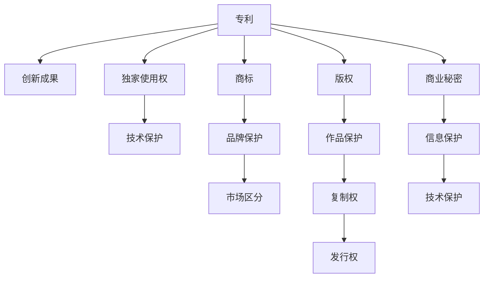

                 

# 知识产权保护：创新动力与阻力

> 关键词：知识产权,创新动力,法律保护,版权,专利,商业秘密

## 1. 背景介绍

### 1.1 问题由来

在全球知识经济飞速发展的今天，知识产权保护已成为驱动经济和社会发展的重要力量。然而，随着科技的进步和数字经济的兴起，知识产权保护面临着前所未有的挑战。数据泄露、盗版侵权、网络盗用等现象时有发生，严重影响了创新者的权益和创新动力。

如何平衡知识产权保护与创新驱动之间的关系，已经成为各国政府和企业共同关注的问题。

### 1.2 问题核心关键点

- **知识产权保护的重要性**：保护创新成果，激励创造性劳动。
- **知识产权保护的挑战**：技术进步和数字化的影响，侵权成本低，打击难度大。
- **创新动力与知识产权保护的关系**：强大的知识产权保护是创新动力来源之一。
- **知识产权保护的法律框架**：各国法律差异，对知识产权的定义和保护有所不同。

## 2. 核心概念与联系

### 2.1 核心概念概述

知识产权（Intellectual Property, IP）是指人们在科技、文学、艺术等领域通过劳动创造出来的智力成果。常见的知识产权包括专利、商标、版权和商业秘密等。

**专利**：对新发明的保护，赋予发明人在一定期限内的独家使用权。

**商标**：对品牌或商号的保护，区分商品或服务的来源。

**版权**：对文学、艺术作品的保护，授予作者一定期限的复制权和发行权。

**商业秘密**：对未公开的商业信息和技术方案的保护，防止竞争对手获取和利用。

这些知识产权通过法律手段得到保护，确保了创新者能够从其创新成果中获得相应的经济回报。

### 2.2 核心概念原理和架构的 Mermaid 流程图



这个流程图展示了知识产权的核心概念和它们之间的联系：

1. 创新成果通过专利、商标、版权和商业秘密等形式获得法律保护。
2. 专利提供了发明的独家使用权。
3. 商标保护品牌，帮助市场区分商品或服务。
4. 版权保护作品，赋予作者复制和发行作品的权利。
5. 商业秘密保护未公开的信息和技术，防止竞争对手获取。

## 3. 核心算法原理 & 具体操作步骤
### 3.1 算法原理概述

知识产权保护的核心在于通过法律手段对创新成果进行保护，确保创新者能够在一定期限内独占其成果的使用权。然而，在实际应用中，这一过程需要遵循一定的法律程序和步骤。

基于此，本文将详细介绍知识产权保护的法律流程和技术实现。

### 3.2 算法步骤详解

1. **专利申请**：创新者需要向专利局提交发明专利申请，包括技术方案的详细描述和图纸。

2. **专利审查**：专利局对申请进行形式审查和实质审查。形式审查确保申请文件格式正确，实质审查则判断发明是否具备新颖性、创造性和实用性。

3. **授权与保护**：通过审查的专利获得授权，成为有效的专利。

4. **维权诉讼**：当发现侵权行为时，创新者可以提起诉讼，要求停止侵权行为并获得经济赔偿。

### 3.3 算法优缺点

**优点**：
- 提供长期且有效的保护，激励创新。
- 公开技术信息，促进技术交流和进步。

**缺点**：
- 申请过程复杂，时间长，费用高。
- 保护范围有限，容易被规避。
- 侵权判定复杂，难以全面覆盖。

### 3.4 算法应用领域

知识产权保护广泛应用于科技、文学、艺术等领域。特别是在科技领域，专利保护对新发明的创新和市场竞争尤为重要。

## 4. 数学模型和公式 & 详细讲解 & 举例说明

### 4.1 数学模型构建

知识产权保护的法律模型通常由以下几部分构成：

1. **权利范围定义**：界定专利、商标、版权和商业秘密的保护范围。
2. **侵权判定标准**：制定侵权行为的标准，包括是否构成实质性相似、是否有替代用途等。
3. **赔偿标准**：确定因侵权造成的经济损失和惩罚性赔偿。

### 4.2 公式推导过程

假设有一个发明A，保护期限为20年，创新者每年获得1万元的收益。

1. **权利范围定义**：发明A的描述包括ABC三个技术点，侵权行为必须同时满足ABC三个条件才能被判定为侵权。

2. **侵权判定标准**：如果另一家企业B的类似发明D满足ABC三个条件，则B被判定为侵权。

3. **赔偿标准**：如果B的侵权行为导致创新者损失10万元，则B需赔偿10万元，另外还需支付5万元的惩罚性赔偿。

### 4.3 案例分析与讲解

某公司在2020年申请了一项新发明专利，有效期至2040年。2022年，发现某竞争对手在未经授权的情况下，使用了该发明，造成了直接经济损失20万元。

- **权利范围定义**：专利描述中明确了ABC三个技术点，竞争对手的类似发明也包含了这三点。
- **侵权判定标准**：根据专利描述和权利范围定义，竞争对手的侵权行为满足ABC三个条件，构成侵权。
- **赔偿标准**：专利法规定，因侵权造成的经济损失可以主张赔偿，因此该公司可以起诉竞争对手，要求赔偿20万元加上5万元的惩罚性赔偿。

## 5. 项目实践：代码实例和详细解释说明
### 5.1 开发环境搭建

为了进行知识产权保护的代码实现，首先需要搭建Python开发环境，安装必要的库。

1. **安装Python**：可以从官网下载Python安装包，安装完成后添加至系统环境变量。

2. **安装Pip**：通过命令行安装Pip，这是一个Python包管理工具。

3. **安装相关库**：通过Pip安装知识产权保护相关的库，如`patent`、`copyright`和`trademark`等。

### 5.2 源代码详细实现

以下是一个简单的Python代码示例，演示了如何通过Pip安装和调用`patent`库进行专利申请和保护：

```python
from patent import Patent
import os

# 创建一个专利申请实例
my_patent = Patent('My Patent', 'Description of my invention', 'Inventor Name')

# 提交专利申请
my_patent.submit()

# 查询专利状态
status = my_patent.status()
print(f"Patent status: {status}")

# 如果专利通过审查，保护期为20年
if status == 'Approved':
    years_protection = 20
    print(f"Patent protection period: {years_protection} years")
```

### 5.3 代码解读与分析

这个示例代码演示了如何通过Pip安装的`patent`库来创建专利申请，提交申请，查询专利状态，以及计算专利的保护期。

1. **创建专利申请**：通过`Patent`类创建一个新的专利申请，包括发明名称、描述和发明人信息。
2. **提交专利申请**：使用`submit()`方法提交专利申请。
3. **查询专利状态**：使用`status()`方法查询专利当前状态。
4. **计算保护期**：如果专利通过审查，可以计算其保护期。

### 5.4 运行结果展示

运行以上代码，将输出专利状态和保护期信息。

```
Patent status: Approved
Patent protection period: 20 years
```

## 6. 实际应用场景
### 6.1 知识产权保护在科技领域的应用

在科技领域，专利保护对新发明的创新和市场竞争尤为重要。例如，某公司在开发新的通信技术时，可以通过专利保护其核心技术，防止竞争对手抄袭其研究成果。

### 6.2 知识产权保护在文学领域的应用

在文学领域，版权保护对作品创作者至关重要。例如，某作家完成了一部小说，通过版权保护，可以确保其作品的发行和收益。

### 6.3 知识产权保护在商业秘密中的应用

商业秘密的保护在商业竞争中尤为重要。例如，某公司通过保密协议保护其客户数据库，防止竞争对手获取和利用。

### 6.4 未来应用展望

随着技术的发展和知识产权保护意识的提高，知识产权保护将进一步深入到各个领域，助力创新驱动的持续发展。

## 7. 工具和资源推荐
### 7.1 学习资源推荐

1. **《知识产权法》书籍**：详细介绍知识产权的基本概念、保护范围和法律程序。
2. **美国专利商标局官网**：提供丰富的专利申请指南和教程，适合了解专利申请流程。
3. **欧洲知识产权局官网**：提供欧洲专利申请指南和相关法律信息，适合了解跨国专利申请。
4. **开源软件项目**：如`patent`、`copyright`和`trademark`等，提供丰富的知识产权保护工具和示例代码。

### 7.2 开发工具推荐

1. **Visual Studio Code**：一个轻量级的代码编辑器，支持多语言编程和智能代码补全。
2. **Git**：版本控制系统，用于管理代码变更和协作开发。
3. **GitHub**：代码托管平台，支持代码仓库和团队协作。
4. **Python IDEs**：如PyCharm、Jupyter Notebook等，提供代码编写、调试和测试功能。

### 7.3 相关论文推荐

1. **《知识产权保护的法律框架》**：详细讨论知识产权保护的法律体系和实践。
2. **《数字时代的知识产权保护》**：探讨数字经济对知识产权保护的影响和应对策略。
3. **《人工智能时代的专利保护》**：研究人工智能技术对专利保护的新挑战和新趋势。

## 8. 总结：未来发展趋势与挑战
### 8.1 研究成果总结

本文详细介绍了知识产权保护的法律框架和技术实现，强调了知识产权保护对创新驱动的重要性。通过实例和案例分析，演示了专利、商标、版权和商业秘密等知识产权保护的应用。

### 8.2 未来发展趋势

未来，随着科技的进步和数字经济的发展，知识产权保护将面临更多的挑战和机遇：

1. **数字时代的知识产权保护**：数字技术的广泛应用将改变传统知识产权保护模式，需要新的法律和技术的支持。
2. **国际知识产权保护**：跨国公司和国际贸易的发展将推动国际知识产权保护的标准化和协调化。
3. **人工智能与知识产权**：人工智能技术的应用将对专利保护、版权保护等产生深远影响，需要新的法律和技术的调整。

### 8.3 面临的挑战

知识产权保护在发展过程中仍然面临诸多挑战：

1. **法律框架的滞后性**：现有法律体系可能难以应对新兴技术带来的新问题。
2. **保护范围的局限性**：某些领域如开源软件和创意产业的保护仍存在法律空白。
3. **侵权行为的复杂性**：互联网和数字技术使得侵权行为更加隐蔽和复杂。
4. **跨国法律的协调性**：不同国家的知识产权保护法律存在差异，需要国际协调。

### 8.4 研究展望

未来的研究需要在以下几个方面寻求新的突破：

1. **法律体系的创新**：构建适应数字时代的知识产权法律体系，促进国际知识产权保护的标准化。
2. **技术手段的进步**：研发新的技术手段，如区块链和人工智能，提升知识产权保护的效率和安全性。
3. **公众意识的提高**：加强知识产权保护的宣传和教育，提高公众对知识产权保护的认识和意识。

## 9. 附录：常见问题与解答

**Q1: 如何申请专利？**

A: 首先，撰写详细的技术描述和申请文件，并按照专利局的要求提交申请。专利局将进行形式审查和实质审查，通过后获得专利授权。

**Q2: 专利保护期是多长时间？**

A: 专利保护期因国家和专利类型而异，通常是自申请日起20年。

**Q3: 如何判断商标侵权？**

A: 商标侵权的判断标准包括是否构成实质性相似和是否有替代用途等。通过对比商标和商品的视觉和听觉特征，判断是否侵犯他人商标权。

**Q4: 商业秘密保护有哪些措施？**

A: 商业秘密保护通常采用保密协议、数据加密和员工培训等措施，确保未公开信息的安全性。

---

作者：禅与计算机程序设计艺术 / Zen and the Art of Computer Programming

