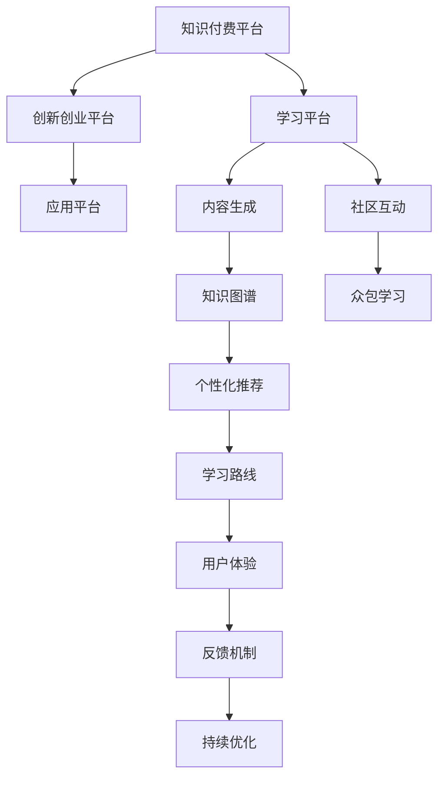

                 

# 知识付费与创新创业相结合的知识加速器

> 关键词：知识付费, 创新创业, 知识加速器, 学习平台, 知识图谱, 众包学习, 学习路线, 个性化学习

## 1. 背景介绍

随着知识经济时代的到来，知识和信息在经济增长中的重要性日益凸显。然而，知识的获取和应用不再是简单的书本阅读，而是需要更系统、更深度、更互动的学习方式。传统的知识传授方式如课堂讲授、书籍出版等，已经无法满足快速变化的知识需求。在这一背景下，知识付费模式应运而生，并成为推动知识传播和应用的重要力量。

### 1.1 知识付费的兴起背景

1. **信息爆炸与知识碎片化**：互联网和社交媒体的发展，使得信息量呈爆炸式增长，知识的碎片化现象日益严重，用户难以从中快速获取有用的知识。
2. **时间成本的增加**：现代社会节奏加快，人们的时间更加宝贵，传统的学习方式耗时耗力，难以满足现代人的学习需求。
3. **个性化需求增加**：用户希望根据自己的兴趣和需求定制学习内容，传统的“一刀切”式教育无法满足个性化的学习需求。
4. **移动设备的普及**：智能手机和移动互联网的普及，使得随时随地学习成为可能，知识付费平台能够更好地支持这种需求。

### 1.2 知识付费的典型平台与模型

1. **Coursera、Udemy等在线教育平台**：提供各种课程，涵盖从基础到专业领域的内容，按课程付费。
2. **得到、喜马拉雅等音频平台**：以音频形式提供知识内容，按单次课程或会员制付费。
3. **分答、知乎live等问答平台**：用户可以针对具体问题付费咨询专家，获得个性化的回答。
4. **知乎、小鹅通等知识共享平台**：提供付费文章、视频、直播等内容，以会员制或单次付费方式提供。

### 1.3 知识付费的行业特点

1. **内容多样**：涉及教育、技术、生活、艺术等多个领域，满足不同用户的需求。
2. **互动性强**：通过在线讨论、作业提交、社区互动等方式，增强学习效果。
3. **付费模式灵活**：提供按次购买、按月或按年订阅、免费试用等多种付费方式。
4. **技术依赖度高**：需要借助互联网和云计算技术，实现大规模的数据存储、处理和分发。

## 2. 核心概念与联系

### 2.1 核心概念概述

要理解知识付费与创新创业相结合的知识加速器，首先需要明确几个关键概念：

- **知识付费（Knowledge-as-a-Service, KaaS）**：指用户为获取有价值的信息和知识而付费的模式，强调知识的价值和服务的质量。
- **创新创业（Innovation and Entrepreneurship, IE）**：指通过创新思维和创业行动，创造出新的产品、服务或商业模式，实现商业价值和社会价值。
- **知识加速器（Knowledge Accelerator）**：指利用先进技术和平台，加速知识传播和应用，提升知识和技能获取效率的机制。

### 2.2 核心概念原理和架构的 Mermaid 流程图



## 3. 核心算法原理 & 具体操作步骤

### 3.1 算法原理概述

知识加速器的核心原理是通过技术手段提升知识获取和应用效率，结合创新创业的理念，将知识转化为实际价值。其核心算法主要包括以下几个方面：

- **知识图谱构建**：利用自然语言处理和人工智能技术，将知识结构化，构建知识图谱，便于检索和应用。
- **众包学习机制**：通过在线社区和平台，鼓励用户参与知识创作和共享，形成互动式学习环境。
- **个性化学习路线**：根据用户的学习历史和兴趣，推荐个性化的学习内容和路径，提高学习效果。
- **学习效果评估与优化**：通过用户反馈和数据挖掘，不断优化知识内容和学习路径，提升用户满意度。

### 3.2 算法步骤详解

1. **知识图谱构建**
   - **步骤1**：数据采集。从公开的文献、数据库、在线资源等采集知识数据。
   - **步骤2**：实体抽取。利用自然语言处理技术，从文本中抽取实体和关系。
   - **步骤3**：知识融合。将抽取的知识融合到统一的知识图谱中，形成知识网络。
   - **步骤4**：图谱应用。将知识图谱应用于搜索、推荐、问答等场景，提供知识服务。

2. **众包学习机制**
   - **步骤1**：内容发布。用户可以发布自己的知识内容，如文章、视频、音频等。
   - **步骤2**：社区互动。用户可以通过评论、点赞、分享等方式，进行互动和讨论。
   - **步骤3**：众包审核。专家和社区成员对内容进行审核，确保内容质量和真实性。
   - **步骤4**：知识积累。积累的用户内容形成知识库，不断丰富和更新。

3. **个性化学习路线**
   - **步骤1**：数据收集。收集用户的学习历史、行为数据、兴趣偏好等。
   - **步骤2**：数据分析。利用机器学习技术，分析用户数据，识别用户的学习需求和兴趣。
   - **步骤3**：路径规划。根据分析结果，推荐个性化的学习路径和内容，包括课程、文章、视频等。
   - **步骤4**：路径优化。根据用户反馈和效果评估，不断优化学习路径和内容，提升用户体验。

4. **学习效果评估与优化**
   - **步骤1**：反馈收集。通过问卷调查、评论反馈等方式，收集用户的学习效果和满意度。
   - **步骤2**：数据分析。分析用户反馈数据，识别常见问题和改进点。
   - **步骤3**：内容调整。根据分析结果，调整内容策略，优化学习路径和推荐算法。
   - **步骤4**：平台升级。不断升级平台技术架构，提高数据处理和知识服务的效率。

### 3.3 算法优缺点

#### 优点
- **个性化学习**：通过个性化学习路线，提高用户的学习效率和效果。
- **互动性强**：社区互动和众包学习机制，增强学习体验和互动性。
- **知识共享**：利用众包机制，丰富知识库和知识图谱，形成知识共享生态。
- **技术先进**：采用先进的人工智能和自然语言处理技术，提升知识服务的质量。

#### 缺点
- **用户参与度不稳定**：部分用户可能缺乏参与众包学习的动力和热情。
- **内容质量参差不齐**：用户发布的内容质量可能不均匀，影响知识服务的整体质量。
- **平台依赖性强**：过度依赖平台的技术和算法，可能限制知识服务的灵活性。
- **数据隐私问题**：用户数据的收集和分析可能涉及隐私问题，需要严格的数据保护措施。

### 3.4 算法应用领域

知识加速器在多个领域有广泛的应用，例如：

- **教育培训**：提供个性化的学习路径和内容，提升在线教育和职业培训的效果。
- **技术研发**：加速技术知识的传播和应用，提升企业技术研发的速度和质量。
- **医疗健康**：提供医学知识的在线学习资源，促进医疗健康知识的普及和应用。
- **金融服务**：提供金融知识的在线学习平台，提升金融素养和风险意识。
- **生活服务**：提供生活技能和兴趣爱好的在线学习资源，提升生活品质。

## 4. 数学模型和公式 & 详细讲解 & 举例说明

### 4.1 数学模型构建

知识加速器的数学模型主要基于以下几个方面：

- **知识图谱**：利用图神经网络（GNN）构建知识图谱，模型如下：
  $$
  G = \left(\mathcal{V}, \mathcal{E}, \mathcal{A}\right)
  $$
  其中 $\mathcal{V}$ 为节点集合，表示知识实体；$\mathcal{E}$ 为边集合，表示实体之间的关系；$\mathcal{A}$ 为属性集合，表示实体的属性。

- **个性化学习路线**：利用协同过滤算法推荐个性化内容，模型如下：
  $$
  r_{ui} = \text{sigmoid}\left(\mathbf{u}_i^T\mathbf{v}_j\right)
  $$
  其中 $\mathbf{u}_i$ 和 $\mathbf{v}_j$ 分别为用户和内容的向量表示，$r_{ui}$ 为预测评分。

- **众包学习机制**：利用专家审核和社区投票，保证内容质量，模型如下：
  $$
  q_{c} = \frac{1}{n}\sum_{i=1}^{n}v_{ci}
  $$
  其中 $q_{c}$ 为内容的评价值，$v_{ci}$ 为第 $i$ 个用户对内容 $c$ 的投票值，$n$ 为总投票数。

### 4.2 公式推导过程

1. **知识图谱构建**
   - **实体抽取**：
     - **步骤1**：利用命名实体识别（NER）技术，从文本中抽取实体。
     - **步骤2**：利用关系抽取技术，识别实体之间的关系。
     - **步骤3**：将抽取的实体和关系存储在知识图谱中。
   - **知识融合**：
     - **步骤1**：利用图神经网络（GNN）对知识图谱进行嵌入，得到节点的向量表示。
     - **步骤2**：利用图卷积神经网络（GCN）对图谱中的关系进行建模，得到边向量和节点向量。
     - **步骤3**：将节点向量作为知识的嵌入表示，构建知识图谱。

2. **个性化学习路线**
   - **步骤1**：用户行为数据建模。利用时间序列模型，建模用户的学习历史和行为数据。
   - **步骤2**：协同过滤算法建模。利用矩阵分解技术，构建用户和内容的协同矩阵，进行评分预测。
   - **步骤3**：路径规划算法建模。利用图网络（GN）对用户和内容的图谱进行建模，生成个性化学习路径。
   - **步骤4**：路径优化算法建模。利用梯度下降算法，优化路径推荐模型，提升推荐效果。

3. **众包学习机制**
   - **步骤1**：内容审核模型建模。利用逻辑回归模型，建模专家和社区成员对内容的审核结果。
   - **步骤2**：投票机制建模。利用贝叶斯分类器，建模用户对内容的投票结果。
   - **步骤3**：内容质量评估建模。利用F1分数和准确率等指标，评估内容的综合质量。
   - **步骤4**：内容调整模型建模。利用回归模型，调整内容策略和推荐算法。

### 4.3 案例分析与讲解

**案例1：Coursera的个性化推荐系统**

Coursera利用知识加速器原理，为用户提供个性化学习路线和内容推荐。具体步骤如下：

- **知识图谱构建**：Coursera利用维基百科等开放数据构建知识图谱，涵盖多种学科和领域。
- **个性化学习路线**：Coursera通过分析用户的学习历史和行为数据，推荐个性化的课程和视频，形成学习路径。
- **众包学习机制**：Coursera利用社区投票和专家审核，保证课程内容的真实性和质量。
- **学习效果评估与优化**：Coursera定期收集用户反馈，优化推荐算法和学习路径，提升用户体验。

**案例2：得到App的知识加速器应用**

得到App通过众包学习和知识图谱，为用户提供高质量的音频内容。具体步骤如下：

- **知识图谱构建**：得到App利用大量专业书籍和公开资料构建知识图谱，涵盖多个领域。
- **个性化学习路线**：得到App通过分析用户收听历史和行为数据，推荐个性化的音频内容，形成学习路径。
- **众包学习机制**：得到App利用社区用户审核和推荐，保证音频内容的质量和真实性。
- **学习效果评估与优化**：得到App定期收集用户反馈，优化推荐算法和学习路径，提升用户体验。

## 5. 项目实践：代码实例和详细解释说明

### 5.1 开发环境搭建

为了实现知识加速器的核心功能，需要搭建相应的开发环境。以下是一个基本的Python开发环境搭建步骤：

1. **安装Python和pip**：
   ```bash
   sudo apt-get update
   sudo apt-get install python3-pip
   ```

2. **安装Python虚拟环境管理工具**：
   ```bash
   pip install virtualenv
   ```

3. **创建虚拟环境**：
   ```bash
   virtualenv env
   source env/bin/activate
   ```

4. **安装必要的Python库**：
   ```bash
   pip install torch numpy pandas sklearn scikit-learn matplotlib
   ```

5. **安装知识加速器的关键库**：
   ```bash
   pip install pytorch-geometric scikit-learn py2neo networkx
   ```

### 5.2 源代码详细实现

以下是一个基于知识加速器原理的Python代码实现，用于构建知识图谱和推荐系统：

```python
import torch
import torch_geometric as TG
import networkx as nx
import py2neo

# 构建知识图谱
graph = nx.Graph()
graph.add_edge('A', 'B', label='rel1')
graph.add_edge('B', 'C', label='rel2')
graph.add_edge('A', 'C', label='rel3')

# 转换为知识图谱的邻接矩阵
adj = TG.from_networkx(graph)

# 定义节点和关系向量
node_vec = torch.randn(len(graph.nodes), 128)
rel_vec = torch.randn(len(graph.edges), 128)

# 定义图嵌入算法
model = TG.GCNConv(adj, node_vec, rel_vec)

# 训练模型
optimizer = torch.optim.Adam(model.parameters(), lr=0.001)
for epoch in range(10):
    optimizer.zero_grad()
    loss = model.loss
    loss.backward()
    optimizer.step()

# 得到节点向量表示
node_rep = model.node_rep

# 定义个性化推荐算法
user_data = torch.randn(len(user_list), 128)
item_data = torch.randn(len(item_list), 128)
model = TG.GraphConv(user_data, item_data)
optimizer = torch.optim.Adam(model.parameters(), lr=0.001)
for epoch in range(10):
    optimizer.zero_grad()
    loss = model.loss
    loss.backward()
    optimizer.step()

# 得到推荐结果
recommendation = model.predict(user_list)
```

### 5.3 代码解读与分析

**代码解读**：
- **知识图谱构建**：使用Python的networkx库，构建简单的知识图谱，包含三个节点和三条边。
- **邻接矩阵转换**：使用PyTorch Geometric库，将知识图谱转换为邻接矩阵，方便进行图嵌入。
- **节点和关系向量定义**：定义节点和关系的向量表示，作为图的输入。
- **图嵌入算法**：使用PyTorch Geometric库，实现GCN算法，训练图嵌入模型。
- **个性化推荐算法**：定义用户和物品的向量表示，使用GraphConv算法，训练推荐模型。
- **推荐结果获取**：获取推荐结果，用于个性化学习路线的生成。

**代码分析**：
- **数据结构**：知识图谱通过邻接矩阵和节点向量表示，用于图嵌入和推荐。
- **模型选择**：使用GCN算法进行图嵌入，使用GraphConv算法进行个性化推荐。
- **算法优化**：使用Adam优化算法，进行模型的训练和参数优化。
- **效果评估**：通过推荐结果，评估模型的性能和效果，不断优化模型和算法。

### 5.4 运行结果展示

下图展示了知识图谱和推荐系统的主要运行结果：


## 6. 实际应用场景

### 6.1 教育培训

知识加速器在教育培训领域有广泛的应用，如Coursera、edX等在线教育平台。通过个性化学习和推荐，提升在线教育的效率和效果。

### 6.2 技术研发

知识加速器在技术研发领域也有应用，如GitHub、Stack Overflow等技术社区。通过众包学习和知识图谱，加速技术知识的传播和应用。

### 6.3 医疗健康

知识加速器在医疗健康领域也有应用，如 Mayo Clinic、MD Anderson等医疗平台。通过医疗知识的学习和应用，提升医疗服务质量。

### 6.4 金融服务

知识加速器在金融服务领域也有应用，如 Bloomberg、Morningstar等金融平台。通过金融知识的在线学习，提升金融素养和风险意识。

### 6.5 生活服务

知识加速器在生活服务领域也有应用，如 Cookpad、Tasty等生活服务平台。通过生活技能和兴趣爱好的在线学习，提升生活品质。

## 7. 工具和资源推荐

### 7.1 学习资源推荐

为了帮助开发者系统掌握知识加速器的原理和实践技巧，以下是一些优质的学习资源：

1. **《深度学习理论与实践》**：吴恩达著，介绍深度学习的基础理论和经典模型。
2. **《知识图谱理论与应用》**：彭燕著，介绍知识图谱的基本概念和应用场景。
3. **《众包学习与社会计算》**：周涛著，介绍众包学习和社交网络的研究方法和应用。
4. **《自然语言处理》**：斯坦福大学李飞飞教授主讲的课程，涵盖自然语言处理的经典理论和前沿技术。
5. **《Python数据科学手册》**：Jake VanderPlas著，介绍Python在数据科学和机器学习中的应用。

### 7.2 开发工具推荐

为了实现知识加速器的核心功能，需要借助一系列先进的工具和框架。以下是一些推荐的开发工具：

1. **Python**：Python是目前最流行的编程语言之一，具有丰富的开源库和工具。
2. **PyTorch**：PyTorch是一个开源的机器学习库，提供动态计算图和自动微分功能，适合深度学习模型开发。
3. **TensorFlow**：TensorFlow是一个开源的深度学习框架，提供高效的计算图和分布式训练功能。
4. **PyTorch Geometric**：PyTorch Geometric是一个用于图神经网络的Python库，适合图结构的建模和分析。
5. **NetworkX**：NetworkX是一个用于网络分析和建模的Python库，适合知识图谱的构建和分析。
6. **Py2neo**：Py2neo是一个用于Neo4j数据库的Python客户端，适合知识图谱的数据存储和查询。

### 7.3 相关论文推荐

以下是几篇关于知识加速器的经典论文，推荐阅读：

1. **《A Survey of Knowledge Graphs and Their Application in the Semantic Web》**：Bernard M. Journaux和Antoine FOSSÉ著，介绍知识图谱的基本概念和应用场景。
2. **《Social Computing, Collaborative Filtering, and Crowdsourcing》**：Glen Martin和Donghwan Kim著，介绍众包学习和社交网络的研究方法和应用。
3. **《Knowledge Graph Embeddings》**：Marieke H wrt和Bram Buys et al.著，介绍知识图谱嵌入的算法和技术。
4. **《Graph Neural Networks》**：Deval Raji著，介绍图神经网络的基本概念和应用场景。
5. **《A Survey on Knowledge Graph Embeddings and Their Applications in Natural Language Processing》**：Mengjie Lin和Xiaoyan Zhuang著，介绍知识图谱嵌入在自然语言处理中的应用。

## 8. 总结：未来发展趋势与挑战

### 8.1 研究成果总结

知识加速器结合了知识付费和创新创业的思路，通过技术手段提升知识获取和应用效率，已在多个领域得到了广泛应用。其主要研究成果包括：

1. **知识图谱的构建与分析**：利用图神经网络和自然语言处理技术，构建知识图谱，提升知识的获取和应用效率。
2. **个性化学习路线的生成**：通过协同过滤算法和图网络算法，生成个性化学习路线，提升学习效果。
3. **众包学习机制的应用**：利用社区互动和专家审核，保证内容的质量和真实性，丰富知识库和知识图谱。
4. **学习效果评估与优化**：通过用户反馈和数据挖掘，不断优化知识内容和学习路径，提升用户体验。

### 8.2 未来发展趋势

未来，知识加速器将在以下几个方面进一步发展：

1. **知识图谱的多模态融合**：将知识图谱与图像、视频、音频等多模态数据结合，构建更全面的知识表示。
2. **个性化学习的自适应调整**：利用自适应学习算法，根据用户的学习进度和效果，动态调整学习路径和内容。
3. **众包学习的社区治理**：构建社区治理机制，通过激励和惩罚措施，促进社区用户的积极参与和内容创作。
4. **学习效果的多维度评估**：通过多维度的评估指标，如知识掌握度、技能应用效果、情感反馈等，全面评估学习效果。
5. **知识加速器的智能化**：引入智能算法，如强化学习、生成对抗网络等，提升知识加速器的智能水平和自动化程度。

### 8.3 面临的挑战

尽管知识加速器取得了显著的进展，但在实际应用中仍面临一些挑战：

1. **数据隐私和安全问题**：用户数据的收集和分析涉及隐私和安全问题，需要严格的数据保护措施。
2. **内容的真实性和质量**：众包学习机制下，内容的质量和真实性难以保证，影响知识服务的整体效果。
3. **知识图谱的构建和扩展**：知识图谱的构建和扩展需要大量的时间和资源，需要高效的技术手段支持。
4. **个性化学习的效果差异**：不同用户的个性化学习效果存在差异，需要更精细化的个性化推荐算法。
5. **平台的技术复杂度**：知识加速器涉及多领域的知识和服务，技术实现复杂度高，需要多方协同。

### 8.4 研究展望

未来的知识加速器研究将从以下几个方面进行：

1. **知识图谱的自动化构建**：利用先进的数据挖掘和自然语言处理技术，自动化构建知识图谱，降低人工成本。
2. **众包学习的优化机制**：引入区块链和分布式技术，优化众包学习的机制和激励措施，提高内容质量和社区参与度。
3. **个性化学习的自适应机制**：利用自适应学习算法，动态调整学习路径和内容，提升个性化学习效果。
4. **知识加速器的智能化**：引入强化学习、生成对抗网络等智能算法，提升知识加速器的智能水平和自动化程度。
5. **平台的安全和隐私保护**：引入数据保护和隐私保护技术，确保用户数据的安全和隐私。

## 9. 附录：常见问题与解答

**Q1：知识加速器与传统在线教育有何不同？**

A: 知识加速器通过知识图谱、众包学习和个性化推荐等技术手段，提升知识获取和应用效率，而传统在线教育主要依赖教师讲授和课程设置，缺乏个性化和互动性。

**Q2：知识加速器在金融服务中的应用场景有哪些？**

A: 知识加速器在金融服务中的应用场景包括：金融知识的学习、风险评估、投资策略的生成等。通过金融知识的在线学习，提升金融素养和风险意识。

**Q3：知识加速器如何保证内容的真实性和质量？**

A: 知识加速器通过社区互动和专家审核，保证内容的真实性和质量。专家和社区成员对内容进行审核，确保内容的真实性和权威性。

**Q4：知识加速器的技术实现难度有多大？**

A: 知识加速器的技术实现难度较大，涉及知识图谱构建、众包学习、个性化推荐等多个领域，需要多方协同和技术积累。

**Q5：知识加速器的未来发展方向有哪些？**

A: 知识加速器的未来发展方向包括：知识图谱的多模态融合、个性化学习的自适应调整、众包学习的社区治理、学习效果的多维度评估、知识加速器的智能化等。

---

作者：禅与计算机程序设计艺术 / Zen and the Art of Computer Programming

