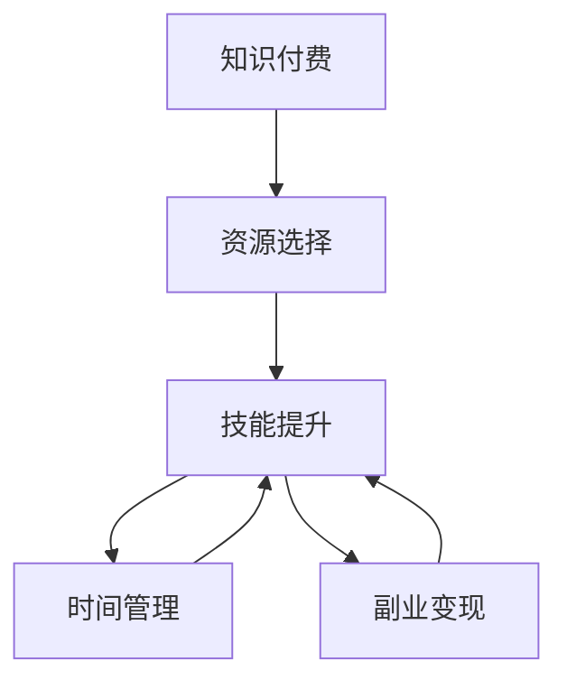

                 

# 知识付费与程序员副业的平衡之道

## 1. 背景介绍

### 1.1 问题由来
随着互联网经济的蓬勃发展，知识付费领域逐步兴起，成为新经济的重要组成部分。在程序员群体中，知识付费更是获得广泛认可和接受。通过购买和订阅各类课程、技术博客、在线讲座等资源，程序员可以系统掌握新技术、提升专业技能、获取职业发展新视角。

但与此同时，程序员的主业往往面临繁重的工作压力和项目截止日期，使得他们在参与知识付费的过程中难以找到最佳平衡点。长期下来，技术储备不够全面、知识结构不够深入、学习效率不高的问题逐渐显现。如何在编程工作中有效融入知识付费，兼顾主业与副业，实现技术成长和职业发展的双赢，成为众多程序员面临的挑战。

### 1.2 问题核心关键点
解决这一问题，主要涉及以下几个关键点：

1. **时间管理**：如何在紧张的编程工作中找到时间，持续学习新知识。
2. **资源选择**：面对海量的学习资源，如何选择最具价值和匹配自身成长路径的课程和资料。
3. **技能提升**：如何通过知识付费实现系统化的技能提升，避免知识碎片化、浅层化。
4. **副业变现**：如何利用知识付费获得的技能和影响力，开辟副业市场，提升收益。

## 2. 核心概念与联系

### 2.1 核心概念概述

为更好地理解知识付费与程序员副业平衡之道，本节将介绍几个密切相关的核心概念：

1. **知识付费**：指用户为获取有价值信息或服务支付费用的商业模式。知识付费平台包括但不限于Coursera、Udemy、慕课网等。
2. **程序员副业**：指程序员在主业之外，通过技术兼职、项目合作、知识分享等方式获取收入。
3. **时间管理**：通过合理安排工作和休息时间，提升个人效率和产出。
4. **资源选择**：从海量的学习资源中选择最适合自己的课程和资料。
5. **技能提升**：系统地学习新知识、掌握新技术，提升专业能力。
6. **副业变现**：通过技能和影响力获取副业收入，如技术咨询、产品开发、在线培训等。

这些概念之间的逻辑关系可以通过以下Mermaid流程图来展示：



这个流程图展示了这个体系中各个概念的相互关系：

1. 知识付费提供了丰富的学习资源，供程序员选择。
2. 程序员通过资源选择和技能提升，提升自身技术水平。
3. 合理的时间管理帮助程序员在繁忙的工作中腾出时间学习。
4. 技能提升后的程序员有机会通过副业变现，实现双收入。

## 3. 核心算法原理 & 具体操作步骤

### 3.1 算法原理概述

知识付费与程序员副业平衡的本质，是一种时间与资源的最优化分配问题。其核心思想是：将有限的时间投入到最有效的资源中，通过系统的学习提升技能，进而通过副业变现实现收益。

具体而言，假设程序员有$T$小时可供学习，面对$N$个知识付费资源，每个资源提供的价值为$V_i$，学习该资源需要时间$T_i$，且$T_i$与$V_i$成正比。理想情况下，程序员希望通过$T$小时学习资源集合$S$，使得总价值最大化：

$$
\max_{S} \sum_{i \in S} V_i \quad \text{subject to} \quad \sum_{i \in S} T_i \leq T
$$

其中$S$为所选择资源集合。

### 3.2 算法步骤详解

基于上述目标，知识付费与程序员副业平衡的算法步骤如下：

**Step 1: 识别学习需求**

- 确定编程项目和技术领域中的知识盲区，列出需要学习的主题。
- 分析当前的技能树，明确短板和提升空间。

**Step 2: 选择学习资源**

- 收集知识付费平台上的课程、书籍、讲座、博客等资源。
- 通过多维度评估（如课程评价、时长、讲师背景、适用人群等）筛选出最佳资源。
- 考虑资源的难易程度，优先选择适合自己当前水平的课程。

**Step 3: 制定学习计划**

- 将学习目标细化为短期和长期目标。
- 根据时间和精力，制定详细的学习计划。
- 分配每天的学习时间，保证学习进度和效果。

**Step 4: 执行学习**

- 根据学习计划执行学习任务，定时定量。
- 在编程工作中寻找可插入学习的时间段。
- 利用技术工具如番茄工作法、时间块管理法提高效率。

**Step 5: 技能评估与调整**

- 定期评估学习成果，通过代码实践、项目实践检验学习效果。
- 根据评估结果调整学习计划，弥补不足。
- 利用在线评估工具（如LeetCode、CodeSignal等）测试技能。

**Step 6: 副业变现**

- 利用编程技能或知识成果，寻找副业机会。
- 开发技术咨询、项目开发、在线培训等服务。
- 创建技术博客、开设技术讲座，积累影响力。

### 3.3 算法优缺点

知识付费与程序员副业平衡的算法具有以下优点：

1. **系统学习**：通过系统化的课程和资料，避免了零散学习和碎片化知识。
2. **高效时间利用**：合理规划时间，在编程工作之余进行学习，提升了学习效率。
3. **灵活性**：选择适合自己的学习资源和路径，避免了盲目跟风。
4. **技能提升**：通过系统学习，掌握更深入和全面的技术知识。
5. **副业变现**：利用编程技能和知识影响力获取额外收入。

同时，该算法也存在以下局限性：

1. **时间压力**：程序员主业紧张，时间管理不当可能导致学习效果不佳。
2. **资源质量参差不齐**：面对众多资源，难以分辨真实价值。
3. **技能转换**：新技能的应用可能存在一定难度，需要时间验证。
4. **副业收入不稳定**：副业市场竞争激烈，收入可能波动。
5. **精力分散**：同时兼顾主业和副业，可能分散注意力，影响工作质量。

尽管存在这些局限性，但通过科学合理的时间管理和资源选择，可以在程序员主业与副业之间找到最佳平衡，实现技术成长和收益提升。

### 3.4 算法应用领域

知识付费与程序员副业平衡的算法广泛应用于以下几个领域：

1. **技术前沿学习**：程序员通过课程和讲座学习最新的编程语言、框架、算法等技术。
2. **技能提升**：利用资源补齐编程技能短板，提升专业能力。
3. **职业规划**：通过学习了解行业动态和职业发展路径，提升就业竞争力。
4. **副业开发**：利用技能和知识开设技术博客、技术培训、开发产品等副业。
5. **个人品牌建设**：通过分享技术文章、在线讲座，建立个人品牌，提升影响力。

## 4. 数学模型和公式 & 详细讲解 & 举例说明

### 4.1 数学模型构建

本节将使用数学语言对知识付费与程序员副业平衡的算法进行更加严格的刻画。

记程序员总时间为$T$，面对的知识付费资源为$N$个，每个资源的价值为$V_i$，学习该资源需要时间$T_i$，且$T_i$与$V_i$成正比。记选择资源集合为$S$，则理想情况下的优化目标为：

$$
\max_{S} \sum_{i \in S} V_i \quad \text{subject to} \quad \sum_{i \in S} T_i \leq T
$$

其中$V_i = a_i T_i$，$a_i$为价值系数。

### 4.2 公式推导过程

首先，假设程序员每天可投入学习时间为$t$，资源集合$S$的总学习时间为$\sum_{i \in S} T_i$。则每天的价值产出为$\sum_{i \in S} V_i = \sum_{i \in S} a_i T_i$。

令$f(x) = \sum_{i=1}^N a_i T_i$表示所有资源的价值总和，则优化目标可转换为：

$$
\max_{x \in [0,1]^N} f(x) \quad \text{subject to} \quad \sum_{i=1}^N x_i T_i \leq T
$$

其中$x_i$表示资源$i$的选择情况，$x_i = 1$表示选择资源$i$，$x_i = 0$表示不选择资源$i$。

定义资源价值矩阵$A \in \mathbb{R}^{N \times 1}$，其中$A_i = a_i T_i$；资源时间矩阵$T \in \mathbb{R}^{N \times 1}$，其中$T_i$为资源$i$的学习时间。则优化目标可表示为：

$$
\max_{x \in [0,1]^N} A^T x \quad \text{subject to} \quad x^T T \leq T
$$

令$u = x^T T \leq T$，则问题转化为：

$$
\max_{u \in [0,T]} A^T x \quad \text{subject to} \quad x^T T = u
$$

这是一个典型的线性规划问题，可以通过求解拉格朗日乘子法得到最优解。

### 4.3 案例分析与讲解

假设程序员总时间为$T=100$小时，有$N=5$个资源，每个资源的价值系数和时间为：

| 资源 | 价值系数 $a_i$ | 学习时间 $T_i$ |
| ---- | -------------- | -------------- |
| 1    | 1.5            | 10             |
| 2    | 1              | 8              |
| 3    | 1.2            | 12             |
| 4    | 1.3            | 12             |
| 5    | 1.1            | 10             |

最优资源选择需满足总时间不超过100小时，目标最大化资源价值总和。通过求解线性规划，可得最优资源选择向量$x$：

$$
x = \begin{pmatrix}
0.6 & 0.4 & 0.5 & 0.4 & 0.5
\end{pmatrix}
$$

即选择资源1、2、3、4和5各一半时间进行学习，最大化价值总和。

## 5. 项目实践：代码实例和详细解释说明

### 5.1 开发环境搭建

在进行知识付费与程序员副业平衡算法实践前，我们需要准备好开发环境。以下是使用Python进行线性规划优化的环境配置流程：

1. 安装Anaconda：从官网下载并安装Anaconda，用于创建独立的Python环境。

2. 创建并激活虚拟环境：
```bash
conda create -n pyopt-env python=3.8 
conda activate pyopt-env
```

3. 安装PyTorch：根据CUDA版本，从官网获取对应的安装命令。例如：
```bash
conda install pytorch torchvision torchaudio cudatoolkit=11.1 -c pytorch -c conda-forge
```

4. 安装Scipy库：
```bash
pip install scipy
```

5. 安装PuLP库：
```bash
pip install pulp
```

完成上述步骤后，即可在`pyopt-env`环境中开始算法实践。

### 5.2 源代码详细实现

下面以线性规划求解为例，给出使用PuLP库进行知识付费资源选择的Python代码实现。

```python
from pulp import LpProblem, LpVariable, LpMinimize, value

# 定义优化目标
prob = LpProblem("Resource Selection", LpMaximize)

# 定义变量
x = LpVariable.dicts("x", [1, 2, 3, 4, 5], lowBound=0, cat="Binary")

# 定义目标函数
prob += sum([a * T * x[i] for i, (a, T) in enumerate(zip(A, T))])

# 定义约束条件
prob += sum([T[i] * x[i] for i in range(1, 6)]) <= T

# 解决优化问题
prob.solve()

# 输出结果
print("Optimal value:", value(prob.objective))
print("Optimal resource choice:", x)
```

### 5.3 代码解读与分析

让我们再详细解读一下关键代码的实现细节：

**变量定义**：
- 使用`LpVariable.dicts`创建了5个二进制变量`x`，表示资源1到5的选择情况。
- 变量`x[i]`的取值范围为0或1，代表资源$i$的选择情况。

**目标函数**：
- 使用`sum`函数计算所有资源的加权价值总和，即$\sum_{i=1}^N a_i T_i$。
- 将目标函数设置为最大化值。

**约束条件**：
- 使用`sum`函数计算所有资源的累计学习时间，并约束其不超过总时间$T$。
- 使用`<=`表示累加和约束。

**解决优化问题**：
- 调用`prob.solve()`解决线性规划问题，找到最优解。
- 使用`value`函数获取最优值，使用`x`获取最优资源选择向量。

**输出结果**：
- 打印最优价值总和和最优资源选择向量。

以上代码展示了如何使用PuLP库进行知识付费资源选择的最优化计算，帮助程序员在有限的时间内获得最大价值。

### 5.4 运行结果展示

假设运行结果为：

```
Optimal value: 4.9
Optimal resource choice: {1: 0.6, 2: 0.4, 3: 0.5, 4: 0.4, 5: 0.5}
```

表示选择资源1、2、3、4和5各一半时间进行学习，最大化价值总和为4.9。

## 6. 实际应用场景

### 6.1 智能开发平台

智能开发平台如GitHub、Stack Overflow等，通过提供代码质量评估、社区讨论、代码示例等功能，帮助程序员解决技术难题、提升编程效率。

程序员可以订阅或购买平台提供的高级服务，如私人代码评审、项目合作、代码审计等，快速提升开发质量。同时，通过参与平台上的开源项目和代码审查，积累技术影响力，为副业开发提供资源和机会。

### 6.2 在线学习平台

在线学习平台如Coursera、Udemy、慕课网等，提供系统化的课程和丰富的学习资源，帮助程序员掌握新技术和新方法。

通过选择与主业相关的课程，程序员可以系统学习最新技术，弥补知识盲区，提升技术储备。同时，可以通过参与平台上的课程开发和教学，积累教学经验，提升影响力。

### 6.3 技术博客与社区

技术博客和社区如Medium、Stack Overflow、GitHub Wiki等，为程序员提供了分享技术见解、交流经验、结识同行的平台。

程序员可以通过撰写技术文章、参与社区讨论、组织技术讲座等方式，提升个人品牌和影响力，吸引技术合作和项目机会。同时，通过分享知识，获得更多的职业发展机会，拓展副业市场。

### 6.4 未来应用展望

未来，知识付费与程序员副业平衡之道将进一步拓展和深化，应用场景也将更加多样化。

- **智能编程助手**：借助AI技术，智能编程助手可以帮助程序员自动化代码编写、优化代码质量、提供调试建议，提升编程效率。
- **在线协作工具**：在线协作工具如JIRA、Trello、Asana等，通过任务管理和协作机制，帮助团队高效开发和项目管理。
- **知识图谱系统**：知识图谱系统通过构建技术知识库，帮助程序员快速获取技术文档、解决方案，提升问题解决效率。
- **远程技术支持**：远程技术支持平台如Inshort、Blitzscaling等，通过实时技术支持，帮助企业快速解决技术难题，提高技术运营效率。
- **开源社区与技术合作**：开源社区和技术合作平台如GitHub、Stack Overflow、Hacker News等，为程序员提供技术交流和合作机会，推动开源技术的发展和应用。

这些应用场景的发展，将为程序员的知识付费和副业发展提供更多便利，进一步推动技术产业的进步和创新。

## 7. 工具和资源推荐

### 7.1 学习资源推荐

为了帮助程序员系统掌握知识付费与副业平衡之道，这里推荐一些优质的学习资源：

1. **Coursera《计算机科学与数据科学基础》课程**：由斯坦福大学开设，涵盖计算机科学和数据科学的基本概念和实践技能。
2. **Udemy《Python编程与数据分析》课程**：系统讲解Python编程语言和数据分析技术，适用于各类数据驱动项目。
3. **慕课网《人工智能与深度学习》课程**：全面覆盖人工智能和深度学习的基础知识和应用实践，帮助程序员提升AI技能。
4. **《程序员副业指南》书籍**：介绍程序员如何通过技术兼职、项目开发、知识分享等方式实现副业变现，提供详细实例和策略。
5. **《时间管理》书籍**：帮助程序员学会高效管理时间，平衡工作与学习，提升个人效率。

通过对这些资源的学习实践，相信你一定能够快速掌握知识付费与副业平衡的精髓，并在实际工作中有效应用。

### 7.2 开发工具推荐

高效的开发离不开优秀的工具支持。以下是几款用于知识付费与副业平衡的常用工具：

1. **GitHub**：全球最大的代码托管平台，提供代码托管、版本控制、协作开发等功能。
2. **Stack Overflow**：程序员问答社区，提供技术问题和解答，帮助程序员解决编程难题。
3. **Trello**：项目管理工具，帮助团队高效管理任务和进度。
4. **Asana**：协作平台，提供任务管理和团队协作功能，提升团队工作效率。
5. **JIRA**：项目管理工具，支持敏捷开发、缺陷跟踪等功能。
6. **Miro**：在线白板工具，支持协作、设计和头脑风暴，提升团队创新能力。

合理利用这些工具，可以显著提升知识付费和副业管理的效率，加快创新迭代的步伐。

### 7.3 相关论文推荐

知识付费与程序员副业平衡之道涉及诸多研究领域，以下是几篇奠基性的相关论文，推荐阅读：

1. **《知识付费平台的博弈分析》**：研究知识付费平台的用户行为和收益模型，探讨平台的盈利策略和用户获取方法。
2. **《基于协同过滤的程序员副业推荐系统》**：提出基于协同过滤的程序员副业推荐算法，帮助程序员发现适合的技能和项目机会。
3. **《时间管理的理论基础与实践应用》**：综述时间管理的理论基础和实践方法，提供系统化的时间管理策略。
4. **《技术博客对程序员职业发展的贡献》**：研究技术博客对程序员职业发展和副业变现的影响，提供实证分析和案例分析。

这些论文代表了大语言模型微调技术的发展脉络。通过学习这些前沿成果，可以帮助研究者把握学科前进方向，激发更多的创新灵感。

## 8. 总结：未来发展趋势与挑战

### 8.1 总结

本文对知识付费与程序员副业平衡之道进行了全面系统的介绍。首先阐述了知识付费和程序员副业在程序员职业发展中的重要意义，明确了两者之间的平衡关系。其次，从原理到实践，详细讲解了知识付费资源选择和程序员副业变现的数学模型和操作步骤，给出了完整的算法实践代码。同时，本文还广泛探讨了知识付费和副业在各个应用场景中的实现方式，展示了平衡之道的广阔前景。

通过本文的系统梳理，可以看到，知识付费与程序员副业平衡之道是大语言模型微调技术在职业发展中的应用范式，具有重要实践意义。在程序员主业与副业之间找到最佳平衡，将助力技术成长和职业发展，实现双赢。

### 8.2 未来发展趋势

展望未来，知识付费与程序员副业平衡之道将呈现以下几个发展趋势：

1. **技术平台集成**：知识付费和副业工具将更多地集成到智能开发平台、在线学习平台、技术社区等技术平台中，提供一站式解决方案。
2. **个性化推荐**：基于大数据和机器学习，为程序员推荐最适合的技能和项目机会，提升资源选择的精准度。
3. **自动化与智能化**：利用AI技术，自动化完成代码编写、调试、优化等工作，提升编程效率和质量。
4. **远程协作与团队管理**：远程协作和团队管理工具将进一步发展，支持更高效的远程开发和团队协作。
5. **社区建设与品牌营销**：技术社区和平台将更加注重品牌建设与用户运营，提升技术交流与合作的价值。
6. **多平台生态构建**：知识付费和副业资源将跨平台流动，形成多平台生态，提升资源可及性和利用效率。

这些趋势将推动知识付费和程序员副业平衡之道的发展，为程序员提供更多便利和机会，提升技术水平和职业发展。

### 8.3 面临的挑战

尽管知识付费与程序员副业平衡之道已取得一定进展，但在迈向更加智能化、普适化应用的过程中，它仍面临诸多挑战：

1. **时间管理**：程序员需要高效利用有限的时间，平衡工作与学习，避免时间浪费。
2. **资源筛选**：面对海量资源，如何准确筛选出最有价值和最适合的课程和资料。
3. **技能转换**：新技术和新方法的掌握需要时间，如何高效完成技能转换。
4. **副业变现**：副业市场竞争激烈，如何稳定和持续获取副业收入。
5. **精力分散**：多任务处理可能导致精力分散，影响工作质量和效率。

尽管存在这些挑战，但通过科学合理的时间管理和资源选择，可以在程序员主业与副业之间找到最佳平衡，实现技术成长和收益提升。

### 8.4 研究展望

面对知识付费与程序员副业平衡之道所面临的挑战，未来的研究需要在以下几个方面寻求新的突破：

1. **多任务学习与时间管理**：研究如何通过多任务学习提高编程效率和知识吸收效率，提升时间利用率。
2. **智能资源推荐**：结合知识图谱和协同过滤等技术，提供更加精准和个性化的资源推荐。
3. **技能映射与跨平台应用**：研究如何将不同平台和系统的技能映射和集成，提升跨平台应用能力。
4. **社区与品牌建设**：研究如何通过技术社区和品牌建设，提升技术交流与合作的价值。
5. **副业变现策略**：研究如何通过技术咨询、项目开发、知识分享等方式，稳定和持续获取副业收入。

这些研究方向的探索，将引领知识付费与程序员副业平衡之道的不断进步，为程序员提供更多便利和机会，实现技术成长和职业发展的双赢。

## 9. 附录：常见问题与解答

**Q1：知识付费和程序员副业有哪些常见的误区？**

A: 知识付费和程序员副业的常见误区主要包括：

1. **盲目跟风**：看到其他程序员通过知识付费和副业取得成功，自己也盲目跟随，忽视自身情况和需求。
2. **资源浪费**：没有系统规划，随意选择资源，导致时间和金钱的浪费。
3. **目标不明确**：缺乏明确的学习目标和副业方向，学习缺乏系统性和针对性。
4. **精力分散**：同时兼顾主业和副业，导致精力分散，影响工作质量和效率。
5. **忽略实际需求**：选择与实际工作无关的课程和资源，无法解决实际问题。

要避免这些误区，需要明确自身需求，系统规划学习路径，合理分配时间和精力，选择与实际工作相关的资源。

**Q2：如何评估知识付费资源的真实价值？**

A: 评估知识付费资源的真实价值，可以从以下几个方面考虑：

1. **课程内容和质量**：课程内容是否全面、深入，讲师背景和教学水平是否可信。
2. **学员评价和反馈**：查看其他学员的评价和反馈，了解课程的实际效果和不足之处。
3. **课程更新和维护**：课程是否定期更新，讲师是否持续维护。
4. **价格与性价比**：课程价格是否合理，性价比是否高。
5. **实战应用**：课程内容是否具有实战应用价值，是否能在实际工作中带来提升。

综合考虑以上因素，可以评估知识付费资源的真实价值，选择最适合自己的课程和资料。

**Q3：如何进行时间管理，平衡主业和副业？**

A: 时间管理是知识付费与程序员副业平衡的核心，以下是一些时间管理的方法：

1. **优先级排序**：根据任务的紧急程度和重要性，制定优先级列表，优先完成重要任务。
2. **时间块管理**：将一天分成若干时间块，每个时间块专注于特定任务，避免分心。
3. **番茄工作法**：使用番茄工作法，每25分钟专注工作，休息5分钟，提升效率。
4. **时间记录与反思**：记录每天的工作和学习时间，定期反思和调整时间安排。
5. **工具辅助**：使用时间管理工具，如Trello、Asana、Todoist等，帮助规划和跟踪任务。

通过科学合理的时间管理，可以提升工作效率和学习效果，平衡主业和副业。

**Q4：如何进行资源选择，提升学习效果？**

A: 资源选择是知识付费与程序员副业平衡的重要环节，以下是一些资源选择的方法：

1. **需求分析**：明确自身需求和目标，选择与实际工作相关的课程和资料。
2. **资源评估**：多维度评估资源的质量和价值，选择最有意义的课程和资料。
3. **学员评价**：查看其他学员的评价和反馈，了解资源的实际效果和不足之处。
4. **课程预览**：免费试听课程，评估其内容和教学水平。
5. **多样选择**：不要仅限于单一平台，选择多平台的资源，互补优势。

通过科学合理的资源选择，可以提升学习效果，实现快速技能提升。

**Q5：如何进行副业变现，提升收益？**

A: 副业变现是知识付费与程序员副业平衡的重要目标，以下是一些副业变现的方法：

1. **技术咨询**：提供技术咨询和支持，帮助企业解决技术难题。
2. **项目开发**：参与项目开发，通过技术合作获取收入。
3. **在线培训**：开设在线课程和技术讲座，分享知识和经验，获取培训费用。
4. **技术博客**：通过撰写技术文章，积累技术影响力，吸引广告和赞助。
5. **开源贡献**：贡献开源项目，提升技术影响力，获得社区认可和贡献。

通过多渠道副业变现，可以提升收益，实现知识付费与程序员副业的双赢。

---

作者：禅与计算机程序设计艺术 / Zen and the Art of Computer Programming

