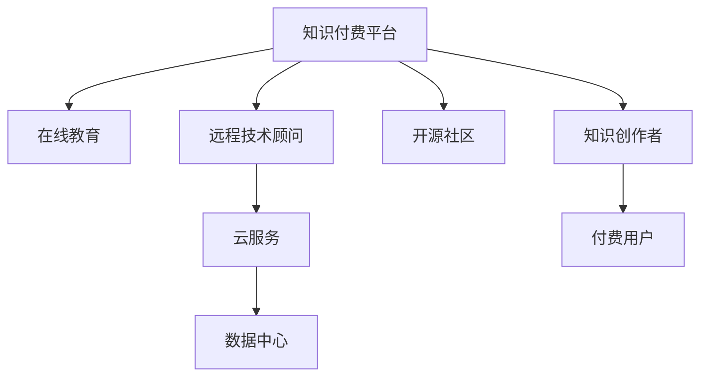

                 

# 知识付费与远程技术顾问的双线发展

## 1. 背景介绍

随着互联网技术的快速发展和普及，人们的生活方式和工作模式发生了深刻的变化。一方面，知识的获取变得越来越便捷，在线教育、电子书、开放课程等资源为大众提供了丰富的学习机会。另一方面，远程办公、虚拟协作等新兴工作方式也逐步成为主流，使得技术人员能够跨越地理限制，提供专业的技术支持和咨询服务。

在这样的背景下，知识付费和远程技术顾问成为了技术领域中的双线发展趋势。知识付费平台为知识输出者提供了展示和变现的渠道，而远程技术顾问则通过互联网连接起用户和技术人员，帮助解决复杂的技术问题和提供个性化的技术支持。

### 1.1 知识付费的兴起

知识付费，是指用户为获取专业知识或技能而支付费用的现象。随着内容创作者的增多和用户需求的增加，知识付费市场迅速发展。从在线课程、电子书、技术博客到各类视频教程，知识付费已经成为技术交流和知识传播的重要途径。

知识付费不仅解决了传统教育资源分配不均的问题，还为知识创作者带来了稳定的收入来源，形成了良性循环。同时，付费用户也能够获得更为专业、系统的学习内容，提高学习和工作的效率。

### 1.2 远程技术顾问的普及

远程技术顾问是指通过网络平台提供远程技术支持的服务。随着互联网技术的进步和远程办公模式的普及，越来越多的企业和技术人员开始接受并采用远程技术顾问的服务。企业可以通过远程技术顾问解决复杂的技术问题，技术人员也可以通过远程平台提供专业的技术支持和咨询服务。

远程技术顾问打破了时间和空间的限制，使得技术支持更加便捷高效。同时，远程技术顾问也提高了技术人员的时间利用率，帮助企业降低技术支持的成本。

## 2. 核心概念与联系

### 2.1 核心概念概述

为更好地理解知识付费和远程技术顾问的双线发展，本节将介绍几个密切相关的核心概念：

- **知识付费平台**：通过互联网平台提供各种形式的知识内容，用户通过支付费用获取知识和技能。
- **远程技术顾问**：通过互联网平台提供远程技术支持，解决用户的技术问题，支持企业的技术开发和维护。
- **在线教育**：通过互联网提供各类学习资源和课程，用户可以随时随地进行学习。
- **开源社区**：一个开放的平台，技术爱好者可以在此分享知识、协作开发，解决技术问题。
- **云服务**：通过互联网提供计算、存储、网络等服务，帮助企业高效运行和扩展IT基础设施。

这些核心概念之间的逻辑关系可以通过以下Mermaid流程图来展示：



这个流程图展示了几大核心概念及其之间的关系：

1. 知识付费平台提供各类学习资源，包括在线教育、远程技术顾问、开源社区等。
2. 知识创作者通过平台获得收入，付费用户获取所需知识和技能。
3. 远程技术顾问通过平台提供技术支持，解决复杂的技术问题。
4. 云服务提供基础设施支持，保证平台的稳定运行。
5. 开源社区促进技术交流和协作开发。

## 3. 核心算法原理 & 具体操作步骤

### 3.1 算法原理概述

知识付费和远程技术顾问的双线发展，本质上是信息技术和互联网技术的应用，涉及到平台建设、用户交互、数据处理等多个方面。

知识付费平台的核心算法包括内容推荐、搜索排序、用户行为分析等。远程技术顾问的核心算法包括问题诊断、解决方案匹配、技术支持评估等。

### 3.2 算法步骤详解

#### 3.2.1 知识付费平台的算法步骤

1. **内容生成**：知识创作者在平台上发布文章、视频、教程等形式的内容。
2. **内容审核**：平台对发布内容进行审核，确保内容质量。
3. **内容推荐**：利用机器学习算法，根据用户的历史行为和兴趣，推荐相关内容。
4. **搜索排序**：优化搜索结果，使用倒排索引等技术提高搜索效率。
5. **用户行为分析**：分析用户访问行为，提供个性化推荐和广告投放。

#### 3.2.2 远程技术顾问的算法步骤

1. **问题提交**：用户通过平台提交技术问题。
2. **问题分析**：技术顾问分析问题，确定问题类型和严重程度。
3. **方案匹配**：根据问题类型，匹配解决方案，提供多层次技术支持。
4. **问题跟踪**：跟踪问题解决情况，提供后续支持和优化建议。
5. **支持评估**：评估技术支持效果，收集用户反馈，不断改进服务。

### 3.3 算法优缺点

知识付费和远程技术顾问的双线发展具有以下优点：

1. **高效便捷**：用户可以随时随地获取知识和技能，解决技术问题。
2. **资源丰富**：平台汇集了大量优质资源，用户可以自由选择。
3. **灵活多样**：提供了多种形式的内容和服务，满足不同用户需求。
4. **成本效益**：知识付费和远程技术顾问降低了用户获取知识和技能的时间成本和费用。

同时，这些方法也存在一些局限性：

1. **质量参差不齐**：平台上内容和服务质量不一，需要用户自己筛选和评估。
2. **依赖平台**：平台的用户体验和服务质量直接影响用户的使用意愿。
3. **隐私安全**：平台和用户的交互过程中，涉及大量个人信息和数据，需加强隐私保护。
4. **内容原创性**：部分知识内容可能存在版权问题，需注意合规性。

### 3.4 算法应用领域

知识付费和远程技术顾问在多个领域得到广泛应用，例如：

- **在线教育**：提供各类课程和培训，帮助用户掌握新知识和技能。
- **技术支持**：解决技术问题和故障，提高企业的运营效率。
- **软件开发**：提供技术指导和协作开发，加速软件开发进程。
- **企业培训**：为员工提供专业技能培训，提升整体素质。
- **项目管理**：提供项目管理和技术支持，帮助企业高效管理项目。

## 4. 数学模型和公式 & 详细讲解

### 4.1 数学模型构建

在知识付费和远程技术顾问的双线发展中，涉及大量的数据处理和算法优化。以下是几个关键数学模型和公式：

- **内容推荐模型**：使用协同过滤、矩阵分解等技术，构建用户和内容的相似度矩阵，进行推荐。
- **问题分析模型**：使用自然语言处理技术，分析用户提交的问题，提取关键信息和特征。
- **方案匹配模型**：使用分类和回归等机器学习算法，匹配解决方案和用户问题。

### 4.2 公式推导过程

以内容推荐模型为例，推导协同过滤算法的核心公式。

设用户 $u$ 对内容 $i$ 的评分向量为 $r_u$，内容 $i$ 的评分向量为 $r_i$，则协同过滤算法的推荐公式为：

$$
\hat{r}_{ui} = \hat{\theta}^T \Phi(r_u, r_i)
$$

其中，$\hat{\theta}$ 是推荐模型的参数向量，$\Phi$ 是相似度函数，可以是余弦相似度、皮尔逊相关系数等。

在实际应用中，可以使用矩阵分解技术将用户和内容的评分矩阵分解为低秩矩阵，从而得到推荐模型。

### 4.3 案例分析与讲解

#### 案例分析

1. **内容推荐系统**：某在线教育平台使用协同过滤算法推荐课程。平台首先收集用户的历史评分数据，构建用户和课程的评分矩阵。然后利用矩阵分解技术，得到用户和课程的潜在特征向量 $\hat{\theta}_u$ 和 $\hat{\theta}_i$。最后使用相似度函数 $\Phi$ 计算用户 $u$ 对内容 $i$ 的推荐评分 $\hat{r}_{ui}$。

2. **问题分析系统**：某技术支持平台使用自然语言处理技术分析用户提交的问题。平台首先收集历史问题和解决方案的数据，提取问题的关键特征。然后利用分类算法，将问题分为不同类型，匹配解决方案。

3. **方案匹配系统**：某远程技术顾问平台使用回归算法匹配解决方案。平台首先收集历史问题和解决方案的数据，提取问题特征。然后利用回归算法，建立问题特征和解决方案之间的映射关系，得到推荐方案。

## 5. 项目实践：代码实例和详细解释说明

### 5.1 开发环境搭建

在进行知识付费和远程技术顾问的项目实践前，我们需要准备好开发环境。以下是使用Python进行PyTorch和Flask开发的开发环境配置流程：

1. 安装Anaconda：从官网下载并安装Anaconda，用于创建独立的Python环境。

2. 创建并激活虚拟环境：
```bash
conda create -n pytorch-env python=3.8 
conda activate pytorch-env
```

3. 安装PyTorch：根据CUDA版本，从官网获取对应的安装命令。例如：
```bash
conda install pytorch torchvision torchaudio cudatoolkit=11.1 -c pytorch -c conda-forge
```

4. 安装Flask：
```bash
pip install flask
```

5. 安装各类工具包：
```bash
pip install numpy pandas scikit-learn matplotlib tqdm jupyter notebook ipython
```

完成上述步骤后，即可在`pytorch-env`环境中开始项目实践。

### 5.2 源代码详细实现

下面我们以知识付费平台的推荐系统为例，给出使用PyTorch和Flask进行开发的PyTorch代码实现。

首先，定义协同过滤推荐算法：

```python
from torch.nn import Linear
import torch.nn.functional as F
import torch

class协同过滤模型(nn.Module):
    def __init__(self, dim):
        super(协同过滤模型, self).__init__()
        self.fc1 = Linear(dim, dim)
        self.fc2 = Linear(dim, 1)
        
    def forward(self, x):
        x = F.relu(self.fc1(x))
        x = self.fc2(x)
        return x
```

然后，定义Flask服务，提供API接口：

```python
from flask import Flask, request
from 协同过滤模型 import 协同过滤模型

app = Flask(__name__)

# 加载模型
model = 协同过滤模型(dim=100)
model.load_state_dict(torch.load('model.pth'))

@app.route('/recommend', methods=['POST'])
def recommend():
    data = request.get_json()
    user_id = data['user_id']
    item_id = data['item_id']
    
    # 获取用户评分和物品评分
    user_scores = model_user_scores(user_id)
    item_scores = model_item_scores(item_id)
    
    # 计算推荐分数
    scores = torch.matmul(user_scores, item_scores.t())
    
    # 返回推荐结果
    return {'item_id': scores.argmax().item()}

if __name__ == '__main__':
    app.run()
```

最后，启动Flask服务：

```bash
python app.py
```

运行后，可以使用如下命令进行测试：

```bash
curl -X POST -H "Content-Type: application/json" -d '{"user_id": 1, "item_id": 2}' http://localhost:5000/recommend
```

以上就是使用PyTorch和Flask进行知识付费平台推荐系统开发的完整代码实现。可以看到，利用深度学习算法和Web框架，可以简洁高效地构建推荐系统，满足用户的多样化需求。

### 5.3 代码解读与分析

让我们再详细解读一下关键代码的实现细节：

**协同过滤模型类**：
- `__init__`方法：定义模型的输入和输出维度，并初始化全连接层。
- `forward`方法：定义前向传播过程，先通过ReLU激活函数进行处理，再通过全连接层输出预测值。

**Flask服务**：
- 使用Flask框架，定义API接口。
- 通过请求数据获取用户ID和物品ID。
- 使用模型获取用户评分和物品评分，计算推荐分数。
- 返回推荐结果。

**Flask测试命令**：
- 使用curl命令向Flask服务发送POST请求，指定JSON格式的请求体。
- 请求体包含用户ID和物品ID，服务器返回推荐结果。

通过Flask和PyTorch的结合使用，可以显著提高知识付费平台的开发效率，满足用户的多样化需求。同时，利用深度学习算法，可以提升推荐系统的精度和效果。

## 6. 实际应用场景

### 6.1 在线教育

知识付费和远程技术顾问在在线教育领域得到了广泛应用。通过知识付费平台，学生可以轻松获取各类在线课程和资料，利用碎片时间进行学习。同时，远程技术顾问能够帮助学生解决学习中的疑难问题，提供个性化的学习支持。

在技术实现上，知识付费平台可以提供视频课程、电子书、在线讲义等多种形式的内容，满足不同学生的学习需求。远程技术顾问可以通过平台提供一对一的技术支持，解答学生的疑问，引导学生进行学习和思考。

### 6.2 技术支持

技术支持是知识付费和远程技术顾问的重要应用场景。企业内部IT部门常常面临大量技术问题，而技术支持人员难以随时在线解答，造成工作效率低下。通过知识付费和远程技术顾问，企业可以迅速获取专业的技术支持，解决复杂的技术问题，保证业务的稳定运行。

在技术实现上，知识付费平台可以整合各类技术支持资源，为企业提供全面的技术支持服务。远程技术顾问可以通过平台提供实时支持，解答企业的技术问题，提供技术方案和优化建议。

### 6.3 软件开发

软件开发是另一个知识付费和远程技术顾问的重要应用场景。开发人员常常面临技术难题和算法问题，需要耗费大量时间进行研究和调试。通过知识付费和远程技术顾问，开发人员可以迅速获取技术指导和解决方案，提升开发效率。

在技术实现上，知识付费平台可以提供各类技术文档、代码示例、社区讨论等资源，帮助开发人员解决问题。远程技术顾问可以通过平台提供技术指导和协作开发，加速软件开发进程。

## 7. 工具和资源推荐

### 7.1 学习资源推荐

为了帮助开发者系统掌握知识付费和远程技术顾问的理论基础和实践技巧，这里推荐一些优质的学习资源：

1. **《知识付费平台设计与实现》系列博文**：由知识付费平台专家撰写，深入浅出地介绍了知识付费平台的建设、运营和优化策略。

2. **《远程技术支持系统设计与实现》课程**：在线教育平台开设的远程技术支持课程，涵盖知识付费、技术支持、远程协作等多个方面，带你入门技术支持系统开发。

3. **《深度学习在NLP中的应用》书籍**：介绍深度学习在自然语言处理中的应用，包括推荐系统、问题分析等，帮助你掌握相关算法和技术。

4. **Coursera《机器学习》课程**：由斯坦福大学教授Andrew Ng主讲，系统讲解机器学习原理和算法，是技术开发和算法优化的重要参考。

5. **GitHub开源项目**：收集了大量知识付费和远程技术顾问的代码和项目，提供了丰富的实践案例和学习资料。

通过对这些资源的学习实践，相信你一定能够快速掌握知识付费和远程技术顾问的精髓，并用于解决实际的NLP问题。

### 7.2 开发工具推荐

高效的开发离不开优秀的工具支持。以下是几款用于知识付费和远程技术顾问开发的常用工具：

1. **PyTorch**：基于Python的开源深度学习框架，灵活动态的计算图，适合快速迭代研究。大量预训练语言模型都有PyTorch版本的实现。

2. **Flask**：轻量级的Web框架，易于上手和扩展，适合快速搭建API服务。

3. **TensorFlow**：由Google主导开发的开源深度学习框架，生产部署方便，适合大规模工程应用。同样有丰富的预训练语言模型资源。

4. **Weights & Biases**：模型训练的实验跟踪工具，可以记录和可视化模型训练过程中的各项指标，方便对比和调优。与主流深度学习框架无缝集成。

5. **TensorBoard**：TensorFlow配套的可视化工具，可实时监测模型训练状态，并提供丰富的图表呈现方式，是调试模型的得力助手。

6. **Jupyter Notebook**：用于编写和运行Python代码的交互式环境，适合研究和实验。

合理利用这些工具，可以显著提升知识付费和远程技术顾问的开发效率，加快创新迭代的步伐。

### 7.3 相关论文推荐

知识付费和远程技术顾问的发展源于学界的持续研究。以下是几篇奠基性的相关论文，推荐阅读：

1. **推荐系统的新趋势**：介绍推荐系统的最新进展和优化方法，涵盖协同过滤、内容过滤、深度学习等技术。

2. **基于知识图谱的问题分析**：提出基于知识图谱的问题分析方法，利用语义信息提高问题分类的准确性。

3. **深度学习在技术支持中的应用**：讨论深度学习在技术支持中的作用和效果，包括问题诊断、方案匹配等技术。

4. **远程协作的挑战与机遇**：分析远程协作的优势和挑战，提出优化建议和解决方案。

5. **知识付费与远程技术顾问的融合**：讨论知识付费和远程技术顾问的融合发展，提出新的应用场景和优化策略。

这些论文代表了大语言模型微调技术的发展脉络。通过学习这些前沿成果，可以帮助研究者把握学科前进方向，激发更多的创新灵感。

## 8. 总结：未来发展趋势与挑战

### 8.1 总结

本文对知识付费和远程技术顾问的双线发展进行了全面系统的介绍。首先阐述了知识付费和远程技术顾问的兴起背景和重要性，明确了其在技术交流、知识传播、技术支持等领域的重要作用。其次，从原理到实践，详细讲解了知识付费和远程技术顾问的算法原理和操作步骤，给出了平台开发的完整代码实例。同时，本文还广泛探讨了知识付费和远程技术顾问在多个领域的应用前景，展示了其巨大的市场潜力和发展空间。

通过本文的系统梳理，可以看到，知识付费和远程技术顾问正成为技术交流和知识传播的重要途径，极大提高了技术支持和知识获取的效率。未来，随着技术的不断进步和应用的深入，知识付费和远程技术顾问必将在更多的领域发挥重要作用，促进技术创新的持续发展。

### 8.2 未来发展趋势

展望未来，知识付费和远程技术顾问的发展趋势如下：

1. **智能化升级**：利用AI技术提升平台的用户体验和服务质量，如智能推荐、自动分类、语音识别等。
2. **个性化定制**：根据用户需求和行为，提供更加个性化和定制化的服务，满足用户的个性化需求。
3. **跨领域融合**：与其他领域的技术和产品进行深度融合，如知识付费与在线教育、远程技术顾问与智能协作等。
4. **数据驱动**：通过大数据分析和用户反馈，不断优化算法和模型，提升服务质量和效率。
5. **国际化拓展**：拓展国际市场，提供多语言支持和服务，满足全球用户的需求。

以上趋势凸显了知识付费和远程技术顾问的广阔前景。这些方向的探索发展，必将进一步提升平台的服务质量和用户体验，推动技术交流和知识传播的深入发展。

### 8.3 面临的挑战

尽管知识付费和远程技术顾问正蓬勃发展，但在迈向更加智能化、普适化应用的过程中，仍面临诸多挑战：

1. **数据隐私问题**：平台和用户之间的数据交互涉及大量个人信息，需加强隐私保护。
2. **用户体验问题**：平台的用户体验和服务质量直接影响用户的使用意愿。
3. **内容质量问题**：平台内容和服务质量不一，需加强内容审核和筛选。
4. **技术门槛问题**：用户对技术支持的需求不断增长，但技术支持人员难以随时在线解答，需提升平台的技术支持能力。
5. **市场竞争问题**：知识付费和远程技术顾问市场竞争激烈，需提升平台的核心竞争力和品牌影响力。

正视这些挑战，积极应对并寻求突破，将是大语言模型微调技术迈向成熟的必由之路。相信随着学界和产业界的共同努力，这些挑战终将一一被克服，知识付费和远程技术顾问必将在构建人机协同的智能时代中扮演越来越重要的角色。

### 8.4 研究展望

面对知识付费和远程技术顾问所面临的种种挑战，未来的研究需要在以下几个方面寻求新的突破：

1. **增强内容审核**：开发更加智能和高效的内容审核系统，提升平台内容的质量和可信度。
2. **提升用户体验**：利用AI技术提升平台的用户体验，如智能推荐、个性化定制等。
3. **拓展市场渠道**：拓展国际市场，提供多语言支持和服务，提升平台的国际影响力。
4. **优化技术支持**：提升平台的远程技术支持能力，满足用户的技术需求。
5. **加强数据保护**：建立完善的数据隐私保护机制，保障用户的信息安全。

这些研究方向的探索，必将引领知识付费和远程技术顾问技术迈向更高的台阶，为构建安全、可靠、可解释、可控的智能系统铺平道路。面向未来，知识付费和远程技术顾问需要与其他人工智能技术进行更深入的融合，如自然语言处理、计算机视觉等，多路径协同发力，共同推动技术交流和知识传播的进步。只有勇于创新、敢于突破，才能不断拓展知识付费和远程技术顾问的边界，让智能技术更好地造福人类社会。

## 9. 附录：常见问题与解答

**Q1：知识付费平台如何确保内容质量？**

A: 知识付费平台通常会采用以下措施确保内容质量：

1. 内容审核：平台建立严格的内容审核机制，对发布内容进行审核，确保内容真实可靠。

2. 用户评价：平台提供用户评价功能，用户可以对内容进行打分和评论，平台根据用户反馈优化内容。

3. 专业评审：平台邀请领域专家进行评审，确保高质量内容的发布。

**Q2：远程技术顾问如何解决技术问题？**

A: 远程技术顾问通常采用以下步骤解决技术问题：

1. 问题收集：收集用户提交的技术问题，并进行初步分类。

2. 问题分析：分析问题的根本原因，确定问题的严重程度和影响范围。

3. 解决方案：根据问题类型，匹配解决方案，提供技术支持和建议。

4. 问题跟踪：跟踪问题解决情况，确保问题得到及时处理。

**Q3：如何提升远程技术顾问的服务质量？**

A: 提升远程技术顾问的服务质量可以从以下几个方面入手：

1. 建立专家团队：邀请技术专家和工程师组成专业团队，提高技术支持的专业性和权威性。

2. 提供多渠道支持：除了在线支持外，提供电话、邮件等多种渠道，满足不同用户的需求。

3. 持续培训和优化：定期对技术支持人员进行培训，提升其专业能力和服务质量。

**Q4：知识付费平台如何提升用户体验？**

A: 知识付费平台提升用户体验可以从以下几个方面入手：

1. 智能化推荐：利用AI技术，根据用户的历史行为和兴趣，提供个性化推荐，提升学习效果。

2. 多形式内容：提供视频、音频、电子书等多种形式的内容，满足用户的多样化需求。

3. 在线互动：提供在线讨论、问答等互动功能，提升用户的学习体验。

4. 实时反馈：及时收集用户反馈，优化平台功能和用户体验。

**Q5：知识付费平台如何拓展国际市场？**

A: 知识付费平台拓展国际市场可以从以下几个方面入手：

1. 多语言支持：提供多语言版本，满足不同地区用户的需求。

2. 本地化运营：根据不同地区的需求和习惯，定制化内容和服务。

3. 国际合作：与国际教育机构和技术支持平台合作，拓展市场资源。

**Q6：知识付费平台如何保护用户隐私？**

A: 知识付费平台保护用户隐私可以采取以下措施：

1. 数据加密：对用户数据进行加密处理，防止数据泄露。

2. 权限管理：对平台和用户的数据访问权限进行严格管理，防止未经授权的访问。

3. 隐私政策：制定完善的隐私政策，明确数据使用和保护措施。

**Q7：远程技术顾问如何提升技术支持能力？**

A: 远程技术顾问提升技术支持能力可以从以下几个方面入手：

1. 技术专家团队：建立专业的技术支持团队，提高技术支持的专业性和权威性。

2. 知识库建设：建立技术知识库，收集和整理常见技术问题和解决方案，方便技术支持人员快速查找。

3. 远程协作工具：使用远程协作工具，如视频会议、远程桌面等，方便技术支持人员与用户进行实时沟通和协作。

通过这些措施，可以有效提升知识付费和远程技术顾问的服务质量，满足用户的多样化需求，推动技术交流和知识传播的发展。

