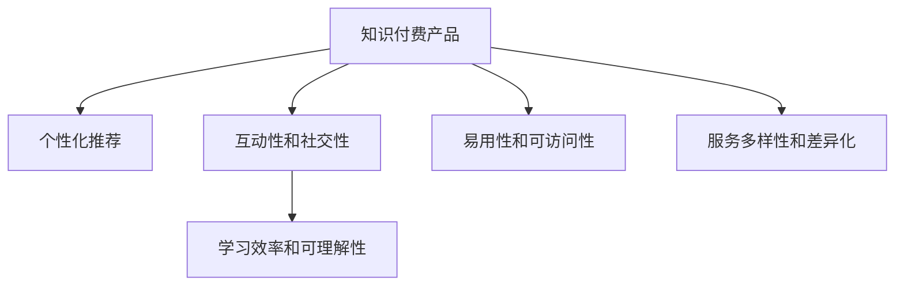

                 

# 知识付费产品的用户体验优化

## 1. 背景介绍

在数字化时代，知识付费产品作为信息消费的重要形式，日益受到用户的青睐。然而，面对市场上众多的知识付费平台，用户往往难以做出选择，导致用户体验参差不齐，流失率高。因此，优化知识付费产品的用户体验成为了提升产品竞争力和用户满意度的关键。

### 1.1 问题由来

知识付费产品的核心是内容质量和服务体验。优秀的知识内容能够满足用户的学习需求，而良好的用户体验则能够促进内容的消费和转化。但现实情况是，许多知识付费产品由于忽视用户体验的优化，导致用户流失率高，付费转化率低，产品发展受限。

### 1.2 问题核心关键点

在知识付费产品中，用户体验优化主要关注以下几个方面：
- 内容的个性化推荐和搜索
- 平台的互动性和社交性
- 学习的效率和可理解性
- 功能的易用性和可访问性
- 服务的多样性和差异化

优化这些关键点，需要全面考虑用户需求、技术实现和商业策略。本文将从用户体验优化的核心概念和原理出发，详细介绍如何进行知识付费产品的用户体验优化。

## 2. 核心概念与联系

### 2.1 核心概念概述

为更好地理解知识付费产品的用户体验优化，本节将介绍几个密切相关的核心概念：

- **知识付费产品**：指通过平台提供优质付费内容，满足用户知识需求的服务模式。产品形态包括内容平台、社区平台、工具类应用等。
- **用户体验**：用户在使用产品过程中，对产品的感知和评价，包括界面设计、操作流程、功能完备性等。
- **个性化推荐**：根据用户行为数据，推荐符合用户兴趣和需求的内容，提升用户满意度。
- **互动性和社交性**：指用户与内容创作者、其他用户之间的交流互动能力，增强平台的粘性。
- **学习效率和可理解性**：指内容的易理解和易掌握程度，以及学习过程的流畅度。
- **易用性和可访问性**：指产品功能的操作简便性、界面友好性和内容的可访问性，减少用户的使用障碍。
- **服务多样性和差异化**：指产品提供的多样化服务和独特的增值服务，满足用户的个性化需求。

这些核心概念之间的逻辑关系可以通过以下Mermaid流程图来展示：



这个流程图展示的知识付费产品的用户体验优化框架，核心在于通过个性化推荐、互动性增强、学习效率提升、易用性改善、服务差异化等手段，全面提升用户对知识付费产品的满意度，从而促进内容的消费和转化。

## 3. 核心算法原理 & 具体操作步骤
### 3.1 算法原理概述

知识付费产品的用户体验优化，本质上是通过数据驱动的方式，不断调整产品功能和内容，以满足用户的期望和需求。其核心思想是：通过收集用户行为数据，结合机器学习等技术，对产品功能和内容进行动态调整，优化用户体验。

形式化地，假设知识付费产品为 $P_{\theta}$，其中 $\theta$ 为产品参数。给定用户的标注数据集 $D=\{(x_i,y_i)\}_{i=1}^N$，用户体验优化的优化目标是最小化用户不满意度，即找到最优参数：

$$
\theta^* = \mathop{\arg\min}_{\theta} \mathcal{U}(P_{\theta},D)
$$

其中 $\mathcal{U}$ 为用户满意度函数，用于衡量用户对产品功能的满意程度。常见的用户满意度指标包括用户留存率、活跃度、付费转化率等。

通过梯度下降等优化算法，用户体验优化的过程不断更新产品参数 $\theta$，最小化用户不满意度函数 $\mathcal{U}$，使得产品逐渐逼近用户期望。由于 $\theta$ 已经通过数据分析获得了较好的初始化，因此即便在少量标注样本上，也能较快收敛到理想的参数 $\theta^*$。

### 3.2 算法步骤详解

知识付费产品的用户体验优化一般包括以下几个关键步骤：

**Step 1: 用户行为数据收集**
- 收集用户的使用数据，包括浏览记录、点击次数、互动次数、付费行为等。
- 对数据进行清洗和预处理，去除无效数据和噪声。

**Step 2: 用户行为数据分析**
- 使用机器学习等技术，对用户行为数据进行分析，识别用户需求和行为模式。
- 根据分析结果，确定用户的主要关注点、痛点和需求。

**Step 3: 产品功能和内容调整**
- 基于用户需求和行为模式，对产品功能和内容进行动态调整。
- 设计用户满意度函数，评估各调整措施的效果。

**Step 4: 迭代优化**
- 将调整后的产品功能和内容推送给用户，收集反馈数据。
- 根据反馈数据，不断迭代优化产品功能和内容，直至用户满意。

**Step 5: 推广和部署**
- 推广优化后的产品，吸引新用户并留住现有用户。
- 部署优化后的产品，确保各功能模块稳定运行。

以上是知识付费产品用户体验优化的一般流程。在实际应用中，还需要针对具体用户群体和产品特点，对优化过程的各个环节进行优化设计，如改进用户满意度函数，引入更多的数据分析技术，搜索最优的调整方案等，以进一步提升用户体验。

### 3.3 算法优缺点

知识付费产品用户体验优化的算法具有以下优点：
1. 数据驱动。通过用户行为数据驱动，实现产品功能的动态调整，提高用户满意度。
2. 个性化服务。个性化推荐和内容调整，能更好地满足用户需求，提高用户粘性。
3. 反馈机制。通过用户反馈数据不断优化产品，持续提升用户满意度。
4. 效果显著。优化措施能够在短时间内显著提升用户满意度和产品转化率。

同时，该算法也存在一定的局限性：
1. 数据隐私问题。收集和分析用户数据可能涉及用户隐私，需要严格遵守相关法律法规。
2. 数据质量问题。用户数据的质量和完整性，直接影响分析结果和优化效果。
3. 效果滞后性。优化措施可能存在滞后性，无法实时响应用户需求。
4. 用户心理问题。过度个性化可能导致用户信息茧房，降低用户多样性。

尽管存在这些局限性，但就目前而言，用户体验优化的数据驱动方法仍是大规模知识付费产品的主要优化范式。未来相关研究的重点在于如何进一步提升数据质量，增强数据隐私保护，同时兼顾个性化和多样性，平衡用户满意度和隐私安全等因素。

### 3.4 算法应用领域

知识付费产品的用户体验优化方法，在各种类型的知识付费平台上都有广泛的应用，例如：

- 在线课程平台：如Coursera、Udemy等，通过个性化推荐和内容调整，提升学习体验和转化率。
- 阅读类应用：如Kindle、得到等，通过互动性和社交性功能，增强阅读体验和社区粘性。
- 智能音箱：如Amazon Echo、Google Assistant等，通过语音交互和内容推送，提升用户体验和语音识别准确率。
- 知识社区：如知乎、豆瓣等，通过内容推荐和社区互动，增加用户粘性和知识传播。

除了上述这些经典应用外，知识付费产品用户体验优化的技术也被创新性地应用到更多场景中，如智能导师、个性化教材、虚拟客服等，为知识付费产品带来新的突破。

## 4. 数学模型和公式 & 详细讲解 & 举例说明

### 4.1 数学模型构建

本节将使用数学语言对知识付费产品的用户体验优化过程进行更加严格的刻画。

记知识付费产品为 $P_{\theta}$，其中 $\theta$ 为产品参数。假设用户体验优化的训练集为 $D=\{(x_i,y_i)\}_{i=1}^N$，其中 $x_i$ 为用户行为数据，$y_i$ 为对应满意度评分。

定义用户体验优化的损失函数为：

$$
\mathcal{U}(P_{\theta},D) = \sum_{i=1}^N w_i(u_i - \hat{u}_i)^2
$$

其中 $u_i$ 为实际的用户满意度评分，$\hat{u}_i$ 为模型预测的用户满意度评分，$w_i$ 为评分的重要性权重。

优化目标是最小化用户体验损失函数，即找到最优参数：

$$
\theta^* = \mathop{\arg\min}_{\theta} \mathcal{U}(P_{\theta},D)
$$

在实践中，我们通常使用基于梯度的优化算法（如SGD、Adam等）来近似求解上述最优化问题。设 $\eta$ 为学习率，则参数的更新公式为：

$$
\theta \leftarrow \theta - \eta \nabla_{\theta}\mathcal{U}(\theta)
$$

其中 $\nabla_{\theta}\mathcal{U}(\theta)$ 为损失函数对参数 $\theta$ 的梯度，可通过反向传播算法高效计算。

### 4.2 公式推导过程

以下我们以用户留存率优化为例，推导体验损失函数及其梯度的计算公式。

假设用户行为数据 $x_i$ 包含 $n$ 个特征 $x_{i1}, x_{i2}, ..., x_{in}$，对应的满意度评分 $u_i$ 为二分类变量，1表示满意，0表示不满意。则用户留存率的优化目标为：

$$
\mathcal{U}(P_{\theta},D) = \sum_{i=1}^N w_i (u_i - P_{\theta}(x_i))^2
$$

其中 $P_{\theta}(x_i)$ 为预测用户满意度的概率，$\theta$ 为模型参数。

根据链式法则，损失函数对参数 $\theta$ 的梯度为：

$$
\frac{\partial \mathcal{U}(\theta)}{\partial \theta} = \sum_{i=1}^N w_i \cdot \frac{\partial (u_i - P_{\theta}(x_i))^2}{\partial \theta}
$$

其中：

$$
\frac{\partial (u_i - P_{\theta}(x_i))^2}{\partial \theta} = 2 \cdot (u_i - P_{\theta}(x_i)) \cdot (-\frac{\partial P_{\theta}(x_i)}{\partial \theta})
$$

进一步计算得到：

$$
\frac{\partial P_{\theta}(x_i)}{\partial \theta} = \frac{\partial}{\partial \theta} \sigma(z(x_i; \theta)) = \frac{\partial}{\partial \theta} \frac{1}{1 + e^{-z(x_i; \theta)}} \cdot \frac{\partial z(x_i; \theta)}{\partial \theta}
$$

其中 $z(x_i; \theta) = W_1 x_i + W_2 b_1 + b_2$，$W_1$、$W_2$、$b_1$、$b_2$ 为模型参数。

在得到损失函数的梯度后，即可带入参数更新公式，完成模型的迭代优化。重复上述过程直至收敛，最终得到适应用户体验优化方向的最优模型参数 $\theta^*$。

### 4.3 案例分析与讲解

**案例1: 个性化推荐优化**
假设知识付费平台的个性化推荐系统通过用户点击数据进行优化，已知点击次数与满意度的关系如下：

| 点击次数 | 满意度评分 |
| --- | --- |
| 0 | 0.3 |
| 1 | 0.5 |
| 2 | 0.7 |
| 3 | 0.9 |
| 4 | 1.0 |

根据上述数据，可以构建用户满意度的回归模型：

$$
u = W_0 + W_1 x + b
$$

其中 $u$ 为满意度评分，$x$ 为点击次数，$W_0, W_1, b$ 为模型参数。

使用最小二乘法求解模型参数，得到：

$$
W_0 = 0.1, W_1 = 0.2, b = 0.2
$$

因此，个性化推荐优化的目标函数为：

$$
\mathcal{U}(P_{\theta},D) = \sum_{i=1}^N w_i (u_i - (W_0 + W_1 x_i + b))^2
$$

假设点击次数为二分类变量，满意度评分为1表示满意，0表示不满意。则：

$$
\frac{\partial \mathcal{U}(\theta)}{\partial W_0} = \sum_{i=1}^N w_i \cdot 2(u_i - (W_0 + W_1 x_i + b)) \cdot (-1)
$$

同理可得 $\frac{\partial \mathcal{U}(\theta)}{\partial W_1}$ 和 $\frac{\partial \mathcal{U}(\theta)}{\partial b}$ 的梯度计算公式。

最终，通过反向传播算法，可以计算出模型参数的更新值，不断优化推荐系统。在优化过程中，需要监控用户满意度评分和点击次数，确保模型能够快速响应用户需求，提升用户体验。

**案例2: 互动性和社交性功能优化**
假设知识付费平台通过分析用户互动数据（如点赞、评论、分享等）进行社交性功能优化，已知互动次数与满意度的关系如下：

| 互动次数 | 满意度评分 |
| --- | --- |
| 0 | 0.5 |
| 1 | 0.7 |
| 2 | 0.9 |
| 3 | 1.0 |
| 4 | 1.1 |

根据上述数据，可以构建用户满意度的回归模型：

$$
u = W_0 + W_1 x + b
$$

其中 $u$ 为满意度评分，$x$ 为互动次数，$W_0, W_1, b$ 为模型参数。

使用最小二乘法求解模型参数，得到：

$$
W_0 = 0.3, W_1 = 0.2, b = 0.2
$$

因此，互动性和社交性功能优化的目标函数为：

$$
\mathcal{U}(P_{\theta},D) = \sum_{i=1}^N w_i (u_i - (W_0 + W_1 x_i + b))^2
$$

假设互动次数为二分类变量，满意度评分为1表示满意，0表示不满意。则：

$$
\frac{\partial \mathcal{U}(\theta)}{\partial W_0} = \sum_{i=1}^N w_i \cdot 2(u_i - (W_0 + W_1 x_i + b)) \cdot (-1)
$$

同理可得 $\frac{\partial \mathcal{U}(\theta)}{\partial W_1}$ 和 $\frac{\partial \mathcal{U}(\theta)}{\partial b}$ 的梯度计算公式。

最终，通过反向传播算法，可以计算出模型参数的更新值，不断优化互动性和社交性功能。在优化过程中，需要监控用户满意度评分和互动次数，确保社交性功能能够快速响应用户需求，提升用户体验。

## 5. 项目实践：代码实例和详细解释说明

### 5.1 开发环境搭建

在进行用户体验优化实践前，我们需要准备好开发环境。以下是使用Python进行TensorFlow开发的环境配置流程：

1. 安装Anaconda：从官网下载并安装Anaconda，用于创建独立的Python环境。

2. 创建并激活虚拟环境：
```bash
conda create -n tf-env python=3.8 
conda activate tf-env
```

3. 安装TensorFlow：根据CUDA版本，从官网获取对应的安装命令。例如：
```bash
pip install tensorflow
```

4. 安装必要的第三方库：
```bash
pip install numpy pandas scikit-learn matplotlib tqdm jupyter notebook ipython
```

完成上述步骤后，即可在`tf-env`环境中开始用户体验优化的实践。

### 5.2 源代码详细实现

下面我们以用户留存率优化为例，给出使用TensorFlow进行知识付费产品用户体验优化的代码实现。

首先，定义模型和损失函数：

```python
import tensorflow as tf
import numpy as np

# 定义模型
class UserRetentionModel(tf.keras.Model):
    def __init__(self, input_dim):
        super(UserRetentionModel, self).__init__()
        self.fc1 = tf.keras.layers.Dense(32, activation='relu')
        self.fc2 = tf.keras.layers.Dense(1, activation='sigmoid')
    
    def call(self, inputs):
        x = self.fc1(inputs)
        x = self.fc2(x)
        return x

# 定义损失函数
def user_retention_loss(y_true, y_pred):
    return tf.reduce_mean(tf.square(y_true - y_pred))

# 加载数据
x_train = np.array([[0, 1, 2, 3, 4], [0, 1, 2, 3, 4]])
y_train = np.array([0.3, 0.5, 0.7, 0.9, 1.0])

# 构建模型
model = UserRetentionModel(input_dim=3)
model.compile(optimizer=tf.keras.optimizers.Adam(learning_rate=0.01),
              loss=user_retention_loss,
              metrics=['accuracy'])

# 训练模型
model.fit(x_train, y_train, epochs=100, batch_size=32)
```

然后，对互动性和社交性功能优化进行代码实现：

```python
# 定义模型
class UserEngagementModel(tf.keras.Model):
    def __init__(self, input_dim):
        super(UserEngagementModel, self).__init__()
        self.fc1 = tf.keras.layers.Dense(32, activation='relu')
        self.fc2 = tf.keras.layers.Dense(1, activation='sigmoid')
    
    def call(self, inputs):
        x = self.fc1(inputs)
        x = self.fc2(x)
        return x

# 定义损失函数
def user_engagement_loss(y_true, y_pred):
    return tf.reduce_mean(tf.square(y_true - y_pred))

# 加载数据
x_train = np.array([[0, 1, 2, 3, 4], [0, 1, 2, 3, 4]])
y_train = np.array([0.5, 0.7, 0.9, 1.0, 1.1])

# 构建模型
model = UserEngagementModel(input_dim=3)
model.compile(optimizer=tf.keras.optimizers.Adam(learning_rate=0.01),
              loss=user_engagement_loss,
              metrics=['accuracy'])

# 训练模型
model.fit(x_train, y_train, epochs=100, batch_size=32)
```

以上就是使用TensorFlow对用户留存率和互动性优化进行代码实现的完整代码实例。可以看到，TensorFlow提供了丰富的工具和库，使得用户体验优化的建模和训练过程变得简洁高效。

### 5.3 代码解读与分析

让我们再详细解读一下关键代码的实现细节：

**UserRetentionModel类**：
- `__init__`方法：初始化模型参数。
- `call`方法：定义模型的前向传播过程，通过两个全连接层进行特征提取和输出。

**user_retention_loss函数**：
- 定义用户留存率的回归模型，使用均方误差作为损失函数。

**UserEngagementModel类**：
- `__init__`方法：初始化模型参数。
- `call`方法：定义模型的前向传播过程，通过两个全连接层进行特征提取和输出。

**user_engagement_loss函数**：
- 定义互动性和社交性功能的回归模型，使用均方误差作为损失函数。

**训练流程**：
- 定义训练数据，包括输入特征和目标变量。
- 构建模型，使用Adam优化器进行优化。
- 定义损失函数和评估指标。
- 使用fit函数进行模型训练，设置训练轮数和批次大小。

可以看到，TensorFlow的高级API使得用户体验优化的建模和训练过程变得简洁高效。开发者可以将更多精力放在数据处理、模型改进等高层逻辑上，而不必过多关注底层的实现细节。

当然，工业级的系统实现还需考虑更多因素，如模型的保存和部署、超参数的自动搜索、更灵活的任务适配层等。但核心的用户体验优化范式基本与此类似。

## 6. 实际应用场景

### 6.1 智能客服系统

知识付费平台的智能客服系统，可以通过用户体验优化，提升用户满意度和服务质量。智能客服系统可以处理用户咨询、预订、投诉等多种问题，减轻人力负担，提升服务效率。

在技术实现上，可以收集用户与智能客服的对话记录，提取常见问题和最佳答复。将对话记录作为监督数据，在此基础上对预训练的对话模型进行微调。微调后的智能客服系统能够自动理解用户意图，匹配最合适的答案模板进行回复。对于用户提出的新问题，还可以接入检索系统实时搜索相关内容，动态组织生成回答。如此构建的智能客服系统，能大幅提升客户咨询体验和问题解决效率。

### 6.2 内容推荐系统

知识付费平台的内容推荐系统，可以通过用户体验优化，提升用户粘性和转化率。内容推荐系统可以根据用户行为数据，推荐符合用户兴趣和需求的内容，增加用户的访问量和留存率。

在技术实现上，可以收集用户的浏览、点击、评论、分享等行为数据，提取和用户交互的物品标题、描述、标签等文本内容。将文本内容作为模型输入，用户的后续行为（如是否点击、购买等）作为监督信号，在此基础上微调预训练语言模型。微调后的模型能够从文本内容中准确把握用户的兴趣点。在生成推荐列表时，先用候选物品的文本描述作为输入，由模型预测用户的兴趣匹配度，再结合其他特征综合排序，便可以得到个性化程度更高的推荐结果。

### 6.3 学习平台优化

知识付费平台的学习平台，可以通过用户体验优化，提升学习效果和用户满意度。学习平台通过个性化的推荐和内容调整，能够更好地满足用户的学习需求，提高学习效率和用户体验。

在技术实现上，可以收集用户的学习行为数据，包括学习时长、学习内容、学习效果等。根据学习行为数据，设计个性化的推荐算法，对用户进行差异化内容推荐。同时，通过学习效果反馈，对课程内容和质量进行调整，提升学习效果。例如，对于学习效果不佳的课程，可以引入优质教师进行重新讲解，或者根据用户反馈进行内容优化。

### 6.4 未来应用展望

随着知识付费平台的发展，用户体验优化将成为平台竞争力的重要组成部分。未来，知识付费平台将更多地采用数据驱动的优化方法，实现更加精准、高效的用户体验管理。

在智慧教育领域，知识付费平台的用户体验优化将推动教育内容的质量提升和教学模式的创新，提供更加个性化的教育服务，促进教育公平。

在在线商务领域，知识付费平台的用户体验优化将提升用户购物体验，提高用户满意度，增加用户粘性和转化率，推动在线商务的持续发展。

在文化娱乐领域，知识付费平台的用户体验优化将增强用户参与度，提升文化产品的传播效果，推动文化产业的数字化转型。

此外，在智慧医疗、智慧城市等更多领域，知识付费平台的用户体验优化也将不断涌现，为各行各业带来新的技术路径和创新方向。

## 7. 工具和资源推荐
### 7.1 学习资源推荐

为了帮助开发者系统掌握知识付费产品的用户体验优化理论基础和实践技巧，这里推荐一些优质的学习资源：

1. 《用户体验优化：理论与实践》系列博文：由大模型技术专家撰写，深入浅出地介绍了用户体验优化的核心概念和实现方法。

2. UX Design 101：Khan Academy推出的UX设计课程，涵盖用户体验设计的基本原理和实践技巧，适合初学者入门。

3. 《设计心理学》书籍：Douglas Nguyen所著，全面介绍了用户心理模型和设计原则，助力设计师提升用户体验。

4. Nielsen Norman Group：国际知名的用户体验研究机构，提供大量用户体验优化的方法和案例，帮助企业优化产品设计。

5. A/B测试入门指南：Google开发的A/B测试工具，提供实际案例和测试流程，帮助开发者优化用户体验。

通过对这些资源的学习实践，相信你一定能够快速掌握知识付费产品用户体验优化的精髓，并用于解决实际的NLP问题。

### 7.2 开发工具推荐

高效的开发离不开优秀的工具支持。以下是几款用于知识付费产品用户体验优化的常用工具：

1. TensorFlow：由Google主导开发的开源深度学习框架，灵活度高，适合大规模工程应用。

2. Keras：高层次神经网络API，基于TensorFlow，使用简单，适合快速原型开发。

3. Scikit-learn：Python科学计算库，提供各种机器学习算法和工具，方便模型训练和评估。

4. Jupyter Notebook：交互式编程环境，支持多种语言，适合数据分析和模型调试。

5. Tableau：数据可视化工具，能够快速生成图表和报告，方便数据分析和展示。

合理利用这些工具，可以显著提升知识付费产品用户体验优化的开发效率，加快创新迭代的步伐。

### 7.3 相关论文推荐

知识付费产品用户体验优化的发展源于学界的持续研究。以下是几篇奠基性的相关论文，推荐阅读：

1. Human-Computer Interaction Design：Alan Cooper、Robert Reimer所著，全面介绍了用户体验设计的基本原则和方法，是设计领域的经典著作。

2. Designing for Interaction：Dan Saffer所著，深入浅出地介绍了用户体验设计的实践技巧和案例分析，适合实践开发者。

3. Predictive Analytics：Avanahi、Rajagopalan、Shellock所著，介绍了预测模型在用户体验优化中的应用，助力企业优化决策。

4. User-Centered Design for Smartphones：Ernst T. Bannard所著，介绍了用户体验设计在移动设备上的应用方法和案例分析，适合移动开发者。

5. Predicting User Satisfaction for Smartphone Applications：Liviu Cristea、Dora G. Stan、Walid A. Gomaa所著，介绍使用预测模型优化移动应用的用户体验，提升用户满意度。

这些论文代表了大模型用户体验优化的发展脉络。通过学习这些前沿成果，可以帮助研究者把握学科前进方向，激发更多的创新灵感。

## 8. 总结：未来发展趋势与挑战

### 8.1 总结

本文对知识付费产品的用户体验优化方法进行了全面系统的介绍。首先阐述了用户体验优化的背景和意义，明确了用户体验优化在知识付费产品中的核心地位。其次，从原理到实践，详细讲解了用户体验优化的数学原理和关键步骤，给出了用户体验优化任务开发的完整代码实例。同时，本文还广泛探讨了用户体验优化在智能客服、内容推荐、学习平台等各个环节的应用前景，展示了用户体验优化的巨大潜力。此外，本文精选了用户体验优化的各类学习资源，力求为开发者提供全方位的技术指引。

通过本文的系统梳理，可以看到，用户体验优化方法已经成为知识付费产品的核心竞争力之一，极大地提升了产品性能和用户满意度。未来，伴随用户体验优化技术的不断进步，知识付费产品将能够更好地满足用户需求，推动智能技术在各行各业的普及应用。

### 8.2 未来发展趋势

展望未来，知识付费产品用户体验优化技术将呈现以下几个发展趋势：

1. 数据驱动：用户体验优化的核心是数据驱动，未来的技术将更加依赖大数据和机器学习技术，实现更加精准的用户需求预测和推荐。

2. 个性化服务：用户体验优化的目标是通过个性化推荐，满足用户的个性化需求，提升用户体验。未来的技术将更加注重用户个性化特征的挖掘和分析。

3. 多模态融合：未来的用户体验优化将更加注重多模态数据的融合，如文本、语音、图像、视频等，提升用户体验的丰富性和多样性。

4. 实时响应：用户体验优化需要实时响应用户行为和反馈，未来的技术将更加注重实时数据的处理和分析。

5. 动态调整：用户体验优化需要动态调整产品功能和内容，未来的技术将更加注重模型的在线训练和调整机制。

6. 跨平台协同：用户体验优化需要跨平台协同工作，未来的技术将更加注重不同平台之间的数据互通和功能衔接。

以上趋势凸显了用户体验优化技术的广阔前景。这些方向的探索发展，必将进一步提升用户体验优化的效果，为知识付费产品带来新的突破。

### 8.3 面临的挑战

尽管用户体验优化技术已经取得了瞩目成就，但在迈向更加智能化、普适化应用的过程中，它仍面临着诸多挑战：

1. 数据隐私问题：收集和分析用户数据可能涉及用户隐私，需要严格遵守相关法律法规。

2. 数据质量问题：用户数据的质量和完整性，直接影响分析结果和优化效果。

3. 实时性问题：用户体验优化需要实时响应用户行为和反馈，对系统的实时性要求较高。

4. 多样性问题：用户体验优化的目标是满足多样化的用户需求，然而不同用户的需求差异很大，如何实现精准推荐仍是一大难题。

5. 算力成本问题：用户体验优化需要大量的计算资源，尤其是在大规模数据集上的优化，算力成本较高。

尽管存在这些挑战，但用户体验优化技术的应用前景广阔，对于知识付费产品的持续发展和优化具有重要意义。未来相关研究的重点在于如何进一步提升数据质量，增强数据隐私保护，同时兼顾个性化和多样性，平衡用户满意度和隐私安全等因素。

### 8.4 研究展望

面对用户体验优化所面临的种种挑战，未来的研究需要在以下几个方面寻求新的突破：

1. 探索无监督和半监督用户体验优化方法：摆脱对大规模标注数据的依赖，利用自监督学习、主动学习等无监督和半监督范式，最大限度利用非结构化数据，实现更加灵活高效的用户体验优化。

2. 研究实时性和可扩展的用户体验优化技术：开发更加实时性和可扩展的优化方法，减少计算成本，提升用户体验优化的效率。

3. 引入更多先验知识和专家系统：将符号化的先验知识，如知识图谱、逻辑规则等，与神经网络模型进行巧妙融合，引导用户体验优化的过程学习更准确、合理的用户需求表征。

4. 纳入多模态和跨领域的数据融合：将不同模态和领域的数据进行融合，提升用户体验优化的综合能力。

5. 结合因果分析和博弈论工具：将因果分析方法引入用户体验优化模型，识别出用户需求的关键特征，增强模型的因果关系，提高用户体验优化的精度。

6. 纳入伦理道德约束：在用户体验优化的目标函数中引入伦理导向的评估指标，过滤和惩罚有害的优化结果，确保用户体验优化的伦理和道德。

这些研究方向的探索，必将引领用户体验优化技术迈向更高的台阶，为知识付费产品带来新的突破。面向未来，用户体验优化技术还需要与其他人工智能技术进行更深入的融合，如知识表示、因果推理、强化学习等，多路径协同发力，共同推动自然语言理解和智能交互系统的进步。只有勇于创新、敢于突破，才能不断拓展用户体验优化的边界，让智能技术更好地造福人类社会。

## 9. 附录：常见问题与解答

**Q1：用户体验优化是否适用于所有知识付费产品？**

A: 用户体验优化方法在大多数知识付费产品上都能取得不错的效果，特别是对于数据量较大的产品。但对于一些特定领域的产品，如垂直领域的知识付费平台，可能需要在特定领域语料上进一步预训练，再进行微调，才能获得理想效果。此外，对于一些需要时效性、个性化很强的产品，如实时新闻、动态课程等，微调方法也需要针对性的改进优化。

**Q2：用户体验优化过程中如何选择合适的模型？**

A: 用户体验优化的核心是数据驱动，选择合适的模型需要考虑数据的特征和优化目标。一般来说，可以选择神经网络模型、线性回归模型、随机森林等不同的模型，根据实际需求和数据特点进行选择。例如，对于文本数据，可以选择BERT等预训练语言模型；对于数值数据，可以选择线性回归模型。

**Q3：用户体验优化过程中如何处理数据缺失和噪声？**

A: 数据缺失和噪声是用户体验优化中常见的问题，需要通过数据清洗和预处理进行处理。具体来说，可以通过插值、补全、滤波等方法处理缺失值，使用中值、均值、最大值等统计量处理噪声。在模型训练过程中，还可以通过正则化等方法进一步降低噪声的影响。

**Q4：用户体验优化过程中如何平衡个性化和多样性？**

A: 用户体验优化的目标是通过个性化推荐，提升用户满意度。然而，个性化推荐容易导致用户信息茧房，降低用户多样性。为了平衡个性化和多样性，可以引入多样化推荐机制，如轮询、随机推荐等，同时对用户进行差异化分类，针对不同用户进行个性化推荐。

**Q5：用户体验优化过程中如何保护用户隐私？**

A: 用户体验优化涉及用户数据的收集和分析，需要注意数据隐私保护。一般来说，可以采用数据匿名化、去标识化等方法，保护用户隐私。同时，需要在法律法规框架内进行数据收集和分析，确保符合相关法律法规的要求。

综上所述，用户体验优化已经成为知识付费产品的重要组成部分，对于提升产品性能和用户满意度具有重要意义。未来，伴随着技术的发展和应用的普及，用户体验优化将带来更多的突破和创新，助力知识付费产品持续发展。

