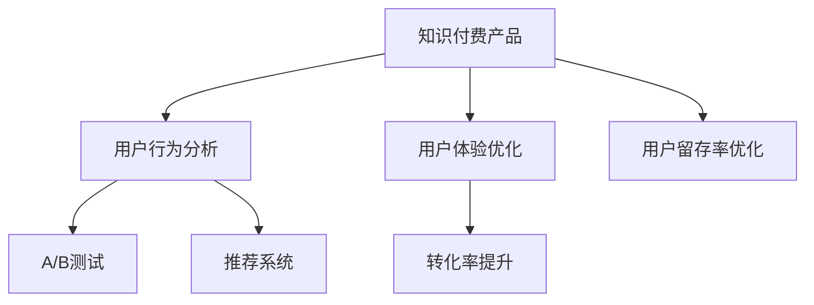

                 

# 知识付费产品的用户行为分析与优化

> 关键词：知识付费,用户行为分析,用户体验优化,转化率提升,推荐系统,人工智能,大数据

## 1. 背景介绍

在互联网和信息技术的推动下，知识付费已经成为继社交媒体、电商之后的第四大数字经济增长点。根据艾瑞咨询《2022年中国知识付费行业研究报告》，中国知识付费市场规模已经达到313.6亿元，用户规模达5.57亿人。知识付费平台通过出售在线课程、音频讲座、电子书等产品，为用户提供知识获取、技能提升、信息筛选等服务，满足了用户日益增长的学习需求。

知识付费产品的商业模式基于用户订阅和单次支付两种模式，但无论哪种模式，用户支付行为直接关系到平台收入。如何通过科学的用户行为分析，优化产品设计，提高用户转化率，是平台运营的核心问题。

## 2. 核心概念与联系

### 2.1 核心概念概述

为更好地理解知识付费产品的用户行为分析与优化，本节将介绍几个密切相关的核心概念：

- 知识付费（Knowledge-Paying）：指用户通过支付一定费用，获取专业、权威、及时的知识内容，实现知识和技能提升的一种商业模式。平台包括付费课程、付费文章、专家咨询等多种形式。

- 用户行为分析（User Behavior Analysis）：通过数据分析技术，理解用户在平台上的行为模式、偏好、需求，识别用户流失、转化等关键问题，从而为产品优化提供数据支持。

- 用户体验优化（User Experience Optimization）：基于用户行为分析结果，对产品界面、功能、内容等方面进行优化，提升用户满意度和留存率。

- 转化率提升（Conversion Rate Optimization）：通过数据分析和优化，提升用户在平台上从潜在客户到付费用户的转化率，增加平台的收入。

- 推荐系统（Recommendation System）：利用大数据、人工智能等技术，为用户推荐个性化的内容，提高用户体验和平台粘性。

- A/B测试（A/B Testing）：指在同一时间对不同版本的用户界面或功能进行对比测试，找出最优方案，提升用户体验和转化率。

这些核心概念之间的逻辑关系可以通过以下Mermaid流程图来展示：



这个流程图展示出知识付费产品与用户行为分析、用户体验优化、转化率提升等关键概念之间的紧密联系：

1. 知识付费产品通过用户行为分析获取用户数据。
2. 数据分析结果指导用户体验优化和推荐系统，提高用户粘性。
3. 推荐系统和用户体验优化进一步提升转化率。
4. A/B测试验证优化效果，持续迭代产品。
5. 用户留存率优化通过长期数据分析和反馈，保障产品健康运行。

## 3. 核心算法原理 & 具体操作步骤

### 3.1 算法原理概述

知识付费产品的用户行为分析与优化，本质上是利用数据分析技术和机器学习算法，理解用户需求，优化产品设计，提升用户转化率和满意度。主要涉及以下几个方面：

- 用户画像构建：通过多维数据（如浏览记录、购买历史、评分反馈等），对用户进行标签化分析，形成用户画像，便于进行个性化推荐和营销。
- 行为数据分析：利用统计学和机器学习算法，对用户行为（如页面浏览、停留时间、购买转化等）进行分析，挖掘行为规律，发现潜在问题。
- 用户分群与建模：将用户按照特定标准进行分群，建立用户行为模型，预测用户行为和趋势，指导产品优化策略。
- A/B测试设计与分析：设计多种版本的产品界面或功能，进行对比测试，找出最优方案，持续优化产品设计。

### 3.2 算法步骤详解

基于以上算法原理，知识付费产品的用户行为分析与优化的具体步骤如下：

**Step 1: 数据采集与清洗**

- 收集用户行为数据，包括浏览记录、点击率、购买记录、评分反馈等。
- 数据清洗：去除无效数据，处理缺失值和异常值。

**Step 2: 用户画像构建**

- 利用聚类算法（如K-means）对用户进行分群，形成不同用户画像。
- 基于用户画像，分析不同用户群体的兴趣、需求和行为特点。

**Step 3: 行为数据分析**

- 应用统计学方法（如描述性统计、相关性分析），分析用户行为的基本特征。
- 利用机器学习算法（如回归分析、分类算法），挖掘行为数据中的规律和模式。

**Step 4: 用户分群与建模**

- 利用分群算法（如层次聚类、因子分析），对用户进行进一步细分。
- 建立用户行为模型（如协同过滤、基于内容的推荐算法），预测用户行为和趋势。

**Step 5: A/B测试设计与分析**

- 设计多种版本的产品界面或功能，进行对比测试。
- 分析测试结果，找出最优方案，指导产品迭代优化。

**Step 6: 转化率提升与用户体验优化**

- 结合用户画像和行为分析结果，优化产品设计，提升用户体验。
- 利用推荐系统为用户推荐个性化的内容，提高用户转化率。

**Step 7: 用户留存率优化**

- 定期对用户行为数据进行分析和反馈，优化产品功能。
- 通过长期数据分析，识别潜在流失用户，制定留存策略。

通过以上步骤，可以对知识付费产品的用户行为进行全面分析，从而指导产品优化，提高用户转化率和满意度。

### 3.3 算法优缺点

知识付费产品用户行为分析与优化的算法具有以下优点：

- 数据驱动：通过数据分析获取用户需求，指导产品优化，提升转化率。
- 个性化推荐：利用推荐系统，提高用户粘性和留存率。
- 实时优化：通过A/B测试，快速迭代产品，优化用户体验。
- 预测能力：利用机器学习模型，预测用户行为和趋势，指导长期策略。

同时，这些算法也存在一些局限性：

- 数据依赖：需要大量的用户行为数据进行分析和建模。
- 模型复杂：复杂的推荐系统和行为模型需要较强的计算能力和数据量。
- 动态性不足：预测模型可能难以应对突发的用户行为变化。
- 用户隐私：数据收集和分析过程中可能涉及用户隐私问题。

尽管存在这些局限性，但就目前而言，数据分析和优化方法仍是知识付费产品运营的核心竞争力。未来相关研究重点在于如何进一步提高算法的实时性和可解释性，同时保护用户隐私，确保用户数据的安全性和透明性。

### 3.4 算法应用领域

知识付费产品的用户行为分析与优化技术，已经在各大知识付费平台得到广泛应用，涵盖了课程推荐、广告投放、用户留存等诸多方面，取得了显著的优化效果。

- 课程推荐：利用推荐系统为用户推荐最相关的课程，提升用户购买转化率。
- 广告投放：通过分析用户行为，精准投放广告，提高广告ROI（投资回报率）。
- 用户留存：通过分析用户流失原因，优化产品功能和用户体验，提升用户留存率。
- 个性化服务：利用用户画像，提供个性化推荐和定制化服务，提高用户满意度。

除了这些经典应用外，知识付费产品还创新性地应用于智能客服、内容审核、用户增长等环节，为平台运营带来了新的增长点。随着数据分析和优化技术的不断进步，相信知识付费产品的用户体验和运营效果将持续提升，服务更多用户。

## 4. 数学模型和公式 & 详细讲解 & 举例说明

### 4.1 数学模型构建

本节将使用数学语言对知识付费产品的用户行为分析与优化的主要步骤进行更加严格的刻画。

记知识付费平台的用户行为数据为 $D=\{(x_i,y_i)\}_{i=1}^N$，其中 $x_i$ 为行为特征向量，$y_i$ 为行为标签。假设我们要对用户进行分组，根据兴趣、需求等特征，将用户分为 $K$ 个群组。则用户画像可以表示为 $P=\{p_k\}_{k=1}^K$，其中 $p_k$ 为第 $k$ 个用户群组的特征向量。

定义用户行为模型为 $M(\cdot)$，目标函数为最小化均方误差：

$$
\min_{M} \frac{1}{N}\sum_{i=1}^N (M(x_i) - y_i)^2
$$

其中 $M(x_i)$ 为模型 $M$ 对行为特征 $x_i$ 的预测结果。

### 4.2 公式推导过程

以下我们以协同过滤算法为例，推导用户行为模型的计算公式。

假设用户 $u$ 和物品 $i$ 的行为向量分别为 $x_u$ 和 $x_i$，行为矩阵 $I \in \mathbb{R}^{K\times M}$ 表示用户和物品的兴趣矩阵，其中 $I_{km}=x_k \cdot x_m$ 为 $k$ 和 $m$ 用户的兴趣相似度。则协同过滤模型可表示为：

$$
\hat{y}_{ui} = \frac{\sum_{k=1}^K I_{ki} \cdot x_u^T p_k}{\sum_{k=1}^K I_{ki}}
$$

其中 $\hat{y}_{ui}$ 为模型对用户 $u$ 和物品 $i$ 交互的预测评分。

将上述公式展开，可得：

$$
\hat{y}_{ui} = x_u^T \left(\frac{\sum_{k=1}^K I_{ki} p_k}{\sum_{k=1}^K I_{ki}}\right)
$$

定义用户兴趣向量 $p_u = \frac{\sum_{k=1}^K I_{ki} p_k}{\sum_{k=1}^K I_{ki}}$，则协同过滤模型可简化为：

$$
\hat{y}_{ui} = x_u^T p_u
$$

通过上述推导，我们得到了协同过滤算法的计算公式。其核心思想是通过用户兴趣向量 $p_u$ 预测用户对物品的评分，实现个性化推荐。

### 4.3 案例分析与讲解

假设某知识付费平台收集了用户阅读文章、购买课程、评分反馈等行为数据，将其用于用户行为分析和推荐优化。首先，利用K-means算法对用户进行聚类，得到四个用户群体，分别是学术研究型、职业技能型、兴趣爱好型和休闲娱乐型。然后，通过协同过滤算法为每个用户推荐最相关的内容。

**具体步骤如下：**

1. 数据采集与清洗：收集用户行为数据，进行初步清洗和预处理。
2. 用户画像构建：应用K-means算法，对用户进行聚类，形成四个用户群体。
3. 行为数据分析：利用协同过滤算法，计算用户兴趣向量 $p_u$。
4. 用户分群与建模：根据用户兴趣向量，为每个用户推荐最相关的内容。
5. A/B测试设计与分析：设计多种推荐算法版本，进行对比测试，找出最优方案。
6. 转化率提升与用户体验优化：结合推荐结果，优化产品界面和功能。

通过以上步骤，平台实现了个性化推荐，提升了用户转化率和满意度。

## 5. 项目实践：代码实例和详细解释说明

### 5.1 开发环境搭建

在进行知识付费产品用户行为分析与优化实践前，我们需要准备好开发环境。以下是使用Python进行PyTorch开发的环境配置流程：

1. 安装Anaconda：从官网下载并安装Anaconda，用于创建独立的Python环境。

2. 创建并激活虚拟环境：
```bash
conda create -n pytorch-env python=3.8 
conda activate pytorch-env
```

3. 安装PyTorch：根据CUDA版本，从官网获取对应的安装命令。例如：
```bash
conda install pytorch torchvision torchaudio cudatoolkit=11.1 -c pytorch -c conda-forge
```

4. 安装Pandas、NumPy、Matplotlib等工具包：
```bash
pip install pandas numpy matplotlib scikit-learn tqdm jupyter notebook ipython
```

完成上述步骤后，即可在`pytorch-env`环境中开始项目实践。

### 5.2 源代码详细实现

下面我们以知识付费平台的推荐系统为例，给出使用PyTorch进行协同过滤算法（Collaborative Filtering）的PyTorch代码实现。

首先，定义协同过滤算法的模型类：

```python
import torch
from torch.nn import Parameter

class CollaborativeFilteringModel(torch.nn.Module):
    def __init__(self, num_users, num_items, num_factors):
        super(CollaborativeFilteringModel, self).__init__()
        self.num_users = num_users
        self.num_items = num_items
        self.num_factors = num_factors
        
        # 用户兴趣向量
        self.user_factors = Parameter(torch.randn(num_users, num_factors))
        
        # 物品兴趣向量
        self.item_factors = Parameter(torch.randn(num_items, num_factors))
        
        # 用户兴趣矩阵
        self.user_item = torch.zeros(num_users, num_items)
        
    def forward(self, user_idx, item_idx):
        # 用户兴趣向量
        user_factors = self.user_factors[user_idx]
        
        # 物品兴趣向量
        item_factors = self.item_factors[item_idx]
        
        # 兴趣相似度
        user_item = user_factors @ item_factors.t()
        
        # 预测评分
        return user_item
        
# 创建协同过滤模型
model = CollaborativeFilteringModel(num_users=1000, num_items=1000, num_factors=100)
```

然后，定义训练函数：

```python
from torch.optim import Adam

def train_model(model, user_idx, item_idx, rating, num_epochs=10, learning_rate=0.01):
    optimizer = Adam(model.parameters(), lr=learning_rate)
    
    for epoch in range(num_epochs):
        for i in range(len(user_idx)):
            user_idx_tensor = torch.tensor(user_idx[i])
            item_idx_tensor = torch.tensor(item_idx[i])
            rating_tensor = torch.tensor(rating[i])
            
            # 前向传播
            predictions = model(user_idx_tensor, item_idx_tensor)
            
            # 计算损失
            loss = (predictions - rating_tensor).pow(2).mean()
            
            # 反向传播
            optimizer.zero_grad()
            loss.backward()
            optimizer.step()
            
            # 输出损失
            print(f"Epoch {epoch+1}, Loss: {loss.item():.4f}")
```

最后，启动训练流程：

```python
# 准备数据
user_idx = [0, 1, 2, 3]
item_idx = [0, 1, 2, 3]
rating = [4.0, 5.0, 3.0, 2.0]

# 训练模型
train_model(model, user_idx, item_idx, rating)
```

以上就是使用PyTorch实现协同过滤算法的完整代码实现。可以看到，利用PyTorch，我们可以方便地定义和训练协同过滤模型，实现个性化推荐。

### 5.3 代码解读与分析

让我们再详细解读一下关键代码的实现细节：

**CollaborativeFilteringModel类**：
- `__init__`方法：初始化用户兴趣向量、物品兴趣向量和用户兴趣矩阵。
- `forward`方法：计算用户和物品的兴趣相似度，预测评分。

**train_model函数**：
- 定义Adam优化器，设置学习率。
- 循环迭代训练，对每个样本进行前向传播、计算损失、反向传播和更新模型参数。

**训练流程**：
- 准备数据，包含用户ID、物品ID和评分。
- 调用`train_model`函数，进行模型训练。
- 输出每个epoch的损失值。

通过上述代码，我们成功地构建了一个简单的协同过滤模型，并通过训练优化了其预测性能。

## 6. 实际应用场景

### 6.1 知识付费平台推荐系统

知识付费平台推荐系统是知识付费产品核心应用之一，通过个性化推荐，提升用户购买转化率和平台收入。

在技术实现上，推荐系统通常采用协同过滤、基于内容的推荐、深度学习等技术，结合用户行为数据和产品元数据，为用户推荐最相关的课程、文章等产品。推荐算法需要兼顾多样性、相关性和实时性，确保推荐结果符合用户期望。

### 6.2 用户留存与增长

用户留存和增长是知识付费平台长期运营的重要指标。通过用户行为分析，可以识别流失用户，制定留存策略，提升用户粘性。

具体而言，可以建立用户流失预测模型，通过用户行为数据（如访问频率、购买记录、互动行为等），预测用户的流失概率。针对高风险用户，推送个性化推荐和专属活动，提高留存率。同时，可以通过用户反馈、互动数据，优化产品功能和界面，提升用户满意度。

### 6.3 广告投放优化

知识付费平台广告投放效果直接影响平台收入。通过用户行为分析，可以精准投放广告，提升广告ROI（投资回报率）。

具体而言，可以利用用户画像和行为数据，识别高价值用户群体，进行定向投放。同时，可以设计A/B测试，比较不同广告策略的效果，找出最优方案。通过多渠道广告投放和实时优化，最大化广告效果。

### 6.4 未来应用展望

随着知识付费产品的发展，其用户行为分析与优化的应用将更加广泛和深入。以下是几个未来可能的应用场景：

- 个性化视频推荐：结合用户行为数据和视频元数据，为用户推荐个性化视频内容，提升用户体验。
- 在线教育辅助：通过分析学生学习行为和成绩，提供个性化学习建议和辅导，提升学习效果。
- 知识图谱构建：利用用户行为数据，构建知识图谱，实现知识查询和推荐。
- 智能客服系统：通过用户行为分析，优化智能客服系统，提高客户服务质量和满意度。

随着数据分析和优化技术的不断进步，相信知识付费产品将能够更好地满足用户需求，实现业务增长。

## 7. 工具和资源推荐

### 7.1 学习资源推荐

为了帮助开发者系统掌握知识付费产品的用户行为分析与优化技术，这里推荐一些优质的学习资源：

1. 《推荐系统实战》书籍：全面介绍了推荐系统的主要算法和实践，适合初学者和从业者。
2. Coursera《机器学习》课程：由斯坦福大学Andrew Ng教授主讲的经典课程，涵盖推荐系统、数据挖掘等多个方面。
3. Kaggle推荐系统竞赛：通过参与竞赛，学习推荐系统算法和实践，提升技术能力。
4. 《深度学习实战》书籍：结合具体案例，介绍深度学习在推荐系统中的应用。
5. 《数据分析与统计》课程：通过学习数据分析和统计学方法，掌握用户行为分析的基础。

通过对这些资源的学习实践，相信你一定能够快速掌握知识付费产品的用户行为分析与优化技术，并用于解决实际的运营问题。

### 7.2 开发工具推荐

高效的开发离不开优秀的工具支持。以下是几款用于知识付费产品用户行为分析与优化开发的常用工具：

1. PyTorch：基于Python的开源深度学习框架，灵活动态的计算图，适合快速迭代研究。大多数推荐算法都有PyTorch版本的实现。
2. TensorFlow：由Google主导开发的开源深度学习框架，生产部署方便，适合大规模工程应用。同样有丰富的推荐算法资源。
3. HuggingFace Transformers库：提供多种预训练语言模型和推荐算法，支持PyTorch和TensorFlow，是进行推荐任务开发的利器。
4. Weights & Biases：模型训练的实验跟踪工具，可以记录和可视化模型训练过程中的各项指标，方便对比和调优。与主流深度学习框架无缝集成。
5. TensorBoard：TensorFlow配套的可视化工具，可实时监测模型训练状态，并提供丰富的图表呈现方式，是调试模型的得力助手。

合理利用这些工具，可以显著提升知识付费产品用户行为分析与优化的开发效率，加快创新迭代的步伐。

### 7.3 相关论文推荐

知识付费产品用户行为分析与优化的发展源于学界的持续研究。以下是几篇奠基性的相关论文，推荐阅读：

1. "Collaborative Filtering for Implicit Feedback Datasets"（隐式反馈数据集上的协同过滤）：提出了协同过滤的基本思想，成为推荐系统研究的经典之作。
2. "A Factorization Approach to Collaborative Filtering"（协同过滤的因子分解方法）：提出矩阵分解方法，提升推荐系统性能。
3. "Neural Collaborative Filtering"（神经协同过滤）：引入深度学习技术，提升协同过滤模型的预测效果。
4. "Hybrid Recommendation Approaches"（混合推荐算法）：将协同过滤、基于内容的推荐等多种算法结合，提高推荐系统的效果。
5. "Advances in Neural Information Processing Systems"（NIPS）：推荐系统相关论文的集大成者，涵盖各种推荐算法和技术。

这些论文代表了大规模推荐系统的研究进展，通过学习这些前沿成果，可以帮助研究者把握学科前进方向，激发更多的创新灵感。

## 8. 总结：未来发展趋势与挑战

### 8.1 总结

本文对知识付费产品的用户行为分析与优化进行了全面系统的介绍。首先阐述了知识付费产品的核心商业模式，明确了用户行为分析与优化在平台运营中的重要性。其次，从原理到实践，详细讲解了用户行为分析与优化的数学模型和操作步骤，给出了推荐系统开发的完整代码实例。同时，本文还广泛探讨了用户行为分析与优化在知识付费产品中的应用场景，展示了其在推荐系统、用户留存等方面的应用前景。

通过本文的系统梳理，可以看到，用户行为分析与优化是知识付费产品运营的核心环节，通过科学的数据分析和算法优化，可以显著提升用户转化率和满意度。未来，伴随推荐算法、用户画像等技术的不断进步，知识付费产品的用户体验和运营效果将持续提升，服务更多用户。

### 8.2 未来发展趋势

展望未来，知识付费产品用户行为分析与优化的发展趋势将体现在以下几个方面：

1. 推荐系统智能化。随着深度学习、强化学习等技术的发展，推荐系统将更加智能化，能够根据用户实时行为进行动态调整，提供更加个性化和实时性的推荐。

2. 用户画像精细化。通过多维度数据（如浏览记录、购买记录、评分反馈等），构建更加精细化的用户画像，实现更加个性化的推荐和服务。

3. 多模态数据融合。结合文本、图片、视频等多种数据，实现多模态推荐系统，提升推荐效果。

4. 隐私保护与安全。随着数据量的增加，用户隐私和数据安全问题将更加凸显。未来推荐系统将更加注重用户隐私保护，通过差分隐私、联邦学习等技术，保障用户数据的安全性和匿名性。

5. 实时优化与动态调整。推荐系统将实现实时优化和动态调整，根据用户实时行为进行策略调整，提升推荐效果和用户满意度。

6. 全链路协同优化。推荐系统将与其他产品功能（如广告投放、用户增长等）实现全链路协同优化，提升平台整体运营效果。

以上趋势凸显了知识付费产品用户行为分析与优化的广阔前景。这些方向的探索发展，必将进一步提升推荐系统的性能和用户体验，为知识付费产品带来新的增长点。

### 8.3 面临的挑战

尽管知识付费产品用户行为分析与优化技术已经取得了显著进展，但在迈向更加智能化、个性化应用的过程中，仍面临诸多挑战：

1. 数据质量问题。数据采集和清洗过程中可能存在噪音和缺失，影响推荐系统效果。

2. 算法复杂度。复杂的推荐算法需要较强的计算能力和数据量，如何平衡算法的准确性和效率，仍是重要问题。

3. 模型可解释性。推荐系统的决策过程通常缺乏可解释性，难以对其内部工作机制进行分析和调试。

4. 用户隐私保护。推荐系统涉及大量用户数据，如何保护用户隐私，避免数据泄露和滥用，仍是关键问题。

5. 推荐系统公平性。推荐系统可能存在偏见，如何确保推荐结果的公平性和多样性，避免对某些用户群体产生歧视，仍需持续优化。

6. 实时数据处理。推荐系统需要处理实时数据，如何在保证实时性的同时，保证推荐结果的准确性，是技术难点。

正视知识付费产品用户行为分析与优化所面临的这些挑战，积极应对并寻求突破，将是大规模推荐系统走向成熟的必由之路。相信随着学界和产业界的共同努力，这些挑战终将一一被克服，知识付费产品用户行为分析与优化必将在构建人机协同的智能时代中扮演越来越重要的角色。

### 8.4 研究展望

面向未来，知识付费产品用户行为分析与优化的研究需要在以下几个方面寻求新的突破：

1. 探索深度学习与强化学习结合的新算法。结合深度学习的多层次表示和强化学习的实时调整，提升推荐系统的效果和性能。

2. 研究多模态数据融合与协同推荐。结合文本、图片、视频等多种数据，实现更加全面和精准的推荐。

3. 开发基于差分隐私和联邦学习的推荐算法。在保障用户隐私的同时，实现推荐系统的高效优化。

4. 研究推荐系统的公平性和多样性。设计公平性和多样性评价指标，优化推荐算法，确保推荐结果的公正性。

5. 引入因果推断和博弈论工具。通过因果推断，理解推荐系统的决策机制，通过博弈论，优化推荐策略，提升推荐效果。

这些研究方向将引领知识付费产品用户行为分析与优化技术迈向更高的台阶，为构建安全、可靠、可解释、可控的智能系统铺平道路。面向未来，知识付费产品用户行为分析与优化技术还需要与其他人工智能技术进行更深入的融合，如知识表示、因果推理、强化学习等，多路径协同发力，共同推动知识付费产品的发展。只有勇于创新、敢于突破，才能不断拓展推荐系统的边界，让智能技术更好地造福用户。

## 9. 附录：常见问题与解答

**Q1：知识付费产品推荐系统有哪些主要算法？**

A: 知识付费产品推荐系统主要包含以下算法：

1. 协同过滤算法：通过用户-物品评分矩阵，预测用户对物品的评分。
2. 基于内容的推荐算法：利用物品元数据（如标题、描述等），为用户推荐相关物品。
3. 矩阵分解算法：通过分解用户-物品评分矩阵，发现用户和物品的隐式特征。
4. 深度学习算法：如神经协同过滤、深度矩阵分解等，利用神经网络结构提升推荐效果。

这些算法各有优缺点，需要根据具体场景和需求进行选择。

**Q2：知识付费产品如何处理数据缺失问题？**

A: 知识付费产品推荐系统中的数据缺失问题主要可以通过以下方法处理：

1. 插值法：如均值插值、KNN插值等，通过已知数据填补缺失值。
2. 填充法：如随机填充、常数填充等，将缺失值直接替换为特定值。
3. 数据增强：如利用用户历史行为预测缺失评分，提升推荐系统的鲁棒性。
4. 数据清洗：去除噪声和异常数据，提升数据质量。

以上方法需要根据具体场景和数据特性进行选择。

**Q3：推荐系统如何实现实时优化？**

A: 推荐系统实现实时优化可以通过以下方法：

1. 流式学习：利用流式数据处理技术，实时更新推荐模型。
2. 增量学习：利用增量学习算法，在新的数据到来时，快速更新推荐模型。
3. 实时计算：利用实时计算框架（如Flink、Storm等），实现数据流处理和实时计算。
4. 缓存策略：利用缓存技术，减少数据处理和计算时间。

通过以上方法，可以保证推荐系统的高实时性，提升用户体验。

**Q4：推荐系统如何保护用户隐私？**

A: 推荐系统保护用户隐私的方法主要有以下几种：

1. 差分隐私：通过数据扰动，保证用户数据隐私性。
2. 联邦学习：通过分布式计算，保护用户数据本地化。
3. 匿名化处理：将用户数据进行匿名化处理，保护用户隐私。
4. 访问控制：通过权限控制，限制用户数据访问权限。

这些方法需要结合具体场景和需求进行选择和优化。

**Q5：推荐系统如何进行多模态数据融合？**

A: 推荐系统进行多模态数据融合的方法主要有以下几种：

1. 特征融合：将文本、图片、视频等多种模态特征进行融合，提升推荐效果。
2. 协同过滤融合：将基于内容的推荐和协同过滤结合，提升推荐系统的效果。
3. 深度学习融合：利用深度学习模型，实现多模态数据的协同表示和推荐。
4. 交叉验证融合：通过交叉验证，确保多模态数据的融合效果。

这些方法需要根据具体场景和需求进行选择和优化。

通过本文的系统梳理，可以看到，知识付费产品的用户行为分析与优化是产品运营的核心环节，通过科学的数据分析和算法优化，可以显著提升用户转化率和满意度。未来，伴随推荐算法、用户画像等技术的不断进步，知识付费产品的用户体验和运营效果将持续提升，服务更多用户。

---

作者：禅与计算机程序设计艺术 / Zen and the Art of Computer Programming

