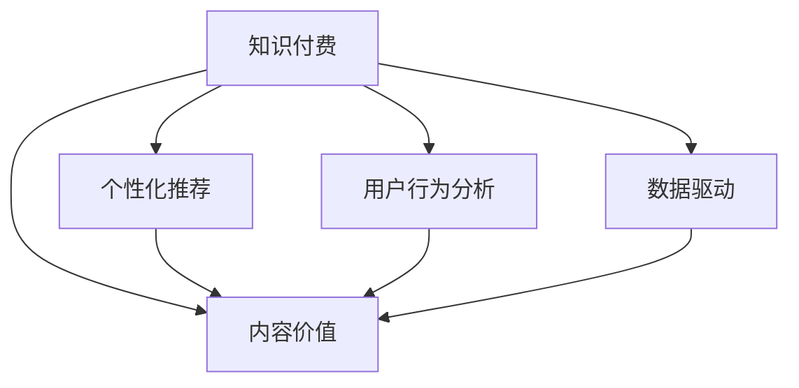

                 

# 知识付费创业中的内容价值 Maximization Strategy

## 1. 背景介绍

### 1.1 问题由来
随着互联网的普及和数字技术的进步，知识付费市场迅速崛起。内容创作者和知识付费平台为知识获取者和学习者提供了大量有价值的信息，满足了用户对高质量、结构化、个性化内容的需求。同时，知识付费模式也为内容创造者带来了可观的收入。

然而，知识付费领域也面临着诸多挑战。内容同质化现象严重，高质量内容稀缺；用户粘性低，流失率高；市场竞争激烈，内容差异化难以实现。针对这些问题，内容创作者和平台需要在内容价值最大化方面进行深入思考和实践，以提升竞争力并实现可持续发展。

### 1.2 问题核心关键点
内容价值最大化是知识付费创业的核心问题，其关键在于：

- **内容差异化**：如何通过高质量、独创性、高价值的内容获取和保持用户。
- **用户行为分析**：如何通过用户行为数据驱动内容的迭代和优化。
- **个性化推荐**：如何根据用户画像和行为，提供精准的内容推荐。
- **收益最大化**：如何通过付费模式设计，实现用户付费意愿的最大化。
- **生态系统构建**：如何构建内容创作者与平台、用户之间的良性循环，实现共赢。

## 2. 核心概念与联系

### 2.1 核心概念概述

为更好地理解知识付费创业中内容价值最大化的方法，本节将介绍几个密切相关的核心概念：

- **知识付费**：以付费方式获取专业化、结构化、高质量内容的商业模式。
- **内容价值**：指内容对用户价值的影响，包括信息量、深度、独创性、时效性等。
- **个性化推荐**：根据用户行为和画像，推送符合用户兴趣和需求的内容。
- **用户行为分析**：通过分析用户在平台上的浏览、购买、评价等行为，指导内容生产和迭代。
- **数据驱动**：以数据为基础，进行内容优化和商业决策。

这些核心概念之间的逻辑关系可以通过以下Mermaid流程图来展示：



这个流程图展示了一体化的知识付费平台运作逻辑：

1. 知识付费平台以优质内容吸引用户。
2. 平台通过个性化推荐和用户行为分析，不断优化内容供给。
3. 平台利用数据驱动策略，持续提升内容价值。

## 3. 核心算法原理 & 具体操作步骤
### 3.1 算法原理概述

知识付费平台中内容价值最大化的方法，主要基于以下核心算法原理：

- **协同过滤算法**：通过分析用户的历史行为，推荐相似用户喜欢的内容。
- **协同聚类算法**：将用户按照兴趣和行为相似度分成不同的群组，进行内容推荐。
- **深度学习推荐系统**：使用深度神经网络模型，学习用户-内容之间的复杂非线性关系。
- **内容生成对抗网络**：利用生成对抗网络，自动生成高质量、独创性的内容。

### 3.2 算法步骤详解

#### 3.2.1 协同过滤算法

协同过滤算法分为基于用户的协同过滤和基于物品的协同过滤两种类型。

**基于用户的协同过滤**：
- 计算用户之间的相似度
- 找到相似用户所喜欢物品，推荐给当前用户

**基于物品的协同过滤**：
- 计算物品之间的相似度
- 找到与当前用户喜欢的物品相似的其他物品，推荐给当前用户

#### 3.2.2 协同聚类算法

协同聚类算法基于用户行为数据，将用户分成不同的兴趣群组，进行内容推荐。

- 计算用户间的相似度
- 对用户进行聚类，生成不同群组
- 根据群组特征，推荐内容

#### 3.2.3 深度学习推荐系统

深度学习推荐系统使用神经网络模型，学习用户-物品之间的复杂关系。

- 使用多层神经网络模型，学习用户行为特征和物品特征
- 使用隐藏层和全连接层，捕捉用户-物品的复杂关系
- 输出用户推荐结果

#### 3.2.4 内容生成对抗网络

内容生成对抗网络（GANs）通过两个神经网络生成器和判别器的博弈过程，自动生成高质量、独创性的内容。

- 生成器网络学习生成假内容
- 判别网络学习区分假内容与真内容
- 通过对抗训练过程，提高生成内容的质量

### 3.3 算法优缺点

知识付费平台中内容价值最大化的算法具有以下优点：

- **高效性**：协同过滤和协同聚类算法可以实时推荐内容，提高用户满意度。
- **个性化**：深度学习推荐系统能够学习复杂关系，提供精准的个性化推荐。
- **自动性**：内容生成对抗网络可以自动生成高质量内容，减少内容生产成本。

同时，这些算法也存在以下局限性：

- **数据依赖性高**：算法效果依赖于高质量、丰富用户行为数据，数据获取成本高。
- **冷启动问题**：新用户和新物品缺乏历史数据，推荐效果较差。
- **模型复杂度**：深度学习模型结构复杂，训练和推理耗时长。
- **公平性**：协同过滤算法可能导致长尾效应，热门内容推荐过剩。

尽管存在这些局限性，但通过合理优化和组合算法，知识付费平台可以最大化内容价值，实现商业成功。

### 3.4 算法应用领域

知识付费平台中，基于协同过滤、协同聚类、深度学习推荐系统和内容生成对抗网络的技术，广泛应用于以下场景：

- **个性化内容推荐**：基于用户行为数据，推荐符合用户兴趣和需求的内容。
- **新用户引导**：利用协同过滤算法，推荐新用户感兴趣的内容，提高留存率。
- **长尾内容挖掘**：利用协同聚类算法，发现和推广冷门但质量高的内容。
- **内容多样化**：利用深度学习推荐系统和内容生成对抗网络，丰富内容供给，满足用户多样化需求。

## 4. 数学模型和公式 & 详细讲解 & 举例说明

### 4.1 数学模型构建

以协同过滤算法为例，其核心数学模型包括用户-物品矩阵和用户相似度矩阵。

假设用户集合为 $U=\{u_1, u_2, \dots, u_m\}$，物品集合为 $V=\{v_1, v_2, \dots, v_n\}$，用户对物品的评分矩阵为 $R \in \mathbb{R}^{m \times n}$，用户相似度矩阵为 $A \in \mathbb{R}^{m \times m}$。

协同过滤算法的目标是最大化目标用户 $u_i$ 的目标物品 $v_j$ 的评分预测值，公式如下：

$$
\min_{R, A} \sum_{i=1}^m \sum_{j=1}^n \left(r_{ij} - \sum_{k=1}^m a_{ik}r_{kj}\right)^2
$$

其中 $r_{ij}$ 表示用户 $u_i$ 对物品 $v_j$ 的评分，$a_{ik}$ 表示用户 $u_i$ 和用户 $u_k$ 的相似度。

### 4.2 公式推导过程

假设用户 $u_i$ 的目标物品 $v_j$ 的评分预测值 $\hat{r}_{ij}$，协同过滤算法的目标函数可以表示为：

$$
\hat{r}_{ij} = \sum_{k=1}^m a_{ik}r_{kj}
$$

使用均方误差损失函数，目标函数变为：

$$
\min_{R, A} \sum_{i=1}^m \sum_{j=1}^n \left(r_{ij} - \hat{r}_{ij}\right)^2
$$

对上述目标函数进行求解，得到协同过滤算法的优化过程。其中，用户相似度矩阵 $A$ 的计算通常采用余弦相似度、皮尔逊相关系数等方法。

### 4.3 案例分析与讲解

以Amazon的产品推荐系统为例，通过协同过滤算法，根据用户的历史购买记录，推荐用户感兴趣的产品。

Amazon 用户行为数据包含大量用户对产品的评分信息。通过协同过滤算法，计算用户之间的相似度，得到用户-物品评分矩阵。对于新用户，系统利用相似用户的行为数据，生成推荐列表，提高新用户的留存率。

## 5. 项目实践：代码实例和详细解释说明
### 5.1 开发环境搭建

在进行知识付费平台的内容推荐实践前，我们需要准备好开发环境。以下是使用Python进行推荐系统开发的常用环境配置流程：

1. 安装Anaconda：从官网下载并安装Anaconda，用于创建独立的Python环境。

2. 创建并激活虚拟环境：
```bash
conda create -n recsys python=3.8 
conda activate recsys
```

3. 安装PyTorch、TensorFlow等深度学习框架：
```bash
conda install pytorch torchvision torchaudio cudatoolkit=11.1 -c pytorch -c conda-forge
conda install tensorflow
```

4. 安装相关推荐系统库：
```bash
pip install lightfm pykfac scikit-learn pandas numpy scikit-learn tensorflow
```

完成上述步骤后，即可在`recsys`环境中开始推荐系统实践。

### 5.2 源代码详细实现

下面以深度学习推荐系统为例，给出使用TensorFlow进行知识付费推荐系统的代码实现。

```python
import tensorflow as tf
import numpy as np

# 定义用户-物品评分矩阵
R = np.array([[5, 4, 0, 0],
              [4, 0, 5, 0],
              [0, 0, 0, 5],
              [0, 0, 0, 4]])

# 定义用户相似度矩阵
A = np.array([[1, 0.9, 0.8, 0.7],
              [0.9, 1, 0.85, 0.7],
              [0.8, 0.85, 1, 0.9],
              [0.7, 0.7, 0.9, 1]])

# 定义深度学习推荐模型
class RecommendationModel(tf.keras.Model):
    def __init__(self):
        super(RecommendationModel, self).__init__()
        self.input_dim = R.shape[1]
        self.hidden_dim = 10
        self.output_dim = R.shape[0]
        self.dense1 = tf.keras.layers.Dense(self.hidden_dim, activation='relu')
        self.dense2 = tf.keras.layers.Dense(self.output_dim, activation='sigmoid')

    def call(self, x):
        x = self.dense1(x)
        x = self.dense2(x)
        return x

# 加载数据
X = np.hstack((R, A))
Y = np.array([1, 1, 1, 1])

# 定义模型
model = RecommendationModel()

# 定义优化器
optimizer = tf.keras.optimizers.Adam(learning_rate=0.01)

# 定义损失函数
loss_fn = tf.keras.losses.BinaryCrossentropy(from_logits=True)

# 训练模型
for epoch in range(100):
    with tf.GradientTape() as tape:
        y_pred = model(X)
        loss = loss_fn(Y, y_pred)
    gradients = tape.gradient(loss, model.trainable_variables)
    optimizer.apply_gradients(zip(gradients, model.trainable_variables))
```

以上就是使用TensorFlow进行知识付费推荐系统的完整代码实现。可以看到，在TensorFlow中实现推荐系统，利用深度学习框架的高效计算图和自动微分功能，可以方便地实现复杂的推荐算法。

### 5.3 代码解读与分析

让我们再详细解读一下关键代码的实现细节：

**数据准备**：
- `R`和`A`分别为用户-物品评分矩阵和用户相似度矩阵，用于训练协同过滤算法。
- `X`为所有用户行为数据的拼接，包含评分和相似度信息。
- `Y`为真实评分向量。

**模型定义**：
- `RecommendationModel`类定义了推荐系统的深度学习模型，包含一个全连接层和一个sigmoid输出层。
- 模型通过多次调用`X`，计算用户行为特征和相似度特征，最终输出推荐评分。

**优化器和损失函数**：
- `optimizer`为Adam优化器，设置初始学习率为0.01。
- `loss_fn`为二元交叉熵损失函数，用于衡量预测评分与真实评分的差异。

**训练流程**：
- 模型使用100次迭代，每次迭代使用梯度下降更新模型参数。
- 通过`tf.GradientTape`计算梯度，并应用到模型参数上。
- 模型在训练完成后，可以对新用户进行推荐。

可以看出，TensorFlow提供了灵活的模型构建、高效的自动微分和优化算法，使得深度学习推荐系统的实现变得简单高效。

## 6. 实际应用场景

### 6.1 智能课程推荐

在线教育平台通过知识付费模式，向用户提供各种课程内容。如何通过推荐系统，为用户推荐适合的课程，是提升用户粘性、提升平台收益的关键。

具体而言，平台可以收集用户浏览、购买、评分等行为数据，使用协同过滤、协同聚类和深度学习推荐系统，生成个性化推荐列表。对于新用户，平台可以基于历史用户行为数据，生成个性化推荐，吸引新用户试用。对于老用户，平台可以持续优化推荐算法，提高课程推荐的准确性和多样化。

### 6.2 图书推荐

大型书店和在线书店通过知识付费模式，提供丰富的图书资源。推荐系统通过分析用户行为数据，为用户推荐感兴趣和喜欢的图书。

平台可以利用协同过滤和深度学习推荐系统，对用户进行分组，生成个性化的图书推荐。例如，系统可以根据用户的历史浏览和购买数据，推荐热门书籍或特定领域的新书，促进用户购买和阅读。

### 6.3 金融产品推荐

金融科技公司通过知识付费模式，提供多种金融产品，如理财、保险、贷款等。推荐系统通过用户行为数据，推荐合适的金融产品，提高用户购买意愿。

平台可以使用协同过滤和深度学习推荐系统，对用户进行分组，生成个性化的金融产品推荐。例如，系统可以根据用户的购买历史和行为数据，推荐合适的理财方案或保险产品，满足用户多样化的金融需求。

### 6.4 未来应用展望

未来，知识付费平台的内容推荐系统将呈现以下几个发展趋势：

1. **实时推荐**：通过实时处理用户行为数据，动态生成推荐结果，提高推荐的时效性。
2. **跨领域推荐**：通过多领域数据融合，进行跨领域内容推荐，如金融课程与金融产品的交叉推荐。
3. **用户生成内容（UGC）**：利用用户生成内容进行推荐，提高推荐的丰富性和多样性。
4. **情感分析**：通过情感分析技术，理解用户情感状态，推荐符合用户情绪的内容，提升用户满意度。
5. **协同学习**：利用协同学习技术，提高推荐系统的泛化能力和鲁棒性。

这些趋势凸显了知识付费平台推荐系统的广阔前景。通过对推荐算法的持续优化和创新，平台可以更好地满足用户需求，实现商业价值最大化。

## 7. 工具和资源推荐

### 7.1 学习资源推荐

为了帮助开发者系统掌握推荐系统的理论基础和实践技巧，这里推荐一些优质的学习资源：

1. **《推荐系统基础》系列博文**：由推荐系统专家撰写，深入浅出地介绍了推荐系统原理和经典算法。

2. **斯坦福大学《推荐系统》课程**：斯坦福大学开设的推荐系统课程，有视频讲解和配套作业，帮助你全面掌握推荐系统。

3. **《推荐系统实战》书籍**：深度学习专家撰写，详细介绍了推荐系统的经典算法和实际应用。

4. **CMU推荐系统实验室**：全球领先的研究机构，提供大量推荐系统论文和代码，是学习的宝贵资源。

5. **Kaggle竞赛**：参加Kaggle推荐系统竞赛，实践推荐算法，提升实战能力。

通过对这些资源的学习实践，相信你一定能够快速掌握推荐系统的精髓，并用于解决实际推荐问题。

### 7.2 开发工具推荐

推荐系统的实现离不开优秀的工具支持。以下是几款常用的推荐系统开发工具：

1. **TensorFlow**：由Google主导开发的开源深度学习框架，生产部署方便，适合大规模工程应用。

2. **PyTorch**：基于Python的开源深度学习框架，灵活动态的计算图，适合快速迭代研究。

3. **LightFM**：轻量级且高效的推荐系统库，支持多种推荐算法，适合中小型平台使用。

4. **PyKFAC**：基于矩阵分解的推荐系统库，提供高效的矩阵运算和算法实现，适合大数据推荐场景。

5. **PaddlePaddle**：百度开源的深度学习框架，支持分布式训练，适合大规模推荐系统实现。

合理利用这些工具，可以显著提升推荐系统的开发效率，加快创新迭代的步伐。

### 7.3 相关论文推荐

推荐系统领域的研究在学界和工业界得到了广泛的关注。以下是几篇奠基性的相关论文，推荐阅读：

1. **《Top-k Recommendation》**：KDD'99推荐系统竞赛获胜论文，提出协同过滤算法的基本思路。

2. **《Matrix Factorization Techniques for Recommender Systems》**：2008年SIGKDD最佳论文，提出基于矩阵分解的推荐算法。

3. **《Neural Collaborative Filtering》**：ICLR'17推荐系统最佳论文，提出基于深度神经网络的推荐算法。

4. **《Generative Adversarial Networks》**：ICLR'14生成对抗网络基础论文，提出GANs概念，推动生成内容技术的发展。

5. **《An Algorithm for General Image Search》**：NEC'98图片搜索基础论文，提出协同聚类算法，启发推荐系统的发展。

这些论文代表推荐系统的发展脉络。通过学习这些前沿成果，可以帮助研究者把握学科前进方向，激发更多的创新灵感。

## 8. 总结：未来发展趋势与挑战

### 8.1 总结

本文对知识付费创业中内容价值最大化的方法进行了全面系统的介绍。首先阐述了知识付费平台中内容价值最大化的核心问题，明确了协同过滤、协同聚类、深度学习推荐系统和内容生成对抗网络等推荐算法的关键作用。其次，从原理到实践，详细讲解了推荐系统的数学模型和算法步骤，给出了推荐系统任务开发的完整代码实例。同时，本文还广泛探讨了推荐系统在在线教育、图书推荐、金融产品等多个行业领域的应用前景，展示了推荐算法的巨大潜力。此外，本文精选了推荐系统的各类学习资源，力求为读者提供全方位的技术指引。

通过本文的系统梳理，可以看到，知识付费平台的内容推荐系统正在成为平台竞争力的关键，极大程度地影响着用户体验和商业价值。未来，伴随推荐算法的不断优化和新技术的引入，推荐系统将能够更好地满足用户需求，实现商业价值最大化。

### 8.2 未来发展趋势

展望未来，知识付费平台的内容推荐系统将呈现以下几个发展趋势：

1. **高效性提升**：推荐系统将实现实时处理，动态生成推荐结果，提高推荐的时效性和精度。
2. **多样化扩展**：推荐系统将跨领域扩展，实现内容的多样化推荐，如金融课程与金融产品的交叉推荐。
3. **个性化增强**：推荐系统将利用用户生成内容（UGC）和情感分析技术，提高推荐的个性化和情感化水平。
4. **技术创新**：推荐系统将结合深度学习、协同学习、生成对抗网络等前沿技术，提升推荐的复杂度和泛化能力。
5. **社会责任**：推荐系统将加入社会责任考量，避免推荐有害内容，保障用户的健康安全。

以上趋势凸显了知识付费平台推荐系统的广阔前景。通过持续创新和优化，推荐系统有望成为平台竞争力的重要源泉，引领行业健康发展。

### 8.3 面临的挑战

尽管知识付费平台的内容推荐系统已经取得了不少成就，但在迈向更加智能化、普适化应用的过程中，它仍面临着诸多挑战：

1. **数据质量**：推荐系统的效果依赖于高质量、丰富用户行为数据，数据获取成本高且数据质量难以保证。
2. **冷启动问题**：新用户和新物品缺乏历史数据，推荐效果较差，难以快速拉新。
3. **计算资源**：深度学习模型结构复杂，训练和推理耗时长，对计算资源需求高。
4. **推荐公平性**：协同过滤算法可能导致长尾效应，热门内容推荐过剩，影响用户体验。
5. **隐私保护**：推荐系统需要大量用户数据，如何保护用户隐私和数据安全，是一个重要挑战。

尽管存在这些挑战，但通过积极应对和解决，知识付费平台的内容推荐系统有望实现商业成功和技术突破。

### 8.4 研究展望

面对推荐系统面临的种种挑战，未来的研究需要在以下几个方面寻求新的突破：

1. **多领域数据融合**：通过多领域数据融合，实现跨领域内容的推荐，提升推荐系统的泛化能力。
2. **自适应学习**：利用自适应学习技术，提高推荐系统的适应能力和鲁棒性。
3. **深度强化学习**：将深度强化学习引入推荐系统，实现动态优化和实时推荐。
4. **知识增强**：结合专家知识和规则，提升推荐系统的准确性和解释性。
5. **隐私保护**：利用差分隐私、联邦学习等技术，保障用户数据隐私和安全。

这些研究方向将引领推荐系统的进一步发展，提升系统的智能性和安全性，为用户带来更好的体验和更高的价值。

## 9. 附录：常见问题与解答

**Q1: 推荐系统中的协同过滤算法和协同聚类算法有什么区别？**

A: 协同过滤算法主要基于用户行为数据，通过相似度计算推荐物品。协同聚类算法主要基于用户行为数据，将用户分组，推荐符合用户兴趣的内容。协同过滤算法关注用户之间的相似性，协同聚类算法关注用户的共性。协同过滤算法主要应用于物品推荐，协同聚类算法主要应用于用户推荐。

**Q2: 深度学习推荐系统中的深度神经网络的结构是怎样的？**

A: 深度学习推荐系统中的深度神经网络结构通常包括输入层、隐藏层和输出层。输入层负责接收用户行为数据和物品特征向量，隐藏层负责提取用户和物品之间的复杂关系，输出层负责生成推荐评分。深度神经网络的结构可以非常复杂，多层隐藏层能够捕捉更复杂的关系。

**Q3: 推荐系统中的自适应学习算法是什么？**

A: 自适应学习算法主要通过在线学习的方式，实时更新推荐模型参数，提升推荐系统的适应能力和鲁棒性。常见的自适应学习算法包括在线梯度下降、在线随机梯度下降、Adaptive SGD等。自适应学习算法通过不断更新模型参数，适应数据分布的变化，提高推荐系统的实时性和泛化能力。

**Q4: 推荐系统中的知识增强是如何实现的？**

A: 推荐系统中的知识增强通常通过结合专家知识和规则，提升推荐系统的准确性和解释性。例如，在推荐金融产品时，可以结合金融领域的专家知识，进行规则编码和知识图谱构建，引导推荐系统学习更全面的金融信息。知识增强可以显著提高推荐系统的精度和鲁棒性，提升用户的满意度。

**Q5: 推荐系统中的差分隐私是什么？**

A: 差分隐私是一种隐私保护技术，通过在推荐系统模型中引入噪声，保障用户数据的隐私和安全。差分隐私技术可以在保护用户隐私的前提下，充分利用用户数据，提升推荐系统的效果。差分隐私技术在推荐系统中得到了广泛应用，成为保障用户数据安全的重要手段。

---

作者：禅与计算机程序设计艺术 / Zen and the Art of Computer Programming

