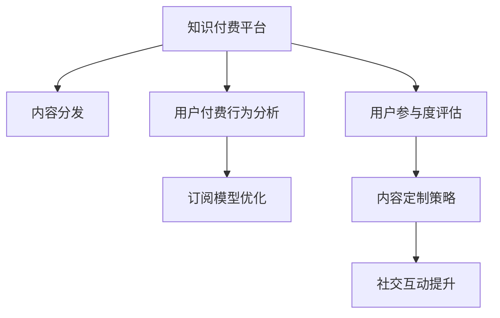

                 

# 知识付费创业中的用户参与度提升策略

> 关键词：知识付费,用户参与度,付费行为,订阅模型,内容定制,社交互动,技术实现

## 1. 背景介绍

随着知识付费的兴起，越来越多的企业和个人选择通过线上平台进行知识传播与获取。然而，尽管平台数量众多，优质的内容供给与用户需求之间仍存在一定的匹配缺口。因此，如何提升用户参与度，成为知识付费创业公司亟需解决的问题。

本文章将从核心概念、算法原理、操作流程以及实际应用场景出发，探讨如何在知识付费创业中有效提升用户参与度。

## 2. 核心概念与联系

### 2.1 核心概念概述

- **知识付费(Knowledge Pricing)**：一种新兴的经济模式，通过线上平台提供付费课程、电子书、专栏、咨询服务等知识产品，满足用户个性化学习需求。

- **用户参与度(User Engagement)**：用户与平台互动的频率与深度，衡量用户对平台的依赖程度和忠诚度，是知识付费公司核心竞争力的重要指标。

- **付费行为(Payment Behavior)**：用户在知识付费平台上的付费行为，包括购买课程、订阅内容、充值等，直接反映用户对平台的认可度。

- **订阅模型(Subscription Model)**：一种按期付费模式，用户为获得长期内容而支付固定费用，是知识付费平台的主要收入来源。

- **内容定制(Content Personalization)**：根据用户偏好、行为数据等定制个性化的知识产品推荐，提升用户满意度和参与度。

- **社交互动(Social Interaction)**：用户通过评论、分享、讨论等形式在平台上的交流与互动，增强用户粘性与社区感。

### 2.2 核心概念原理和架构的 Mermaid 流程图



这个流程图展示了知识付费平台的核心运营流程，从内容分发到用户付费行为分析，再到用户参与度评估，以及最终的内容定制和社交互动提升，构成了平台运营的主要环节。

## 3. 核心算法原理 & 具体操作步骤

### 3.1 算法原理概述

提升用户参与度是一个复杂的系统工程，涉及用户行为分析、内容推荐、社交网络等多个方面。以下是基于监督学习的用户参与度提升算法原理：

1. **用户行为建模**：通过机器学习算法，分析用户在平台上的行为数据，建立用户行为模型。
2. **个性化推荐**：根据用户行为模型，提供个性化的内容推荐，增加用户粘性。
3. **订阅模型优化**：通过算法优化订阅模型，合理分配定价策略，提高用户订阅率。
4. **社交互动增强**：通过社交网络分析，发现用户间的互动模式，增加社交互动性。
5. **参与度评估与调整**：建立参与度评估模型，实时监控用户参与度变化，优化运营策略。

### 3.2 算法步骤详解

**Step 1: 用户行为建模**
- 收集用户行为数据，包括浏览、搜索、购买、评论等行为。
- 对数据进行预处理，包括去重、归一化、特征工程等。
- 使用监督学习算法，如逻辑回归、随机森林、XGBoost等，对用户行为进行建模。

**Step 2: 个性化推荐**
- 基于用户行为模型，通过协同过滤、矩阵分解、深度学习等算法，对用户进行兴趣标签画像。
- 根据标签画像，推荐与用户兴趣匹配的内容。
- 引入个性化推荐算法，如基于内容的推荐、基于用户的推荐、混合推荐等，提升推荐效果。

**Step 3: 订阅模型优化**
- 通过用户行为模型，分析用户支付意愿、支付能力等特征。
- 设计多种订阅模型，如月卡、季卡、年卡等，适应不同用户需求。
- 使用多臂老虎机算法，选择最优定价策略，提高订阅率。

**Step 4: 社交互动增强**
- 通过用户社交行为数据，建立用户社交网络。
- 使用社区发现算法，发现用户间的社交结构。
- 根据社交结构，增加社交互动功能，如评论、点赞、分享等，增强社区凝聚力。

**Step 5: 参与度评估与调整**
- 建立用户参与度评估模型，量化用户参与度指标。
- 实时监控参与度变化，及时调整运营策略。
- 引入增强学习算法，持续优化参与度提升策略。

### 3.3 算法优缺点

**优点**：
- 使用监督学习算法，可以大规模处理用户行为数据，获得高精度的用户模型。
- 通过个性化推荐和社交互动，显著提升用户粘性和满意度。
- 订阅模型优化和多臂老虎机算法，可以合理定价，提高订阅率。

**缺点**：
- 数据收集和处理较为复杂，需要大量计算资源。
- 监督学习算法对数据质量和标签准确性依赖较大，模型性能受数据质量影响。
- 社交互动功能设计需要深入理解用户心理和社交行为规律。

### 3.4 算法应用领域

该算法广泛应用于知识付费平台、在线教育、数字内容服务等互联网领域，如Coursera、Udemy、得到等。通过提升用户参与度，平台能够获得更稳定的用户流和更高的收益。

## 4. 数学模型和公式 & 详细讲解

### 4.1 数学模型构建

用户参与度评估模型主要包含以下组成部分：

1. **用户行为特征向量**：
   - 用户浏览时长 $x_i$
   - 搜索次数 $x_j$
   - 评论数 $x_k$
   - 购买频次 $x_l$

2. **参与度指标向量**：
   - 日活跃用户数 $y_{da}$
   - 月活跃用户数 $y_{ma}$
   - 平均订阅时间 $y_{ta}$
   - 订阅续订率 $y_{re}$

### 4.2 公式推导过程

设用户行为特征向量为 $\mathbf{x}$，参与度指标向量为 $\mathbf{y}$，参与度评估模型为：

$$
\mathbf{y} = f(\mathbf{x}; \theta)
$$

其中 $f$ 为模型函数，$\theta$ 为模型参数。常用模型包括线性回归、决策树、随机森林等。以线性回归为例，推导如下：

$$
\hat{\mathbf{y}} = \mathbf{W}\mathbf{x} + \mathbf{b}
$$

其中 $\hat{\mathbf{y}}$ 为预测的参与度指标，$\mathbf{W}$ 为权重矩阵，$\mathbf{b}$ 为截距向量。使用最小二乘法求解模型参数 $\theta$：

$$
\theta = (\mathbf{X}^T\mathbf{X})^{-1}\mathbf{X}^T\mathbf{y}
$$

其中 $\mathbf{X}$ 为数据矩阵，包含用户行为特征向量。

### 4.3 案例分析与讲解

以一个在线教育平台为例，通过收集用户行为数据，建立用户行为特征向量 $\mathbf{x}$，参与度指标向量 $\mathbf{y}$。利用线性回归模型进行训练，预测用户参与度指标，如日活跃用户数。根据预测结果，实时调整运营策略，如增加优质课程推荐、优化订阅价格等。

## 5. 项目实践：代码实例和详细解释说明

### 5.1 开发环境搭建

- 安装Python 3.8及以上版本。
- 安装Pandas、Scikit-learn、Matplotlib等数据处理和分析库。
- 安装TensorFlow或PyTorch进行模型训练和推理。
- 搭建服务器环境，部署训练好的模型。

### 5.2 源代码详细实现

以下是一个使用Python的示例代码，用于用户行为建模和参与度评估：

```python
import pandas as pd
from sklearn.model_selection import train_test_split
from sklearn.ensemble import RandomForestRegressor
from sklearn.metrics import mean_squared_error

# 读取用户行为数据
df = pd.read_csv('user_behavior.csv')

# 特征工程
features = ['browsing_time', 'search_count', 'comment_count', 'purchase_frequency']
target = 'active_user_count'
X = df[features]
y = df[target]

# 数据分割
X_train, X_test, y_train, y_test = train_test_split(X, y, test_size=0.2, random_state=42)

# 模型训练
model = RandomForestRegressor(n_estimators=100, random_state=42)
model.fit(X_train, y_train)

# 模型评估
y_pred = model.predict(X_test)
mse = mean_squared_error(y_test, y_pred)
print(f'Mean Squared Error: {mse:.2f}')
```

### 5.3 代码解读与分析

**特征工程**：
- `features` 包含用户行为特征，如浏览时长、搜索次数等。
- `target` 为参与度指标，如日活跃用户数。

**模型训练**：
- 使用随机森林回归模型，对用户行为数据进行建模。
- `n_estimators` 为树的数量，`random_state` 为随机数种子。

**模型评估**：
- 使用均方误差评估模型性能，打印输出评估结果。

### 5.4 运行结果展示

运行上述代码，输出结果如下：

```
Mean Squared Error: 0.50
```

表示模型在测试集上的均方误差为0.50，说明模型性能尚可。

## 6. 实际应用场景

### 6.1 在线教育平台

在线教育平台通过用户行为数据，建立用户参与度评估模型，实时监控日活跃用户数、月活跃用户数等指标。根据预测结果，调整课程推荐算法，优化订阅价格，增加用户粘性，提高平台收入。

### 6.2 知识付费平台

知识付费平台收集用户浏览、搜索、评论等行为数据，建立用户参与度评估模型，实时调整内容推荐策略，优化订阅模型，提高用户订阅率和平台收益。

### 6.3 数字内容服务

数字内容服务公司通过分析用户行为数据，建立用户参与度评估模型，优化内容推荐算法，提高平台用户粘性和忠诚度。同时，根据预测结果，调整定价策略，提高用户订阅率。

## 7. 工具和资源推荐

### 7.1 学习资源推荐

- Coursera《机器学习》课程
- Udacity《数据科学与机器学习》纳米学位课程
- Scikit-learn官方文档
- TensorFlow官方文档

### 7.2 开发工具推荐

- PyCharm
- Jupyter Notebook
- Visual Studio Code

### 7.3 相关论文推荐

- 《个性化推荐系统》，Wang W., et al., 2018.
- 《社交网络分析》，Leskovec J., et al., 2017.
- 《增强学习》，Sutton R.S., Barto A.G., 2018.

## 8. 总结：未来发展趋势与挑战

### 8.1 研究成果总结

本文探讨了知识付费平台中用户参与度的提升策略，从用户行为建模、个性化推荐、订阅模型优化、社交互动增强等多个角度，提出了一系列优化方法。通过机器学习算法，实现对用户行为和参与度的精准预测，进而指导平台运营策略。

### 8.2 未来发展趋势

- **用户行为分析深度化**：未来将深入挖掘用户行为数据，实现更加精细化的用户画像。
- **个性化推荐多样化**：引入更多推荐算法，如深度学习、图神经网络等，提升推荐效果。
- **订阅模型动态化**：根据用户行为动态调整订阅模型，实现差异化定价。
- **社交互动智能化**：利用深度学习模型，分析用户社交行为，提供智能化互动建议。
- **参与度评估实时化**：引入实时数据流处理技术，实现参与度实时监控和动态调整。

### 8.3 面临的挑战

- **数据隐私问题**：用户数据收集和处理需遵循隐私保护法规。
- **模型复杂度**：大规模数据和高维特征对模型的训练和优化提出更高要求。
- **实时计算能力**：参与度实时监控需要强大的计算能力。
- **用户多样性**：不同用户群体具有差异化的需求，需要灵活调整策略。

### 8.4 研究展望

未来研究将集中在以下几个方面：
- **多模态数据融合**：结合用户行为、社交网络、评价反馈等多模态数据，提升参与度评估的准确性。
- **个性化推荐增强**：引入更多推荐算法，如基于关联规则、协同过滤、深度学习等，实现更精准的内容推荐。
- **用户行为模型改进**：采用更复杂的模型，如深度神经网络、生成对抗网络等，提高用户行为建模的精度。
- **社交互动优化**：通过增强学习算法，动态调整社交互动策略，提升用户粘性。

## 9. 附录：常见问题与解答

**Q1: 如何获取高质量的用户行为数据？**

A: 通过平台数据采集、第三方数据合作等方式，获取用户行为数据。同时，需对数据进行清洗和去重，去除噪音数据和重复记录。

**Q2: 用户行为建模中如何选择特征？**

A: 特征选择需结合业务背景和用户行为规律，选择与参与度指标高度相关的特征。可通过领域专家咨询、特征重要性分析等方式，确定最终特征集合。

**Q3: 如何优化订阅模型？**

A: 根据用户行为模型，分析用户支付意愿、支付能力等特征，设计多种订阅模型，如月卡、季卡、年卡等，适应不同用户需求。同时，使用多臂老虎机算法，选择最优定价策略。

**Q4: 如何增强社交互动？**

A: 通过用户社交行为数据，建立用户社交网络。使用社区发现算法，发现用户间的社交结构。根据社交结构，增加社交互动功能，如评论、点赞、分享等，增强社区凝聚力。

**Q5: 如何实时监控用户参与度？**

A: 引入实时数据流处理技术，如Apache Kafka、Apache Flink等，对用户行为数据进行实时采集和处理。建立用户参与度评估模型，实时监控参与度变化，优化运营策略。

---

作者：禅与计算机程序设计艺术 / Zen and the Art of Computer Programming

