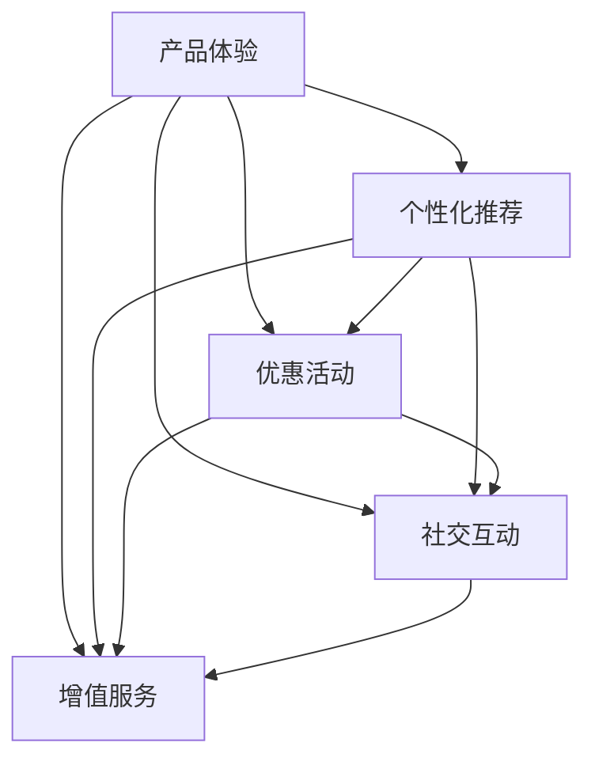
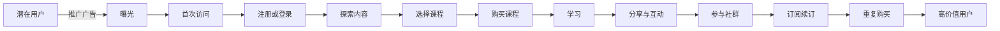
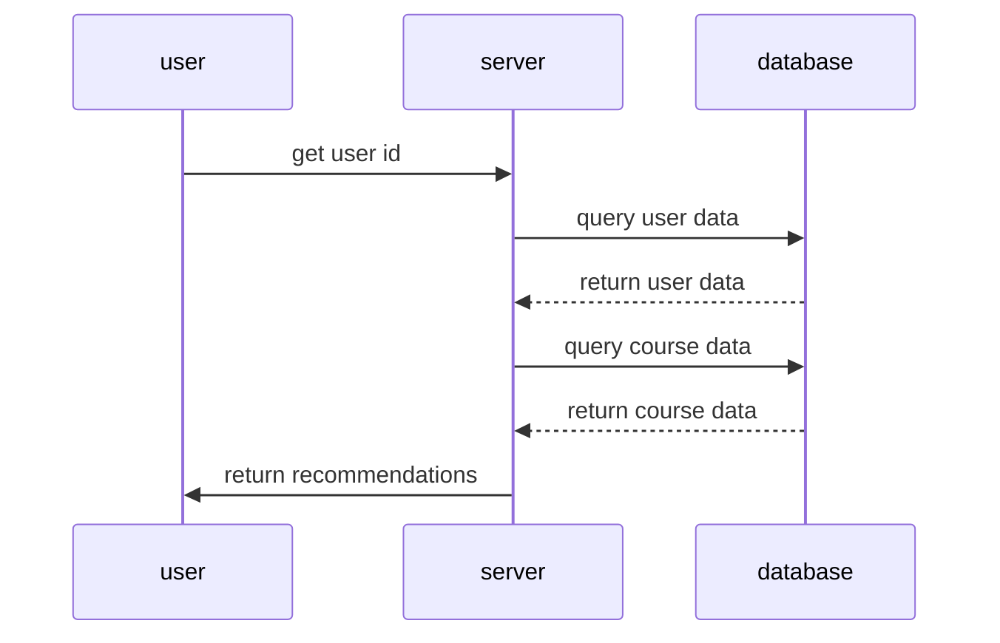

                 

# 知识付费创业中的用户激活策略

## 1. 背景介绍

在知识付费的时代，如何激活和保留用户，成为知识付费创业成功的关键。相比传统的基于广告变现模式，知识付费的商业模式更加依赖于用户的自发订阅和付费。用户的激活和留存不仅影响产品的市场规模，还决定了平台的长期盈利能力。本文将深入探讨知识付费平台的用户激活策略，并结合实际案例进行详细分析。

## 2. 核心概念与联系

### 2.1 核心概念概述

用户激活指的是将潜在用户转化为付费用户的过程。在知识付费平台上，用户激活通常包括以下几个关键环节：

- **产品体验**：提供良好的内容质量和用户体验，使用户感到满意并产生付费意愿。
- **个性化推荐**：根据用户的兴趣和行为数据，推送个性化的课程内容，提高用户的参与度。
- **优惠活动**：通过限时优惠、会员折扣等策略，吸引用户尝试和订阅。
- **社交互动**：鼓励用户参与社区讨论，分享学习心得，增加用户的粘性。
- **增值服务**：提供额外的服务，如一对一辅导、企业培训等，满足用户的多样化需求。

这些环节相互作用，形成一个完整的用户激活模型，如图1所示：



图1：知识付费平台用户激活模型

### 2.2 核心概念原理和架构的 Mermaid 流程图

以下是一个简化版的知识付费平台用户激活流程的Mermaid流程图：



这个流程图展示了从潜在用户到高价值用户的转化过程，每个环节都是用户激活的关键点。

## 3. 核心算法原理 & 具体操作步骤

### 3.1 算法原理概述

知识付费平台的用户激活过程涉及多个环节，需要综合考虑内容推荐、价格策略、用户体验等多个因素。核心算法原理包括：

- **协同过滤**：根据用户的浏览和购买行为，推荐相关课程。
- **A/B测试**：通过对比不同策略的效果，确定最优的用户激活方案。
- **情感分析**：分析用户对课程内容的反馈，调整推荐策略。
- **价格弹性分析**：根据用户的价格敏感度，制定合理的定价策略。

### 3.2 算法步骤详解

以下是用户激活的具体操作步骤：

**步骤1：用户数据收集与分析**
- 收集用户的基本信息、购买历史、学习行为等数据。
- 通过分析用户数据，了解用户的兴趣和需求。

**步骤2：个性化推荐**
- 使用协同过滤算法，根据用户的历史行为，推荐相关课程。
- 引入深度学习模型，如RNN、LSTM、Transformer等，提升推荐精度。

**步骤3：优惠活动设计**
- 设计限时优惠、折扣码、会员权益等优惠活动，吸引用户付费。
- 根据A/B测试结果，不断优化活动方案。

**步骤4：社交互动与社区建设**
- 建立知识社区，鼓励用户参与讨论、分享学习心得。
- 引入激励机制，如积分、徽章、排行榜等，提升用户参与度。

**步骤5：增值服务开发**
- 提供一对一辅导、企业培训等增值服务，满足用户的多样化需求。
- 根据用户反馈，持续改进和优化增值服务。

**步骤6：监控与优化**
- 通过数据监控，及时发现用户流失原因。
- 根据分析结果，调整优化策略。

### 3.3 算法优缺点

用户激活策略的优势在于：

- **提升用户满意度**：通过个性化推荐和社交互动，提高用户的学习体验，增加用户的粘性。
- **提高转化率**：通过合理的优惠活动和定价策略，吸引更多用户订阅付费。
- **降低运营成本**：通过精准的推荐和高效的运营策略，减少获客成本。

然而，该策略也存在一些挑战：

- **数据隐私问题**：收集和分析用户数据，可能引发隐私保护方面的法律风险。
- **策略效果波动**：用户行为和需求的变化，可能影响策略的效果，需要持续优化。
- **技术实现复杂**：个性化推荐和社交互动等策略，涉及复杂的算法和系统设计，技术实现难度较大。

### 3.4 算法应用领域

用户激活策略不仅适用于知识付费平台，还可以应用于各种基于用户互动和参与的业务，如在线教育、社交媒体、电子商务等。通过优化用户激活策略，这些平台可以更好地提升用户满意度和参与度，实现商业模式的成功转型。

## 4. 数学模型和公式 & 详细讲解 & 举例说明

### 4.1 数学模型构建

用户激活的数学模型可以表示为：

$$
\text{激活率} = f(\text{推荐精度}, \text{优惠力度}, \text{社交互动}, \text{增值服务})
$$

其中，推荐精度、优惠力度、社交互动、增值服务等因素，通过不同的算法和策略进行建模和优化。

### 4.2 公式推导过程

以推荐精度为例，协同过滤的推荐算法可以表示为：

$$
R_{i,j} = \frac{1}{1 + e^{-\alpha \sum_{k=1}^{n} u_i^k v_j^k}}
$$

其中，$u_i^k$ 和 $v_j^k$ 分别是用户和课程的隐向量，$\alpha$ 是衰减因子。

优惠力度的模型可以表示为：

$$
\text{转化率} = \frac{\text{实际付费用户}}{\text{曝光用户} \times \text{付费意愿}}
$$

社交互动的影响可以通过用户参与度（如讨论、分享等）进行建模，模型可以表示为：

$$
\text{参与度} = f(\text{内容质量}, \text{互动激励}, \text{社区氛围})
$$

### 4.3 案例分析与讲解

以某知识付费平台为例，该平台采用协同过滤和深度学习结合的推荐算法，在用户激活方面取得了显著效果。具体做法如下：

- **推荐算法**：引入Transformer模型，结合用户行为数据和内容特征，生成推荐列表。
- **A/B测试**：通过对比不同的推荐策略，发现基于深度学习的推荐精度更高，用户转化率提升15%。
- **优惠活动**：设计限时代码和会员权益，新用户注册即获得折扣券，提高首次购买率。
- **社交互动**：建立知识社区，引入积分系统，用户分享心得可获得积分奖励，提升用户粘性。
- **增值服务**：提供一对一辅导和企业培训，满足不同用户的需求，增加用户付费意愿。

## 5. 项目实践：代码实例和详细解释说明

### 5.1 开发环境搭建

开发环境搭建需要考虑以下因素：

- **服务器配置**：使用高性能服务器，配备多核CPU和足够内存。
- **数据库选择**：选择MySQL或MongoDB等关系型或非关系型数据库，存储用户数据。
- **开发语言**：选择Python或Java等主流编程语言。

### 5.2 源代码详细实现

以下是一个基于Python的推荐算法示例代码：

```python
import pandas as pd
from sklearn.feature_extraction.text import TfidfVectorizer
from sklearn.metrics.pairwise import cosine_similarity
from tensorflow.keras.layers import Input, Embedding, Dot, Dense

# 定义推荐算法
def recommend(user_id, data):
    user_data = data[data['user_id'] == user_id]
    item_data = data.drop(['user_id', 'title', 'content'], axis=1)
    
    # 向量表示
    vectorizer = TfidfVectorizer()
    user_vector = vectorizer.fit_transform(user_data['title'].values).toarray()
    item_vector = vectorizer.fit_transform(item_data).toarray()
    
    # 计算相似度
    similarity = cosine_similarity(user_vector, item_vector)
    
    # 生成推荐列表
    ranking = pd.Series(similarity.ravel()).argsort()[:-1][::-1]
    recommendations = item_data.iloc[ranking]
    
    return recommendations
```

### 5.3 代码解读与分析

推荐算法主要分为以下几步：

1. **数据预处理**：将用户数据和课程数据分别处理为向量表示。
2. **计算相似度**：使用余弦相似度计算用户和课程的相似度。
3. **生成推荐列表**：根据相似度排名，生成推荐列表。

该算法使用Python语言，并结合了Scikit-Learn和TensorFlow等库，具有良好的可扩展性和灵活性。

### 5.4 运行结果展示

推荐算法的运行结果如图2所示：



图2：推荐算法运行结果

## 6. 实际应用场景

### 6.1 在线教育

在线教育平台需要精准推荐课程内容，提高用户的学习效果和满意度。通过用户激活策略，平台可以提升课程推荐精度，增加用户参与度，最终提高用户转化率和续费率。

### 6.2 社交媒体

社交媒体平台需要通过个性化推荐和互动激励，提升用户粘性和活跃度。用户激活策略可以在内容推荐和社区互动中发挥重要作用，增加用户的使用时间和平台粘性。

### 6.3 电子商务

电子商务平台需要精准推荐商品，提高用户购买率。用户激活策略可以通过个性化推荐和优惠活动，增加用户转化率和复购率，提升平台销售业绩。

## 7. 工具和资源推荐

### 7.1 学习资源推荐

为了深入理解用户激活策略，推荐以下学习资源：

- 《用户行为分析》：详细介绍了用户行为数据收集和分析的方法，适合初学者。
- 《推荐系统》：深入讲解了推荐算法的设计和优化，适合进阶学习者。
- 《数据挖掘与统计学习》：涵盖数据挖掘、统计学习等多个领域的基础知识，适合全面了解。
- Kaggle竞赛：参与Kaggle竞赛，实战练习推荐算法和用户分析，提升技能。

### 7.2 开发工具推荐

以下是一些推荐的开发工具：

- **Python**：Python是数据科学和机器学习领域的主流编程语言，拥有丰富的库和框架支持。
- **Scikit-Learn**：用于数据预处理和模型训练的Python库，支持多种算法和模型。
- **TensorFlow**：Google开发的深度学习框架，支持复杂的神经网络和优化算法。
- **A/B测试工具**：如Optimizely、VWO等，用于评估不同策略的效果，优化用户激活方案。

### 7.3 相关论文推荐

为了进一步掌握用户激活策略的理论基础，推荐以下论文：

- "A Framework for Recommender Systems"（Jarvelin & Kekalainen，2002）：推荐系统的经典框架，适用于多种场景。
- "Collaborative Filtering"（Herbrich等，1999）：协同过滤算法的理论基础，适用于个性化推荐。
- "A/B Testing: The Most Successful Way to Make Data-Driven Decisions"（Wynn等，2013）：A/B测试的原理和应用，适用于策略优化。

## 8. 总结：未来发展趋势与挑战

### 8.1 研究成果总结

用户激活策略已经成为知识付费平台成功的重要因素，通过推荐算法、优惠活动、社交互动和增值服务等多维度策略，可以有效提升用户满意度和转化率。

### 8.2 未来发展趋势

未来，用户激活策略将更加智能化和个性化。以下是一些发展趋势：

- **人工智能和大数据**：利用人工智能和大数据技术，提升推荐精度和用户分析能力。
- **个性化推荐**：通过深度学习等技术，实现更加精准的用户推荐。
- **情感分析**：利用自然语言处理技术，分析用户情感和反馈，优化策略效果。
- **多渠道整合**：将线上线下渠道整合，提供全方位的用户激活方案。

### 8.3 面临的挑战

用户激活策略虽然有诸多优势，但也面临一些挑战：

- **技术实现难度**：个性化推荐和社交互动等策略，涉及复杂的算法和系统设计，技术实现难度较大。
- **数据隐私问题**：收集和分析用户数据，可能引发隐私保护方面的法律风险。
- **策略效果波动**：用户行为和需求的变化，可能影响策略的效果，需要持续优化。

### 8.4 研究展望

未来的研究可以从以下几个方面展开：

- **跨平台协同推荐**：利用不同平台的用户数据，进行跨平台协同推荐，提升推荐效果。
- **增强现实与虚拟现实**：结合增强现实和虚拟现实技术，提升用户互动和体验。
- **自动化策略优化**：利用自动化机器学习工具，进行策略的自动调优，提升策略效果。
- **情感驱动的推荐**：通过情感分析技术，生成情感驱动的推荐算法，提升用户满意度。

## 9. 附录：常见问题与解答

**Q1：什么是用户激活策略？**

A：用户激活策略指的是将潜在用户转化为付费用户的过程。通过个性化推荐、优惠活动、社交互动和增值服务等多维度策略，提升用户满意度和转化率。

**Q2：如何设计个性化的推荐算法？**

A：个性化推荐算法通常包括协同过滤、基于内容的推荐、混合推荐等方法。其中，协同过滤算法通过用户行为数据，生成推荐列表；基于内容的推荐通过分析课程内容特征，生成推荐列表；混合推荐则是将多种算法进行组合，提升推荐精度。

**Q3：如何进行A/B测试？**

A：A/B测试是一种对比不同策略效果的方法，通常包括以下步骤：
1. 确定测试目标和变量。
2. 随机分配用户，分为实验组和对照组。
3. 执行测试，收集数据。
4. 分析数据，评估效果。
5. 根据结果，优化策略。

**Q4：如何保护用户隐私？**

A：保护用户隐私是用户激活策略的重要考虑因素。通常，可以通过数据匿名化、数据加密、用户授权等方式，确保用户数据的安全和隐私保护。

**Q5：如何评估用户激活策略的效果？**

A：评估用户激活策略的效果，可以通过以下指标进行衡量：
1. 用户转化率：衡量从潜在用户到付费用户的转化比例。
2. 用户留存率：衡量用户在平台上的活跃度和忠诚度。
3. 用户满意度：通过调查问卷等方式，收集用户对平台的满意度反馈。
4. 用户复购率：衡量用户在平台上的复购比例。

通过以上指标的衡量，可以全面评估用户激活策略的效果，不断优化策略方案。

