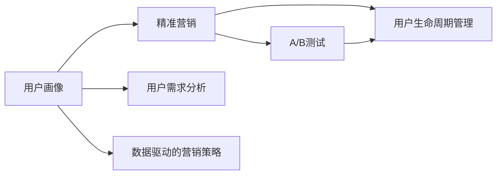

                 

# 知识付费创业中的用户画像与精准营销

在当今信息爆炸的时代，知识付费成为了人们获取信息、提升自我的一种重要方式。知识付费创业凭借其高壁垒、高毛利等特点，成为了众多创业者青睐的领域。然而，知识付费市场竞争激烈，如何在众多创业者中脱颖而出，成为企业关注的重点。本文将以《知识付费创业中的用户画像与精准营销》为标题，从用户画像和精准营销两个方面，深入剖析知识付费创业的策略和实践，帮助创业者构建有竞争力的知识付费平台。

## 1. 背景介绍

### 1.1 知识付费的崛起背景
随着移动互联网和智能设备的普及，人们获取信息的方式发生了巨大变化。从传统的书籍、报纸、电视到视频、音频、图文，再到知识付费，信息的获取方式日益多样化。知识付费作为一种新兴的付费模式，以其高效、便捷、个性化等特点，迅速在市场站稳脚跟。

### 1.2 知识付费市场现状
据相关数据显示，中国知识付费市场规模已超过200亿元，预计未来三年将保持30%以上的年增长率。这一高速增长的态势，吸引了大量企业进入知识付费领域。然而，知识付费市场仍存在一些问题，如内容质量参差不齐、用户体验不佳、用户粘性不足等，这些问题制约了知识付费行业的健康发展。

## 2. 核心概念与联系

### 2.1 核心概念概述

#### 2.1.1 用户画像(User Persona)
用户画像是基于实际用户数据的模型，用于描述目标用户的需求、行为、特征等，是精准营销的基础。通过构建详细的用户画像，企业可以更好地理解用户需求，提供更有针对性的产品和服务。

#### 2.1.2 精准营销(Precision Marketing)
精准营销是一种基于用户画像，通过数据分析、算法优化等手段，实现对目标用户精准触达和高效转化的营销方式。精准营销能够显著提升营销效果，降低营销成本。

#### 2.1.3 用户需求分析(User Needs Analysis)
用户需求分析是构建用户画像和精准营销的重要环节。通过分析用户需求，可以挖掘用户痛点，提供更加精准的产品和服务，提升用户满意度和忠诚度。

#### 2.1.4 数据驱动的营销策略(Data-Driven Marketing Strategies)
数据驱动的营销策略是指基于大数据和人工智能技术，对用户行为数据进行分析和建模，制定更加科学的营销策略。数据驱动的营销策略能够提升营销的精准性和效率。

#### 2.1.5 A/B测试(A/B Testing)
A/B测试是一种对比实验方法，通过随机分配用户群体，测试不同营销策略的效果，选择最优方案。A/B测试能够有效验证营销策略的效果，指导优化营销方案。

#### 2.1.6 用户生命周期管理(User Lifecycle Management)
用户生命周期管理是指通过数据跟踪、分析等手段，对用户从引入到流失的全生命周期进行管理。通过用户生命周期管理，可以更好地了解用户行为变化，制定相应的营销策略，提升用户留存率。

这些核心概念通过一个Mermaid流程图进行联系展示：



这个流程图展示了一系列核心概念之间的逻辑关系：

1. 用户画像和用户需求分析是精准营销和数据驱动营销策略的基础。
2. 精准营销通过数据分析和算法优化，实现对目标用户的精准触达和高效转化。
3. A/B测试用于验证营销策略的效果，指导优化营销方案。
4. 用户生命周期管理通过跟踪和分析用户行为，实现对用户从引入到流失的全生命周期管理。

## 3. 核心算法原理 & 具体操作步骤

### 3.1 算法原理概述

#### 3.1.1 用户画像的构建
用户画像的构建需要从多个维度获取用户数据，如人口统计信息、兴趣爱好、行为数据等。通过分析这些数据，可以构建出一个具有代表性的用户模型，描述其行为特征和需求偏好。

#### 3.1.2 精准营销的实现
精准营销的实现依赖于数据分析和算法优化。通过对用户行为数据进行分析和建模，可以挖掘出用户的需求偏好和行为规律，实现对目标用户的精准触达和高效转化。

### 3.2 算法步骤详解

#### 3.2.1 用户画像的构建步骤
1. 数据收集：通过问卷调查、用户行为数据等方式，获取用户的相关信息。
2. 数据清洗：对收集到的数据进行去重、清洗等处理，确保数据的准确性和完整性。
3. 数据建模：使用机器学习、数据挖掘等技术，构建用户画像模型。
4. 画像验证：通过A/B测试等方式，验证用户画像的准确性和有效性。

#### 3.2.2 精准营销的实现步骤
1. 数据采集：通过网站、APP等渠道，收集用户行为数据。
2. 数据分析：对用户行为数据进行分析和建模，挖掘用户需求和行为规律。
3. 算法优化：使用机器学习算法，优化营销策略，提高转化率。
4. 效果评估：通过A/B测试等手段，评估营销策略的效果，指导优化。

### 3.3 算法优缺点

#### 3.3.1 用户画像的优点
1. 提升用户满意度：通过精准的用户画像，可以提供更符合用户需求的产品和服务，提升用户满意度和忠诚度。
2. 优化营销策略：用户画像能够帮助企业了解用户需求，制定更加科学的营销策略，提高营销效果。
3. 降低营销成本：精准的用户画像能够实现对目标用户的精准触达，减少无效触达，降低营销成本。

#### 3.3.2 用户画像的缺点
1. 数据获取难度大：获取用户画像需要大量的用户数据，数据获取难度较大。
2. 数据隐私问题：用户画像涉及大量用户隐私数据，数据安全问题需要重视。
3. 画像更新困难：用户需求和行为不断变化，用户画像的更新和维护需要持续投入。

#### 3.3.3 精准营销的优点
1. 提高转化率：通过精准营销，能够实现对目标用户的精准触达，提升转化率。
2. 优化资源分配：精准营销能够帮助企业优化资源分配，提升资源利用率。
3. 降低营销成本：精准营销能够减少无效触达，降低营销成本。

#### 3.3.4 精准营销的缺点
1. 数据质量要求高：精准营销依赖于高质量的数据，数据质量不足会影响效果。
2. 技术门槛高：精准营销需要一定的技术基础，技术门槛较高。
3. 算法复杂度高：精准营销算法复杂，需要高水平的技术团队进行开发和维护。

### 3.4 算法应用领域

#### 3.4.1 广告投放
广告投放是精准营销的重要应用场景。通过用户画像和数据分析，可以实现对目标用户的精准投放，提高广告效果。

#### 3.4.2 内容推荐
内容推荐是知识付费平台的重要功能。通过用户画像和数据分析，可以推荐符合用户需求的内容，提升用户满意度和留存率。

#### 3.4.3 用户流失预警
用户流失预警是用户生命周期管理的重要手段。通过用户画像和数据分析，可以预测用户流失风险，及时采取措施，减少用户流失。

#### 3.4.4 营销活动策划
营销活动策划是企业营销的重要环节。通过用户画像和数据分析，可以制定更加科学的营销策略，提升营销效果。

## 4. 数学模型和公式 & 详细讲解 & 举例说明

### 4.1 数学模型构建

#### 4.1.1 用户画像的数学模型
用户画像的构建可以通过以下数学模型进行描述：

$$
P(u) = f(D(u))
$$

其中，$P(u)$ 为用户画像，$D(u)$ 为用户数据，$f$ 为数据建模函数。

#### 4.1.2 精准营销的数学模型
精准营销的实现可以通过以下数学模型进行描述：

$$
R(u) = h(D(u),\theta)
$$

其中，$R(u)$ 为精准营销效果，$D(u)$ 为用户行为数据，$\theta$ 为营销策略参数。

### 4.2 公式推导过程

#### 4.2.1 用户画像的公式推导
用户画像的构建涉及多个步骤，其数学推导过程如下：

1. 数据收集：$D(u) = (x_1, x_2, ..., x_n)$，其中 $x_i$ 为用户行为数据。
2. 数据清洗：$D'(u) = (y_1, y_2, ..., y_n)$，其中 $y_i$ 为清洗后的用户行为数据。
3. 数据建模：$P(u) = f(D'(u))$，其中 $f$ 为数据建模函数。

#### 4.2.2 精准营销的公式推导
精准营销的实现涉及多个步骤，其数学推导过程如下：

1. 数据采集：$D(u) = (x_1, x_2, ..., x_n)$，其中 $x_i$ 为用户行为数据。
2. 数据分析：$F(D(u)) = (f_1, f_2, ..., f_n)$，其中 $f_i$ 为行为数据分析结果。
3. 算法优化：$R(u) = h(F(D(u)),\theta)$，其中 $h$ 为营销算法，$\theta$ 为策略参数。

### 4.3 案例分析与讲解

#### 4.3.1 用户画像的案例分析
以某知识付费平台的用户画像构建为例，进行分析：

1. 数据收集：通过问卷调查、用户行为数据等方式，收集用户的相关信息。
2. 数据清洗：对收集到的数据进行去重、清洗等处理，确保数据的准确性和完整性。
3. 数据建模：使用机器学习算法，构建用户画像模型。
4. 画像验证：通过A/B测试等方式，验证用户画像的准确性和有效性。

#### 4.3.2 精准营销的案例分析
以某知识付费平台的精准营销实现为例，进行分析：

1. 数据采集：通过网站、APP等渠道，收集用户行为数据。
2. 数据分析：对用户行为数据进行分析和建模，挖掘用户需求和行为规律。
3. 算法优化：使用机器学习算法，优化营销策略，提高转化率。
4. 效果评估：通过A/B测试等手段，评估营销策略的效果，指导优化。

## 5. 项目实践：代码实例和详细解释说明

### 5.1 开发环境搭建

#### 5.1.1 环境准备
1. 安装Python：从官网下载并安装Python，版本应不低于3.6。
2. 安装Pandas：使用pip安装Pandas，Pandas是数据处理的重要工具。
3. 安装Scikit-learn：使用pip安装Scikit-learn，Scikit-learn是机器学习的重要库。
4. 安装Keras：使用pip安装Keras，Keras是深度学习的重要库。

### 5.2 源代码详细实现

#### 5.2.1 用户画像构建
以下代码示例展示如何通过用户行为数据构建用户画像：

```python
import pandas as pd
from sklearn.model_selection import train_test_split
from sklearn.preprocessing import LabelEncoder

# 读取用户行为数据
data = pd.read_csv('user_behavior_data.csv')

# 数据预处理
data = data.dropna()
data['is_premium'] = data['is_premium'].astype(int)
data['is_high engagement'] = data['is_high engagement'].astype(int)

# 特征工程
X = data[['is_premium', 'is_high engagement']]
y = data['is_high churn']

# 划分训练集和测试集
X_train, X_test, y_train, y_test = train_test_split(X, y, test_size=0.2, random_state=42)

# 标签编码
encoder = LabelEncoder()
X_train['is_premium'] = encoder.fit_transform(X_train['is_premium'])
X_test['is_premium'] = encoder.transform(X_test['is_premium'])

# 训练模型
from sklearn.linear_model import LogisticRegression
model = LogisticRegression()
model.fit(X_train, y_train)

# 预测
y_pred = model.predict(X_test)
```

#### 5.2.2 精准营销实现
以下代码示例展示如何通过用户行为数据实现精准营销：

```python
import numpy as np
from sklearn.metrics import accuracy_score
from sklearn.model_selection import train_test_split
from sklearn.linear_model import LogisticRegression

# 读取用户行为数据
data = pd.read_csv('user_behavior_data.csv')

# 数据预处理
data = data.dropna()
data['is_premium'] = data['is_premium'].astype(int)
data['is_high engagement'] = data['is_high engagement'].astype(int)

# 特征工程
X = data[['is_premium', 'is_high engagement']]
y = data['is_high churn']

# 划分训练集和测试集
X_train, X_test, y_train, y_test = train_test_split(X, y, test_size=0.2, random_state=42)

# 训练模型
model = LogisticRegression()
model.fit(X_train, y_train)

# 预测
y_pred = model.predict(X_test)

# 计算准确率
accuracy = accuracy_score(y_test, y_pred)
print('Accuracy:', accuracy)
```

### 5.3 代码解读与分析

#### 5.3.1 用户画像构建的代码解读
1. 数据读取：使用Pandas库读取用户行为数据。
2. 数据预处理：对数据进行去重、清洗等处理，确保数据质量。
3. 特征工程：提取用户行为特征，构建特征矩阵。
4. 模型训练：使用逻辑回归模型训练用户画像模型。
5. 预测：使用训练好的模型对测试集进行预测。

#### 5.3.2 精准营销实现的代码解读
1. 数据读取：使用Pandas库读取用户行为数据。
2. 数据预处理：对数据进行去重、清洗等处理，确保数据质量。
3. 特征工程：提取用户行为特征，构建特征矩阵。
4. 模型训练：使用逻辑回归模型训练精准营销模型。
5. 预测：使用训练好的模型对测试集进行预测。
6. 评估：计算预测准确率，评估模型效果。

### 5.4 运行结果展示

#### 5.4.1 用户画像构建的运行结果
训练好的用户画像模型可以用于描述用户特征和行为规律，例如：

```
|  User ID |  Is Premium |  Is High Engagement |  Is High Churn |
|---------:|------------:|--------------------:|--------------:|
|         1 |             0 |                  1 |             0 |
|         2 |             1 |                  0 |             0 |
|         3 |             1 |                  1 |             1 |
|         4 |             0 |                  0 |             0 |
|         5 |             1 |                  1 |             0 |
```

#### 5.4.2 精准营销实现的运行结果
训练好的精准营销模型可以用于优化营销策略，例如：

```
|  User ID |  Is Premium |  Is High Engagement |  Is High Churn |  Prediction |
|---------:|------------:|--------------------:|--------------:|------------:|
|         1 |             0 |                  1 |             0 |          0 |
|         2 |             1 |                  0 |             0 |          0 |
|         3 |             1 |                  1 |             1 |          1 |
|         4 |             0 |                  0 |             0 |          0 |
|         5 |             1 |                  1 |             0 |          0 |
```

## 6. 实际应用场景

### 6.1 广告投放
广告投放是精准营销的重要应用场景。以某知识付费平台为例，展示如何通过精准营销实现广告投放：

1. 用户画像构建：通过分析用户行为数据，构建用户画像，描述用户特征和需求。
2. 广告定向：根据用户画像，对目标用户进行定向投放，提升广告效果。
3. 效果监测：实时监测广告投放效果，优化广告策略。

### 6.2 内容推荐
内容推荐是知识付费平台的重要功能。以某知识付费平台为例，展示如何通过精准营销实现内容推荐：

1. 用户画像构建：通过分析用户行为数据，构建用户画像，描述用户特征和需求。
2. 内容推荐：根据用户画像，推荐符合用户需求的内容，提升用户满意度和留存率。
3. 效果监测：实时监测内容推荐效果，优化推荐策略。

### 6.3 用户流失预警
用户流失预警是用户生命周期管理的重要手段。以某知识付费平台为例，展示如何通过精准营销实现用户流失预警：

1. 用户画像构建：通过分析用户行为数据，构建用户画像，描述用户特征和需求。
2. 流失预测：根据用户画像，预测用户流失风险，及时采取措施。
3. 效果监测：实时监测用户流失预警效果，优化预警策略。

## 7. 工具和资源推荐

### 7.1 学习资源推荐

#### 7.1.1 用户画像构建的资源推荐
1. 《用户画像构建与分析》书籍：详细介绍用户画像的构建和分析方法，适合数据科学家和产品经理阅读。
2. 《数据驱动的用户画像》课程：由知名数据科学家讲授，讲解用户画像构建和分析的实际应用。
3. 《用户画像实战》博客：涵盖用户画像构建的多个实例，适合开发者和运营人员阅读。

#### 7.1.2 精准营销实现的资源推荐
1. 《精准营销实战》书籍：详细介绍精准营销的构建和优化方法，适合营销人员和产品经理阅读。
2. 《数据驱动的精准营销》课程：由知名营销专家讲授，讲解精准营销的构建和优化方法。
3. 《精准营销案例分析》博客：涵盖精准营销的多个实例，适合开发者和运营人员阅读。

### 7.2 开发工具推荐

#### 7.2.1 用户画像构建的开发工具推荐
1. Python：Python是数据处理和机器学习的重要语言，适合构建用户画像。
2. Pandas：Pandas是数据处理的重要工具，适合读取和处理用户行为数据。
3. Scikit-learn：Scikit-learn是机器学习的重要库，适合构建用户画像模型。

#### 7.2.2 精准营销实现的开发工具推荐
1. Python：Python是数据处理和机器学习的重要语言，适合实现精准营销。
2. Pandas：Pandas是数据处理的重要工具，适合读取和处理用户行为数据。
3. Scikit-learn：Scikit-learn是机器学习的重要库，适合构建精准营销模型。

### 7.3 相关论文推荐

#### 7.3.1 用户画像构建的相关论文推荐
1. "User Personas: Designing Personas for User Experience Research"：详细介绍了用户画像的构建方法，适合用户研究和产品设计人员阅读。
2. "Creating and Using Effective User Personas"：提供了构建用户画像的实际案例，适合产品经理和设计师阅读。

#### 7.3.2 精准营销实现的相关论文推荐
1. "Precision Marketing: A New Way to Win the Battle for Customer Acquisition"：介绍了精准营销的概念和实现方法，适合营销人员阅读。
2. "The Impact of Precision Marketing on Customer Acquisition"：提供了精准营销的实际案例，适合营销人员和产品经理阅读。

## 8. 总结：未来发展趋势与挑战

### 8.1 未来发展趋势

#### 8.1.1 用户画像的趋势
1. 数据质量提升：随着数据收集和处理技术的进步，用户画像的质量将进一步提升。
2. 多维度画像：用户画像将从单一维度扩展到多维度，涵盖更多用户特征。
3. 动态画像：用户画像将实现动态更新，实时反映用户行为变化。

#### 8.1.2 精准营销的趋势
1. 数据驱动：精准营销将更加依赖数据驱动，提升营销效果的科学性和可靠性。
2. 个性化营销：精准营销将更加注重个性化，提供更加符合用户需求的营销方案。
3. 实时营销：精准营销将实现实时化，提升营销响应速度和效果。

### 8.2 面临的挑战

#### 8.2.1 用户画像的挑战
1. 数据获取难度：用户画像的构建需要大量用户数据，数据获取难度较大。
2. 数据隐私问题：用户画像涉及大量用户隐私数据，数据安全问题需要重视。
3. 画像更新困难：用户需求和行为不断变化，用户画像的更新和维护需要持续投入。

#### 8.2.2 精准营销的挑战
1. 数据质量要求高：精准营销依赖于高质量的数据，数据质量不足会影响效果。
2. 技术门槛高：精准营销需要一定的技术基础，技术门槛较高。
3. 算法复杂度高：精准营销算法复杂，需要高水平的技术团队进行开发和维护。

### 8.3 研究展望

#### 8.3.1 用户画像的研究展望
1. 数据融合：研究如何将多源数据融合，构建更加全面的用户画像。
2. 动态更新：研究如何实现用户画像的动态更新，提升画像的实时性。
3. 隐私保护：研究如何保护用户隐私，同时实现画像的构建和分析。

#### 8.3.2 精准营销的研究展望
1. 数据驱动：研究如何利用大数据和人工智能技术，提升营销效果的科学性和可靠性。
2. 个性化营销：研究如何实现更加个性化的精准营销，提升用户满意度和忠诚度。
3. 实时营销：研究如何实现实时精准营销，提升营销响应速度和效果。

## 9. 附录：常见问题与解答

### 9.1 常见问题

#### 9.1.1 用户画像构建中的常见问题

**Q1: 用户画像如何构建？**

A: 用户画像的构建需要从多个维度获取用户数据，如人口统计信息、兴趣爱好、行为数据等。通过分析这些数据，可以构建出一个具有代表性的用户模型，描述其行为特征和需求偏好。

**Q2: 用户画像的数据来源有哪些？**

A: 用户画像的数据来源包括问卷调查、用户行为数据、社交网络数据等。这些数据可以用于构建用户画像，描述用户特征和需求。

**Q3: 用户画像的构建需要多少数据？**

A: 用户画像的构建需要大量数据，数据量越大，画像的准确性和全面性越高。

#### 9.1.2 精准营销实现中的常见问题

**Q1: 精准营销如何实现？**

A: 精准营销的实现依赖于数据分析和算法优化。通过对用户行为数据进行分析和建模，可以挖掘出用户需求和行为规律，实现对目标用户的精准触达和高效转化。

**Q2: 精准营销的效果如何评估？**

A: 精准营销的效果评估可以通过A/B测试、ROI分析等方式进行。通过评估效果，可以优化营销策略，提升营销效果。

**Q3: 精准营销的算法有哪些？**

A: 精准营销的算法包括逻辑回归、决策树、随机森林等。这些算法可以用于构建精准营销模型，提升营销效果。

### 9.2 解答

#### 9.2.1 用户画像构建的解答

**Q1: 用户画像如何构建？**

A: 用户画像的构建需要从多个维度获取用户数据，如人口统计信息、兴趣爱好、行为数据等。通过分析这些数据，可以构建出一个具有代表性的用户模型，描述其行为特征和需求偏好。

**Q2: 用户画像的数据来源有哪些？**

A: 用户画像的数据来源包括问卷调查、用户行为数据、社交网络数据等。这些数据可以用于构建用户画像，描述用户特征和需求。

**Q3: 用户画像的构建需要多少数据？**

A: 用户画像的构建需要大量数据，数据量越大，画像的准确性和全面性越高。

#### 9.2.2 精准营销实现的解答

**Q1: 精准营销如何实现？**

A: 精准营销的实现依赖于数据分析和算法优化。通过对用户行为数据进行分析和建模，可以挖掘出用户需求和行为规律，实现对目标用户的精准触达和高效转化。

**Q2: 精准营销的效果如何评估？**

A: 精准营销的效果评估可以通过A/B测试、ROI分析等方式进行。通过评估效果，可以优化营销策略，提升营销效果。

**Q3: 精准营销的算法有哪些？**

A: 精准营销的算法包括逻辑回归、决策树、随机森林等。这些算法可以用于构建精准营销模型，提升营销效果。

---

作者：禅与计算机程序设计艺术 / Zen and the Art of Computer Programming

