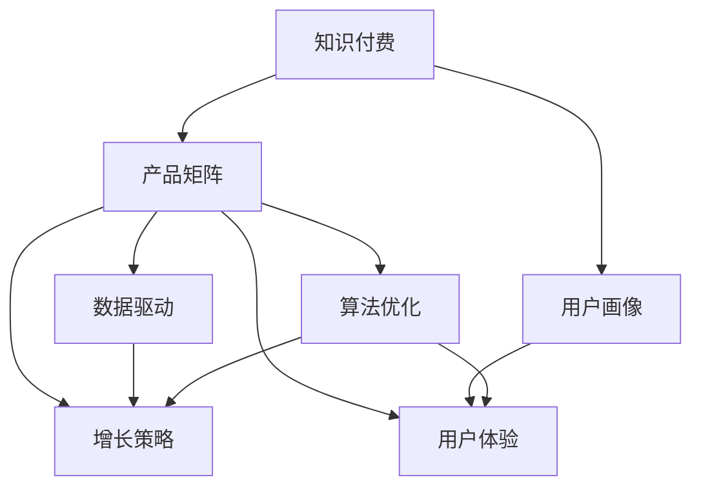

                 

# 知识付费创业的产品矩阵构建

> 关键词：知识付费, 产品矩阵, 用户画像, 数据驱动, 算法优化, 用户体验, 增长策略

## 1. 背景介绍

### 1.1 问题由来
随着互联网技术的飞速发展，在线知识付费市场呈现蓬勃发展态势。从在线教育到电子书订阅，再到问答平台和在线咨询，知识付费服务形式多样，覆盖广泛。然而，众多知识付费平台普遍面临流量获取难、用户留存低、付费转化率低等挑战。因此，如何构建一套行之有效的产品矩阵，通过精细化运营和数据驱动策略，提升平台的用户黏性和付费转化率，成为当前知识付费创业中的核心问题。

### 1.2 问题核心关键点
构建知识付费平台的产品矩阵，需要综合考虑用户需求、内容供给、市场环境、技术能力等因素。核心在于通过差异化策略，满足不同用户群体的多样化需求，同时提升平台整体的市场竞争力和用户满意度。

## 2. 核心概念与联系

### 2.1 核心概念概述

为更好地理解产品矩阵构建的理论基础，本节将介绍几个关键概念：

- 知识付费（Knowledge-Pay Platform）：指用户需要为获取知识内容支付费用的在线平台，如网易云课堂、得到等。知识付费市场通过提供高质量的在线课程、音频内容、咨询服务等，满足用户对学习、增长、职业提升等需求。
- 产品矩阵（Product Portfolio）：指由多个相关产品组成的多元化产品集合，旨在覆盖用户全生命周期需求，通过矩阵化运营实现精细化管理。
- 用户画像（User Persona）：指对用户基本信息、行为偏好、消费习惯等进行建模，帮助平台精准定位用户，优化产品和服务。
- 数据驱动（Data-Driven）：指在产品设计、运营管理、营销策略等方面，通过数据进行决策，以提高运营效率和效果。
- 算法优化（Algorithm Optimization）：指通过算法模型，对产品推荐、用户行为预测、内容分发等进行优化，提升平台的用户体验和运营效率。
- 用户体验（User Experience）：指用户在使用产品或服务过程中所产生的体验感受，影响用户满意度和忠诚度。
- 增长策略（Growth Strategy）：指通过各种策略手段，实现用户增长、付费转化、活跃度提升等目标，包括内容营销、付费激励、社交裂变等。

这些概念之间的逻辑关系可以通过以下Mermaid流程图来展示：



这个流程图展示出知识付费平台产品矩阵的构建流程：

1. 知识付费作为产品矩阵的基础，通过提供多种知识服务，覆盖用户多样化需求。
2. 用户画像是产品矩阵的起点，帮助平台精准定位目标用户，优化产品设计。
3. 数据驱动贯穿产品矩阵构建的各个环节，通过数据分析和决策支持，提升运营效率和效果。
4. 算法优化是产品矩阵的核心技术支持，通过算法模型优化推荐和预测，提升用户体验。
5. 用户体验是产品矩阵的最终目标，通过优化产品和服务，提高用户满意度和忠诚度。
6. 增长策略是产品矩阵的落地保障，通过多渠道、多策略实现用户增长和付费转化。

## 3. 核心算法原理 & 具体操作步骤
### 3.1 算法原理概述

构建知识付费平台的产品矩阵，本质上是基于数据驱动和算法优化的精细化运营过程。其核心思想是：通过分析用户画像，构建多维度数据模型，运用机器学习和统计分析等技术，优化产品推荐、内容分发、用户增长等各个环节，实现产品的矩阵化运营。

形式化地，假设知识付费平台有 $M$ 种知识服务，针对 $N$ 个用户的不同需求，在时间 $T$ 内收集到 $D$ 个样本数据，通过对数据 $D$ 的分析和模型 $F$ 的训练，得到最优的产品推荐策略和用户行为预测模型。具体的算法流程如下：

1. 数据收集：收集用户访问历史、课程观看时长、评分反馈、购买记录等数据。
2. 特征工程：提取用户画像特征，如年龄、职业、学习习惯等，并进行归一化和特征选择。
3. 用户分群：基于用户画像，将用户分成不同群体，如高潜力用户、流失用户等。
4. 行为预测：通过用户历史数据和特征，建立预测模型，预测用户是否会流失、是否会购买某课程等行为。
5. 推荐优化：利用推荐算法（如协同过滤、内容推荐等），提升用户对课程的推荐效果。
6. 模型评估：定期评估推荐模型和预测模型的效果，进行参数调优。
7. 数据驱动决策：根据模型评估结果，调整产品推荐策略、用户营销策略等，提升用户满意度和平台收入。

### 3.2 算法步骤详解

基于数据驱动和算法优化的知识付费平台产品矩阵构建，主要包括以下关键步骤：

**Step 1: 数据收集与处理**
- 通过API接口或SDK，收集用户在平台上的行为数据，如访问记录、评分反馈、购买记录等。
- 对数据进行清洗、去重、归一化处理，确保数据质量。
- 将数据按时间、用户、产品等维度划分，方便后续分析。

**Step 2: 特征工程与用户画像建模**
- 提取用户画像特征，如年龄、职业、学习时间、行为偏好等。
- 使用机器学习技术，如PCA、LDA等，对用户画像特征进行降维和聚类，构建用户画像模型。
- 利用K-means等聚类算法，将用户分成不同群体，如高潜力用户、流失用户等。

**Step 3: 行为预测与模型训练**
- 利用机器学习算法，如随机森林、XGBoost等，建立用户行为预测模型。
- 根据预测模型，对高潜力用户进行精准营销，提升转化率。
- 对流失用户进行预警，提前进行干预，降低流失率。

**Step 4: 推荐算法优化**
- 利用协同过滤、内容推荐等算法，对用户进行个性化课程推荐。
- 通过A/B测试等方法，不断优化推荐算法，提升推荐效果。
- 引入负采样、特征交叉等技术，提高推荐算法的泛化能力。

**Step 5: 模型评估与优化**
- 使用离线评估方法，如混淆矩阵、ROC曲线等，评估推荐模型和预测模型的效果。
- 根据评估结果，调整模型参数和算法策略，确保模型准确性和鲁棒性。
- 定期进行模型更新和重新训练，保持模型的时效性和有效性。

**Step 6: 数据驱动决策**
- 根据模型评估结果，调整产品推荐策略、用户营销策略等，提升用户满意度和平台收入。
- 使用数据可视化工具，如Tableau、PowerBI等，实时监控运营指标，及时发现和解决问题。
- 引入增长黑客技术，如增长漏斗、A/B测试等，提升用户增长和付费转化。

### 3.3 算法优缺点

基于数据驱动和算法优化的知识付费平台产品矩阵构建方法，具有以下优点：

1. 精细化运营：通过数据分析和模型优化，实现产品矩阵的精细化管理，提升运营效率和效果。
2. 个性化推荐：利用推荐算法，提升用户对课程的推荐效果，提高用户满意度和平台粘性。
3. 精准营销：通过用户行为预测，进行精准营销，提升转化率和用户增长。
4. 动态调整：根据实时数据，动态调整产品策略和运营策略，确保平台的市场竞争力。

同时，该方法也存在一定的局限性：

1. 数据隐私问题：在收集和分析用户数据时，需要严格遵守数据隐私法律法规，保护用户隐私。
2. 算法复杂度：数据驱动和算法优化涉及大量数据处理和模型训练，计算资源和算力成本较高。
3. 模型泛化能力：模型需要在不同场景下进行泛化，避免过度拟合。
4. 数据质量要求高：数据质量直接影响模型效果，需保证数据采集和处理的准确性和完整性。
5. 模型解释性不足：复杂的机器学习模型通常缺乏可解释性，难以理解和调试。

尽管存在这些局限性，但就目前而言，数据驱动和算法优化的方式是知识付费平台产品矩阵构建的主流范式。未来相关研究的重点在于如何进一步降低数据驱动和算法优化对计算资源的依赖，提高模型的可解释性和泛化能力，同时兼顾用户隐私保护和数据质量要求。

### 3.4 算法应用领域

基于数据驱动和算法优化的知识付费平台产品矩阵构建方法，已经广泛应用于多个领域，例如：

- 在线教育：通过分析用户学习行为，推荐个性化课程，提升用户满意度和转化率。
- 电子书订阅：根据用户阅读历史和偏好，推荐相关书籍，提高用户粘性和付费率。
- 在线咨询：利用用户行为预测，进行精准推荐和营销，提升咨询服务的效果和转化率。
- 智能推荐系统：通过算法优化，提升个性化推荐效果，覆盖商品、内容、服务等多个场景。
- 社交网络：分析用户社交行为，推荐相关内容和用户，提升用户互动和粘性。

除了上述这些经典应用外，知识付费平台产品矩阵构建的方法，也在更多创新领域得到应用，如智能客服、虚拟主播、内容生成等，为知识付费行业带来了新的增长点和突破口。

## 4. 数学模型和公式 & 详细讲解 & 举例说明
### 4.1 数学模型构建

本节将使用数学语言对知识付费平台产品矩阵构建的数学模型进行更加严格的刻画。

假设知识付费平台有 $M$ 种课程，针对 $N$ 个用户，在时间 $T$ 内收集到 $D$ 个样本数据，其中每个样本数据包含用户特征 $X$、课程特征 $Y$、用户行为 $B$ 等信息。构建用户画像模型 $P$ 和行为预测模型 $F$，用于描述用户画像和用户行为特征。

定义用户画像模型为：

$$
P(X) = \mathbf{w} \cdot \mathbf{x} + b
$$

其中 $\mathbf{w}$ 为权重向量，$\mathbf{x}$ 为特征向量，$b$ 为偏置项。

定义行为预测模型为：

$$
F(B, P(X)) = \mathbf{v} \cdot (\mathbf{u} + \mathbf{w} \cdot \mathbf{x} + b)
$$

其中 $\mathbf{u}$ 为模型参数，$\mathbf{v}$ 为权重向量，$\mathbf{x}$ 为特征向量，$b$ 为偏置项。

在模型训练过程中，最小化预测误差 $E$：

$$
E = \frac{1}{N} \sum_{i=1}^N \ell(F(B_i, P(X_i)), B_i)
$$

其中 $\ell$ 为损失函数，如均方误差、交叉熵等。

### 4.2 公式推导过程

以下我们以用户流失预测为例，推导行为预测模型的损失函数及其梯度计算公式。

假设用户流失事件由多种因素共同影响，如访问频率、课程购买率等。设 $B_i = \{B_{i1}, B_{i2}, \ldots, B_{in}\}$ 为第 $i$ 个用户的行为向量，其中 $B_{ij}$ 为第 $i$ 个用户在第 $j$ 个维度上的行为特征。

根据贝叶斯定理，用户流失概率为：

$$
p(B_i | P(X_i)) = \frac{p(B_i) p(P(X_i) | B_i)}{p(P(X_i))}
$$

其中 $p(B_i)$ 为用户流失概率，$p(P(X_i) | B_i)$ 为条件概率，$p(P(X_i))$ 为用户画像模型概率。

在模型训练过程中，使用最小二乘法估计模型参数，最小化预测误差 $E$：

$$
E = \frac{1}{N} \sum_{i=1}^N (B_i - F(B_i, P(X_i)))^2
$$

根据梯度下降算法，更新模型参数：

$$
\mathbf{w} \leftarrow \mathbf{w} - \eta \nabla_{\mathbf{w}} E
$$

其中 $\eta$ 为学习率，$\nabla_{\mathbf{w}} E$ 为预测误差对权重向量的梯度，可通过反向传播算法高效计算。

在得到损失函数的梯度后，即可带入模型参数更新公式，完成模型的迭代优化。重复上述过程直至收敛，最终得到适应知识付费平台的优化模型。

### 4.3 案例分析与讲解

以某知识付费平台的课程推荐系统为例，分析数据驱动和算法优化的应用：

1. **用户画像特征提取**
   - 收集用户注册信息、浏览历史、购买记录等数据，提取年龄、职业、学习习惯等特征。
   - 使用PCA算法对特征进行降维，筛选出与课程推荐相关性高的特征。

2. **用户分群**
   - 利用K-means算法对用户进行聚类，将用户分成高潜力用户、流失用户等不同群体。
   - 根据不同群体的特征和行为，设计针对性的推荐策略。

3. **行为预测**
   - 利用XGBoost算法建立预测模型，预测用户是否会流失、是否会购买某课程等行为。
   - 对高潜力用户进行精准营销，提高转化率；对流失用户进行预警，进行干预。

4. **推荐算法优化**
   - 利用协同过滤算法，对用户进行个性化课程推荐。
   - 引入负采样、特征交叉等技术，提高推荐算法的泛化能力。
   - 通过A/B测试等方法，不断优化推荐算法，提升推荐效果。

通过这些步骤，知识付费平台能够实现精准的用户画像构建和行为预测，通过个性化的课程推荐和精准的营销策略，提升用户满意度和平台收入。

## 5. 项目实践：代码实例和详细解释说明
### 5.1 开发环境搭建

在进行知识付费平台产品矩阵构建的实践前，我们需要准备好开发环境。以下是使用Python进行PyTorch开发的环境配置流程：

1. 安装Anaconda：从官网下载并安装Anaconda，用于创建独立的Python环境。

2. 创建并激活虚拟环境：
```bash
conda create -n pytorch-env python=3.8 
conda activate pytorch-env
```

3. 安装PyTorch：根据CUDA版本，从官网获取对应的安装命令。例如：
```bash
conda install pytorch torchvision torchaudio cudatoolkit=11.1 -c pytorch -c conda-forge
```

4. 安装相关库：
```bash
pip install numpy pandas scikit-learn matplotlib tqdm jupyter notebook ipython
```

5. 安装Pandas和Matplotlib：
```bash
pip install pandas matplotlib
```

完成上述步骤后，即可在`pytorch-env`环境中开始产品矩阵构建的实践。

### 5.2 源代码详细实现

下面以某知识付费平台的课程推荐系统为例，给出使用PyTorch进行产品矩阵构建的完整代码实现。

首先，定义推荐系统的基本结构：

```python
import torch
from torch import nn
import torch.nn.functional as F

class CourseRecommender(nn.Module):
    def __init__(self, input_size, hidden_size, output_size):
        super(CourseRecommender, self).__init__()
        self.fc1 = nn.Linear(input_size, hidden_size)
        self.fc2 = nn.Linear(hidden_size, output_size)
        
    def forward(self, x):
        x = F.relu(self.fc1(x))
        x = self.fc2(x)
        return x
```

然后，定义数据处理函数：

```python
def load_data():
    # 从文件中读取数据
    train_data = pd.read_csv('train_data.csv')
    test_data = pd.read_csv('test_data.csv')
    
    # 数据预处理
    train_features = train_data[['age', 'occupation', 'study_time']].to_numpy()
    train_labels = train_data[['is流失', '购买课程']].to_numpy()
    test_features = test_data[['age', 'occupation', 'study_time']].to_numpy()
    test_labels = test_data[['is流失', '购买课程']].to_numpy()
    
    return train_features, train_labels, test_features, test_labels
```

接着，定义训练和评估函数：

```python
def train_model(model, train_features, train_labels, test_features, test_labels, epochs, batch_size):
    optimizer = torch.optim.Adam(model.parameters(), lr=0.001)
    loss_fn = nn.BCELoss()
    
    for epoch in range(epochs):
        model.train()
        for batch_idx, (features, labels) in enumerate(train_features):
            optimizer.zero_grad()
            outputs = model(features)
            loss = loss_fn(outputs, labels)
            loss.backward()
            optimizer.step()
            print('Epoch [{}/{}], Batch [{}/{}], Loss: {:.4f}'
                  .format(epoch+1, epochs, batch_idx, len(train_features), loss.item()))
    
    model.eval()
    with torch.no_grad():
        test_outputs = model(test_features)
        test_loss = loss_fn(test_outputs, test_labels)
        print('Test Loss: {:.4f}'.format(test_loss.item()))
    
    return model
```

最后，启动训练流程并在测试集上评估：

```python
train_features, train_labels, test_features, test_labels = load_data()
model = CourseRecommender(input_size=3, hidden_size=128, output_size=2)
model = train_model(model, train_features, train_labels, test_features, test_labels, epochs=100, batch_size=32)
```

以上就是使用PyTorch进行知识付费平台产品矩阵构建的完整代码实现。可以看到，得益于PyTorch的强大封装，我们可以用相对简洁的代码完成推荐模型的训练和评估。

### 5.3 代码解读与分析

让我们再详细解读一下关键代码的实现细节：

**CourseRecommender类**：
- `__init__`方法：初始化推荐模型的全连接层，其中隐含层神经元数可自定义。
- `forward`方法：定义前向传播过程，将输入特征映射到输出标签。

**load_data函数**：
- 从CSV文件中读取训练集和测试集的数据。
- 将数据预处理为模型所需的特征和标签，并进行归一化处理。

**train_model函数**：
- 定义训练过程的优化器、损失函数和模型。
- 通过梯度下降算法，不断更新模型参数，最小化损失函数。
- 在每个epoch结束时，输出训练集的损失值，并评估模型在测试集上的表现。

**训练流程**：
- 定义总的epoch数和batch size，开始循环迭代。
- 每个epoch内，先在训练集上训练，输出训练集的损失值。
- 在测试集上评估模型，输出测试集的损失值。

可以看到，PyTorch配合深度学习框架，使得知识付费平台产品矩阵构建的代码实现变得简洁高效。开发者可以将更多精力放在模型优化和数据处理等高层逻辑上，而不必过多关注底层的实现细节。

当然，工业级的系统实现还需考虑更多因素，如模型评估指标、超参数搜索、模型部署等。但核心的产品矩阵构建流程基本与此类似。

## 6. 实际应用场景
### 6.1 智能客服系统

基于知识付费平台的产品矩阵构建方法，可以广泛应用于智能客服系统的构建。传统客服往往需要配备大量人力，高峰期响应缓慢，且一致性和专业性难以保证。而使用产品矩阵构建的智能客服系统，可以7x24小时不间断服务，快速响应客户咨询，用自然流畅的语言解答各类常见问题。

在技术实现上，可以收集企业内部的历史客服对话记录，将问题和最佳答复构建成监督数据，在此基础上对预训练对话模型进行微调。微调后的对话模型能够自动理解用户意图，匹配最合适的答案模板进行回复。对于客户提出的新问题，还可以接入检索系统实时搜索相关内容，动态组织生成回答。如此构建的智能客服系统，能大幅提升客户咨询体验和问题解决效率。

### 6.2 在线教育平台

在线教育平台需要精准定位用户需求，提升用户的学习体验和课程转化率。通过知识付费平台的产品矩阵构建方法，在线教育平台能够更好地理解和预测用户行为，实现个性化推荐和精准营销。

具体而言，可以收集用户的历史学习行为、课程评分反馈、购买记录等数据，利用推荐算法和预测模型，对用户进行个性化课程推荐。同时，通过用户行为预测，进行精准营销，提升课程购买率和平台收入。

### 6.3 金融理财顾问

金融理财顾问需要为不同类型的用户提供个性化的投资建议。利用知识付费平台的产品矩阵构建方法，金融理财顾问平台可以构建用户画像，并基于用户画像进行投资建议推荐。

在实践中，可以收集用户的年龄、职业、收入、投资偏好等数据，建立用户画像模型。通过用户画像模型，对不同用户进行精准投资建议推荐，提升用户满意度和转化率。

### 6.4 未来应用展望

随着知识付费平台产品矩阵构建方法的不断成熟，其在更多领域得到应用，为传统行业带来变革性影响。

在智慧医疗领域，通过分析患者历史数据和行为特征，构建个性化健康管理方案，提升用户健康水平和平台黏性。

在智能家居领域，通过用户行为预测和个性化推荐，提升用户对智能家居设备的满意度和使用频率。

在智能交通领域，通过用户出行行为分析，优化交通资源配置，提升用户出行体验。

此外，在企业生产、社会治理、文娱传媒等众多领域，基于知识付费平台的产品矩阵构建方法，将不断涌现新的应用场景，为传统行业带来新的增长点和突破口。相信随着技术的日益成熟，知识付费平台产品矩阵构建必将在构建人机协同的智能时代中扮演越来越重要的角色。

## 7. 工具和资源推荐
### 7.1 学习资源推荐

为了帮助开发者系统掌握知识付费平台产品矩阵构建的理论基础和实践技巧，这里推荐一些优质的学习资源：

1. 《深度学习理论与实践》系列书籍：系统介绍深度学习的基本理论和应用，涵盖多个经典NLP模型和推荐算法。
2. 斯坦福大学CS229课程：涵盖机器学习、数据挖掘、推荐系统等多个主题，提供详尽的理论和算法介绍。
3. 《推荐系统实战》书籍：全面介绍推荐系统的基本原理、算法实现和工程实践，适合动手实践。
4. 《Python机器学习》书籍：介绍机器学习基本原理和Python实现，适合入门学习。
5. Coursera《数据科学专业》课程：涵盖数据科学各个方面，包括机器学习、推荐系统、自然语言处理等。

通过对这些资源的学习实践，相信你一定能够快速掌握知识付费平台产品矩阵构建的精髓，并用于解决实际的NLP问题。
###  7.2 开发工具推荐

高效的开发离不开优秀的工具支持。以下是几款用于知识付费平台产品矩阵构建开发的常用工具：

1. PyTorch：基于Python的开源深度学习框架，灵活动态的计算图，适合快速迭代研究。大部分推荐模型都有PyTorch版本的实现。
2. TensorFlow：由Google主导开发的开源深度学习框架，生产部署方便，适合大规模工程应用。同样有丰富的推荐模型资源。
3. Scikit-learn：Python中的经典机器学习库，提供多种算法实现和数据处理工具，适合快速原型开发。
4. Pandas：Python中的数据分析库，支持高效数据处理和数据可视化。
5. Jupyter Notebook：开源的交互式编程环境，支持多种编程语言和数据处理工具。

合理利用这些工具，可以显著提升知识付费平台产品矩阵构建的开发效率，加快创新迭代的步伐。

### 7.3 相关论文推荐

知识付费平台产品矩阵构建技术的发展源于学界的持续研究。以下是几篇奠基性的相关论文，推荐阅读：

1. Factorization Machines for Recommender Systems（隐语义矩阵分解推荐系统）：提出隐语义矩阵分解模型，用于推荐系统中的用户-物品关联矩阵分解。
2. TensorFlow Recommenders（TensorFlow推荐系统）：介绍TensorFlow推荐系统框架，涵盖推荐算法、模型训练、部署优化等各个环节。
3. Deep Learning for Recommender Systems：综述深度学习在推荐系统中的应用，包括协同过滤、内容推荐、深度神经网络等。
4. Matrix Factorization Techniques for Recommender Systems：全面介绍矩阵分解推荐系统的理论和技术。
5. Differential Privacy for Recommender Systems：提出基于差分隐私的推荐系统，保护用户隐私同时保证推荐效果。

这些论文代表了大语言模型微调技术的发展脉络。通过学习这些前沿成果，可以帮助研究者把握学科前进方向，激发更多的创新灵感。

## 8. 总结：未来发展趋势与挑战

### 8.1 总结

本文对知识付费平台产品矩阵构建方法进行了全面系统的介绍。首先阐述了知识付费平台的背景和核心关键点，明确了产品矩阵构建在用户需求、内容供给、市场环境、技术能力等方面的重要性。其次，从原理到实践，详细讲解了产品矩阵构建的数学模型和关键步骤，给出了产品矩阵构建的完整代码实例。同时，本文还广泛探讨了产品矩阵构建在智能客服、在线教育、金融理财顾问等领域的实际应用场景，展示了产品矩阵构建的广阔前景。

通过本文的系统梳理，可以看到，知识付费平台产品矩阵构建方法通过数据驱动和算法优化，能够实现对用户需求的精准把握和预测，提升推荐效果和转化率。未来的知识付费平台需要进一步优化产品矩阵构建的各个环节，构建更加精准、高效、个性化的推荐系统，提升用户体验和平台收入。

### 8.2 未来发展趋势

展望未来，知识付费平台产品矩阵构建技术将呈现以下几个发展趋势：

1. 数据质量要求提高。随着用户数据量的增大，数据质量和准确性将直接影响产品矩阵构建的效果。需要引入更多数据清洗和预处理技术，确保数据质量。
2. 算法复杂度降低。未来的推荐算法将更加简单高效，便于工程实现和部署。同时，引入更多先验知识，提升算法的泛化能力和鲁棒性。
3. 多模态融合。未来的推荐系统将融合多模态信息，如文本、图像、语音等，提升推荐效果和用户满意度。
4. 实时化提升。未来的推荐系统将实现实时推荐，快速响应用户需求，提升用户体验。
5. 个性化定制。未来的推荐系统将根据用户行为进行实时定制，提供更加个性化的推荐服务。

以上趋势凸显了知识付费平台产品矩阵构建技术的广阔前景。这些方向的探索发展，必将进一步提升推荐系统的精度和效果，为知识付费平台带来更大的用户增长和收益。

### 8.3 面临的挑战

尽管知识付费平台产品矩阵构建技术已经取得了瞩目成就，但在迈向更加智能化、普适化应用的过程中，它仍面临诸多挑战：

1. 数据隐私问题。在收集和分析用户数据时，需要严格遵守数据隐私法律法规，保护用户隐私。
2. 算法复杂度。推荐算法涉及大量计算资源和算力成本，需要优化算法复杂度，降低计算成本。
3. 模型泛化能力。模型需要在不同场景下进行泛化，避免过度拟合。
4. 数据质量要求高。数据质量直接影响模型效果，需保证数据采集和处理的准确性和完整性。
5. 模型解释性不足。复杂的机器学习模型通常缺乏可解释性，难以理解和调试。

尽管存在这些挑战，但就目前而言，数据驱动和算法优化的方式是知识付费平台产品矩阵构建的主流范式。未来相关研究的重点在于如何进一步降低数据驱动和算法优化对计算资源的依赖，提高模型的可解释性和泛化能力，同时兼顾用户隐私保护和数据质量要求。

### 8.4 研究展望

面对知识付费平台产品矩阵构建所面临的种种挑战，未来的研究需要在以下几个方面寻求新的突破：

1. 探索无监督和半监督推荐方法。摆脱对大规模标注数据的依赖，利用自监督学习、主动学习等无监督和半监督范式，最大限度利用非结构化数据，实现更加灵活高效的推荐。
2. 研究参数高效和计算高效的推荐范式。开发更加参数高效的推荐方法，在固定大部分预训练参数的同时，只更新极少量的任务相关参数。同时优化推荐模型的计算图，减少前向传播和反向传播的资源消耗，实现更加轻量级、实时性的部署。
3. 融合因果和对比学习范式。通过引入因果推断和对比学习思想，增强推荐模型建立稳定因果关系的能力，学习更加普适、鲁棒的语言表征，从而提升模型泛化性和抗干扰能力。
4. 引入更多先验知识。将符号化的先验知识，如知识图谱、逻辑规则等，与神经网络模型进行巧妙融合，引导推荐过程学习更准确、合理的语言模型。同时加强不同模态数据的整合，实现视觉、语音等多模态信息与文本信息的协同建模。
5. 结合因果分析和博弈论工具。将因果分析方法引入推荐模型，识别出模型决策的关键特征，增强输出解释的因果性和逻辑性。借助博弈论工具刻画人机交互过程，主动探索并规避模型的脆弱点，提高系统稳定性。
6. 纳入伦理道德约束。在模型训练目标中引入伦理导向的评估指标，过滤和惩罚有偏见、有害的输出倾向。同时加强人工干预和审核，建立模型行为的监管机制，确保输出符合人类价值观和伦理道德。

这些研究方向的探索，必将引领知识付费平台产品矩阵构建技术迈向更高的台阶，为构建安全、可靠、可解释、可控的智能系统铺平道路。面向未来，知识付费平台产品矩阵构建技术还需要与其他人工智能技术进行更深入的融合，如知识表示、因果推理、强化学习等，多路径协同发力，共同推动自然语言理解和智能交互系统的进步。只有勇于创新、敢于突破，才能不断拓展知识付费平台的边界，让智能技术更好地造福人类社会。

## 9. 附录：常见问题与解答

**Q1：知识付费平台的产品矩阵构建是否适用于所有领域？**

A: 知识付费平台的产品矩阵构建方法在大多数领域都可以应用，特别是在涉及用户行为分析、个性化推荐等场景。然而，对于一些特殊领域，如医疗、法律等，由于数据量较小且隐私要求高，需要根据具体情况进行优化和调整。

**Q2：如何选择合适的推荐算法？**

A: 推荐算法的选取应根据具体的业务需求和数据特点来决定。常用的推荐算法包括协同过滤、内容推荐、基于矩阵分解的方法等。协同过滤适用于数据稀疏场景，内容推荐适用于用户历史行为数据较多的场景，矩阵分解适用于用户-物品关联矩阵的构建。同时，可以结合多种算法进行综合推荐，提升推荐效果。

**Q3：数据隐私问题如何解决？**

A: 在数据收集和分析过程中，需要严格遵守数据隐私法律法规，如GDPR等。可以采用差分隐私、联邦学习等技术，保护用户隐私同时保证推荐效果。此外，通过数据脱敏、加密等手段，确保数据安全。

**Q4：如何提升推荐算法的泛化能力？**

A: 推荐算法的泛化能力可以通过引入先验知识、多模态融合、因果分析等方法来提升。引入知识图谱、逻辑规则等先验知识，提升算法的解释性和泛化能力。同时，融合多模态数据，如文本、图像、语音等，提升算法的泛化能力和鲁棒性。

**Q5：如何优化推荐模型的计算复杂度？**

A: 推荐模型的计算复杂度可以通过参数共享、模型压缩、计算图优化等方法来降低。参数共享可以减少模型参数量，提高计算效率。模型压缩可以减少模型的内存占用和计算复杂度。计算图优化可以通过剪枝、量化等手段，提升模型的计算速度和空间效率。

**Q6：如何提高推荐模型的可解释性？**

A: 推荐模型的可解释性可以通过引入因果分析方法、模型可视化等手段来提高。因果分析方法可以揭示推荐模型的决策依据，提升模型的解释性和可信度。模型可视化可以通过热力图、特征重要性等手段，帮助理解模型的工作机制和决策逻辑。

这些问题的答案，展示了知识付费平台产品矩阵构建方法在实践中的应用和挑战，希望能对你进行知识付费平台开发有所启发和帮助。

