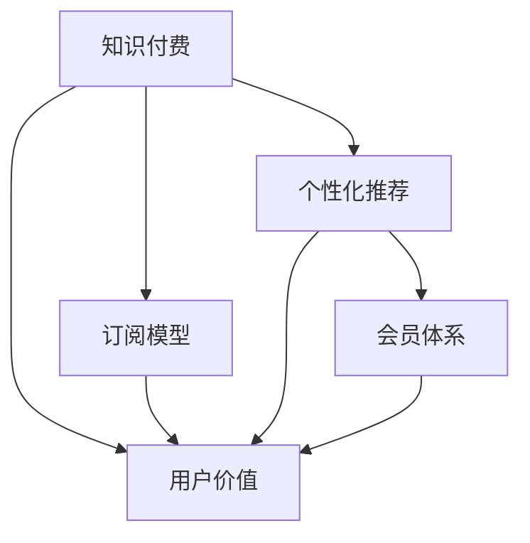

                 

# 知识付费创业的用户价值最大化

> 关键词：知识付费,用户价值,创业,个性化推荐,订阅模型,用户粘性,会员体系

## 1. 背景介绍

### 1.1 问题由来

近年来，知识付费行业迅速发展，用户对于专业知识和技能的渴望日益增长。同时，随着数字内容的不断丰富和在线平台的广泛普及，知识付费创业的门槛也逐渐降低。如何在这个竞争激烈的市场中脱颖而出，实现用户价值最大化，成为众多创业者的主要挑战。

### 1.2 问题核心关键点

知识付费创业的关键在于如何高效匹配内容与需求，提升用户满意度和粘性，从而实现商业化变现。这需要从以下几个方面进行优化：

1. **精准内容推荐**：根据用户兴趣和行为进行个性化推荐，提升内容与用户的匹配度。
2. **会员体系建设**：构建激励用户持续消费的会员体系，提高用户粘性和长期价值。
3. **订阅模型设计**：设计灵活的订阅模型，满足不同用户的需求，实现收入增长。
4. **数据驱动决策**：通过数据分析优化运营策略，提升用户体验和运营效率。

## 2. 核心概念与联系

### 2.1 核心概念概述

为了更好地理解知识付费创业的用户价值最大化，本节将介绍几个密切相关的核心概念：

- **知识付费**：指用户为获取专业知识、技能或信息而支付费用的在线服务模式。
- **用户价值**：指用户从知识付费产品中获得的精神满足和实际利益。
- **订阅模型**：指用户定期支付固定费用，享受持续获取专业内容的服务模式。
- **个性化推荐**：通过用户行为分析，推送符合其兴趣和需求的内容。
- **会员体系**：通过会员等级、特权、积分等机制，激励用户持续消费。

这些核心概念之间的逻辑关系可以通过以下Mermaid流程图来展示：



这个流程图展示了这个领域的核心概念及其之间的关系：

1. 知识付费产品通过订阅模型提供持续内容，用户通过个性化推荐和会员体系获得价值。
2. 个性化推荐和会员体系作为提升用户价值的关键手段，共同作用于订阅模型的用户粘性和长期价值。
3. 用户价值是知识付费产品的核心目标，个性化推荐和会员体系均围绕这一目标进行设计。

## 3. 核心算法原理 & 具体操作步骤
### 3.1 算法原理概述

知识付费创业的核心算法原理是利用数据分析和机器学习技术，实现内容推荐、会员体系和订阅模型的自动化优化。其核心思想是：通过收集用户的行为数据和偏好信息，使用算法推荐最相关的内容，构建激励用户持续消费的会员体系，设计灵活的订阅模型，从而实现用户价值最大化。

### 3.2 算法步骤详解

基于以上核心概念，知识付费创业的算法实现主要包括以下几个关键步骤：

**Step 1: 数据收集与预处理**
- 收集用户注册、登录、浏览、购买、订阅、评价等行为数据。
- 对数据进行清洗和预处理，去除无效数据和噪音，生成用户画像和行为特征向量。

**Step 2: 用户行为分析与建模**
- 使用协同过滤、矩阵分解、深度学习等方法，构建用户兴趣和内容特征的相似度矩阵。
- 对用户行为数据进行建模，生成用户兴趣和内容关联矩阵。

**Step 3: 内容推荐与个性化匹配**
- 基于用户画像和行为特征，使用推荐算法（如协同过滤、基于内容的推荐、混合推荐等），为用户推荐相关内容。
- 根据推荐结果和用户反馈，实时更新推荐模型，提升推荐准确性和用户体验。

**Step 4: 会员体系设计**
- 设计会员等级、积分、特权等机制，激励用户持续消费。
- 通过A/B测试和用户反馈，优化会员体系设计，提升用户粘性和长期价值。

**Step 5: 订阅模型设计**
- 设计灵活的订阅周期、支付方式、折扣策略等，满足不同用户的需求。
- 通过数据分析和用户反馈，优化订阅模型，提高用户转化率和续费率。

### 3.3 算法优缺点

知识付费创业的算法具有以下优点：
1. 数据驱动决策：通过大数据分析，优化内容推荐和运营策略，提升用户体验和运营效率。
2. 个性化推荐：根据用户兴趣和行为进行个性化推荐，提高内容匹配度和用户满意度。
3. 会员体系激励：通过会员等级和积分等机制，激励用户持续消费，提升长期价值。
4. 订阅模型灵活：设计灵活的订阅模型，满足不同用户的需求，提高收入增长。

同时，该算法也存在一定的局限性：
1. 用户隐私问题：收集和分析用户行为数据时，可能涉及隐私保护问题，需确保数据安全。
2. 算法复杂性：个性化推荐和会员体系设计需结合复杂的数据模型和算法，可能导致系统复杂度增加。
3. 算法偏见：推荐算法可能存在数据偏见，导致推荐结果不公允。
4. 用户粘性依赖：过度依赖个性化推荐和会员体系，可能导致用户粘性不足，流失率增加。

尽管存在这些局限性，但就目前而言，数据驱动和个性化推荐的算法仍是知识付费创业的重要范式。未来相关研究的重点在于如何进一步降低算法复杂度，增强推荐公允性，优化会员体系设计，以更好地实现用户价值最大化。

### 3.4 算法应用领域

基于数据驱动和个性化推荐的算法，知识付费创业已在多个领域得到广泛应用，例如：

- **在线教育**：提供专业课程、视频讲座、习题解析等知识服务，实现用户价值最大化。
- **职业培训**：提供职业技能、证书培训、面试指导等专业服务，提升用户职业技能。
- **健康管理**：提供营养知识、健康管理、心理疏导等个性化服务，提高用户生活质量。
- **金融理财**：提供理财知识、投资策略、财富管理等专业服务，帮助用户实现财富增值。
- **娱乐休闲**：提供影视作品、音乐、游戏等娱乐内容，满足用户休闲娱乐需求。

除了上述这些经典领域外，知识付费创业还被创新性地应用到更多场景中，如智能客服、远程办公、生活服务、教育游戏等，为知识付费产品带来新的业务机会。

## 4. 数学模型和公式 & 详细讲解 & 举例说明

### 4.1 数学模型构建

本节将使用数学语言对知识付费创业的推荐算法进行更加严格的刻画。

记用户集合为 $U=\{u_1, u_2, \dots, u_n\}$，内容集合为 $I=\{i_1, i_2, \dots, i_m\}$。用户 $u$ 对内容 $i$ 的评分（评分范围通常为0-5分）为 $r_{ui}$。则用户行为矩阵 $R$ 为：

$$
R = \begin{bmatrix}
    r_{u1i1} & r_{u1i2} & \dots & r_{u1im} \\
    r_{u2i1} & r_{u2i2} & \dots & r_{u2im} \\
    \vdots & \vdots & \ddots & \vdots \\
    r_{uni1} & r_{un_i2} & \dots & r_{unim}
\end{bmatrix}
$$

设用户 $u$ 和内容 $i$ 的特征向量分别为 $\vec{x}_u$ 和 $\vec{y}_i$。则用户行为向量 $x_u$ 为：

$$
x_u = [r_{u1i1}, r_{u1i2}, \dots, r_{u1im}]
$$

内容行为向量 $y_i$ 为：

$$
y_i = [r_{u1i1}, r_{u2i1}, \dots, r_{unim}]
$$

### 4.2 公式推导过程

接下来，我们将推导协同过滤算法中的奇异值分解(SVD)步骤，计算用户与内容的评分预测。

假设用户行为矩阵 $R$ 可以进行奇异值分解（SVD）：

$$
R = U \Sigma V^T
$$

其中 $U$ 和 $V$ 分别为左右奇异矩阵，$\Sigma$ 为奇异值矩阵。设 $U$ 和 $V$ 的前 $k$ 个奇异值和奇异向量分别为 $U_k$ 和 $V_k$，则用户 $u$ 和内容 $i$ 的评分预测为：

$$
\hat{r}_{ui} = \sum_{j=1}^{k} \sigma_j u_{uj} v_{ji}
$$

其中 $\sigma_j$ 为奇异值，$u_{uj}$ 和 $v_{ji}$ 分别为 $U_k$ 和 $V_k$ 的第 $j$ 个奇异向量和奇异值。

### 4.3 案例分析与讲解

假设我们有一个知识付费平台，收集了1000名用户的10万次课程购买记录。我们可以将这1000名用户和10万门课程的评分矩阵 $R$ 表示为100行10列的矩阵，然后使用SVD算法计算用户和课程的特征向量。取前10个奇异值，得到用户行为矩阵 $R$ 的SVD分解：

$$
R = U_k \Sigma_k V_k^T
$$

其中 $U_k$ 和 $V_k$ 分别为100行10列和10行1000列的用户和课程特征向量，$\Sigma_k$ 为10行10列的奇异值矩阵。设 $U_k$ 和 $V_k$ 的前5个奇异值和奇异向量分别为 $U_{5}$ 和 $V_{5}$，则用户 $u$ 和内容 $i$ 的评分预测为：

$$
\hat{r}_{ui} = \sum_{j=1}^{5} \sigma_j u_{uj} v_{ji}
$$

使用训练好的预测模型，我们可以为用户推荐他们可能感兴趣的课程。假设一个用户对一门课程评分未知，我们可以通过模型预测其对这门课程的评分，从而进行推荐。

## 5. 项目实践：代码实例和详细解释说明
### 5.1 开发环境搭建

在进行推荐算法实践前，我们需要准备好开发环境。以下是使用Python进行Scikit-learn和TensorFlow开发的推荐系统环境配置流程：

1. 安装Anaconda：从官网下载并安装Anaconda，用于创建独立的Python环境。

2. 创建并激活虚拟环境：
```bash
conda create -n recommender-env python=3.8 
conda activate recommender-env
```

3. 安装Scikit-learn和TensorFlow：根据CUDA版本，从官网获取对应的安装命令。例如：
```bash
conda install scikit-learn tensorflow -c conda-forge -c pytorch
```

4. 安装相关工具包：
```bash
pip install numpy pandas matplotlib seaborn scipy jupyter notebook
```

完成上述步骤后，即可在`recommender-env`环境中开始推荐系统开发。

### 5.2 源代码详细实现

下面我们以协同过滤算法为例，给出使用Scikit-learn和TensorFlow进行用户行为分析的PyTorch代码实现。

首先，定义用户行为矩阵和特征矩阵：

```python
import numpy as np
from scipy.sparse import csr_matrix

# 假设收集了1000名用户的10万次课程购买记录
R = np.random.randint(0, 6, size=(100, 10000))  # 0-5分的评分
U = np.random.randn(100, 10)  # 用户特征向量
V = np.random.randn(10000, 10)  # 内容特征向量

# 将评分矩阵转换为稀疏矩阵
R_sparse = csr_matrix(R)
```

然后，进行奇异值分解：

```python
from scipy.linalg import svd

# 对评分矩阵进行奇异值分解
U_k, s, V_k = svd(R_sparse, k=10)
```

最后，计算用户行为预测：

```python
# 取前5个奇异值和奇异向量
U_5 = U_k[:, :5]
V_5 = V_k[:5, :]

# 计算评分预测
predicted_scores = np.dot(U_5, np.dot(s[:5], V_5))
```

### 5.3 代码解读与分析

让我们再详细解读一下关键代码的实现细节：

**奇异值分解**：
- `scipy.linalg.svd`函数实现了奇异值分解。
- 对评分矩阵进行奇异值分解，得到用户特征向量 $U_k$、奇异值矩阵 $\Sigma_k$ 和内容特征向量 $V_k$。
- 取前5个奇异值和奇异向量，用于后续评分预测。

**评分预测**：
- 计算用户 $u$ 和内容 $i$ 的评分预测，得到 $\hat{r}_{ui}$。
- 使用训练好的预测模型，为用户推荐他们可能感兴趣的课程。

## 6. 实际应用场景
### 6.1 在线教育

基于协同过滤算法的推荐系统，可以广泛应用于在线教育平台的内容推荐。传统的教育内容推荐主要依赖人工策划，无法快速适应用户需求的变化。而使用推荐系统，根据用户的学习历史、评价和反馈，自动为用户推荐最相关的内容，可以显著提高学习效率和满意度。

在技术实现上，可以收集用户的学习路径、课程评价、习题提交等信息，使用协同过滤算法计算用户行为特征，生成推荐列表。推荐系统还可以根据用户的偏好和反馈，实时调整推荐策略，提升推荐效果。如此构建的在线教育平台，能更好地满足用户个性化学习需求，实现更好的教学效果。

### 6.2 职业培训

在职业培训领域，推荐系统可以帮助用户快速找到适合自己的技能培训课程。传统培训课程通常由机构单方面设定，缺乏个性化推荐机制。而使用推荐系统，根据用户的职业背景、技能需求和评价反馈，动态生成个性化推荐列表，可以显著提升培训效果和用户满意度。

在技术实现上，可以收集用户的职业背景、技能测试、培训评价等信息，构建用户和课程的评分矩阵，使用协同过滤算法计算用户行为特征。推荐系统还可以结合深度学习模型，进行多模态特征融合，提升推荐效果。如此构建的职业培训平台，能更好地满足用户个性化培训需求，提升职业技能。

### 6.3 健康管理

在健康管理领域，推荐系统可以帮助用户找到最适合自己的健康管理方案。传统的健康管理服务往往缺乏个性化推荐机制，无法有效提升用户的健康管理效果。而使用推荐系统，根据用户的健康数据、生活习惯和评价反馈，动态生成个性化健康方案，可以显著提升用户的健康管理效果和生活质量。

在技术实现上，可以收集用户的健康数据、生活习惯、健康评价等信息，构建用户和健康方案的评分矩阵，使用协同过滤算法计算用户行为特征。推荐系统还可以结合深度学习模型，进行多模态特征融合，提升推荐效果。如此构建的健康管理平台，能更好地满足用户个性化健康需求，提升生活质量。

### 6.4 未来应用展望

随着推荐算法的不断发展，基于协同过滤的用户价值最大化将在更多领域得到应用，为传统行业带来变革性影响。

在智能医疗领域，基于协同过滤的个性化推荐系统可以推荐最适合用户健康管理的方案，提升用户健康管理效果和生活质量。

在智能金融领域，基于协同过滤的个性化推荐系统可以推荐最适合用户理财投资的方案，提升用户理财效果和满意度。

在智能家居领域，基于协同过滤的个性化推荐系统可以推荐最适合用户家居管理的方案，提升用户家居管理效果和舒适度。

此外，在教育、娱乐、旅游等众多领域，基于协同过滤的推荐系统也将不断涌现，为各行业带来新的业务机会。相信随着算法的不断演进和应用场景的拓展，推荐系统将在更多领域大放异彩，成为用户价值最大化的重要工具。

## 7. 工具和资源推荐
### 7.1 学习资源推荐

为了帮助开发者系统掌握推荐算法的理论基础和实践技巧，这里推荐一些优质的学习资源：

1. 《推荐系统实战》系列博文：由推荐算法专家撰写，深入浅出地介绍了推荐系统原理和实现方法，包含协同过滤、矩阵分解、深度学习等经典算法。

2. CS229《机器学习》课程：斯坦福大学开设的机器学习明星课程，涵盖推荐系统、协同过滤、深度学习等前沿内容。

3. 《推荐系统》书籍：Introduction to Recommendation Systems by Andrei Brodsky，全面介绍了推荐系统理论和算法，适合进阶学习。

4. Scikit-learn官方文档：Scikit-learn机器学习库的官方文档，提供了丰富的推荐系统样例和算法实现。

5. TensorFlow推荐系统工具库：TensorFlow提供的推荐系统工具库，支持协同过滤、矩阵分解等经典算法，易于实现。

通过对这些资源的学习实践，相信你一定能够快速掌握推荐算法的精髓，并用于解决实际的推荐问题。

### 7.2 开发工具推荐

高效的开发离不开优秀的工具支持。以下是几款用于推荐系统开发的常用工具：

1. Scikit-learn：基于Python的机器学习库，提供了丰富的推荐系统算法和工具，易于上手实现。

2. TensorFlow：由Google主导开发的开源深度学习框架，生产部署方便，支持推荐系统的深度学习实现。

3. Hadoop/Spark：大数据处理框架，支持大规模数据存储和计算，适合推荐系统的大数据应用。

4. Jupyter Notebook：数据科学和机器学习社区常用的交互式开发环境，支持代码编写、数据可视化、模型评估等功能。

5. PyTorch：基于Python的深度学习框架，灵活高效，支持推荐系统的深度学习实现。

合理利用这些工具，可以显著提升推荐系统的开发效率，加快创新迭代的步伐。

### 7.3 相关论文推荐

推荐系统的研究源于学界的持续研究。以下是几篇奠基性的相关论文，推荐阅读：

1. 《Collaborative Filtering for Implicit Feedback Datasets》：提出了基于隐式反馈的协同过滤算法，适合处理用户行为数据。

2. 《Trustworthy Recommendations via Implicit Feedback》：讨论了隐式反馈推荐系统的鲁棒性问题，提出了改进算法。

3. 《Music Recommendation Systems》：介绍了音乐推荐系统的经典算法和实现方法，适合推荐系统领域的学习。

4. 《Deep Collaborative Filtering》：提出深度协同过滤算法，结合深度学习模型，提升推荐效果。

5. 《Large Scale Collaborative Filtering》：讨论了大数据环境下的推荐系统设计，适合大规模推荐系统的学习。

这些论文代表了大语言模型微调技术的发展脉络。通过学习这些前沿成果，可以帮助研究者把握学科前进方向，激发更多的创新灵感。

## 8. 总结：未来发展趋势与挑战
### 8.1 总结

本文对基于协同过滤的知识付费创业推荐系统进行了全面系统的介绍。首先阐述了知识付费创业的背景和意义，明确了推荐系统作为核心算法的关键作用。其次，从原理到实践，详细讲解了协同过滤算法的数学原理和关键步骤，给出了推荐系统开发的完整代码实例。同时，本文还广泛探讨了推荐系统在在线教育、职业培训、健康管理等多个行业领域的应用前景，展示了协同过滤算法的广泛适用性和强大潜力。

通过本文的系统梳理，可以看到，基于协同过滤的推荐系统正在成为知识付费创业的重要范式，极大地拓展了推荐算法的应用边界，催生了更多的落地场景。得益于大数据分析和机器学习技术，推荐系统在提升用户满意度和粘性方面具有独特的优势。未来，伴随算法模型的不断进步和应用场景的拓展，推荐系统必将在更多领域大放异彩，深刻影响用户行为和商业模式。

### 8.2 未来发展趋势

展望未来，协同过滤推荐系统的发展趋势将呈现以下几个方向：

1. 数据融合与多模态推荐：结合多源异构数据，进行多模态特征融合，提升推荐效果和个性化程度。
2. 深度学习与强化学习：结合深度学习和强化学习技术，提升推荐模型的表达能力和自适应性。
3. 分布式推荐系统：在大数据环境下，采用分布式计算框架，实现推荐系统的并行化和高效化。
4. 用户动态行为建模：结合时序分析和动态行为建模，提升推荐系统的实时性和个性化程度。
5. 冷启动推荐：针对新用户和新内容，设计有效的冷启动推荐策略，缩短推荐系统的收敛时间。

以上趋势凸显了协同过滤推荐系统的广阔前景。这些方向的探索发展，必将进一步提升推荐系统的性能和应用范围，为知识付费创业带来新的突破。

### 8.3 面临的挑战

尽管协同过滤推荐系统已经取得了瞩目成就，但在迈向更加智能化、普适化应用的过程中，它仍面临着诸多挑战：

1. 数据稀疏性问题：用户行为数据往往存在较大的稀疏性，导致协同过滤算法难以处理。需要设计有效的数据补全策略，提升推荐效果。
2. 算法复杂性问题：协同过滤算法涉及复杂的数学模型和算法实现，可能导致系统复杂度增加。需要简化算法，提升系统的可扩展性和可维护性。
3. 用户隐私问题：收集和分析用户行为数据时，可能涉及隐私保护问题，需确保数据安全。
4. 鲁棒性问题：推荐算法可能存在数据偏见，导致推荐结果不公允。需设计鲁棒性算法，提升推荐公允性。
5. 实时性问题：推荐系统需要实时响应用户行为，提升系统响应速度和实时性。需设计高效的推荐算法和数据处理策略。

尽管存在这些挑战，但就目前而言，协同过滤推荐系统仍是知识付费创业的重要范式。未来相关研究的重点在于如何进一步降低算法复杂度，增强推荐公允性，提升系统响应速度，以更好地实现用户价值最大化。

### 8.4 研究展望

面对协同过滤推荐系统所面临的种种挑战，未来的研究需要在以下几个方面寻求新的突破：

1. 探索无监督和半监督推荐方法。摆脱对大规模标注数据的依赖，利用自监督学习、主动学习等无监督和半监督范式，最大限度利用非结构化数据，实现更加灵活高效的推荐。
2. 研究参数高效和计算高效的推荐范式。开发更加参数高效的推荐方法，在固定大部分推荐参数的情况下，只更新极少量的用户行为参数。同时优化推荐模型的计算图，减少前向传播和反向传播的资源消耗，实现更加轻量级、实时性的部署。
3. 融合因果和对比学习范式。通过引入因果推断和对比学习思想，增强推荐模型建立稳定因果关系的能力，学习更加普适、鲁棒的用户行为表征，从而提升推荐泛化性和抗干扰能力。
4. 纳入伦理道德约束。在推荐目标中引入伦理导向的评估指标，过滤和惩罚有偏见、有害的输出倾向。同时加强人工干预和审核，建立推荐模型的监管机制，确保输出的安全性。

这些研究方向的探索，必将引领协同过滤推荐系统迈向更高的台阶，为知识付费创业带来新的创新。面向未来，协同过滤推荐系统需要与其他人工智能技术进行更深入的融合，如知识表示、因果推理、强化学习等，多路径协同发力，共同推动推荐系统的进步。

## 9. 附录：常见问题与解答

**Q1：如何设计有效的推荐算法？**

A: 设计有效的推荐算法需要考虑以下几个方面：
1. 数据收集：收集用户行为数据，包括浏览历史、购买记录、评价反馈等。
2. 数据预处理：对数据进行清洗和预处理，去除无效数据和噪音，生成用户画像和行为特征向量。
3. 算法选择：根据任务需求和数据特点，选择合适的推荐算法，如协同过滤、矩阵分解、深度学习等。
4. 模型训练：使用训练集数据训练推荐模型，计算用户和内容的评分预测。
5. 模型评估：在测试集上评估推荐效果，根据评估指标调整模型参数和算法策略。

**Q2：推荐算法如何处理冷启动问题？**

A: 冷启动问题是指新用户或新物品没有足够的历史行为数据，导致难以进行有效推荐。推荐算法通常通过以下方法处理冷启动问题：
1. 初始化策略：使用随机初始化、基于用户画像的初始化等方法，对新用户和新物品进行初始推荐。
2. 用户画像：根据新用户的个人资料、兴趣标签等初始化用户画像，进行推荐。
3. 物品画像：根据新物品的类别、属性等初始化物品画像，进行推荐。
4. 协同过滤：利用相似用户的推荐结果，进行跨用户推荐。
5. 深度学习：利用深度神经网络模型，对新用户和新物品进行深度特征学习，提升推荐效果。

**Q3：推荐算法如何处理数据稀疏性问题？**

A: 推荐算法通常通过以下方法处理数据稀疏性问题：
1. 数据补全：使用均值填补、插值填补、矩阵分解等方法，填补缺失行为数据，提升数据的完整性。
2. 样本采样：使用随机采样、负采样等方法，平衡样本分布，提升推荐效果。
3. 数据降维：使用奇异值分解、主成分分析等方法，降维处理高维数据，提升算法效率。
4. 模型融合：结合多个推荐模型，进行加权融合，提升推荐效果和鲁棒性。
5. 混合算法：结合协同过滤和基于内容的推荐算法，提升推荐效果和鲁棒性。

**Q4：推荐算法如何提升推荐公允性？**

A: 推荐算法通常通过以下方法提升推荐公允性：
1. 公平性评估：使用公平性指标，如Gini系数、Equalized Odds等，评估推荐模型的公允性。
2. 去偏方法：使用去偏技术，如Counterfactual Fairness、Fair Learning等，消除数据偏差，提升推荐公允性。
3. 数据平衡：使用数据平衡技术，如Resampling、Boosting等，平衡不同类别的数据分布，提升推荐公允性。
4. 算法改进：使用鲁棒性算法，如Robust PCA、Robust SVD等，提升推荐模型的鲁棒性，减少偏差影响。
5. 人工干预：使用人工干预和审核机制，纠正推荐模型的偏差和错误，提升推荐公允性。

这些建议和答案帮助回答了知识付费创业推荐系统中的常见问题，希望能为你提供有用的参考和指导。通过不断学习和实践，相信你一定能够在推荐系统领域取得新的突破和成就。

---

作者：禅与计算机程序设计艺术 / Zen and the Art of Computer Programming

