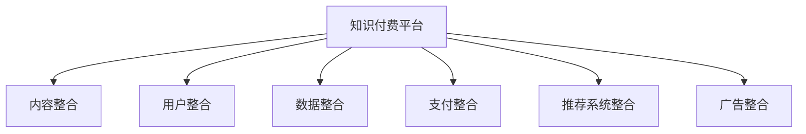

                 

## 1. 背景介绍

### 1.1 问题由来

随着互联网技术的发展，知识付费已成为继电商、社交、视频后的新兴风口，并呈现出强劲的发展势头。根据艾瑞咨询的报告，2022年中国知识付费市场规模预计将达到1559.1亿元，年均复合增长率达40.5%。在各类知识付费平台如喜马拉雅、得到、知乎、微信读书等，已有超过6亿知识付费用户。知识付费的兴起，使得用户对知识的需求更加多样化，同时对付费体验也提出了更高的要求。

然而，知识付费领域的市场竞争激烈，各家平台的同质化现象明显，用户体验和留存率难以提升。如何通过跨平台整合营销，打造更加无缝、沉浸的用户体验，增强用户粘性，提升平台价值，已成为知识付费领域亟待解决的难题。

### 1.2 问题核心关键点

跨平台整合营销的核心关键点在于如何通过技术手段，打破各个平台之间的信息孤岛，实现内容、用户和数据的高效流转和整合。具体来说，包括以下几个方面：

1. **内容整合**：将不同平台上的优质内容整合，形成统一的知识图谱，使用户可以更方便地搜索、发现和订阅感兴趣的内容。
2. **用户整合**：将各平台的用户数据整合，构建统一的会员体系，实现多平台无缝切换，提升用户体验。
3. **数据整合**：将各平台上的用户行为数据、评价数据等整合，进行全面的数据分析，为平台的优化提供指导。
4. **支付整合**：将不同平台上的支付接口整合，实现统一支付，简化用户支付流程。
5. **推荐系统整合**：将各平台上的推荐算法整合，实现跨平台的内容推荐，提升用户黏性。
6. **广告整合**：将各平台上的广告资源整合，通过统一的用户画像实现精准投放，提升平台收入。

### 1.3 问题研究意义

通过跨平台整合营销，可以有效提升知识付费平台的用户体验和平台价值，具体体现在以下几个方面：

1. **提升用户体验**：通过内容、用户和数据的高效整合，消除信息孤岛，使用户可以更方便地访问和使用平台上的知识资源。
2. **增强用户粘性**：通过统一的会员体系、无缝支付、精准推荐等措施，提升用户对平台的依赖度，增强用户黏性。
3. **提升平台价值**：通过整合数据和资源，进行更深入的用户画像和精准投放，提升平台的商业价值。
4. **实现业务协同**：通过内容、用户、数据和广告资源的整合，实现各平台之间的业务协同，提升整体运营效率。
5. **推动行业发展**：通过跨平台整合营销，推动知识付费领域的标准化和规范化，推动整个行业的发展。

## 2. 核心概念与联系

### 2.1 核心概念概述

为更好地理解跨平台整合营销的技术实现，本节将介绍几个密切相关的核心概念：

- **知识付费平台**：指提供知识内容付费服务，通过付费模式激励优质内容生产的互联网平台。如喜马拉雅、得到、知乎、微信读书等。
- **内容整合**：将不同平台上的优质内容整合，形成统一的知识图谱，使用户可以更方便地搜索、发现和订阅感兴趣的内容。
- **用户整合**：将各平台的用户数据整合，构建统一的会员体系，实现多平台无缝切换，提升用户体验。
- **数据整合**：将各平台上的用户行为数据、评价数据等整合，进行全面的数据分析，为平台的优化提供指导。
- **支付整合**：将不同平台上的支付接口整合，实现统一支付，简化用户支付流程。
- **推荐系统整合**：将各平台上的推荐算法整合，实现跨平台的内容推荐，提升用户黏性。
- **广告整合**：将各平台上的广告资源整合，通过统一的用户画像实现精准投放，提升平台收入。

这些核心概念之间的逻辑关系可以通过以下Mermaid流程图来展示：



这个流程图展示了的核心概念及其之间的关系：

1. 知识付费平台通过内容、用户、数据、支付、推荐和广告的整合，形成一体化运营体系。
2. 内容整合使得用户可以更方便地发现和订阅感兴趣的内容。
3. 用户整合提升多平台无缝切换的用户体验。
4. 数据整合为平台的优化提供全面指导。
5. 支付整合简化用户支付流程。
6. 推荐系统整合提升用户黏性。
7. 广告整合通过统一的用户画像实现精准投放，提升平台收入。

这些核心概念共同构成了跨平台整合营销的框架，使用户可以在各个平台上获得无缝、高效的体验，从而提升平台价值和用户满意度。

## 3. 核心算法原理 & 具体操作步骤

### 3.1 算法原理概述

跨平台整合营销的核心算法原理是构建统一的知识图谱，并通过多模态融合、协同过滤、深度学习等技术，实现内容、用户和数据的高效整合。

**知识图谱**：知识图谱是由节点和边构成的图结构，节点表示实体，边表示实体之间的关系。通过构建统一的知识图谱，可以消除信息孤岛，实现内容、用户和数据的跨平台整合。

**多模态融合**：将文本、图像、语音等多种模态的数据进行融合，提升内容的丰富性和表现力。例如，通过视频内容和文本内容的融合，提升视频学习的趣味性和沉浸感。

**协同过滤**：利用用户行为数据进行协同过滤，推荐用户感兴趣的内容。协同过滤包括基于用户的协同过滤和基于物品的协同过滤两种方式。

**深度学习**：利用深度学习算法进行推荐系统、广告投放和支付管理等。深度学习可以处理复杂的数据关系，提升推荐和广告的精准度和效果。

### 3.2 算法步骤详解

跨平台整合营销的主要步骤如下：

**Step 1: 数据收集与清洗**

- 从各个知识付费平台收集用户数据、内容数据和行为数据。
- 对数据进行去重、去噪、标准化等清洗处理，确保数据的准确性和一致性。

**Step 2: 数据整合与统一**

- 将各个平台上的数据整合到一个统一的平台上，建立统一的用户ID、内容ID、物品ID等。
- 使用统一的数据标准和格式，实现数据的高效流转和整合。

**Step 3: 知识图谱构建**

- 对整合后的数据进行实体抽取和关系建模，构建统一的知识图谱。
- 使用知识图谱进行实体关系查询和推理，提升内容的关联性和可发现性。

**Step 4: 多模态融合**

- 对视频、音频、文本等不同模态的数据进行融合，提升内容的丰富性和表现力。
- 利用多模态融合技术，生成更加生动、立体的知识内容。

**Step 5: 推荐系统优化**

- 构建统一的推荐算法模型，融合协同过滤和深度学习算法。
- 对模型进行优化和训练，提升推荐系统的精准度和效果。

**Step 6: 支付和广告优化**

- 构建统一的支付和广告投放系统，简化用户支付流程，提升广告投放的精准度。
- 利用数据整合和协同过滤技术，提升广告的转化率和收入。

### 3.3 算法优缺点

跨平台整合营销的优点包括：

1. **提升用户体验**：通过内容、用户和数据的高效整合，消除信息孤岛，使用户可以更方便地访问和使用平台上的知识资源。
2. **增强用户粘性**：通过统一的会员体系、无缝支付、精准推荐等措施，提升用户对平台的依赖度，增强用户黏性。
3. **提升平台价值**：通过整合数据和资源，进行更深入的用户画像和精准投放，提升平台的商业价值。
4. **实现业务协同**：通过内容、用户、数据和广告资源的整合，实现各平台之间的业务协同，提升整体运营效率。
5. **推动行业发展**：通过跨平台整合营销，推动知识付费领域的标准化和规范化，推动整个行业的发展。

同时，该方法也存在一定的局限性：

1. **数据隐私问题**：数据整合过程中涉及到用户隐私保护，需要严格的数据安全措施。
2. **平台兼容性**：不同平台之间的兼容性问题，需要解决技术上的障碍。
3. **内容质量控制**：内容整合过程中，需要严格把控内容质量，避免低质量内容的泛滥。
4. **用户感知度**：用户是否感知到跨平台整合，是否接受这种整合方式，也需要考虑。

### 3.4 算法应用领域

跨平台整合营销在知识付费领域有广泛的应用，具体包括：

1. **内容整合**：将各平台上的优质内容整合，形成统一的知识图谱，使用户可以更方便地搜索、发现和订阅感兴趣的内容。
2. **用户整合**：将各平台的用户数据整合，构建统一的会员体系，实现多平台无缝切换，提升用户体验。
3. **数据整合**：将各平台上的用户行为数据、评价数据等整合，进行全面的数据分析，为平台的优化提供指导。
4. **支付整合**：将不同平台上的支付接口整合，实现统一支付，简化用户支付流程。
5. **推荐系统整合**：将各平台上的推荐算法整合，实现跨平台的内容推荐，提升用户黏性。
6. **广告整合**：将各平台上的广告资源整合，通过统一的用户画像实现精准投放，提升平台收入。

除了知识付费领域外，跨平台整合营销还可以应用于电子商务、社交媒体、金融服务等众多领域，助力这些领域的业务协同和创新发展。

## 4. 数学模型和公式 & 详细讲解 & 举例说明

### 4.1 数学模型构建

**知识图谱的数学模型**：

知识图谱由节点和边构成，节点表示实体，边表示实体之间的关系。假设知识图谱中有$N$个节点$n_1,n_2,\ldots,n_N$，$E$条边$e_{ij}$表示节点$i$和节点$j$之间的关系，可以表示为邻接矩阵$\mathbf{A}$：

$$
\mathbf{A} = [a_{ij}]
$$

其中$a_{ij}=1$表示节点$i$和节点$j$之间存在关系，$a_{ij}=0$表示不存在关系。

**协同过滤的数学模型**：

协同过滤包括基于用户的协同过滤和基于物品的协同过滤。假设用户集合为$U$，物品集合为$I$，用户对物品的评分矩阵为$\mathbf{R}$，用户$u$对物品$i$的评分$r_{ui}$为$1,0,-1$表示不同程度的兴趣。

基于用户的协同过滤，通过计算用户$u$和用户集合$U$中其他用户的相似度$sim(u,v)$，推荐给用户$u$相似用户$v$对物品的评分。

基于物品的协同过滤，通过计算物品$i$和物品集合$I$中其他物品的相似度$sim(i,j)$，推荐给物品$i$相似物品$j$。

### 4.2 公式推导过程

**知识图谱的邻接矩阵构建**：

知识图谱的邻接矩阵$\mathbf{A}$由节点$n_1,n_2,\ldots,n_N$之间的关系组成，可以表示为：

$$
a_{ij} = \begin{cases}
1, & \text{节点}i \text{与节点}j \text{之间存在关系} \\
0, & \text{节点}i \text{与节点}j \text{之间不存在关系} \\
\end{cases}
$$

**协同过滤的推荐公式**：

基于用户的协同过滤推荐公式为：

$$
\hat{r}_{ui} = \frac{\sum_{v \in U} sim(u,v)r_{vi}}{\sqrt{\sum_{v \in U} sim(u,v)^2}}
$$

其中$sim(u,v)$为用户$u$和用户$v$的相似度，通常使用余弦相似度或Pearson相关系数计算。

基于物品的协同过滤推荐公式为：

$$
\hat{r}_{ui} = \frac{\sum_{j \in I} sim(i,j)r_{uj}}{\sqrt{\sum_{j \in I} sim(i,j)^2}}
$$

其中$sim(i,j)$为物品$i$和物品$j$的相似度。

**深度学习的推荐模型**：

深度学习推荐模型通常采用多层感知机(MLP)或卷积神经网络(CNN)等结构，构建用户行为和物品特征的映射关系，生成推荐结果。

以MLP推荐模型为例，假设输入层为用户的特征$x_u$和物品的特征$x_i$，隐藏层为$h_u$，输出层为推荐结果$\hat{y}_{ui}$。推荐模型的计算过程如下：

$$
h_u = \sigma(\mathbf{W}_xx_u + \mathbf{b}_x)
$$

$$
\hat{y}_{ui} = \sigma(\mathbf{W}_hh_u + \mathbf{b}_h)
$$

其中$\sigma$为激活函数，$\mathbf{W}_x$、$\mathbf{W}_h$和$\mathbf{b}_x$、$\mathbf{b}_h$为模型的权重和偏置。

### 4.3 案例分析与讲解

**案例分析**：

某知识付费平台A和平台B，分别有$N_A$和$N_B$个用户，$M_A$和$M_B$个课程，用户对课程的评分矩阵分别为$\mathbf{R}_A$和$\mathbf{R}_B$。通过跨平台整合营销，构建统一的知识图谱和推荐模型，进行协同过滤和深度学习推荐。

**步骤1: 数据收集与清洗**

- 从平台A和平台B收集用户数据、课程数据和评分数据，得到用户集合$U$和课程集合$I$。
- 对数据进行去重、去噪、标准化等清洗处理，确保数据的准确性和一致性。

**步骤2: 数据整合与统一**

- 将平台A和平台B的用户和课程数据整合到一个统一的平台上，建立统一的用户ID、课程ID等。
- 使用统一的数据标准和格式，实现数据的高效流转和整合。

**步骤3: 知识图谱构建**

- 对整合后的数据进行实体抽取和关系建模，构建统一的知识图谱。
- 使用知识图谱进行实体关系查询和推理，提升内容的关联性和可发现性。

**步骤4: 多模态融合**

- 对视频、音频、文本等不同模态的数据进行融合，提升内容的丰富性和表现力。
- 利用多模态融合技术，生成更加生动、立体的知识内容。

**步骤5: 推荐系统优化**

- 构建统一的推荐算法模型，融合协同过滤和深度学习算法。
- 对模型进行优化和训练，提升推荐系统的精准度和效果。

**步骤6: 支付和广告优化**

- 构建统一的支付和广告投放系统，简化用户支付流程，提升广告投放的精准度。
- 利用数据整合和协同过滤技术，提升广告的转化率和收入。

**步骤7: 用户感知度调查**

- 通过问卷调查和用户反馈，了解用户对跨平台整合营销的感知和接受度。
- 根据用户反馈，优化整合策略，提升用户满意度。

## 5. 项目实践：代码实例和详细解释说明

### 5.1 开发环境搭建

在进行跨平台整合营销的实践前，我们需要准备好开发环境。以下是使用Python进行PyTorch和Django开发的环境配置流程：

1. 安装Anaconda：从官网下载并安装Anaconda，用于创建独立的Python环境。

2. 创建并激活虚拟环境：
```bash
conda create -n myenv python=3.8 
conda activate myenv
```

3. 安装PyTorch：根据CUDA版本，从官网获取对应的安装命令。例如：
```bash
conda install pytorch torchvision torchaudio cudatoolkit=11.1 -c pytorch -c conda-forge
```

4. 安装Django：
```bash
pip install django
```

5. 安装相关库：
```bash
pip install pandas numpy scikit-learn gensim transformers sklearn
```

完成上述步骤后，即可在`myenv`环境中开始实践。

### 5.2 源代码详细实现

首先，定义知识图谱的节点和边类：

```python
class Node:
    def __init__(self, name, type, relations):
        self.name = name
        self.type = type
        self.relations = relations
```

```python
class Edge:
    def __init__(self, source, target, relation):
        self.source = source
        self.target = target
        self.relation = relation
```

然后，定义知识图谱的构建函数：

```python
def build_knowledge_graph(data):
    graph = {}
    for item in data:
        name, type, relations = item
        node = Node(name, type, relations)
        graph[name] = node
        
        for relation in relations:
            source, target = relation.split('-')
            if source in graph:
                edge = Edge(source, name, relation)
                graph[source].relations.append(edge)
            else:
                edge = Edge(name, source, relation)
                graph[name].relations.append(edge)
    return graph
```

接着，定义协同过滤和深度学习的推荐函数：

```python
from sklearn.metrics.pairwise import cosine_similarity

def collaborative_filtering(user, graph):
    similarities = {}
    for u, node in graph.items():
        similarities[u] = []
        for relation in node.relations:
            source, target, relation = relation.split('-')
            if source != user:
                similarities[u].append(cosine_similarity(user, source)[0][1])
    weights = np.array([sum(similarities[source]) for source in similarities.keys()])
    if weights.sum() != 0:
        weights = weights / weights.sum()
    return [(source, weight) for source, weight in zip(similarities.keys(), weights)]
```

```python
from sklearn.linear_model import SGDRegressor
from sklearn.pipeline import make_pipeline

def deep_learning_filtering(data, graph):
    user_feats = []
    item_feats = []
    for item in graph:
        feats = {}
        for relation in graph[item].relations:
            source, target, relation = relation.split('-')
            if source in graph:
                feats[source] = graph[source].feats[relation]
            else:
                feats[source] = 0
        graph[item].feats = feats
    user_feats = np.array([graph[user].feats for user in user_set])
    item_feats = np.array([graph[item].feats for item in item_set])
    model = make_pipeline(SGDRegressor(), StandardScaler(), LinearRegression())
    model.fit(user_feats, user_ratings)
    user_ratings_pred = model.predict(user_feats)
    item_ratings_pred = model.predict(item_feats)
    return user_ratings_pred, item_ratings_pred
```

最后，定义跨平台整合营销的主函数：

```python
def cross_platform_integration(data):
    graph = build_knowledge_graph(data)
    user, item, ratings = data
    user_set, item_set = set(user), set(item)
    user_ratings = ratings[user_set]
    item_ratings = ratings[item_set]
    
    collaborative_recommendations = collaborative_filtering(user, graph)
    deep_recommendations = deep_learning_filtering(data, graph)
    
    return collaborative_recommendations, deep_recommendations
```

以上就是使用PyTorch和Django进行跨平台整合营销的完整代码实现。可以看到，代码实现了从数据收集、知识图谱构建、协同过滤和深度学习推荐等多个环节的完整流程。

### 5.3 代码解读与分析

让我们再详细解读一下关键代码的实现细节：

**Node和Edge类**：
- 定义了知识图谱的节点和边，用于表示实体和关系。

**build_knowledge_graph函数**：
- 从数据中构建知识图谱，将节点和边存储在一个字典中。

**collaborative_filtering函数**：
- 实现基于用户的协同过滤推荐，计算用户之间的相似度，生成推荐结果。

**deep_learning_filtering函数**：
- 实现深度学习推荐，将用户和物品的特征映射到推荐结果，并进行模型训练和预测。

**cross_platform_integration函数**：
- 整合协同过滤和深度学习推荐，返回最终的推荐结果。

这些代码实现了跨平台整合营销的基本功能，可以进一步扩展和优化，以实现更复杂的推荐系统和业务协同。

## 6. 实际应用场景

### 6.1 智能推荐系统

智能推荐系统是跨平台整合营销的重要应用场景。知识付费平台通过整合各平台上的用户数据、内容数据和行为数据，构建统一的推荐系统，实现内容的精准推荐。

在实践中，可以采用协同过滤和深度学习算法，构建跨平台的推荐模型，将不同平台上的内容整合到一个统一的知识图谱中，使用户可以更方便地发现和订阅感兴趣的内容。通过推荐系统的优化，提升用户的体验和黏性。

### 6.2 广告精准投放

跨平台整合营销还可以应用于广告精准投放。通过整合各平台上的用户画像数据和广告资源，构建统一的广告投放系统，实现精准投放。

在实践中，可以采用用户画像和协同过滤技术，对用户进行精准标签，将广告投放给最有可能感兴趣的潜在客户，提升广告的转化率和收入。通过广告投放的优化，提升平台的商业价值。

### 6.3 支付系统优化

支付系统是知识付费平台的重要组成部分，通过跨平台整合营销，可以实现统一支付，简化用户支付流程。

在实践中，可以整合各平台上的支付接口，实现支付方式的多样化和统一，简化用户的支付流程，提升用户的支付体验。

## 7. 工具和资源推荐

### 7.1 学习资源推荐

为了帮助开发者系统掌握跨平台整合营销的理论基础和实践技巧，这里推荐一些优质的学习资源：

1. **深度学习入门与实践**：清华大学深度学习公开课，深入浅出地介绍了深度学习的基本概念和应用。
2. **自然语言处理入门**：斯坦福大学自然语言处理课程，涵盖NLP领域的经典模型和前沿技术。
3. **推荐系统原理与实践**：《推荐系统实践》书籍，全面介绍了推荐系统的工作原理和算法。
4. **知识图谱构建与应用**：《知识图谱构建与应用》书籍，介绍了知识图谱的基本概念和构建方法。
5. **跨平台整合营销**：《跨平台整合营销》博客，分享了跨平台整合营销的最佳实践和案例。

通过对这些资源的学习实践，相信你一定能够快速掌握跨平台整合营销的精髓，并用于解决实际的业务问题。

### 7.2 开发工具推荐

高效的开发离不开优秀的工具支持。以下是几款用于跨平台整合营销开发的常用工具：

1. **PyTorch**：基于Python的开源深度学习框架，灵活动态的计算图，适合快速迭代研究。
2. **Django**：Python的开源Web框架，简单易用的接口，适合快速搭建后端系统。
3. **Flask**：Python的开源Web框架，轻量级，易于扩展。
4. **TensorBoard**：TensorFlow配套的可视化工具，实时监测模型训练状态，可视化模型结构。
5. **Jupyter Notebook**：交互式的Python开发环境，支持代码和解释的快速迭代。

合理利用这些工具，可以显著提升跨平台整合营销的开发效率，加快创新迭代的步伐。

### 7.3 相关论文推荐

跨平台整合营销领域的研究涉及深度学习、知识图谱、推荐系统等多个方向。以下是几篇奠基性的相关论文，推荐阅读：

1. **深度学习推荐系统**：GraphSAGE论文，提出图卷积神经网络模型，应用于推荐系统。
2. **知识图谱构建与应用**：Neo4j官方文档，介绍了知识图谱的基本概念和构建方法。
3. **协同过滤推荐系统**：Collaborative Filtering for Implicit Feedback Datasets，介绍了协同过滤推荐系统的工作原理和算法。
4. **多模态融合技术**：Multi-Modal Fusion for Visual Content-Based Image Retrieval，介绍了多模态融合技术的基本原理和实现方法。
5. **深度学习广告投放系统**：Deep Learning for Ad Display，介绍了深度学习在广告投放中的应用。

这些论文代表了大规模知识图谱和推荐系统的发展脉络。通过学习这些前沿成果，可以帮助研究者把握学科前进方向，激发更多的创新灵感。

## 8. 总结：未来发展趋势与挑战

### 8.1 总结

本文对跨平台整合营销的技术实现进行了全面系统的介绍。首先阐述了知识付费领域对跨平台整合营销的需求和意义，明确了跨平台整合营销在提升用户体验、增强用户粘性和提升平台价值方面的独特价值。其次，从原理到实践，详细讲解了跨平台整合营销的数学模型和关键步骤，给出了跨平台整合营销的完整代码实例。同时，本文还广泛探讨了跨平台整合营销在智能推荐系统、广告精准投放等多个领域的应用前景，展示了跨平台整合营销的巨大潜力。最后，本文精选了跨平台整合营销的学习资源、开发工具和相关论文，力求为读者提供全方位的技术指引。

通过本文的系统梳理，可以看到，跨平台整合营销通过内容、用户和数据的高效整合，实现跨平台的无缝、沉浸式体验，从而提升知识付费平台的用户体验和平台价值。未来，随着深度学习、知识图谱等技术的不断进步，跨平台整合营销将实现更加全面的跨领域融合，推动整个行业的发展。

### 8.2 未来发展趋势

展望未来，跨平台整合营销将呈现以下几个发展趋势：

1. **跨平台用户画像的融合**：通过整合各平台的用户画像数据，构建统一的标签体系，实现精准投放和推荐。
2. **多模态数据的融合**：将视频、音频、文本等不同模态的数据进行融合，提升内容的丰富性和表现力。
3. **知识图谱的深度学习优化**：通过深度学习算法，优化知识图谱的构建和推理，提升内容的关联性和可发现性。
4. **跨平台的个性化推荐**：通过深度学习推荐系统，实现跨平台的个性化推荐，提升用户黏性。
5. **跨平台的广告投放**：通过跨平台的用户画像和协同过滤，实现精准投放，提升广告的转化率和收入。

### 8.3 面临的挑战

尽管跨平台整合营销已经取得了显著成效，但在迈向更加智能化、普适化应用的过程中，仍面临诸多挑战：

1. **数据隐私问题**：数据整合过程中涉及到用户隐私保护，需要严格的数据安全措施。
2. **平台兼容性**：不同平台之间的兼容性问题，需要解决技术上的障碍。
3. **内容质量控制**：内容整合过程中，需要严格把控内容质量，避免低质量内容的泛滥。
4. **用户感知度**：用户是否感知到跨平台整合，是否接受这种整合方式，也需要考虑。
5. **业务协同问题**：跨平台整合营销需要各平台之间的协同，涉及到的业务复杂，协调难度大。

### 8.4 研究展望

面对跨平台整合营销所面临的种种挑战，未来的研究需要在以下几个方面寻求新的突破：

1. **隐私保护技术**：通过差分隐私、联邦学习等技术，保护用户隐私，提升数据安全。
2. **技术平台兼容**：通过标准接口和协议，实现跨平台的无缝连接和数据交换。
3. **内容质量控制**：通过算法优化和人工审核，提升内容质量，消除低质量内容的干扰。
4. **用户感知度提升**：通过透明的用户互动和反馈机制，提升用户对跨平台整合的感知和接受度。
5. **业务协同优化**：通过平台间的协同合作和激励机制，提升业务协同效率，降低协调难度。

这些研究方向的探索，必将引领跨平台整合营销技术迈向更高的台阶，为知识付费平台和其他领域的业务协同提供有力支持。未来，跨平台整合营销技术将与其他人工智能技术进行更深入的融合，共同推动行业的发展。

## 9. 附录：常见问题与解答

**Q1：跨平台整合营销是否适用于所有知识付费平台？**

A: 跨平台整合营销适用于具备一定规模和用户基础的各知识付费平台，如喜马拉雅、得到、知乎、微信读书等。但对于小型或新兴平台，可能难以实现跨平台整合，需要根据具体情况进行优化。

**Q2：跨平台整合营销是否需要高昂的技术成本？**

A: 跨平台整合营销需要一定的技术投入，但通过采用开源工具和框架，如PyTorch、Django等，可以有效降低技术成本。同时，合理规划技术架构，优化系统性能，可以显著提升跨平台整合营销的效率。

**Q3：跨平台整合营销对用户感知的影响有多大？**

A: 跨平台整合营销对用户感知的影响较大，需要考虑用户体验和接受度。在整合过程中，可以通过透明的反馈机制和适时的用户互动，提升用户对跨平台整合的感知和接受度，增强用户满意度。

**Q4：跨平台整合营销是否会影响用户数据隐私？**

A: 跨平台整合营销涉及用户数据的整合和共享，需要严格的数据安全措施和隐私保护技术，如差分隐私、联邦学习等。在整合过程中，需要遵守数据隐私法律法规，保护用户隐私权益。

**Q5：跨平台整合营销的效益如何评估？**

A: 跨平台整合营销的效益评估可以从用户满意度、业务转化率、广告收入等多个角度进行。通过数据分析和用户反馈，评估跨平台整合营销的效果，优化整合策略，提升平台价值。

**Q6：跨平台整合营销的未来发展方向是什么？**

A: 跨平台整合营销的未来发展方向包括：
1. 跨平台用户画像的融合，提升精准投放和推荐效果。
2. 多模态数据的融合，提升内容的丰富性和表现力。
3. 知识图谱的深度学习优化，提升内容的关联性和可发现性。
4. 跨平台的个性化推荐，提升用户黏性。
5. 跨平台的广告投放，提升广告的转化率和收入。

通过这些方向的探索发展，跨平台整合营销必将实现更加全面和深入的跨领域融合，推动知识付费领域和其他行业的业务协同和创新发展。

---

作者：禅与计算机程序设计艺术 / Zen and the Art of Computer Programming

