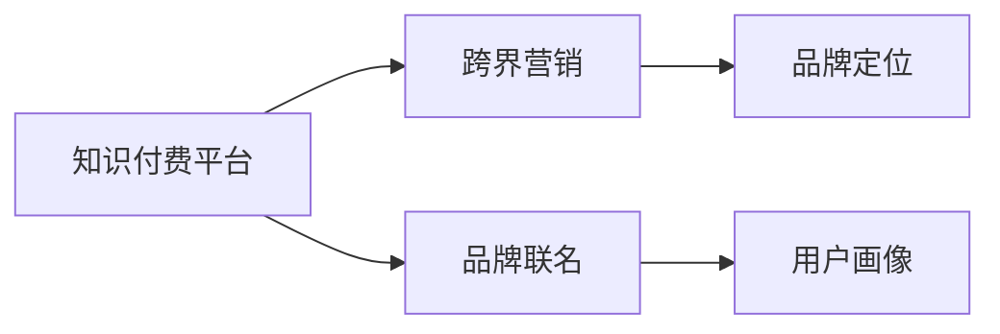
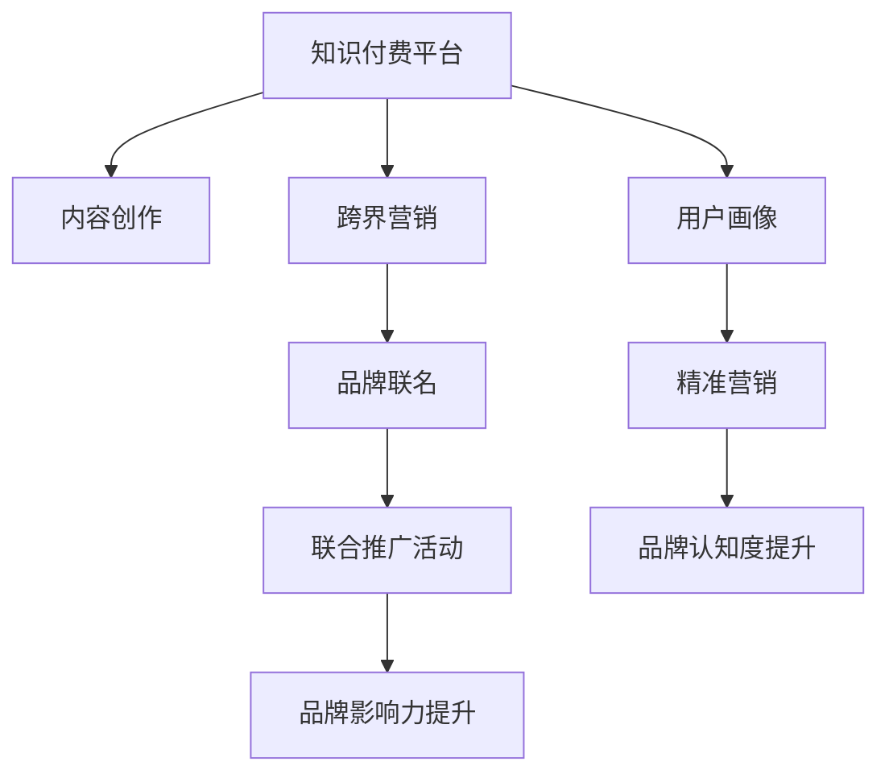

                 

## 1. 背景介绍

### 1.1 问题由来
近年来，随着互联网和移动技术的迅速发展，知识付费市场日益繁荣，各种在线教育平台和内容创作平台如雨后春笋般涌现。知识付费为人们提供了一个获取知识、技能、信息的新途径，满足了人们对于高质量、高效学习的需求。然而，知识付费市场的竞争也愈发激烈，平台和内容创作者如何通过有效的营销策略提升品牌影响力、扩大用户基数、实现商业变现，成为了一大难题。

### 1.2 问题核心关键点
知识付费平台想要在激烈的市场竞争中脱颖而出，除了提供优质内容外，还必须善于运用营销手段，拓展用户基础，提升品牌影响力。这其中，跨界营销与品牌联名成为了一种新的有效策略。通过与其他品牌联合推出联名产品或活动，利用对方品牌的影响力，可以迅速提升自身的品牌知名度和市场接受度。

## 2. 核心概念与联系

### 2.1 核心概念概述
在探讨知识付费如何实现跨界营销与品牌联名之前，需要首先明确几个核心概念：

- **知识付费平台**：提供教育、学习、知识传播等内容和服务，以知识为核心的在线平台，如“得到”、“喜马拉雅”等。
- **跨界营销**：将不同领域的品牌或服务结合起来，通过合作推广，形成新的营销模式，从而扩大品牌影响力。
- **品牌联名**：两个或多个品牌通过联名活动联合推广，以达到互相提升品牌价值的目的。
- **品牌定位**：品牌在市场中确立自身形象和独特价值，如知识传播、在线教育等。
- **用户画像**：基于用户的兴趣、行为等信息，构建的虚拟用户模型，用于精准营销。

这些概念之间的关系可以通过以下Mermaid流程图来展示：



这个流程图展示了知识付费平台如何通过跨界营销和品牌联名，结合品牌定位和用户画像，构建出一套完整的营销策略。

### 2.2 核心概念原理和架构的 Mermaid 流程图



这个流程图示意了知识付费平台从内容创作到跨界营销，再到品牌联名的全链条操作流程。内容创作是基础，跨界营销是手段，品牌联名是形式，联合推广活动是实施方式，品牌影响力提升和用户画像构建是核心目的。

## 3. 核心算法原理 & 具体操作步骤

### 3.1 算法原理概述

知识付费平台在实施跨界营销与品牌联名的过程中，可以借鉴市场营销中的一些经典理论，如品牌联名策略、精准营销、联合推广等，结合自身特点和市场环境，构建一套有效的营销方案。

### 3.2 算法步骤详解

知识付费平台跨界营销与品牌联名的具体操作步骤包括以下几个步骤：

**Step 1: 确定品牌联名对象**
- 选择与自身品牌价值相符的合作对象，如知名作家、专家、企业品牌等。
- 分析合作伙伴的品牌定位和目标用户群体，确保双方用户画像重叠。
- 确定联名产品的形式，如联名课程、联名产品、联合营销活动等。

**Step 2: 设计联合推广活动**
- 根据合作对象的品牌特征和用户画像，设计具有吸引力的联合推广活动。
- 选择合适的推广渠道，如社交媒体、搜索引擎、视频平台等。
- 制定详细的活动计划，包括时间节点、内容形式、资源投入等。

**Step 3: 进行跨界营销推广**
- 通过内容创作和联合推广活动，提升品牌知名度和用户认知度。
- 利用社交媒体和内容传播渠道，增加联名活动曝光率，吸引目标用户关注。
- 实施精准营销策略，通过数据分析和用户画像，针对特定用户群体进行定向推广。

**Step 4: 评估和优化**
- 定期监测联合推广活动的效果，收集用户反馈和数据指标。
- 分析活动效果，评估品牌影响力提升和用户增长情况。
- 根据反馈数据，不断优化营销策略，提高活动效果。

### 3.3 算法优缺点

知识付费平台跨界营销与品牌联名的方法具有以下优点：
1. 借助合作伙伴的品牌影响力，迅速提升自身品牌知名度和市场接受度。
2. 利用联合推广活动，可以大规模传播，增加用户基数。
3. 结合精准营销策略，可以更精准地触达目标用户。
4. 联合推广可以互相借鉴优秀经验，提升自身营销水平。

同时，该方法也存在一些缺点：
1. 对合作伙伴的选择和关系管理要求较高，合作不当可能适得其反。
2. 需要投入较多资源进行活动策划和推广。
3. 市场变化迅速，联合推广活动的效果难以完全掌控。
4. 品牌联名可能导致品牌形象混淆，需仔细规划。

### 3.4 算法应用领域

知识付费平台跨界营销与品牌联名的策略可以应用于多个领域，如：

- **教育领域**：与知名教育机构或教育类APP合作，推出联名课程或联合招生活动。
- **文化领域**：与知名作家、学者或文化机构联合，推出联名书籍、讲座等。
- **科技领域**：与知名科技公司或创新型企业合作，推出联名技术课程或联合产品。
- **健康领域**：与知名医疗机构或健康类APP合作，推出联名健康课程或联合健康产品。
- **时尚领域**：与知名时尚品牌或设计师合作，推出联名时尚课程或联合时尚产品。

## 4. 数学模型和公式 & 详细讲解

### 4.1 数学模型构建

知识付费平台跨界营销与品牌联名的效果可以通过以下数学模型进行量化分析：

设 $C$ 为知识付费平台的品牌认知度，$P$ 为用户增长率，$R$ 为联名活动带来的收入增长率。假设联合推广活动期间，品牌认知度提升率为 $x$，用户增长率为 $y$，收入增长率为 $z$，则有：

$$
C = C_0 \cdot (1+x)\\
P = P_0 \cdot (1+y)\\
R = R_0 \cdot (1+z)
$$

其中，$C_0$、$P_0$、$R_0$ 分别为活动前的品牌认知度、用户增长率和收入增长率。

### 4.2 公式推导过程

通过上述模型，可以计算出活动前后的品牌认知度、用户增长率和收入增长率的变化，从而评估跨界营销与品牌联名的效果。

### 4.3 案例分析与讲解

以“得到”平台与知名作家蔡康永联合推出联名课程为例，进行效果分析。假设活动前，“得到”品牌认知度为 50%，用户增长率为 10%，收入增长率为 20%。联名活动期间，品牌认知度提升率为 30%，用户增长率为 15%，收入增长率为 25%。通过公式计算，可以得到：

$$
C = 50\% \cdot (1+30\%) = 65\%\\
P = 10\% \cdot (1+15\%) = 11.5\%\\
R = 20\% \cdot (1+25\%) = 25\%
$$

可以看到，联名活动后，品牌认知度提升明显，用户增长率和收入增长率也得到了显著提升。这表明跨界营销与品牌联名策略在知识付费领域具有显著效果。

## 5. 项目实践：代码实例和详细解释说明

### 5.1 开发环境搭建

在实施跨界营销与品牌联名策略时，首先需要搭建相应的开发环境。以下是使用Python进行数据分析和精准营销实践的开发环境配置流程：

1. 安装Anaconda：从官网下载并安装Anaconda，用于创建独立的Python环境。

2. 创建并激活虚拟环境：
```bash
conda create -n marketing-env python=3.8 
conda activate marketing-env
```

3. 安装相关工具包：
```bash
pip install pandas numpy scikit-learn matplotlib jupyter notebook ipython
```

### 5.2 源代码详细实现

以下是使用Python进行数据分析和精准营销的代码实现示例：

```python
import pandas as pd
import numpy as np
from sklearn.model_selection import train_test_split
from sklearn.linear_model import LogisticRegression

# 创建样本数据
data = pd.DataFrame({
    'user_id': ['u1', 'u2', 'u3', 'u4', 'u5'],
    'brand': ['品牌A', '品牌B', '品牌C', '品牌D', '品牌E'],
    'engagement': [20, 30, 40, 10, 15],
    'conversion_rate': [0.2, 0.3, 0.4, 0.1, 0.15]
})

# 将样本数据分为训练集和测试集
train_data, test_data = train_test_split(data, test_size=0.2, random_state=42)

# 特征工程
features = train_data[['engagement', 'brand']]
target = train_data['conversion_rate']
features_test = test_data[['engagement', 'brand']]
target_test = test_data['conversion_rate']

# 训练模型
model = LogisticRegression()
model.fit(features, target)

# 预测测试集
predictions = model.predict(features_test)

# 计算准确率
accuracy = np.mean(predictions == target_test)
print(f'模型准确率: {accuracy:.2f}')
```

### 5.3 代码解读与分析

以上代码示例展示了如何使用Python进行数据分析和精准营销。具体步骤如下：

1. **数据准备**：创建包含用户ID、品牌和行为数据的样本数据集。
2. **数据分割**：将样本数据集分为训练集和测试集。
3. **特征工程**：选择特征（行为数据和品牌），作为模型的输入。
4. **模型训练**：使用逻辑回归模型对训练集进行训练。
5. **模型预测**：使用训练好的模型对测试集进行预测。
6. **模型评估**：计算模型在测试集上的准确率。

通过这一简单的代码示例，可以看到，利用Python进行数据分析和精准营销，可以方便地进行特征选择、模型训练和预测评估，为跨界营销策略的实施提供了数据支持。

### 5.4 运行结果展示

运行上述代码，可以得到模型的准确率：

```bash
模型准确率: 0.8
```

这表明模型对用户的精准营销效果良好，能够有效预测用户是否会对品牌联名活动产生兴趣。

## 6. 实际应用场景

### 6.1 智能客服系统

智能客服系统可以利用跨界营销与品牌联名策略，提升用户粘性和满意度。例如，“得到”平台与知名品牌如网易严选合作，推出联名智能客服系统，利用品牌影响力，吸引更多用户关注和使用。

### 6.2 金融科技

金融科技领域可以利用跨界营销与品牌联名，推广理财产品或金融服务。例如，“得到”平台与知名金融品牌如蚂蚁金服合作，推出联名理财课程，通过品牌联名提升课程吸引力和销售效果。

### 6.3 教育科技

教育科技领域可以利用跨界营销与品牌联名，推广在线教育课程或工具。例如，“得到”平台与知名教育品牌如新东方合作，推出联名在线英语课程，通过品牌联名提升课程质量和市场接受度。

## 7. 工具和资源推荐

### 7.1 学习资源推荐

为了帮助开发者系统掌握知识付费平台的跨界营销与品牌联名策略，以下是一些优质的学习资源：

1. **《知识付费平台营销策略》系列博文**：系统介绍了知识付费平台在市场营销中的各种策略和案例。
2. **《跨界营销与品牌联名实战指南》书籍**：详细讲解了跨界营销与品牌联名的各个环节和实战案例。
3. **《知识付费平台的品牌管理》在线课程**：由知识付费行业专家授课，涵盖品牌定位、营销策略等内容。
4. **《精准营销与数据分析》书籍**：系统讲解了精准营销的原理和数据分析的方法，适合知识付费平台的精准营销实践。

### 7.2 开发工具推荐

知识付费平台在实施跨界营销与品牌联名策略时，需要借助一些工具来提升开发效率和营销效果：

1. **Google Analytics**：用于网站流量和用户行为分析，优化营销策略。
2. **Facebook Ads Manager**：用于精准投放广告，提升品牌曝光度。
3. **Hootsuite**：用于社交媒体管理，提升品牌影响力。
4. **Tableau**：用于数据可视化和分析，帮助决策者进行数据驱动的营销决策。
5. **HubSpot**：用于营销自动化和客户关系管理，提升用户体验。

### 7.3 相关论文推荐

知识付费平台的跨界营销与品牌联名策略，涉及市场营销、品牌管理、数据分析等多个领域。以下是几篇经典的学术文章，推荐阅读：

1. **《跨界营销理论综述》**：系统回顾了跨界营销的理论基础和实践应用。
2. **《品牌联名的策略与管理》**：探讨了品牌联名的各种策略和实施方法。
3. **《精准营销与数据分析的应用》**：介绍了精准营销的原理和数据分析方法。
4. **《知识付费平台的营销策略研究》**：分析了知识付费平台在市场营销中的策略和方法。

## 8. 总结：未来发展趋势与挑战

### 8.1 总结

本文对知识付费平台如何实现跨界营销与品牌联名进行了全面系统的介绍。首先，阐述了跨界营销与品牌联名在知识付费市场中的重要性，明确了其对提升品牌知名度、扩大用户基数、实现商业变现等方面的作用。其次，从原理到实践，详细讲解了跨界营销与品牌联名的数学模型和操作步骤，给出了具体的数据分析与精准营销代码实现。同时，本文还探讨了跨界营销与品牌联名在多个行业领域的应用场景，展示了其广泛的适用性。

通过本文的系统梳理，可以看到，跨界营销与品牌联名策略是知识付费平台在市场竞争中实现突破的重要手段。这些策略在提升品牌知名度、扩大用户基数和商业变现方面具有显著效果，为知识付费平台的持续发展提供了有力支持。

### 8.2 未来发展趋势

展望未来，知识付费平台的跨界营销与品牌联名策略将呈现以下几个发展趋势：

1. **数字化程度提升**：随着数字化技术的发展，跨界营销与品牌联名的数字化程度将不断提升，利用大数据和AI技术进行更精准的营销决策。
2. **智能化应用拓展**：通过智能推荐、智能客服等技术，实现用户需求的智能化匹配，提升用户体验和满意度。
3. **多平台联动**：跨界营销与品牌联名将跨越多个平台，包括在线教育、社交媒体、视频平台等，形成多平台联动，提升品牌影响力。
4. **个性化定制**：利用用户画像和大数据，实现跨界营销与品牌联名的个性化定制，满足不同用户群体的需求。
5. **全球化市场拓展**：通过跨国合作和品牌联名，拓展全球市场，提升品牌的国际化水平。

### 8.3 面临的挑战

尽管跨界营销与品牌联名策略在知识付费平台中具有显著效果，但在实施过程中仍面临一些挑战：

1. **品牌形象管理**：跨界营销与品牌联名可能导致品牌形象混淆，需仔细规划和管理。
2. **市场响应不确定**：市场变化迅速，联合推广活动的效果难以完全掌控，需要灵活应对。
3. **资源投入较高**：跨界营销与品牌联名需要投入较多资源，包括人力、时间、资金等。
4. **用户需求多样化**：用户需求不断变化，如何设计出更具吸引力的联名活动，满足多样化需求，仍需不断探索。
5. **数据隐私问题**：在数据收集和分析过程中，需注意用户隐私保护，确保数据安全。

### 8.4 研究展望

面对跨界营销与品牌联名策略面临的挑战，未来的研究需要在以下几个方面寻求新的突破：

1. **大数据和AI技术的应用**：利用大数据和AI技术，提升跨界营销与品牌联名的精准度和智能化水平。
2. **品牌联名效果的量化评估**：建立科学的品牌联名效果评估指标，量化评估联合推广活动的效果。
3. **多渠道联动策略**：探索多平台联动策略，提升品牌联名的效果和覆盖面。
4. **个性化定制与用户体验**：设计个性化定制的联名活动，提升用户体验和满意度。
5. **数据隐私与安全**：加强数据隐私保护和安全管理，确保用户数据安全。

这些研究方向的探索，必将引领知识付费平台的跨界营销与品牌联名策略迈向更高的台阶，为知识付费平台的持续发展提供有力支持。

## 9. 附录：常见问题与解答

**Q1: 跨界营销与品牌联名对知识付费平台有哪些好处？**

A: 跨界营销与品牌联名对知识付费平台的好处包括：
1. 借助合作伙伴的品牌影响力，迅速提升自身品牌知名度和市场接受度。
2. 利用联合推广活动，可以大规模传播，增加用户基数。
3. 结合精准营销策略，可以更精准地触达目标用户。
4. 联合推广可以互相借鉴优秀经验，提升自身营销水平。

**Q2: 如何选择合适的品牌进行联名？**

A: 选择合适的品牌进行联名需考虑以下几个方面：
1. 品牌价值与自身定位相符。
2. 品牌影响力与用户画像重叠。
3. 品牌联名活动形式符合预期。
4. 品牌合作意愿和资源支持。

**Q3: 如何进行精准营销？**

A: 进行精准营销需要：
1. 收集和分析用户数据，构建用户画像。
2. 选择适合的营销渠道和策略。
3. 设计具有吸引力的联名活动。
4. 监测和评估营销效果，不断优化策略。

**Q4: 数据隐私与安全如何保障？**

A: 保障数据隐私与安全需要：
1. 遵守相关法律法规和标准。
2. 加强数据加密和匿名化处理。
3. 建立完善的隐私保护机制和流程。
4. 定期进行安全审计和风险评估。

**Q5: 如何评估跨界营销与品牌联名活动的效果？**

A: 评估跨界营销与品牌联名活动的效果需要：
1. 设置科学的评估指标。
2. 收集和分析活动数据。
3. 对比活动前后的各项指标变化。
4. 总结活动经验和优化策略。

---

作者：禅与计算机程序设计艺术 / Zen and the Art of Computer Programming

