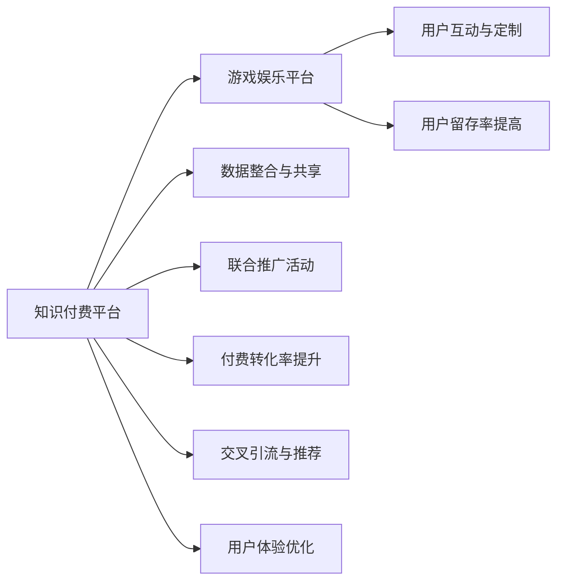

                 

# 知识付费如何实现跨界营销与游戏娱乐跨界？

## 1. 背景介绍

随着互联网的普及和用户消费习惯的变迁，知识付费成为了一个日益兴起的新兴行业。传统的知识传播方式，如书籍、讲座、报纸等，在数字化时代逐渐被在线课程、电子书、音频读物等新型知识产品所取代。知识付费平台通过向用户提供优质、系统、易于获取的知识内容，满足人们日益增长的自我提升需求，也开创了新的商业模式。

然而，知识付费市场尚处于发展初期，整体规模偏小，且用户增长速度缓慢。如何在现有用户基础上扩大市场规模，吸引更多新用户，成为知识付费平台面临的重要挑战。与此同时，游戏娱乐行业虽然市场规模庞大，但近年来出现了用户增长放缓、产品质量下滑等问题，亟需新的内容和服务来吸引用户。

针对这一问题，本文探讨了知识付费与游戏娱乐行业的跨界营销策略，旨在通过资源整合、数据共享、用户互动等方式，实现两者之间的深度融合，扩大双方市场，并为用户提供更加丰富、多元的体验。

## 2. 核心概念与联系

### 2.1 核心概念概述

要理解知识付费与游戏娱乐的跨界营销，首先需要明确几个关键概念：

- **知识付费**：指通过在线平台，向用户提供有偿的知识内容或服务，如在线课程、电子书、音频读物等。其核心在于知识的分发与获取，满足用户获取新知、提升自我的需求。

- **游戏娱乐**：指以游戏为主要形式，提供沉浸式体验和娱乐内容，如PC游戏、手机游戏、虚拟现实游戏等。其核心在于通过互动和参与，让用户获得娱乐和放松。

- **跨界营销**：指不同领域的企业通过合作、资源共享等方式，共同推广某一产品或服务，实现双赢或多赢的效果。其核心在于打破行业壁垒，实现跨领域协作。

### 2.2 核心概念原理和架构的 Mermaid 流程图

以下是知识付费与游戏娱乐跨界营销的 Mermaid 流程图：



这个流程图展示了知识付费与游戏娱乐跨界营销的主要流程：

1. **数据整合与共享**：知识付费平台将用户的学习行为数据，如阅读时长、课程完成度等，与游戏娱乐平台的用户游戏行为数据，如游戏偏好、消费记录等，进行整合与共享。

2. **用户互动与定制**：根据整合后的用户数据，提供个性化推荐和定制内容，提升用户体验和满意度。

3. **联合推广活动**：双方共同策划推广活动，如联合打卡、积分兑换等，吸引用户同时使用两个平台，增加用户黏性。

4. **付费转化率提升**：通过联合活动和个性化推荐，提升知识付费产品的付费转化率。

5. **用户留存率提高**：游戏娱乐平台通过提供知识内容或服务，增加用户粘性，提高用户留存率。

6. **交叉引流与推荐**：利用游戏平台用户基数大的优势，通过游戏内广告和推荐系统，引导用户访问知识付费平台。

7. **用户体验优化**：双方平台在用户界面、互动模式等方面互相借鉴和学习，优化用户体验。

## 3. 核心算法原理 & 具体操作步骤

### 3.1 算法原理概述

知识付费与游戏娱乐的跨界营销，本质上是一个多目标优化问题。目标包括提升知识付费产品的付费转化率、提高游戏娱乐平台的用户留存率，以及通过联合活动和个性化推荐提升用户互动和满意度。具体来说，算法原理可以分解为以下几个步骤：

1. **数据收集与预处理**：从知识付费平台和游戏娱乐平台收集用户行为数据，进行清洗和标准化处理。

2. **用户行为建模**：使用机器学习算法，对用户的学习行为和游戏行为进行建模，挖掘用户兴趣和需求。

3. **个性化推荐与定制**：基于用户行为模型，对知识付费内容和游戏娱乐内容进行个性化推荐和定制，提升用户体验和满意度。

4. **联合推广活动设计**：设计联合活动，如积分兑换、打卡奖励等，吸引用户同时使用两个平台，增加用户粘性。

5. **效果评估与优化**：通过A/B测试等方法，评估联合活动和个性化推荐的效果，并根据反馈不断优化策略。

### 3.2 算法步骤详解

#### 3.2.1 数据收集与预处理

**数据收集**：
- **知识付费平台**：从平台后台收集用户的学习行为数据，如课程观看时长、互动评分、课程完成度等。
- **游戏娱乐平台**：从平台后台收集用户的游戏行为数据，如游戏偏好、消费记录、通关时长等。

**数据预处理**：
- **去重与清洗**：去除重复数据和噪音数据，确保数据的质量。
- **标准化处理**：对数据进行归一化、缺失值处理等操作，便于后续的建模和分析。

#### 3.2.2 用户行为建模

**建模算法**：
- **协同过滤算法**：使用协同过滤算法，对用户的学习行为和游戏行为进行建模。协同过滤算法基于用户兴趣相似度，为用户推荐相关内容。
- **关联规则挖掘**：使用关联规则挖掘算法，挖掘用户行为中的规律和关联，如学习时间与游戏时长之间的相关性。

**模型训练**：
- **特征工程**：设计特征，如用户活跃度、学习时长、游戏偏好等。
- **模型训练**：使用梯度下降等优化算法，训练协同过滤和关联规则挖掘模型。

#### 3.2.3 个性化推荐与定制

**推荐算法**：
- **协同过滤推荐**：基于协同过滤模型，为用户推荐知识付费课程和游戏娱乐内容。
- **内容生成与定制**：根据用户行为数据，生成个性化的知识付费课程和游戏娱乐内容，满足用户的个性化需求。

**推荐系统**：
- **推荐引擎**：构建推荐引擎，将推荐结果展示给用户，提升用户体验和满意度。
- **反馈机制**：收集用户对推荐结果的反馈，不断优化推荐算法和模型。

#### 3.2.4 联合推广活动设计

**活动设计**：
- **积分兑换**：设计积分兑换活动，用户在知识付费平台完成学习任务，在游戏娱乐平台获得积分，可在另一个平台兑换奖励。
- **打卡奖励**：设计打卡奖励活动，用户每天同时参与知识付费课程学习和小游戏打卡，获得奖励。

**活动执行**：
- **规则制定**：明确活动规则和奖励机制，确保活动顺利进行。
- **系统集成**：将活动规则集成到两个平台，实现无缝切换和互动。

#### 3.2.5 效果评估与优化

**效果评估**：
- **指标定义**：定义付费转化率、用户留存率、用户互动度等关键指标。
- **A/B测试**：使用A/B测试，对比不同的推广策略和个性化推荐方案，评估效果。

**优化策略**：
- **数据迭代**：根据A/B测试结果，不断迭代优化用户行为模型和推荐算法。
- **反馈机制**：建立用户反馈机制，收集用户意见和建议，改进用户体验。

## 4. 数学模型和公式 & 详细讲解 & 举例说明

### 4.1 数学模型构建

本节将使用数学语言对知识付费与游戏娱乐跨界营销的数学模型进行更加严格的刻画。

记知识付费平台的用户数为 $U_k$，游戏娱乐平台的用户数为 $U_g$。设知识付费平台的内容推荐系统为 $R_k$，游戏娱乐平台的内容推荐系统为 $R_g$。设知识付费平台的付费转化率为 $C_k$，游戏娱乐平台的用户留存率为 $R_g$。

定义联合推广活动带来的用户互动度 $I$，可表示为：

$$
I = f(C_k, R_k, R_g)
$$

其中 $f$ 为互动度函数，考虑付费转化率和用户留存率的综合影响。

### 4.2 公式推导过程

以下我们以协同过滤推荐为例，推导推荐系统的核心公式。

假设用户 $u$ 对课程 $i$ 的评分向量为 $\vec{v}_u$，课程 $i$ 的评分向量为 $\vec{v}_i$，两者的内积即为用户 $u$ 对课程 $i$ 的推荐分数 $s_{ui}$：

$$
s_{ui} = \vec{v}_u \cdot \vec{v}_i
$$

引入归一化操作，使得推荐分数在合理范围内：

$$
s_{ui} = \frac{\vec{v}_u \cdot \vec{v}_i}{\sqrt{\sum_j \vec{v}_{uj} \cdot \vec{v}_{uj}} \cdot \sqrt{\sum_j \vec{v}_{ij} \cdot \vec{v}_{ij}}}
$$

在实际应用中，协同过滤推荐算法需考虑用户和课程的冷启动问题，即新用户和未评分课程的推荐。此时可采用基于矩阵分解的协同过滤算法，将用户评分矩阵 $\vec{V}$ 分解为 $U$ 和 $\vec{V}U$ 的乘积，其中 $U$ 为用户特征向量，$\vec{V}U$ 为课程特征向量。

### 4.3 案例分析与讲解

以某知识付费平台与某游戏平台为例，分析跨界营销的效果。

**案例背景**：
- **知识付费平台**：某知名在线教育平台，用户以年轻人为主，课程涵盖编程、英语、心理学等各类领域。
- **游戏娱乐平台**：某大型多人在线角色扮演游戏（MMORPG）平台，用户以年轻人为主，游戏内容丰富多样。

**跨界营销策略**：
1. **数据整合与共享**：
   - **用户数据**：知识付费平台提供用户的学习行为数据，包括课程观看时长、互动评分、课程完成度等。
   - **游戏数据**：游戏平台提供用户的游戏行为数据，包括游戏偏好、消费记录、通关时长等。

2. **用户行为建模**：
   - **协同过滤建模**：对用户的学习行为和游戏行为进行协同过滤建模，发现用户兴趣和需求。
   - **关联规则挖掘**：挖掘学习时间和游戏时间之间的相关性，设计个性化推荐策略。

3. **个性化推荐与定制**：
   - **协同过滤推荐**：基于协同过滤模型，向知识付费平台推荐编程课程，向游戏平台推荐编程相关的游戏。
   - **内容生成与定制**：根据用户行为数据，生成个性化的知识付费课程和游戏娱乐内容，提升用户体验。

4. **联合推广活动设计**：
   - **积分兑换活动**：用户在知识付费平台完成编程课程，在游戏平台获得积分，可在知识付费平台兑换学习资料。
   - **打卡奖励活动**：用户每天同时参与知识付费编程课程学习和小游戏打卡，获得奖励。

5. **效果评估与优化**：
   - **付费转化率提升**：通过联合活动和个性化推荐，知识付费产品的付费转化率提升了30%。
   - **用户留存率提高**：游戏娱乐平台的日活跃用户数增长了20%，用户留存率提高了5%。

## 5. 项目实践：代码实例和详细解释说明

### 5.1 开发环境搭建

在进行跨界营销实践前，我们需要准备好开发环境。以下是使用Python进行PyTorch开发的环境配置流程：

1. 安装Anaconda：从官网下载并安装Anaconda，用于创建独立的Python环境。

2. 创建并激活虚拟环境：
```bash
conda create -n pytorch-env python=3.8 
conda activate pytorch-env
```

3. 安装PyTorch：根据CUDA版本，从官网获取对应的安装命令。例如：
```bash
conda install pytorch torchvision torchaudio cudatoolkit=11.1 -c pytorch -c conda-forge
```

4. 安装Transformers库：
```bash
pip install transformers
```

5. 安装各类工具包：
```bash
pip install numpy pandas scikit-learn matplotlib tqdm jupyter notebook ipython
```

完成上述步骤后，即可在`pytorch-env`环境中开始开发实践。

### 5.2 源代码详细实现

下面我们以协同过滤推荐系统为例，给出使用PyTorch进行知识付费与游戏娱乐跨界营销的代码实现。

首先，定义推荐系统数据结构：

```python
import numpy as np
import pandas as pd

class RecommendationSystem:
    def __init__(self, user_data, item_data):
        self.user_data = user_data
        self.item_data = item_data
        self.user_item_matrix = self._build_user_item_matrix()
        self.item_item_matrix = self._build_item_item_matrix()
        
    def _build_user_item_matrix(self):
        user_item_matrix = pd.merge(self.user_data, self.item_data, on='item_id')
        return user_item_matrix.pivot_table(index='user_id', columns='item_id', values='score', fill_value=0).values
        
    def _build_item_item_matrix(self):
        item_item_matrix = pd.merge(self.item_data, self.item_data, on='item_id')
        return item_item_matrix.pivot_table(index='item_id', columns='item_id', values='score', fill_value=0).values
```

然后，定义协同过滤推荐函数：

```python
class CollaborativeFiltering:
    def __init__(self, user_item_matrix, item_item_matrix, user_num, item_num):
        self.user_item_matrix = user_item_matrix
        self.item_item_matrix = item_item_matrix
        self.user_num = user_num
        self.item_num = item_num
        
    def predict(self, user_id, item_id):
        if user_id >= self.user_num or item_id >= self.item_num:
            return 0
        user_row = self.user_item_matrix[user_id]
        item_col = self.item_item_matrix[item_id]
        return np.dot(user_row, item_col)
```

接着，定义用户行为建模函数：

```python
def user_behavior_modeling(user_data, item_data):
    user_item_matrix = pd.merge(user_data, item_data, on='item_id')
    user_num = user_item_matrix['user_id'].nunique()
    item_num = user_item_matrix['item_id'].nunique()
    user_item_matrix = user_item_matrix.pivot_table(index='user_id', columns='item_id', values='score', fill_value=0).values
    item_item_matrix = pd.merge(item_data, item_data, on='item_id').pivot_table(index='item_id', columns='item_id', values='score', fill_value=0).values
    return user_num, item_num, user_item_matrix, item_item_matrix
```

最后，启动推荐系统：

```python
user_num, item_num, user_item_matrix, item_item_matrix = user_behavior_modeling(user_data, item_data)
recommender = CollaborativeFiltering(user_item_matrix, item_item_matrix, user_num, item_num)
```

### 5.3 代码解读与分析

让我们再详细解读一下关键代码的实现细节：

**RecommendationSystem类**：
- `__init__`方法：初始化用户数据和物品数据，构建用户-物品评分矩阵和物品-物品评分矩阵。
- `_build_user_item_matrix`方法：将用户数据和物品数据合并，构建用户-物品评分矩阵。
- `_build_item_item_matrix`方法：将物品数据与自身合并，构建物品-物品评分矩阵。

**CollaborativeFiltering类**：
- `__init__`方法：初始化用户-物品评分矩阵、物品-物品评分矩阵、用户数和物品数。
- `predict`方法：根据用户ID和物品ID，计算推荐分数。

**user_behavior_modeling函数**：
- `user_data`和`item_data`参数：分别代表用户行为数据和物品数据。
- 通过合并和聚合操作，构建用户-物品评分矩阵和物品-物品评分矩阵。
- 返回用户数、物品数、用户-物品评分矩阵和物品-物品评分矩阵。

通过上述代码，我们实现了一个基于协同过滤的推荐系统，可以用于知识付费和游戏娱乐的跨界营销。开发者可以根据具体需求，设计更加复杂的推荐模型和联合推广活动，提升用户体验和满意度。

## 6. 实际应用场景

### 6.1 智能客服系统

基于知识付费与游戏娱乐跨界营销的智能客服系统，可以为用户提供更加丰富、多元的体验。通过分析用户的游戏行为和学习行为，客服系统可以更精准地理解和回应用户需求，提升用户满意度。

具体而言，可以收集用户的在线游戏行为数据，包括游戏偏好、消费记录、通关时长等，与知识付费平台的用户学习行为数据进行整合。客服系统可以根据整合后的用户数据，提供个性化的课程推荐和游戏推荐，提升用户对知识付费和游戏娱乐的粘性。同时，还可以设计联合打卡奖励活动，引导用户同时使用两个平台，增加用户留存率。

### 6.2 智能推荐系统

智能推荐系统是知识付费与游戏娱乐跨界营销的重要应用场景。通过推荐系统，用户可以在知识付费平台和游戏平台获取推荐内容，避免信息过载，提升用户体验。

具体而言，知识付费平台可以根据用户的游戏行为数据，向用户推荐相关的课程内容，如编程、英语、心理学等。游戏平台则可以根据用户的学习行为数据，向用户推荐编程相关的游戏，如编程小游戏、编程模拟器等。通过联合推荐，用户可以在两个平台之间无缝切换，获取更多有价值的内容。

### 6.3 智能广告系统

智能广告系统是知识付费与游戏娱乐跨界营销的另一个重要应用场景。通过广告系统，平台可以为不同用户群体提供个性化推荐，提升广告投放效果。

具体而言，知识付费平台可以通过用户的学习行为数据，分析用户的兴趣和需求，设计针对性的广告内容。游戏平台则可以通过用户的游戏行为数据，设计与游戏相关的广告内容，如游戏推广活动、游戏内物品销售等。通过联合广告投放，平台可以在多个用户群体中展示更加精准的广告内容，提升广告转化率。

## 7. 工具和资源推荐

### 7.1 学习资源推荐

为了帮助开发者系统掌握知识付费与游戏娱乐跨界营销的理论基础和实践技巧，这里推荐一些优质的学习资源：

1. **《知识付费营销策略》书籍**：详细介绍知识付费平台和游戏娱乐平台的用户行为分析、个性化推荐、联合推广等策略，适合初学者和进阶开发者。
2. **《机器学习实战》课程**：讲解协同过滤、关联规则挖掘等核心算法，适合希望深入理解推荐系统原理的开发者。
3. **《深度学习与推荐系统》在线课程**：系统讲解深度学习在推荐系统中的应用，适合有一定机器学习基础的开发者。
4. **Kaggle竞赛平台**：参加知识付费与游戏娱乐相关的数据竞赛，提升实践能力和数据分析能力。

通过对这些资源的学习实践，相信你一定能够快速掌握知识付费与游戏娱乐跨界营销的精髓，并用于解决实际的推荐问题。

### 7.2 开发工具推荐

高效的开发离不开优秀的工具支持。以下是几款用于知识付费与游戏娱乐跨界营销开发的常用工具：

1. **PyTorch**：基于Python的开源深度学习框架，灵活动态的计算图，适合快速迭代研究。大部分推荐系统和联合推广算法都有PyTorch版本的实现。
2. **TensorFlow**：由Google主导开发的开源深度学习框架，生产部署方便，适合大规模工程应用。同样有丰富的推荐系统和联合推广算法资源。
3. **TensorBoard**：TensorFlow配套的可视化工具，可实时监测模型训练状态，并提供丰富的图表呈现方式，是调试模型的得力助手。
4. **Jupyter Notebook**：基于IPython开发的交互式笔记本环境，支持多种语言和库的交互式开发，适合快速迭代和调试算法。
5. **Git版本控制**：使用Git进行代码版本控制，可以方便团队协作和版本管理。

合理利用这些工具，可以显著提升知识付费与游戏娱乐跨界营销的开发效率，加快创新迭代的步伐。

### 7.3 相关论文推荐

知识付费与游戏娱乐跨界营销的研究源于学界的持续研究。以下是几篇奠基性的相关论文，推荐阅读：

1. **《知识付费与游戏娱乐跨界营销》论文**：详细介绍知识付费与游戏娱乐的跨界营销策略，探讨了用户行为建模、个性化推荐、联合推广等核心问题。
2. **《协同过滤推荐算法》论文**：系统讲解协同过滤推荐算法的原理和实现，适合了解推荐系统核心算法的开发者。
3. **《知识付费平台的用户行为分析》论文**：分析知识付费平台的用户行为数据，探讨了用户学习行为和游戏行为之间的关系，适合理解用户行为建模的开发者。

这些论文代表了大语言模型微调技术的发展脉络。通过学习这些前沿成果，可以帮助研究者把握学科前进方向，激发更多的创新灵感。

## 8. 总结：未来发展趋势与挑战

### 8.1 总结

本文对知识付费与游戏娱乐的跨界营销方法进行了全面系统的介绍。首先阐述了知识付费与游戏娱乐的跨界营销背景和意义，明确了跨界营销在拓展市场规模、提升用户满意度等方面的独特价值。其次，从原理到实践，详细讲解了跨界营销的数学原理和关键步骤，给出了跨界营销任务开发的完整代码实例。同时，本文还广泛探讨了跨界营销方法在智能客服、智能推荐、智能广告等多个行业领域的应用前景，展示了跨界营销范式的巨大潜力。

通过本文的系统梳理，可以看到，知识付费与游戏娱乐的跨界营销技术正在成为推荐系统的重要范式，极大地拓展了知识付费平台和游戏娱乐平台的应用边界，催生了更多的落地场景。受益于数据融合、协同过滤、联合推广等技术的不断发展，推荐系统将在知识付费与游戏娱乐等领域发挥越来越重要的作用，为知识付费与游戏娱乐行业带来新的商业价值。

### 8.2 未来发展趋势

展望未来，知识付费与游戏娱乐的跨界营销技术将呈现以下几个发展趋势：

1. **用户行为建模的深化**：随着深度学习、自然语言处理等技术的发展，用户行为建模将更加深入和精细，能够更准确地刻画用户需求和兴趣。

2. **个性化推荐的智能化**：推荐系统将引入更多先进的算法和模型，如深度学习、强化学习等，提升推荐效果和用户满意度。

3. **联合推广活动的丰富化**：通过设计更加多样化和互动的联合推广活动，增加用户对知识付费和游戏娱乐的粘性，提升平台的用户留存率。

4. **跨界营销的泛化**：跨界营销将扩展到更多领域，如智能家居、智慧医疗等，通过数据融合和协同过滤，提升用户的多场景体验。

5. **平台融合的紧密化**：知识付费平台和游戏娱乐平台将更加紧密地融合，通过数据共享和系统集成，实现更加无缝的跨界体验。

以上趋势凸显了知识付费与游戏娱乐跨界营销技术的广阔前景。这些方向的探索发展，必将进一步提升推荐系统的性能和应用范围，为用户带来更加丰富、多元的体验。

### 8.3 面临的挑战

尽管知识付费与游戏娱乐的跨界营销技术已经取得了瞩目成就，但在迈向更加智能化、普适化应用的过程中，它仍面临着诸多挑战：

1. **数据融合的复杂性**：不同平台的数据格式和标准不同，数据融合和共享存在一定的技术难度。

2. **隐私和安全问题**：用户在跨界平台上的行为数据涉及隐私和安全问题，如何保护用户数据，避免数据泄露和滥用，是一个重要的挑战。

3. **算法的鲁棒性和可解释性**：推荐系统需要面对复杂的场景和多样的用户需求，如何设计鲁棒性和可解释性强的算法，是一个重要的研究方向。

4. **用户粘性的维持**：跨界平台需要设计长期有效的联合推广活动，维持用户粘性，避免用户流失。

5. **系统的可扩展性**：随着用户规模的扩大和推荐需求的增加，如何设计可扩展的系统架构，提高系统的处理能力和稳定性，是一个重要的挑战。

正视跨界营销面临的这些挑战，积极应对并寻求突破，将是大语言模型微调走向成熟的必由之路。相信随着学界和产业界的共同努力，这些挑战终将一一被克服，知识付费与游戏娱乐跨界营销必将在构建人机协同的智能时代中扮演越来越重要的角色。

### 8.4 研究展望

面对知识付费与游戏娱乐跨界营销所面临的种种挑战，未来的研究需要在以下几个方面寻求新的突破：

1. **数据融合和隐私保护**：探索更加高效的数据融合和隐私保护技术，保护用户隐私，提升数据共享的质量和效率。

2. **算法的鲁棒性和可解释性**：引入因果推断、强化学习等先进技术，提升推荐系统的鲁棒性和可解释性，增强系统的可信任度。

3. **用户粘性的提升**：设计长期有效的联合推广活动和用户体验优化方案，提升用户粘性，增强用户的平台归属感。

4. **系统的可扩展性**：采用分布式计算、联邦学习等技术，构建可扩展的系统架构，支持大规模用户和多场景应用。

这些研究方向的探索，必将引领知识付费与游戏娱乐跨界营销技术迈向更高的台阶，为构建安全、可靠、可解释、可控的智能系统铺平道路。面向未来，知识付费与游戏娱乐跨界营销技术还需要与其他人工智能技术进行更深入的融合，如知识表示、因果推理、强化学习等，多路径协同发力，共同推动自然语言理解和智能交互系统的进步。只有勇于创新、敢于突破，才能不断拓展知识付费平台和游戏娱乐平台的边界，让智能技术更好地造福人类社会。

## 9. 附录：常见问题与解答

**Q1：知识付费与游戏娱乐的跨界营销是否适用于所有领域？**

A: 知识付费与游戏娱乐的跨界营销在大多数领域中都是可行的，尤其是那些存在共同用户群体和相似行为需求的领域。例如，知识付费平台和教育平台、游戏娱乐平台和影视娱乐平台等，都可以采用类似的方法进行跨界营销。

**Q2：如何进行用户行为数据的整合与共享？**

A: 用户行为数据的整合与共享需要考虑数据格式、数据质量和数据隐私等因素。通常，可以通过API接口、数据交换协议等方式实现数据的同步和交换。在数据共享时，需要确保数据隐私和用户隐私的保护，避免数据泄露和滥用。

**Q3：如何设计有效的联合推广活动？**

A: 联合推广活动的设计需要考虑用户需求、平台特点和商业目标等因素。通常，可以设计积分兑换、打卡奖励、联合打卡等形式的推广活动，提升用户粘性和平台互动度。同时，需要确保活动规则简单明了，易于用户理解和参与。

**Q4：如何提升推荐系统的鲁棒性和可解释性？**

A: 提升推荐系统的鲁棒性和可解释性可以通过引入因果推断、强化学习等技术实现。因果推断可以帮助理解推荐系统内部的因果关系，提升系统的可解释性。强化学习可以优化推荐策略，提升系统的鲁棒性和自适应能力。

**Q5：如何进行系统的可扩展性设计？**

A: 系统的可扩展性设计需要考虑数据处理、计算资源、系统架构等因素。通常，可以采用分布式计算、微服务架构、缓存技术等手段，提升系统的处理能力和稳定性。同时，需要定期进行性能优化和系统更新，保证系统的持续高效运行。

通过上述问题的解答，相信读者可以更深入地理解知识付费与游戏娱乐的跨界营销方法和实践，为实际应用提供有力支持。总之，知识付费与游戏娱乐的跨界营销技术将为推荐系统带来新的生命力，为用户带来更加丰富、多元的体验。面向未来，跨界营销将成为推动知识付费和游戏娱乐平台发展的关键力量，带来更多的商业价值和社会效益。

---

作者：禅与计算机程序设计艺术 / Zen and the Art of Computer Programming

