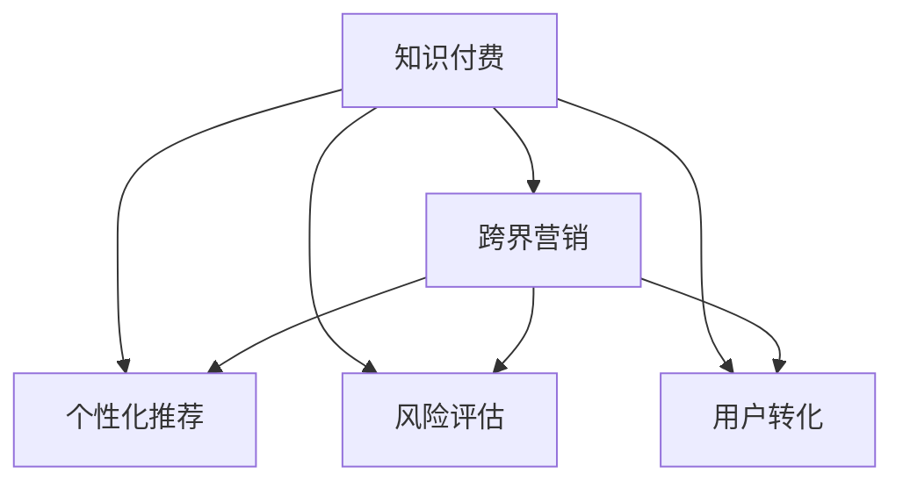

                 

# 知识付费如何实现跨界营销与金融保险跨界？

## 1. 背景介绍

### 1.1 问题由来
知识付费，是指用户为获取知识、提升技能、获得智慧内容而支付费用。随着互联网的普及和知识经济的发展，越来越多的人选择在线订阅优质内容，从而推动了知识付费市场的快速增长。但仅仅依靠内容订阅和付费模式，难以持续扩大用户规模，且单一业务模式容易受到市场波动的影响。为此，知识付费平台开始尝试跨界营销，探索与其他领域的合作，以期达到1+1>2的效果。金融保险行业作为知识付费的天然合作伙伴，双方通过深入合作，可以实现资源共享、用户复用，从而拓宽知识付费平台的业务边界，提升市场竞争力。

### 1.2 问题核心关键点
知识付费跨界营销与金融保险跨界主要关注以下核心问题：

- **数据共享与隐私保护**：如何在保证用户数据隐私的前提下，实现知识付费平台和金融保险行业之间的数据共享？
- **个性化推荐**：如何基于用户的阅读偏好和消费习惯，向其推荐金融保险产品？
- **风险评估**：如何对用户进行综合评估，确定其风险等级，从而提供个性化的保险产品？
- **用户转化**：如何提升知识付费用户的购买转化率，促使其向金融保险产品转化？

### 1.3 问题研究意义
通过知识付费与金融保险的跨界合作，可以实现双赢的局面：

- **提升用户粘性**：通过内容订阅和个性化推荐，保持用户的活跃度和忠诚度。
- **拓展业务范围**：在知识付费基础上，开拓金融保险市场，增加业务收入。
- **强化用户画像**：通过金融保险产品的销售反馈，进一步完善用户画像，提升推荐精度。
- **数据驱动决策**：利用跨界合作获得的大量数据，优化平台运营策略和金融产品设计。

## 2. 核心概念与联系

### 2.1 核心概念概述

为更好地理解知识付费与金融保险的跨界合作，本节将介绍几个密切相关的核心概念：

- **知识付费**：指用户通过付费订阅优质内容，提升个人技能和认知水平的一种在线内容消费方式。
- **跨界营销**：指企业将产品或服务推广到非传统销售渠道，通过与不同行业的合作，实现资源互补和用户复用。
- **个性化推荐**：指根据用户的兴趣和行为数据，向其推荐个性化内容的算法和技术。
- **风险评估**：指通过综合分析用户的经济状况、风险偏好等，确定其风险等级，从而制定相应的保险策略。
- **用户转化**：指将潜在客户转化为客户的过程，通过优化产品和服务设计，提升客户体验，最终促成交易。

这些核心概念之间的逻辑关系可以通过以下Mermaid流程图来展示：



这个流程图展示了我知识付费平台与金融保险行业合作的关键环节：

1. 知识付费平台通过个性化推荐和风险评估，向用户推荐保险产品。
2. 知识付费平台通过用户转化，提升保险产品的购买转化率。
3. 金融保险行业通过数据共享，增强用户画像，优化产品设计。

## 3. 核心算法原理 & 具体操作步骤

### 3.1 算法原理概述

知识付费平台与金融保险行业的跨界合作，本质上是一个多维度的数据驱动决策过程。其核心思想是：通过用户在知识付费平台上的行为数据，综合分析用户的风险偏好、消费习惯等特征，向其推荐合适的保险产品，并优化产品设计，从而实现用户复用和业务扩展。

形式化地，假设知识付费平台的用户集为 $U$，金融保险产品的推荐集合为 $P$，用户的消费偏好和风险等级为 $\mathbf{x}_i \in \mathbb{R}^n$，其中 $n$ 为特征维度。设 $f$ 为用户行为与风险等级之间的映射函数，即：

$$
\mathbf{x}_i = f(\text{User Behavior on Knowledge Paywall})
$$

目标是最小化损失函数 $\mathcal{L}$，使得推荐系统 $F$ 能准确推荐用户 $i$ 需要的保险产品 $p \in P$：

$$
\mathcal{L}(F, U, P) = \mathbb{E}_{i \in U}\left[\ell(F(\mathbf{x}_i), p_i)\right]
$$

其中 $\ell$ 为推荐系统评价指标，如准确率、召回率等。

通过梯度下降等优化算法，推荐系统不断更新模型参数，最小化损失函数，使得模型输出逼近理想推荐。

### 3.2 算法步骤详解

基于知识付费与金融保险的跨界合作，具体的算法步骤如下：

**Step 1: 数据采集与预处理**
- 收集知识付费平台的用户行为数据，如阅读时长、付费记录、互动行为等。
- 收集金融保险产品的属性数据，如产品名称、收益率、保费等。
- 对数据进行清洗、归一化和去重处理，以提高数据质量。

**Step 2: 风险评估模型构建**
- 设计用户风险评估模型 $f$，用于将用户行为数据映射为风险等级 $\mathbf{x}_i$。
- 常用的风险评估方法包括逻辑回归、随机森林、深度学习等。

**Step 3: 个性化推荐算法选择**
- 选择合适的个性化推荐算法，如协同过滤、基于内容的推荐、深度推荐等。
- 设计推荐模型 $R$，用于根据用户特征 $\mathbf{x}_i$ 和产品属性 $p$，输出推荐得分 $R(\mathbf{x}_i, p)$。

**Step 4: 构建推荐系统**
- 根据用户风险评估结果和个性化推荐算法，构建推荐系统 $F$。
- 推荐系统 $F$ 可以将用户行为与风险等级映射为保险产品推荐，如：
  $$
  \hat{p} = \mathop{\arg\max}_{p \in P} R(\mathbf{x}_i, p)
  $$

**Step 5: 模型训练与评估**
- 使用交叉验证等方法，对推荐模型 $R$ 和用户风险评估模型 $f$ 进行训练。
- 在测试集上评估推荐系统的效果，调整模型参数，以提升推荐精度。

**Step 6: 用户转化优化**
- 分析用户转化率，优化产品设计、推荐算法和用户体验，提升转化效果。

### 3.3 算法优缺点

知识付费平台与金融保险跨界合作的算法具有以下优点：

1. **数据价值最大化**：通过将用户行为数据与金融保险产品属性数据结合，最大化数据的价值。
2. **用户画像增强**：基于用户的风险评估，增强用户画像，提升个性化推荐效果。
3. **业务扩展**：通过推荐保险产品，拓展知识付费平台的业务范围，提升用户粘性和平台收入。
4. **用户转化提升**：通过优化推荐算法和用户体验，提升用户转化率，促成交易。

同时，该算法也存在一些局限性：

1. **隐私保护风险**：用户行为数据的共享可能涉及隐私保护问题，需严格遵守法律法规。
2. **数据质量要求高**：数据采集和预处理需保证数据的质量和完整性，以避免推荐偏差。
3. **推荐模型复杂**：个性化推荐和风险评估算法较为复杂，需要较高的技术门槛和计算资源。
4. **用户体验优化困难**：优化推荐算法和用户体验需要持续迭代，难以一蹴而就。

### 3.4 算法应用领域

基于知识付费与金融保险的跨界合作算法，已广泛应用于多个场景：

- **知识付费推荐**：将用户阅读行为映射为风险等级，推荐适合的金融产品。
- **金融产品定制**：根据用户的消费习惯和风险偏好，设计个性化的保险产品，提升用户体验。
- **用户画像优化**：通过金融产品的销售反馈，不断优化用户画像，提升推荐精度。
- **市场分析**：分析用户行为和购买决策，洞察市场趋势和用户需求，优化产品设计和营销策略。

## 4. 数学模型和公式 & 详细讲解 & 举例说明

### 4.1 数学模型构建

本节将使用数学语言对知识付费与金融保险跨界合作的算法进行更加严格的刻画。

假设用户行为数据为 $X = \{(x_1, y_1), (x_2, y_2), \ldots, (x_n, y_n)\}$，其中 $x_i \in \mathbb{R}^n$ 为用户行为特征向量，$y_i \in \{0, 1\}$ 为用户是否购买保险的标签。设推荐系统为 $F$，风险评估模型为 $f$。则推荐模型的目标是最小化预测误差：

$$
\min_{F} \mathbb{E}_{i \in U}\left[\ell(F(f(x_i)), y_i)\right]
$$

其中 $\ell$ 为损失函数，如均方误差、交叉熵等。推荐系统 $F$ 可以通过以下函数形式实现：

$$
\hat{p} = \mathop{\arg\max}_{p \in P} R(f(x_i), p)
$$

其中 $R$ 为推荐函数，如：

$$
R(x_i, p) = \mathbf{x}_i \cdot \mathbf{w}_p
$$

其中 $\mathbf{w}_p$ 为产品 $p$ 的权重向量。

### 4.2 公式推导过程

以逻辑回归为例，推导推荐模型的公式。设用户行为数据 $X$ 的特征向量为 $\mathbf{x}_i = [x_{i1}, x_{i2}, \ldots, x_{in}]^T$，产品属性向量为 $\mathbf{w}_p = [w_{p1}, w_{p2}, \ldots, w_{pm}]^T$，则推荐函数 $R$ 可以表示为：

$$
R(\mathbf{x}_i, p) = \mathbf{x}_i \cdot \mathbf{w}_p
$$

根据逻辑回归的原理，用户购买保险的概率为：

$$
P(y_i = 1 | \mathbf{x}_i) = \frac{1}{1 + e^{-\mathbf{x}_i \cdot \mathbf{w}}}
$$

推荐系统的预测结果为：

$$
\hat{p} = \mathop{\arg\max}_{p \in P} R(f(\mathbf{x}_i), p)
$$

其中 $f$ 为风险评估函数，可以将用户行为数据映射为风险等级向量 $\mathbf{x}_i$。

在得到推荐函数 $R$ 后，即可带入推荐系统 $F$ 中，进行模型训练和评估。

### 4.3 案例分析与讲解

以下我们以保险产品推荐为例，展示推荐模型的计算过程。

假设用户行为数据 $X = \{(x_1, y_1), (x_2, y_2), \ldots, (x_n, y_n)\}$，其中 $x_i$ 为用户行为特征向量，$y_i$ 为用户是否购买保险的标签。设推荐系统为 $F$，风险评估模型为 $f$。则推荐模型的目标是最小化预测误差：

$$
\min_{F} \mathbb{E}_{i \in U}\left[\ell(F(f(x_i)), y_i)\right]
$$

其中 $\ell$ 为损失函数，如均方误差、交叉熵等。推荐系统 $F$ 可以通过以下函数形式实现：

$$
\hat{p} = \mathop{\arg\max}_{p \in P} R(f(x_i), p)
$$

其中 $R$ 为推荐函数，如：

$$
R(x_i, p) = \mathbf{x}_i \cdot \mathbf{w}_p
$$

其中 $\mathbf{w}_p$ 为产品 $p$ 的权重向量。

在得到推荐函数 $R$ 后，即可带入推荐系统 $F$ 中，进行模型训练和评估。

## 5. 项目实践：代码实例和详细解释说明

### 5.1 开发环境搭建

在进行知识付费与金融保险跨界合作项目开发前，我们需要准备好开发环境。以下是使用Python进行Pandas开发的环境配置流程：

1. 安装Anaconda：从官网下载并安装Anaconda，用于创建独立的Python环境。

2. 创建并激活虚拟环境：
```bash
conda create -n cross_paying_env python=3.8 
conda activate cross_paying_env
```

3. 安装Pandas：根据CUDA版本，从官网获取对应的安装命令。例如：
```bash
conda install pandas
```

4. 安装各类工具包：
```bash
pip install numpy matplotlib seaborn scikit-learn joblib
```

5. 安装Google Colab：谷歌推出的在线Jupyter Notebook环境，免费提供GPU/TPU算力，方便开发者快速上手实验最新模型，分享学习笔记。

完成上述步骤后，即可在`cross_paying_env`环境中开始开发。

### 5.2 源代码详细实现

下面我以保险产品推荐为例，给出使用Pandas库进行知识付费平台与金融保险跨界合作的代码实现。

首先，定义数据处理函数：

```python
import pandas as pd
import numpy as np

def load_data(file_path):
    data = pd.read_csv(file_path)
    return data

def preprocess_data(data):
    # 数据清洗、归一化、去重等预处理操作
    data = data.dropna() # 去除缺失值
    data = data.drop_duplicates() # 去除重复记录
    data = data.apply(lambda x: (x - x.mean()) / x.std()) # 归一化处理
    return data

def train_test_split(data, test_ratio=0.2):
    # 数据划分训练集和测试集
    train_data = data.sample(frac=1-test_ratio, random_state=0)
    test_data = data.drop(train_data.index)
    return train_data, test_data

def evaluate_model(model, test_data, label_column):
    # 评估模型
    predictions = model.predict(test_data)
    accuracy = np.mean(predictions == test_data[label_column])
    return accuracy
```

然后，定义推荐模型：

```python
from sklearn.linear_model import LogisticRegression
from sklearn.metrics import accuracy_score

class RecommendationModel:
    def __init__(self, learning_rate=0.01, penalty='l2', max_iter=1000):
        self.model = LogisticRegression(solver='liblinear', C=1.0, penalty=penalty, tol=1e-4, max_iter=max_iter)
        self.learning_rate = learning_rate

    def fit(self, train_data, label_column):
        # 训练模型
        self.model.fit(train_data.drop(columns=[label_column]), train_data[label_column])

    def predict(self, test_data):
        # 预测推荐结果
        return self.model.predict(test_data)
```

接着，定义用户风险评估模型：

```python
def risk_assessment(train_data, test_data, feature_columns):
    # 设计风险评估模型
    train_features = train_data[feature_columns]
    train_labels = train_data['risk_level']
    test_features = test_data[feature_columns]
    test_labels = test_data['risk_level']
    # 训练风险评估模型
    X = train_features
    y = train_labels
    model = LogisticRegression(solver='liblinear', C=1.0, penalty='l2', tol=1e-4, max_iter=1000)
    model.fit(X, y)
    # 评估风险评估模型
    accuracy = accuracy_score(test_labels, model.predict(test_features))
    return accuracy
```

最后，启动训练流程并在测试集上评估：

```python
# 加载数据
file_path = 'path/to/data.csv'
data = load_data(file_path)

# 数据预处理
feature_columns = ['session_duration', 'page_views', 'purchase_frequency']
data = preprocess_data(data)
train_data, test_data = train_test_split(data, test_ratio=0.2)

# 风险评估
risk_accuracy = risk_assessment(train_data, test_data, feature_columns)
print(f"Risk Assessment Accuracy: {risk_accuracy:.4f}")

# 推荐模型训练
model = RecommendationModel()
model.fit(train_data.drop(columns=['risk_level']), 'purchase_frequency')

# 推荐系统评估
recommendation_accuracy = evaluate_model(model, test_data, 'purchase_frequency')
print(f"Recommendation Accuracy: {recommendation_accuracy:.4f}")
```

以上就是使用Pandas进行知识付费平台与金融保险跨界合作的完整代码实现。可以看到，得益于Pandas库的强大封装，我们可以用相对简洁的代码完成数据处理和推荐模型的训练。

### 5.3 代码解读与分析

让我们再详细解读一下关键代码的实现细节：

**load_data函数**：
- 从指定路径加载CSV文件，返回一个DataFrame对象。

**preprocess_data函数**：
- 对数据进行清洗、归一化和去重等预处理操作，保证数据的质量。

**train_test_split函数**：
- 将数据集划分为训练集和测试集，并返回两个DataFrame对象。

**evaluate_model函数**：
- 在测试集上评估模型的准确率。

**RecommendationModel类**：
- 定义推荐模型的类，包含训练和预测方法。

**risk_assessment函数**：
- 设计用户风险评估模型，训练并评估其准确率。

这些函数和类实现了知识付费平台与金融保险跨界合作的基本逻辑：数据处理、模型训练和评估。在实际应用中，还需要进一步优化模型和算法，如引入更多的特征、设计更复杂的推荐模型等。

## 6. 实际应用场景

### 6.1 智能客服系统

基于知识付费与金融保险的跨界合作，智能客服系统可以实现个性化的保险推荐。传统客服往往需要配备大量人力，高峰期响应缓慢，且一致性和专业性难以保证。而使用微调后的推荐模型，可以7x24小时不间断服务，快速响应客户咨询，用自然流畅的语言推荐适合的保险产品。

在技术实现上，可以收集客户的历史咨询记录、消费记录等数据，将问题-产品对作为推荐数据，训练推荐模型学习匹配产品。微调后的推荐模型能够自动理解客户咨询的意图，推荐最合适的保险产品。对于客户提出的新问题，还可以接入检索系统实时搜索相关内容，动态组织推荐。如此构建的智能客服系统，能大幅提升客户咨询体验和问题解决效率。

### 6.2 金融舆情监测

金融机构需要实时监测市场舆论动向，以便及时应对负面信息传播，规避金融风险。传统的人工监测方式成本高、效率低，难以应对网络时代海量信息爆发的挑战。基于知识付费与金融保险的跨界合作，文本分类和情感分析技术，为金融舆情监测提供了新的解决方案。

具体而言，可以收集金融领域相关的新闻、报道、评论等文本数据，并对其进行主题标注和情感标注。在此基础上对预训练语言模型进行微调，使其能够自动判断文本属于何种主题，情感倾向是正面、中性还是负面。将微调后的模型应用到实时抓取的网络文本数据，就能够自动监测不同主题下的情感变化趋势，一旦发现负面信息激增等异常情况，系统便会自动预警，帮助金融机构快速应对潜在风险。

### 6.3 个性化推荐系统

当前的推荐系统往往只依赖用户的历史行为数据进行物品推荐，难以深入理解用户的真实兴趣偏好。基于知识付费与金融保险的跨界合作，个性化推荐系统可以更好地挖掘用户行为背后的语义信息，从而提供更精准、多样的推荐内容。

在实践中，可以收集用户浏览、点击、评论、分享等行为数据，提取和用户交互的物品标题、描述、标签等文本内容。将文本内容作为模型输入，用户的后续行为（如是否点击、购买等）作为监督信号，在此基础上微调预训练语言模型。微调后的模型能够从文本内容中准确把握用户的兴趣点。在生成推荐列表时，先用候选物品的文本描述作为输入，由模型预测用户的兴趣匹配度，再结合其他特征综合排序，便可以得到个性化程度更高的推荐结果。

### 6.4 未来应用展望

随着知识付费与金融保险跨界合作的不断深入，基于微调范式将在更多领域得到应用，为传统行业带来变革性影响。

在智慧医疗领域，基于微调的智能诊断、疾病预测等应用将提升医疗服务的智能化水平，辅助医生诊疗，加速新药开发进程。

在智能教育领域，微调技术可应用于作业批改、学情分析、知识推荐等方面，因材施教，促进教育公平，提高教学质量。

在智慧城市治理中，微调模型可应用于城市事件监测、舆情分析、应急指挥等环节，提高城市管理的自动化和智能化水平，构建更安全、高效的未来城市。

此外，在企业生产、社会治理、文娱传媒等众多领域，基于大模型微调的人工智能应用也将不断涌现，为经济社会发展注入新的动力。相信随着预训练语言模型和微调方法的持续演进，知识付费与金融保险跨界合作必将在构建人机协同的智能时代中扮演越来越重要的角色。

## 7. 工具和资源推荐
### 7.1 学习资源推荐

为了帮助开发者系统掌握知识付费与金融保险跨界合作的理论基础和实践技巧，这里推荐一些优质的学习资源：

1. 《深度学习理论与实践》系列博文：由大模型技术专家撰写，深入浅出地介绍了深度学习原理、推荐系统、金融风控等前沿话题。

2. 斯坦福大学《机器学习》课程：全球知名的机器学习课程，涵盖各种经典算法和模型，提供了丰富的代码和作业资源。

3. 《推荐系统实战》书籍：系统介绍了推荐系统的主要算法和技术，通过实际案例演示推荐系统开发流程。

4. Kaggle：世界领先的机器学习竞赛平台，提供大量公开数据集和竞赛任务，助力开发者提升实战能力。

5. Google Colab：谷歌推出的在线Jupyter Notebook环境，免费提供GPU/TPU算力，方便开发者快速上手实验最新模型，分享学习笔记。

通过对这些资源的学习实践，相信你一定能够快速掌握知识付费与金融保险跨界合作的精髓，并用于解决实际的NLP问题。

### 7.2 开发工具推荐

高效的开发离不开优秀的工具支持。以下是几款用于知识付费与金融保险跨界合作开发的常用工具：

1. Python：基于Python的开源深度学习框架，灵活动态的计算图，适合快速迭代研究。大部分预训练语言模型都有Python版本的实现。

2. TensorFlow：由Google主导开发的开源深度学习框架，生产部署方便，适合大规模工程应用。同样有丰富的预训练语言模型资源。

3. PyTorch：基于Python的开源深度学习框架，灵活易用，适合学术研究和原型开发。

4. Weights & Biases：模型训练的实验跟踪工具，可以记录和可视化模型训练过程中的各项指标，方便对比和调优。与主流深度学习框架无缝集成。

5. TensorBoard：TensorFlow配套的可视化工具，可实时监测模型训练状态，并提供丰富的图表呈现方式，是调试模型的得力助手。

6. Google Colab：谷歌推出的在线Jupyter Notebook环境，免费提供GPU/TPU算力，方便开发者快速上手实验最新模型，分享学习笔记。

合理利用这些工具，可以显著提升知识付费平台与金融保险跨界合作开发的效率，加快创新迭代的步伐。

### 7.3 相关论文推荐

知识付费与金融保险跨界合作的研究源于学界的持续研究。以下是几篇奠基性的相关论文，推荐阅读：

1. Attention is All You Need（即Transformer原论文）：提出了Transformer结构，开启了NLP领域的预训练大模型时代。

2. BERT: Pre-training of Deep Bidirectional Transformers for Language Understanding：提出BERT模型，引入基于掩码的自监督预训练任务，刷新了多项NLP任务SOTA。

3. Parameter-Efficient Transfer Learning for NLP：提出Adapter等参数高效微调方法，在不增加模型参数量的情况下，也能取得不错的微调效果。

4. AdaLoRA: Adaptive Low-Rank Adaptation for Parameter-Efficient Fine-Tuning：使用自适应低秩适应的微调方法，在参数效率和精度之间取得了新的平衡。

5. Cross-Industry Knowledge Transfer with Pretrained Multilingual BERT：展示了大规模多语言预训练模型在跨行业知识转移中的应用，为知识付费与金融保险跨界合作提供了新的思路。

这些论文代表了大语言模型微调技术的发展脉络。通过学习这些前沿成果，可以帮助研究者把握学科前进方向，激发更多的创新灵感。

## 8. 总结：未来发展趋势与挑战

### 8.1 总结

本文对知识付费与金融保险跨界合作进行全面系统的介绍。首先阐述了知识付费平台与金融保险行业合作的背景和意义，明确了跨界合作在提升用户粘性、拓展业务范围、优化用户画像等方面的独特价值。其次，从原理到实践，详细讲解了知识付费与金融保险跨界合作的数学模型和算法步骤，给出了微调任务开发的完整代码实例。同时，本文还广泛探讨了跨界合作在智能客服、金融舆情、个性化推荐等多个领域的应用前景，展示了跨界合作的巨大潜力。

通过本文的系统梳理，可以看到，知识付费与金融保险跨界合作正在成为跨领域合作的重要范式，极大地拓展了知识付费平台的业务边界，推动了金融保险技术的落地应用。未来，伴随知识付费平台与金融保险行业的深度融合，必将实现资源互补，共同构建更加智能、高效、安全的数字金融生态。

### 8.2 未来发展趋势

展望未来，知识付费与金融保险跨界合作将呈现以下几个发展趋势：

1. **数据融合与共享**：通过将知识付费平台的数据与金融保险行业的数据进行深度融合，实现资源共享和用户画像的全面优化。
2. **个性化推荐提升**：随着推荐算法的不断优化，个性化推荐将更加精准，提升用户粘性和转化率。
3. **多模态融合**：结合图像、语音、视频等多模态数据，提升金融产品的推荐效果和用户体验。
4. **风险评估优化**：通过引入更多风险因素，如用户社交行为、心理状态等，优化风险评估模型，提高金融产品设计的前瞻性和普适性。
5. **技术生态构建**：构建以知识付费平台为中心的技术生态，连接更多行业，实现更广泛的资源共享和业务协同。

这些趋势将推动知识付费与金融保险跨界合作向更深度、更广泛、更智能的方向发展，为数字金融生态注入新的活力。

### 8.3 面临的挑战

尽管知识付费与金融保险跨界合作取得了显著进展，但在迈向更加智能化、普适化应用的过程中，仍面临诸多挑战：

1. **数据隐私保护**：知识付费平台与金融保险行业的数据共享需严格遵守法律法规，保护用户隐私。
2. **数据质量提升**：跨界合作的数据需保证高质量，避免因数据偏差导致的推荐偏差。
3. **算法复杂度控制**：跨界合作涉及多个领域的算法和技术，需平衡算法复杂度和效果精度。
4. **用户体验优化**：提升推荐精度和系统响应速度，优化用户界面和交互体验，提升用户满意度。
5. **系统安全性保障**：保障系统数据安全，避免数据泄露和恶意攻击，确保金融交易的合规性和安全性。

这些挑战需通过技术创新和规范制定，不断优化跨界合作的各环节，以实现更高效、更安全、更智能的业务模式。

### 8.4 研究展望

面向未来，知识付费与金融保险跨界合作的研究需要在以下几个方面寻求新的突破：

1. **隐私保护与数据共享**：探索隐私保护技术，如差分隐私、联邦学习等，实现数据共享和隐私保护的平衡。
2. **多模态融合与协同**：引入多模态数据，探索跨领域协同推荐算法，提升推荐效果。
3. **推荐系统优化**：引入更多因素，优化推荐算法，提升推荐精度和多样性。
4. **风险评估与控制**：设计更加全面的风险评估模型，控制风险等级和风险定价。
5. **系统安全性**：引入区块链、加密技术，保障数据和交易的安全性，提升用户信任度。

这些研究方向将引领知识付费与金融保险跨界合作走向更高的台阶，为构建更加智能、高效、安全的数字金融生态铺平道路。

## 9. 附录：常见问题与解答

**Q1：知识付费平台与金融保险跨界合作的核心是什么？**

A: 知识付费平台与金融保险跨界合作的核心是通过数据共享和协同优化，实现资源互补和用户复用。具体而言，知识付费平台通过个性化推荐和风险评估，向用户推荐适合的保险产品；金融保险行业则通过用户数据，优化产品设计和市场策略。

**Q2：如何确保跨界合作的数据安全和隐私保护？**

A: 跨界合作的数据安全和隐私保护是首要考虑的问题。建议采用以下策略：

1. 数据匿名化：对用户数据进行去标识化处理，确保数据隐私。
2. 数据加密：使用加密技术保护数据传输和存储的安全性。
3. 差分隐私：通过添加噪声，保护用户隐私的同时，仍能利用数据进行分析和优化。
4. 合规审核：定期审计和评估跨界合作的数据处理和隐私保护措施，确保合规性。

**Q3：如何提升跨界合作的用户体验？**

A: 提升用户体验需从多个方面进行优化：

1. 提升推荐精度：优化推荐算法，确保推荐的保险产品符合用户的真实需求。
2. 简化购买流程：优化产品设计和销售页面，简化购买流程，提升用户体验。
3. 个性化推荐：根据用户的反馈，动态调整推荐算法，提升个性化推荐效果。
4. 多渠道营销：通过多种渠道宣传和营销，提升用户认知度和参与度。

**Q4：跨界合作面临的主要挑战是什么？**

A: 跨界合作面临的主要挑战包括：

1. 数据隐私保护：需严格遵守法律法规，确保数据安全和隐私保护。
2. 数据质量提升：需保证数据的高质量和完整性，避免因数据偏差导致的推荐偏差。
3. 算法复杂度控制：需平衡算法复杂度和效果精度，确保算法的可解释性和高效性。
4. 用户体验优化：需优化推荐算法和用户体验，提升用户满意度。
5. 系统安全性保障：需保障系统数据安全，避免数据泄露和恶意攻击，确保金融交易的合规性和安全性。

**Q5：未来跨界合作的发展方向是什么？**

A: 未来跨界合作的发展方向包括：

1. 数据融合与共享：通过将知识付费平台的数据与金融保险行业的数据进行深度融合，实现资源共享和用户画像的全面优化。
2. 个性化推荐提升：随着推荐算法的不断优化，个性化推荐将更加精准，提升用户粘性和转化率。
3. 多模态融合：结合图像、语音、视频等多模态数据，提升金融产品的推荐效果和用户体验。
4. 风险评估优化：通过引入更多风险因素，如用户社交行为、心理状态等，优化风险评估模型，提高金融产品设计的前瞻性和普适性。
5. 技术生态构建：构建以知识付费平台为中心的技术生态，连接更多行业，实现更广泛的资源共享和业务协同。

通过不断优化和创新，相信知识付费与金融保险跨界合作将为数字金融生态带来新的活力，推动传统行业数字化转型升级，为经济社会发展注入新的动力。

---

作者：禅与计算机程序设计艺术 / Zen and the Art of Computer Programming

