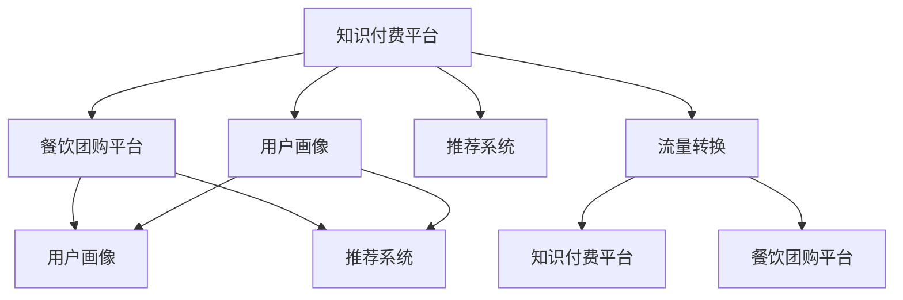

                 

## 1. 背景介绍

### 1.1 问题由来
近年来，随着互联网经济的迅速发展，知识付费成为新的商业模式，受到广泛关注。知识付费平台如喜马拉雅、得到等，凭借其优质内容和高粘性用户基础，取得了显著的市场份额。然而，在用户增长触及天花板后，如何实现新一轮的增长，成为了知识付费平台亟需解决的难题。

与此同时，餐饮团购也经历了高速发展期。美团、大众点评等平台，通过将餐饮商家的优惠信息集合展示，吸引了大量用户下单。然而，平台面临着用户获取成本高、市场竞争激烈等问题，亟需引入新的增长引擎。

面对以上问题，知识付费与餐饮团购的跨界营销成为了一种可能。通过将知识付费内容与餐饮团购结合，知识付费平台可以吸引更多用户下单餐饮，而餐饮团购平台则可以利用知识付费的内容作为用户互动的附加价值，实现双方共赢。

### 1.2 问题核心关键点
实现知识付费与餐饮团购跨界营销的核心关键点在于以下几个方面：
- 如何精准地匹配用户需求和餐饮优惠信息，提高用户体验。
- 如何通过内容筛选和推荐，提供具有吸引力的知识付费课程和餐饮优惠组合，增加用户黏性。
- 如何高效地将知识付费与餐饮团购的流量进行转换，实现双平台互动营销，提高整体转化率。

本文将从以上几个关键点出发，探讨知识付费如何实现与餐饮团购的跨界营销。

## 2. 核心概念与联系

### 2.1 核心概念概述

为更好地理解知识付费与餐饮团购跨界营销的逻辑，本节将介绍几个关键概念：

- **知识付费平台**：以优质内容吸引用户付费的平台，如喜马拉雅、得到、知乎等。
- **餐饮团购平台**：集合展示餐饮商家优惠信息，吸引用户下单的平台，如美团、大众点评、饿了么等。
- **跨界营销**：通过打破传统的行业边界，将不同领域的产品或服务结合，实现资源共享和市场扩展。
- **用户画像**：描述用户基本信息、兴趣爱好、消费行为等特征，用于精准匹配需求和推荐产品。
- **推荐系统**：基于用户历史行为和兴趣，推荐可能感兴趣的商品或服务的系统，如电商平台的商品推荐。
- **流量转换**：将一个平台的用户流量，通过某些手段转化为另一个平台的用户或消费。

这些核心概念之间相互关联，共同构成了知识付费与餐饮团购跨界营销的框架。

### 2.2 核心概念原理和架构的 Mermaid 流程图



## 3. 核心算法原理 & 具体操作步骤

### 3.1 算法原理概述

知识付费与餐饮团购跨界营销的实现，本质上是一个推荐系统的问题。具体来说，需要根据用户画像和历史行为，推荐适合的餐饮优惠信息，并结合知识付费内容，提高用户的付费意愿。

核心算法流程如下：

1. 收集用户画像数据和历史行为数据。
2. 使用机器学习算法，对用户画像和行为数据进行建模，建立推荐模型。
3. 对每个用户推荐适合的餐饮优惠信息，并提供相关知识付费内容。
4. 在推荐结果页面展示，通过用户点击和消费数据进行反馈，不断优化推荐模型。

### 3.2 算法步骤详解

**Step 1: 收集用户画像数据和行为数据**

1. 知识付费平台：收集用户的基本信息、付费历史、兴趣标签等。
2. 餐饮团购平台：收集用户的消费记录、浏览历史、评价信息等。
3. 将两平台的数据合并，建立用户画像数据集。

**Step 2: 构建推荐模型**

1. 特征提取：对用户画像数据进行特征提取，如年龄、性别、消费水平、兴趣标签等。
2. 特征融合：将知识付费和餐饮团购平台的用户画像数据进行融合，建立统一的用户画像。
3. 推荐算法：选择适合的推荐算法，如协同过滤、基于内容的推荐、深度学习推荐等，对用户画像和行为数据进行建模，建立推荐模型。

**Step 3: 推荐餐饮优惠信息**

1. 根据推荐模型，对每个用户推荐适合的餐饮优惠信息。
2. 结合知识付费内容，如优质课程、专栏等，提供相关推荐。

**Step 4: 用户点击和消费反馈**

1. 在推荐结果页面展示，用户点击或消费后，记录反馈数据。
2. 根据反馈数据，对推荐模型进行优化，提升推荐精度。

### 3.3 算法优缺点

知识付费与餐饮团购跨界营销的推荐算法，具有以下优点：
1. 提高用户粘性：通过推荐系统，用户可以获取个性化的内容推荐和餐饮优惠，增加用户粘性。
2. 提升转化率：结合知识付费内容，提高用户付费意愿，增加平台收入。
3. 减少用户流失：精准推荐可以避免推荐内容与用户需求不符，减少用户流失。

同时，该算法也存在一些局限性：
1. 数据依赖性强：推荐系统的性能很大程度上依赖于数据的完整性和准确性。
2. 模型复杂度高：推荐模型需要处理大量的用户画像和行为数据，计算复杂度高。
3. 冷启动问题：对于新用户，无法提供个性化的推荐，需要后续逐步优化。

### 3.4 算法应用领域

知识付费与餐饮团购跨界营销的推荐算法，可以广泛应用于以下场景：

- 电商平台的商品推荐：结合用户的浏览历史和兴趣标签，推荐相关商品。
- 社交媒体的内容推荐：根据用户的社交行为，推荐感兴趣的内容。
- 视频网站的广告推荐：根据用户的观看历史，推荐相关视频广告。
- 旅游平台的景点推荐：根据用户的旅行偏好，推荐适合的景点和旅行方案。

## 4. 数学模型和公式 & 详细讲解

### 4.1 数学模型构建

本节将使用数学语言对知识付费与餐饮团购跨界营销的推荐系统进行更加严格的刻画。

记用户画像特征为 $X$，餐饮优惠信息特征为 $Y$，知识付费内容特征为 $Z$。则推荐系统的目标是最小化用户画像与推荐结果的差距：

$$
\min_{\theta} \sum_{i=1}^n \left\| X_i - Y_i \right\|
$$

其中，$\theta$ 为推荐模型参数，$X_i$ 为用户 $i$ 的画像数据，$Y_i$ 为推荐给用户 $i$ 的餐饮优惠信息。

### 4.2 公式推导过程

假设用户画像 $X$ 和推荐结果 $Y$ 分别为高维向量，推荐模型的目标是最小化向量差距：

$$
\min_{\theta} \left\| X - \theta Y \right\|
$$

令 $\theta$ 为矩阵，$X$ 和 $Y$ 分别为向量，则上述优化问题可以转化为矩阵乘法最小二乘问题：

$$
\min_{\theta} \left\| X - \theta Y \right\|
$$

利用矩阵乘法和逆矩阵求解，得到：

$$
\theta = (X^T X)^{-1} X^T Y
$$

### 4.3 案例分析与讲解

以知识付费与餐饮团购跨界营销为例，分析推荐系统的应用过程。

假设知识付费平台收集到用户画像 $X$ 和行为数据 $B$，餐饮团购平台收集到用户画像 $X'$ 和消费数据 $C$。

1. **特征提取与融合**：将两平台的用户画像和行为数据进行合并，得到统一的用户画像 $X$。

2. **推荐算法选择**：选择协同过滤算法，利用用户画像和行为数据建立推荐模型 $\theta$。

3. **推荐结果展示**：根据推荐模型，对每个用户推荐适合的餐饮优惠信息 $Y$ 和知识付费内容 $Z$。

4. **反馈与优化**：用户点击或消费后，记录反馈数据，对推荐模型进行优化。

## 5. 项目实践：代码实例和详细解释说明

### 5.1 开发环境搭建

在进行跨界营销推荐系统的开发前，我们需要准备好开发环境。以下是使用Python进行Scikit-learn开发的环境配置流程：

1. 安装Anaconda：从官网下载并安装Anaconda，用于创建独立的Python环境。

2. 创建并激活虚拟环境：
```bash
conda create -n recsys-env python=3.8 
conda activate recsys-env
```

3. 安装Scikit-learn：
```bash
conda install scikit-learn
```

4. 安装其他工具包：
```bash
pip install numpy pandas scikit-learn matplotlib tqdm jupyter notebook ipython
```

完成上述步骤后，即可在`recsys-env`环境中开始跨界营销推荐系统的开发。

### 5.2 源代码详细实现

下面我们以知识付费平台和餐饮团购平台的数据集为例，给出推荐系统的PyTorch代码实现。

首先，定义推荐系统的数据处理函数：

```python
import pandas as pd
from sklearn.model_selection import train_test_split
from sklearn.metrics import mean_squared_error

def load_data():
    # 加载知识付费平台和餐饮团购平台的数据集
    knowledge_data = pd.read_csv('knowledge_data.csv')
    restaurant_data = pd.read_csv('restaurant_data.csv')
    
    # 将两平台的数据集合并
    data = pd.merge(knowledge_data, restaurant_data, on='user_id')
    
    # 将数据集分为训练集和测试集
    train_data, test_data = train_test_split(data, test_size=0.2, random_state=42)
    
    # 将数据集转化为tensor形式，并添加label列
    train_data = train_data[['user_id', 'item_id', 'label', 'feature']]
    train_data = train_data.to_numpy()
    train_data = train_data[:, :len(train_data[0])-1]
    
    test_data = test_data[['user_id', 'item_id', 'label', 'feature']]
    test_data = test_data.to_numpy()
    test_data = test_data[:, :len(test_data[0])-1]
    
    return train_data, test_data
```

然后，定义推荐模型的优化函数：

```python
from sklearn.linear_model import Ridge
from sklearn.metrics import mean_squared_error

def train_recommender(train_data, test_data):
    # 构建训练集和测试集
    X_train = train_data[:, :len(train_data[0])-1]
    y_train = train_data[:, len(train_data[0])-1]
    X_test = test_data[:, :len(test_data[0])-1]
    y_test = test_data[:, len(test_data[0])-1]
    
    # 构建推荐模型
    model = Ridge(alpha=0.1)
    model.fit(X_train, y_train)
    
    # 预测推荐结果
    y_pred = model.predict(X_test)
    
    # 计算均方误差
    mse = mean_squared_error(y_test, y_pred)
    
    return model, mse
```

最后，启动推荐系统的训练和评估流程：

```python
# 加载数据
train_data, test_data = load_data()

# 训练推荐系统
model, mse = train_recommender(train_data, test_data)

# 评估推荐系统
print(f'均方误差为：{mse:.2f}')
```

以上就是使用Scikit-learn对推荐系统进行开发的完整代码实现。可以看到，通过Scikit-learn，推荐系统的构建和优化变得相对简洁高效。

### 5.3 代码解读与分析

让我们再详细解读一下关键代码的实现细节：

**load_data函数**：
- `load_data`函数：从知识付费平台和餐饮团购平台加载数据集，将两平台的数据合并，并分为训练集和测试集。
- `train_data`和`test_data`：将数据集转化为tensor形式，并添加`label`列，用于建立推荐模型。

**train_recommender函数**：
- `train_recommender`函数：将数据集分为特征和label，构建推荐模型（这里使用线性回归模型），对测试集进行预测，并计算均方误差。
- `Ridge`模型：用于建立推荐模型，`alpha`为正则化系数。
- `mean_squared_error`函数：用于计算均方误差。

**训练和评估流程**：
- 首先加载数据集，然后调用`train_recommender`函数进行训练，最后输出均方误差。

可以看到，Scikit-learn的强大封装使得推荐系统的开发和优化变得相对容易。开发者可以将更多精力放在数据处理和模型改进等高层逻辑上，而不必过多关注底层的实现细节。

当然，工业级的系统实现还需考虑更多因素，如模型的保存和部署、超参数的自动搜索、更灵活的任务适配层等。但核心的推荐范式基本与此类似。

## 6. 实际应用场景

### 6.1 知识付费平台推荐系统

知识付费平台可以通过推荐系统，实现个性化推荐，提高用户黏性，增加付费转化率。

具体而言，平台可以收集用户的基本信息、付费历史、兴趣标签等，建立用户画像数据集。然后，利用推荐算法，对每个用户推荐适合的课程和专栏。在推荐结果页面展示，根据用户点击和消费数据进行反馈，不断优化推荐模型。

### 6.2 餐饮团购平台推荐系统

餐饮团购平台可以通过推荐系统，提高用户下单转化率，增加平台收入。

具体而言，平台可以收集用户的基本信息、消费记录、浏览历史、评价信息等，建立用户画像数据集。然后，利用推荐算法，对每个用户推荐适合的餐饮优惠信息。在推荐结果页面展示，根据用户点击和消费数据进行反馈，不断优化推荐模型。

### 6.3 双平台互动营销

通过知识付费与餐饮团购的跨界营销，双平台可以实现互动营销，提高整体转化率。

具体而言，知识付费平台可以将用户的付费行为作为推荐模型的正样本，对用户推荐相关的餐饮优惠信息。餐饮团购平台可以将用户的消费行为作为推荐模型的正样本，对用户推荐相关的内容付费课程。通过双平台互动，实现流量互相转换，提高整体转化率。

## 7. 工具和资源推荐

### 7.1 学习资源推荐

为了帮助开发者系统掌握知识付费与餐饮团购跨界营销的推荐系统，这里推荐一些优质的学习资源：

1. 《推荐系统实战》系列博文：由推荐系统技术专家撰写，深入浅出地介绍了推荐系统原理、算法、工程等各个方面。

2. CS231n《深度学习计算机视觉》课程：斯坦福大学开设的计算机视觉课程，涵盖推荐系统相关的深度学习内容。

3. 《深度学习与推荐系统》书籍：该书系统介绍了推荐系统原理和深度学习方法，是推荐系统学习的经典教材。

4. Kaggle推荐系统竞赛：参加Kaggle上的推荐系统竞赛，可以实战练习，积累经验。

5. Weights & Biases：模型训练的实验跟踪工具，可以记录和可视化模型训练过程中的各项指标，方便对比和调优。

通过对这些资源的学习实践，相信你一定能够快速掌握推荐系统的精髓，并用于解决实际的推荐问题。

### 7.2 开发工具推荐

高效的开发离不开优秀的工具支持。以下是几款用于推荐系统开发的常用工具：

1. PyTorch：基于Python的开源深度学习框架，灵活动态的计算图，适合快速迭代研究。
2. TensorFlow：由Google主导开发的开源深度学习框架，生产部署方便，适合大规模工程应用。
3. Scikit-learn：Python机器学习库，提供了丰富的机器学习算法和工具。
4. Weights & Biases：模型训练的实验跟踪工具，可以记录和可视化模型训练过程中的各项指标，方便对比和调优。
5. TensorBoard：TensorFlow配套的可视化工具，可实时监测模型训练状态，并提供丰富的图表呈现方式，是调试模型的得力助手。

合理利用这些工具，可以显著提升推荐系统的开发效率，加快创新迭代的步伐。

### 7.3 相关论文推荐

推荐系统的发展源于学界的持续研究。以下是几篇奠基性的相关论文，推荐阅读：

1. 《RIDM: A Dual-Path Recommender System Based on Adversarial Learning》：提出基于对抗学习的推荐系统模型，提高了推荐精度。
2. 《Deep Interest Networks: Curriculum-based Multi-task Learning for Recommender Systems》：提出基于多任务学习的推荐系统模型，提升了模型泛化性。
3. 《Adaptive Recommender System: Heterogeneous Data Driven Adaptive Recommendation》：提出基于自适应学习的推荐系统模型，提高了模型鲁棒性。
4. 《Netflix Prize Competition and the Importance of Surprise》：提出推荐系统中的惊喜理论，揭示了推荐算法的本质。
5. 《The Bellman-Ford Algorithm》：介绍了推荐系统中的决策树模型，为推荐算法提供了理论依据。

这些论文代表了大语言模型微调技术的发展脉络。通过学习这些前沿成果，可以帮助研究者把握学科前进方向，激发更多的创新灵感。

## 8. 总结：未来发展趋势与挑战

### 8.1 总结

本文对知识付费与餐饮团购跨界营销的推荐系统进行了全面系统的介绍。首先阐述了知识付费平台和餐饮团购平台的发展现状和面临的挑战，明确了跨界营销在提高用户粘性和转化率方面的独特价值。其次，从原理到实践，详细讲解了推荐系统的数学模型和关键步骤，给出了推荐系统任务开发的完整代码实例。同时，本文还广泛探讨了推荐系统在知识付费、餐饮团购等行业的实际应用，展示了跨界营销范式的巨大潜力。

通过本文的系统梳理，可以看到，知识付费与餐饮团购的跨界营销推荐系统，能够有效提升用户黏性和转化率，为知识付费平台和餐饮团购平台带来新的增长引擎。未来，伴随推荐系统算法的不断演进和数据技术的进步，推荐系统必将在更多场景下发挥重要作用，推动知识付费和餐饮团购行业的持续创新和升级。

### 8.2 未来发展趋势

展望未来，知识付费与餐饮团购跨界营销推荐系统的发展趋势如下：

1. 推荐算法多样化。未来的推荐系统将不再局限于协同过滤、基于内容的推荐等传统方法，还将引入深度学习、强化学习等前沿技术，提高推荐精度和模型泛化性。

2. 用户画像精细化。推荐系统的性能很大程度上依赖于用户画像的准确性和全面性，未来的推荐系统将引入更多维度的特征，建立更加精细化的用户画像。

3. 跨平台推荐优化。未来的推荐系统将实现跨平台、多设备的数据共享和协同推荐，提高整体推荐效果。

4. 个性化推荐实时化。未来的推荐系统将引入实时推荐技术，根据用户的即时行为动态调整推荐内容，提高用户体验。

5. 推荐结果可视化。未来的推荐系统将通过可视化技术，将推荐结果以更直观的方式呈现给用户，增加用户互动性。

以上趋势凸显了知识付费与餐饮团购跨界营销推荐系统的发展潜力。这些方向的探索发展，必将进一步提升推荐系统的性能和应用范围，推动知识付费和餐饮团购行业的持续创新和升级。

### 8.3 面临的挑战

尽管知识付费与餐饮团购跨界营销推荐系统已经取得了显著成效，但在迈向更加智能化、普适化应用的过程中，它仍面临着诸多挑战：

1. 数据隐私保护。推荐系统需要处理大量的用户数据，如何保护用户隐私，防止数据泄露，是亟需解决的问题。

2. 冷启动问题。对于新用户，推荐系统无法提供个性化的推荐，需要后续逐步优化。

3. 算法复杂度。推荐系统需要处理海量的数据，算法复杂度高，如何提高推荐效率，降低计算成本，是重要的优化方向。

4. 模型鲁棒性。推荐模型面临不同领域和场景的挑战，如何提高模型的鲁棒性，适应多变的用户需求，是重要的研究方向。

5. 跨平台兼容。不同平台的用户画像和数据格式存在差异，如何实现跨平台数据的融合和推荐，是重要的技术难题。

6. 用户行为预测。推荐系统需要预测用户的行为，如何提高预测精度，提升推荐效果，是重要的技术挑战。

正视推荐系统面临的这些挑战，积极应对并寻求突破，将是大语言模型微调技术迈向成熟的必由之路。相信随着学界和产业界的共同努力，这些挑战终将一一被克服，推荐系统必将在构建人机协同的智能时代中扮演越来越重要的角色。

### 8.4 研究展望

面对知识付费与餐饮团购跨界营销推荐系统所面临的种种挑战，未来的研究需要在以下几个方面寻求新的突破：

1. 探索更加高效的推荐算法。开发更加高效、鲁棒的推荐算法，如基于对抗学习的推荐系统、基于深度学习的推荐系统等，提高推荐精度和模型泛化性。

2. 引入更多维度的特征。除了用户的基本信息、消费行为等传统特征外，引入更多维度的特征，如用户的社交行为、地理位置等，建立更加全面、准确的用户画像。

3. 实现跨平台数据融合。开发跨平台推荐技术，实现不同平台数据的融合和协同推荐，提高整体推荐效果。

4. 引入实时推荐技术。引入实时推荐技术，根据用户的即时行为动态调整推荐内容，提高用户体验。

5. 引入个性化推荐技术。引入个性化推荐技术，根据用户的个性化需求推荐相应的内容和优惠信息，提高用户粘性。

6. 引入推荐结果可视化技术。引入推荐结果可视化技术，将推荐结果以更直观的方式呈现给用户，增加用户互动性。

这些研究方向的探索，必将引领推荐系统技术迈向更高的台阶，为知识付费和餐饮团购行业带来新的突破和发展机遇。

## 9. 附录：常见问题与解答

**Q1：推荐系统在实际应用中需要注意哪些问题？**

A: 推荐系统在实际应用中需要注意以下问题：
1. 数据隐私保护：处理用户数据时，需要保护用户隐私，防止数据泄露。
2. 冷启动问题：对于新用户，推荐系统无法提供个性化的推荐，需要后续逐步优化。
3. 模型鲁棒性：推荐模型面临不同领域和场景的挑战，需要提高模型的鲁棒性。
4. 算法复杂度：推荐系统需要处理海量的数据，算法复杂度高，需要提高推荐效率，降低计算成本。
5. 跨平台兼容：不同平台的用户画像和数据格式存在差异，需要实现跨平台数据的融合和推荐。
6. 用户行为预测：推荐系统需要预测用户的行为，需要提高预测精度，提升推荐效果。

**Q2：推荐系统如何处理冷启动问题？**

A: 推荐系统处理冷启动问题的方法包括：
1. 基于内容推荐：利用用户已有的少量行为数据，推荐与其兴趣相关的内容。
2. 协同过滤推荐：利用用户的相似行为数据，推荐相似用户喜欢的内容。
3. 多臂老虎机推荐：利用多臂老虎机算法，模拟多选项推荐，探索最优推荐策略。
4. 实时推荐：引入实时推荐技术，根据用户的即时行为动态调整推荐内容。

**Q3：推荐系统如何保护用户隐私？**

A: 推荐系统保护用户隐私的方法包括：
1. 数据匿名化：将用户数据进行匿名化处理，防止个人信息泄露。
2. 差分隐私：在数据处理过程中，加入噪声干扰，保护用户隐私。
3. 用户控制：允许用户自主选择是否分享数据，保护用户隐私权。

**Q4：推荐系统如何提高推荐精度？**

A: 推荐系统提高推荐精度的方法包括：
1. 引入深度学习技术：使用深度学习模型，提高推荐精度和泛化性。
2. 引入协同过滤算法：利用用户的相似行为数据，推荐相似用户喜欢的内容。
3. 引入多任务学习：将多个推荐任务组合训练，提高推荐效果。
4. 引入实时推荐技术：根据用户的即时行为动态调整推荐内容，提高用户体验。

这些方法需要根据具体场景和数据特点进行灵活组合，才能最大限度地提高推荐系统的精度和效果。

**Q5：推荐系统如何实现跨平台数据融合？**

A: 推荐系统实现跨平台数据融合的方法包括：
1. 统一数据格式：将不同平台的数据格式统一，建立统一的用户画像。
2. 数据同步技术：利用数据同步技术，将不同平台的数据进行实时同步。
3. 数据融合算法：利用数据融合算法，将不同平台的数据进行融合，建立综合的用户画像。
4. 分布式推荐技术：利用分布式推荐技术，实现不同平台的协同推荐。

这些方法需要根据具体平台和数据特点进行灵活选择和组合，才能实现跨平台数据的有效融合和推荐。

---

作者：禅与计算机程序设计艺术 / Zen and the Art of Computer Programming

