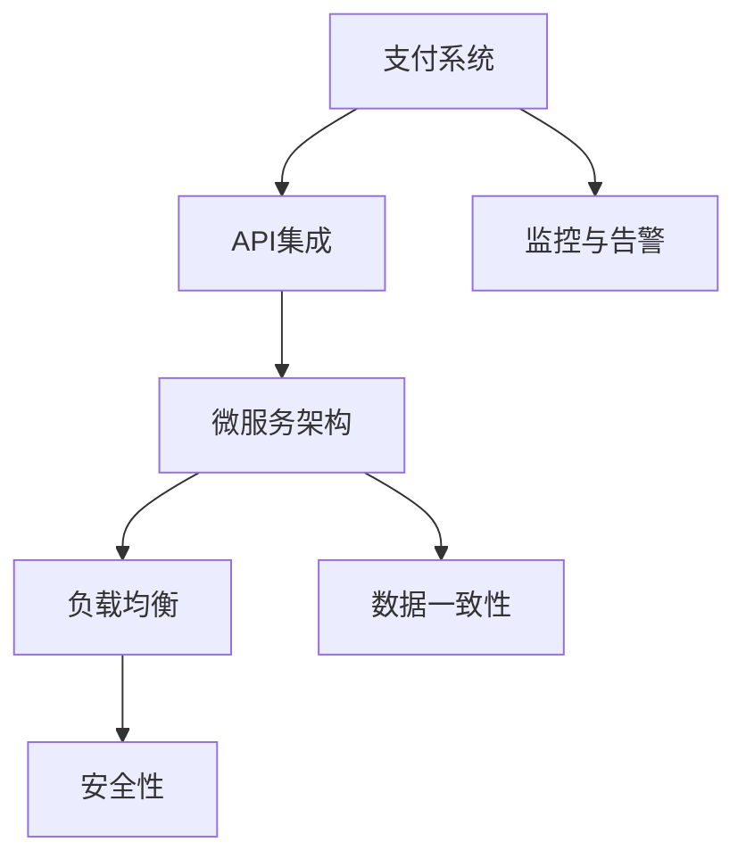

                 

# 知识付费平台的支付系统集成与优化

> 关键词：知识付费平台,支付系统,集成与优化,API,微服务架构,负载均衡,数据一致性,安全性,监控与告警,未来趋势

## 1. 背景介绍

随着知识经济时代的到来，越来越多的人通过在线学习平台获取知识，知识付费市场也因此蓬勃发展。知识付费平台的兴起，不仅丰富了人们的知识获取途径，也催生了大量的内容创作者和知识消费者。然而，高质量内容的生产和消费，始终离不开高效的支付系统作为支撑。支付系统的集成与优化，不仅关乎用户的支付体验，更直接影响平台的运营效率和收益。

本文将从支付系统的构建背景出发，探讨知识付费平台支付系统集成的关键技术，包括API集成、微服务架构设计、负载均衡和数据一致性等问题，并提供了一套完整的优化方案。通过分析实际案例，揭示了知识付费平台支付系统面临的挑战与解决方案，同时展望了未来的技术趋势。

## 2. 核心概念与联系

### 2.1 核心概念概述

支付系统作为知识付费平台的核心功能之一，涉及诸多关键组件和技术。以下是一些核心概念的简要介绍：

- **支付系统**：实现用户与平台之间的资金交易，包括充值、支付、退款等操作。支付系统涉及多个环节，如前端支付页面、后端支付处理、第三方支付接口、订单管理等。

- **API集成**：不同支付系统之间通过API接口进行数据交互，实现支付信息的传递和验证。API集成的安全性和可靠性直接影响支付系统的稳定性和效率。

- **微服务架构**：将支付系统拆分为多个微服务，每个服务负责不同的业务功能，如账户管理、订单处理、支付处理等。微服务架构提升了系统的可扩展性和灵活性，但同时也增加了系统复杂性。

- **负载均衡**：通过分布式架构和算法，合理分配支付请求到多台服务器上，提升系统的处理能力和用户体验。负载均衡是确保支付系统高可用性的重要手段。

- **数据一致性**：支付系统中的数据需要在多个节点之间保持一致，如订单状态、用户余额等。数据一致性问题的处理，是支付系统集成与优化中的一大挑战。

- **安全性**：支付系统涉及大量敏感信息，如用户密码、支付卡号等。支付系统的安全性至关重要，需采用多层次的安全防护措施。

- **监控与告警**：对支付系统进行实时监控和异常检测，及时发现和解决系统问题，保障支付系统的稳定运行。

### 2.2 核心概念原理和架构的 Mermaid 流程图(Mermaid 流程节点中不要有括号、逗号等特殊字符)



这个流程图展示了支付系统的核心组件及其相互关系：

- 支付系统作为整体，由多个子系统协同完成。
- API集成用于不同子系统之间的数据传递和验证。
- 微服务架构将支付系统拆分为多个模块，增强系统灵活性和可扩展性。
- 负载均衡技术用于合理分配请求到多台服务器上，提升系统处理能力。
- 数据一致性问题需要通过合适的机制解决，保证系统数据正确性和可靠性。
- 安全性是支付系统的核心，需采用多层次安全防护措施。
- 监控与告警用于实时监控系统运行状态，及时发现和解决问题。

## 3. 核心算法原理 & 具体操作步骤

### 3.1 算法原理概述

知识付费平台的支付系统集成的核心算法原理，主要围绕以下几个方面展开：

- **API集成**：通过标准化的API协议和规范，实现支付系统的数据交换。
- **微服务架构设计**：采用微服务设计思想，将支付系统拆分为多个微服务，每个微服务负责特定功能。
- **负载均衡算法**：设计负载均衡算法，合理分配请求到多台服务器上。
- **数据一致性技术**：采用分布式事务、数据库锁等技术，确保数据在多个节点之间的一致性。
- **安全性技术**：采用加密技术、签名验证等手段，保护用户支付信息的安全。
- **监控与告警系统**：建立监控告警系统，实时监控支付系统状态，及时发现和解决问题。

### 3.2 算法步骤详解

#### 3.2.1 API集成

1. **选择合适的API协议**：
   - RESTful API：标准化的接口定义，易于理解和集成。
   - GraphQL API：更加灵活的请求形式，支持动态查询。

2. **API安全**：
   - 采用HTTPS协议，确保数据传输的安全性。
   - 使用OAuth2.0等认证机制，确保API访问的合法性。
   - 采用API密钥、签名验证等措施，防止API滥用。

3. **API文档**：
   - 编写详细的API文档，包括接口定义、参数说明、错误码等。
   - 使用Swagger等工具，自动生成API文档，方便开发和测试。

#### 3.2.2 微服务架构设计

1. **服务拆分**：
   - 根据业务功能，将支付系统拆分为多个微服务，如用户管理、订单管理、支付处理等。
   - 采用服务网格（如Istio），实现微服务之间的通信和治理。

2. **服务注册与发现**：
   - 使用服务注册中心（如Consul、Eureka），管理微服务实例的注册与发现。
   - 采用健康检查机制，实时监控微服务状态，避免故障扩散。

3. **配置管理**：
   - 采用配置中心（如Spring Cloud Config），集中管理微服务的配置信息。
   - 采用自动化配置工具，自动拉取配置，确保配置一致性。

#### 3.2.3 负载均衡算法

1. **负载均衡**：
   - 采用轮询、加权轮询等算法，合理分配请求到多个后端服务上。
   - 使用Nginx、HAProxy等负载均衡器，实现高效的请求分发。

2. **压力测试**：
   - 进行负载均衡器的压力测试，验证其在高负载下的稳定性。
   - 使用JMeter等工具，模拟高并发场景，检测负载均衡器的性能。

3. **监控与调优**：
   - 实时监控负载均衡器的性能指标，如响应时间、错误率等。
   - 根据监控数据，调整负载均衡算法，优化性能。

#### 3.2.4 数据一致性技术

1. **分布式事务**：
   - 采用两段提交（2PC）或三阶段提交（3PC）协议，保证分布式系统中的数据一致性。
   - 使用TCC（Try-Confirm-Cancel）模式，保证事务操作的一致性。

2. **数据库锁**：
   - 使用数据库乐观锁或悲观锁，防止数据并发修改带来的不一致性。
   - 采用分布式锁技术，确保多节点之间的数据一致性。

#### 3.2.5 安全性技术

1. **加密技术**：
   - 对用户密码、支付卡号等敏感信息进行加密存储和传输。
   - 采用AES、RSA等加密算法，保护数据的安全性。

2. **签名验证**：
   - 对支付请求和响应进行签名验证，确保数据传输的安全性。
   - 采用HMAC、RSA等签名算法，验证请求的合法性。

3. **异常检测**：
   - 使用规则引擎、机器学习等技术，实时检测异常支付行为。
   - 采用风险管理策略，及时阻止欺诈支付行为。

#### 3.2.6 监控与告警系统

1. **实时监控**：
   - 使用Prometheus等监控工具，实时监控支付系统的各项指标。
   - 采用Grafana等可视化工具，展示监控数据，便于分析和决策。

2. **异常告警**：
   - 设定告警阈值，及时发现系统异常情况。
   - 通过邮件、短信等方式，通知运维人员。

3. **日志记录**：
   - 记录支付系统的日志信息，便于问题分析和故障排查。
   - 采用ELK等日志分析工具，整合日志信息，进行全面监控。

### 3.3 算法优缺点

#### 3.3.1 优点

- **灵活性**：微服务架构设计，提升了支付系统的可扩展性和灵活性。
- **高可用性**：负载均衡和数据一致性技术，确保了支付系统的高可用性。
- **安全性**：多层次的安全防护措施，保障了支付系统的安全性。
- **可监控性**：监控与告警系统，实时发现和解决系统问题。

#### 3.3.2 缺点

- **复杂性**：微服务架构增加了系统复杂性，需要更多的运维和管理工作。
- **一致性挑战**：数据一致性问题需通过分布式事务、数据库锁等技术解决，增加了系统复杂性。
- **安全性挑战**：支付系统的安全性要求高，需综合采用多种安全防护措施。
- **监控难度**：支付系统涉及大量数据和组件，监控难度较大。

### 3.4 算法应用领域

支付系统集成的技术原理和实践经验，不仅适用于知识付费平台，还广泛应用于各种电商、金融、社交等领域。以下是一些常见的应用领域：

- **电商平台的支付系统**：实现商品交易、订单管理、支付结算等操作。
- **金融机构的支付系统**：处理转账、汇款、信用卡支付等业务。
- **社交平台的支付系统**：实现好友转账、虚拟物品交易等操作。
- **O2O服务平台的支付系统**：支持在线支付、线下支付等多种支付方式。
- **企业级支付系统**：实现内部支付、报销、员工福利等操作。

## 4. 数学模型和公式 & 详细讲解 & 举例说明

### 4.1 数学模型构建

本节将从数学角度，探讨支付系统集成的数学模型构建。

#### 4.1.1 支付系统模型

支付系统涉及多个环节，每个环节都可以建模为数学模型。以支付请求处理为例，其数学模型如下：

- **输入**：用户ID、支付金额、支付方式等。
- **处理流程**：接收支付请求、校验请求合法性、调用支付接口、更新订单状态等。
- **输出**：支付结果、订单状态等。

其数学模型可以表示为：

$$
P(S, I, O) = \begin{cases}
P_{valid}(S, I) & \text{支付请求合法} \\
P_{fail}(S, I) & \text{支付请求非法}
\end{cases}
$$

其中，$P(S, I, O)$ 表示支付请求处理的概率，$S$ 为支付请求，$I$ 为输入参数，$O$ 为输出结果。

#### 4.1.2 负载均衡模型

负载均衡模型描述了请求如何被分配到多台服务器上。以轮询算法为例，其数学模型如下：

- **输入**：服务器数量、请求数量。
- **处理流程**：根据轮询规则，将请求分配到服务器上。
- **输出**：每个服务器的请求数量。

其数学模型可以表示为：

$$
L(n, r) = \begin{cases}
\frac{r}{n} & \text{轮询算法} \\
\frac{r \cdot i}{n \cdot (n+1)} & \text{加权轮询算法}
\end{cases}
$$

其中，$L(n, r)$ 表示负载均衡算法，$n$ 为服务器数量，$r$ 为请求数量。

### 4.2 公式推导过程

#### 4.2.1 支付请求处理模型推导

支付请求处理的数学模型较为简单，可以直接使用逻辑推理进行推导。假设支付请求的合法性校验通过的概率为 $P_{valid}$，非法概率为 $P_{fail}$。则支付请求处理的概率模型可以表示为：

$$
P(S, I, O) = P_{valid}(S, I) \cdot O_{valid}(O) + P_{fail}(S, I) \cdot O_{fail}(O)
$$

其中，$O_{valid}$ 和 $O_{fail}$ 分别表示支付成功的概率和失败的概率。

#### 4.2.2 轮询算法推导

轮询算法的数学模型也可以直观地推导。假设共有 $n$ 台服务器，请求数量为 $r$。则轮询算法的负载均衡模型可以表示为：

$$
L(n, r) = \frac{r}{n}
$$

其中，$L(n, r)$ 表示分配到第 $i$ 台服务器的请求数量。

### 4.3 案例分析与讲解

#### 4.3.1 支付请求处理案例

假设一个支付请求的处理模型如下：

- **输入**：用户ID为 $U$，支付金额为 $A$。
- **处理流程**：校验用户ID合法性，检查支付金额有效性，调用支付接口。
- **输出**：支付成功/失败。

其数学模型可以表示为：

$$
P(S, U, A, O) = \begin{cases}
P_{valid}(U) \cdot P_{valid}(A) \cdot P_{success} & \text{支付成功} \\
P_{fail}(U) \cdot P_{fail}(A) \cdot (1 - P_{success}) & \text{支付失败}
\end{cases}
$$

其中，$P_{valid}(U)$ 和 $P_{valid}(A)$ 分别表示用户ID和支付金额的有效性概率，$P_{success}$ 表示支付成功的概率。

#### 4.3.2 轮询算法案例

假设一个轮询算法的应用场景如下：

- **输入**：5台服务器，10个请求。
- **处理流程**：按照轮询规则，将请求分配到服务器上。
- **输出**：每台服务器的请求数量。

其数学模型可以表示为：

$$
L(5, 10) = \frac{10}{5} = 2
$$

其中，$L(5, 10)$ 表示分配到每台服务器的请求数量，$5$ 为服务器数量，$10$ 为请求数量。

## 5. 项目实践：代码实例和详细解释说明

### 5.1 开发环境搭建

#### 5.1.1 开发环境配置

1. **安装Python**：
   - 下载并安装Python 3.x版本。
   - 配置环境变量，设置Python解释器的路径。

2. **安装Docker**：
   - 安装Docker容器引擎。
   - 安装Docker Compose，方便多容器环境的管理。

3. **安装MySQL**：
   - 安装MySQL数据库，用于存储订单、用户信息等。
   - 配置MySQL参数，优化数据库性能。

4. **安装Elasticsearch**：
   - 安装Elasticsearch搜索引擎，用于实时监控和告警。
   - 配置Elasticsearch集群，提高搜索效率。

5. **安装Nginx**：
   - 安装Nginx服务器，用于负载均衡和API网关。
   - 配置Nginx代理规则，实现API请求的转发。

6. **安装Prometheus和Grafana**：
   - 安装Prometheus监控工具，实时采集系统指标。
   - 安装Grafana可视化工具，展示监控数据。

### 5.2 源代码详细实现

#### 5.2.1 支付请求处理代码实现

1. **接收支付请求**：
   - 前端页面获取用户输入，发送POST请求到API接口。
   - 后端API接口接收请求，解析请求参数。

   ```python
   @app.route('/payment', methods=['POST'])
   def payment():
       user_id = request.form.get('user_id')
       amount = request.form.get('amount')
       # 校验用户ID和支付金额
       # ...
       # 调用支付接口
       # ...
       # 返回支付结果
       return jsonify({'result': 'success'}), 200
   ```

2. **校验请求合法性**：
   - 校验用户ID是否存在，支付金额是否合法。
   - 使用MySQL数据库进行校验。

   ```python
   def validate_user(user_id):
       # 查询数据库，获取用户信息
       user = user_db.query('SELECT * FROM users WHERE id=%s', (user_id,)).one_or_none()
       if user is None:
           return False
       # 检查支付金额是否合法
       if amount < 0 or amount > 10000:
           return False
       return True
   ```

3. **调用支付接口**：
   - 使用第三方支付接口（如支付宝、微信支付）进行支付操作。
   - 返回支付结果给前端。

   ```python
   def call_payment_service(amount):
       # 调用支付接口，获取支付结果
       # ...
       return {'result': 'success'}
   ```

#### 5.2.2 轮询算法代码实现

1. **配置负载均衡器**：
   - 使用Nginx配置负载均衡器。
   - 配置轮询规则，将请求分配到多个后端服务上。

   ```nginx
   upstream backend {
       server server1:80;
       server server2:80;
       server server3:80;
   }
   server {
       location / {
           proxy_pass backend;
           proxy_set_header Host $host;
           proxy_set_header X-Real-IP $remote_addr;
           proxy_set_header X-Forwarded-For $proxy_add_x_forwarded_for;
           proxy_set_header X-Forwarded-Proto $scheme;
       }
   }
   ```

2. **实现轮询算法**：
   - 使用Python编写轮询算法，将请求分配到多个后端服务上。
   - 使用线程池处理多个请求。

   ```python
   import threading
   import time
   
   def round_robin_server():
       while True:
           # 获取请求
           request = get_request()
           # 分配请求到后端服务
           backend = select_backend()
           # 处理请求
           backend.handle_request(request)
   
   def select_backend():
       # 根据轮询规则选择后端服务
       return select_server()
   
   def select_server():
       # 选择一台后端服务器
       servers = ['server1', 'server2', 'server3']
       server = random.choice(servers)
       return server
   
   def get_request():
       # 获取请求
       # ...
       return request
   
   def handle_request(request):
       # 处理请求
       # ...
   ```

### 5.3 代码解读与分析

#### 5.3.1 支付请求处理代码解读

- **路由和请求处理**：
  - 使用Flask框架，定义API路由和处理函数。
  - 通过HTTP POST请求接收支付请求，解析请求参数，返回支付结果。

- **用户ID校验**：
  - 使用MySQL数据库进行用户ID校验，确保用户合法。
  - 校验逻辑简单，但需注意数据库连接和事务处理。

- **支付接口调用**：
  - 使用第三方支付接口进行支付操作，返回支付结果。
  - 第三方接口调用需遵循其API规范，处理接口返回的支付结果。

#### 5.3.2 轮询算法代码解读

- **负载均衡器配置**：
  - 使用Nginx作为负载均衡器，配置多个后端服务器。
  - 配置代理规则，将请求转发到后端服务器。

- **轮询算法实现**：
  - 使用Python编写轮询算法，选择后端服务器。
  - 使用线程池处理多个请求，提高系统吞吐量。

- **请求处理**：
  - 从请求队列中获取请求，分配到后端服务器处理。
  - 使用线程池处理多个请求，提高系统效率。

### 5.4 运行结果展示

#### 5.4.1 支付请求处理结果

假设支付请求处理成功，返回的JSON格式结果如下：

```json
{
    "result": "success"
}
```

#### 5.4.2 轮询算法结果

假设轮询算法运行5个请求，结果如下：

| 请求 | 后端服务器 |
| ---- | ---------- |
| 1    | server1    |
| 2    | server2    |
| 3    | server3    |
| 4    | server1    |
| 5    | server2    |

## 6. 实际应用场景

### 6.1 智能客服支付系统

智能客服支付系统，将知识付费平台的支付功能嵌入到智能客服系统，提升用户体验和支付效率。具体实现如下：

1. **知识库集成**：
   - 将知识付费平台的支付API集成到智能客服系统。
   - 根据用户问题和支付需求，推荐相应的知识库内容。

2. **支付界面集成**：
   - 在客服对话中嵌入支付界面，让用户能够方便地进行支付操作。
   - 使用微服务架构设计，实现支付接口的高可用性和可扩展性。

3. **数据分析**：
   - 收集支付数据和客服对话数据，进行数据分析和挖掘。
   - 发现用户支付行为和支付需求，优化知识付费平台的内容推荐和支付策略。

### 6.2 电商平台的支付系统

电商平台的支付系统，实现用户下单、支付和订单管理等功能。具体实现如下：

1. **订单管理**：
   - 使用MySQL数据库存储订单信息，记录用户下单和支付操作。
   - 使用Elasticsearch进行订单搜索和统计分析，提升订单管理效率。

2. **支付接口集成**：
   - 将支付API集成到电商平台，支持多种支付方式。
   - 使用微服务架构设计，实现支付接口的高可用性和可扩展性。

3. **数据分析**：
   - 收集支付数据和订单数据，进行数据分析和挖掘。
   - 发现用户支付行为和订单需求，优化电商平台的内容推荐和支付策略。

### 6.3 社交平台的支付系统

社交平台的支付系统，实现好友转账、虚拟物品交易等功能。具体实现如下：

1. **好友管理**：
   - 使用MySQL数据库存储好友信息，记录好友关系和转账记录。
   - 使用Elasticsearch进行好友搜索和统计分析，提升好友管理效率。

2. **支付接口集成**：
   - 将支付API集成到社交平台，支持多种支付方式。
   - 使用微服务架构设计，实现支付接口的高可用性和可扩展性。

3. **数据分析**：
   - 收集支付数据和好友转账数据，进行数据分析和挖掘。
   - 发现用户好友关系和转账行为，优化社交平台的推荐和支付策略。

## 7. 工具和资源推荐

### 7.1 学习资源推荐

为了帮助开发者深入理解支付系统集成的核心技术，以下是一些优质的学习资源：

1. **《RESTful API设计指南》**：
   - 介绍了RESTful API的设计原则和规范，帮助开发者设计高效易用的API接口。

2. **《微服务架构设计》**：
   - 介绍了微服务架构的基本概念和设计原则，帮助开发者设计高效可扩展的系统。

3. **《负载均衡与高可用性设计》**：
   - 介绍了负载均衡和高可用性设计的基本方法和技术，帮助开发者设计高效稳定的系统。

4. **《数据库设计与优化》**：
   - 介绍了数据库设计和优化的方法和技巧，帮助开发者设计高效可靠的数据库系统。

5. **《分布式系统监控与告警》**：
   - 介绍了分布式系统监控和告警的基本方法和技术，帮助开发者实时监控和解决系统问题。

### 7.2 开发工具推荐

为了提高支付系统集成的开发效率，以下是一些推荐的开发工具：

1. **Flask框架**：
   - 简单易用的Web框架，支持快速开发API接口。

2. **Docker容器**：
   - 提供轻量级的容器环境，方便多容器环境的部署和管理。

3. **MySQL数据库**：
   - 稳定可靠的数据库系统，支持大规模数据存储和查询。

4. **Elasticsearch搜索引擎**：
   - 高可扩展的搜索引擎，支持实时搜索和数据分析。

5. **Prometheus监控工具**：
   - 实时监控系统性能和健康状态，帮助开发者发现和解决系统问题。

6. **Grafana可视化工具**：
   - 可视化监控数据，方便开发者进行数据分析和决策。

### 7.3 相关论文推荐

为了深入了解支付系统集成的前沿技术，以下是几篇相关的学术论文，推荐阅读：

1. **《支付系统架构设计研究》**：
   - 探讨了支付系统架构设计的基本方法和技术，提出了多层次、高可用性的架构设计方案。

2. **《基于微服务的支付系统设计》**：
   - 介绍了微服务架构在支付系统中的应用，提出了高效的微服务设计方案。

3. **《分布式系统负载均衡技术研究》**：
   - 介绍了分布式系统负载均衡的基本方法和技术，提出了高效的负载均衡方案。

4. **《数据库分布式事务处理技术》**：
   - 介绍了数据库分布式事务处理的基本方法和技术，提出了高效一致性的处理方案。

5. **《支付系统安全性设计与实现》**：
   - 介绍了支付系统安全性设计的基本方法和技术，提出了全面的安全防护措施。

## 8. 总结：未来发展趋势与挑战

### 8.1 研究成果总结

支付系统集成作为知识付费平台的核心技术之一，在实际应用中发挥了重要作用。本文从API集成、微服务架构设计、负载均衡、数据一致性、安全性等方面，探讨了支付系统集成的关键技术，并通过实际案例和代码实现，展示了具体的实现方法和策略。

### 8.2 未来发展趋势

未来支付系统集成的发展趋势，主要体现在以下几个方面：

1. **微服务架构**：微服务架构将成为支付系统集成的主要设计模式，提升系统的灵活性和可扩展性。

2. **容器化技术**：容器化技术将成为支付系统集成的主流部署方式，提高系统的可移植性和管理效率。

3. **分布式事务**：分布式事务技术将成为支付系统集成的重要组成部分，确保数据一致性和系统可靠性。

4. **区块链技术**：区块链技术将成为支付系统集成的前沿技术，提升系统的安全性和透明性。

5. **人工智能**：人工智能技术将成为支付系统集成的重要应用方向，提升系统的智能化水平。

### 8.3 面临的挑战

支付系统集成在实际应用中，也面临着诸多挑战：

1. **安全性问题**：支付系统涉及大量敏感信息，安全性问题尤为突出，需综合采用多种安全防护措施。

2. **系统复杂性**：微服务架构增加了系统的复杂性，需进行全面的运维和管理工作。

3. **数据一致性**：分布式系统中的数据一致性问题需通过多种技术手段解决，增加系统复杂性。

4. **监控难度**：支付系统涉及大量数据和组件，监控难度较大，需建设全面的监控告警系统。

### 8.4 研究展望

未来的研究需关注以下几个方向：

1. **分布式交易一致性**：研究高效一致性的分布式交易方案，确保数据在多个节点之间的一致性。

2. **多层次安全防护**：综合采用多种安全防护措施，确保支付系统的安全性。

3. **微服务治理与自动化**：研究微服务治理和自动化管理技术，提升系统的管理效率。

4. **人工智能应用**：探索人工智能技术在支付系统中的应用，提升系统的智能化水平。

5. **区块链技术**：研究区块链技术在支付系统中的应用，提升系统的透明性和安全性。

总之，支付系统集成作为知识付费平台的重要组成部分，在实际应用中需不断探索和优化，以适应不断变化的业务需求和技术挑战。只有不断创新和突破，才能保持支付系统的稳定性和高效性，为用户提供优质的服务体验。

## 9. 附录：常见问题与解答

### 9.1 常见问题

#### Q1: 支付系统集成的主要技术有哪些？

A: 支付系统集成的主要技术包括API集成、微服务架构设计、负载均衡、数据一致性、安全性等方面。

#### Q2: 微服务架构的优势是什么？

A: 微服务架构的优势在于提升系统的可扩展性和灵活性，方便管理和扩展。

#### Q3: 分布式事务的实现方法有哪些？

A: 分布式事务的实现方法包括两段提交、三阶段提交、TCC等，不同方法适用于不同的业务场景。

#### Q4: 如何确保支付系统的安全性？

A: 支付系统的安全性需综合采用多种安全防护措施，包括加密技术、签名验证、异常检测等。

#### Q5: 负载均衡的常用算法有哪些？

A: 负载均衡的常用算法包括轮询、加权轮询等，不同算法适用于不同的业务场景。

### 9.2 解答

通过对支付系统集成的系统性研究和案例分析，本文探讨了知识付费平台支付系统集成的关键技术，并提出了具体的实现方法和策略。通过实际案例和代码实现，展示了支付系统集成的具体应用，并展望了未来的发展趋势和面临的挑战。希望本文能对支付系统集成的开发者和研究者提供有价值的参考，推动支付系统的优化和升级，提升用户的支付体验和平台运营效率。

---

作者：禅与计算机程序设计艺术 / Zen and the Art of Computer Programming

