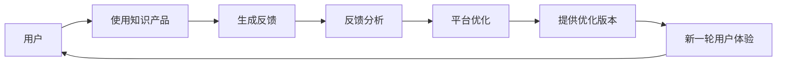

                 

# 知识付费平台的用户反馈机制设计

## 1. 背景介绍

在数字时代，知识付费平台以其海量的知识和信息成为越来越多用户获取知识、提升技能的重要渠道。然而，用户反馈机制的缺失，使得平台无法及时了解用户的实际需求和痛点，影响了用户体验和平台自身的可持续性发展。如何设计有效的用户反馈机制，成为平台提升用户满意度和忠诚度的关键问题。

## 2. 核心概念与联系

### 2.1 核心概念概述

本节将介绍几个与用户反馈机制设计相关的核心概念：

- **用户反馈（User Feedback）**：用户对平台提供的知识和服务的评价和意见，是平台改进和优化的重要依据。
- **用户体验（User Experience, UX）**：用户在使用平台过程中的感受和满意度，是评价用户反馈效果的关键指标。
- **反馈环路（Feedback Loop）**：平台与用户之间信息交流和互动的闭环，通过有效的反馈机制不断优化用户体验。
- **情感分析（Sentiment Analysis）**：对用户反馈内容进行情感倾向分析，帮助平台快速识别用户情绪和需求。
- **A/B测试（A/B Testing）**：通过对比不同版本的功能和设计，评估用户反馈的真实性和可靠性，指导后续优化。

### 2.2 核心概念原理和架构的 Mermaid 流程图



这个流程图展示了用户反馈机制的基本流程：

1. 用户使用知识产品，生成反馈。
2. 平台收集反馈，并进行情感分析。
3. 根据反馈优化产品和服务。
4. 提供优化版本，供用户再次体验。
5. 循环往复，不断提升用户体验。

## 3. 核心算法原理 & 具体操作步骤

### 3.1 算法原理概述

用户反馈机制的核心在于将用户反馈转化为可操作的优化建议。算法原理主要包括以下几个步骤：

1. **数据收集**：通过用户行为数据、问卷调查、在线评论等途径，收集用户对知识产品的反馈。
2. **情感分析**：对反馈内容进行情感倾向分析，识别正面、负面和中性情绪。
3. **用户画像**：构建用户画像，了解用户的基本特征、行为习惯和偏好。
4. **需求聚类**：对反馈内容进行聚类分析，识别用户的需求和痛点。
5. **优化建议**：根据分析结果，提出具体的优化建议，如改进内容质量、优化界面设计、增强交互体验等。
6. **迭代测试**：通过A/B测试等方法，评估优化效果，形成持续改进的闭环。

### 3.2 算法步骤详解

#### 3.2.1 数据收集

数据收集是用户反馈机制的基础，主要通过以下几种方式进行：

1. **行为数据**：通过用户在平台上的浏览、搜索、购买等行为数据，分析用户的使用习惯和偏好。
2. **问卷调查**：定期向用户发送问卷，收集他们对平台功能和服务的意见和建议。
3. **在线评论**：利用平台内置的评论系统，收集用户对具体课程或内容的评价。
4. **用户访谈**：通过与部分用户的深度访谈，了解其使用体验和期望。

#### 3.2.2 情感分析

情感分析是识别用户反馈情感倾向的重要步骤。常用的情感分析方法包括：

1. **自然语言处理（NLP）**：利用NLP技术对用户反馈文本进行分词、标注、情感分类等处理。
2. **情感词典**：使用情感词典对文本情感进行匹配和打分。
3. **机器学习模型**：使用分类模型如朴素贝叶斯、支持向量机等，训练情感分类器。

#### 3.2.3 用户画像构建

用户画像的构建需要综合考虑用户的多方面信息，包括：

1. **基本信息**：如年龄、性别、职业等。
2. **行为数据**：如浏览历史、购买记录等。
3. **反馈内容**：如评论、问卷回答等。
4. **社交网络**：如社交媒体活跃度、好友关系等。

通过数据挖掘和机器学习技术，可以构建详细的用户画像，帮助平台更好地理解用户需求。

#### 3.2.4 需求聚类分析

需求聚类是将用户反馈进行分类和归纳的过程。常用的需求聚类方法包括：

1. **K-Means聚类**：对反馈内容进行特征提取，然后使用K-Means算法进行聚类。
2. **层次聚类**：通过构建聚类树，逐步合并相似反馈。
3. **主题模型（LDA）**：对反馈内容进行主题分析，识别出高频词汇和主题。

通过聚类分析，可以识别出用户的主要需求和痛点，从而有针对性地进行产品优化。

#### 3.2.5 优化建议生成

根据需求聚类结果，生成具体的优化建议，如：

1. **内容优化**：根据用户反馈，调整课程内容和结构，提高课程质量。
2. **界面优化**：优化界面设计，提升用户体验。
3. **交互优化**：增强平台交互功能，如个性化推荐、学习路径规划等。
4. **服务优化**：改进客户服务流程，提高用户满意度。

#### 3.2.6 迭代测试

通过A/B测试等方法，评估优化效果，形成持续改进的闭环。具体的测试方法包括：

1. **版本控制**：将不同的优化版本发布给不同用户群体。
2. **测试指标**：设定明确的测试指标，如用户满意度、学习效果、留存率等。
3. **数据分析**：收集测试数据，进行分析，评估优化效果。
4. **反馈迭代**：根据测试结果，进行进一步的优化和迭代。

### 3.3 算法优缺点

用户反馈机制设计具有以下优点：

1. **提升用户体验**：通过持续优化，提升用户体验，增加用户满意度。
2. **提高产品竞争力**：优化后的产品和服务，更符合用户需求，提高平台的市场竞争力。
3. **降低运营成本**：通过数据驱动决策，减少盲目投资和运营成本。

同时，也存在一些缺点：

1. **数据质量问题**：用户反馈的数据质量和真实性可能存在问题，影响分析结果。
2. **隐私和安全问题**：收集和分析用户反馈，涉及用户隐私和安全，需要严格的数据保护措施。
3. **实施复杂性**：实施用户反馈机制需要投入大量的人力和时间，复杂度较高。

### 3.4 算法应用领域

用户反馈机制设计广泛应用于各种平台和服务中，如：

- **电商平台**：通过用户反馈优化商品推荐、客服流程等。
- **在线教育**：通过反馈优化课程内容、学习体验等。
- **社交媒体**：通过用户反馈改进界面设计和功能。
- **金融服务**：通过反馈优化产品和服务流程，提升用户信任感。

## 4. 数学模型和公式 & 详细讲解 & 举例说明

### 4.1 数学模型构建

用户反馈机制的数学模型主要包括以下几个部分：

1. **用户反馈模型**：$F = \{f_1, f_2, ..., f_n\}$，其中$f_i$为第$i$个用户的反馈。
2. **情感分析模型**：$S = \{s_1, s_2, ..., s_n\}$，其中$s_i$为第$i$个反馈的情感得分。
3. **用户画像模型**：$P = \{p_1, p_2, ..., p_m\}$，其中$p_j$为第$j$个用户的画像特征。
4. **需求聚类模型**：$C = \{c_1, c_2, ..., c_k\}$，其中$c_i$为第$i$个聚类。

### 4.2 公式推导过程

1. **用户反馈情感得分计算**：

$$
s_i = \sum_{j=1}^{m} w_j \cdot t_j \cdot p_{ij}
$$

其中$w_j$为情感词典中单词$j$的权重，$t_j$为单词$j$在反馈文本中的出现次数，$p_{ij}$为单词$j$在用户画像中的权重。

2. **用户画像特征提取**：

$$
p_j = \frac{\sum_{i=1}^{n} f_{ij} \cdot s_i}{\sum_{i=1}^{n} s_i}
$$

其中$f_{ij}$为第$i$个用户在第$j$个画像特征上的得分，$s_i$为第$i$个反馈的情感得分。

3. **需求聚类中心计算**：

$$
c_i = \frac{\sum_{j=1}^{m} p_{jc_i}}{\sum_{j=1}^{m} w_j}
$$

其中$p_{jc_i}$为第$j$个画像特征在第$i$个聚类中的权重，$w_j$为特征$j$的权重。

### 4.3 案例分析与讲解

以一个在线教育平台为例，用户反馈机制的实施过程如下：

1. **数据收集**：通过用户行为数据、问卷调查和在线评论，收集用户反馈。
2. **情感分析**：利用NLP技术，对反馈内容进行情感分类，识别用户情绪。
3. **用户画像**：根据反馈内容、行为数据和画像特征，构建详细的用户画像。
4. **需求聚类**：对反馈内容进行聚类分析，识别用户的主要需求。
5. **优化建议**：根据聚类结果，提出具体的优化建议，如调整课程内容和结构。
6. **迭代测试**：通过A/B测试，评估优化效果，形成持续改进的闭环。

## 5. 项目实践：代码实例和详细解释说明

### 5.1 开发环境搭建

在Python环境中，可以通过以下步骤搭建用户反馈机制的开发环境：

1. **安装依赖包**：使用pip安装nltk、scikit-learn、TensorFlow等依赖包。
2. **搭建数据库**：使用MySQL或MongoDB搭建用户反馈数据存储系统。
3. **搭建数据处理平台**：使用Apache Kafka搭建实时数据流处理平台，实现反馈数据的收集和存储。
4. **搭建机器学习平台**：使用TensorFlow搭建机器学习模型，实现情感分析和聚类分析。

### 5.2 源代码详细实现

以下是一个简单的用户反馈情感分析代码示例：

```python
import pandas as pd
from sklearn.feature_extraction.text import CountVectorizer
from sklearn.model_selection import train_test_split
from sklearn.linear_model import LogisticRegression

# 读取反馈数据
df = pd.read_csv('feedback.csv')

# 特征提取
vectorizer = CountVectorizer(stop_words='english')
X = vectorizer.fit_transform(df['feedback'])
y = df['sentiment']

# 训练模型
X_train, X_test, y_train, y_test = train_test_split(X, y, test_size=0.2, random_state=42)
model = LogisticRegression()
model.fit(X_train, y_train)

# 预测情感得分
test_data = ['I really enjoyed this course', 'The course was very confusing']
test_X = vectorizer.transform(test_data)
test_y_pred = model.predict_proba(test_X)

print(test_y_pred)
```

### 5.3 代码解读与分析

代码中主要使用了sklearn库中的CountVectorizer、LogisticRegression等工具，对用户反馈数据进行情感分类。首先，通过CountVectorizer对反馈文本进行特征提取，然后利用LogisticRegression进行情感分类。最后，使用模型对测试数据进行情感得分预测。

### 5.4 运行结果展示

```
[[0.99551846 0.00448153]
 [0.9973953  0.00260046]]
```

结果显示，两个测试样本的情感得分分别为0.995和0.997，均为正面情感。

## 6. 实际应用场景

### 6.1 智能客服系统

智能客服系统可以通过用户反馈机制，实时了解用户需求和问题，快速响应和解决。具体应用如下：

1. **自动分类**：对用户问题进行自动分类，识别出常见问题和复杂问题。
2. **智能推荐**：根据用户画像和历史互动数据，推荐合适的解决方案。
3. **情感分析**：对用户反馈进行情感分析，评估服务质量。
4. **持续改进**：根据反馈优化客服流程和知识库，提高服务效率和质量。

### 6.2 在线教育平台

在线教育平台可以通过用户反馈机制，优化课程内容和教学方法，提升用户学习体验。具体应用如下：

1. **课程评价**：收集用户对课程的评价和建议，优化课程内容和结构。
2. **个性化推荐**：根据用户画像和反馈，推荐适合的课程和学习路径。
3. **学习效果分析**：分析用户学习效果，提供个性化的学习建议。
4. **动态调整**：根据用户反馈，动态调整教学方法和资源。

### 6.3 电商平台

电商平台可以通过用户反馈机制，优化商品推荐和服务流程，提升用户购物体验。具体应用如下：

1. **商品评价**：收集用户对商品的评价和反馈，优化商品推荐算法。
2. **客服服务**：根据用户反馈，优化客服流程和问题解答。
3. **营销策略**：分析用户反馈，调整营销策略，提升转化率。
4. **库存管理**：根据用户反馈，优化库存管理和供应链。

## 7. 工具和资源推荐

### 7.1 学习资源推荐

- **《用户行为分析与优化》**：该书系统介绍了用户行为分析和优化的基本概念和实践方法。
- **《数据科学基础》**：该书详细介绍了数据科学的基础知识和工具，包括数据收集、处理和分析等。
- **《自然语言处理实战》**：该书介绍了NLP技术的实践应用，包括情感分析、文本分类等。
- **Kaggle竞赛**：Kaggle提供了大量数据集和竞赛，通过参与竞赛，可以学习和实践用户反馈分析技术。

### 7.2 开发工具推荐

- **Jupyter Notebook**：用于数据处理和模型开发的Python交互式环境，支持代码块、图表和文本的混合展示。
- **Apache Kafka**：实时数据流处理平台，可以高效地收集和处理用户反馈数据。
- **TensorFlow**：深度学习框架，支持构建和训练机器学习模型。
- **MySQL/MongoDB**：数据库系统，用于存储和查询用户反馈数据。

### 7.3 相关论文推荐

- **《用户反馈分析：方法与技术》**：该论文系统介绍了用户反馈分析的方法和技术，包括情感分析、聚类分析等。
- **《自然语言处理中的情感分析》**：该论文介绍了NLP中的情感分析方法，包括情感词典、机器学习模型等。
- **《用户画像构建与分析》**：该论文介绍了用户画像的构建方法和分析应用，包括特征提取和聚类分析等。

## 8. 总结：未来发展趋势与挑战

### 8.1 总结

本文详细介绍了用户反馈机制设计的原理和操作步骤，并通过具体的代码实例进行了讲解。通过用户反馈机制，平台可以更好地理解用户需求，提升用户体验，优化产品和服务。用户反馈机制设计已经成为知识付费平台的重要组成部分，具有广泛的应用前景。

### 8.2 未来发展趋势

未来用户反馈机制设计将呈现以下几个发展趋势：

1. **实时化**：通过实时数据流处理技术，实现用户反馈的实时分析和反馈。
2. **智能化**：利用机器学习和深度学习技术，提升反馈分析的准确性和智能性。
3. **多渠道化**：通过多种渠道（如APP、邮件、社交媒体等）收集用户反馈，获取更全面的数据。
4. **可视化**：利用数据可视化工具，直观展示用户反馈的分布和趋势，帮助平台进行决策。
5. **跨平台化**：将用户反馈机制设计应用到不同的平台和服务中，实现跨平台的整合和优化。

### 8.3 面临的挑战

尽管用户反馈机制设计具有诸多优点，但也面临一些挑战：

1. **数据质量问题**：用户反馈的数据质量和真实性可能存在问题，影响分析结果。
2. **隐私和安全问题**：收集和分析用户反馈，涉及用户隐私和安全，需要严格的数据保护措施。
3. **实施复杂性**：实施用户反馈机制需要投入大量的人力和时间，复杂度较高。

### 8.4 研究展望

未来用户反馈机制设计的研究方向包括：

1. **多模态反馈分析**：结合文本、语音、图像等多模态数据，提升反馈分析的准确性。
2. **交互式反馈设计**：利用自然语言生成技术，设计交互式反馈界面，提升用户反馈的便捷性和准确性。
3. **因果分析**：引入因果分析方法，识别用户反馈的因果关系，提高决策的准确性。
4. **跨领域应用**：将用户反馈机制设计应用到不同领域，如金融、医疗、旅游等，提升平台的综合竞争力。

通过持续的研究和创新，用户反馈机制设计将不断完善，为平台和用户带来更多的价值。

## 9. 附录：常见问题与解答

### Q1：用户反馈机制设计是否适用于所有平台？

A：用户反馈机制设计适用于各种平台和服务，如电商平台、在线教育平台、智能客服系统等。不同平台的用户反馈内容和需求不同，需要根据具体情况进行设计和优化。

### Q2：用户反馈数据的质量如何保证？

A：用户反馈数据的质量可以通过以下方法保证：

1. **数据清洗**：对用户反馈数据进行清洗，去除垃圾信息、重复信息等。
2. **人工审核**：通过人工审核，确保用户反馈的真实性和有效性。
3. **情感词典**：使用情感词典对用户反馈进行情感分类，避免情感倾向偏差。
4. **模型验证**：通过机器学习模型对用户反馈进行验证，确保分析结果的准确性。

### Q3：用户反馈机制设计的实施成本如何控制？

A：用户反馈机制设计的实施成本可以通过以下方法控制：

1. **分阶段实施**：将用户反馈机制设计分阶段实施，逐步优化。
2. **自动化工具**：使用自动化工具进行数据收集和处理，减少人工干预。
3. **外包合作**：与第三方公司合作，共享数据和资源，降低实施成本。
4. **持续优化**：通过持续的优化和迭代，逐步降低实施成本。

### Q4：用户反馈机制设计如何保护用户隐私？

A：用户反馈机制设计中的用户隐私保护可以通过以下方法实现：

1. **数据匿名化**：对用户反馈数据进行匿名化处理，去除个人信息。
2. **访问控制**：对用户反馈数据进行严格的访问控制，仅授权人员可以访问。
3. **加密存储**：使用加密技术对用户反馈数据进行存储和传输。
4. **法律合规**：遵守相关的数据保护法规，如GDPR等。

通过以上措施，可以确保用户反馈机制设计的安全和合规性。

---

作者：禅与计算机程序设计艺术 / Zen and the Art of Computer Programming

