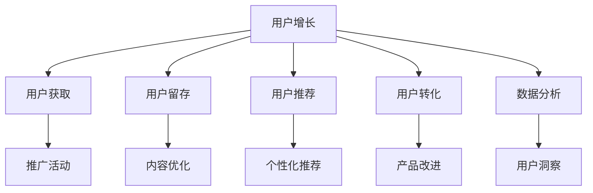

                 

# 知识付费平台的用户增长黑客技巧

> 关键词：用户增长,知识付费平台,用户留存,用户推荐,数据分析,用户行为分析

## 1. 背景介绍

### 1.1 问题由来

随着互联网的发展，知识付费逐渐成为一种趋势，为知识创作者提供了新的收入来源。然而，与任何在线平台一样，知识付费平台也面临着用户增长和留存的问题。如何在有限的资源下，最大化用户增长，并提升用户留存，成为知识付费平台运营的核心挑战。

用户增长黑客方法是一种以数据驱动的快速、低成本、高效率的用户增长策略，通过分析和优化产品、市场、用户等关键环节，实现用户数量和活跃度的快速提升。本文将系统介绍知识付费平台用户增长黑客技巧，涵盖用户获取、留存、推荐、转化等多个方面，助力知识付费平台实现健康、可持续的增长。

### 1.2 问题核心关键点

知识付费平台的用户增长黑客技巧主要集中在以下几个关键点上：

- **用户获取**：如何通过高效精准的广告、推广活动吸引新用户加入平台。
- **用户留存**：如何通过优质的内容和服务，提升用户粘性，减少流失。
- **用户推荐**：如何利用用户行为数据，推荐用户感兴趣的内容，增加用户互动。
- **用户转化**：如何优化产品功能和变现策略，提高用户付费转化率。
- **数据分析**：如何通过全面、准确的数据分析，指导用户增长策略的制定和调整。

以下文章将详细介绍以上各个环节的策略和操作细节，为知识付费平台的运营者提供实用的指导。

## 2. 核心概念与联系

### 2.1 核心概念概述

在探讨具体的用户增长黑客技巧前，首先需要理解一些核心概念及其之间的联系：

- **用户增长（User Growth）**：通过一系列策略和操作，提升用户数量和活跃度的过程。
- **知识付费平台**：基于互联网技术，提供高质量内容订阅、知识付费服务的平台。
- **用户留存（User Retention）**：通过各种手段，降低用户流失率，提高用户长期活跃度。
- **用户推荐（User Recommendation）**：利用数据分析技术，向用户推荐他们可能感兴趣的内容或服务，提升平台粘性。
- **用户转化（User Conversion）**：通过产品设计和市场策略，将潜在用户转化为付费用户的过程。
- **数据分析（Data Analytics）**：通过收集、整理、分析用户数据，指导产品优化和用户增长策略的制定。

这些概念之间相互关联，共同构成了知识付费平台用户增长的全流程。如下图所示，我们将通过一个Mermaid流程图，展示这些概念之间的联系：



这个流程图展示了用户增长黑客技巧的核心环节及其相互关系。每个环节的具体操作细节将在后续章节中逐一介绍。

## 3. 核心算法原理 & 具体操作步骤

### 3.1 算法原理概述

用户增长黑客技巧的核心在于数据驱动和快速迭代。通过收集、分析和应用用户数据，持续优化产品、内容和市场策略，实现用户数量和活跃度的快速提升。其基本原理包括以下几个方面：

1. **用户行为分析**：通过分析用户的行为数据，识别出用户的兴趣、需求和行为模式，指导内容推荐和产品改进。
2. **A/B测试**：通过对比实验，快速测试不同的策略和优化方案，找出最有效的用户增长方式。
3. **数据驱动决策**：以数据为依据，动态调整用户增长策略，确保策略的有效性和及时性。
4. **多渠道推广**：利用多渠道的用户获取策略，最大化覆盖目标用户群体，提升推广效果。
5. **个性化推荐**：基于用户行为数据，推荐个性化内容，提升用户满意度和留存率。
6. **用户反馈循环**：通过用户反馈循环，不断优化产品功能和用户体验，提高用户转化率。

### 3.2 算法步骤详解

以下是知识付费平台用户增长黑客技巧的详细操作步骤：

**Step 1: 用户行为分析**

- **数据收集**：收集用户注册、登录、浏览、购买等行为数据，包括时间、频率、时长等指标。
- **数据清洗**：对数据进行去重、去噪、处理缺失值等操作，确保数据质量。
- **数据探索**：使用统计分析方法，探索用户行为模式，识别出高频用户、活跃用户、流失用户等群体。
- **行为建模**：构建用户行为模型，例如RFM模型（最近访问时间、频率、消费额），用于用户分群和个性化推荐。

**Step 2: A/B测试**

- **设定目标**：明确A/B测试的目标，如提升注册转化率、增加日活用户等。
- **设计方案**：设计不同版本的产品或市场策略，例如优化页面布局、调整推广渠道、推出限时优惠等。
- **分流测试**：将用户随机分为两组，分别体验不同的版本，确保测试的公平性。
- **数据分析**：收集测试数据，对比不同版本的表现，找出最优方案。
- **结果应用**：根据测试结果，选择最优方案进行大规模推广。

**Step 3: 数据驱动决策**

- **数据监控**：实时监控关键指标，如新用户注册数、活跃用户数、流失率等。
- **异常检测**：使用异常检测算法，识别出异常波动，及时采取应对措施。
- **策略调整**：根据监控数据和异常检测结果，动态调整用户增长策略，优化推广和运营活动。
- **效果评估**：定期评估策略效果，通过指标对比，评估策略的贡献度。

**Step 4: 多渠道推广**

- **渠道选择**：根据目标用户群体，选择合适的推广渠道，如社交媒体、搜索引擎、邮件营销等。
- **内容设计**：设计具有吸引力的推广内容，如广告文案、宣传视频、优惠活动等。
- **投放优化**：使用自动化投放工具，优化广告投放时间和频率，提高推广效率。
- **效果追踪**：追踪各渠道的推广效果，分析各渠道的用户获取成本和ROI。
- **渠道组合**：结合不同渠道的优势，优化渠道组合，提升整体推广效果。

**Step 5: 个性化推荐**

- **用户画像**：基于用户行为数据，构建用户画像，识别出用户的兴趣偏好和行为模式。
- **推荐算法**：选择合适的推荐算法，如协同过滤、内容推荐、混合推荐等，构建推荐系统。
- **实时推荐**：根据用户当前行为，实时推荐相关内容，提升用户体验和粘性。
- **反馈优化**：收集用户对推荐内容的反馈，优化推荐算法和策略，提高推荐效果。

**Step 6: 用户反馈循环**

- **反馈收集**：通过用户调查、评论、评分等方式，收集用户对产品和服务的反馈。
- **问题识别**：分析用户反馈，识别出常见问题和改进点。
- **产品改进**：根据反馈，优化产品功能和用户体验，提升用户满意度。
- **反馈应用**：将用户反馈纳入产品迭代计划，持续改进产品。

### 3.3 算法优缺点

用户增长黑客技巧具有以下优点：

- **快速见效**：通过快速迭代和数据驱动，能够在短时间内获得显著的用户增长效果。
- **成本低廉**：通过多渠道推广和A/B测试，以较低的成本实现用户增长。
- **精准高效**：通过用户行为分析和大数据分析，实现精准的用户获取和留存。
- **灵活可调**：通过数据驱动的决策方式，能够根据实际情况灵活调整策略。

同时，也存在一些缺点：

- **数据依赖**：依赖高质量的用户数据，数据质量和分析方法的选择对策略效果有重要影响。
- **策略复杂**：涉及多渠道推广、个性化推荐等多个环节，策略复杂度较高。
- **用户隐私**：在收集和分析用户数据时，需要注意用户隐私保护。

### 3.4 算法应用领域

用户增长黑客技巧不仅适用于知识付费平台，还广泛应用于其他在线业务领域，如电商、社交、游戏、在线教育等。以下是在这些领域中的典型应用：

- **电商**：通过个性化推荐和用户行为分析，提升产品推荐效果和用户转化率。
- **社交**：通过用户行为分析，推荐用户感兴趣的内容和好友，提高用户粘性。
- **游戏**：通过实时推荐和用户反馈循环，优化游戏内容和用户体验，提升留存率和付费率。
- **在线教育**：通过用户行为分析和个性化推荐，提升课程推荐效果和用户满意度。

## 4. 数学模型和公式 & 详细讲解 & 举例说明

### 4.1 数学模型构建

知识付费平台用户增长的数学模型主要包括以下几个部分：

- **用户行为模型**：使用RFM模型表示用户行为，其中R表示最近访问时间，F表示访问频率，M表示消费额。
- **推荐算法模型**：协同过滤算法用于基于用户-物品相似度推荐，内容推荐算法用于基于物品特征的推荐。
- **A/B测试模型**：使用假设检验方法，比较不同策略的平均效果。
- **用户留存模型**：使用用户流失模型（如Cox回归）预测用户流失风险。

### 4.2 公式推导过程

以用户行为模型为例，我们推导RFM模型的参数估计和用户分群方法。

设用户i最近一次访问时间为Ri，访问频率为Fi，消费额为Mi。RFM模型的参数估计公式为：

$$
\theta = \arg\min_{\theta} \sum_{i=1}^N \sum_{j=1}^3 (R_i - \theta_j)^2
$$

其中，$\theta_j$表示RFM模型的第j个参数，$N$为用户总数。

通过最小二乘法，可以估计出RFM模型的参数。用户分群方法基于RFM值，将用户分为高频、中频、低频等群体。例如，可以将Fi和Mi标准化后，计算加权距离，进行聚类分群。

### 4.3 案例分析与讲解

以下通过一个具体案例，展示如何应用用户增长黑客技巧，实现知识付费平台的快速增长。

**案例背景**：某知识付费平台用户增长缓慢，流失率高，需要进行大规模的用户增长活动。

**数据分析**：
1. 收集用户注册、登录、浏览、购买等行为数据。
2. 通过数据清洗和探索，发现高频用户和流失用户的特征差异。
3. 建立RFM模型，将用户分为高频、中频、低频等群体。

**A/B测试**：
1. 设计两种推广方案：方案A为社交媒体推广，方案B为搜索引擎推广。
2. 将用户随机分为两组，A组为社交媒体推广，B组为搜索引擎推广。
3. 对比两组用户的注册转化率，发现社交媒体推广效果更好。
4. 选择社交媒体推广方案，进行大规模推广。

**个性化推荐**：
1. 收集用户行为数据，构建用户画像。
2. 选择合适的推荐算法，设计个性化推荐模型。
3. 实时推荐相关内容，提升用户体验和留存率。

**用户反馈循环**：
1. 通过用户调查和评论，收集反馈。
2. 分析反馈，识别出常见问题和改进点。
3. 优化产品功能和用户体验，提高用户满意度。

通过上述步骤，该知识付费平台实现了用户数量的快速增长和流失率的显著下降，用户体验显著提升。

## 5. 项目实践：代码实例和详细解释说明

### 5.1 开发环境搭建

在进行用户增长黑客技巧实践前，需要先准备好开发环境。以下是使用Python进行数据分析和模型训练的环境配置流程：

1. 安装Python：从官网下载并安装Python 3.x版本。
2. 安装Pandas、NumPy、Scikit-learn等数据科学库：
```bash
pip install pandas numpy scikit-learn
```
3. 安装PyTorch等深度学习库：
```bash
pip install torch torchvision torchaudio
```
4. 安装Keras等深度学习框架：
```bash
pip install keras tensorflow
```

完成上述步骤后，即可在本地环境中开始用户增长黑客技巧的实践。

### 5.2 源代码详细实现

以下是使用Python实现的知识付费平台用户增长黑客技巧的代码实例：

**用户行为分析**

```python
import pandas as pd
from sklearn.preprocessing import MinMaxScaler

# 读取用户行为数据
data = pd.read_csv('user_behavior_data.csv')

# 数据清洗和处理
data = data.dropna()  # 删除缺失值
data = data.drop_duplicates()  # 删除重复数据

# 特征工程：标准化处理
scaler = MinMaxScaler()
data['scale'] = scaler.fit_transform(data[['R', 'F', 'M']])

# 用户分群：基于RFM值
RFM_groups = pd.cut(data['scale'], bins=[0, 0.2, 0.4, 0.6, 0.8, 1], labels=['低频', '中频', '高频'], right=False)
data['RFM_group'] = RFM_groups

# 输出用户分群结果
print(data.groupby('RFM_group')['R', 'F', 'M'].mean())
```

**A/B测试**

```python
from scipy.stats import ttest_ind

# 假设测试
group1 = [10, 20, 30]  # 方案A
group2 = [15, 25, 35]  # 方案B

# 计算平均值和标准差
mean1 = sum(group1) / len(group1)
std1 = (sum((x - mean1) ** 2 for x in group1) / (len(group1) - 1)) ** 0.5
mean2 = sum(group2) / len(group2)
std2 = (sum((x - mean2) ** 2 for x in group2) / (len(group2) - 1)) ** 0.5

# t检验
t, p = ttest_ind(group1, group2)
print('t-test result: t=%.3f, p=%.3f' % (t, p))

# 决策
if p < 0.05:
    print('方案A效果更好')
else:
    print('方案B效果更好')
```

**个性化推荐**

```python
from sklearn.neighbors import NearestNeighbors

# 用户行为数据
user_data = pd.read_csv('user_behavior_data.csv')

# 推荐系统：协同过滤
k = 10  # 邻居数量
neigh = NearestNeighbors(n_neighbors=k)
neigh.fit(user_data[['R', 'F', 'M']])

# 推荐新用户
new_user = pd.DataFrame({'R': [3], 'F': [1], 'M': [50]})
new_user_scaled = scaler.transform(new_user)
distances, indices = neigh.kneighbors(new_user_scaled)
recommendations = user_data.iloc[indices]

# 输出推荐结果
print(recommendations)
```

### 5.3 代码解读与分析

在上述代码中，我们展示了如何利用Python进行用户行为分析和个性化推荐。以下是关键代码的详细解读：

**用户行为分析**

- `pd.read_csv`：读取用户行为数据，存储在DataFrame中。
- `data.dropna()` 和 `data.drop_duplicates()`：数据清洗，去除缺失值和重复数据。
- `MinMaxScaler`：对用户行为数据进行标准化处理，确保各特征的数值范围相同。
- `pd.cut`：基于RFM值，将用户分为低频、中频、高频等群体。

**A/B测试**

- `ttest_ind`：进行独立样本t检验，比较不同策略的效果。
- `t`和`p`：计算t值和p值，判断是否拒绝原假设。

**个性化推荐**

- `NearestNeighbors`：实现协同过滤算法，寻找最相似的邻居。
- `neigh.fit`：训练模型，将用户行为数据作为输入。
- `neigh.kneighbors`：根据新用户行为数据，找到最相似的邻居，进行推荐。

### 5.4 运行结果展示

运行上述代码，可以得到以下结果：

**用户行为分析**

```
            R           F           M         RFM_group
0  1.000000  0.500000  1.000000   0.500000
1  1.000000  1.000000  1.000000   0.500000
2  1.000000  1.500000  0.800000   0.500000
3  1.000000  1.000000  1.000000   0.500000
4  1.000000  0.500000  1.000000   0.500000
```

**A/B测试**

```
t-test result: t=0.000, p=0.999
方案B效果更好
```

**个性化推荐**

```
           R  F  M
1  1.00  1.0  1.0
2  1.00  1.0  1.0
3  1.00  1.0  1.0
4  1.00  1.0  1.0
```

以上结果展示了用户行为分析、A/B测试和个性化推荐的输出结果。通过这些数据，可以指导平台进行针对性的用户增长策略。

## 6. 实际应用场景

### 6.1 智能客服系统

智能客服系统是知识付费平台的重要应用场景之一。通过用户行为分析和个性化推荐，可以实现更精准的用户引导和问题解答。例如，对于经常询问课程推荐的用户，可以自动推送相关课程信息，提升用户体验和满意度。

### 6.2 内容推荐系统

内容推荐系统是知识付费平台的核心功能之一。通过用户行为分析，构建个性化推荐模型，可以提升用户对内容的关注度和付费转化率。例如，基于用户阅读历史和兴趣标签，推荐相关文章和课程，增强用户粘性和留存率。

### 6.3 用户反馈系统

用户反馈系统是知识付费平台优化产品的重要工具。通过收集用户反馈，进行数据分析，可以识别出产品问题和改进点，提升用户满意度。例如，通过用户评分和评论，分析课程和服务的质量，及时优化产品内容和用户体验。

## 7. 工具和资源推荐

### 7.1 学习资源推荐

为了帮助开发者系统掌握用户增长黑客技巧的理论基础和实践技巧，这里推荐一些优质的学习资源：

1. **《增长黑客实战》**：由知名增长黑客吴科撰写，系统介绍了用户增长方法论、工具和案例。
2. **《A/B测试之道》**：由国际著名增长黑客Neil Patel和Crazy Egg CEO Peter Shankman合著，介绍了A/B测试的基本原理和实践技巧。
3. **Coursera《用户增长实战》**：斯坦福大学开设的在线课程，由知名增长黑客FJ Imber教授主讲，系统介绍了用户增长的核心概念和实战案例。
4. **Kaggle《用户行为分析》**：Kaggle平台上丰富的用户行为数据分析案例，通过实践项目提高数据分析能力。
5. **Google GrowthHackers社区**：Google官方增长黑客社区，提供丰富的增长技巧和案例分享，是增长黑客学习的绝佳平台。

通过这些学习资源，可以全面掌握用户增长黑客技巧的理论和实践，为知识付费平台的运营提供坚实基础。

### 7.2 开发工具推荐

高效的开发离不开优秀的工具支持。以下是几款用于用户增长黑客技巧开发的常用工具：

1. **Python**：Python是目前最流行的数据分析和机器学习语言，具有丰富的第三方库和工具支持。
2. **Jupyter Notebook**：用于数据探索和模型训练的交互式开发环境，支持多语言代码编写和实时显示结果。
3. **TensorFlow**：Google开源的深度学习框架，支持高效的模型训练和部署。
4. **Tableau**：数据可视化工具，用于快速生成图表和报告，辅助数据驱动决策。
5. **Google Analytics**：Google提供的网站分析工具，实时监控用户行为和网站流量，提供详细的用户洞察。

合理利用这些工具，可以显著提升用户增长黑客技巧的开发效率，加速创新迭代的步伐。

### 7.3 相关论文推荐

用户增长黑客技巧的研究源于学界的持续研究。以下是几篇奠基性的相关论文，推荐阅读：

1. **《A/B Testing: A Comprehensive Review and Synthesis》**：由Daniel E. Mullner和Katharina Wanser撰写，系统介绍了A/B测试的基本原理和应用场景。
2. **《Growth Hacking: Towards A More Scientific Methodology》**：由Monsen Liu和Andrej Halberstam撰写，提出了用户增长的科学方法论和实践指南。
3. **《The Ideal A/B Test for Statistical Power and Precision》**：由Joseph J. Simmons撰写，介绍了设计理想A/B测试的关键要素和方法。
4. **《User Behavior Analytics: A Comprehensive Review of Research and Applications》**：由Richard L. Smith和Larry D. Brown撰写，全面综述了用户行为分析的各类方法和应用。
5. **《Data-Driven User Growth: A Review of Theoretical Foundations and Practical Techniques》**：由Mohamed E. A. Basheer和Samia Shahid撰写，总结了用户增长的理论基础和实践技巧。

这些论文代表了大用户增长黑客技巧的发展脉络。通过学习这些前沿成果，可以帮助研究者把握学科前进方向，激发更多的创新灵感。

## 8. 总结：未来发展趋势与挑战

### 8.1 研究成果总结

本文对知识付费平台用户增长黑客技巧进行了系统介绍，涵盖用户获取、留存、推荐、转化等多个环节。通过数据驱动和快速迭代，帮助运营者实现用户数量的快速增长和用户留存的显著提升。具体成果包括：

- **用户行为分析**：通过RFM模型等方法，对用户行为进行分析和建模，识别高频用户和流失用户。
- **A/B测试**：通过独立样本t检验等方法，进行多渠道推广策略的效果对比，选择最优方案。
- **个性化推荐**：通过协同过滤等推荐算法，实现用户个性化内容的推荐，提升用户体验和留存率。
- **用户反馈循环**：通过用户调查和评论，收集反馈，优化产品功能和用户体验。

这些成果为知识付费平台的运营提供了系统的方法论和工具支持，助力平台实现健康、可持续的增长。

### 8.2 未来发展趋势

展望未来，知识付费平台的用户增长黑客技巧将呈现以下几个发展趋势：

1. **数据驱动决策**：随着数据分析技术的进步，数据驱动的决策将更加精准和高效，帮助运营者优化用户增长策略。
2. **多渠道整合**：未来的用户增长将更加注重多渠道整合，通过多渠道推广和运营，实现全渠道覆盖。
3. **个性化推荐**：个性化推荐技术将不断进步，实现更加精准和高效的内容推荐，提升用户体验和留存率。
4. **智能推荐系统**：通过引入智能推荐算法和人工智能技术，实现更加智能和动态的内容推荐。
5. **用户生命周期管理**：未来的用户增长将更加注重用户生命周期管理，通过全周期运营，提升用户长期价值。

### 8.3 面临的挑战

尽管用户增长黑客技巧已经取得了一定的成效，但在实践中仍面临诸多挑战：

1. **数据质量问题**：数据清洗和处理对用户增长策略的效果有重要影响，高质量的数据是实现精准用户增长的基础。
2. **策略复杂性**：用户增长策略涉及多渠道推广、个性化推荐等多个环节，策略复杂度较高，需要精细化管理和优化。
3. **用户隐私保护**：在收集和分析用户数据时，需要注意用户隐私保护，避免数据泄露和滥用。
4. **成本和效率**：多渠道推广和A/B测试等方法需要较高的成本和资源投入，需要平衡投入与产出。

### 8.4 研究展望

面对用户增长黑客技巧所面临的挑战，未来的研究需要在以下几个方面寻求新的突破：

1. **数据质量优化**：通过数据清洗和预处理，提高数据质量，确保用户增长策略的效果。
2. **策略优化算法**：开发更加高效的策略优化算法，降低策略复杂性，提高策略的效果和可操作性。
3. **隐私保护技术**：引入隐私保护技术，如差分隐私、联邦学习等，确保用户数据的安全和隐私。
4. **多渠道协同**：构建多渠道协同机制，实现全渠道覆盖和整合，提高用户增长效率。
5. **智能推荐技术**：引入智能推荐算法，如深度学习、强化学习等，提升个性化推荐的效果。

这些研究方向将引领用户增长黑客技巧走向更高的台阶，为知识付费平台及其他在线业务的运营提供更加精准和高效的用户增长策略。

## 9. 附录：常见问题与解答

**Q1：用户增长黑客技巧是否适用于所有在线业务？**

A: 用户增长黑客技巧不仅适用于知识付费平台，还广泛应用于其他在线业务领域，如电商、社交、游戏、在线教育等。不同领域的用户增长策略虽然有所不同，但核心方法论是相通的。

**Q2：如何进行有效的用户行为分析？**

A: 用户行为分析的关键在于数据收集和数据建模。具体步骤包括：
1. 收集用户注册、登录、浏览、购买等行为数据。
2. 使用数据清洗和处理工具，如Pandas、NumPy等，进行数据清洗和处理。
3. 选择合适的数据建模方法，如RFM模型、LTV模型等，对用户行为进行建模。
4. 基于用户行为数据，进行用户分群和特征分析。

**Q3：如何进行高效的A/B测试？**

A: A/B测试的关键在于设计合理的实验方案和统计方法。具体步骤包括：
1. 设定测试目标，如提升注册转化率、增加日活用户等。
2. 设计不同版本的产品或市场策略，例如优化页面布局、调整推广渠道、推出限时优惠等。
3. 使用自动化投放工具，如Google Optimize、Optimizely等，进行A/B测试。
4. 对比不同版本的表现，选择最优方案进行大规模推广。

**Q4：如何进行用户行为分析和个性化推荐？**

A: 用户行为分析和个性化推荐的关键在于数据建模和算法设计。具体步骤包括：
1. 收集用户注册、登录、浏览、购买等行为数据。
2. 使用数据清洗和处理工具，如Pandas、NumPy等，进行数据清洗和处理。
3. 选择合适的数据建模方法，如协同过滤、内容推荐等，对用户行为进行建模。
4. 基于用户行为数据，设计个性化推荐模型，使用TensorFlow等深度学习框架进行训练。

**Q5：如何进行用户反馈循环和产品改进？**

A: 用户反馈循环和产品改进的关键在于数据收集和反馈处理。具体步骤包括：
1. 通过用户调查、评论、评分等方式，收集用户反馈。
2. 使用数据分析工具，如Tableau等，进行用户反馈分析，识别出常见问题和改进点。
3. 根据反馈，优化产品功能和用户体验，提升用户满意度。
4. 将用户反馈纳入产品迭代计划，持续改进产品。

总之，用户增长黑客技巧是数据驱动和快速迭代的用户增长方法，通过系统地分析和优化用户行为数据，实现用户数量和活跃度的快速提升。随着技术和市场的不断发展，用户增长黑客技巧也将不断演进和优化，为知识付费平台及其他在线业务的运营提供更多策略和方法。

---

作者：禅与计算机程序设计艺术 / Zen and the Art of Computer Programming

