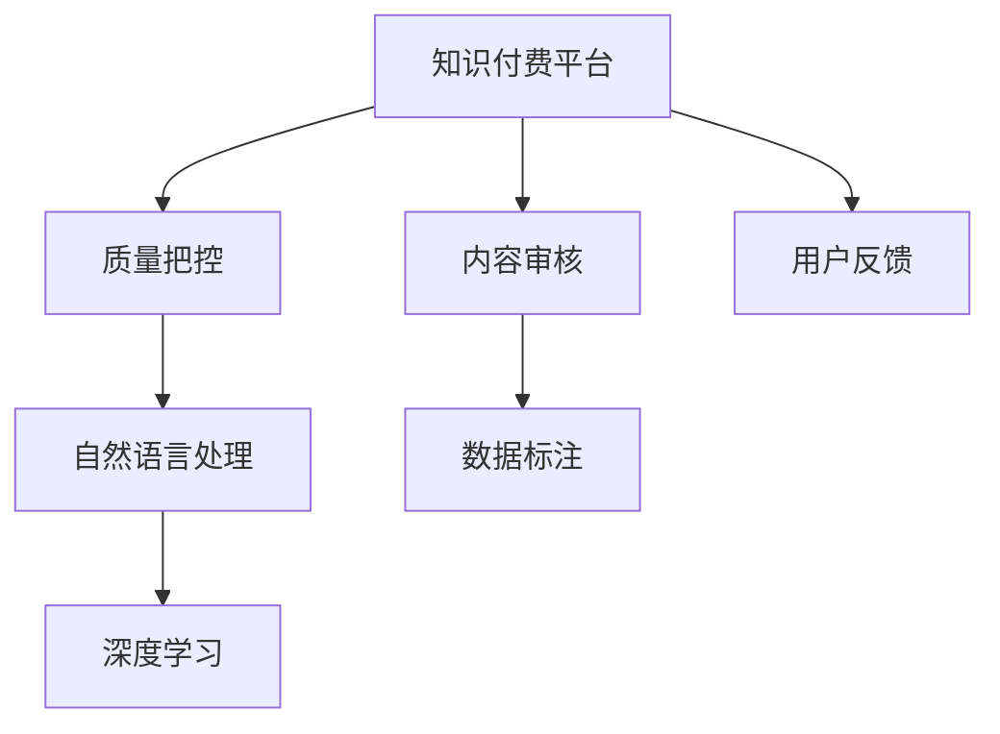

                 

# 知识付费平台要加强内容审核和质量把控

随着知识付费市场的兴起，越来越多的内容提供者涌入平台，知识付费平台也面临着内容审核和质量把控的巨大挑战。如何确保知识内容的准确性、权威性、时效性和实用性，同时提高用户的使用体验，是知识付费平台需要重点解决的问题。本文将系统介绍知识付费平台在内容审核和质量把控上的核心技术，并提供具体实践建议，以期为相关平台提供参考。

## 1. 背景介绍

### 1.1 问题由来

近年来，随着知识经济和在线教育的快速发展，知识付费平台迅速崛起，吸引了大量内容创作者入驻。平台内容类型丰富，覆盖教育、健康、科技、文化等众多领域，满足了广大用户的多样化学习需求。但随之而来的是内容质量参差不齐、误导信息、版权争议等问题，对平台声誉和用户信任带来了严重威胁。

### 1.2 问题核心关键点

1. **内容审核**：对平台上的内容进行识别、筛选和过滤，去除低质量、误导性、版权侵权内容。
2. **质量把控**：确保内容符合平台标准，包括知识准确性、逻辑连贯性、格式规范性、用户体验等。
3. **用户体验**：优化内容呈现方式，提升用户的使用体验，增加用户粘性。

### 1.3 问题研究意义

强化内容审核和质量把控，对于维护平台声誉、增强用户信任、提升平台价值至关重要。优秀的知识付费平台不仅能提供高价值的内容，还能促进知识的传播和应用，为社会进步和人才培养作出贡献。

## 2. 核心概念与联系

### 2.1 核心概念概述

为更好地理解知识付费平台的内容审核和质量把控技术，本节将介绍几个密切相关的核心概念：

- **知识付费平台**：提供在线付费内容的平台，如得到、喜马拉雅、分答等。
- **内容审核**：对平台上的内容进行识别、筛选和过滤的过程，确保内容的合法性、准确性和质量。
- **质量把控**：通过技术手段和人工审核相结合的方式，确保内容符合平台标准，提高用户使用体验。
- **用户体验**：通过优化内容呈现方式、提升界面友好度等手段，提升用户的使用满意度和粘性。
- **自然语言处理(NLP)**：利用NLP技术进行内容分类、情感分析、摘要生成等任务，提高内容审核和质量把控的效率和准确性。
- **深度学习**：通过深度学习算法，实现内容的自动分类、过滤和质量评估。
- **数据标注**：对标注数据进行训练，提高模型在内容审核和质量把控中的性能。
- **用户反馈**：收集用户对内容的反馈信息，动态调整平台的内容审核策略。

这些核心概念之间的逻辑关系可以通过以下Mermaid流程图来展示：



这个流程图展示了一些关键概念及其之间的关系：

1. 知识付费平台通过内容审核和质量把控，保证内容的合法性和高质量。
2. 自然语言处理和深度学习技术，提高了内容审核和质量把控的自动化程度。
3. 数据标注技术，提升了模型的训练效果和泛化能力。
4. 用户反馈，有助于动态调整平台策略，提升用户体验。

## 3. 核心算法原理 & 具体操作步骤
### 3.1 算法原理概述

知识付费平台的内容审核和质量把控，通常采用监督学习、无监督学习、半监督学习等机器学习方法。其核心思想是：利用机器学习算法，对平台上的内容进行自动分类、过滤和质量评估，同时结合人工审核，确保审核结果的准确性。

形式化地，假设平台有 $N$ 条内容，每条内容有 $D$ 个特征，其中 $D$ 个特征中只有 $M$ 个特征与内容质量相关。内容审核和质量把控的目标是：找到最优参数 $\theta$，使得模型能够准确地预测内容的合法性和质量，即：

$$
\theta = \mathop{\arg\min}_{\theta} \sum_{i=1}^N \mathcal{L}(M_{\theta}(x_i),y_i)
$$

其中，$M_{\theta}$ 为内容审核和质量把控模型，$x_i$ 为内容特征，$y_i$ 为内容合法性和质量的标签，$\mathcal{L}$ 为损失函数。

通过梯度下降等优化算法，模型不断更新参数 $\theta$，最小化损失函数 $\mathcal{L}$，使得模型输出逼近真实标签。由于 $M_{\theta}$ 已经通过预训练获得了较好的初始化，因此即便在小规模数据集上进行微调，也能较快收敛到理想的模型参数 $\hat{\theta}$。

### 3.2 算法步骤详解

知识付费平台的内容审核和质量把控一般包括以下几个关键步骤：

**Step 1: 准备数据集**

1. 收集标注数据集 $D=\{(x_i, y_i)\}_{i=1}^N$，其中 $x_i$ 为内容特征，$y_i$ 为内容合法性和质量的标签。
2. 数据标注可以通过人工审核、自动化工具、用户反馈等方式进行。

**Step 2: 选择算法模型**

1. 根据平台特点，选择适合的算法模型，如基于深度学习的分类器、生成模型、序列模型等。
2. 选择合适的特征提取技术，如词向量、词频、文本长度、情感极性等。

**Step 3: 模型训练和优化**

1. 将数据集分为训练集、验证集和测试集，分别用于训练、验证和测试模型。
2. 选择优化算法，如随机梯度下降、Adam等，设置学习率、批大小、迭代轮数等超参数。
3. 使用正则化技术，如L2正则、Dropout等，防止过拟合。

**Step 4: 模型评估和调整**

1. 在测试集上评估模型性能，如准确率、召回率、F1值等。
2. 根据测试结果调整模型参数，进行模型微调或重新训练。
3. 实时监控模型性能，根据用户反馈动态调整审核策略。

**Step 5: 实际部署**

1. 将训练好的模型部署到生产环境，对新内容进行实时审核和质量评估。
2. 结合人工审核，确保审核结果的准确性。
3. 根据用户反馈，持续改进模型和审核策略。

以上是知识付费平台内容审核和质量把控的一般流程。在实际应用中，还需要针对具体平台的特点，对各个环节进行优化设计，如改进特征提取技术、引入更多的正则化技术、搜索最优的超参数组合等，以进一步提升模型性能。

### 3.3 算法优缺点

知识付费平台的内容审核和质量把控方法具有以下优点：

1. 自动化程度高。利用机器学习算法，可以自动对海量内容进行筛选和过滤，大幅提升审核效率。
2. 覆盖范围广。可以处理不同类型的内容，包括文本、图片、音频、视频等。
3. 可扩展性强。可以灵活调整模型和算法，适应不同平台和领域的需求。

同时，该方法也存在一定的局限性：

1. 依赖标注数据。高质量标注数据的获取成本较高，且标注质量对模型性能影响较大。
2. 泛化能力有限。对于平台外数据，模型的泛化能力可能不足，无法适应新的内容类型和领域。
3. 负面效果传递。低质量内容的误判可能对平台声誉造成负面影响。
4. 可解释性不足。机器学习模型的决策过程通常缺乏可解释性，难以对其推理逻辑进行分析和调试。

尽管存在这些局限性，但就目前而言，基于机器学习的审核和质量把控方法仍是目前的主流范式。未来相关研究的重点在于如何进一步降低对标注数据的依赖，提高模型的泛化能力和可解释性，同时兼顾效率和效果。

### 3.4 算法应用领域

基于知识付费平台的内容审核和质量把控方法，已经在内容筛选、版权保护、用户反馈处理等多个领域得到了广泛应用，成为知识付费平台内容管理和用户体验提升的重要手段。

1. **内容筛选**：对用户上传的内容进行自动筛选，去除低质量、版权侵权、有害信息等内容。
2. **版权保护**：识别和标记版权内容，保护内容提供者的合法权益。
3. **用户反馈处理**：收集用户对内容的反馈信息，动态调整内容审核策略，提升用户体验。
4. **个性化推荐**：基于用户兴趣和行为数据，推荐高质量的内容，提升用户粘性。

除了上述这些经典应用外，知识付费平台的内容审核和质量把控方法还在诸多场景中得到创新性的应用，如可控文本生成、常识推理、代码生成、数据增强等，为知识付费平台带来了新的突破。

## 4. 数学模型和公式 & 详细讲解
### 4.1 数学模型构建

本节将使用数学语言对知识付费平台的内容审核和质量把控过程进行更加严格的刻画。

记内容审核和质量把控模型为 $M_{\theta}:\mathcal{X} \rightarrow \{0,1\}$，其中 $\mathcal{X}$ 为内容特征空间，$\{0,1\}$ 为内容合法性和质量的二分类空间，$\theta$ 为模型参数。假设平台有 $N$ 条内容，每条内容有 $D$ 个特征，其中 $D$ 个特征中只有 $M$ 个特征与内容质量相关。

定义模型 $M_{\theta}$ 在内容特征 $x_i$ 上的损失函数为 $\ell(M_{\theta}(x_i),y_i)$，则在内容集 $D$ 上的经验风险为：

$$
\mathcal{L}(\theta) = \frac{1}{N} \sum_{i=1}^N \ell(M_{\theta}(x_i),y_i)
$$

其中 $\ell$ 为二分类交叉熵损失函数，用于衡量模型预测输出与真实标签之间的差异。

微调的优化目标是最小化经验风险，即找到最优参数：

$$
\theta^* = \mathop{\arg\min}_{\theta} \mathcal{L}(\theta)
$$

在实践中，我们通常使用基于梯度的优化算法（如SGD、Adam等）来近似求解上述最优化问题。设 $\eta$ 为学习率，$\lambda$ 为正则化系数，则参数的更新公式为：

$$
\theta \leftarrow \theta - \eta \nabla_{\theta}\mathcal{L}(\theta) - \eta\lambda\theta
$$

其中 $\nabla_{\theta}\mathcal{L}(\theta)$ 为损失函数对参数 $\theta$ 的梯度，可通过反向传播算法高效计算。

### 4.2 公式推导过程

以下我们以文本内容审核为例，推导二分类交叉熵损失函数及其梯度的计算公式。

假设模型 $M_{\theta}$ 在内容特征 $x_i$ 上的输出为 $\hat{y}=M_{\theta}(x_i) \in [0,1]$，表示内容属于合法和高质量的概率。真实标签 $y \in \{0,1\}$。则二分类交叉熵损失函数定义为：

$$
\ell(M_{\theta}(x_i),y) = -[y\log \hat{y} + (1-y)\log (1-\hat{y})]
$$

将其代入经验风险公式，得：

$$
\mathcal{L}(\theta) = -\frac{1}{N}\sum_{i=1}^N [y_i\log M_{\theta}(x_i)+(1-y_i)\log(1-M_{\theta}(x_i))]
$$

根据链式法则，损失函数对参数 $\theta_k$ 的梯度为：

$$
\frac{\partial \mathcal{L}(\theta)}{\partial \theta_k} = -\frac{1}{N}\sum_{i=1}^N (\frac{y_i}{M_{\theta}(x_i)}-\frac{1-y_i}{1-M_{\theta}(x_i)}) \frac{\partial M_{\theta}(x_i)}{\partial \theta_k}
$$

其中 $\frac{\partial M_{\theta}(x_i)}{\partial \theta_k}$ 可进一步递归展开，利用自动微分技术完成计算。

在得到损失函数的梯度后，即可带入参数更新公式，完成模型的迭代优化。重复上述过程直至收敛，最终得到适应知识付费平台的内容审核和质量把控的最优模型参数 $\theta^*$。

## 5. 项目实践：代码实例和详细解释说明
### 5.1 开发环境搭建

在进行内容审核和质量把控实践前，我们需要准备好开发环境。以下是使用Python进行PyTorch开发的环境配置流程：

1. 安装Anaconda：从官网下载并安装Anaconda，用于创建独立的Python环境。

2. 创建并激活虚拟环境：
```bash
conda create -n pytorch-env python=3.8 
conda activate pytorch-env
```

3. 安装PyTorch：根据CUDA版本，从官网获取对应的安装命令。例如：
```bash
conda install pytorch torchvision torchaudio cudatoolkit=11.1 -c pytorch -c conda-forge
```

4. 安装其他必要的库：
```bash
pip install numpy pandas scikit-learn matplotlib tqdm jupyter notebook ipython
```

完成上述步骤后，即可在`pytorch-env`环境中开始内容审核和质量把控实践。

### 5.2 源代码详细实现

下面我们以文本内容审核为例，给出使用PyTorch对模型进行训练的PyTorch代码实现。

首先，定义数据处理函数：

```python
from transformers import BertTokenizer
from torch.utils.data import Dataset, DataLoader
import torch

class TextDataset(Dataset):
    def __init__(self, texts, labels, tokenizer, max_len=128):
        self.texts = texts
        self.labels = labels
        self.tokenizer = tokenizer
        self.max_len = max_len
        
    def __len__(self):
        return len(self.texts)
    
    def __getitem__(self, item):
        text = self.texts[item]
        label = self.labels[item]
        
        encoding = self.tokenizer(text, return_tensors='pt', max_length=self.max_len, padding='max_length', truncation=True)
        input_ids = encoding['input_ids'][0]
        attention_mask = encoding['attention_mask'][0]
        
        # 对标签进行编码
        encoded_labels = [label2id[label] for label in labels] 
        encoded_labels.extend([label2id['Negative']] * (self.max_len - len(encoded_labels)))
        labels = torch.tensor(encoded_labels, dtype=torch.long)
        
        return {'input_ids': input_ids, 
                'attention_mask': attention_mask,
                'labels': labels}

# 标签与id的映射
label2id = {'Positive': 1, 'Negative': 0}
id2label = {v: k for k, v in label2id.items()}

# 创建dataset
tokenizer = BertTokenizer.from_pretrained('bert-base-cased')

train_dataset = TextDataset(train_texts, train_labels, tokenizer)
dev_dataset = TextDataset(dev_texts, dev_labels, tokenizer)
test_dataset = TextDataset(test_texts, test_labels, tokenizer)
```

然后，定义模型和优化器：

```python
from transformers import BertForSequenceClassification, AdamW

model = BertForSequenceClassification.from_pretrained('bert-base-cased', num_labels=len(label2id))

optimizer = AdamW(model.parameters(), lr=2e-5)
```

接着，定义训练和评估函数：

```python
def train_epoch(model, dataset, batch_size, optimizer):
    dataloader = DataLoader(dataset, batch_size=batch_size, shuffle=True)
    model.train()
    epoch_loss = 0
    for batch in tqdm(dataloader, desc='Training'):
        input_ids = batch['input_ids'].to(device)
        attention_mask = batch['attention_mask'].to(device)
        labels = batch['labels'].to(device)
        model.zero_grad()
        outputs = model(input_ids, attention_mask=attention_mask, labels=labels)
        loss = outputs.loss
        epoch_loss += loss.item()
        loss.backward()
        optimizer.step()
    return epoch_loss / len(dataloader)

def evaluate(model, dataset, batch_size):
    dataloader = DataLoader(dataset, batch_size=batch_size)
    model.eval()
    preds, labels = [], []
    with torch.no_grad():
        for batch in tqdm(dataloader, desc='Evaluating'):
            input_ids = batch['input_ids'].to(device)
            attention_mask = batch['attention_mask'].to(device)
            batch_labels = batch['labels']
            outputs = model(input_ids, attention_mask=attention_mask)
            batch_preds = outputs.logits.argmax(dim=2).to('cpu').tolist()
            batch_labels = batch_labels.to('cpu').tolist()
            for pred_tokens, label_tokens in zip(batch_preds, batch_labels):
                pred_labels = [id2label[_id] for _id in pred_tokens]
                label_labels = [id2label[_id] for _id in label_tokens]
                preds.append(pred_labels[:len(label_labels)])
                labels.append(label_labels)
                
    print(classification_report(labels, preds))
```

最后，启动训练流程并在测试集上评估：

```python
epochs = 5
batch_size = 16

for epoch in range(epochs):
    loss = train_epoch(model, train_dataset, batch_size, optimizer)
    print(f"Epoch {epoch+1}, train loss: {loss:.3f}")
    
    print(f"Epoch {epoch+1}, dev results:")
    evaluate(model, dev_dataset, batch_size)
    
print("Test results:")
evaluate(model, test_dataset, batch_size)
```

以上就是使用PyTorch对BERT进行文本内容审核的完整代码实现。可以看到，得益于Transformers库的强大封装，我们可以用相对简洁的代码完成BERT模型的加载和训练。

### 5.3 代码解读与分析

让我们再详细解读一下关键代码的实现细节：

**TextDataset类**：
- `__init__`方法：初始化文本、标签、分词器等关键组件。
- `__len__`方法：返回数据集的样本数量。
- `__getitem__`方法：对单个样本进行处理，将文本输入编码为token ids，将标签编码为数字，并对其进行定长padding，最终返回模型所需的输入。

**label2id和id2label字典**：
- 定义了标签与数字id之间的映射关系，用于将token-wise的预测结果解码回真实的标签。

**训练和评估函数**：
- 使用PyTorch的DataLoader对数据集进行批次化加载，供模型训练和推理使用。
- 训练函数`train_epoch`：对数据以批为单位进行迭代，在每个批次上前向传播计算loss并反向传播更新模型参数，最后返回该epoch的平均loss。
- 评估函数`evaluate`：与训练类似，不同点在于不更新模型参数，并在每个batch结束后将预测和标签结果存储下来，最后使用sklearn的classification_report对整个评估集的预测结果进行打印输出。

**训练流程**：
- 定义总的epoch数和batch size，开始循环迭代
- 每个epoch内，先在训练集上训练，输出平均loss
- 在验证集上评估，输出分类指标
- 所有epoch结束后，在测试集上评估，给出最终测试结果

可以看到，PyTorch配合Transformers库使得BERT微调的代码实现变得简洁高效。开发者可以将更多精力放在数据处理、模型改进等高层逻辑上，而不必过多关注底层的实现细节。

当然，工业级的系统实现还需考虑更多因素，如模型的保存和部署、超参数的自动搜索、更灵活的任务适配层等。但核心的微调范式基本与此类似。

## 6. 实际应用场景
### 6.1 智能客服系统

基于内容审核和质量把控的对话技术，可以广泛应用于智能客服系统的构建。传统客服往往需要配备大量人力，高峰期响应缓慢，且一致性和专业性难以保证。而使用审核和质量把控的对话模型，可以7x24小时不间断服务，快速响应客户咨询，用自然流畅的语言解答各类常见问题。

在技术实现上，可以收集企业内部的历史客服对话记录，将问题和最佳答复构建成监督数据，在此基础上对预训练对话模型进行审核和质量把控。审核和质量把控的对话模型能够自动理解用户意图，匹配最合适的答案模板进行回复。对于客户提出的新问题，还可以接入检索系统实时搜索相关内容，动态组织生成回答。如此构建的智能客服系统，能大幅提升客户咨询体验和问题解决效率。

### 6.2 金融舆情监测

金融机构需要实时监测市场舆论动向，以便及时应对负面信息传播，规避金融风险。传统的人工监测方式成本高、效率低，难以应对网络时代海量信息爆发的挑战。基于内容审核和质量把控的文本分类和情感分析技术，为金融舆情监测提供了新的解决方案。

具体而言，可以收集金融领域相关的新闻、报道、评论等文本数据，并对其进行主题标注和情感标注。在此基础上对预训练语言模型进行审核和质量把控，使其能够自动判断文本属于何种主题，情感倾向是正面、中性还是负面。将审核和质量把控的模型应用到实时抓取的网络文本数据，就能够自动监测不同主题下的情感变化趋势，一旦发现负面信息激增等异常情况，系统便会自动预警，帮助金融机构快速应对潜在风险。

### 6.3 个性化推荐系统

当前的推荐系统往往只依赖用户的历史行为数据进行物品推荐，无法深入理解用户的真实兴趣偏好。基于内容审核和质量把控的个性化推荐系统可以更好地挖掘用户行为背后的语义信息，从而提供更精准、多样的推荐内容。

在实践中，可以收集用户浏览、点击、评论、分享等行为数据，提取和用户交互的物品标题、描述、标签等文本内容。将文本内容作为模型输入，用户的后续行为（如是否点击、购买等）作为监督信号，在此基础上审核和质量把控预训练语言模型。审核和质量把控的模型能够从文本内容中准确把握用户的兴趣点。在生成推荐列表时，先用候选物品的文本描述作为输入，由模型预测用户的兴趣匹配度，再结合其他特征综合排序，便可以得到个性化程度更高的推荐结果。

### 6.4 未来应用展望

随着内容审核和质量把控技术的不断发展，基于知识付费平台的内容审核和质量把控方法将在更多领域得到应用，为传统行业带来变革性影响。

在智慧医疗领域，基于审核和质量把控的医疗问答、病历分析、药物研发等应用将提升医疗服务的智能化水平，辅助医生诊疗，加速新药开发进程。

在智能教育领域，审核和质量把控技术可应用于作业批改、学情分析、知识推荐等方面，因材施教，促进教育公平，提高教学质量。

在智慧城市治理中，审核和质量把控技术可应用于城市事件监测、舆情分析、应急指挥等环节，提高城市管理的自动化和智能化水平，构建更安全、高效的未来城市。

此外，在企业生产、社会治理、文娱传媒等众多领域，基于知识付费平台的内容审核和质量把控的人工智能应用也将不断涌现，为经济社会发展注入新的动力。相信随着技术的日益成熟，审核和质量把控方法将成为知识付费平台的核心技术，推动人工智能技术在垂直行业的规模化落地。总之，审核和质量把控需要开发者根据具体任务，不断迭代和优化模型、数据和算法，方能得到理想的效果。

## 7. 工具和资源推荐
### 7.1 学习资源推荐

为了帮助开发者系统掌握内容审核和质量把控的理论基础和实践技巧，这里推荐一些优质的学习资源：

1. 《自然语言处理入门》系列博文：由大模型技术专家撰写，深入浅出地介绍了自然语言处理的基本概念和核心算法。

2. 《深度学习基础》课程：由知名大学开设的深度学习入门课程，涵盖机器学习基础、深度学习基础、NLP等内容，适合初学者入门。

3. 《自然语言处理工具包》书籍：介绍常用的自然语言处理工具和库，包括NLTK、spaCy、HuggingFace Transformers等，是实践自然语言处理技术的必备参考书。

4. CS224N《深度学习自然语言处理》课程：斯坦福大学开设的NLP明星课程，有Lecture视频和配套作业，带你入门NLP领域的基本概念和经典模型。

5. 《自然语言处理实战》书籍：通过实际案例讲解自然语言处理技术的实际应用，包括文本分类、情感分析、问答系统等。

通过对这些资源的学习实践，相信你一定能够快速掌握内容审核和质量把控的精髓，并用于解决实际的NLP问题。
### 7.2 开发工具推荐

高效的开发离不开优秀的工具支持。以下是几款用于内容审核和质量把控开发的常用工具：

1. PyTorch：基于Python的开源深度学习框架，灵活动态的计算图，适合快速迭代研究。大部分预训练语言模型都有PyTorch版本的实现。

2. TensorFlow：由Google主导开发的开源深度学习框架，生产部署方便，适合大规模工程应用。同样有丰富的预训练语言模型资源。

3. HuggingFace Transformers库：提供丰富的预训练模型和工具库，支持PyTorch和TensorFlow，是进行自然语言处理开发的利器。

4. Weights & Biases：模型训练的实验跟踪工具，可以记录和可视化模型训练过程中的各项指标，方便对比和调优。与主流深度学习框架无缝集成。

5. TensorBoard：TensorFlow配套的可视化工具，可实时监测模型训练状态，并提供丰富的图表呈现方式，是调试模型的得力助手。

6. Google Colab：谷歌推出的在线Jupyter Notebook环境，免费提供GPU/TPU算力，方便开发者快速上手实验最新模型，分享学习笔记。

合理利用这些工具，可以显著提升内容审核和质量把控任务的开发效率，加快创新迭代的步伐。

### 7.3 相关论文推荐

内容审核和质量把控技术的发展源于学界的持续研究。以下是几篇奠基性的相关论文，推荐阅读：

1. Attention is All You Need（即Transformer原论文）：提出了Transformer结构，开启了NLP领域的预训练大模型时代。

2. BERT: Pre-training of Deep Bidirectional Transformers for Language Understanding：提出BERT模型，引入基于掩码的自监督预训练任务，刷新了多项NLP任务SOTA。

3. Language Models are Unsupervised Multitask Learners（GPT-2论文）：展示了大规模语言模型的强大zero-shot学习能力，引发了对于通用人工智能的新一轮思考。

4. Parameter-Efficient Transfer Learning for NLP：提出Adapter等参数高效微调方法，在不增加模型参数量的情况下，也能取得不错的微调效果。

5. Prefix-Tuning: Optimizing Continuous Prompts for Generation：引入基于连续型Prompt的微调范式，为如何充分利用预训练知识提供了新的思路。

6. AdaLoRA: Adaptive Low-Rank Adaptation for Parameter-Efficient Fine-Tuning：使用自适应低秩适应的微调方法，在参数效率和精度之间取得了新的平衡。

这些论文代表了大语言模型微调技术的发展脉络。通过学习这些前沿成果，可以帮助研究者把握学科前进方向，激发更多的创新灵感。

## 8. 总结：未来发展趋势与挑战

### 8.1 总结

本文对知识付费平台的内容审核和质量把控技术进行了全面系统的介绍。首先阐述了知识付费平台面临的内容审核和质量把控问题，明确了审核和质量把控在平台管理和用户体验优化中的重要价值。其次，从原理到实践，详细讲解了内容审核和质量把控的数学原理和关键步骤，给出了内容审核和质量把控任务开发的完整代码实例。同时，本文还广泛探讨了内容审核和质量把控方法在智能客服、金融舆情、个性化推荐等多个行业领域的应用前景，展示了内容审核和质量把控方法的巨大潜力。此外，本文精选了内容审核和质量把控技术的各类学习资源，力求为读者提供全方位的技术指引。

通过本文的系统梳理，可以看到，内容审核和质量把控技术在知识付费平台中的应用，不仅提升了平台内容的质量和合法性，也提高了用户体验，为平台商业模式的可持续发展提供了有力保障。未来，伴随技术的不停演进，内容审核和质量把控方法将会在更多领域得到应用，为各行各业的智能化升级贡献力量。

### 8.2 未来发展趋势

展望未来，内容审核和质量把控技术将呈现以下几个发展趋势：

1. **自动化程度提高**。随着机器学习技术的进步，内容审核和质量把控将变得更加自动化，减少人工审核的介入，提高审核效率。

2. **多模态融合**。未来的内容审核和质量把控不仅限于文本数据，还会融合图像、视频、音频等多模态信息，提升模型的综合判断能力。

3. **实时性和动态性增强**。基于流式数据处理和实时反馈机制，内容审核和质量把控将能够实时监测内容变化，动态调整审核策略。

4. **模型鲁棒性提升**。通过引入对抗样本和对抗训练等技术，内容审核和质量把控模型将更具鲁棒性，能够抵御各种攻击和扰动。

5. **知识图谱整合**。将知识图谱与内容审核和质量把控结合，利用外部知识库提升模型的泛化能力和权威性。

6. **用户体验优化**。通过自然语言处理技术，内容审核和质量把控将能够更好地理解和生成用户期望的内容，提升用户体验。

以上趋势凸显了内容审核和质量把控技术的广阔前景。这些方向的探索发展，必将进一步提升内容审核和质量把控的效果和效率，为知识付费平台和用户提供更好的服务。

### 8.3 面临的挑战

尽管内容审核和质量把控技术已经取得了显著成果，但在迈向更加智能化、普适化应用的过程中，它仍面临着诸多挑战：

1. **标注成本高**。高质量标注数据的获取成本较高，且标注质量对模型性能影响较大。

2. **泛化能力有限**。对于平台外数据，模型的泛化能力可能不足，无法适应新的内容类型和领域。

3. **负面效果传递**。低质量内容的误判可能对平台声誉造成负面影响。

4. **可解释性不足**。机器学习模型的决策过程通常缺乏可解释性，难以对其推理逻辑进行分析和调试。

5. **动态性不足**。现有模型可能无法及时适应内容的快速变化，导致审核策略滞后。

6. **模型复杂性**。部分模型的参数量较大，训练和推理速度较慢，需要优化模型结构。

尽管存在这些挑战，但通过学术界和产业界的共同努力，这些问题有望逐一得到解决，内容审核和质量把控技术将会在实际应用中发挥更大的作用。

### 8.4 研究展望

面对内容审核和质量把控面临的挑战，未来的研究需要在以下几个方面寻求新的突破：

1. **无监督和半监督学习**。摆脱对大规模标注数据的依赖，利用自监督学习、主动学习等无监督和半监督范式，最大限度利用非结构化数据，实现更加灵活高效的内容审核和质量把控。

2. **多模态内容审核**。融合图像、视频、音频等多模态信息，提升模型的综合判断能力。

3. **动态内容审核**。利用实时反馈机制，动态调整审核策略，提高内容的及时性和准确性。

4. **对抗样本生成**。引入对抗样本和对抗训练技术，增强模型的鲁棒性和泛化能力。

5. **知识图谱整合**。将知识图谱与内容审核和质量把控结合，利用外部知识库提升模型的泛化能力和权威性。

6. **轻量级模型**。开发更加轻量级、实时性的内容审核和质量把控模型，提高平台的部署效率和用户体验。

这些研究方向的探索，必将引领内容审核和质量把控技术迈向更高的台阶，为构建安全、可靠、可解释、可控的智能内容审核和质量把控系统铺平道路。面向未来，内容审核和质量把控技术还需要与其他人工智能技术进行更深入的融合，如知识表示、因果推理、强化学习等，多路径协同发力，共同推动内容审核和质量把控技术的发展。只有勇于创新、敢于突破，才能不断拓展内容审核和质量把控的边界，让智能内容审核和质量把控技术更好地造福人类社会。

## 9. 附录：常见问题与解答

**Q1：内容审核和质量把控是否适用于所有内容类型？**

A: 内容审核和质量把控不仅适用于文本内容，也适用于图像、视频、音频等多模态内容。不同类型的内容可能需要采用不同的审核和质量把控方法，如文本采用自然语言处理技术，图像采用视觉识别技术等。

**Q2：如何保证内容审核和质量把控的准确性和权威性？**

A: 通过引入高质量的标注数据和专家知识库，使用先进的技术手段，如深度学习、对抗训练等，可以显著提升内容审核和质量把控的准确性和权威性。同时，定期更新和维护知识库，不断引入新的数据和模型，也能提高系统的及时性和有效性。

**Q3：内容审核和质量把控是否可以与其他技术手段结合？**

A: 内容审核和质量把控可以与其他技术手段结合，如区块链技术、人工智能辅助审查系统等，提高内容管理和审核的效率和可靠性。

**Q4：内容审核和质量把控是否会影响用户自由表达？**

A: 内容审核和质量把控的目的是确保内容合法、合规、安全，并不会影响用户自由表达。只要符合平台规则，用户可以自由发表自己的观点和看法。

**Q5：内容审核和质量把控是否会限制平台的创新和多样性？**

A: 内容审核和质量把控的主要目的是确保内容质量和平台声誉，并不会限制平台的创新和多样性。平台可以通过引入更多高质量内容，丰富用户体验，促进创新和多样性的发展。

通过对这些常见问题的解答，可以更好地理解内容审核和质量把控的核心价值和实施策略，帮助平台管理者、开发者和用户共同维护一个安全、可靠、充满活力的内容生态。

